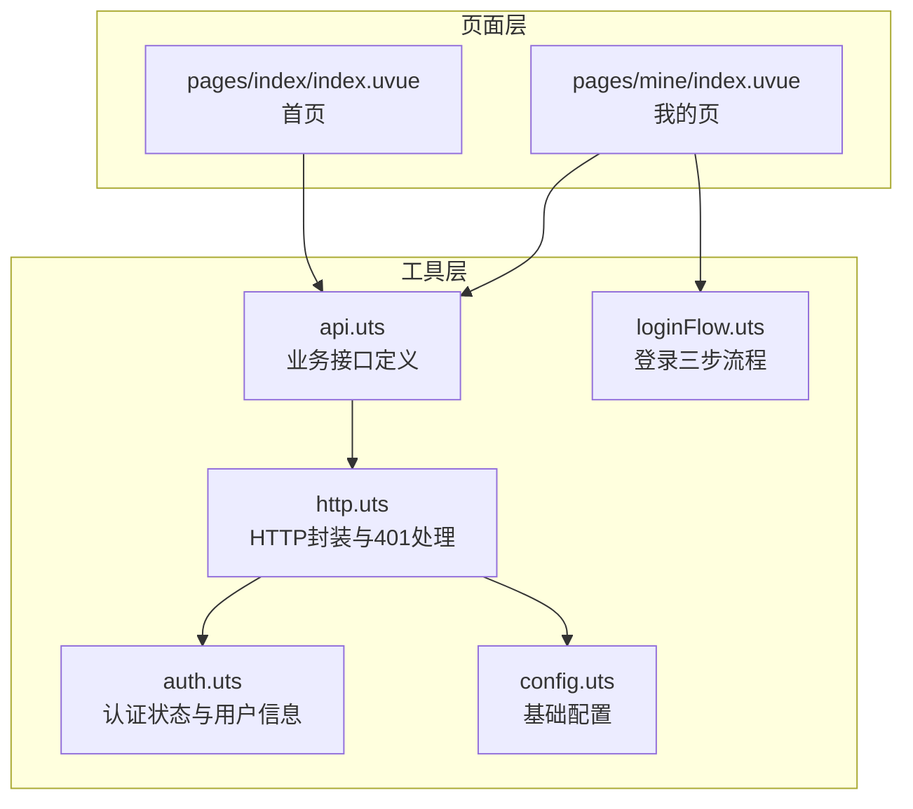
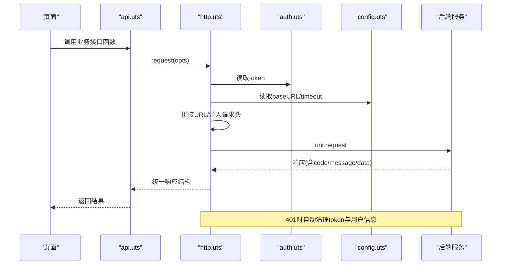
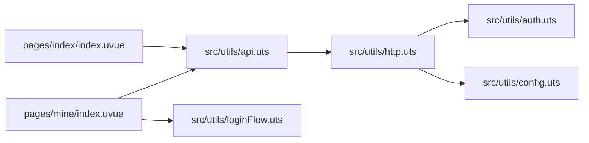

# API接口参考

<cite>
**本文档引用的文件**
- [src/utils/api.uts](file://src/utils/api.uts)
- [src/utils/http.uts](file://src/utils/http.uts)
- [src/utils/auth.uts](file://src/utils/auth.uts)
- [src/utils/config.uts](file://src/utils/config.uts)
- [src/utils/loginFlow.uts](file://src/utils/loginFlow.uts)
- [.specanchor/modules/src-utils-api.spec.md](file://.specanchor/modules/src-utils-api.spec.md)
- [.specanchor/modules/src-utils.spec.md](file://.specanchor/modules/src-utils.spec.md)
- [src/pages/index/index.uvue](file://src/pages/index/index.uvue)
- [src/pages/mine/index.uvue](file://src/pages/mine/index.uvue)
- [package.json](file://package.json)
</cite>

## 目录
1. [简介](#简介)
2. [项目结构](#项目结构)
3. [核心组件](#核心组件)
4. [架构总览](#架构总览)
5. [详细组件分析](#详细组件分析)
6. [依赖关系分析](#依赖关系分析)
7. [性能考量](#性能考量)
8. [故障排查指南](#故障排查指南)
9. [结论](#结论)
10. [附录](#附录)

## 简介
本文件为“蓝莓”小程序项目的后端API接口参考文档，面向前后端开发者，提供完整的RESTful API规范、认证与权限控制说明、数据模型、调用示例与最佳实践。文档基于前端仓库中的接口定义与工具模块生成，确保接口使用的一致性与正确性。

## 项目结构
本项目采用“工具层 + 页面层”的组织方式：
- 工具层：统一的HTTP封装、认证状态管理、接口定义
- 页面层：业务页面通过导入工具层接口完成数据交互

图表来源
- [src/utils/http.uts:1-82](file://src/utils/http.uts#L1-L82)
- [src/utils/auth.uts:1-149](file://src/utils/auth.uts#L1-L149)
- [src/utils/api.uts:1-312](file://src/utils/api.uts#L1-L312)
- [src/utils/config.uts:1-12](file://src/utils/config.uts#L1-L12)
- [src/utils/loginFlow.uts:1-71](file://src/utils/loginFlow.uts#L1-L71)
- [src/pages/index/index.uvue:111-157](file://src/pages/index/index.uvue#L111-L157)
- [src/pages/mine/index.uvue:136-200](file://src/pages/mine/index.uvue#L136-L200)

章节来源
- [src/utils/api.uts:1-312](file://src/utils/api.uts#L1-L312)
- [src/utils/http.uts:1-82](file://src/utils/http.uts#L1-L82)
- [src/utils/auth.uts:1-149](file://src/utils/auth.uts#L1-L149)
- [src/utils/config.uts:1-12](file://src/utils/config.uts#L1-L12)
- [src/utils/loginFlow.uts:1-71](file://src/utils/loginFlow.uts#L1-L71)
- [src/pages/index/index.uvue:111-157](file://src/pages/index/index.uvue#L111-L157)
- [src/pages/mine/index.uvue:136-200](file://src/pages/mine/index.uvue#L136-L200)

## 核心组件
- HTTP封装与请求头注入：统一处理baseURL拼接、Content-Type、X-App-Code、Authorization（Bearer token），并在401时自动清理认证状态并提示。
- 认证状态管理：提供token与用户信息的存储、合并写入、登录状态判断与登出。
- 业务接口定义：集中定义所有RESTful接口，统一响应结构与调用约定。
- 登录流程封装：提供登录三步流程（静默登录→换取token→绑定手机），并处理部分字段补齐。

章节来源
- [src/utils/http.uts:1-82](file://src/utils/http.uts#L1-L82)
- [src/utils/auth.uts:1-149](file://src/utils/auth.uts#L1-L149)
- [src/utils/api.uts:1-312](file://src/utils/api.uts#L1-L312)
- [src/utils/loginFlow.uts:1-71](file://src/utils/loginFlow.uts#L1-L71)

## 架构总览
下图展示了从前端调用到后端接口的整体交互流程，以及认证与权限控制的关键节点。

图表来源
- [src/utils/api.uts:1-312](file://src/utils/api.uts#L1-L312)
- [src/utils/http.uts:1-82](file://src/utils/http.uts#L1-L82)
- [src/utils/auth.uts:1-149](file://src/utils/auth.uts#L1-L149)
- [src/utils/config.uts:1-12](file://src/utils/config.uts#L1-L12)

## 详细组件分析

### 通用响应结构与调用约定
- 统一响应结构：所有接口返回统一结构，仅当code为200时使用data，其余情况以message提示。
- 调用约定：
  - 统一使用await并配合try/catch处理异常（401由http.uts统一处理）。
  - 所有接口showLoading默认false，由页面自行控制loading UI。
  - 参数透传与逗号拼接ID等约定详见接口清单。

章节来源
- [.specanchor/modules/src-utils-api.spec.md:22-35](file://.specanchor/modules/src-utils-api.spec.md#L22-L35)
- [.specanchor/modules/src-utils-api.spec.md:124-134](file://.specanchor/modules/src-utils-api.spec.md#L124-L134)

### 认证机制与权限控制
- 认证方式：Bearer Token，由http.uts在请求头自动注入。
- 登录状态：通过getToken动态读取，isLoggedIn统一判断。
- 401处理：http.uts在收到401时自动清理token与用户信息，并提示“登录已过期”。
- 权限要求：
  - 公开接口：轮播图、客片分类与列表、客片详情、搜索、店铺列表、中台配置。
  - 需登录：用户信息获取与更新、点赞/收藏相关、我的收藏列表。

章节来源
- [src/utils/http.uts:20-73](file://src/utils/http.uts#L20-L73)
- [src/utils/auth.uts:125-128](file://src/utils/auth.uts#L125-L128)
- [.specanchor/modules/src-utils-api.spec.md:130-134](file://.specanchor/modules/src-utils-api.spec.md#L130-L134)

### 数据模型
- 用户信息：包含id、openid、phone、nickname、avatarUrl。
- 客片基础信息：包含id、title、coverImageUrl、shopId、price、likeCount。
- 店铺信息：包含id、shopName、displayName、displayNameEn、homeImage、priceImage、sortOrder。
- 搜索分页结果：包含list、total、page、pageSize、totalPages。

章节来源
- [src/utils/api.uts:6-72](file://src/utils/api.uts#L6-L72)
- [.specanchor/modules/src-utils-api.spec.md:36-73](file://.specanchor/modules/src-utils-api.spec.md#L36-L73)

### 接口清单与规范

#### 轮播图与客片
- 获取轮播图（公开）
  - 方法：GET
  - 路径：/wechat/carousels
  - 入参：{ type }
  - 出参：轮播图列表
  - 说明：首页type=0，价目表type=<shopId>
- 客片分类（公开）
  - 方法：GET
  - 路径：/wechat/categories
  - 入参：{ shopId }
  - 出参：两级分类树
- 客片列表（公开，支持分页与搜索）
  - 方法：GET
  - 路径：/wechat/albums
  - 入参：{ shopId, parentId?, childId?, subName?, keyword?, page?, size? }
  - 出参：{ albums, total, page, size }
  - 说明：子分类query对象透传（parentId/childId/subName等）
- 客片详情（公开）
  - 方法：动态
  - 路径：/wechat/album/detail
  - 入参：{ albumId, type }
  - 说明：type即shopId，缺失将导致400

章节来源
- [src/utils/api.uts:28-122](file://src/utils/api.uts#L28-L122)
- [.specanchor/modules/src-utils-api.spec.md:77-85](file://.specanchor/modules/src-utils-api.spec.md#L77-L85)

#### 微信登录与用户
- 微信登录（换取token）
  - 方法：POST
  - 路径：/api/wx/login
  - 入参：{ code, nickname?, avatarUrl? }
  - 出参：{ token, userInfo }
  - 说明：登录成功后调用loginSuccess保存token与用户信息
- 绑定手机号（需登录）
  - 方法：POST
  - 路径：/api/wx/phone
  - 入参：{ code }
  - 出参：用户信息（含phone）
- 获取当前用户信息（需登录）
  - 方法：GET
  - 路径：/api/wx/userinfo
  - 入参：无
  - 出参：用户信息
- 更新当前用户信息（需登录）
  - 方法：PUT
  - 路径：/api/wx/userinfo
  - 入参：{ nickname?, avatarUrl? }（空字符串/undefined字段会被过滤）
  - 出参：更新后的用户信息

章节来源
- [src/utils/api.uts:129-190](file://src/utils/api.uts#L129-L190)
- [src/utils/loginFlow.uts:27-65](file://src/utils/loginFlow.uts#L27-L65)
- [.specanchor/modules/src-utils-api.spec.md:87-95](file://.specanchor/modules/src-utils-api.spec.md#L87-L95)

#### 点赞
- 点赞/取消点赞（需登录）
  - 方法：POST
  - 路径：/api/like
  - 入参：{ albumId }
  - 出参：{ liked, likeCount }
- 批量查询点赞状态（需登录）
  - 方法：GET
  - 路径：/api/like/status
  - 入参：{ albumIds }（逗号拼接）
  - 出参：数组[{ albumId, liked, likeCount }]

章节来源
- [src/utils/api.uts:197-205](file://src/utils/api.uts#L197-L205)
- [src/utils/api.uts:210-218](file://src/utils/api.uts#L210-L218)
- [.specanchor/modules/src-utils-api.spec.md:96-102](file://.specanchor/modules/src-utils-api.spec.md#L96-L102)

#### 收藏
- 收藏/取消收藏（需登录）
  - 方法：POST
  - 路径：/api/favorite
  - 入参：{ albumId }
  - 出参：{ favorited }
- 批量查询收藏状态（需登录）
  - 方法：GET
  - 路径：/api/favorite/status
  - 入参：{ albumIds }（逗号拼接）
  - 出参：数组[{ albumId, favorited }]
- 我的收藏列表（需登录，支持门店筛选）
  - 方法：GET
  - 路径：/api/favorite/list
  - 入参：{ shopId? }
  - 出参：AlbumBasic[]（一次性返回全部，无分页）

章节来源
- [src/utils/api.uts:225-233](file://src/utils/api.uts#L225-L233)
- [src/utils/api.uts:238-259](file://src/utils/api.uts#L238-L259)
- [.specanchor/modules/src-utils-api.spec.md:103-110](file://.specanchor/modules/src-utils-api.spec.md#L103-L110)

#### 搜索
- 相册模糊搜索（公开）
  - 方法：GET
  - 路径：/api/search
  - 入参：{ keyword, page, size }
  - 出参：SearchPageResult

章节来源
- [src/utils/api.uts:275-283](file://src/utils/api.uts#L275-L283)
- [.specanchor/modules/src-utils-api.spec.md:111-116](file://.specanchor/modules/src-utils-api.spec.md#L111-L116)

#### 店铺与中台配置
- 获取启用的店铺列表（公开）
  - 方法：GET
  - 路径：/api/shops
  - 入参：无
  - 出参：ShopInfo[]
- 获取中台页配置（公开）
  - 方法：GET
  - 路径：/api/page-config
  - 入参：无
  - 出参：{ menuItems, banners } 或 items 数组

章节来源
- [src/utils/api.uts:290-297](file://src/utils/api.uts#L290-L297)
- [src/utils/api.uts:304-311](file://src/utils/api.uts#L304-L311)
- [.specanchor/modules/src-utils-api.spec.md:117-122](file://.specanchor/modules/src-utils-api.spec.md#L117-L122)

### 接口调用示例与最佳实践
- 标准调用模式：使用await并检查code，成功时使用data，失败时toast提示。
- 合并写入用户信息：当接口返回字段不全时，使用mergeUserInfo避免覆盖已有字段。
- 登录三步流程：静默登录→换取token→绑定手机号，失败不影响登录状态，后续引导补齐资料。

章节来源
- [.specanchor/modules/src-utils-api.spec.md:135-164](file://.specanchor/modules/src-utils-api.spec.md#L135-L164)
- [src/utils/loginFlow.uts:27-65](file://src/utils/loginFlow.uts#L27-L65)

### 版本管理与兼容性
- 模块版本：工具模块与业务API模块均带有版本号，便于追踪变更。
- 兼容性：历史接口如/getalbum已废弃，推荐使用/getCategories + /getAlbums组合；参数透传遵循新接口约定。

章节来源
- [.specanchor/modules/src-utils.spec.md:1-10](file://.specanchor/modules/src-utils.spec.md#L1-L10)
- [.specanchor/modules/src-utils-api.spec.md:1-10](file://.specanchor/modules/src-utils-api.spec.md#L1-L10)
- [src/utils/api.uts:38-47](file://src/utils/api.uts#L38-L47)

## 依赖关系分析
- 页面对工具层的依赖：页面通过导入api.uts中的函数完成数据交互，不直接操作HTTP细节。
- 工具层内部依赖：api.uts依赖http.uts；http.uts依赖auth.uts与config.uts。
- 登录流程：mine页面依赖loginFlow.uts执行登录三步流程。

图表来源
- [src/pages/index/index.uvue:111-157](file://src/pages/index/index.uvue#L111-L157)
- [src/pages/mine/index.uvue:136-200](file://src/pages/mine/index.uvue#L136-L200)
- [src/utils/api.uts:1-312](file://src/utils/api.uts#L1-L312)
- [src/utils/http.uts:1-82](file://src/utils/http.uts#L1-L82)
- [src/utils/auth.uts:1-149](file://src/utils/auth.uts#L1-L149)
- [src/utils/config.uts:1-12](file://src/utils/config.uts#L1-L12)
- [src/utils/loginFlow.uts:1-71](file://src/utils/loginFlow.uts#L1-L71)

章节来源
- [src/pages/index/index.uvue:111-157](file://src/pages/index/index.uvue#L111-L157)
- [src/pages/mine/index.uvue:136-200](file://src/pages/mine/index.uvue#L136-L200)
- [src/utils/api.uts:1-312](file://src/utils/api.uts#L1-L312)
- [src/utils/http.uts:1-82](file://src/utils/http.uts#L1-L82)
- [src/utils/auth.uts:1-149](file://src/utils/auth.uts#L1-L149)
- [src/utils/config.uts:1-12](file://src/utils/config.uts#L1-L12)
- [src/utils/loginFlow.uts:1-71](file://src/utils/loginFlow.uts#L1-L71)

## 性能考量
- 请求并发：首页并行加载轮播图与店铺列表，减少首屏等待时间。
- 分页与搜索：客片列表支持分页与关键词搜索，避免一次性拉取大量数据。
- 401自动处理：统一401处理降低重复逻辑与错误处理成本。
- 超时控制：统一超时时间（15秒），个别长请求可在调用方额外控制。

章节来源
- [src/pages/index/index.uvue:142-145](file://src/pages/index/index.uvue#L142-L145)
- [src/utils/http.uts:39-40](file://src/utils/http.uts#L39-L40)
- [.specanchor/modules/src-utils.spec.md:45-54](file://.specanchor/modules/src-utils.spec.md#L45-L54)

## 故障排查指南
- 401未授权：检查token是否过期或丢失，确认http.uts已自动清理并提示“登录已过期”。
- 登录失败：检查wxLogin返回的错误信息，确认微信appId/appSecret配置。
- 用户信息不更新：使用mergeUserInfo合并写入，避免setUserInfo覆盖已有字段。
- 登录流程异常：runPhoneLogin内部捕获异常并返回错误类型，调用方可据此提示或重试。

章节来源
- [src/utils/http.uts:50-61](file://src/utils/http.uts#L50-L61)
- [.specanchor/archive/src-api-wechat.spec.md:61-69](file://.specanchor/archive/src-api-wechat.spec.md#L61-L69)
- [src/utils/auth.uts:92-106](file://src/utils/auth.uts#L92-L106)
- [src/utils/loginFlow.uts:66-69](file://src/utils/loginFlow.uts#L66-L69)

## 结论
本接口参考文档基于前端仓库中的接口定义与工具模块，提供了统一的认证与权限控制、清晰的数据模型、详尽的接口清单与调用约定。建议前后端在对接时严格遵循文档规范，确保接口使用的正确性与一致性，并结合最佳实践提升性能与稳定性。

## 附录
- 项目脚本与依赖：用于构建与发布小程序，与API对接无直接关系。
- 规范与标准：HTTP调用约定、认证状态约定、协议命名约定等。

章节来源
- [package.json:1-48](file://package.json#L1-L48)
- [.specanchor/global/coding-standards.spec.md:51-82](file://.specanchor/global/coding-standards.spec.md#L51-L82)
