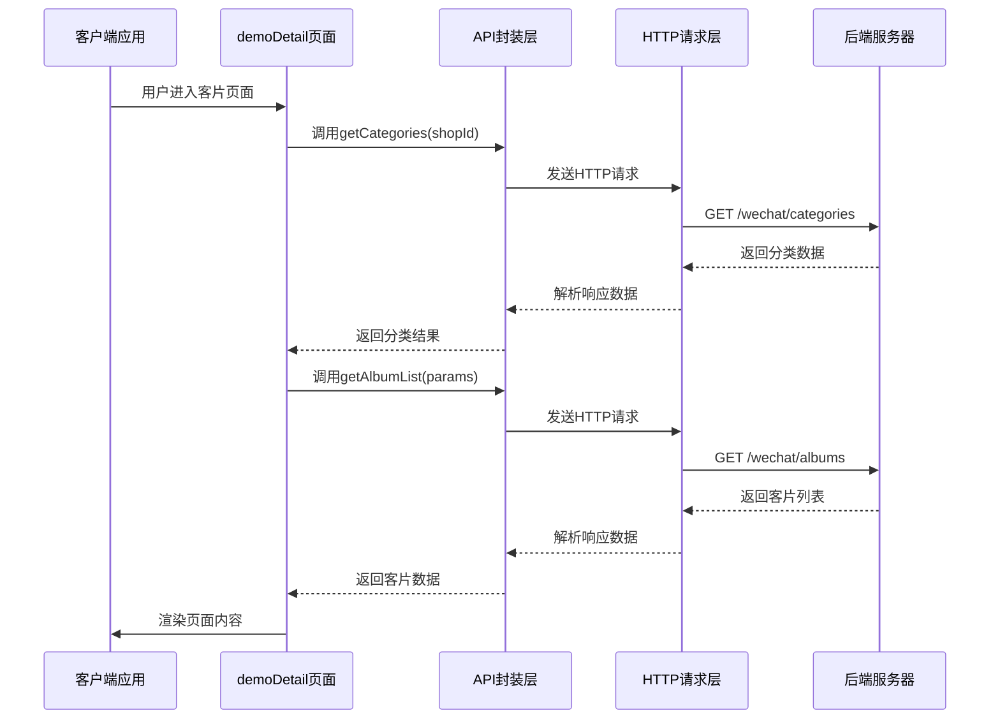
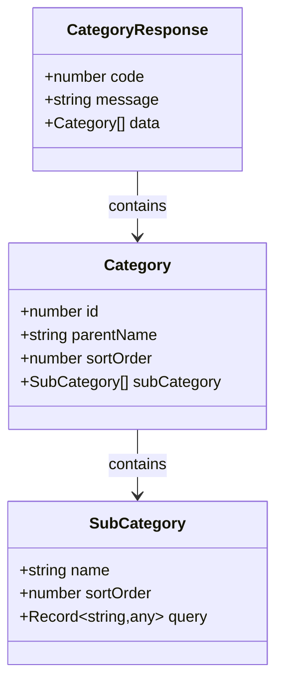
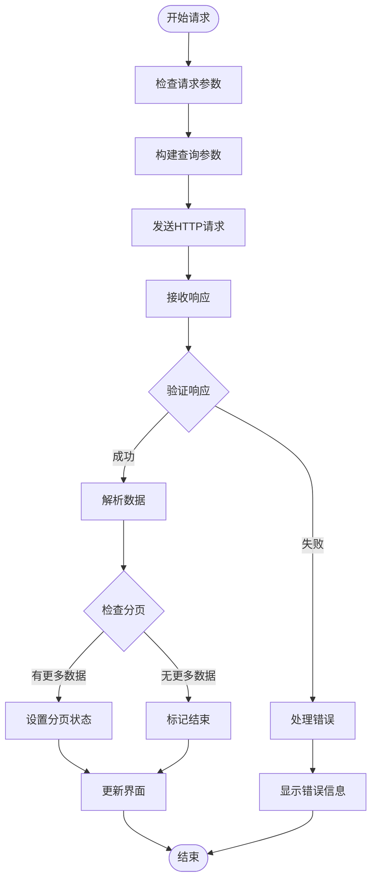
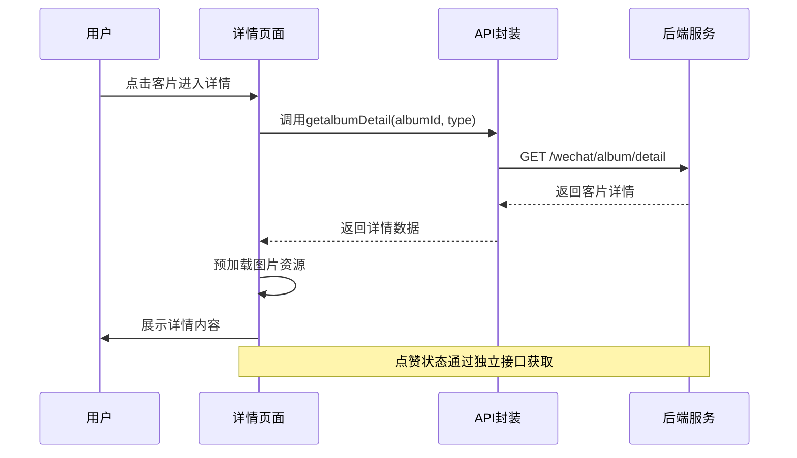
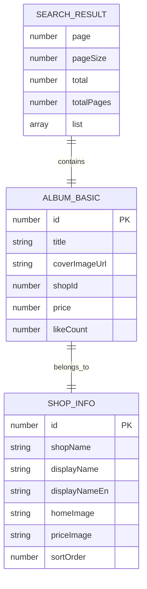
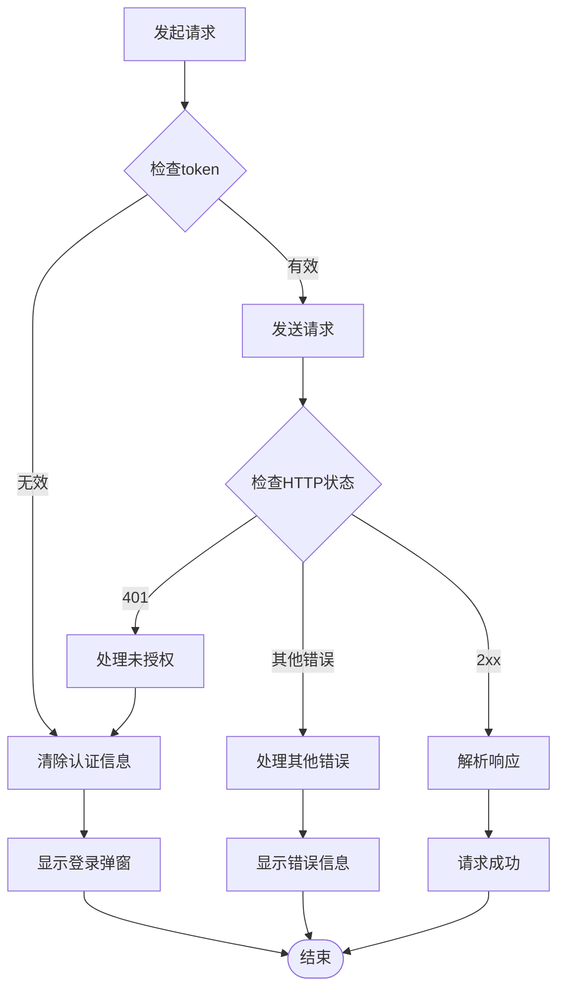

# 客片管理接口

<cite>
**本文档引用的文件**
- [api.uts](file://src/utils/api.uts)
- [http.uts](file://src/utils/http.uts)
- [config.uts](file://src/utils/config.uts)
- [demoDetail/index.uvue](file://src/pages/demoDetail/index.uvue)
- [targetPhotoDetail/index.uvue](file://src/pages/targetPhotoDetail/index.uvue)
- [auth.uts](file://src/utils/auth.uts)
- [favorites/index.uvue](file://src/pages/favorites/index.uvue)
</cite>

## 目录
1. [简介](#简介)
2. [项目结构](#项目结构)
3. [核心组件](#核心组件)
4. [架构概览](#架构概览)
5. [详细组件分析](#详细组件分析)
6. [依赖关系分析](#依赖关系分析)
7. [性能考虑](#性能考虑)
8. [故障排除指南](#故障排除指南)
9. [结论](#结论)

## 简介

本文档详细说明了客片管理相关的三个核心API接口：客片分类获取接口(getCategories)、客片列表获取接口(getAlbumList)、客片详情获取接口(getalbumDetail)。这些接口构成了客片展示和浏览系统的基础功能，支持分类浏览、搜索、分页加载等核心业务场景。

客片管理系统采用前后端分离架构，前端通过HTTP请求调用后端API，后端提供RESTful接口服务。系统支持公开访问和需要登录的混合模式，确保用户体验的同时保证数据安全。

## 项目结构

客片管理功能主要分布在以下目录结构中：

```mermaid
graph TB
subgraph "前端应用结构"
Utils[utils/]
Pages[pages/]
Components[components/]
end
subgraph "工具层"
API[api.uts<br/>API接口封装]
HTTP[http.uts<br/>HTTP请求封装]
AUTH[auth.uts<br/>认证管理]
CONFIG[config.uts<br/>配置管理]
end
subgraph "页面层"
DEMO[demoDetail/<br/>客片分类页面]
DETAIL[targetPhotoDetail/<br/>客片详情页面]
FAVORITES[favorites/<br/>收藏页面]
end
subgraph "后端接口"
CATEGORIES[/wechat/categories<br/>客片分类]
ALBUMS[/wechat/albums<br/>客片列表]
DETAIL_API[/wechat/album/detail<br/>客片详情]
end
Utils --> API
API --> HTTP
API --> AUTH
DEMO --> API
DETAIL --> API
FAVORITES --> API
API --> CATEGORIES
API --> ALBUMS
API --> DETAIL_API
```

**图表来源**
- [api.uts:1-312](file://src/utils/api.uts#L1-L312)
- [http.uts:1-82](file://src/utils/http.uts#L1-L82)
- [demoDetail/index.uvue:1-897](file://src/pages/demoDetail/index.uvue#L1-L897)

**章节来源**
- [api.uts:1-312](file://src/utils/api.uts#L1-L312)
- [http.uts:1-82](file://src/utils/http.uts#L1-L82)
- [config.uts:1-12](file://src/utils/config.uts#L1-L12)

## 核心组件

客片管理系统的三个核心API组件如下：

### 1. 客片分类获取接口 (getCategories)

该接口用于获取客片的两级分类结构，支持公开访问，无需登录即可使用。

**接口规范：**
- HTTP方法：GET
- URL路径：/wechat/categories
- 访问权限：公开（无需登录）
- 请求参数：shopId (必需，字符串或数字)

**响应格式：**
```typescript
{
  code: number,
  message: string,
  data: Array<{
    id: number,
    parentName: string,
    sortOrder?: number,
    subCategory: Array<{
      name: string,
      sortOrder?: number,
      query: Record<string, any>
    }>
  }>
}
```

### 2. 客片列表获取接口 (getAlbumList)

该接口用于获取客片列表，支持分页和搜索功能，参数通过分类查询对象透传。

**接口规范：**
- HTTP方法：GET
- URL路径：/wechat/albums
- 访问权限：公开（无需登录）
- 请求参数：
  - shopId: string | number (必需)
  - 其余参数由子分类 query 对象透传
  - keyword: string (可选，搜索关键词)
  - page: number (可选，默认1)
  - size: number (可选，默认10)

**响应格式：**
```typescript
{
  code: number,
  message: string,
  data: {
    albums: Array<{
      id: number,
      title: string,
      coverImageUrl: string,
      price: number,
      packageDesc: string,
      likeCount: number,
      liked: boolean
    }>,
    total: number,
    page: number,
    size: number
  }
}
```

### 3. 客片详情获取接口 (getalbumDetail)

该接口用于获取客片的详细信息，需要提供完整的参数信息。

**接口规范：**
- HTTP方法：GET
- URL路径：/wechat/album/detail
- 访问权限：公开（无需登录）
- 请求参数：
  - albumId: string | number (必需)
  - type: string | number (必需，即shopId)

**响应格式：**
标准的API响应结构，包含客片详细信息和相关统计数据。

**章节来源**
- [api.uts:55-122](file://src/utils/api.uts#L55-L122)

## 架构概览

客片管理系统的整体架构采用分层设计，确保功能模块的清晰分离和良好的可维护性。



**图表来源**
- [demoDetail/index.uvue:304-386](file://src/pages/demoDetail/index.uvue#L304-L386)
- [api.uts:55-122](file://src/utils/api.uts#L55-L122)
- [http.uts:20-73](file://src/utils/http.uts#L20-L73)

## 详细组件分析

### 客片分类层级结构

客片分类采用两级结构设计，提供清晰的分类层次：



**图表来源**
- [api.uts:62-76](file://src/utils/api.uts#L62-L76)

#### 查询参数传递机制

每个子分类包含一个`query`对象，用于向客片列表接口传递筛选参数：

| 参数名称 | 类型 | 必填 | 描述 |
|---------|------|------|------|
| shopId | string/number | 是 | 店铺标识，必须与分类接口参数一致 |
| parentId | string/number | 否 | 父级分类ID |
| childId | string/number | 否 | 子级分类ID |
| subName | string | 否 | 子分类名称 |
| keyword | string | 否 | 搜索关键词 |
| page | number | 否 | 页码，默认1 |
| size | number | 否 | 每页数量，默认10 |

### 客片列表分页机制

客片列表接口支持完整的分页功能，确保大数据量下的良好性能：



**图表来源**
- [demoDetail/index.uvue:345-386](file://src/pages/demoDetail/index.uvue#L345-L386)
- [demoDetail/index.uvue:417-456](file://src/pages/demoDetail/index.uvue#L417-L456)

#### 分页数据结构

响应数据包含完整的分页信息：

| 字段名称 | 类型 | 描述 |
|---------|------|------|
| albums | Array | 客片列表数据 |
| total | number | 总记录数 |
| page | number | 当前页码 |
| size | number | 每页大小 |

### 客片详情接口

客片详情接口提供详细的客片信息，支持点赞状态的实时更新：



**图表来源**
- [targetPhotoDetail/index.uvue:149-174](file://src/pages/targetPhotoDetail/index.uvue#L149-L174)

**章节来源**
- [api.uts:55-122](file://src/utils/api.uts#L55-L122)
- [demoDetail/index.uvue:304-386](file://src/pages/demoDetail/index.uvue#L304-L386)
- [targetPhotoDetail/index.uvue:149-174](file://src/pages/targetPhotoDetail/index.uvue#L149-L174)

## 依赖关系分析

客片管理接口的依赖关系体现了清晰的分层架构：

```mermaid
graph TB
subgraph "页面层"
DemoPage[demoDetail/index.uvue]
DetailPage[targetPhotoDetail/index.uvue]
FavoritesPage[favorites/index.uvue]
end
subgraph "API封装层"
APIUtils[src/utils/api.uts]
HTTPUtils[src/utils/http.uts]
AuthUtils[src/utils/auth.uts]
end
subgraph "配置层"
ConfigUtils[src/utils/config.uts]
end
subgraph "后端服务"
CategoriesAPI[/wechat/categories]
AlbumsAPI[/wechat/albums]
DetailAPI[/wechat/album/detail]
end
DemoPage --> APIUtils
DetailPage --> APIUtils
FavoritesPage --> APIUtils
APIUtils --> HTTPUtils
APIUtils --> AuthUtils
HTTPUtils --> ConfigUtils
APIUtils --> CategoriesAPI
APIUtils --> AlbumsAPI
APIUtils --> DetailAPI
```

**图表来源**
- [api.uts:1-312](file://src/utils/api.uts#L1-L312)
- [http.uts:1-82](file://src/utils/http.uts#L1-L82)
- [auth.uts:1-149](file://src/utils/auth.uts#L1-L149)
- [config.uts:1-12](file://src/utils/config.uts#L1-L12)

### 数据模型

客片管理涉及多个核心数据模型：



**图表来源**
- [api.uts:6-23](file://src/utils/api.uts#L6-L23)
- [api.uts:267-273](file://src/utils/api.uts#L267-L273)

**章节来源**
- [api.uts:1-312](file://src/utils/api.uts#L1-L312)
- [auth.uts:1-149](file://src/utils/auth.uts#L1-L149)

## 性能考虑

### 1. 图片预加载优化

系统实现了智能的图片预加载机制，提升用户体验：

- **首屏预加载**：客片列表页会预加载前6张封面图，确保页面渲染流畅
- **详情页预加载**：详情页会预加载前3张详情图片，减少用户等待时间
- **超时保护**：预加载设置超时时间，避免长时间等待影响用户体验

### 2. 分页加载策略

- **懒加载实现**：滚动触底时自动加载下一页数据
- **状态管理**：通过`noMore`标志位防止重复请求
- **内存优化**：分页加载避免一次性加载大量数据

### 3. 缓存机制

- **本地存储**：用户登录状态和基本信息存储在本地
- **请求缓存**：合理利用HTTP缓存机制减少重复请求
- **图片缓存**：浏览器自动缓存已加载的图片资源

## 故障排除指南

### 1. 常见问题及解决方案

| 问题类型 | 症状描述 | 可能原因 | 解决方案 |
|---------|---------|---------|---------|
| 分类加载失败 | 页面空白或显示错误 | 网络请求失败或参数错误 | 检查网络连接，验证shopId参数 |
| 列表分页异常 | 无法加载更多数据 | 分页参数错误或服务器限制 | 检查page和size参数，确认total计算 |
| 详情加载失败 | 详情页面空白 | albumId或type参数缺失 | 确保传递正确的albumId和type参数 |
| 点赞功能失效 | 点赞按钮无反应 | 未登录或token过期 | 检查登录状态，重新登录 |

### 2. 错误处理机制

系统实现了完善的错误处理机制：



**图表来源**
- [http.uts:50-61](file://src/utils/http.uts#L50-L61)

### 3. 开发调试建议

- **网络监控**：使用浏览器开发者工具监控API请求和响应
- **日志输出**：在关键节点添加console.log输出便于调试
- **错误边界**：为异步操作添加try-catch处理
- **状态检查**：定期检查用户登录状态和token有效性

**章节来源**
- [http.uts:50-73](file://src/utils/http.uts#L50-L73)
- [demoDetail/index.uvue:478-499](file://src/pages/demoDetail/index.uvue#L478-L499)

## 结论

客片管理接口系统提供了完整的客片浏览和管理功能，具有以下特点：

1. **清晰的分层架构**：API封装层、HTTP请求层、页面层职责分明
2. **完整的功能覆盖**：支持分类浏览、搜索、分页、详情展示等核心功能
3. **良好的性能表现**：通过预加载、分页、缓存等机制优化用户体验
4. **健壮的错误处理**：完善的错误捕获和用户提示机制
5. **灵活的扩展性**：基于查询参数透传的设计便于功能扩展

该系统为客片展示和管理提供了稳定可靠的技术基础，开发者可以在此基础上进行功能扩展和性能优化。
