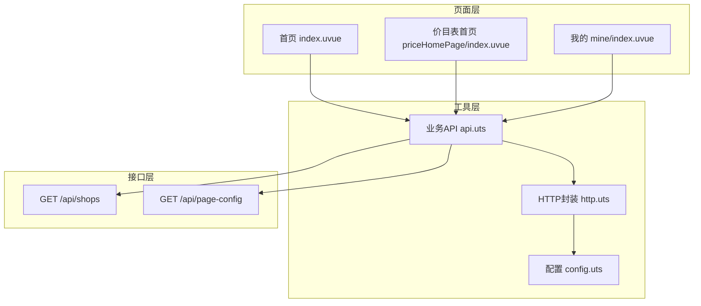
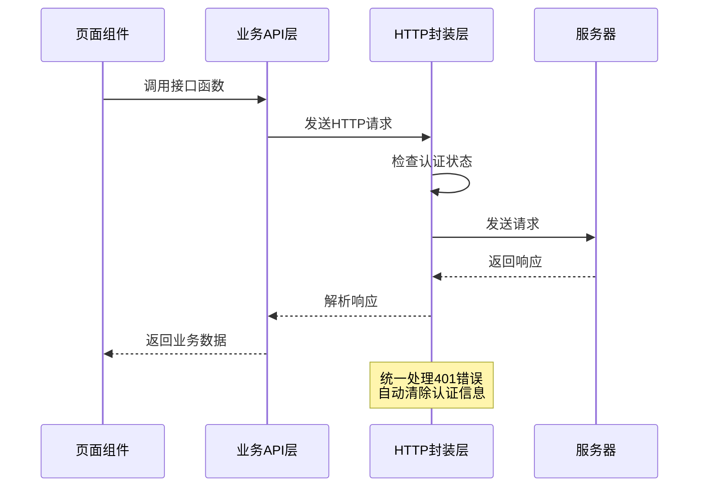
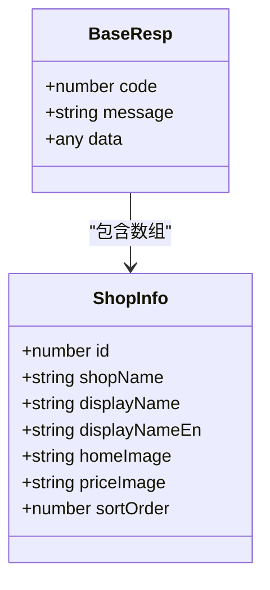
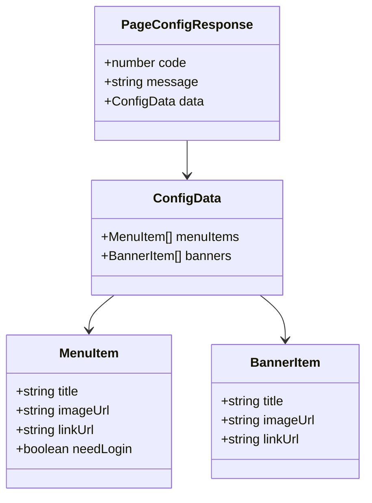
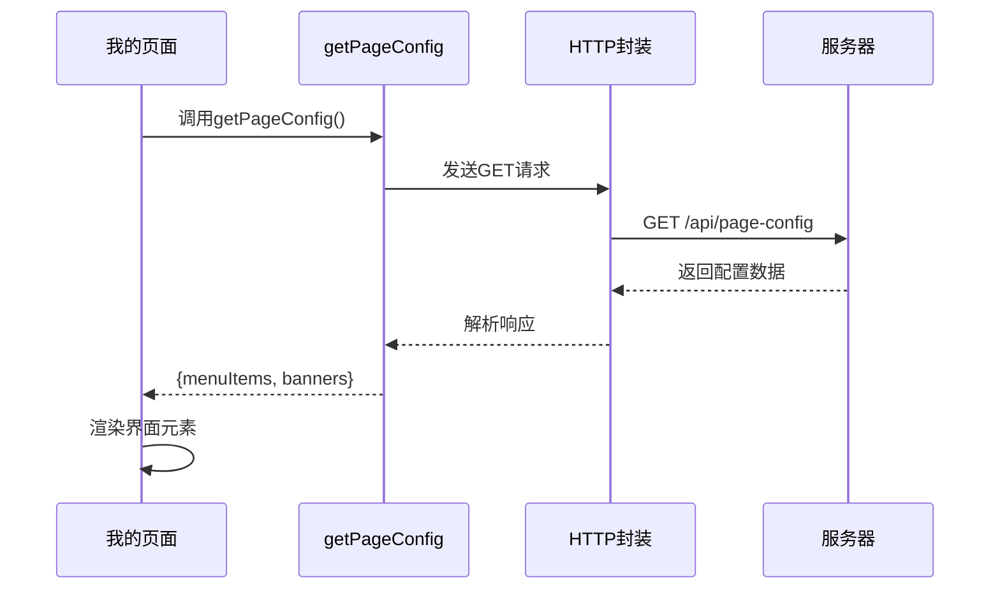
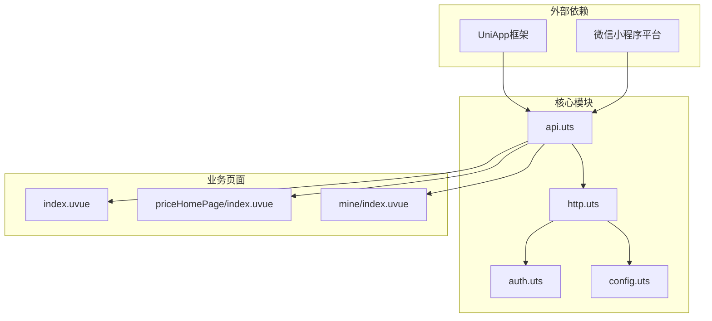
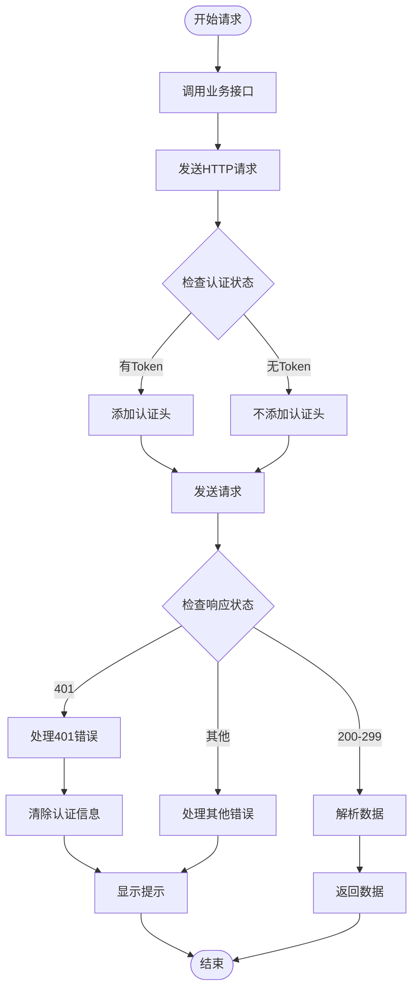

# 店铺管理接口

<cite>
**本文档引用的文件**
- [api.uts](file://src/utils/api.uts)
- [http.uts](file://src/utils/http.uts)
- [config.uts](file://src/utils/config.uts)
- [src-utils-api.spec.md](file://.specanchor/modules/src-utils-api.spec.md)
- [src-pages-price.spec.md](file://.specanchor/modules/src-pages-price.spec.md)
- [index.uvue](file://src/pages/index/index.uvue)
- [mine/index.uvue](file://src/pages/mine/index.uvue)
- [priceHomePage/index.uvue](file://src/pages/priceHomePage/index.uvue)
</cite>

## 目录
1. [简介](#简介)
2. [项目结构](#项目结构)
3. [核心组件](#核心组件)
4. [架构概览](#架构概览)
5. [详细组件分析](#详细组件分析)
6. [依赖关系分析](#依赖关系分析)
7. [性能考虑](#性能考虑)
8. [故障排除指南](#故障排除指南)
9. [结论](#结论)

## 简介

本文档详细说明了蓝莓小程序项目中的店铺管理相关接口，包括店铺列表获取接口（getShops）和页面配置获取接口（getPageConfig）。这些接口是小程序的核心功能模块，负责为用户提供店铺信息展示和页面配置管理。

项目采用模块化架构设计，所有业务接口统一在 `src/utils/api.uts` 中定义，并通过 `src/utils/http.uts` 进行HTTP请求封装。接口遵循统一的响应格式，支持公开访问和需要登录的场景。

## 项目结构

项目采用分层架构，主要结构如下：



**图表来源**
- [api.uts:1-312](file://src/utils/api.uts#L1-L312)
- [http.uts:1-82](file://src/utils/http.uts#L1-L82)
- [config.uts:1-11](file://src/utils/config.uts#L1-L11)

**章节来源**
- [api.uts:1-312](file://src/utils/api.uts#L1-L312)
- [http.uts:1-82](file://src/utils/http.uts#L1-L82)
- [config.uts:1-11](file://src/utils/config.uts#L1-L11)

## 核心组件

### HTTP请求封装层

HTTP请求封装层提供了统一的网络请求处理机制，包括：

- **基础URL拼接**：自动处理相对路径和绝对路径
- **认证头注入**：动态获取并注入Bearer Token
- **请求头管理**：统一设置Content-Type和X-App-Code
- **错误处理**：统一处理401未授权错误和网络异常
- **超时控制**：支持自定义超时时间

### 业务API层

业务API层集中定义了所有业务接口，采用函数式编程模式：

- **接口定义**：每个业务接口对应一个独立函数
- **类型安全**：使用TypeScript接口定义请求和响应数据结构
- **错误处理**：统一的错误处理和响应格式
- **认证要求**：明确标注公开接口和需要登录的接口

**章节来源**
- [api.uts:285-311](file://src/utils/api.uts#L285-L311)
- [http.uts:20-73](file://src/utils/http.uts#L20-L73)

## 架构概览

系统采用分层架构，各层职责清晰分离：



**图表来源**
- [api.uts:290-310](file://src/utils/api.uts#L290-L310)
- [http.uts:40-72](file://src/utils/http.uts#L40-L72)

## 详细组件分析

### 店铺列表获取接口 (getShops)

#### 接口规范

| 属性 | 说明 |
|------|------|
| **函数名** | `getShops()` |
| **HTTP方法** | GET |
| **URL路径** | `/api/shops` |
| **认证要求** | 公开访问（无需登录） |
| **请求参数** | 无 |
| **响应格式** | `{ code: number, data: ShopInfo[] }` |

#### 数据模型定义



**图表来源**
- [api.uts:15-23](file://src/utils/api.uts#L15-L23)
- [api.uts:288-297](file://src/utils/api.uts#L288-L297)

#### 响应数据结构

| 字段名 | 类型 | 必填 | 描述 |
|--------|------|------|------|
| `code` | number | 是 | 响应状态码，200表示成功 |
| `data` | ShopInfo[] | 是 | 店铺信息数组 |
| `message` | string | 否 | 错误信息（当code非200时） |

ShopInfo对象字段说明：

| 字段名 | 类型 | 必填 | 描述 |
|--------|------|------|------|
| `id` | number | 是 | 店铺唯一标识符 |
| `shopName` | string | 是 | 店铺名称（用于路由跳转） |
| `displayName` | string | 是 | 店铺显示名称 |
| `displayNameEn` | string | 是 | 店铺英文显示名称 |
| `homeImage` | string | 是 | 首页展示图片URL |
| `priceImage` | string | 是 | 价目表展示图片URL |
| `sortOrder` | number | 是 | 排序权重，数值越大排序越靠前 |

#### 使用示例

**请求示例**
```javascript
// 基本调用
const response = await getShops();
```

**响应示例**
```javascript
{
  "code": 200,
  "data": [
    {
      "id": 1,
      "shopName": "beijing",
      "displayName": "北京旗舰店",
      "displayNameEn": "Beijing Flagship Store",
      "homeImage": "https://cdn.example.com/shop1-home.jpg",
      "priceImage": "https://cdn.example.com/shop1-price.jpg",
      "sortOrder": 10
    }
  ]
}
```

#### 页面集成

多个页面会使用此接口：

```mermaid
graph LR
subgraph "使用页面"
Index[首页]
PriceHome[价目表首页]
DemoDetail[客片详情页]
end
subgraph "接口调用"
GetShops[getShops()]
end
Index --> GetShops
PriceHome --> GetShops
DemoDetail --> GetShops
```

**图表来源**
- [index.uvue:127-136](file://src/pages/index/index.uvue#L127-L136)
- [priceHomePage/index.uvue:44-55](file://src/pages/priceHomePage/index.uvue#L44-L55)

**章节来源**
- [api.uts:288-297](file://src/utils/api.uts#L288-L297)
- [src-pages-price.spec.md:29-29](file://.specanchor/modules/src-pages-price.spec.md#L29-L29)

### 页面配置获取接口 (getPageConfig)

#### 接口规范

| 属性 | 说明 |
|------|------|
| **函数名** | `getPageConfig()` |
| **HTTP方法** | GET |
| **URL路径** | `/api/page-config` |
| **认证要求** | 公开访问（无需登录） |
| **请求参数** | 无 |
| **响应格式** | `{ code: number, data: { menuItems: any[], banners: any[] } }` |

#### 数据模型定义



**图表来源**
- [api.uts:301-311](file://src/utils/api.uts#L301-L311)

#### 响应数据结构

| 字段名 | 类型 | 必填 | 描述 |
|--------|------|------|------|
| `code` | number | 是 | 响应状态码，200表示成功 |
| `data` | object | 是 | 配置数据对象 |
| `message` | string | 否 | 错误信息（当code非200时） |

ConfigData对象字段说明：

| 字段名 | 类型 | 必填 | 描述 |
|--------|------|------|------|
| `menuItems` | any[] | 是 | 金刚区菜单项数组 |
| `banners` | any[] | 是 | Banner轮播图数组 |

菜单项（MenuItem）字段：

| 字段名 | 类型 | 必填 | 描述 |
|--------|------|------|------|
| `title` | string | 是 | 菜单标题 |
| `imageUrl` | string | 是 | 菜单图标URL |
| `linkUrl` | string | 是 | 跳转链接 |
| `needLogin` | boolean | 是 | 是否需要登录 |

#### 使用示例

**请求示例**
```javascript
// 基本调用
const response = await getPageConfig();
```

**响应示例**
```javascript
{
  "code": 200,
  "data": {
    "menuItems": [
      {
        "title": "我的喜欢",
        "imageUrl": "/static/liked.svg",
        "linkUrl": "/pages/favorites/index",
        "needLogin": true
      }
    ],
    "banners": [
      {
        "title": "优惠活动",
        "imageUrl": "https://cdn.example.com/banner1.jpg",
        "linkUrl": "/pages/promotion/index"
      }
    ]
  }
}
```

#### 页面集成

主要在"我的"页面使用：



**图表来源**
- [mine/index.uvue:218-224](file://src/pages/mine/index.uvue#L218-L224)

**章节来源**
- [api.uts:301-311](file://src/utils/api.uts#L301-L311)
- [mine/index.uvue:218-224](file://src/pages/mine/index.uvue#L218-L224)

## 依赖关系分析

### 组件依赖图



**图表来源**
- [api.uts:1-3](file://src/utils/api.uts#L1-L3)
- [http.uts:1-2](file://src/utils/http.uts#L1-L2)

### 接口依赖关系

| 接口 | 依赖的页面 | 用途 |
|------|------------|------|
| `getShops` | 首页、价目表首页、客片详情页 | 获取店铺列表信息 |
| `getPageConfig` | 我的页面 | 获取页面配置信息 |

**章节来源**
- [src-pages-price.spec.md:43-46](file://.specanchor/modules/src-pages-price.spec.md#L43-L46)
- [index.uvue:97](file://src/pages/index/index.uvue#L97)
- [mine/index.uvue:138](file://src/pages/mine/index.uvue#L138)

## 性能考虑

### 请求优化策略

1. **并发请求**：首页同时发起轮播图和店铺列表请求，提升加载速度
2. **缓存机制**：接口返回的数据可在页面层面进行缓存
3. **错误降级**：接口调用失败时提供默认数据，保证用户体验

### 错误处理机制



**图表来源**
- [http.uts:47-72](file://src/utils/http.uts#L47-L72)

## 故障排除指南

### 常见问题及解决方案

#### 1. 接口调用失败

**症状**：接口返回非200状态码
**原因**：网络问题、服务器错误、参数错误
**解决方案**：
- 检查网络连接状态
- 查看服务器日志
- 验证请求参数格式

#### 2. 认证相关问题

**症状**：401未授权错误
**原因**：Token过期或无效
**解决方案**：
- 自动清除本地认证信息
- 引导用户重新登录
- 检查Token有效期

#### 3. 数据格式错误

**症状**：响应数据格式不符合预期
**原因**：后端数据结构变更
**解决方案**：
- 检查接口文档版本
- 更新前端数据模型
- 添加数据验证逻辑

**章节来源**
- [http.uts:50-61](file://src/utils/http.uts#L50-L61)

### 调试建议

1. **网络监控**：使用浏览器开发者工具监控网络请求
2. **日志记录**：在关键节点添加日志输出
3. **错误边界**：为异步操作添加try-catch处理
4. **超时设置**：合理设置请求超时时间

## 结论

蓝莓小程序项目的店铺管理接口设计遵循了清晰的分层架构原则，通过统一的API封装层实现了良好的代码复用性和可维护性。getShops和getPageConfig两个核心接口为小程序的主要功能模块提供了稳定的数据支撑。

接口设计具有以下特点：

- **统一的响应格式**：所有接口遵循相同的响应结构
- **明确的认证要求**：公开接口和需要登录的接口清晰分离
- **类型安全**：使用TypeScript接口确保数据结构正确性
- **错误处理**：完善的错误处理和降级机制
- **性能优化**：支持并发请求和缓存策略

开发者在使用这些接口时，应重点关注响应数据的验证、错误处理和用户体验优化，确保应用的稳定性和可靠性。