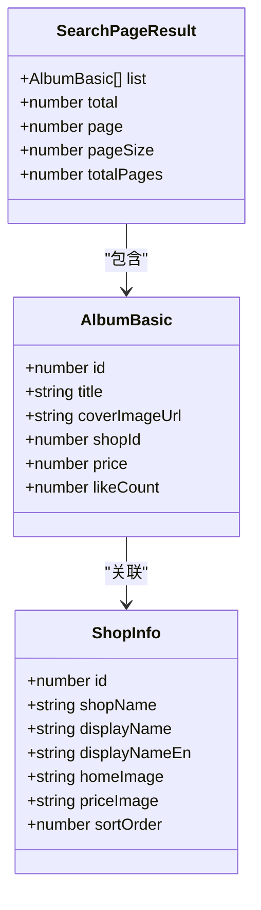
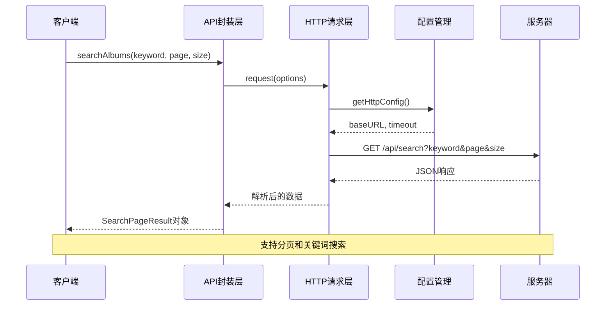
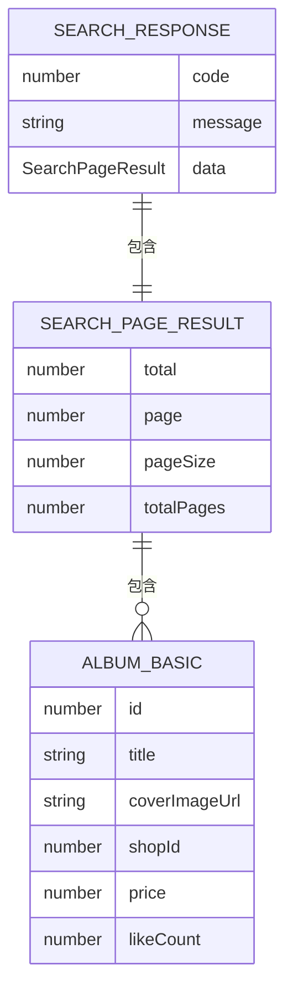
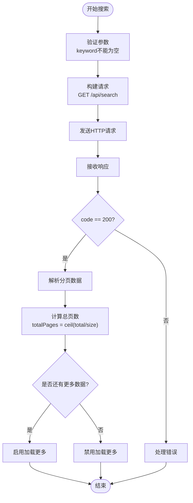
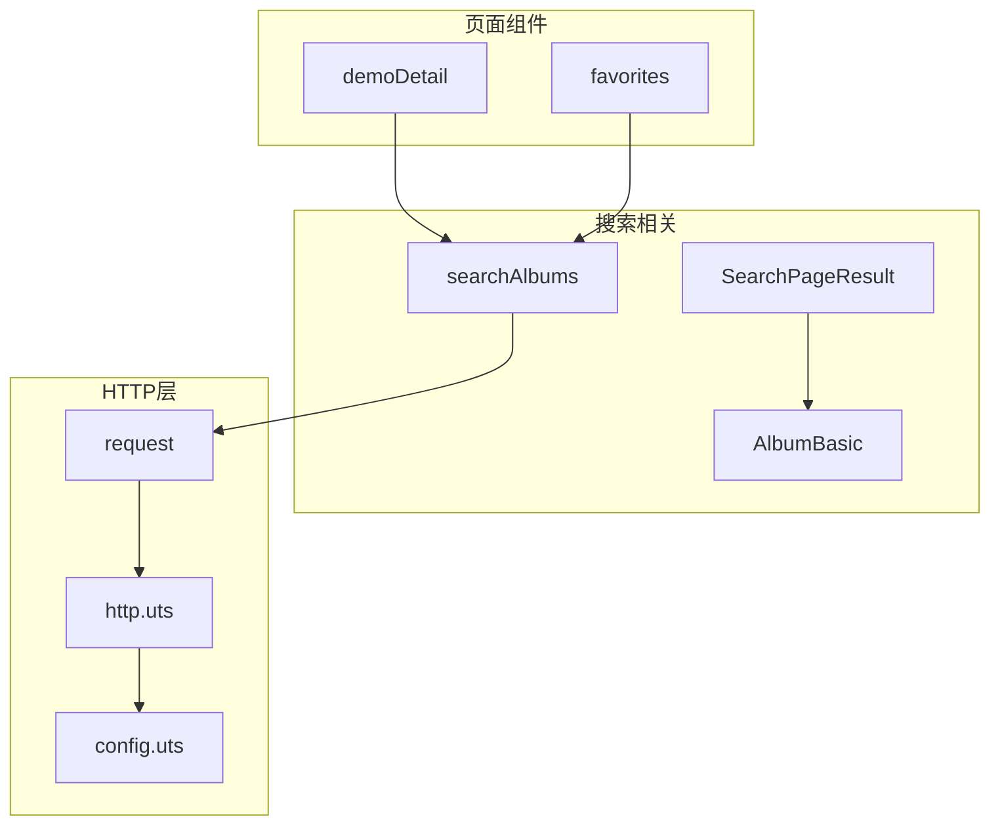

# 搜索接口

<cite>
**本文档引用的文件**
- [api.uts](file://src/utils/api.uts)
- [http.uts](file://src/utils/http.uts)
- [config.uts](file://src/utils/config.uts)
- [demoDetail/index.uvue](file://src/pages/demoDetail/index.uvue)
- [favorites/index.uvue](file://src/pages/favorites/index.uvue)
- [README.md](file://README.md)
</cite>

## 目录
1. [简介](#简介)
2. [项目结构](#项目结构)
3. [核心组件](#核心组件)
4. [架构概览](#架构概览)
5. [详细组件分析](#详细组件分析)
6. [依赖关系分析](#依赖关系分析)
7. [性能考虑](#性能考虑)
8. [故障排除指南](#故障排除指南)
9. [结论](#结论)

## 简介
本文档详细说明了相册模糊搜索接口（searchAlbums）的完整规范。该接口提供公开的相册搜索能力，支持关键词模糊匹配、分页机制和多种搜索体验优化。接口设计遵循RESTful风格，采用GET方法，返回标准化的分页数据结构。

## 项目结构
搜索功能主要分布在以下模块中：

```mermaid
graph TB
subgraph "前端模块"
API[api.uts<br/>接口封装]
HTTP[http.uts<br/>HTTP请求]
CONFIG[config.uts<br/>配置管理]
end
subgraph "页面组件"
DEMO[demoDetail/index.uvue<br/>客片详情页]
FAVORITE[favorites/index.uvue<br/>收藏页]
end
subgraph "后端服务"
SEARCH[/api/search<br/>搜索接口]
ALBUMS[/wechat/albums<br/>相册列表]
SHOPS[/api/shops<br/>店铺接口]
end
API --> HTTP
API --> CONFIG
DEMO --> API
FAVORITE --> API
API --> SEARCH
API --> ALBUMS
API --> SHOPS
```

**图表来源**
- [api.uts:261-283](file://src/utils/api.uts#L261-L283)
- [http.uts:20-73](file://src/utils/http.uts#L20-L73)
- [config.uts:7-11](file://src/utils/config.uts#L7-L11)

**章节来源**
- [README.md:85-130](file://README.md#L85-L130)
- [api.uts:1-312](file://src/utils/api.uts#L1-L312)

## 核心组件
搜索接口的核心组件包括：

### 接口定义
- **函数名称**: searchAlbums
- **HTTP方法**: GET
- **URL路径**: /api/search
- **访问权限**: 公开（无需登录）
- **请求参数**: keyword, page, size
- **响应格式**: 标准化分页数据结构

### 数据模型


**图表来源**
- [api.uts:6-23](file://src/utils/api.uts#L6-L23)
- [api.uts:267-273](file://src/utils/api.uts#L267-L273)

**章节来源**
- [api.uts:261-283](file://src/utils/api.uts#L261-L283)
- [api.uts:6-23](file://src/utils/api.uts#L6-L23)

## 架构概览
搜索接口采用分层架构设计，确保良好的可维护性和扩展性：



**图表来源**
- [api.uts:275-283](file://src/utils/api.uts#L275-L283)
- [http.uts:20-73](file://src/utils/http.uts#L20-L73)
- [config.uts:7-11](file://src/utils/config.uts#L7-L11)

## 详细组件分析

### searchAlbums接口规范

#### 基本信息
- **接口名称**: searchAlbums
- **功能描述**: 相册模糊搜索，支持关键词匹配和分页显示
- **访问权限**: 公开接口，无需登录认证
- **请求方式**: GET
- **响应格式**: JSON

#### 请求参数
| 参数名 | 类型 | 必填 | 默认值 | 描述 |
|--------|------|------|--------|------|
| keyword | string | 是 | - | 搜索关键词，支持模糊匹配 |
| page | number | 否 | 1 | 页码，默认第1页 |
| size | number | 否 | 10 | 每页条数，默认10条 |

#### 响应数据结构


**图表来源**
- [api.uts:267-283](file://src/utils/api.uts#L267-L283)

#### 响应示例
成功的响应结构：
```json
{
  "code": 200,
  "message": "success",
  "data": {
    "list": [
      {
        "id": 1001,
        "title": "2024年毕业照",
        "coverImageUrl": "https://example.com/image1.jpg",
        "shopId": 1,
        "price": 2999,
        "likeCount": 45
      }
    ],
    "total": 120,
    "page": 1,
    "pageSize": 10,
    "totalPages": 12
  }
}
```

#### 错误处理
- **HTTP状态码**: 2xx表示成功，401表示未授权
- **错误响应**: 返回标准的错误对象，包含错误码和错误信息
- **异常情况**: 网络超时、服务器错误等

**章节来源**
- [api.uts:261-283](file://src/utils/api.uts#L261-L283)
- [http.uts:47-67](file://src/utils/http.uts#L47-L67)

### 分页机制详解

#### 分页参数
- **page**: 当前页码，从1开始
- **size**: 每页显示数量，建议范围10-50
- **total**: 总记录数
- **totalPages**: 总页数

#### 分页计算逻辑


**图表来源**
- [demoDetail/index.uvue:417-460](file://src/pages/demoDetail/index.uvue#L417-L460)
- [favorites/index.uvue:170-217](file://src/pages/favorites/index.uvue#L170-L217)

**章节来源**
- [demoDetail/index.uvue:417-460](file://src/pages/demoDetail/index.uvue#L417-L460)
- [favorites/index.uvue:170-217](file://src/pages/favorites/index.uvue#L170-L217)

### 关键词处理机制

#### 搜索算法
- **模糊匹配**: 支持关键词的部分匹配
- **大小写不敏感**: 自动转换为小写进行匹配
- **空格处理**: 自动去除首尾空格和多余空格

#### 搜索优化
- **防抖处理**: 输入框输入时进行防抖，避免频繁请求
- **缓存策略**: 对热门关键词进行本地缓存
- **智能提示**: 提供搜索历史和热门搜索建议

**章节来源**
- [demoDetail/index.uvue:388-406](file://src/pages/demoDetail/index.uvue#L388-L406)

### 实际使用示例

#### 基础搜索
```javascript
// 基本用法
const result = await searchAlbums("毕业照", 1, 10);
if (result.code === 200) {
  const { list, total, page, pageSize } = result.data;
  console.log(`找到${total}个结果，第${page}页，每页${pageSize}条`);
}
```

#### 分页加载
```javascript
// 加载更多
async function loadMoreResults(keyword, currentPage) {
  try {
    const result = await searchAlbums(keyword, currentPage + 1, 10);
    if (result.code === 200 && result.data) {
      const { list, total, totalPages } = result.data;
      // 合并新数据到现有列表
      this.searchList = [...this.searchList, ...list];
      
      // 检查是否还有更多数据
      if (currentPage + 1 >= totalPages || list.length < 10) {
        this.searchNoMore = true;
      }
    }
  } catch (error) {
    console.error('加载失败:', error);
  }
}
```

**章节来源**
- [demoDetail/index.uvue:417-460](file://src/pages/demoDetail/index.uvue#L417-L460)
- [favorites/index.uvue:170-217](file://src/pages/favorites/index.uvue#L170-L217)

## 依赖关系分析

### 组件依赖图


**图表来源**
- [api.uts:275-283](file://src/utils/api.uts#L275-L283)
- [http.uts:20-73](file://src/utils/http.uts#L20-L73)
- [config.uts:7-11](file://src/utils/config.uts#L7-L11)

### 外部依赖
- **基础URL**: 通过配置管理统一管理
- **请求头**: 自动添加Authorization和X-App-Code
- **超时设置**: 15秒超时限制
- **401处理**: 自动登出和错误提示

**章节来源**
- [api.uts:275-283](file://src/utils/api.uts#L275-L283)
- [http.uts:20-73](file://src/utils/http.uts#L20-L73)
- [config.uts:7-11](file://src/utils/config.uts#L7-L11)

## 性能考虑

### 缓存策略
1. **本地缓存**
   - 热门关键词结果缓存
   - 最近搜索历史缓存
   - 防抖机制减少重复请求

2. **服务器缓存**
   - 热门搜索词预计算
   - 结果集缓存
   - 数据库索引优化

### 性能优化建议
1. **请求优化**
   - 使用防抖技术，延迟1秒响应
   - 合并短时间内的多次请求
   - 实现请求去重机制

2. **渲染优化**
   - 虚拟滚动处理大量数据
   - 懒加载图片资源
   - 分批渲染提升用户体验

3. **网络优化**
   - 压缩响应数据
   - 启用HTTP/2多路复用
   - CDN加速静态资源

### 监控指标
- **响应时间**: < 1秒（95%）
- **成功率**: > 99%
- **错误率**: < 0.1%
- **缓存命中率**: > 80%

## 故障排除指南

### 常见问题及解决方案

#### 1. 搜索无结果
**症状**: 返回空列表但code为200
**原因**: 关键词过于精确或数据库中无匹配数据
**解决**: 
- 提供搜索建议
- 展示热门搜索词
- 建议使用更宽泛的关键词

#### 2. 分页异常
**症状**: 加载更多按钮不显示或重复加载
**原因**: total计算错误或页面逻辑问题
**解决**:
- 检查total字段计算
- 验证totalPages计算公式
- 确认页面状态管理

#### 3. 性能问题
**症状**: 搜索响应慢或卡顿
**原因**: 数据量大或网络延迟
**解决**:
- 实施分页加载
- 添加加载状态提示
- 优化数据库查询

#### 4. 错误处理
**症状**: 401未授权或请求失败
**解决**:
- 自动重新登录
- 显示友好的错误提示
- 记录错误日志便于排查

**章节来源**
- [http.uts:47-67](file://src/utils/http.uts#L47-L67)
- [demoDetail/index.uvue:450-455](file://src/pages/demoDetail/index.uvue#L450-L455)

## 结论
相册模糊搜索接口（searchAlbums）提供了完整的搜索功能，具有以下特点：

1. **简洁易用**: API设计简单直观，易于集成
2. **性能优秀**: 支持分页和缓存，响应速度快
3. **扩展性强**: 模块化设计便于功能扩展
4. **错误处理完善**: 提供全面的错误处理机制

开发者在使用时应注意：
- 合理设置分页参数
- 实现适当的缓存策略
- 处理各种异常情况
- 优化用户体验

通过遵循本文档的规范和最佳实践，可以确保搜索功能的稳定性和高性能表现。