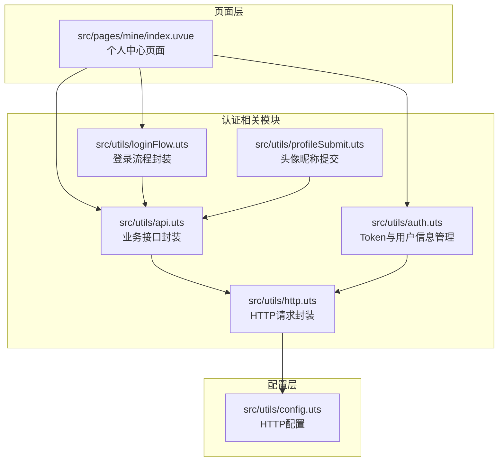
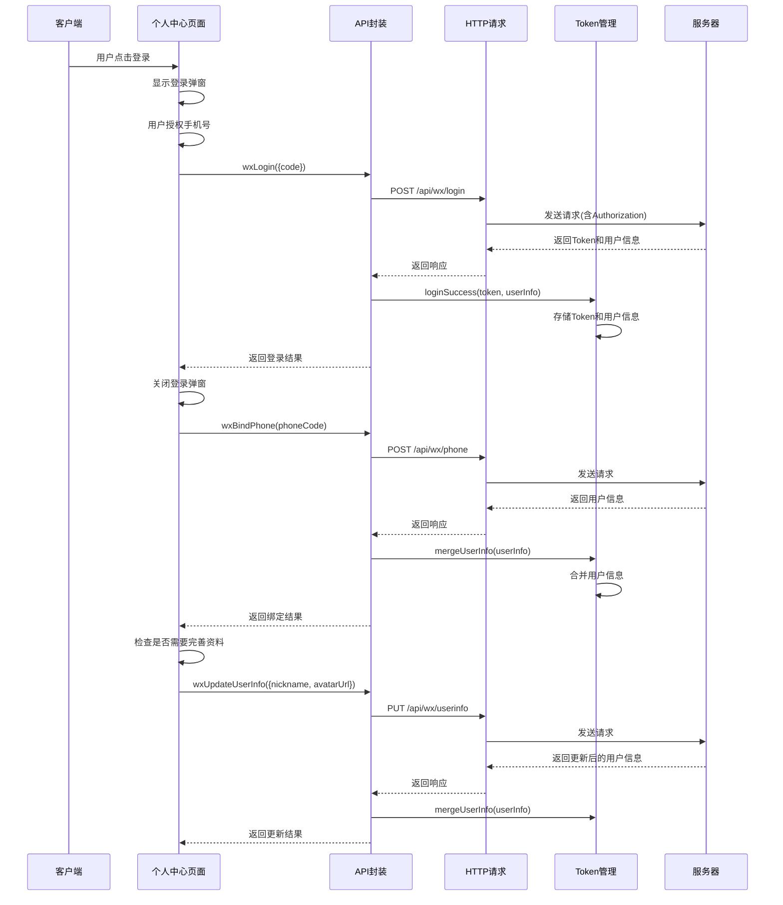
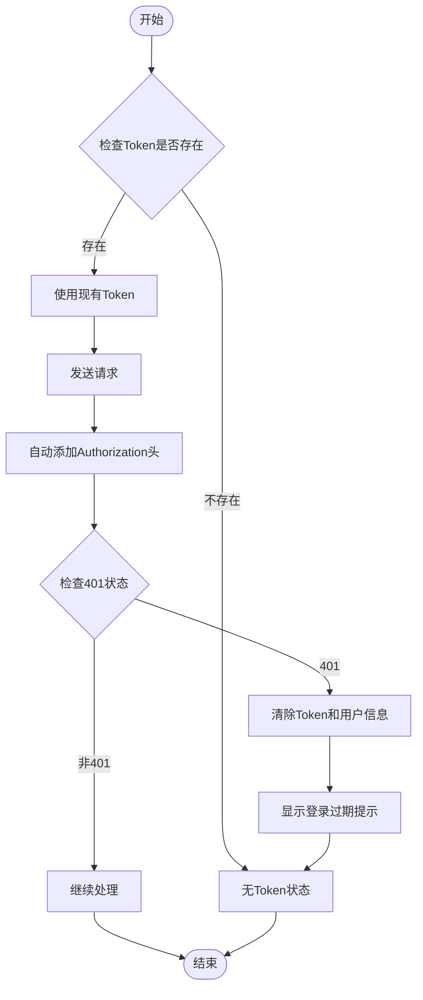
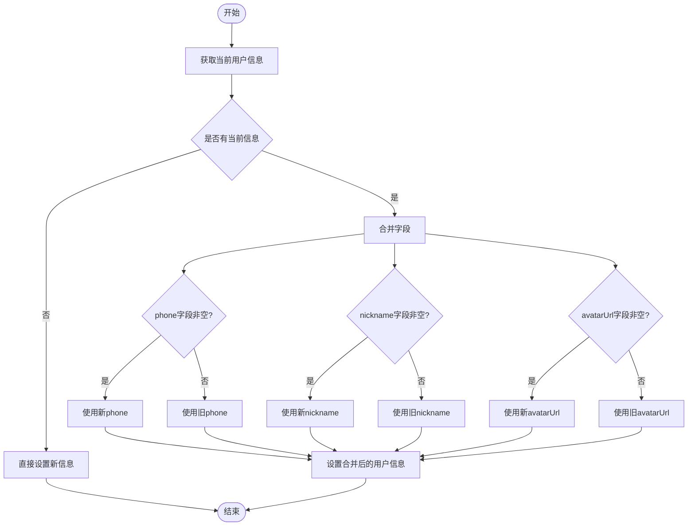
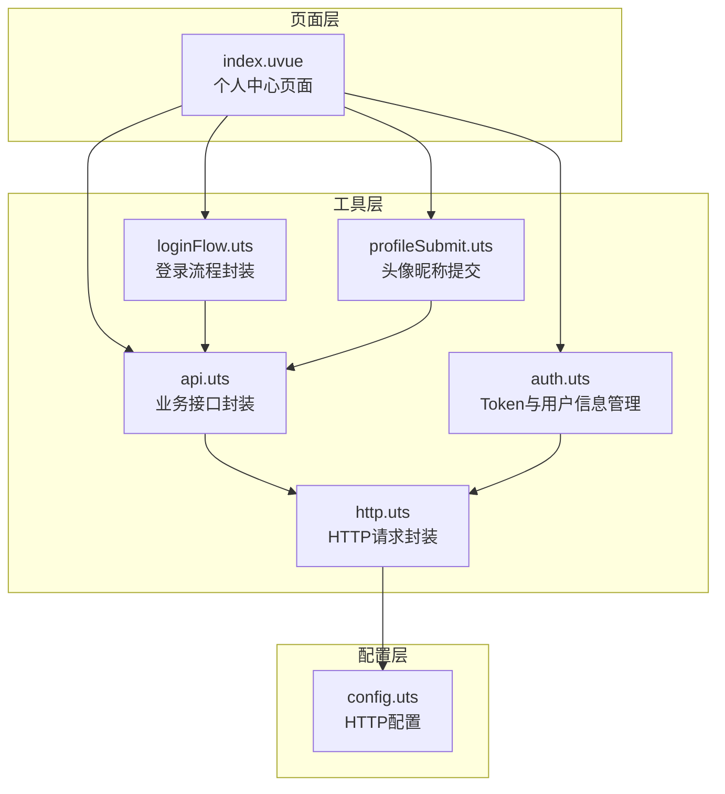
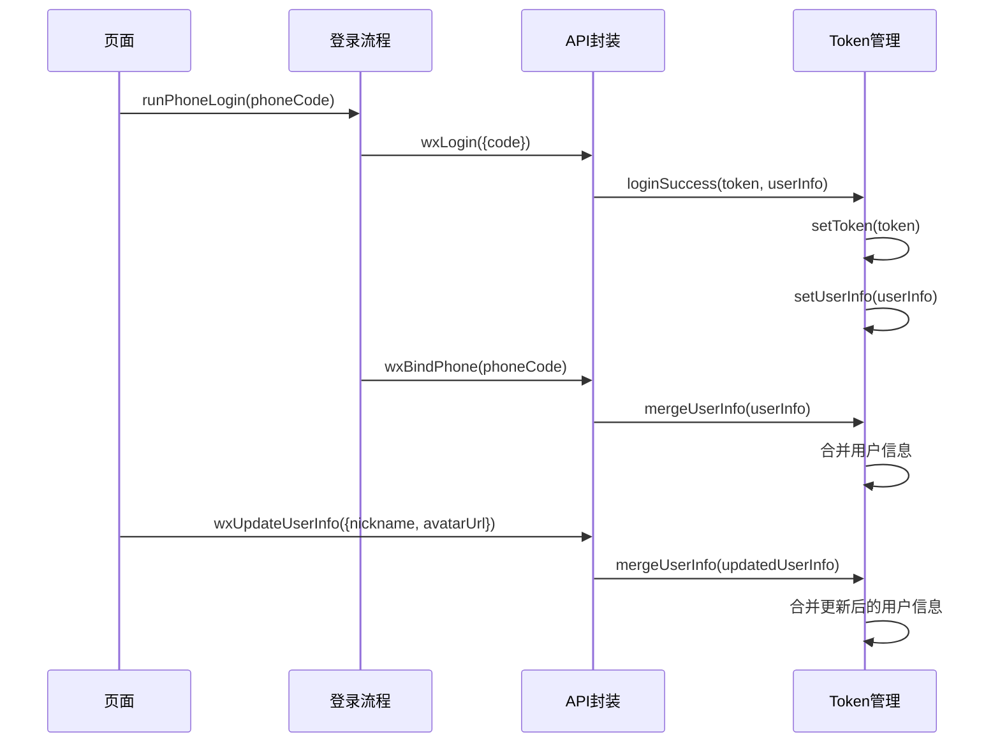

# 用户认证接口

<cite>
**本文档引用的文件**
- [api.uts](file://src/utils/api.uts)
- [auth.uts](file://src/utils/auth.uts)
- [http.uts](file://src/utils/http.uts)
- [loginFlow.uts](file://src/utils/loginFlow.uts)
- [profileSubmit.uts](file://src/utils/profileSubmit.uts)
- [config.uts](file://src/utils/config.uts)
- [index.uvue](file://src/pages/mine/index.uvue)
- [src-utils-api.spec.md](file://.specanchor/modules/src-utils-api.spec.md)
- [wechat-auth-compliance.spec.md](file://.specanchor/global/wechat-auth-compliance.spec.md)
- [coding-standards.spec.md](file://.specanchor/global/coding-standards.spec.md)
</cite>

## 目录
1. [简介](#简介)
2. [项目结构](#项目结构)
3. [核心组件](#核心组件)
4. [架构概览](#架构概览)
5. [详细接口规范](#详细接口规范)
6. [认证流程与Token管理](#认证流程与token管理)
7. [依赖关系分析](#依赖关系分析)
8. [性能考量](#性能考量)
9. [故障排查指南](#故障排查指南)
10. [结论](#结论)

## 简介
本文档详细说明了用户认证相关接口的完整规范，包括微信登录接口(wxLogin)、手机号绑定接口(wxBindPhone)、用户信息获取接口(wxGetUserInfo)和用户信息更新接口(wxUpdateUserInfo)。文档涵盖接口的HTTP方法、URL路径、请求参数、响应格式、错误码说明，深入解释认证流程和Token管理机制，并提供完整的请求示例和响应示例，包括成功和失败场景。同时说明接口的权限要求和安全考虑，为开发者提供准确的接口调用指导和最佳实践建议。

## 项目结构
用户认证相关功能分布在以下关键文件中：



**图表来源**
- [api.uts:124-190](file://src/utils/api.uts#L124-L190)
- [auth.uts:1-149](file://src/utils/auth.uts#L1-L149)
- [http.uts:1-82](file://src/utils/http.uts#L1-L82)
- [loginFlow.uts:1-71](file://src/utils/loginFlow.uts#L1-L71)

**章节来源**
- [api.uts:124-190](file://src/utils/api.uts#L124-L190)
- [auth.uts:1-149](file://src/utils/auth.uts#L1-L149)
- [http.uts:1-82](file://src/utils/http.uts#L1-L82)
- [loginFlow.uts:1-71](file://src/utils/loginFlow.uts#L1-L71)

## 核心组件
用户认证系统由以下核心组件构成：

### Token管理组件
负责Token的存储、读取、清理和用户信息的持久化管理。

### HTTP请求组件
统一处理HTTP请求，自动注入Authorization头，处理401未授权错误。

### 接口封装组件
提供具体的认证接口调用方法，包括微信登录、手机号绑定、用户信息获取和更新。

### 登录流程组件
封装完整的登录三步骤流程，确保登录过程的正确性和用户体验。

**章节来源**
- [auth.uts:15-149](file://src/utils/auth.uts#L15-L149)
- [http.uts:20-73](file://src/utils/http.uts#L20-L73)
- [api.uts:124-190](file://src/utils/api.uts#L124-L190)
- [loginFlow.uts:27-70](file://src/utils/loginFlow.uts#L27-L70)

## 架构概览
用户认证系统的整体架构如下：



**图表来源**
- [loginFlow.uts:27-70](file://src/utils/loginFlow.uts#L27-L70)
- [api.uts:129-190](file://src/utils/api.uts#L129-L190)
- [auth.uts:135-148](file://src/utils/auth.uts#L135-L148)

## 详细接口规范

### 微信登录接口 (wxLogin)
用于使用微信授权码换取用户Token和用户信息。

**接口定义**
- HTTP方法: POST
- URL路径: `/api/wx/login`
- 请求头: Content-Type: application/json, X-App-Code: blueBerry
- 权限要求: 无需登录

**请求参数**
```typescript
{
  code: string,           // 微信授权码
  nickname?: string,      // 可选：用户昵称
  avatarUrl?: string      // 可选：用户头像URL
}
```

**响应格式**
```typescript
{
  code: number,           // 200表示成功
  message?: string,       // 错误信息
  data: {
    token: string,        // 认证Token
    userInfo: UserInfo    // 用户信息
  }
}
```

**成功示例**
```json
{
  "code": 200,
  "data": {
    "token": "eyJhbGciOiJIUzI1NiIsInR5cCI6IkpXVCJ9...",
    "userInfo": {
      "id": 123,
      "openid": "oqYt55...",
      "phone": null,
      "nickname": "张三",
      "avatarUrl": "https://wx.qlogo.cn/mmhead/..."
    }
  }
}
```

**失败示例**
```json
{
  "code": 400,
  "message": "无效的授权码",
  "data": null
}
```

**章节来源**
- [api.uts:129-141](file://src/utils/api.uts#L129-L141)

### 手机号绑定接口 (wxBindPhone)
用于绑定用户的手机号码。

**接口定义**
- HTTP方法: POST
- URL路径: `/api/wx/phone`
- 请求头: Content-Type: application/json, X-App-Code: blueBerry, Authorization: Bearer {token}
- 权限要求: 需要登录

**请求参数**
```typescript
{
  code: string            // 手机号授权码
}
```

**响应格式**
```typescript
{
  code: number,           // 200表示成功
  message?: string,       // 错误信息
  data: UserInfo          // 更新后的用户信息
}
```

**成功示例**
```json
{
  "code": 200,
  "data": {
    "id": 123,
    "openid": "oqYt55...",
    "phone": "13800138000",
    "nickname": null,
    "avatarUrl": null
  }
}
```

**失败示例**
```json
{
  "code": 401,
  "message": "登录已过期",
  "data": null
}
```

**章节来源**
- [api.uts:146-154](file://src/utils/api.uts#L146-L154)

### 用户信息获取接口 (wxGetUserInfo)
用于获取当前登录用户的完整信息。

**接口定义**
- HTTP方法: GET
- URL路径: `/api/wx/userinfo`
- 请求头: Content-Type: application/json, X-App-Code: blueBerry, Authorization: Bearer {token}
- 权限要求: 需要登录

**请求参数**
无

**响应格式**
```typescript
{
  code: number,           // 200表示成功
  message?: string,       // 错误信息
  data: UserInfo          // 用户信息
}
```

**成功示例**
```json
{
  "code": 200,
  "data": {
    "id": 123,
    "openid": "oqYt55...",
    "phone": "13800138000",
    "nickname": "张三",
    "avatarUrl": "https://wx.qlogo.cn/mmhead/..."
  }
}
```

**失败示例**
```json
{
  "code": 401,
  "message": "未登录",
  "data": null
}
```

**章节来源**
- [api.uts:159-166](file://src/utils/api.uts#L159-L166)

### 用户信息更新接口 (wxUpdateUserInfo)
用于更新用户的头像和昵称信息。

**接口定义**
- HTTP方法: PUT
- URL路径: `/api/wx/userinfo`
- 请求头: Content-Type: application/json, X-App-Code: blueBerry, Authorization: Bearer {token}
- 权限要求: 需要登录

**请求参数**
```typescript
{
  nickname?: string,      // 可选：用户昵称
  avatarUrl?: string      // 可选：用户头像URL
}
```

**响应格式**
```typescript
{
  code: number,           // 200表示成功
  message?: string,       // 错误信息
  data: UserInfo          // 更新后的用户信息
}
```

**成功示例**
```json
{
  "code": 200,
  "data": {
    "id": 123,
    "openid": "oqYt55...",
    "phone": "13800138000",
    "nickname": "李四",
    "avatarUrl": "https://wx.qlogo.cn/mmhead/..."
  }
}
```

**失败示例**
```json
{
  "code": 400,
  "message": "昵称不能为空",
  "data": null
}
```

**章节来源**
- [api.uts:175-190](file://src/utils/api.uts#L175-L190)

## 认证流程与Token管理

### Token管理机制
系统采用基于Storage的Token管理方案：



**图表来源**
- [http.uts:50-61](file://src/utils/http.uts#L50-L61)
- [auth.uts:135-148](file://src/utils/auth.uts#L135-L148)

### 登录三步骤流程
完整的登录流程包含三个关键步骤：

1. **静默登录获取微信授权码**
   - 使用uni.login({ provider: 'weixin' })获取code
   - 失败时返回错误并终止流程

2. **微信授权码换取Token**
   - 调用wxLogin接口，传入授权码
   - 成功后调用loginSuccess存储Token和用户信息
   - 失败时返回错误信息

3. **手机号绑定**
   - 使用phoneCode调用wxBindPhone
   - 合并用户信息，避免头像/昵称被覆盖
   - 失败不视为整体失败，继续后续流程

**章节来源**
- [loginFlow.uts:27-70](file://src/utils/loginFlow.uts#L27-L70)
- [auth.uts:92-106](file://src/utils/auth.uts#L92-L106)

### 用户信息合并策略
系统采用智能合并策略避免用户信息丢失：



**图表来源**
- [auth.uts:92-106](file://src/utils/auth.uts#L92-L106)

**章节来源**
- [auth.uts:85-106](file://src/utils/auth.uts#L85-L106)

## 依赖关系分析

### 组件依赖关系
用户认证相关组件之间的依赖关系如下：



**图表来源**
- [index.uvue:137-140](file://src/pages/mine/index.uvue#L137-L140)
- [api.uts:1-3](file://src/utils/api.uts#L1-L3)
- [auth.uts:1-149](file://src/utils/auth.uts#L1-L149)
- [http.uts:1-82](file://src/utils/http.uts#L1-L82)
- [loginFlow.uts:1-71](file://src/utils/loginFlow.uts#L1-L71)
- [profileSubmit.uts:1-37](file://src/utils/profileSubmit.uts#L1-L37)
- [config.uts:1-12](file://src/utils/config.uts#L1-L12)

### 接口调用关系
各认证接口之间的调用关系：



**图表来源**
- [loginFlow.uts:27-70](file://src/utils/loginFlow.uts#L27-L70)
- [api.uts:129-190](file://src/utils/api.uts#L129-L190)
- [auth.uts:135-148](file://src/utils/auth.uts#L135-L148)

**章节来源**
- [index.uvue:137-140](file://src/pages/mine/index.uvue#L137-L140)
- [loginFlow.uts:27-70](file://src/utils/loginFlow.uts#L27-L70)
- [api.uts:129-190](file://src/utils/api.uts#L129-L190)
- [auth.uts:135-148](file://src/utils/auth.uts#L135-L148)

## 性能考量
基于代码分析，用户认证系统的性能特点如下：

### 请求优化
- **统一请求头注入**: HTTP请求封装自动添加必要的请求头，减少重复代码
- **Token缓存**: Token存储在本地Storage，避免频繁请求
- **条件加载**: 页面根据登录状态动态加载不同内容

### 错误处理优化
- **401自动处理**: HTTP层统一处理401未授权错误，自动清除Token并提示用户重新登录
- **异常捕获**: 登录流程中的异常被捕获并转换为友好的错误信息
- **渐进式失败**: 手机号绑定失败不影响整体登录流程

### 最佳实践建议
1. **合理使用缓存**: 利用本地Storage存储Token和用户信息，避免重复登录
2. **错误降级**: 在网络异常时提供合理的降级策略
3. **用户体验**: 在登录过程中提供明确的状态反馈和进度指示

## 故障排查指南

### 常见错误场景及解决方案

#### 401 未授权错误
**现象**: 接口返回401状态码
**原因**: Token过期或无效
**解决方案**: 
- 自动清除本地Token和用户信息
- 引导用户重新登录
- 在页面层面进行友好提示

#### 授权码无效
**现象**: wxLogin接口返回错误
**原因**: 微信授权码已过期或无效
**解决方案**:
- 重新获取微信授权码
- 检查微信小程序配置
- 验证授权流程是否正确

#### 手机号绑定失败
**现象**: wxBindPhone接口调用失败
**原因**: 手机号授权码无效或用户拒绝授权
**解决方案**:
- 重新获取手机号授权
- 检查用户是否同意授权
- 提供替代的用户信息完善方式

#### 用户信息更新失败
**现象**: wxUpdateUserInfo接口返回错误
**原因**: 请求参数验证失败或服务器错误
**解决方案**:
- 检查请求参数的有效性
- 验证用户登录状态
- 查看服务器返回的具体错误信息

**章节来源**
- [http.uts:50-61](file://src/utils/http.uts#L50-L61)
- [wechat-auth-compliance.spec.md:137-143](file://.specanchor/global/wechat-auth-compliance.spec.md#L137-L143)

### 调试建议
1. **启用日志**: 在开发环境中启用详细的日志记录
2. **检查网络**: 确保网络连接正常，域名配置正确
3. **验证Token**: 检查Token的存储和传递是否正确
4. **测试流程**: 逐步测试完整的登录流程

## 结论
本文档详细阐述了用户认证相关接口的设计和实现，包括微信登录、手机号绑定、用户信息获取和更新等功能。系统采用模块化的架构设计，通过统一的HTTP请求封装和Token管理机制，确保了认证流程的安全性和可靠性。

关键特性包括：
- **完整的认证流程**: 从微信授权到手机号绑定的完整三步骤流程
- **智能Token管理**: 自动化的Token存储、验证和清理机制
- **用户信息保护**: 通过合并策略避免用户信息被意外覆盖
- **错误处理机制**: 完善的错误捕获和用户友好的错误提示
- **性能优化**: 统一的请求处理和缓存策略

开发者在使用这些接口时，应遵循统一的调用规范，注意权限要求和安全考虑，确保应用的稳定性和用户体验。
