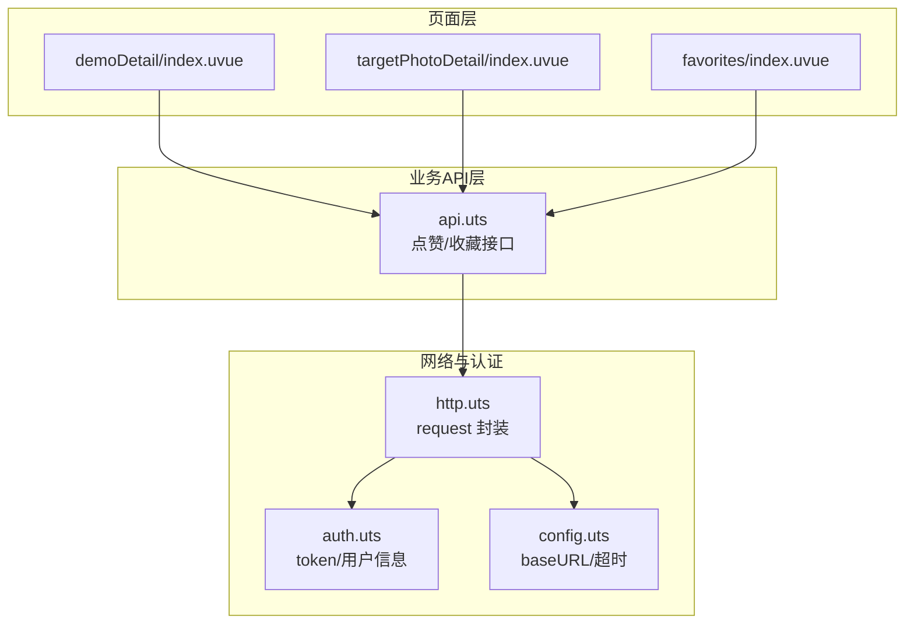
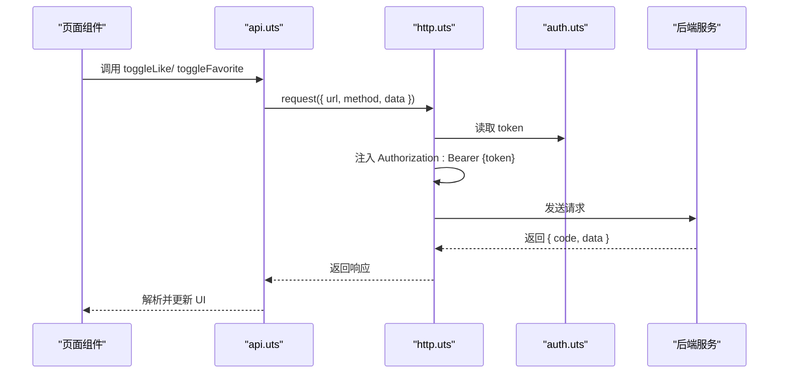
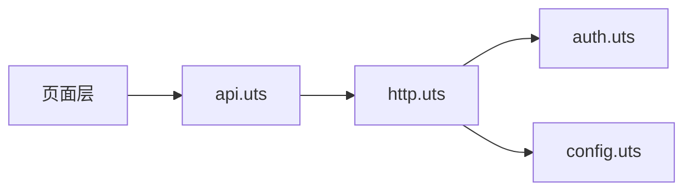

# 社交互动接口

<cite>
**本文引用的文件**
- [api.uts](file://src/utils/api.uts)
- [http.uts](file://src/utils/http.uts)
- [auth.uts](file://src/utils/auth.uts)
- [config.uts](file://src/utils/config.uts)
- [demoDetail/index.uvue](file://src/pages/demoDetail/index.uvue)
- [favorites/index.uvue](file://src/pages/favorites/index.uvue)
- [targetPhotoDetail/index.uvue](file://src/pages/targetPhotoDetail/index.uvue)
- [src-utils-api.spec.md](file://.specanchor/modules/src-utils-api.spec.md)
- [src-pages-album.spec.md](file://.specanchor/modules/src-pages-album.spec.md)
</cite>

## 目录
1. [简介](#简介)
2. [项目结构](#项目结构)
3. [核心组件](#核心组件)
4. [架构概览](#架构概览)
5. [详细组件分析](#详细组件分析)
6. [依赖关系分析](#依赖关系分析)
7. [性能考量](#性能考量)
8. [故障排查指南](#故障排查指南)
9. [结论](#结论)
10. [附录](#附录)

## 简介
本文件面向开发者，系统化梳理“社交互动”相关接口，重点覆盖点赞与收藏两大模块。内容涵盖：
- 接口规范：HTTP 方法、URL、请求参数、响应格式
- 批量操作机制：批量查询状态与批量切换
- 权限要求与认证流程
- 状态管理与用户体验优化建议
- 与页面层的集成方式与最佳实践

## 项目结构
社交互动接口位于业务 API 模块中，统一通过 HTTP 封装进行网络请求，并依赖认证模块注入 Authorization 头。页面层通过调用 API 模块完成点赞/收藏的交互与状态刷新。

图表来源
- [api.uts:192-259](file://src/utils/api.uts#L192-L259)
- [http.uts:20-73](file://src/utils/http.uts#L20-L73)
- [auth.uts:21-148](file://src/utils/auth.uts#L21-L148)
- [config.uts:7-11](file://src/utils/config.uts#L7-L11)

章节来源
- [api.uts:192-259](file://src/utils/api.uts#L192-L259)
- [http.uts:20-73](file://src/utils/http.uts#L20-L73)
- [auth.uts:21-148](file://src/utils/auth.uts#L21-L148)
- [config.uts:7-11](file://src/utils/config.uts#L7-L11)

## 核心组件
- 点赞模块：toggleLike、getLikeStatus
- 收藏模块：toggleFavorite、getFavoriteStatus、getFavoriteList
- 认证与网络：http.uts（统一注入 Authorization）、auth.uts（token/用户信息）、config.uts（baseURL）

章节来源
- [api.uts:192-259](file://src/utils/api.uts#L192-L259)
- [http.uts:20-73](file://src/utils/http.uts#L20-L73)
- [auth.uts:21-148](file://src/utils/auth.uts#L21-L148)
- [config.uts:7-11](file://src/utils/config.uts#L7-L11)

## 架构概览
点赞与收藏均采用“toggle 切换 + 批量查询”的模式：
- toggle 接口：单条记录切换（点赞/取消点赞、收藏/取消收藏）
- 批量查询：将多个 albumId 以逗号拼接传入，后端返回每个 ID 的状态与计数
- 页面层在合适时机（如 onShow、分类切换）调用批量查询，减少多次单点请求

图表来源
- [api.uts:197-232](file://src/utils/api.uts#L197-L232)
- [http.uts:20-73](file://src/utils/http.uts#L20-L73)
- [auth.uts:21-29](file://src/utils/auth.uts#L21-L29)

## 详细组件分析

### 点赞接口
- toggleLike
  - 方法：POST
  - 路径：/api/like
  - 请求体：albumId:number
  - 响应：{ code, data: { liked:boolean, likeCount:number } }
  - 权限：需登录
- getLikeStatus
  - 方法：GET
  - 路径：/api/like/status?albumIds=...
  - 查询参数：albumIds:string（逗号拼接的 ID 列表）
  - 响应：{ code, data:Array<{ albumId:number, liked:boolean, likeCount:number }> }
  - 权限：需登录

使用场景
- 列表页：点击心形图标触发 toggleLike，立即更新当前卡片的 liked/likeCount
- 列表页：onShow 时根据当前可见列表批量刷新状态，提升一致性
- 详情页：进入详情后按 albumId 查询一次状态，确保 UI 与服务端一致

章节来源
- [api.uts:197-218](file://src/utils/api.uts#L197-L218)
- [src-utils-api.spec.md:96-101](file://.specanchor/modules/src-utils-api.spec.md#L96-L101)
- [src-pages-album.spec.md:144-149](file://.specanchor/modules/src-pages-album.spec.md#L144-L149)

### 收藏接口
- toggleFavorite
  - 方法：POST
  - 路径：/api/favorite
  - 请求体：albumId:number
  - 响应：{ code, data: { favorited:boolean } }
  - 权限：需登录
- getFavoriteStatus
  - 方法：GET
  - 路径：/api/favorite/status?albumIds=...
  - 查询参数：albumIds:string（逗号拼接的 ID 列表）
  - 响应：{ code, data:Array<{ albumId:number, favorited:boolean }> }
  - 权限：需登录
- getFavoriteList
  - 方法：GET
  - 路径：/api/favorite/list
  - 查询参数：shopId?:number（可选，按门店筛选）
  - 响应：{ code, data:AlbumBasic[] }（一次性返回全部，无分页）
  - 权限：需登录

使用场景
- 详情页：点击收藏按钮触发 toggleFavorite，立即更新 UI
- 我的收藏页：首次进入加载全部收藏列表；搜索模式下按关键词分页搜索
- 列表页：onShow 时可按需批量刷新收藏状态（与点赞类似）

章节来源
- [api.uts:225-259](file://src/utils/api.uts#L225-L259)
- [src-utils-api.spec.md:103-109](file://.specanchor/modules/src-utils-api.spec.md#L103-L109)
- [src-pages-album.spec.md:36-44](file://.specanchor/modules/src-pages-album.spec.md#L36-L44)

### 权限与认证
- 认证方式：Authorization: Bearer {token}
- token 来源：登录流程（wxLogin）后写入本地存储
- 未登录行为：页面层拦截，弹出登录弹窗，登录成功后再执行操作
- 401 处理：http.uts 在收到 401 时清理 token 与用户信息并提示重新登录

章节来源
- [http.uts:20-73](file://src/utils/http.uts#L20-L73)
- [auth.uts:21-148](file://src/utils/auth.uts#L21-L148)
- [src-pages-album.spec.md:176-182](file://.specanchor/modules/src-pages-album.spec.md#L176-L182)

### 数据模型
- AlbumBasic
  - 字段：id:number, title:string, coverImageUrl:string, shopId:number, price?:number, likeCount:number
- UserInfo
  - 字段：id:number, openid:string, phone:string|null, nickname:string|null, avatarUrl:string|null

章节来源
- [api.uts:6-23](file://src/utils/api.uts#L6-L23)
- [auth.uts:7-13](file://src/utils/auth.uts#L7-L13)

### 页面层集成与最佳实践
- demoDetail（客片列表）
  - 点赞：handleLike -> toggleLike；onShow 时 refreshLikeStatus 批量刷新
  - 未登录：弹出登录弹窗，同意协议后授权手机号，登录成功后继续执行点赞
- targetPhotoDetail（客片详情）
  - 点赞：handleLike -> toggleLike；进入详情后 refreshLikeStatus 按 albumId 查询一次
  - 收藏：handleFavorite -> toggleFavorite（页面中存在收藏逻辑，具体实现可参考页面源码）
- favorites（我的收藏）
  - 首次进入：loadData -> getFavoriteList（一次性返回全部）
  - 搜索：handleSearch -> searchAlbums（搜索收藏内容）

章节来源
- [demoDetail/index.uvue:478-542](file://src/pages/demoDetail/index.uvue#L478-L542)
- [targetPhotoDetail/index.uvue:175-207](file://src/pages/targetPhotoDetail/index.uvue#L175-L207)
- [favorites/index.uvue:132-191](file://src/pages/favorites/index.uvue#L132-L191)

## 依赖关系分析
- API 模块依赖 HTTP 封装，统一注入 Authorization 头
- HTTP 封装依赖认证模块读取 token，依赖配置模块读取 baseURL
- 页面层通过 API 模块调用接口，遵循“未登录拦截 + 登录成功回放”的交互

图表来源
- [api.uts:1-2](file://src/utils/api.uts#L1-L2)
- [http.uts:1-2](file://src/utils/http.uts#L1-L2)
- [auth.uts:1-2](file://src/utils/auth.uts#L1-L2)
- [config.uts:1-2](file://src/utils/config.uts#L1-L2)

章节来源
- [api.uts:1-2](file://src/utils/api.uts#L1-L2)
- [http.uts:1-2](file://src/utils/http.uts#L1-L2)
- [auth.uts:1-2](file://src/utils/auth.uts#L1-L2)
- [config.uts:1-2](file://src/utils/config.uts#L1-L2)

## 性能考量
- 批量查询优于多次单点请求：列表页 onShow 时对可见列表批量查询，减少网络往返
- 预加载策略：页面在渲染前预加载首屏图片，缩短白屏时间
- 分页与搜索：收藏列表一次性返回全部，搜索模式按需分页

章节来源
- [src-pages-album.spec.md:144-149](file://.specanchor/modules/src-pages-album.spec.md#L144-L149)
- [demoDetail/index.uvue:478-498](file://src/pages/demoDetail/index.uvue#L478-L498)
- [favorites/index.uvue:132-154](file://src/pages/favorites/index.uvue#L132-L154)

## 故障排查指南
- 401 未授权
  - 现象：收到 401，自动清理 token 与用户信息并提示重新登录
  - 处理：引导用户重新登录，或在页面层捕获错误并提示
- 点赞/收藏状态不同步
  - 现象：UI 与服务端状态不一致
  - 处理：在 onShow 或分类切换时调用批量查询接口刷新状态
- 未登录点击
  - 现象：弹出登录弹窗
  - 处理：同意协议后授权手机号，登录成功后回放上次操作

章节来源
- [http.uts:50-61](file://src/utils/http.uts#L50-L61)
- [demoDetail/index.uvue:520-542](file://src/pages/demoDetail/index.uvue#L520-L542)
- [targetPhotoDetail/index.uvue:186-207](file://src/pages/targetPhotoDetail/index.uvue#L186-L207)

## 结论
- 点赞与收藏采用 toggle + 批量查询的统一模式，既满足即时反馈，又保证状态一致性
- 页面层通过“未登录拦截 + 登录成功回放”提升用户体验
- 建议在列表页 onShow 与分类切换时调用批量查询接口，减少网络请求次数

## 附录

### 接口一览与调用示例（路径与参数）
- 点赞
  - POST /api/like
    - 请求体：{ albumId:number }
    - 响应：{ code, data:{ liked:boolean, likeCount:number } }
  - GET /api/like/status?albumIds=1,2,3
    - 查询参数：albumIds:string（逗号拼接）
    - 响应：{ code, data:Array<{ albumId:number, liked:boolean, likeCount:number }> }
- 收藏
  - POST /api/favorite
    - 请求体：{ albumId:number }
    - 响应：{ code, data:{ favorited:boolean } }
  - GET /api/favorite/status?albumIds=1,2,3
    - 查询参数：albumIds:string（逗号拼接）
    - 响应：{ code, data:Array<{ albumId:number, favorited:boolean }> }
  - GET /api/favorite/list?shopId=1
    - 查询参数：shopId?:number（可选）
    - 响应：{ code, data:AlbumBasic[] }（一次性返回全部）

章节来源
- [api.uts:197-259](file://src/utils/api.uts#L197-L259)
- [src-utils-api.spec.md:96-109](file://.specanchor/modules/src-utils-api.spec.md#L96-L109)
