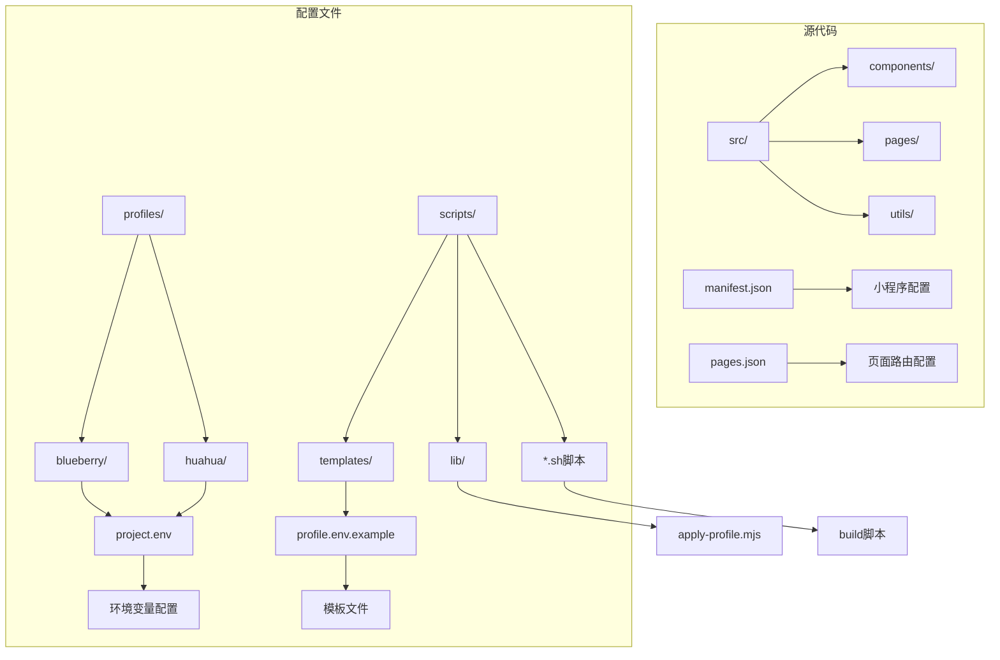
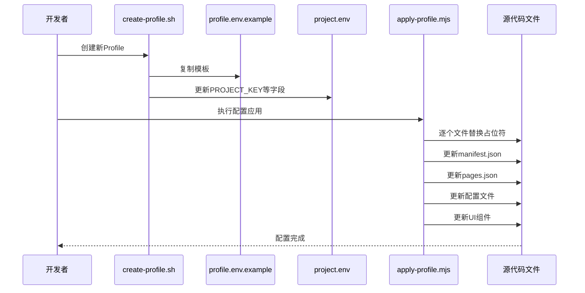
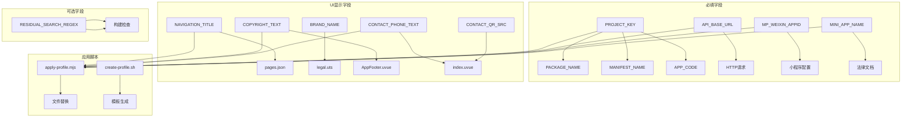

# Profile字段参考手册

<cite>
**本文档引用的文件**
- [profiles/blueberry/project.env](file://profiles/blueberry/project.env)
- [profiles/huahua/project.env](file://profiles/huahua/project.env)
- [scripts/templates/profile.env.example](file://scripts/templates/profile.env.example)
- [scripts/lib/apply-profile.mjs](file://scripts/lib/apply-profile.mjs)
- [scripts/create-profile.sh](file://scripts/create-profile.sh)
- [src/manifest.json](file://src/manifest.json)
- [src/pages.json](file://src/pages.json)
- [src/utils/config.uts](file://src/utils/config.uts)
- [src/utils/http.uts](file://src/utils/http.uts)
- [src/utils/legal.uts](file://src/utils/legal.uts)
- [src/components/AppFooter/AppFooter.uvue](file://src/components/AppFooter/AppFooter.uvue)
- [src/pages/index/index.uvue](file://src/pages/index/index.uvue)
- [src/pages/priceHomePage/index.uvue](file://src/pages/priceHomePage/index.uvue)
- [src/pages/priceList/index.uvue](file://src/pages/priceList/index.uvue)
- [src/utils/api.uts](file://src/utils/api.uts)
- [src/utils/auth.uts](file://src/utils/auth.uts)
- [src/utils/profileSubmit.uts](file://src/utils/profileSubmit.uts)
</cite>

## 目录
1. [简介](#简介)
2. [项目结构](#项目结构)
3. [核心组件](#核心组件)
4. [架构概览](#架构概览)
5. [详细组件分析](#详细组件分析)
6. [依赖关系分析](#依赖关系分析)
7. [性能考虑](#性能考虑)
8. [故障排除指南](#故障排除指南)
9. [结论](#结论)
10. [附录](#附录)

## 简介

Profile字段参考手册是针对小程序项目的配置管理文档，详细说明了所有可用的Profile配置字段，包括必填字段和可选字段。该手册重点关注关键字段如PROJECT_KEY、PACKAGE_NAME、MANIFEST_NAME、API_BASE_URL、APP_CODE等的作用和配置要点，解释品牌相关字段（BRAND_NAME、NAVIGATION_TITLE、COPYRIGHT_TEXT）对UI显示的影响，说明联系方式字段（CONTACT_PHONE_TEXT、CONTACT_QR_SRC）的配置方式，介绍可选字段如RESIDUAL_SEARCH_REGEX的用途和配置方法，并提供字段配置的最佳实践和常见错误避免指南。

## 项目结构

该项目采用基于功能的文件组织方式，主要包含以下关键目录：

**图表来源**
- [profiles/blueberry/project.env:1-23](file://profiles/blueberry/project.env#L1-L23)
- [profiles/huahua/project.env:1-24](file://profiles/huahua/project.env#L1-L24)
- [scripts/templates/profile.env.example:1-25](file://scripts/templates/profile.env.example#L1-L25)

**章节来源**
- [profiles/blueberry/project.env:1-23](file://profiles/blueberry/project.env#L1-L23)
- [profiles/huahua/project.env:1-24](file://profiles/huahua/project.env#L1-L24)
- [scripts/templates/profile.env.example:1-25](file://scripts/templates/profile.env.example#L1-L25)

## 核心组件

### Profile配置系统概述

Profile配置系统通过环境变量驱动，实现了配置的集中管理和自动化部署。系统的核心组件包括：

1. **配置文件模板** - 提供标准的配置字段定义
2. **应用脚本** - 自动化处理配置注入和文件替换
3. **构建脚本** - 支持多环境配置的快速切换
4. **UI组件** - 响应式展示配置信息

### 配置字段分类

根据必需性分为两类：

**必填字段**（必须在profile中定义）
- PROJECT_KEY
- PACKAGE_NAME  
- MANIFEST_NAME
- DESCRIPTION
- MP_WEIXIN_APPID
- NAVIGATION_TITLE
- COPYRIGHT_TEXT
- CONTACT_PHONE_TEXT
- CONTACT_QR_SRC
- PRICE_FALLBACK_TITLE
- API_BASE_URL
- MINI_APP_NAME

**可选字段**
- RESIDUAL_SEARCH_REGEX

**章节来源**
- [scripts/lib/apply-profile.mjs:12-31](file://scripts/lib/apply-profile.mjs#L12-L31)
- [scripts/templates/profile.env.example:5-24](file://scripts/templates/profile.env.example#L5-L24)

## 架构概览

Profile配置系统的整体架构采用"模板驱动 + 自动化替换"的设计模式：

**图表来源**
- [scripts/create-profile.sh:66-76](file://scripts/create-profile.sh#L66-L76)
- [scripts/lib/apply-profile.mjs:179-190](file://scripts/lib/apply-profile.mjs#L179-L190)

该架构确保了配置的一致性和可维护性，通过自动化脚本减少了手动配置的工作量。

## 详细组件分析

### 关键配置字段详解

#### PROJECT_KEY（项目标识符）

**定义**: 项目的唯一标识符，用于区分不同的小程序实例

**数据类型**: 字符串

**默认值**: 示例项目中的"blueberry"或"huahua"

**配置要点**:
- 必须在整个项目中保持唯一性
- 影响包名、应用名等多个配置项
- 用于构建脚本的识别标识

**使用示例路径**: 
- [profiles/blueberry/project.env:3](file://profiles/blueberry/project.env#L3)
- [scripts/create-profile.sh:66](file://scripts/create-profile.sh#L66)

#### PACKAGE_NAME（包名）

**定义**: npm包的名称，影响package.json中的name字段

**数据类型**: 字符串

**默认值**: 与PROJECT_KEY相同

**配置要点**:
- 遵循npm包命名规范
- 影响构建输出的包结构
- 与APP_CODE字段配合使用

**使用示例路径**:
- [profiles/blueberry/project.env:4](file://profiles/blueberry/project.env#L4)
- [scripts/lib/apply-profile.mjs:74](file://scripts/lib/apply-profile.mjs#L74)

#### MANIFEST_NAME（清单名称）

**定义**: 小程序清单文件中的应用名称

**数据类型**: 字符串

**默认值**: "blueBerry"

**配置要点**:
- 影响src/manifest.json中的name字段
- 决定小程序在微信开发者工具中的显示名称
- 与DESCRIPTION字段共同构成小程序的基本信息

**使用示例路径**:
- [profiles/blueberry/project.env:5](file://profiles/blueberry/project.env#L5)
- [src/manifest.json:2](file://src/manifest.json#L2)

#### DESCRIPTION（描述信息）

**定义**: 小程序的简短描述信息

**数据类型**: 字符串

**默认值**: "蓝莓"

**配置要点**:
- 影响manifest.json中的description字段
- 在小程序平台展示给用户
- 建议简洁明了地描述业务特点

**使用示例路径**:
- [profiles/blueberry/project.env:6](file://profiles/blueberry/project.env#L6)
- [src/manifest.json:4](file://src/manifest.json#L4)

#### MP_WEIXIN_APPID（微信小程序AppID）

**定义**: 微信小程序的唯一标识符

**数据类型**: 字符串

**默认值**: 示例项目中的"wxb19ad7426dfb8bd4"

**配置要点**:
- 必须为有效的微信小程序AppID
- 影响project.config.json中的appid字段
- 与小程序开发和发布密切相关

**使用示例路径**:
- [profiles/blueberry/project.env:7](file://profiles/blueberry/project.env#L7)
- [src/manifest.json:12](file://src/manifest.json#L12)

#### NAVIGATION_TITLE（导航标题）

**定义**: 小程序全局导航栏的标题文本

**数据类型**: 字符串

**默认值**: "蓝梅旗袍·汉服·民..."

**配置要点**:
- 影响src/pages.json中的globalStyle.navigationBarTitleText
- 决定小程序启动时的导航栏显示
- 建议长度适中，避免截断问题

**使用示例路径**:
- [profiles/blueberry/project.env:9](file://profiles/blueberry/project.env#L9)
- [src/pages.json:59](file://src/pages.json#L59)

#### BRAND_NAME（品牌名称）

**定义**: 品牌或公司的正式名称

**数据类型**: 字符串

**默认值**: "蓝梅旅拍"

**配置要点**:
- 影响多个UI组件的品牌展示
- 用于用户协议和隐私政策的标题生成
- 建议使用完整的公司或品牌名称

**使用示例路径**:
- [profiles/blueberry/project.env:10](file://profiles/blueberry/project.env#L10)
- [src/utils/legal.uts:1](file://src/utils/legal.uts#L1)

#### COPYRIGHT_TEXT（版权信息）

**定义**: 页面底部的版权显示文本

**数据类型**: 字符串

**默认值**: "Copyright 2025 蓝梅旗袍·汉服·民族服体验馆 - 版权所有"

**配置要点**:
- 通过AppFooter组件统一管理
- 影响6个页面的版权信息显示
- 建议包含年份和完整的版权声明

**使用示例路径**:
- [profiles/blueberry/project.env:11](file://profiles/blueberry/project.env#L11)
- [src/components/AppFooter/AppFooter.uvue:20](file://src/components/AppFooter/AppFooter.uvue#L20)

#### CONTACT_PHONE_TEXT（联系号码文本）

**定义**: 联系电话的显示文本

**数据类型**: 字符串

**默认值**: "18068842642（微信同号）"

**配置要点**:
- 影响首页和价目表页面的联系方式展示
- 建议包含"微信同号"等提示信息
- 便于用户直接识别联系方式

**使用示例路径**:
- [profiles/blueberry/project.env:12](file://profiles/blueberry/project.env#L12)
- [src/pages/index/index.uvue:38](file://src/pages/index/index.uvue#L38)

#### CONTACT_QR_SRC（联系二维码源地址）

**定义**: 联系二维码图片的源地址

**数据类型**: 字符串（URL或相对路径）

**默认值**: "https://www.lanmei66.cloud/admin/admin20250928234704_495_147.png"

**配置要点**:
- 支持绝对URL和相对路径
- 影响首页和价目表页面的二维码展示
- 建议使用HTTPS地址确保安全性

**使用示例路径**:
- [profiles/blueberry/project.env:13](file://profiles/blueberry/project.env#L13)
- [src/pages/index/index.uvue:33](file://src/pages/index/index.uvue#L33)

#### PRICE_FALLBACK_TITLE（价格表回退标题）

**定义**: 当无法获取具体店铺名称时的价格表标题

**数据类型**: 字符串

**默认值**: "蓝梅价目表"

**配置要点**:
- 影响priceList页面的导航标题
- 作为无参数时的默认标题显示
- 建议包含品牌名称以保持一致性

**使用示例路径**:
- [profiles/blueberry/project.env:14](file://profiles/blueberry/project.env#L14)
- [src/pages/priceList/index.uvue:44](file://src/pages/priceList/index.uvue#L44)

#### API_BASE_URL（API基础URL）

**定义**: 后端API服务的基础访问地址

**数据类型**: 字符串（URL）

**默认值**: "https://lanmei66.cloud/"

**配置要点**:
- 影响src/utils/config.uts中的baseURL配置
- 用于HTTP请求的统一前缀
- 建议使用HTTPS确保数据安全

**使用示例路径**:
- [profiles/blueberry/project.env:16](file://profiles/blueberry/project.env#L16)
- [src/utils/config.uts:9](file://src/utils/config.uts#L9)

#### APP_CODE（应用代码）

**定义**: 用于API请求的身份标识

**数据类型**: 字符串

**默认值**: "blueBerry"

**配置要点**:
- 影响HTTP请求头中的X-App-Code字段
- 用于后端服务的客户端识别
- 建议与PROJECT_KEY保持一致

**使用示例路径**:
- [profiles/blueberry/project.env:17](file://profiles/blueberry/project.env#L17)
- [src/utils/http.uts:29](file://src/utils/http.uts#L29)

#### MINI_APP_NAME（小程序名称）

**定义**: 小程序的正式名称

**数据类型**: 字符串

**默认值**: "蓝梅旅拍 SKILL"

**配置要点**:
- 影响用户协议和隐私政策的标题生成
- 用于法律文档的统一命名
- 建议包含品牌和功能描述

**使用示例路径**:
- [profiles/blueberry/project.env:19](file://profiles/blueberry/project.env#L19)
- [src/utils/legal.uts:1](file://src/utils/legal.uts#L1)

#### RESIDUAL_SEARCH_REGEX（残留搜索正则表达式）

**定义**: 构建后扫描不应残留的模板字符串的正则表达式

**数据类型**: 字符串（正则表达式）

**默认值**: 空字符串（不进行扫描）

**配置要点**:
- 可选配置，建议新项目填写
- 用于检测模板字符串是否正确替换
- 支持多个值的组合（用管道符分隔）

**使用示例路径**:
- [profiles/blueberry/project.env:22](file://profiles/blueberry/project.env#L22)
- [scripts/templates/profile.env.example:24](file://scripts/templates/profile.env.example#L24)

### 字段配置最佳实践

#### 品牌相关字段配置

品牌相关字段对UI显示有直接影响，需要特别注意以下配置要点：

1. **一致性原则**: BRAND_NAME、NAVIGATION_TITLE、COPYRIGHT_TEXT应该保持品牌名称的一致性
2. **长度控制**: 导航标题建议控制在10字符以内，避免显示截断
3. **版权规范**: 版权信息应包含年份和完整的版权声明
4. **法律合规**: 用户协议和隐私政策名称应符合相关法律法规要求

#### 联系方式字段配置

联系方式字段的配置需要考虑用户体验和安全性：

1. **联系方式格式**: 联系电话应包含"微信同号"等提示信息
2. **二维码质量**: 二维码图片应清晰可扫描，建议使用高分辨率图片
3. **网络安全性**: 建议使用HTTPS地址存储二维码资源
4. **响应式设计**: 确保二维码在不同设备上都能正常显示

#### API配置注意事项

API相关配置需要确保服务的稳定性和安全性：

1. **URL格式**: API_BASE_URL应以斜杠结尾，避免路径拼接错误
2. **HTTPS要求**: 生产环境必须使用HTTPS协议
3. **超时设置**: 合理设置请求超时时间，避免长时间等待
4. **错误处理**: 建立完善的错误处理机制

**章节来源**
- [profiles/blueberry/project.env:3-22](file://profiles/blueberry/project.env#L3-L22)
- [profiles/huahua/project.env:4-23](file://profiles/huahua/project.env#L4-L23)
- [scripts/templates/profile.env.example:5-24](file://scripts/templates/profile.env.example#L5-L24)

## 依赖关系分析

Profile配置系统中的字段依赖关系如下：

**图表来源**
- [scripts/lib/apply-profile.mjs:179-190](file://scripts/lib/apply-profile.mjs#L179-L190)
- [scripts/create-profile.sh:66](file://scripts/create-profile.sh#L66)

**章节来源**
- [scripts/lib/apply-profile.mjs:12-31](file://scripts/lib/apply-profile.mjs#L12-L31)
- [src/pages.json:56-61](file://src/pages.json#L56-L61)

## 性能考虑

### 配置加载优化

1. **懒加载策略**: 非关键配置可以在需要时再加载
2. **缓存机制**: 重要配置可以缓存在内存中减少重复读取
3. **异步处理**: 大量配置的处理应该异步执行，避免阻塞主线程

### 文件替换效率

1. **批量操作**: 使用apply-profile.mjs的批量替换功能提高效率
2. **增量更新**: 只更新发生变化的配置，避免全量替换
3. **并发处理**: 对于大量文件的替换操作，可以考虑并发处理

## 故障排除指南

### 常见配置错误及解决方案

#### 必填字段缺失

**问题症状**: 执行apply-profile.mjs时抛出"XXX is required in profile"错误

**解决方法**:
1. 检查profile.env文件中是否缺少必填字段
2. 确认字段值不是空字符串
3. 验证字段名称拼写是否正确

#### URL格式错误

**问题症状**: API请求失败或页面无法正常加载

**解决方法**:
1. 确认API_BASE_URL以斜杠结尾
2. 检查URL格式是否正确
3. 验证网络连接和DNS解析

#### 文件路径问题

**问题症状**: 联系二维码或静态资源无法显示

**解决方法**:
1. 检查CONTACT_QR_SRC的路径格式
2. 确认静态资源文件存在于指定位置
3. 验证文件权限和访问权限

#### 字符编码问题

**问题症状**: 中文字符显示异常或乱码

**解决方法**:
1. 确保所有配置文件使用UTF-8编码
2. 检查XML属性转义是否正确
3. 验证字符串中的特殊字符处理

**章节来源**
- [scripts/lib/apply-profile.mjs:27-31](file://scripts/lib/apply-profile.mjs#L27-L31)
- [src/utils/http.uts:14-18](file://src/utils/http.uts#L14-L18)

## 结论

Profile字段参考手册详细介绍了小程序项目中所有可用的配置字段，包括必填字段和可选字段的定义、数据类型、默认值和使用示例。通过对关键字段如PROJECT_KEY、PACKAGE_NAME、MANIFEST_NAME、API_BASE_URL、APP_CODE等的深入分析，以及对品牌相关字段和联系方式字段的详细说明，为开发者提供了完整的配置指导。

该配置系统采用模板驱动和自动化替换的设计模式，确保了配置的一致性和可维护性。通过最佳实践和常见错误避免指南，帮助开发者高效、准确地完成项目配置工作。

## 附录

### 配置字段完整列表

| 字段名称 | 数据类型 | 必填 | 默认值 | 作用范围 |
|---------|---------|------|--------|----------|
| PROJECT_KEY | 字符串 | 是 | blueberry | 项目标识符 |
| PACKAGE_NAME | 字符串 | 是 | blueberry | npm包名 |
| MANIFEST_NAME | 字符串 | 是 | blueBerry | 小程序名称 |
| DESCRIPTION | 字符串 | 是 | 蓝莓 | 描述信息 |
| MP_WEIXIN_APPID | 字符串 | 是 | wxb19ad7426dfb8bd4 | 微信AppID |
| NAVIGATION_TITLE | 字符串 | 是 | 蓝梅旗袍·汉服·民... | 导航标题 |
| BRAND_NAME | 字符串 | 是 | 蓝梅旅拍 | 品牌名称 |
| COPYRIGHT_TEXT | 字符串 | 是 | Copyright 2025 蓝梅旗袍·汉服·民族服体验馆 - 版权所有 | 版权信息 |
| CONTACT_PHONE_TEXT | 字符串 | 是 | 18068842642（微信同号） | 联系电话 |
| CONTACT_QR_SRC | 字符串 | 是 | https://www.lanmei66.cloud/admin/admin20250928234704_495_147.png | 二维码地址 |
| PRICE_FALLBACK_TITLE | 字符串 | 是 | 蓝梅价目表 | 价格表标题 |
| API_BASE_URL | 字符串 | 是 | https://lanmei66.cloud/ | API基础URL |
| APP_CODE | 字符串 | 是 | blueBerry | 应用代码 |
| MINI_APP_NAME | 字符串 | 是 | 蓝梅旅拍 SKILL | 小程序名称 |
| RESIDUAL_SEARCH_REGEX | 字符串 | 否 | 空字符串 | 残留检查 |

### 配置验证清单

- [ ] 所有必填字段均已配置
- [ ] 字段值格式正确（URL、字符串等）
- [ ] 品牌信息一致性检查
- [ ] API服务可达性验证
- [ ] UI显示效果预览
- [ ] 构建过程无残留模板字符串