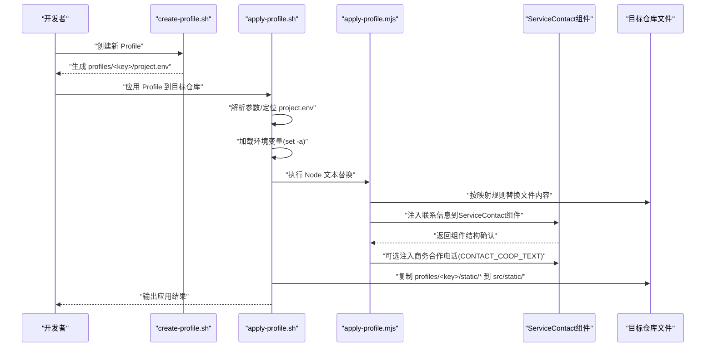
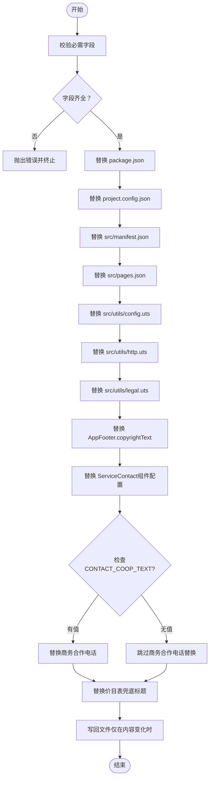
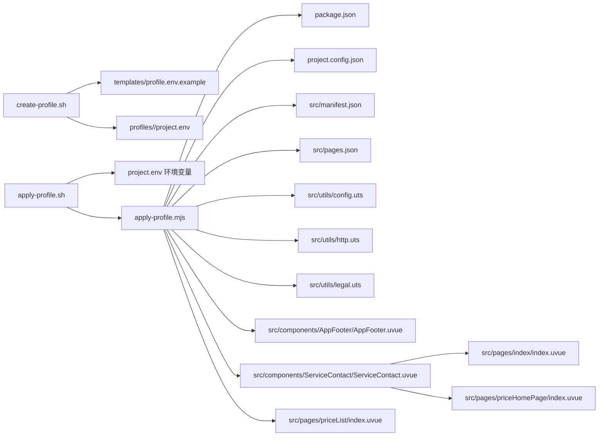

# Profile应用流程

<cite>
**本文引用的文件**
- [create-profile.sh](file://scripts/create-profile.sh)
- [apply-profile.sh](file://scripts/apply-profile.sh)
- [apply-profile.mjs](file://scripts/lib/apply-profile.mjs)
- [profile.env.example](file://scripts/templates/profile.env.example)
- [blueberry/project.env](file://profiles/blueberry/project.env)
- [huahua/project.env](file://profiles/huahua/project.env)
- [README.md](file://README.md)
- [build-all-profiles.sh](file://scripts/build-all-profiles.sh)
- [config.uts](file://src/utils/config.uts)
- [http.uts](file://src/utils/http.uts)
- [manifest.json](file://src/manifest.json)
- [pages.json](file://src/pages.json)
- [legal.uts](file://src/utils/legal.uts)
- [AppFooter.uvue](file://src/components/AppFooter/AppFooter.uvue)
- [ServiceContact.uvue](file://src/components/ServiceContact/ServiceContact.uvue)
- [index/index.uvue](file://src/pages/index/index.uvue)
- [priceHomePage/index.uvue](file://src/pages/priceHomePage/index.uvue)
- [priceList/index.uvue](file://src/pages/priceList/index.uvue)
</cite>

## 更新摘要
**所做更改**
- 新增CONTACT_COOP_TEXT可选环境变量支持，用于动态注入商务合作电话
- 更新updateContactPage函数以支持可选的商务合作电话配置
- 扩展Profile配置系统以支持更灵活的联系方式管理
- 完善ServiceContact组件的配置注入机制

## 目录
1. [简介](#简介)
2. [项目结构](#项目结构)
3. [核心组件](#核心组件)
4. [架构总览](#架构总览)
5. [详细组件分析](#详细组件分析)
6. [依赖分析](#依赖分析)
7. [性能考虑](#性能考虑)
8. [故障排查指南](#故障排查指南)
9. [结论](#结论)
10. [附录](#附录)

## 简介
本指南面向需要基于模板仓库为不同小程序项目应用"Profile"的工程师与运营人员。内容涵盖从创建 Profile、应用 Profile、到校验与发布的完整工作流，重点说明以下要点：
- 如何使用 create-profile.sh 创建新的项目配置
- 如何使用 apply-profile.sh 将 Profile 的变量映射到目标仓库的配置文件
- Profile 应用过程中的文件替换规则与映射关系
- **新增** updateContactPage函数增强支持可选的CONTACT_COOP_TEXT环境变量，实现商务合作电话的动态注入
- 如何验证 Profile 应用是否成功
- Profile 切换与回滚的操作步骤
- 常见问题与自动化脚本使用注意事项

## 项目结构
该仓库采用"模板 + Profile + 自动化脚本"的组织方式：
- scripts/：自动化脚本与核心逻辑
  - create-profile.sh：创建新 Profile
  - apply-profile.sh：应用 Profile 到目标仓库
  - lib/apply-profile.mjs：Node 脚本，负责精确文本替换
  - templates/profile.env.example：Profile 模板
- profiles/：各项目的私有配置
  - profiles/<project-key>/project.env：项目私有变量
  - profiles/<project-key>/static/：可选静态资源（会被复制到目标仓库 src/static/）
- src/：源码目录，包含清单、页面、工具模块等
  - components/ServiceContact/：集中式服务联系方式组件
- README.md：项目说明与工作流指引

```mermaid
graph TB
subgraph "模板仓库"
S1["scripts/create-profile.sh"]
S2["scripts/apply-profile.sh"]
S3["scripts/lib/apply-profile.mjs"]
T1["scripts/templates/profile.env.example"]
P1["profiles/blueberry/project.env"]
P2["profiles/huahua/project.env"]
end
subgraph "目标仓库"
R1["src/manifest.json"]
R2["src/pages.json"]
R3["src/utils/config.uts"]
R4["src/utils/http.uts"]
R5["src/utils/legal.uts"]
R6["src/components/AppFooter/AppFooter.uvue"]
R7["src/components/ServiceContact/ServiceContact.uvue"]
R8["src/pages/index/index.uvue"]
R9["src/pages/priceHomePage/index.uvue"]
R10["src/pages/priceList/index.uvue"]
end
S1 --> T1
S1 --> P1
S1 --> P2
S2 --> S3
S2 --> P1
S2 --> P2
S2 --> R1
S2 --> R2
S2 --> R3
S2 --> R4
S2 --> R5
S2 --> R6
S2 --> R7
S2 --> R8
S2 --> R9
S2 --> R10
```

**图表来源**
- [create-profile.sh:1-77](file://scripts/create-profile.sh#L1-L77)
- [apply-profile.sh:1-98](file://scripts/apply-profile.sh#L1-L98)
- [apply-profile.mjs:1-201](file://scripts/lib/apply-profile.mjs#L1-L201)
- [profile.env.example:1-27](file://scripts/templates/profile.env.example#L1-L27)
- [blueberry/project.env:1-23](file://profiles/blueberry/project.env#L1-L23)
- [huahua/project.env:1-24](file://profiles/huahua/project.env#L1-L24)

章节来源
- [README.md:85-130](file://README.md#L85-L130)

## 核心组件
- create-profile.sh：基于模板生成新 Profile，填充基础字段并提示后续步骤
- apply-profile.sh：解析参数定位 Profile 文件，加载环境变量，调用 Node 脚本进行精确替换，必要时复制静态资源
- apply-profile.mjs：严格校验必需字段，按映射规则对目标文件进行文本替换，避免误伤
- **ServiceContact组件**：集中式的服务保障和联系我们区块，支持动态配置注入，包括可选的商务合作电话
- Profile 模板与示例：templates/profile.env.example 与 profiles/blueberry、profiles/huahua 提供字段与示例值

章节来源
- [create-profile.sh:1-77](file://scripts/create-profile.sh#L1-L77)
- [apply-profile.sh:1-98](file://scripts/apply-profile.sh#L1-L98)
- [apply-profile.mjs:1-201](file://scripts/lib/apply-profile.mjs#L1-L201)
- [ServiceContact.uvue:1-213](file://src/components/ServiceContact/ServiceContact.uvue#L1-L213)
- [profile.env.example:1-27](file://scripts/templates/profile.env.example#L1-L27)
- [blueberry/project.env:1-23](file://profiles/blueberry/project.env#L1-L23)
- [huahua/project.env:1-24](file://profiles/huahua/project.env#L1-L24)

## 架构总览
Profile 应用流程分为"创建"和"应用"两大阶段：
- 创建阶段：基于模板生成 project.env，填充基础字段
- 应用阶段：apply-profile.sh 读取 project.env，将变量注入到目标仓库的多个配置文件与页面中，并可复制静态资源
- **新增**：updateContactPage函数增强支持可选的CONTACT_COOP_TEXT环境变量，实现商务合作电话的动态注入

**图表来源**
- [create-profile.sh:1-77](file://scripts/create-profile.sh#L1-L77)
- [apply-profile.sh:1-98](file://scripts/apply-profile.sh#L1-L98)
- [apply-profile.mjs:1-201](file://scripts/lib/apply-profile.mjs#L1-L201)

## 详细组件分析

### create-profile.sh 使用指南
- 作用：基于模板生成新 Profile，创建 project.env 与 static 目录
- 参数
  - <project-key>：必填，作为 Profile 目录名与多项字段的默认值
  - --profiles-dir <dir>：自定义 Profiles 目录（默认仓库根目录下的 profiles）
  - --force：强制覆盖已存在的 project.env
  - -h/--help：显示帮助
- 行为
  - 校验参数并创建目录
  - 复制模板到 profiles/<project-key>/project.env
  - 使用 Perl 将模板中的占位符替换为实际值（如 PROJECT_KEY、PACKAGE_NAME 等）
  - 输出下一步操作提示（编辑 project.env、放置静态资源、执行构建）

章节来源
- [create-profile.sh:1-77](file://scripts/create-profile.sh#L1-L77)
- [profile.env.example:1-27](file://scripts/templates/profile.env.example#L1-L27)

### apply-profile.sh 工作原理
- 作用：将 Profile 的变量应用到目标仓库的多个配置文件与页面
- 参数
  - <profile-key>：Profile 目录名（与 profiles/<profile-key>/project.env 对应）
  - --repo <target-repo>：目标仓库路径（默认为脚本所在仓库）
  - --profile-file <file>：直接指定 project.env 文件路径（优先级高于 <profile-key>）
  - -h/--help：显示帮助
- 核心流程
  - 解析参数，定位 project.env（优先 --profile-file，其次 TOOL_ROOT/profiles/<key>，最后 TARGET_REPO/profiles/<key>）
  - 加载环境变量（set -a），确保 apply-profile.mjs 能读取到所有变量
  - 调用 Node 脚本执行精确替换
  - 若 profiles/<key>/static 存在且包含文件，则复制到目标仓库 src/static/

章节来源
- [apply-profile.sh:1-98](file://scripts/apply-profile.sh#L1-L98)

### apply-profile.mjs 映射规则与替换逻辑
- 必需字段校验：在应用前强制校验以下字段均非空，否则抛错
  - PROJECT_KEY、PACKAGE_NAME、MANIFEST_NAME、DESCRIPTION、MP_WEIXIN_APPID、NAVIGATION_TITLE、COPYRIGHT_TEXT、CONTACT_PHONE_TEXT、CONTACT_QR_SRC、PRICE_FALLBACK_TITLE、API_BASE_URL、MINI_APP_NAME
- **新增** CONTACT_COOP_TEXT 可选字段：用于设置商务合作电话，留空则保持模板代码默认值
- 替换策略
  - 仅在匹配到目标模式时才进行替换，否则抛错，避免误伤
  - 写入前对比文件内容，若无变化则不写入，减少不必要的磁盘写入
  - 对部分文件采用精确正则替换，确保只变更期望字段
- 文件映射与替换点
  - package.json：name 字段
  - project.config.json：appid 字段
  - src/manifest.json：name、description、mp-weixin.appid
  - src/pages.json：globalStyle.navigationBarTitleText；若缺失协议路由则自动插入
  - src/utils/config.uts：baseURL
  - src/utils/http.uts：finalHeader 中的 X-App-Code（为空则移除）
  - src/utils/legal.uts：MINI_APP_NAME
  - src/components/AppFooter/AppFooter.uvue：copyrightText
  - **src/components/ServiceContact/ServiceContact.uvue**：二维码 src、联系电话、**可选的商务合作电话**
  - src/pages/priceList/index.uvue：价目表兜底标题

**图表来源**
- [apply-profile.mjs:1-201](file://scripts/lib/apply-profile.mjs#L1-L201)

章节来源
- [apply-profile.mjs:12-31](file://scripts/lib/apply-profile.mjs#L12-L31)
- [apply-profile.mjs:158-173](file://scripts/lib/apply-profile.mjs#L158-L173)
- [apply-profile.mjs:189-201](file://scripts/lib/apply-profile.mjs#L189-L201)

### ServiceContact组件详解
- **组件位置**：src/components/ServiceContact/ServiceContact.uvue
- **设计目标**：
  - 收敛首页/价目表页底部的重复区块（服务保障列表 / 联系我们二维码与电话）
  - 二维码 src、联系电话（及**可选的商务合作电话**）由 profile 注入脚本一处替换
  - 组件内不得含硬编码品牌信息
- **注入合同**：保持 `<image class="code">` 与 `<view class="label">联系电话</view>` + `<view class="val">…</view>` 的结构不变，脚本正则依赖此合同
- **配置字段**：
  - CONTACT_QR_SRC：二维码图片地址
  - CONTACT_PHONE_TEXT：联系电话文案
  - **CONTACT_COOP_TEXT：商务合作电话（可选）**

章节来源
- [ServiceContact.uvue:1-213](file://src/components/ServiceContact/ServiceContact.uvue#L1-L213)
- [apply-profile.mjs:158-173](file://scripts/lib/apply-profile.mjs#L158-L173)

### Profile 文件与示例
- 模板：scripts/templates/profile.env.example，包含所有可用字段及注释
- 示例：profiles/blueberry 与 profiles/huahua 提供了两个参考配置，便于理解字段含义与取值
- **新增字段**：CONTACT_COOP_TEXT 用于设置商务合作电话，留空则保持模板代码默认值

章节来源
- [profile.env.example:1-27](file://scripts/templates/profile.env.example#L1-L27)
- [blueberry/project.env:1-23](file://profiles/blueberry/project.env#L1-L23)
- [huahua/project.env:1-24](file://profiles/huahua/project.env#L1-L24)

### 目标文件与替换点详解
- src/manifest.json：包含 name、description、mp-weixin.appid 等字段，会被 Profile 覆盖
- src/pages.json：包含全局导航栏标题与协议页面路由，应用阶段会自动补全协议路由
- src/utils/config.uts：baseURL 会被替换
- src/utils/http.uts：finalHeader 中的 X-App-Code 会被替换或移除
- src/utils/legal.uts：MINI_APP_NAME 会被替换
- src/components/AppFooter/AppFooter.uvue：copyrightText 会被替换
- **src/components/ServiceContact/ServiceContact.uvue**：二维码 src、联系电话、**可选的商务合作电话**会被替换
- **src/pages/index/index.uvue**：使用 ServiceContact 组件
- **src/pages/priceHomePage/index.uvue**：使用 ServiceContact 组件
- src/pages/priceList/index.uvue：价目表兜底标题会被替换

章节来源
- [manifest.json:1-73](file://src/manifest.json#L1-L73)
- [pages.json:1-90](file://src/pages.json#L1-L90)
- [config.uts:1-12](file://src/utils/config.uts#L1-L12)
- [http.uts:1-82](file://src/utils/http.uts#L1-L82)
- [legal.uts:1-16](file://src/utils/legal.uts#L1-L16)
- [AppFooter.uvue:1-25](file://src/components/AppFooter/AppFooter.uvue#L1-L25)
- [ServiceContact.uvue:1-213](file://src/components/ServiceContact/ServiceContact.uvue#L1-L213)
- [index/index.uvue:62-63](file://src/pages/index/index.uvue#L62-L63)
- [priceHomePage/index.uvue:17-18](file://src/pages/priceHomePage/index.uvue#L17-L18)
- [priceList/index.uvue:1-113](file://src/pages/priceList/index.uvue#L1-L113)

## 依赖分析
- 脚本间依赖
  - apply-profile.sh 依赖 apply-profile.mjs 执行精确替换
  - create-profile.sh 依赖 templates/profile.env.example 生成初始配置
- 目标文件依赖
  - apply-profile.mjs 依赖目标仓库的若干配置文件与页面，替换前会先读取原始内容并进行模式匹配
  - **ServiceContact组件**被首页和价目表页共同引用，实现配置统一
- 外部依赖
  - Node.js ESM 模块（apply-profile.mjs）
  - Bash 环境（apply-profile.sh、create-profile.sh）

**图表来源**
- [apply-profile.sh:1-98](file://scripts/apply-profile.sh#L1-L98)
- [apply-profile.mjs:1-201](file://scripts/lib/apply-profile.mjs#L1-L201)
- [profile.env.example:1-27](file://scripts/templates/profile.env.example#L1-L27)

章节来源
- [apply-profile.sh:1-98](file://scripts/apply-profile.sh#L1-L98)
- [apply-profile.mjs:1-201](file://scripts/lib/apply-profile.mjs#L1-L201)

## 性能考虑
- 写入优化：仅在内容发生变化时才写回文件，减少磁盘 IO
- 模式匹配：对每处替换进行模式存在性校验，避免无效写入
- 静态资源复制：仅在 profiles/<key>/static 存在且包含文件时才复制，降低冗余操作
- **组件复用**：ServiceContact组件的集中化管理减少了重复代码和维护成本
- **条件替换**：CONTACT_COOP_TEXT为可选字段，仅在设置时进行替换，提升性能

章节来源
- [apply-profile.mjs:41-48](file://scripts/lib/apply-profile.mjs#L41-L48)
- [apply-profile.mjs:50-63](file://scripts/lib/apply-profile.mjs#L50-L63)
- [apply-profile.sh:91-95](file://scripts/apply-profile.sh#L91-L95)

## 故障排查指南
- 问题：应用时报错提示某字段缺失
  - 排查：确认 project.env 中对应字段已设置且非空
  - 参考：必需字段清单
- 问题：pages.json 未自动插入协议路由
  - 排查：确认 pages.json 中的数组闭合标记存在，否则替换会失败
- 问题：静态资源未生效
  - 排查：确认 profiles/<key>/static 下存在文件，且路径正确
- 问题：AppID 不一致导致校验失败
  - 排查：确认 project.config.json 与 src/manifest.json 的 mp-weixin.appid 已被替换为 Profile 中的值
- 问题：X-App-Code 未更新
  - 排查：确认 APP_CODE 已设置；若为空，脚本会移除该请求头
- **问题：ServiceContact组件联系信息未更新**
  - 排查：确认 CONTACT_QR_SRC、CONTACT_PHONE_TEXT 字段已正确设置
  - 排查：检查 ServiceContact 组件中的 HTML 结构是否与脚本正则匹配
  - 排查：确认 CONTACT_COOP_TEXT 字段格式正确（如需设置商务合作电话）
- **问题：ServiceContact组件样式异常**
  - 排查：确认组件结构未被破坏，特别是 `<image class="code">` 和相关 view 标签
  - 排查：检查静态资源路径是否正确
- **问题：商务合作电话未显示**
  - 排查：确认 CONTACT_COOP_TEXT 字段已设置且非空
  - 排查：检查 ServiceContact 组件中是否存在对应的 HTML 结构

章节来源
- [apply-profile.mjs:12-31](file://scripts/lib/apply-profile.mjs#L12-L31)
- [apply-profile.mjs:100-135](file://scripts/lib/apply-profile.mjs#L100-L135)
- [apply-profile.mjs:143-150](file://scripts/lib/apply-profile.mjs#L143-L150)
- [apply-profile.mjs:158-173](file://scripts/lib/apply-profile.mjs#L158-L173)
- [apply-profile.sh:91-95](file://scripts/apply-profile.sh#L91-L95)

## 结论
通过 create-profile.sh 与 apply-profile.sh 的配合，模板仓库实现了"一套源码、多份配置"的高效复用。**新增的updateContactPage函数增强功能**进一步提升了联系方式管理的灵活性，通过支持可选的CONTACT_COOP_TEXT环境变量，实现了商务合作电话的动态注入。ServiceContact组件的统一配置注入机制确保了联系信息和二维码能够在所有相关页面中统一管理和更新。apply-profile.mjs 以严格的模式匹配与内容比较保障了替换的准确性与稳定性。结合 README 的批量构建脚本，团队可快速为多个项目生成与校验构建产物。

## 附录

### Profile 应用映射总表
- PROJECT_KEY：项目唯一标识（用于生成与替换）
- PACKAGE_NAME：写入 package.json 的 name
- MANIFEST_NAME/DESCRIPTION：写入 src/manifest.json 的 name 与 description
- MP_WEIXIN_APPID：写入 project.config.json 与 src/manifest.json 的 mp-weixin.appid
- NAVIGATION_TITLE：写入 src/pages.json 的 globalStyle.navigationBarTitleText
- API_BASE_URL：写入 src/utils/config.uts 的 baseURL
- APP_CODE：写入 src/utils/http.uts 的 X-App-Code（为空则移除）
- MINI_APP_NAME：写入 src/utils/legal.uts 的 MINI_APP_NAME
- **CONTACT_QR_SRC/CONTACT_PHONE_TEXT/COPYRIGHT_TEXT**：写入 ServiceContact 组件的联系信息与 AppFooter 的版权文案
- **CONTACT_COOP_TEXT**：**写入 ServiceContact 组件的商务合作电话（可选）**
- PRICE_FALLBACK_TITLE：写入 src/pages/priceList/index.uvue 的价目表兜底标题
- profiles/<key>/static/*：复制到目标仓库 src/static/

章节来源
- [README.md:225-240](file://README.md#L225-L240)

### Profile 应用流程操作步骤
- 创建 Profile
  - 执行 create-profile.sh <project-key>，编辑生成的 profiles/<project-key>/project.env
  - 如需替换素材，将文件放入 profiles/<project-key>/static/
  - **配置ServiceContact组件**：设置 CONTACT_QR_SRC、CONTACT_PHONE_TEXT，**可选设置 CONTACT_COOP_TEXT**
- 应用 Profile
  - 在模板仓库或目标仓库执行 apply-profile.sh <profile-key> --repo <target-repo>
  - 或使用 build-miniapp.sh <profile-key> --repo <target-repo> 一键完成模板同步、应用配置、编译与校验
- 验证应用
  - 校验项目清单与页面：AppID、导航栏标题、协议页面是否存在
  - 校验请求头：X-App-Code 是否正确
  - 校验文案：联系二维码、电话、版权、价目表兜底标题等
  - **校验ServiceContact组件**：确认联系信息已正确注入到组件中，**包括可选的商务合作电话**
  - 可选：使用 RESIDUAL_SEARCH_REGEX 扫描残留字符串
- 切换与回滚
  - 切换：再次执行 apply-profile.sh 指向新的 <profile-key> 或 --profile-file
  - 回滚：将目标仓库的上述文件备份后重放替换，或使用 Git 历史版本恢复

章节来源
- [README.md:242-286](file://README.md#L242-L286)
- [apply-profile.sh:10-27](file://scripts/apply-profile.sh#L10-L27)
- [apply-profile.mjs:12-31](file://scripts/lib/apply-profile.mjs#L12-L31)

### 批量构建与验证
- 批量构建：使用 build-all-profiles.sh 可一次性为 profiles/ 下的所有项目执行构建
- 验证：verify-miniapp.sh 会校验 AppID、导航栏标题、协议页面、请求头与可选残留字符串

章节来源
- [build-all-profiles.sh:1-178](file://scripts/build-all-profiles.sh#L1-L178)
- [README.md:277-285](file://README.md#L277-L285)

### ServiceContact组件使用示例
- **组件位置**：src/components/ServiceContact/ServiceContact.uvue
- **使用页面**：
  - src/pages/index/index.uvue：首页底部服务联系方式
  - src/pages/priceHomePage/index.uvue：价目表页底部服务联系方式
- **配置字段**：
  - CONTACT_QR_SRC：二维码图片地址，支持本地静态资源或远程URL
  - CONTACT_PHONE_TEXT：联系电话文案，如"18068842642（微信同号）"
  - **CONTACT_COOP_TEXT：商务合作电话（可选），如"13269920775"**
- **HTML结构要求**：
  - 必须包含 `<image class="code">` 标签用于显示二维码
  - 必须包含 `<view class="label">联系电话</view>` 和对应的 `<view class="val">` 标签
  - **可选包含 `<view class="label">商务合作</view>` 和对应的 `<view class="val">` 标签**

章节来源
- [ServiceContact.uvue:1-213](file://src/components/ServiceContact/ServiceContact.uvue#L1-L213)
- [index/index.uvue:62-63](file://src/pages/index/index.uvue#L62-L63)
- [priceHomePage/index.uvue:17-18](file://src/pages/priceHomePage/index.uvue#L17-L18)
- [profile.env.example:14-17](file://scripts/templates/profile.env.example#L14-L17)