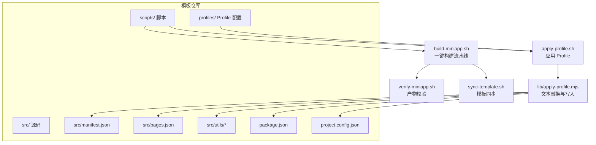
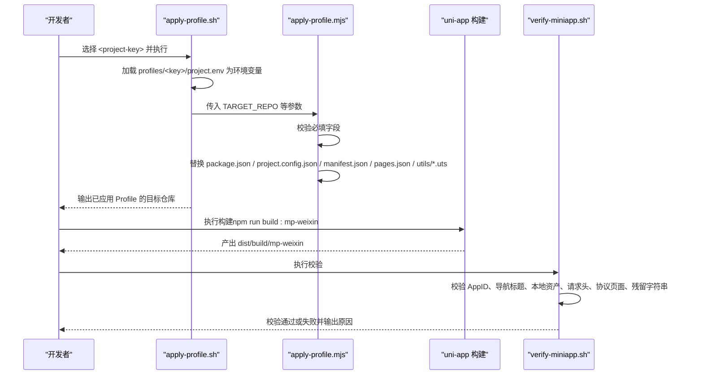
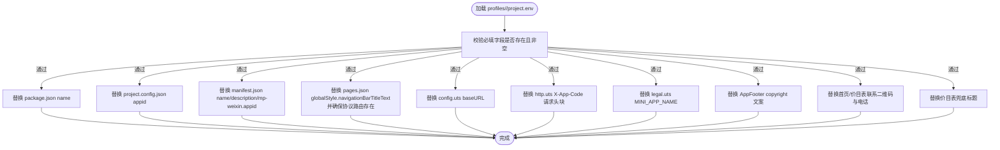
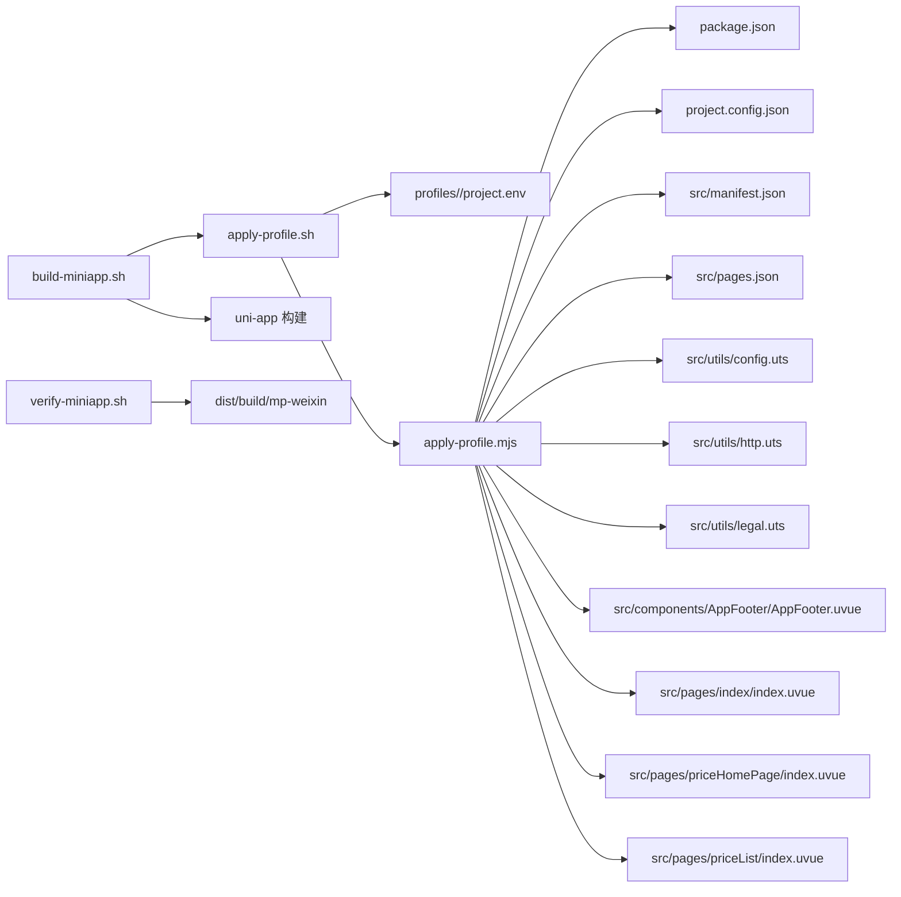

# Profile机制原理

<cite>
**本文引用的文件**
- [profiles/blueberry/project.env](file://profiles/blueberry/project.env)
- [profiles/huahua/project.env](file://profiles/huahua/project.env)
- [scripts/lib/apply-profile.mjs](file://scripts/lib/apply-profile.mjs)
- [scripts/templates/profile.env.example](file://scripts/templates/profile.env.example)
- [scripts/apply-profile.sh](file://scripts/apply-profile.sh)
- [scripts/build-miniapp.sh](file://scripts/build-miniapp.sh)
- [scripts/verify-miniapp.sh](file://scripts/verify-miniapp.sh)
- [scripts/sync-template.sh](file://scripts/sync-template.sh)
- [scripts/create-profile.sh](file://scripts/create-profile.sh)
- [scripts/new-miniapp-project.sh](file://scripts/new-miniapp-project.sh)
- [src/manifest.json](file://src/manifest.json)
- [src/pages.json](file://src/pages.json)
- [src/utils/config.uts](file://src/utils/config.uts)
- [src/utils/http.uts](file://src/utils/http.uts)
- [src/utils/legal.uts](file://src/utils/legal.uts)
- [package.json](file://package.json)
- [project.config.json](file://project.config.json)
- [README.md](file://README.md)
</cite>

## 目录
1. [简介](#简介)
2. [项目结构](#项目结构)
3. [核心组件](#核心组件)
4. [架构总览](#架构总览)
5. [详细组件分析](#详细组件分析)
6. [依赖关系分析](#依赖关系分析)
7. [性能考量](#性能考量)
8. [故障排查指南](#故障排查指南)
9. [结论](#结论)
10. [附录](#附录)

## 简介
本文件系统性阐述 blueBerry 模板的 Profile 机制原理与实践，围绕「一套模板，多个小程序」的开发模式展开，重点说明：
- Profile 的设计理念与架构原理
- ProjectKey 的作用与命名规范
- PackageName、ManifestName 等关键字段对应用标识的影响
- 如何通过环境变量驱动应用在构建过程中的差异化行为
- Profile 系统与 uni-app 框架的集成方式及自动化构建流程
- 优势分析与适用场景

## 项目结构
该仓库采用「模板 + Profile + 自动化脚本」的组织方式：
- 模板源码集中在 src/，统一维护页面、组件、工具模块与清单配置
- Profile 配置集中于 profiles/<project-key>/project.env，按项目隔离私有变量
- 自动化脚本位于 scripts/，负责模板同步、Profile 应用、构建与校验

**图表来源**
- [scripts/apply-profile.sh:1-98](file://scripts/apply-profile.sh#L1-L98)
- [scripts/lib/apply-profile.mjs:1-190](file://scripts/lib/apply-profile.mjs#L1-L190)
- [scripts/build-miniapp.sh:1-106](file://scripts/build-miniapp.sh#L1-L106)
- [scripts/verify-miniapp.sh:1-165](file://scripts/verify-miniapp.sh#L1-L165)
- [scripts/sync-template.sh:1-81](file://scripts/sync-template.sh#L1-L81)
- [src/manifest.json:1-73](file://src/manifest.json#L1-L73)
- [src/pages.json:1-90](file://src/pages.json#L1-L90)
- [package.json:1-48](file://package.json#L1-L48)
- [project.config.json:1-35](file://project.config.json#L1-L35)

**章节来源**
- [README.md:85-130](file://README.md#L85-L130)
- [README.md:169-240](file://README.md#L169-L240)

## 核心组件
- Profile 配置文件：profiles/<project-key>/project.env，定义项目私有变量（如 AppID、品牌名、导航标题、API 域名、联系信息、协议名称等）
- 应用脚本：scripts/apply-profile.sh，负责加载 Profile 并调用 apply-profile.mjs
- 文本替换引擎：scripts/lib/apply-profile.mjs，按字段映射规则批量更新 package.json、project.config.json、src/manifest.json、src/pages.json、src/utils/*.uts 等文件
- 构建流水线：scripts/build-miniapp.sh，串联模板同步、应用 Profile、安装依赖、构建与校验
- 产物校验：scripts/verify-miniapp.sh，验证 AppID、导航标题、本地资产、请求头、协议页面与残留字符串
- 模板同步：scripts/sync-template.sh，将模板的 src/pages、src/utils、src/components 等公共代码同步至目标仓库
- 新项目孵化：scripts/new-miniapp-project.sh，从模板创建新仓库并生成初始 Profile
- Profile 模板：scripts/templates/profile.env.example，提供字段说明与默认值参考

**章节来源**
- [README.md:169-240](file://README.md#L169-L240)
- [scripts/apply-profile.sh:1-98](file://scripts/apply-profile.sh#L1-L98)
- [scripts/lib/apply-profile.mjs:1-190](file://scripts/lib/apply-profile.mjs#L1-L190)
- [scripts/build-miniapp.sh:1-106](file://scripts/build-miniapp.sh#L1-L106)
- [scripts/verify-miniapp.sh:1-165](file://scripts/verify-miniapp.sh#L1-L165)
- [scripts/sync-template.sh:1-81](file://scripts/sync-template.sh#L1-L81)
- [scripts/new-miniapp-project.sh:1-100](file://scripts/new-miniapp-project.sh#L1-L100)
- [scripts/templates/profile.env.example:1-25](file://scripts/templates/profile.env.example#L1-L25)

## 架构总览
Profile 机制通过「环境变量驱动 + 文本替换 + uni-app 构建」实现「一套模板，多个小程序」：
- 开发者在 profiles/<project-key>/project.env 中维护项目私有变量
- apply-profile.sh 加载该文件为环境变量，交由 apply-profile.mjs 执行精确文本替换
- 构建阶段 uni-app 读取更新后的清单与工具模块，生成差异化产物
- verify-miniapp.sh 对产物进行一致性与合规性校验，防止串号与残留模板字符串

**图表来源**
- [scripts/apply-profile.sh:78-89](file://scripts/apply-profile.sh#L78-L89)
- [scripts/lib/apply-profile.mjs:12-31](file://scripts/lib/apply-profile.mjs#L12-L31)
- [scripts/lib/apply-profile.mjs:73-91](file://scripts/lib/apply-profile.mjs#L73-L91)
- [scripts/build-miniapp.sh:97-102](file://scripts/build-miniapp.sh#L97-L102)
- [scripts/verify-miniapp.sh:111-159](file://scripts/verify-miniapp.sh#L111-L159)

## 详细组件分析

### Profile 配置与字段映射
- 必填字段：PROJECT_KEY、PACKAGE_NAME、MANIFEST_NAME、DESCRIPTION、MP_WEIXIN_APPID、NAVIGATION_TITLE、COPYRIGHT_TEXT、CONTACT_PHONE_TEXT、CONTACT_QR_SRC、PRICE_FALLBACK_TITLE、API_BASE_URL、APP_CODE、MINI_APP_NAME
- 可选字段：RESIDUAL_SEARCH_REGEX（用于构建后残留字符串扫描）
- 字段映射：apply-profile.mjs 将上述字段写入 package.json、project.config.json、src/manifest.json、src/pages.json、src/utils/config.uts、src/utils/http.uts、src/utils/legal.uts、src/components/AppFooter/AppFooter.uvue、src/pages/index/index.uvue、src/pages/priceHomePage/index.uvue、src/pages/priceList/index.uvue 等

**图表来源**
- [scripts/lib/apply-profile.mjs:12-31](file://scripts/lib/apply-profile.mjs#L12-L31)
- [scripts/lib/apply-profile.mjs:73-91](file://scripts/lib/apply-profile.mjs#L73-L91)
- [scripts/lib/apply-profile.mjs:137-150](file://scripts/lib/apply-profile.mjs#L137-L150)
- [scripts/lib/apply-profile.mjs:152-177](file://scripts/lib/apply-profile.mjs#L152-L177)

**章节来源**
- [README.md:180-240](file://README.md#L180-L240)
- [scripts/lib/apply-profile.mjs:12-31](file://scripts/lib/apply-profile.mjs#L12-L31)
- [scripts/lib/apply-profile.mjs:73-91](file://scripts/lib/apply-profile.mjs#L73-L91)
- [scripts/lib/apply-profile.mjs:137-150](file://scripts/lib/apply-profile.mjs#L137-L150)
- [scripts/lib/apply-profile.mjs:152-177](file://scripts/lib/apply-profile.mjs#L152-L177)

### ProjectKey 的作用与命名规范
- 作用：作为 profiles/<project-key>/project.env 的目录名，决定该实例的唯一标识与配置来源
- 命名建议：使用小写字母、数字与短横线组合，避免特殊字符；与业务线或品牌名保持一致，便于团队协作与 CI/CD 识别
- 示例：blueberry、huahua

**章节来源**
- [README.md:169-178](file://README.md#L169-L178)
- [profiles/blueberry/project.env:3](file://profiles/blueberry/project.env#L3)
- [profiles/huahua/project.env:4](file://profiles/huahua/project.env#L4)

### 关键字段对应用标识的影响
- PACKAGE_NAME：写入 package.json 的 name 字段，影响包名与构建产物的元信息
- MANIFEST_NAME / DESCRIPTION：写入 src/manifest.json 的 name 与 description，影响 uni-app 清单与平台展示
- MP_WEIXIN_APPID：同时写入 project.config.json 与 src/manifest.json 的 mp-weixin.appid，确保微信开发者工具与构建结果一致
- NAVIGATION_TITLE：写入 src/pages.json 的 globalStyle.navigationBarTitleText，影响全局导航标题
- MINI_APP_NAME：写入 src/utils/legal.uts，影响协议页面标题与跳转文案
- API_BASE_URL：写入 src/utils/config.uts 的 baseURL，决定接口域名
- APP_CODE：写入 src/utils/http.uts 的 X-App-Code 请求头，用于后端区分不同小程序实例

**章节来源**
- [README.md:225-239](file://README.md#L225-L239)
- [src/manifest.json:1-73](file://src/manifest.json#L1-L73)
- [src/pages.json:56-61](file://src/pages.json#L56-L61)
- [src/utils/config.uts:7-11](file://src/utils/config.uts#L7-L11)
- [src/utils/http.uts:27-31](file://src/utils/http.uts#L27-L31)
- [src/utils/legal.uts:1-16](file://src/utils/legal.uts#L1-L16)
- [project.config.json:32](file://project.config.json#L32)

### 环境变量驱动的应用行为
- apply-profile.sh 使用 set -a 导入 profiles/<key>/project.env 为环境变量，随后传递给 apply-profile.mjs
- apply-profile.mjs 严格校验必填字段，再按映射规则进行文本替换
- 构建阶段 uni-app 读取更新后的清单与工具模块，最终产物体现 Profile 的差异化配置
- verify-miniapp.sh 通过对比产物与 Profile 字段，确保一致性与合规性

**章节来源**
- [scripts/apply-profile.sh:78-89](file://scripts/apply-profile.sh#L78-L89)
- [scripts/lib/apply-profile.mjs:12-31](file://scripts/lib/apply-profile.mjs#L12-L31)
- [scripts/verify-miniapp.sh:111-159](file://scripts/verify-miniapp.sh#L111-L159)

### 与 uni-app 框架的集成
- 构建命令：package.json 中提供 dev:mp-weixin 与 build:mp-weixin，分别对应开发与生产构建
- 清单与页面：src/manifest.json 与 src/pages.json 由 Profile 更新，uni-app 在构建时读取
- 工具模块：src/utils/config.uts、src/utils/http.uts、src/utils/legal.uts 由 Profile 注入关键配置，影响运行时行为
- 开发者工具：project.config.json 的 appid 由 Profile 写入，避免 AppID 继承失效导致的调试问题

**章节来源**
- [package.json:4-13](file://package.json#L4-L13)
- [src/manifest.json:1-73](file://src/manifest.json#L1-L73)
- [src/pages.json:1-90](file://src/pages.json#L1-L90)
- [src/utils/config.uts:7-11](file://src/utils/config.uts#L7-L11)
- [src/utils/http.uts:27-31](file://src/utils/http.uts#L27-L31)
- [src/utils/legal.uts:1-16](file://src/utils/legal.uts#L1-L16)
- [project.config.json:32](file://project.config.json#L32)

### 构建过程中的自动应用配置
- 一键构建：scripts/build-miniapp.sh 支持 --sync-template、--install、--skip-apply、--skip-verify 等参数，串联模板同步、应用 Profile、安装依赖、构建与校验
- 模板同步：scripts/sync-template.sh 将模板的 src/pages、src/utils、src/components 等公共代码同步至目标仓库，避免外部项目缺失共享组件
- 产物校验：scripts/verify-miniapp.sh 校验 AppID、导航标题、本地资产、请求头、协议页面与残留字符串，防止串号与模板残留

**章节来源**
- [scripts/build-miniapp.sh:14-25](file://scripts/build-miniapp.sh#L14-L25)
- [scripts/build-miniapp.sh:84-102](file://scripts/build-miniapp.sh#L84-L102)
- [scripts/sync-template.sh:13-31](file://scripts/sync-template.sh#L13-L31)
- [scripts/verify-miniapp.sh:39-44](file://scripts/verify-miniapp.sh#L39-L44)

### Profile 系统的优势与适用场景
- 优势
  - 降低重复劳动：通过 Profile 隔离私有配置，避免在模板中硬编码
  - 提升一致性：统一的文本替换规则与校验流程，减少人为疏漏
  - 易于扩展：新增项目只需创建新的 profiles/<key>/project.env
  - 保障合规：自动生成并校验协议页面，降低审核风险
- 适用场景
  - 同一产品矩阵下孵化多个相似小程序（如旅拍、写真、门店展示等）
  - 需要快速迭代与批量发布的场景
  - 团队协作中需要标准化配置与构建流程的场景

**章节来源**
- [README.md:31-40](file://README.md#L31-L40)

## 依赖关系分析
Profile 机制的关键依赖链路如下：
- scripts/apply-profile.sh 依赖 profiles/<key>/project.env 与 scripts/lib/apply-profile.mjs
- scripts/lib/apply-profile.mjs 依赖目标仓库路径 TARGET_REPO 与各源文件的匹配规则
- 构建阶段依赖 uni-app 读取更新后的清单与工具模块
- scripts/verify-miniapp.sh 依赖产物目录与 Profile 字段进行对比校验

**图表来源**
- [scripts/apply-profile.sh:78-89](file://scripts/apply-profile.sh#L78-L89)
- [scripts/lib/apply-profile.mjs:73-91](file://scripts/lib/apply-profile.mjs#L73-L91)
- [scripts/build-miniapp.sh:88-102](file://scripts/build-miniapp.sh#L88-L102)
- [scripts/verify-miniapp.sh:111-159](file://scripts/verify-miniapp.sh#L111-L159)

**章节来源**
- [scripts/apply-profile.sh:78-89](file://scripts/apply-profile.sh#L78-L89)
- [scripts/lib/apply-profile.mjs:73-91](file://scripts/lib/apply-profile.mjs#L73-L91)
- [scripts/build-miniapp.sh:88-102](file://scripts/build-miniapp.sh#L88-L102)
- [scripts/verify-miniapp.sh:111-159](file://scripts/verify-miniapp.sh#L111-L159)

## 性能考量
- 文本替换复杂度：apply-profile.mjs 对每个目标文件执行一次读取与多次正则替换，整体为 O(N*M)，其中 N 为目标文件数量，M 为替换规则数量。由于替换次数有限且文件规模可控，性能开销可忽略
- 构建时间：构建阶段受 uni-app 编译与打包影响，Profile 机制本身不引入额外编译逻辑
- 校验效率：verify-miniapp.sh 使用 ripgrep（若可用）或 grep 进行快速检索，时间复杂度与产物大小成正比，通常在秒级内完成

[本节为通用性能讨论，不涉及特定文件分析]

## 故障排查指南
- Profile 未找到
  - 现象：apply-profile.sh 报错提示未找到 profile
  - 排查：确认 profiles/<key>/project.env 是否存在，或是否通过 --profile-file 指定
- 必填字段缺失
  - 现象：apply-profile.mjs 抛出字段缺失错误
  - 排查：检查 project.env 是否包含所有必填字段，或使用 scripts/templates/profile.env.example 作为模板
- AppID 不一致
  - 现象：verify-miniapp.sh 校验失败，提示 AppID 不一致
  - 排查：确认 project.config.json 与 src/manifest.json 的 mp-weixin.appid 已被 apply-profile.mjs 更新
- 协议页面缺失
  - 现象：verify-miniapp.sh 提示缺少本地协议页面
  - 排查：使用 --sync-template 参数执行 build-miniapp.sh，确保模板协议页面同步到目标仓库
- 本地资产缺失
  - 现象：verify-miniapp.sh 提示本地联系二维码缺失
  - 排查：确认 CONTACT_QR_SRC 指向 src/static 下存在的文件，或将其复制到目标仓库
- 残留字符串
  - 现象：verify-miniapp.sh 扫描到残留模板字符串
  - 排查：在 project.env 中设置 RESIDUAL_SEARCH_REGEX，包含不应出现在产物中的关键词

**章节来源**
- [scripts/apply-profile.sh:61-73](file://scripts/apply-profile.sh#L61-L73)
- [scripts/lib/apply-profile.mjs:12-31](file://scripts/lib/apply-profile.mjs#L12-L31)
- [scripts/verify-miniapp.sh:111-159](file://scripts/verify-miniapp.sh#L111-L159)

## 结论
Profile 机制通过「环境变量 + 文本替换 + 构建校验」实现了「一套模板，多个小程序」的高效开发模式。其核心价值在于：
- 将项目私有配置与模板源码解耦，降低维护成本
- 统一构建与校验流程，提升一致性与合规性
- 适配 uni-app 框架，无缝衔接开发、构建与发布环节

对于需要快速孵化多个相似小程序的团队，该机制提供了标准化、可扩展且易于落地的解决方案。

[本节为总结性内容，不涉及特定文件分析]

## 附录

### Profile 字段与映射一览
- PROJECT_KEY：项目唯一标识
- PACKAGE_NAME：写入 package.json 的 name
- MANIFEST_NAME / DESCRIPTION：写入 src/manifest.json 的 name 与 description
- MP_WEIXIN_APPID：写入 project.config.json 与 src/manifest.json 的 mp-weixin.appid
- NAVIGATION_TITLE：写入 src/pages.json 的 globalStyle.navigationBarTitleText
- API_BASE_URL：写入 src/utils/config.uts 的 baseURL
- APP_CODE：写入 src/utils/http.uts 的 X-App-Code 请求头
- MINI_APP_NAME：写入 src/utils/legal.uts
- CONTACT_QR_SRC / CONTACT_PHONE_TEXT / COPYRIGHT_TEXT：写入 pages/index 与 pages/priceHomePage
- PRICE_FALLBACK_TITLE：写入 src/pages/priceList/index.uvue
- RESIDUAL_SEARCH_REGEX：构建后残留字符串扫描

**章节来源**
- [README.md:180-240](file://README.md#L180-L240)
