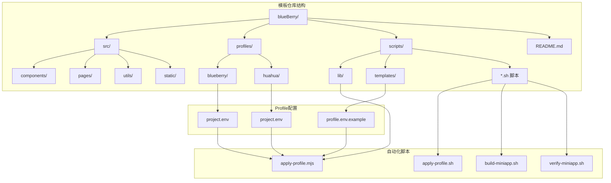
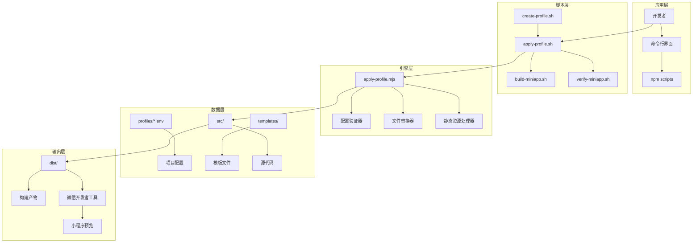
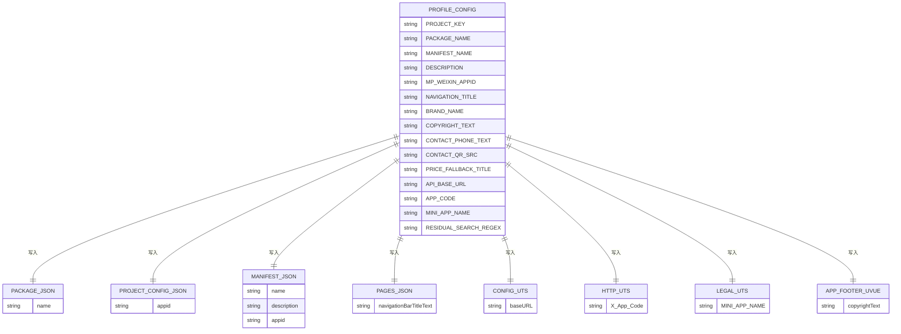
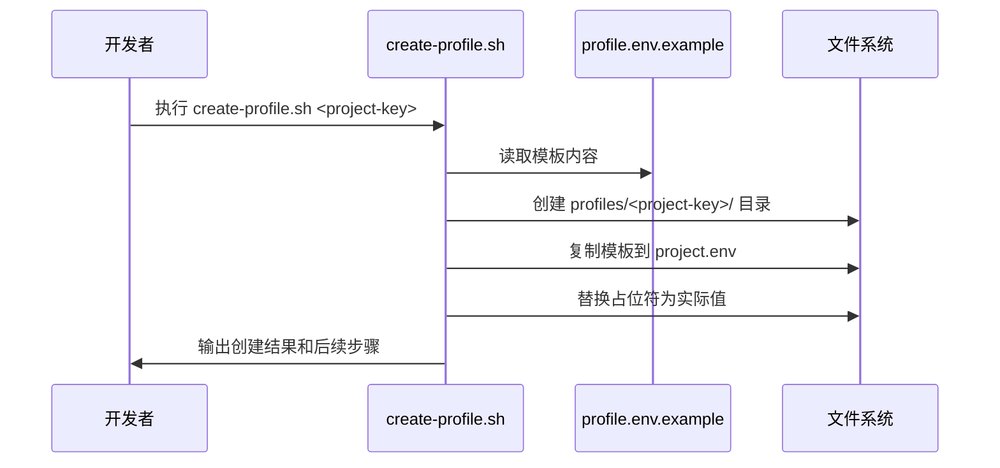
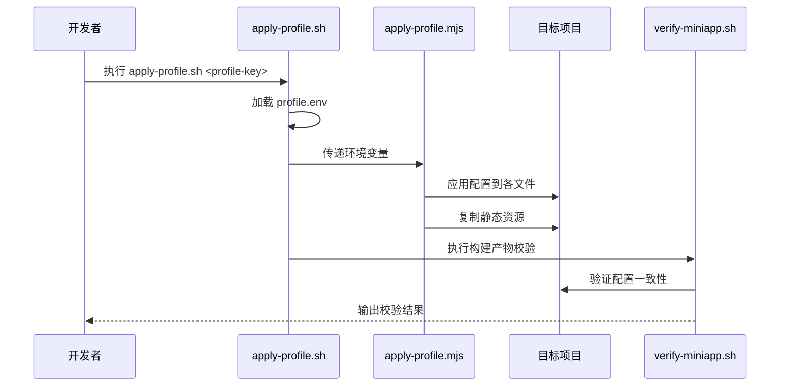
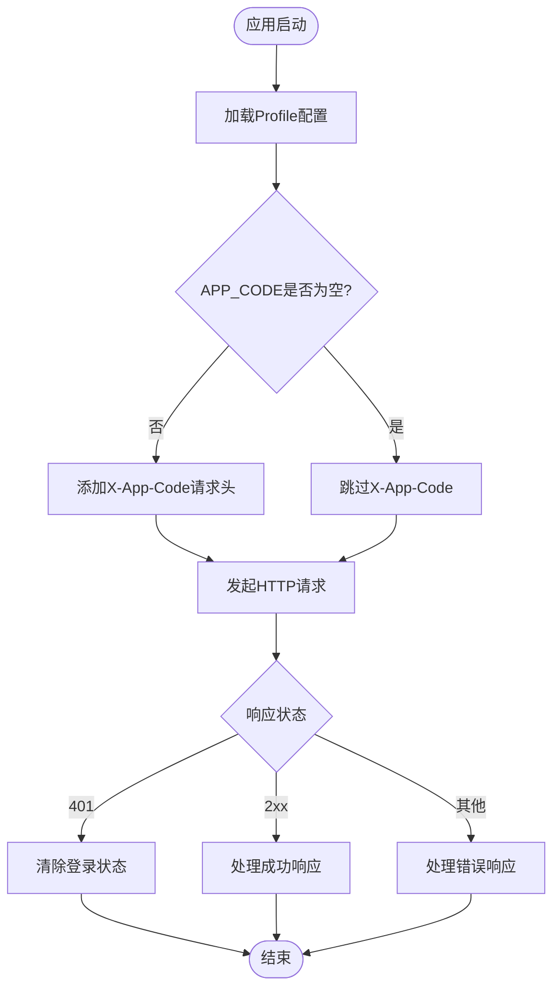
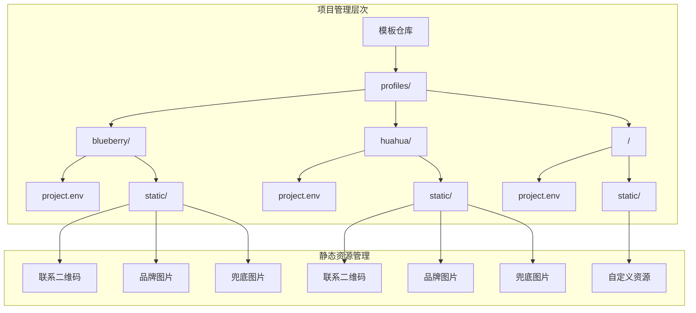
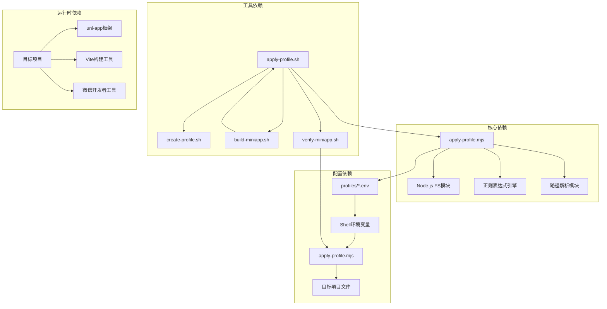
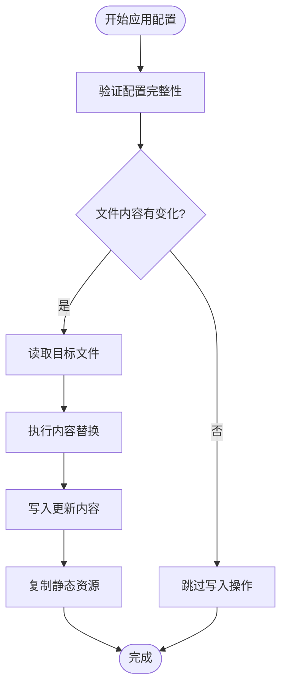

# Profile配置系统

<cite>
**本文档引用的文件**
- [README.md](file://README.md)
- [profiles/blueberry/project.env](file://profiles/blueberry/project.env)
- [profiles/huahua/project.env](file://profiles/huahua/project.env)
- [scripts/lib/apply-profile.mjs](file://scripts/lib/apply-profile.mjs)
- [scripts/templates/profile.env.example](file://scripts/templates/profile.env.example)
- [scripts/create-profile.sh](file://scripts/create-profile.sh)
- [scripts/apply-profile.sh](file://scripts/apply-profile.sh)
- [scripts/build-miniapp.sh](file://scripts/build-miniapp.sh)
- [scripts/verify-miniapp.sh](file://scripts/verify-miniapp.sh)
- [src/utils/config.uts](file://src/utils/config.uts)
- [src/utils/http.uts](file://src/utils/http.uts)
- [src/utils/legal.uts](file://src/utils/legal.uts)
- [src/components/AppFooter/AppFooter.uvue](file://src/components/AppFooter/AppFooter.uvue)
- [src/pages/index/index.uvue](file://src/pages/index/index.uvue)
- [src/pages/priceHomePage/index.uvue](file://src/pages/priceHomePage/index.uvue)
- [src/pages/priceList/index.uvue](file://src/pages/priceList/index.uvue)
- [package.json](file://package.json)
</cite>

## 目录
1. [简介](#简介)
2. [项目结构](#项目结构)
3. [核心组件](#核心组件)
4. [架构概览](#架构概览)
5. [详细组件分析](#详细组件分析)
6. [依赖分析](#依赖分析)
7. [性能考虑](#性能考虑)
8. [故障排除指南](#故障排除指南)
9. [结论](#结论)
10. [附录](#附录)

## 简介

蓝莓小程序项目Profile配置系统是一个强大的多项目管理解决方案，实现了「一套模板，多个小程序」的开发模式。该系统通过Profile机制将项目特定配置与模板代码分离，支持快速孵化多个相似的小程序项目。

### 设计理念

Profile系统的核心设计理念是**配置驱动**和**模板复用**：

- **配置分离**：将AppID、品牌信息、API配置等项目特定信息从模板代码中抽离
- **模板复用**：共享统一的业务逻辑和UI组件，降低重复开发成本
- **自动化集成**：通过脚本自动将Profile配置应用到目标项目中

### 多项目管理优势

1. **快速孵化**：支持同时管理多个小程序项目，每个项目拥有独立的配置
2. **统一维护**：模板代码集中管理，便于功能升级和bug修复
3. **品牌定制**：每个项目可以独立定制品牌信息、联系方式等
4. **开发效率**：减少重复性工作，提高开发和部署效率

## 项目结构

蓝莓小程序项目的整体结构采用分层设计，清晰分离了模板代码、项目配置和自动化脚本。



**图表来源**
- [README.md:85-130](file://README.md#L85-L130)
- [profiles/blueberry/project.env:1-23](file://profiles/blueberry/project.env#L1-L23)
- [profiles/huahua/project.env:1-24](file://profiles/huahua/project.env#L1-L24)

**章节来源**
- [README.md:85-130](file://README.md#L85-L130)
- [README.md:169-240](file://README.md#L169-L240)

## 核心组件

### Profile配置文件

每个小程序项目都有对应的Profile配置文件，位于`profiles/<project-key>/project.env`。这些配置文件定义了项目的所有个性化设置。

#### 必填字段

| 字段 | 作用 | 数据类型 | 示例值 |
|------|------|----------|--------|
| `PROJECT_KEY` | 项目唯一标识 | 字符串 | `"blueberry"` |
| `PACKAGE_NAME` | 写入package.json的name字段 | 字符串 | `"blueberry"` |
| `MANIFEST_NAME` | 写入manifest.json的应用名称 | 字符串 | `"blueBerry"` |
| `DESCRIPTION` | 应用描述信息 | 字符串 | `"蓝莓"` |
| `MP_WEIXIN_APPID` | 微信小程序AppID | 字符串 | `"wxb19ad7426dfb8bd4"` |
| `NAVIGATION_TITLE` | 全局导航栏标题 | 字符串 | `"蓝梅旗袍·汉服·民..."` |
| `COPYRIGHT_TEXT` | 版权信息文本 | 字符串 | `"Copyright 2025 蓝梅旗袍·汉服·民族服体验馆 - 版权所有"` |
| `CONTACT_PHONE_TEXT` | 联系电话显示文本 | 字符串 | `"18068842642（微信同号）"` |
| `CONTACT_QR_SRC` | 联系二维码图片路径 | 字符串 | `"https://www.lanmei66.cloud/admin/admin20250928234704_495_147.png"` |
| `PRICE_FALLBACK_TITLE` | 价目表兜底标题 | 字符串 | `"蓝梅价目表"` |
| `API_BASE_URL` | API基础URL | 字符串 | `"https://lanmei66.cloud/"` |
| `MINI_APP_NAME` | 小程序名称 | 字符串 | `"蓝梅旅拍 SKILL"` |

#### 可选字段

| 字段 | 作用 | 数据类型 | 默认值 |
|------|------|----------|--------|
| `APP_CODE` | X-App-Code请求头值 | 字符串 | `""` |
| `RESIDUAL_SEARCH_REGEX` | 构建后残留字符串扫描正则 | 字符串 | `""` |

**章节来源**
- [README.md:180-201](file://README.md#L180-L201)
- [profiles/blueberry/project.env:3-23](file://profiles/blueberry/project.env#L3-L23)
- [profiles/huahua/project.env:4-24](file://profiles/huahua/project.env#L4-L24)

### 自动化应用引擎

`apply-profile.mjs`是Profile系统的核心引擎，负责将配置文件中的值应用到目标项目中。

#### 核心功能

1. **配置验证**：确保所有必需字段都已设置
2. **文件替换**：将配置值注入到指定文件中
3. **静态资源处理**：复制Profile中的静态资源到目标项目
4. **格式转换**：处理不同文件类型的特殊格式需求

**章节来源**
- [scripts/lib/apply-profile.mjs:12-31](file://scripts/lib/apply-profile.mjs#L12-L31)
- [scripts/lib/apply-profile.mjs:50-63](file://scripts/lib/apply-profile.mjs#L50-L63)

## 架构概览

Profile系统采用分层架构设计，从上到下分别为应用层、脚本层、引擎层和数据层。



**图表来源**
- [scripts/apply-profile.sh:10-27](file://scripts/apply-profile.sh#L10-L27)
- [scripts/build-miniapp.sh:14-25](file://scripts/build-miniapp.sh#L14-L25)
- [scripts/lib/apply-profile.mjs:12-31](file://scripts/lib/apply-profile.mjs#L12-L31)

### 配置应用映射关系

Profile配置通过严格的一对一映射关系应用到各个系统组件中：



**图表来源**
- [scripts/lib/apply-profile.mjs:73-190](file://scripts/lib/apply-profile.mjs#L73-L190)
- [README.md:225-239](file://README.md#L225-L239)

## 详细组件分析

### Profile创建与管理

#### 创建新Profile



**图表来源**
- [scripts/create-profile.sh:66-77](file://scripts/create-profile.sh#L66-L77)
- [scripts/templates/profile.env.example:1-25](file://scripts/templates/profile.env.example#L1-L25)

#### Profile应用流程



**图表来源**
- [scripts/apply-profile.sh:78-98](file://scripts/apply-profile.sh#L78-L98)
- [scripts/lib/apply-profile.mjs:179-190](file://scripts/lib/apply-profile.mjs#L179-L190)
- [scripts/verify-miniapp.sh:114-165](file://scripts/verify-miniapp.sh#L114-L165)

**章节来源**
- [scripts/create-profile.sh:1-77](file://scripts/create-profile.sh#L1-L77)
- [scripts/apply-profile.sh:1-98](file://scripts/apply-profile.sh#L1-L98)
- [scripts/lib/apply-profile.mjs:1-190](file://scripts/lib/apply-profile.mjs#L1-L190)

### 配置应用映射详解

#### 必填字段映射

每个Profile字段都会精确映射到相应的系统组件中：

| Profile字段 | 目标文件 | 映射方式 | 影响范围 |
|-------------|----------|----------|----------|
| `PROJECT_KEY` | `package.json` | JSON键值替换 | 包名标识 |
| `PACKAGE_NAME` | `package.json` | name字段替换 | 依赖管理 |
| `MANIFEST_NAME` | `src/manifest.json` | name字段替换 | 应用显示名称 |
| `DESCRIPTION` | `src/manifest.json` | description字段替换 | 应用描述 |
| `MP_WEIXIN_APPID` | `project.config.json` | appid字段替换 | 微信认证 |
| `MP_WEIXIN_APPID` | `src/manifest.json` | mp-weixin.appid替换 | 构建配置 |
| `NAVIGATION_TITLE` | `src/pages.json` | globalStyle.navigationBarTitleText | 导航标题 |
| `API_BASE_URL` | `src/utils/config.uts` | baseURL常量替换 | 接口域名 |
| `APP_CODE` | `src/utils/http.uts` | X-App-Code请求头 | 服务端识别 |
| `MINI_APP_NAME` | `src/utils/legal.uts` | MINI_APP_NAME常量 | 协议页面 |
| `COPYRIGHT_TEXT` | `src/components/AppFooter/AppFooter.uvue` | default props替换 | 版权信息 |

**章节来源**
- [scripts/lib/apply-profile.mjs:73-190](file://scripts/lib/apply-profile.mjs#L73-L190)
- [README.md:225-239](file://README.md#L225-L239)

### 动态配置注入机制

#### HTTP请求头动态配置

Profile系统通过动态配置机制为HTTP请求自动添加必要的头部信息：



**图表来源**
- [scripts/lib/apply-profile.mjs:143-150](file://scripts/lib/apply-profile.mjs#L143-L150)
- [src/utils/http.uts:27-36](file://src/utils/http.uts#L27-L36)

**章节来源**
- [src/utils/http.uts:1-82](file://src/utils/http.uts#L1-L82)
- [scripts/lib/apply-profile.mjs:143-150](file://scripts/lib/apply-profile.mjs#L143-L150)

### 多项目管理最佳实践

#### 项目组织结构



**图表来源**
- [README.md:107-109](file://README.md#L107-L109)
- [profiles/blueberry/project.env:1-23](file://profiles/blueberry/project.env#L1-L23)
- [profiles/huahua/project.env:1-24](file://profiles/huahua/project.env#L1-L24)

**章节来源**
- [README.md:107-109](file://README.md#L107-L109)
- [README.md:169-178](file://README.md#L169-L178)

## 依赖分析

### 组件耦合关系

Profile系统通过明确的依赖关系实现松耦合设计：



**图表来源**
- [scripts/lib/apply-profile.mjs:1-10](file://scripts/lib/apply-profile.mjs#L1-L10)
- [scripts/apply-profile.sh:1-10](file://scripts/apply-profile.sh#L1-L10)
- [scripts/build-miniapp.sh:1-10](file://scripts/build-miniapp.sh#L1-L10)

### 外部依赖管理

Profile系统对外部依赖的管理遵循最小化原则：

| 依赖类型 | 依赖名称 | 版本要求 | 用途 |
|----------|----------|----------|------|
| 运行时 | Node.js | ≥ 18 | Profile应用引擎 |
| 构建工具 | npm | ≥ 9 | 依赖管理和脚本执行 |
| 开发工具 | 微信开发者工具 | libVersion ≥ 3.10.1 | 小程序调试和发布 |
| 辅助工具 | ripgrep | 可选 | 构建产物扫描 |
| 脚本工具 | Perl | 用于模板替换 | 配置文件处理 |

**章节来源**
- [README.md:54](file://README.md#L54)
- [package.json:15-46](file://package.json#L15-L46)

## 性能考虑

### 构建性能优化

Profile系统在设计时充分考虑了性能因素：

1. **增量应用**：只在必要时更新文件内容，避免不必要的写操作
2. **并行处理**：多个Profile可以在不同进程中并行应用
3. **缓存策略**：利用文件系统缓存减少重复读取
4. **内存管理**：合理控制正则表达式的内存使用

### 配置应用性能



**图表来源**
- [scripts/lib/apply-profile.mjs:41-48](file://scripts/lib/apply-profile.mjs#L41-L48)

### 内存使用优化

- **正则表达式复用**：在单次应用过程中复用正则对象
- **文件内容缓存**：避免重复读取相同文件
- **字符串处理优化**：使用高效的字符串替换方法

## 故障排除指南

### 常见问题及解决方案

#### Profile配置错误

**问题**：应用Profile时抛出"required field missing"错误

**原因**：配置文件中缺少必需字段

**解决方案**：
1. 检查`profiles/<project-key>/project.env`文件
2. 确保所有必需字段都已正确设置
3. 参考示例配置文件进行对比

**章节来源**
- [scripts/lib/apply-profile.mjs:27-31](file://scripts/lib/apply-profile.mjs#L27-L31)
- [README.md:180-195](file://README.md#L180-L195)

#### 文件替换失败

**问题**：某些文件无法找到匹配的占位符

**原因**：
1. 目标文件结构发生变化
2. 占位符格式不匹配
3. 文件编码问题

**解决方案**：
1. 检查目标文件中的占位符格式
2. 验证文件编码是否为UTF-8
3. 更新应用引擎中的正则表达式

#### 构建产物校验失败

**问题**：verify-miniapp.sh校验失败

**可能原因**：
1. AppID不匹配
2. 导航标题不一致
3. 缺少本地资源文件
4. 残留模板字符串

**解决方案**：
1. 检查`project.config.json`中的AppID
2. 验证`app.json`中的导航标题
3. 确认静态资源文件已正确复制
4. 使用`RESIDUAL_SEARCH_REGEX`扫描残留字符串

**章节来源**
- [scripts/verify-miniapp.sh:114-165](file://scripts/verify-miniapp.sh#L114-L165)

### 调试技巧

1. **启用详细日志**：在脚本中添加`set -x`进行调试
2. **检查中间状态**：验证每个步骤的输出结果
3. **使用dry-run模式**：先验证再实际应用更改
4. **版本兼容性**：确保所有工具版本符合要求

## 结论

蓝莓小程序项目的Profile配置系统是一个设计精良的多项目管理解决方案。通过将配置与模板分离，实现了高度的灵活性和可维护性。

### 主要优势

1. **开发效率提升**：支持快速孵化多个小程序项目
2. **维护成本降低**：模板代码集中管理，便于升级
3. **品牌定制灵活**：每个项目都可以独立定制
4. **质量保障**：自动化校验确保配置一致性

### 适用场景

- 多品牌小程序管理
- 产品线扩展
- 快速原型开发
- 团队协作开发

### 未来发展方向

1. **可视化配置界面**：提供图形化配置工具
2. **配置版本管理**：支持配置的历史版本追踪
3. **团队协作功能**：支持多人协作和权限管理
4. **云端配置存储**：提供安全的配置存储服务

## 附录

### 快速参考

#### 常用命令

```bash
# 创建新Profile
scripts/create-profile.sh <project-key>

# 应用Profile到目标仓库
scripts/apply-profile.sh <profile-key> --repo <target-repo>

# 完整构建流程
scripts/build-miniapp.sh <profile-key> --repo <target-repo> --sync-template

# 校验构建产物
scripts/verify-miniapp.sh <profile-key> --repo <target-repo>
```

#### 配置最佳实践

1. **命名规范**：使用有意义的`PROJECT_KEY`值
2. **资源管理**：将静态资源放在`profiles/<key>/static/`目录
3. **版本控制**：定期备份重要的配置文件
4. **安全考虑**：敏感信息不要硬编码在配置文件中

**章节来源**
- [README.md:257-269](file://README.md#L257-L269)
- [README.md:388-402](file://README.md#L388-L402)
