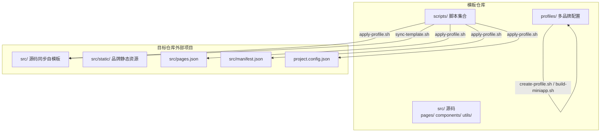
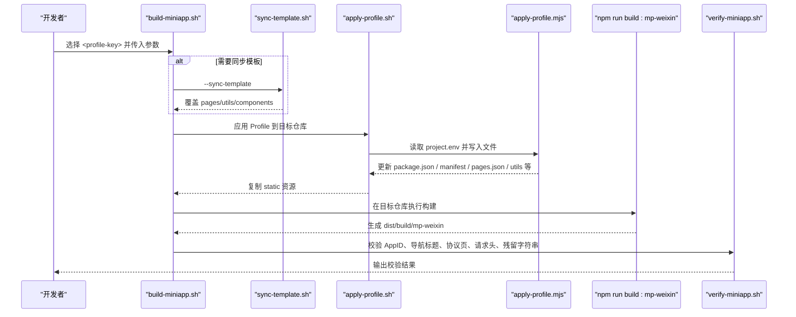
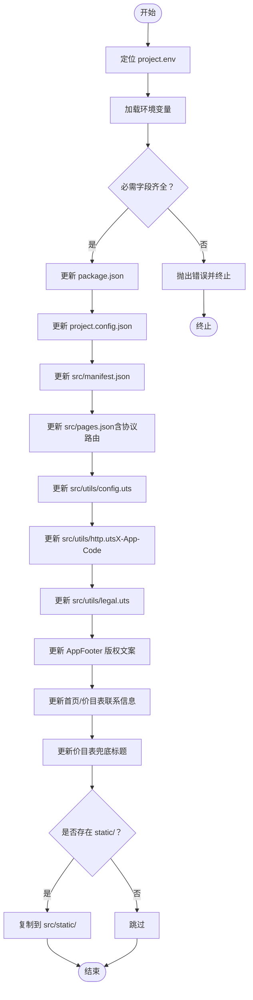
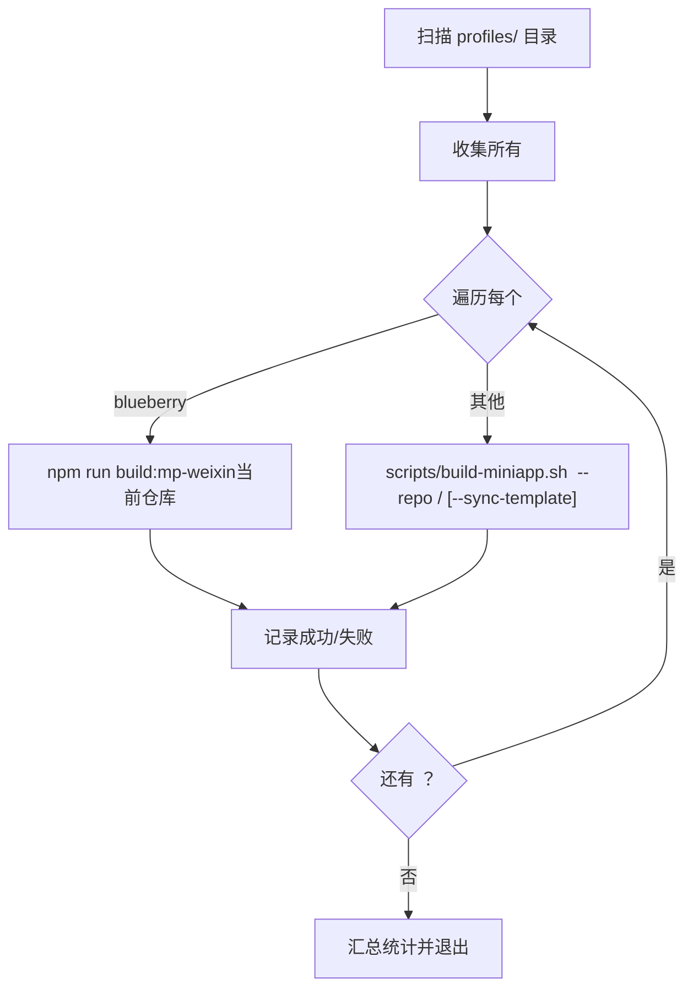
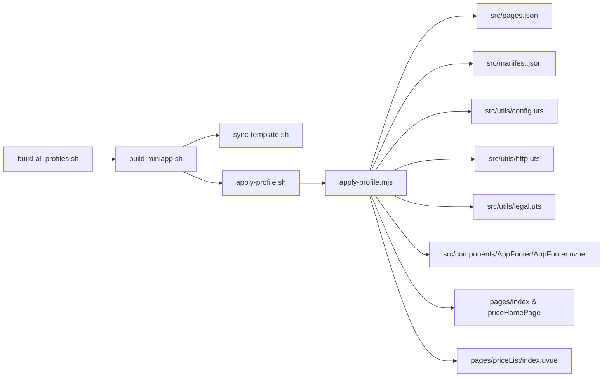

# 多品牌管理策略

<cite>
**本文引用的文件**
- [README.md](file://README.md)
- [scripts/build-all-profiles.sh](file://scripts/build-all-profiles.sh)
- [scripts/apply-profile.sh](file://scripts/apply-profile.sh)
- [scripts/lib/apply-profile.mjs](file://scripts/lib/apply-profile.mjs)
- [scripts/create-profile.sh](file://scripts/create-profile.sh)
- [scripts/templates/profile.env.example](file://scripts/templates/profile.env.example)
- [scripts/build-miniapp.sh](file://scripts/build-miniapp.sh)
- [scripts/sync-template.sh](file://scripts/sync-template.sh)
- [scripts/verify-miniapp.sh](file://scripts/verify-miniapp.sh)
- [scripts/new-miniapp-project.sh](file://scripts/new-miniapp-project.sh)
- [profiles/blueberry/project.env](file://profiles/blueberry/project.env)
- [profiles/huahua/project.env](file://profiles/huahua/project.env)
- [src/utils/config.uts](file://src/utils/config.uts)
- [src/utils/http.uts](file://src/utils/http.uts)
- [src/utils/legal.uts](file://src/utils/legal.uts)
</cite>

## 目录
1. [引言](#引言)
2. [项目结构](#项目结构)
3. [核心组件](#核心组件)
4. [架构总览](#架构总览)
5. [详细组件分析](#详细组件分析)
6. [依赖关系分析](#依赖关系分析)
7. [性能考量](#性能考量)
8. [故障排查指南](#故障排查指南)
9. [结论](#结论)
10. [附录](#附录)

## 引言
本指导文档面向需要在同一模板基础上快速孵化与维护多个小程序品牌的团队，系统讲解如何使用 Profile 系统进行多品牌管理，涵盖品牌命名规范、目录结构建议、配置差异与共享配置的平衡策略、批量构建脚本的使用方法、最佳实践（版本控制与团队协作）、按市场/渠道定制 Profile 的策略、以及多品牌项目的维护与升级方案。文中所有说明均基于仓库现有实现与脚本行为，确保可操作与可落地。

## 项目结构
该仓库采用“模板 + Profile”的双层结构：
- 模板层：统一的源码与公共资源位于 src/，构建工具链与通用页面/组件/工具模块在此层维护。
- Profile 层：每个品牌一个 profiles/<project-key>/，包含品牌专属配置与可选静态资源。

图表来源
- [README.md:85-130](file://README.md#L85-L130)
- [scripts/sync-template.sh:13-31](file://scripts/sync-template.sh#L13-L31)
- [scripts/apply-profile.sh:15-25](file://scripts/apply-profile.sh#L15-L25)

章节来源
- [README.md:85-130](file://README.md#L85-L130)
- [scripts/sync-template.sh:13-31](file://scripts/sync-template.sh#L13-L31)
- [scripts/apply-profile.sh:15-25](file://scripts/apply-profile.sh#L15-L25)

## 核心组件
- Profile 配置文件：profiles/<project-key>/project.env，定义品牌标识、AppID、导航标题、品牌文案、API 域名、请求头标识、小程序名称等。
- 应用脚本：scripts/apply-profile.sh 与 scripts/lib/apply-profile.mjs，负责将 Profile 字段写入目标仓库的关键文件与页面。
- 同步脚本：scripts/sync-template.sh，将模板的 pages/、utils/、components/ 等公共代码同步到目标仓库，避免外部项目自行维护。
- 构建流水线：scripts/build-miniapp.sh，串联“同步模板 → 应用 Profile → 安装依赖 → 编译 → 校验”。
- 批量构建：scripts/build-all-profiles.sh，扫描 profiles/ 下所有 Profile，批量执行主项目与扩展项目的构建。
- 新项目孵化：scripts/new-miniapp-project.sh，从模板克隆并生成初始 Profile。
- 校验脚本：scripts/verify-miniapp.sh，校验 AppID、导航标题、协议页面、请求头、残留字符串等。

章节来源
- [README.md:169-240](file://README.md#L169-L240)
- [scripts/apply-profile.sh:15-25](file://scripts/apply-profile.sh#L15-L25)
- [scripts/lib/apply-profile.mjs:12-31](file://scripts/lib/apply-profile.mjs#L12-L31)
- [scripts/build-miniapp.sh:19-24](file://scripts/build-miniapp.sh#L19-L24)
- [scripts/build-all-profiles.sh:21-24](file://scripts/build-all-profiles.sh#L21-L24)
- [scripts/new-miniapp-project.sh:16-18](file://scripts/new-miniapp-project.sh#L16-L18)
- [scripts/verify-miniapp.sh:39-44](file://scripts/verify-miniapp.sh#L39-L44)

## 架构总览
下图展示了从 Profile 到构建产物的全链路：

图表来源
- [scripts/build-miniapp.sh:19-24](file://scripts/build-miniapp.sh#L19-L24)
- [scripts/sync-template.sh:13-31](file://scripts/sync-template.sh#L13-L31)
- [scripts/apply-profile.sh:15-25](file://scripts/apply-profile.sh#L15-L25)
- [scripts/lib/apply-profile.mjs:73-190](file://scripts/lib/apply-profile.mjs#L73-L190)
- [scripts/verify-miniapp.sh:39-44](file://scripts/verify-miniapp.sh#L39-L44)

## 详细组件分析

### Profile 系统与命名规范
- 命名规范
  - project-key：小写英文/数字，作为 profiles/<key>/ 的目录名与构建标识。
  - PACKAGE_NAME、MANIFEST_NAME：建议与 project-key 保持一致，便于识别与自动化处理。
  - MP_WEIXIN_APPID：必须为有效的小程序 AppID，最终写入 project.config.json 与 src/manifest.json。
  - NAVIGATION_TITLE：全局导航栏标题，写入 src/pages.json。
  - API_BASE_URL：接口域名，写入 src/utils/config.uts。
  - APP_CODE：请求头 X-App-Code 的值，为空时会移除该请求头。
  - MINI_APP_NAME：协议页与登录弹窗中的小程序名称。
- 目录结构建议
  - profiles/<project-key>/project.env：必填，包含上述字段。
  - profiles/<project-key>/static/：可选，会被复制到目标仓库的 src/static/，用于品牌图片、二维码等素材。
- 字段映射关系
  - PACKAGE_NAME → package.json.name
  - MP_WEIXIN_APPID → project.config.json.appid 与 src/manifest.json.mp-weixin.appid
  - MANIFEST_NAME/DESCRIPTION → src/manifest.json.name/description
  - NAVIGATION_TITLE → src/pages.json.globalStyle.navigationBarTitleText
  - API_BASE_URL → src/utils/config.uts.baseURL
  - APP_CODE → src/utils/http.uts.finalHeader.X-App-Code（为空则移除）
  - MINI_APP_NAME → src/utils/legal.uts.MINI_APP_NAME
  - CONTACT_QR_SRC/CONTACT_PHONE_TEXT/COPYRIGHT_TEXT → pages/index/index.uvue、pages/priceHomePage/index.uvue、AppFooter 等
  - PRICE_FALLBACK_TITLE → pages/priceList/index.uvue 的兜底标题

章节来源
- [README.md:169-240](file://README.md#L169-L240)
- [scripts/lib/apply-profile.mjs:73-190](file://scripts/lib/apply-profile.mjs#L73-L190)
- [profiles/blueberry/project.env:3-22](file://profiles/blueberry/project.env#L3-L22)
- [profiles/huahua/project.env:4-23](file://profiles/huahua/project.env#L4-L23)

### 应用 Profile 的实现逻辑
- 输入：通过 scripts/apply-profile.sh 传入 <profile-key> 或 --profile-file，脚本会定位到 profiles/<key>/project.env。
- 核心：scripts/lib/apply-profile.mjs 以环境变量为输入，逐项匹配并替换目标文件中的占位符或固定文本块，确保只在内容发生变化时写入，避免不必要的变更。
- 输出：目标仓库的关键文件被更新，同时将 profiles/<key>/static/ 的资源复制到 src/static/。

图表来源
- [scripts/apply-profile.sh:61-73](file://scripts/apply-profile.sh#L61-L73)
- [scripts/lib/apply-profile.mjs:12-31](file://scripts/lib/apply-profile.mjs#L12-L31)
- [scripts/lib/apply-profile.mjs:73-190](file://scripts/lib/apply-profile.mjs#L73-L190)

章节来源
- [scripts/apply-profile.sh:15-25](file://scripts/apply-profile.sh#L15-L25)
- [scripts/lib/apply-profile.mjs:12-31](file://scripts/lib/apply-profile.mjs#L12-L31)
- [scripts/lib/apply-profile.mjs:73-190](file://scripts/lib/apply-profile.mjs#L73-L190)

### 同步模板与构建流水线
- 同步模板：scripts/sync-template.sh 使用 rsync 将 src/pages/、src/utils/、src/components/ 等目录同步到目标仓库，避免外部项目自行维护这些公共代码。
- 构建流水线：scripts/build-miniapp.sh 提供统一入口，支持 --sync-template、--install、--skip-apply、--skip-verify 等参数，串联同步、应用、构建与校验。
- 主项目与扩展项目：主项目在当前仓库执行 npm run build:mp-weixin；扩展项目通过 scripts/build-miniapp.sh <key> --repo <path> 调用。

章节来源
- [scripts/sync-template.sh:13-31](file://scripts/sync-template.sh#L13-L31)
- [scripts/build-miniapp.sh:19-24](file://scripts/build-miniapp.sh#L19-L24)
- [scripts/build-miniapp.sh:84-102](file://scripts/build-miniapp.sh#L84-L102)

### 批量构建脚本 build-all-profiles.sh
- 功能：扫描 profiles/ 目录，遍历所有 Profile，依次执行构建。
- 主项目：blueberry 在当前仓库执行 npm run build:mp-weixin。
- 扩展项目：对其他 key，调用 scripts/build-miniapp.sh <key> --repo <external-base>/<key> [--sync-template]。
- 参数：
  - --only <list>：仅构建指定列表（逗号分隔）
  - --skip <list>：跳过指定列表
  - --external-base <dir>：扩展项目根目录，默认为当前仓库父目录
  - --no-sync-template：扩展项目构建时不携带 --sync-template
- 结果：统计成功/失败/跳过的项目并汇总输出。

图表来源
- [scripts/build-all-profiles.sh:88-100](file://scripts/build-all-profiles.sh#L88-L100)
- [scripts/build-all-profiles.sh:130-162](file://scripts/build-all-profiles.sh#L130-L162)

章节来源
- [scripts/build-all-profiles.sh:16-33](file://scripts/build-all-profiles.sh#L16-L33)
- [scripts/build-all-profiles.sh:115-162](file://scripts/build-all-profiles.sh#L115-L162)

### 新项目孵化与 Profile 创建
- 新项目孵化：scripts/new-miniapp-project.sh 从模板仓库克隆到目标目录，初始化 git、生成 profiles/<project-key>/project.env，并可选安装依赖。
- Profile 创建：scripts/create-profile.sh 基于模板 scripts/templates/profile.env.example 生成 profiles/<project-key>/project.env，并自动填充 PROJECT_KEY、PACKAGE_NAME、MANIFEST_NAME、APP_CODE 等字段。

章节来源
- [scripts/new-miniapp-project.sh:16-18](file://scripts/new-miniapp-project.sh#L16-L18)
- [scripts/create-profile.sh:15-18](file://scripts/create-profile.sh#L15-L18)
- [scripts/templates/profile.env.example:5-24](file://scripts/templates/profile.env.example#L5-L24)

### 构建产物校验 verify-miniapp.sh
- 校验项：
  - project.config.json.appid 与 MP_WEIXIN_APPID 一致
  - app.json.window.navigationBarTitleText 与 NAVIGATION_TITLE 一致
  - 若 CONTACT_QR_SRC 以 /static/ 开头，则产物中应包含该文件
  - 若 APP_CODE 非空，则产物中 utils/http.js 应包含 X-App-Code
  - MINI_APP_NAME 应出现在 legal 源码与产物中，且 pages/policies/user|privacy.js 存在
  - 若 RESIDUAL_SEARCH_REGEX 非空，则产物与源码/配置中不应出现匹配的残留字符串
- 回退策略：当未安装 ripgrep 时，自动回退到 grep 实现。

章节来源
- [scripts/verify-miniapp.sh:39-44](file://scripts/verify-miniapp.sh#L39-L44)
- [scripts/verify-miniapp.sh:114-159](file://scripts/verify-miniapp.sh#L114-L159)

### 配置差异与共享配置的平衡策略
- 差异配置（每品牌独有）
  - MP_WEIXIN_APPID、NAVIGATION_TITLE、BRAND_NAME、CONTACT_*、API_BASE_URL、APP_CODE、MINI_APP_NAME、PRICE_FALLBACK_TITLE、RESIDUAL_SEARCH_REGEX 等。
- 共享配置（模板层）
  - 页面结构、组件、工具模块、构建配置、页面路由等，通过 sync-template.sh 同步，避免在各品牌仓库重复维护。
- 平衡策略
  - 严格区分“品牌差异化字段”与“通用模板代码”，通过 Profile 字段驱动差异化，模板代码集中管理。
  - 对于跨品牌共用的页面/组件，优先在模板层维护并通过 sync-template.sh 同步；若确需差异化，建议通过新增/替换文件的方式并在 Profile 中声明，避免硬编码。

章节来源
- [README.md:271-276](file://README.md#L271-L276)
- [scripts/sync-template.sh:13-31](file://scripts/sync-template.sh#L13-L31)
- [scripts/lib/apply-profile.mjs:73-190](file://scripts/lib/apply-profile.mjs#L73-L190)

### 按市场/渠道定制 Profile 的策略
- 渠道隔离：为不同渠道（如线上/线下、大区/城市、代理/直营）分别建立独立的 profiles/<key>/，确保 AppID、导航标题、API 域名、请求头标识、联系方式等完全隔离。
- 资源替换：将渠道专属图片、二维码等放入 profiles/<key>/static/，构建时自动复制到 src/static/，避免在模板层混入渠道素材。
- 校验保障：通过 verify-miniapp.sh 的残留字符串扫描（RESIDUAL_SEARCH_REGEX）与协议页校验，确保渠道间不会串号或误用模板文案。

章节来源
- [README.md:277-284](file://README.md#L277-L284)
- [scripts/verify-miniapp.sh:154-159](file://scripts/verify-miniapp.sh#L154-L159)

### 最佳实践：版本控制与团队协作
- 版本控制
  - profiles/<key>/project.env 与 profiles/<key>/static/ 作为品牌资产纳入版本控制，但避免提交二进制大文件；可将大图上传至外部存储并在静态资源中引用。
  - 模板层的 src/ 与 scripts/ 不应在品牌仓库中维护副本，遵循 .gitignore 规则，避免源码漂移。
- 团队协作
  - 产品/运营侧负责维护 project.env 与 static 资源；开发侧负责模板与脚本的演进；发布侧负责执行 build-miniapp.sh 与 verify-miniapp.sh。
  - 建议在 CI 中集成 build-all-profiles.sh，批量构建并输出报告，便于质量门禁与审计。

章节来源
- [README.md:127-133](file://README.md#L127-L133)
- [scripts/build-all-profiles.sh:16-33](file://scripts/build-all-profiles.sh#L16-L33)

### 维护策略与升级方案
- 模板升级
  - 使用 scripts/sync-template.sh 将模板的 pages/、utils/、components/ 同步到目标仓库，再执行 scripts/apply-profile.sh 应用最新配置。
  - 对于破坏性变更，建议先在模板仓库验证，再通过 --sync-template 逐步推广到各品牌仓库。
- 配置迁移
  - 新增字段时，在 scripts/templates/profile.env.example 中同步更新模板；对存量项目，通过 scripts/create-profile.sh 重新生成并对比差异。
- 发布前置
  - 使用 scripts/release-miniapp.sh 包装 build-miniapp.sh，统一输出导入路径提示，便于在微信开发者工具中上传与提审。

章节来源
- [README.md:271-276](file://README.md#L271-L276)
- [scripts/sync-template.sh:13-31](file://scripts/sync-template.sh#L13-L31)
- [scripts/templates/profile.env.example:5-24](file://scripts/templates/profile.env.example#L5-L24)
- [scripts/release-miniapp.sh:1-106](file://scripts/release-miniapp.sh#L1-L106)

### 实际案例分析与经验总结
- 案例：花花旅拍
  - 通过 profiles/huahua/project.env 定义 AppID、导航标题、品牌文案、API 域名、请求头标识与小程序名称；静态资源放置在 profiles/huahua/static/。
  - 使用 scripts/build-miniapp.sh huahua --repo <path> 完成构建与校验；若目标仓库缺少协议页，可通过 --sync-template 同步模板后重试。
- 经验总结
  - 优先在模板层沉淀通用能力，通过 Profile 字段驱动差异化，减少重复劳动。
  - 在新增品牌时，先用 scripts/create-profile.sh 生成初始配置，再逐步完善静态资源与字段。
  - 在 CI 中集成 scripts/build-all-profiles.sh，实现多品牌并行构建与质量门禁。

章节来源
- [profiles/huahua/project.env:4-23](file://profiles/huahua/project.env#L4-L23)
- [scripts/build-miniapp.sh:19-24](file://scripts/build-miniapp.sh#L19-L24)
- [scripts/build-all-profiles.sh:21-24](file://scripts/build-all-profiles.sh#L21-L24)

## 依赖关系分析
- 脚本耦合
  - build-miniapp.sh 依赖 sync-template.sh、apply-profile.sh、verify-miniapp.sh。
  - apply-profile.sh 依赖 scripts/lib/apply-profile.mjs 与 profiles/<key>/project.env。
  - build-all-profiles.sh 依赖 scripts/build-miniapp.sh 与各 Profile 的 project.env。
- 文件依赖
  - src/utils/http.uts 的 X-App-Code 来源于 Profile 的 APP_CODE；src/utils/config.uts 的 baseURL 来源于 API_BASE_URL；src/pages.json 的导航标题来源于 NAVIGATION_TITLE。
- 外部依赖
  - Node.js ESM（apply-profile.mjs）、Bash 工具链（grep/ripgrep）、npm 包管理器、微信开发者工具。

图表来源
- [scripts/build-miniapp.sh:84-102](file://scripts/build-miniapp.sh#L84-L102)
- [scripts/apply-profile.sh:89](file://scripts/apply-profile.sh#L89)
- [scripts/lib/apply-profile.mjs:73-190](file://scripts/lib/apply-profile.mjs#L73-L190)

章节来源
- [scripts/build-miniapp.sh:84-102](file://scripts/build-miniapp.sh#L84-L102)
- [scripts/apply-profile.sh:89](file://scripts/apply-profile.sh#L89)
- [scripts/lib/apply-profile.mjs:73-190](file://scripts/lib/apply-profile.mjs#L73-L190)

## 性能考量
- 构建性能
  - 使用 --skip-verify 与 --skip-apply 可在特定场景加速本地调试；但在发布前务必执行完整校验。
  - 批量构建时，建议并行化外部仓库构建（在 CI 中分发任务），但注意磁盘与网络带宽限制。
- 模板同步
  - rsync 同步 pages/、utils/、components/ 时，建议在 CI 中缓存 node_modules 与 dist，减少重复安装与编译时间。
- 校验效率
  - 在未安装 ripgrep 时，verify-miniapp.sh 会回退到 grep，性能略降；建议在 CI 环境安装 ripgrep 以提升正则扫描速度。

## 故障排查指南
- 常见问题
  - AppID 不一致：检查 project.config.json 与 MP_WEIXIN_APPID 是否一致；确认是否通过 apply-profile.sh 写入。
  - 导航标题不一致：确认 NAVIGATION_TITLE 与 src/pages.json.globalStyle.navigationBarTitleText 是否一致。
  - 协议页缺失：若目标仓库旧代码缺少 pages/policies/*，执行 --sync-template 后重试构建。
  - X-App-Code 未生效：确认 APP_CODE 非空且 http.uts 中已注入；产物中应包含该请求头。
  - 残留字符串：设置 RESIDUAL_SEARCH_REGEX 并运行 verify-miniapp.sh，定位并清理模板残留。
- 定位手段
  - 使用 scripts/verify-miniapp.sh 的详细输出定位问题文件与字段。
  - 在 CI 中开启 build-all-profiles.sh 的失败汇总，快速发现异常项目。

章节来源
- [scripts/verify-miniapp.sh:114-159](file://scripts/verify-miniapp.sh#L114-L159)
- [README.md:390-398](file://README.md#L390-L398)

## 结论
通过“模板 + Profile”的架构，本项目实现了多品牌/多渠道的高效管理：品牌差异化由 Profile 字段驱动，通用能力集中在模板层并通过脚本同步与校验保障一致性。结合 build-all-profiles.sh 的批量构建能力与严格的校验流程，团队可以在保证质量的前提下快速孵化与维护多个小程序品牌。建议在团队内明确职责边界、规范版本控制与发布流程，并在 CI 中集成自动化校验，持续提升交付效率与稳定性。

## 附录
- API 字段与注入点参考
  - API_BASE_URL → src/utils/config.uts.baseURL
  - APP_CODE → src/utils/http.uts.finalHeader.X-App-Code
  - MINI_APP_NAME → src/utils/legal.uts.MINI_APP_NAME
  - NAVIGATION_TITLE → src/pages.json.globalStyle.navigationBarTitleText
  - MP_WEIXIN_APPID → project.config.json.appid 与 src/manifest.json.mp-weixin.appid

章节来源
- [src/utils/config.uts:7-11](file://src/utils/config.uts#L7-L11)
- [src/utils/http.uts:27-31](file://src/utils/http.uts#L27-L31)
- [src/utils/legal.uts:1](file://src/utils/legal.uts#L1)
- [scripts/lib/apply-profile.mjs:86-90](file://scripts/lib/apply-profile.mjs#L86-L90)
- [scripts/lib/apply-profile.mjs:94-98](file://scripts/lib/apply-profile.mjs#L94-L98)
- [scripts/lib/apply-profile.mjs:138-140](file://scripts/lib/apply-profile.mjs#L138-L140)
- [scripts/lib/apply-profile.mjs:144-149](file://scripts/lib/apply-profile.mjs#L144-L149)
- [scripts/lib/apply-profile.mjs:153-155](file://scripts/lib/apply-profile.mjs#L153-L155)
