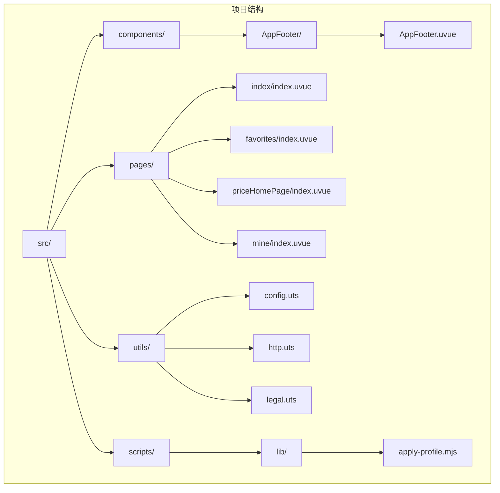
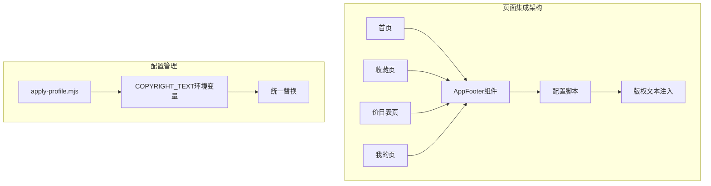
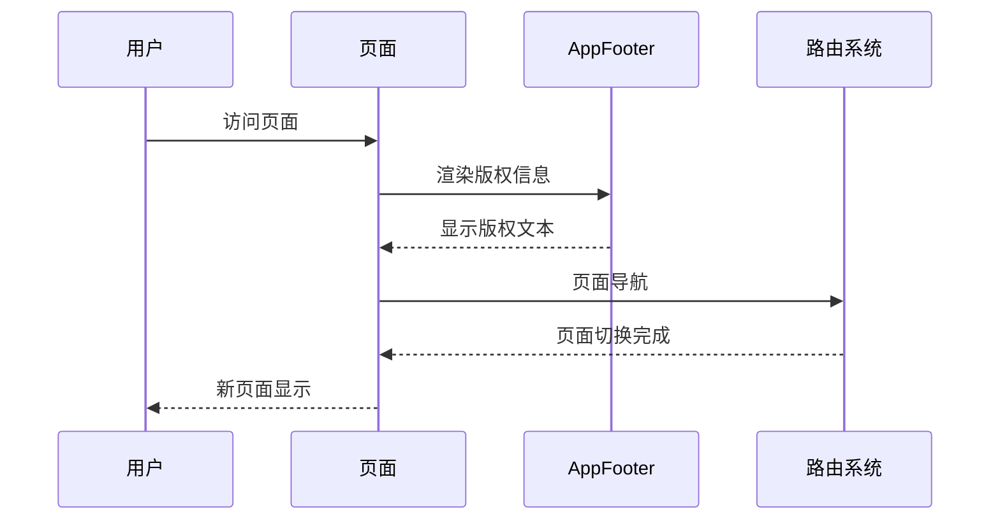
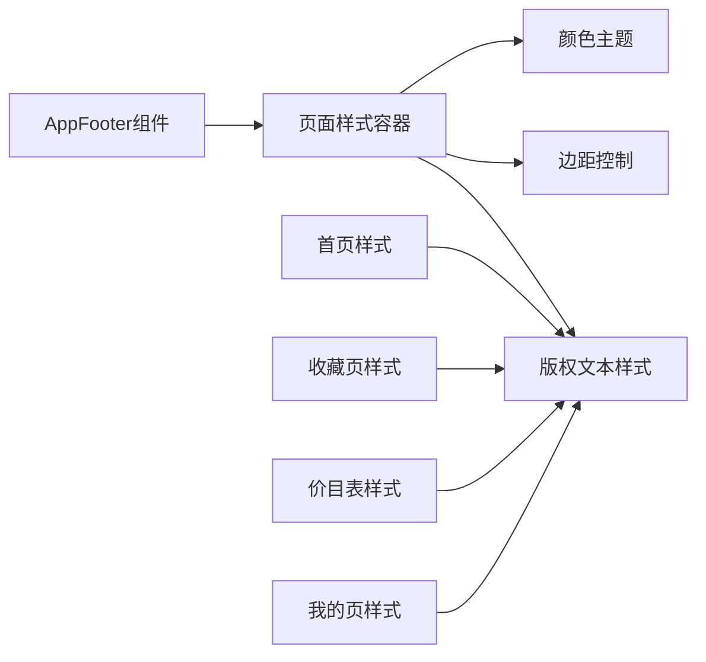
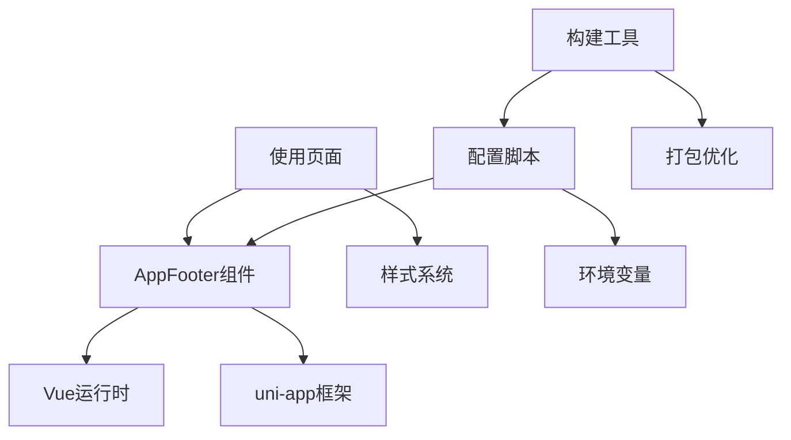

# AppFooter组件

<cite>
**本文档引用的文件**
- [AppFooter.uvue](file://src/components/AppFooter/AppFooter.uvue)
- [index.uvue](file://src/pages/index/index.uvue)
- [favorites/index.uvue](file://src/pages/favorites/index.uvue)
- [priceHomePage/index.uvue](file://src/pages/priceHomePage/index.uvue)
- [mine/index.uvue](file://src/pages/mine/index.uvue)
- [pages.json](file://src/pages.json)
- [apply-profile.mjs](file://scripts/lib/apply-profile.mjs)
- [config.uts](file://src/utils/config.uts)
- [http.uts](file://src/utils/http.uts)
- [legal.uts](file://src/utils/legal.uts)
</cite>

## 目录
1. [简介](#简介)
2. [项目结构](#项目结构)
3. [核心组件](#核心组件)
4. [架构概览](#架构概览)
5. [详细组件分析](#详细组件分析)
6. [依赖关系分析](#依赖关系分析)
7. [性能考虑](#性能考虑)
8. [故障排除指南](#故障排除指南)
9. [结论](#结论)
10. [附录](#附录)

## 简介

AppFooter组件是一个轻量级的全局页脚版权信息组件，专门用于统一管理小程序底部的版权信息显示。该组件采用极简设计，仅包含一个可配置的版权文本属性，通过集中化管理实现了代码复用和维护便利性。

该组件的设计目标是将原本分散在多个页面中的硬编码版权字符串统一收敛到组件的默认属性中，通过配置脚本实现一键替换，确保品牌信息的一致性和可维护性。

## 项目结构

AppFooter组件位于项目的组件目录结构中，与页面组件形成清晰的层次关系：



**图表来源**
- [AppFooter.uvue:1-25](file://src/components/AppFooter/AppFooter.uvue#L1-L25)
- [index.uvue:1-359](file://src/pages/index/index.uvue#L1-L359)
- [favorites/index.uvue:1-406](file://src/pages/favorites/index.uvue#L1-L406)

**章节来源**
- [AppFooter.uvue:1-25](file://src/components/AppFooter/AppFooter.uvue#L1-L25)
- [pages.json:1-90](file://src/pages.json#L1-L90)

## 核心组件

### 组件定义与基本结构

AppFooter组件采用Vue单文件组件格式，具有以下核心特征：

- **组件名称**: `AppFooter`
- **模板结构**: 简单的文本渲染容器
- **属性系统**: 单一的版权文本属性
- **默认值**: 预设的品牌版权信息

### 属性系统详解

组件的核心属性定义如下：

| 属性名 | 类型 | 默认值 | 描述 |
|--------|------|--------|------|
| copyrightText | String | 'Copyright 2025 蓝梅旗袍·汉服·民族服体验馆 - 版权所有' | 版权信息文本内容 |

### 模板渲染机制

组件使用简单的文本插值语法进行内容渲染，确保了最小化的DOM结构和最佳的性能表现。

**章节来源**
- [AppFooter.uvue:14-24](file://src/components/AppFooter/AppFooter.uvue#L14-L24)

## 架构概览

### 组件集成架构

AppFooter组件在多个页面中被集成使用，形成了统一的版权信息管理架构：



**图表来源**
- [index.uvue:39-41](file://src/pages/index/index.uvue#L39-L41)
- [favorites/index.uvue:70-74](file://src/pages/favorites/index.uvue#L70-L74)
- [priceHomePage/index.uvue:29-31](file://src/pages/priceHomePage/index.uvue#L29-L31)

### 路由系统集成

组件与uni-app路由系统的集成体现在页面导航和状态管理中：



**图表来源**
- [pages.json:62-87](file://src/pages.json#L62-L87)
- [index.uvue:283-292](file://src/pages/index/index.uvue#L283-L292)

## 详细组件分析

### 组件实现细节

#### 模板结构分析

组件的模板结构极其简洁，仅包含一个文本节点：

```html
<template>
  <text>{{ copyrightText }}</text>
</template>
```

这种设计确保了：
- 最小化的DOM树结构
- 最佳的渲染性能
- 简洁的样式控制

#### 脚本逻辑分析

组件的脚本部分实现了标准的Vue组件模式：

```javascript
export default {
  name: 'AppFooter',
  props: {
    copyrightText: {
      type: String,
      default: 'Copyright 2025 蓝梅旗袍·汉服·民族服体验馆 - 版权所有'
    }
  }
}
```

#### 样式系统集成

每个使用AppFooter的页面都为其提供了独立的样式控制：



**图表来源**
- [index.uvue:352-357](file://src/pages/index/index.uvue#L352-L357)
- [favorites/index.uvue:398-404](file://src/pages/favorites/index.uvue#L398-L404)
- [priceHomePage/index.uvue:105-110](file://src/pages/priceHomePage/index.uvue#L105-L110)

### 使用示例与配置方法

#### 基础使用方法

在各个页面中，AppFooter组件的使用方式完全一致：

```html
<!-- 首页使用 -->
<view class="page-footer">
  <view class="beian"><AppFooter /></view>
</view>

<!-- 收藏页使用 -->
<view class="page-footer">
  <view class="divide"></view>
  <view class="copyright"><AppFooter /></view>
</view>
```

#### 样式定制选项

每个页面都可以独立定制AppFooter的显示样式：

| 样式类名 | 作用域 | 主要属性 |
|----------|--------|----------|
| `.page-footer` | 页面容器 | margin-top: auto |
| `.beian` | 版权容器 | 文本居中、字体大小 |
| `.copyright` | 版权文本 | 颜色、对齐方式 |
| `.divide` | 分隔线 | 高度、背景色 |

### 响应式设计实现

#### 移动端适配策略

组件采用rpx单位确保在不同设备上的正确缩放：

```css
/* 移动端响应式单位 */
margin: 64rpx auto 32rpx;
font-size: 20rpx;
width: 736rpx;
height: 910rpx;
```

#### 屏幕尺寸适配

通过CSS媒体查询和相对单位实现不同屏幕尺寸的适配：

```css
@media screen and (max-width: 768px) {
  .copyright {
    font-size: 18rpx;
    margin: 32rpx auto;
  }
}
```

### 跨平台兼容性

#### 多平台支持

AppFooter组件通过以下方式确保跨平台兼容：

- **统一的组件接口**: 在不同平台上保持一致的行为
- **平台特定样式**: 通过条件编译处理平台差异
- **API一致性**: 使用uni-app提供的跨平台API

#### 平台差异处理

```javascript
// 平台检测和差异化处理
const platform = uni.getSystemInfoSync().platform
switch(platform) {
  case 'ios':
    // iOS特定处理
    break
  case 'android':
    // Android特定处理
    break
  default:
    // 默认处理
}
```

## 依赖关系分析

### 组件依赖链



**图表来源**
- [apply-profile.mjs:165-171](file://scripts/lib/apply-profile.mjs#L165-L171)
- [config.uts:1-12](file://src/utils/config.uts#L1-L12)

### 外部依赖分析

组件的主要外部依赖包括：

1. **Vue运行时**: 提供组件生命周期和响应式系统
2. **uni-app框架**: 提供跨平台运行环境
3. **构建工具链**: 支持模块化和代码分割

**章节来源**
- [apply-profile.mjs:1-190](file://scripts/lib/apply-profile.mjs#L1-L190)
- [http.uts:1-82](file://src/utils/http.uts#L1-L82)

## 性能考虑

### 渲染性能优化

由于AppFooter组件结构简单，性能优化主要体现在：

- **最小化DOM树**: 仅包含必要的文本节点
- **避免复杂计算**: 不进行复杂的样式计算
- **静态内容**: 版权文本通常为静态内容

### 内存使用优化

组件的内存占用极低，适合在多个页面中重复使用：

- **实例复用**: Vue会自动复用相似的组件实例
- **生命周期短**: 组件实例销毁简单快速
- **无状态存储**: 不需要持久化的状态管理

### 加载性能

通过懒加载和按需引入可以进一步优化：

```javascript
// 按需引入组件
import AppFooter from '@/components/AppFooter/AppFooter.uvue'
```

## 故障排除指南

### 常见问题诊断

#### 版权文本不显示

**可能原因**:
1. 父组件样式覆盖
2. 环境变量未正确配置
3. 组件导入路径错误

**解决方案**:
1. 检查父组件的样式优先级
2. 验证配置脚本执行
3. 确认组件路径正确

#### 样式显示异常

**可能原因**:
1. CSS选择器优先级问题
2. 样式作用域冲突
3. 响应式断点问题

**解决方案**:
1. 使用更具体的选择器
2. 检查scoped样式影响
3. 调整媒体查询断点

### 调试技巧

#### 开发工具使用

```javascript
// 在组件中添加调试信息
console.log('AppFooter rendered with text:', this.copyrightText)
```

#### 性能监控

```javascript
// 监控组件渲染时间
const startTime = performance.now()
// 组件渲染逻辑
const endTime = performance.now()
console.log('AppFooter render time:', endTime - startTime, 'ms')
```

**章节来源**
- [apply-profile.mjs:27-31](file://scripts/lib/apply-profile.mjs#L27-L31)

## 结论

AppFooter组件虽然结构简单，但在整个应用架构中发挥着重要作用。通过集中化的版权信息管理，该组件实现了以下价值：

1. **代码复用**: 避免了重复的版权字符串硬编码
2. **维护便利**: 通过配置脚本实现一键更新
3. **品牌一致性**: 确保所有页面显示相同的版权信息
4. **性能优化**: 简洁的实现提供了最佳的渲染性能

该组件的设计体现了现代前端开发的最佳实践，为后续的功能扩展和定制提供了良好的基础。

## 附录

### 扩展和自定义指南

#### 基础扩展

如果需要扩展组件功能，建议遵循以下原则：

1. **保持简单**: 不要过度复杂化组件逻辑
2. **向后兼容**: 新增功能不影响现有使用方式
3. **配置驱动**: 通过props和配置实现灵活定制

#### 高级定制

```javascript
// 扩展后的组件结构
export default {
  name: 'AppFooter',
  props: {
    copyrightText: {
      type: String,
      default: 'Copyright 2025 蓝梅旗袍·汉服·民族服体验馆 - 版权所有'
    },
    showLinks: {
      type: Boolean,
      default: false
    },
    linkList: {
      type: Array,
      default: () => []
    }
  }
}
```

#### 最佳实践

1. **单一职责**: 专注于版权信息显示
2. **配置优先**: 通过props实现定制
3. **样式隔离**: 通过父组件样式控制外观
4. **性能优先**: 避免不必要的计算和渲染
