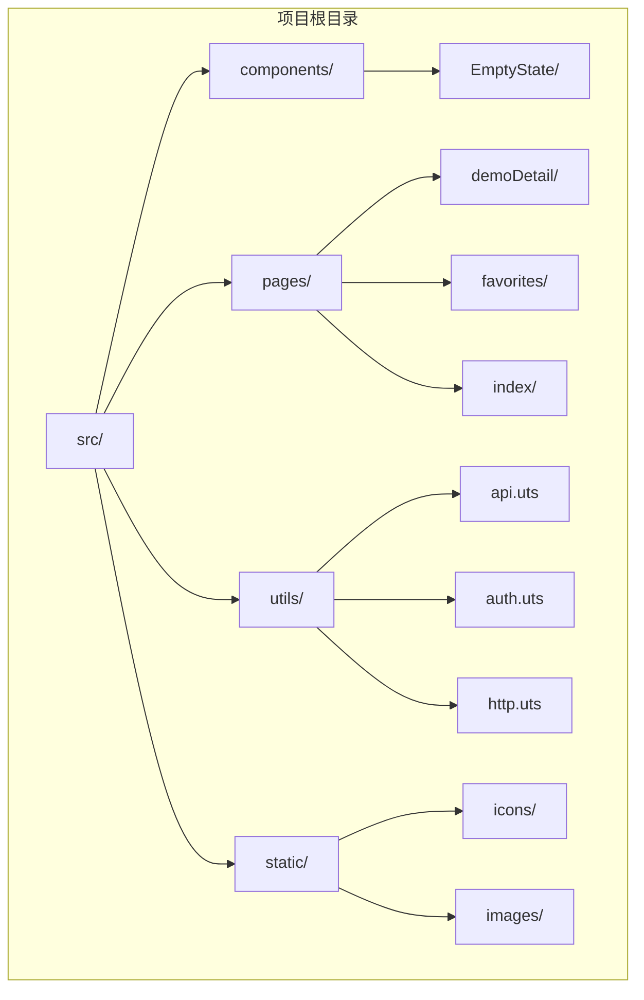
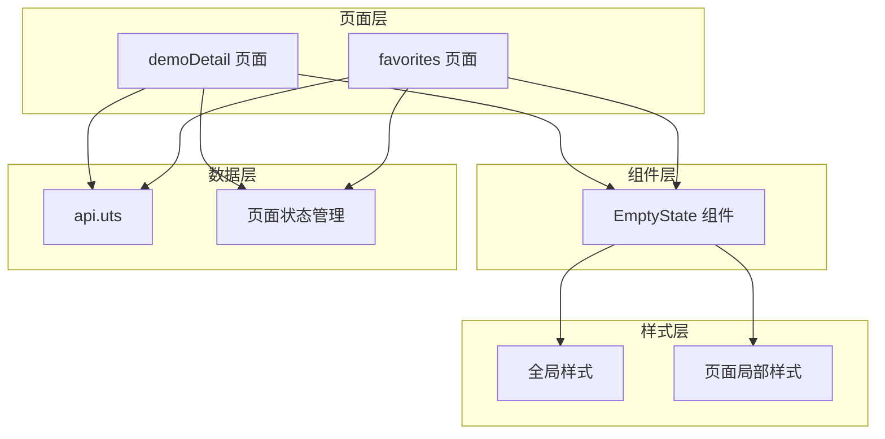
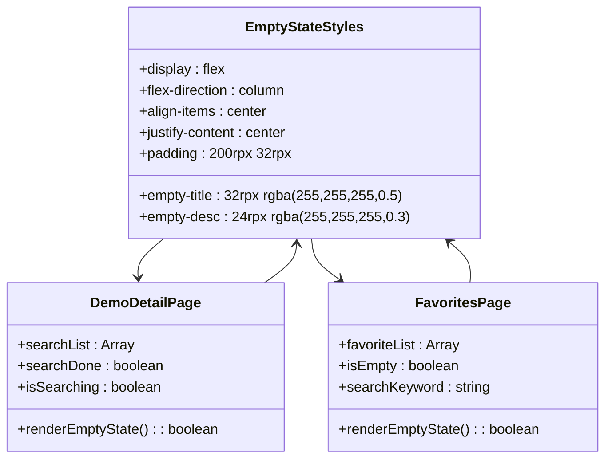
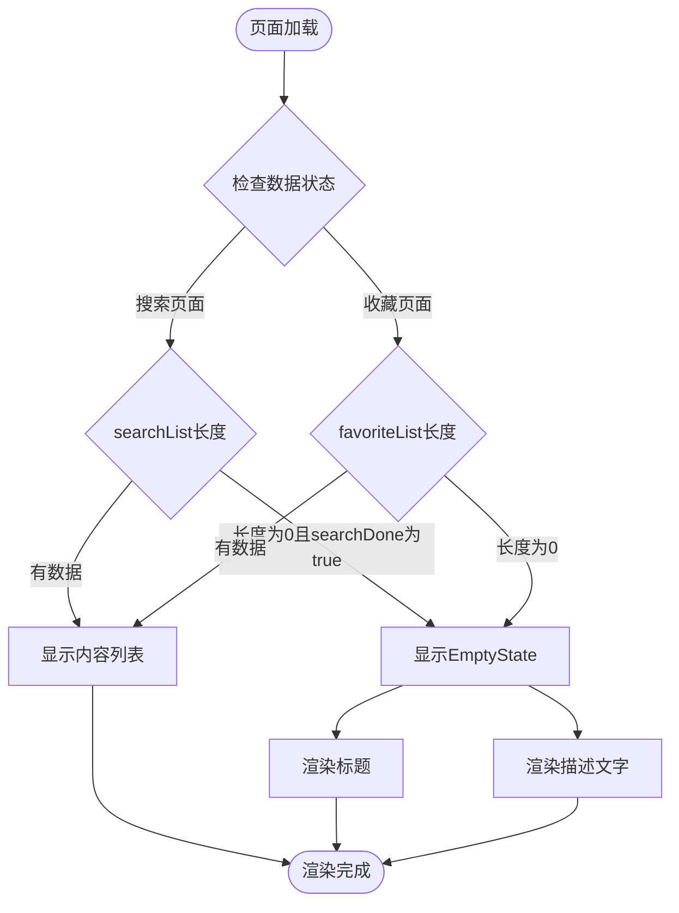
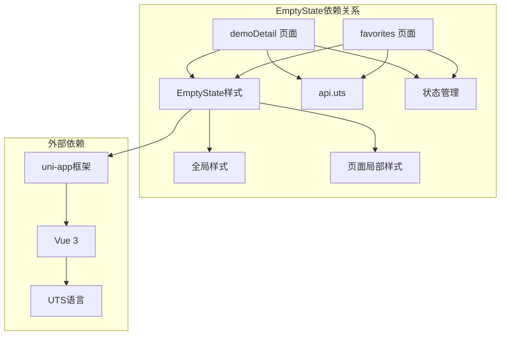
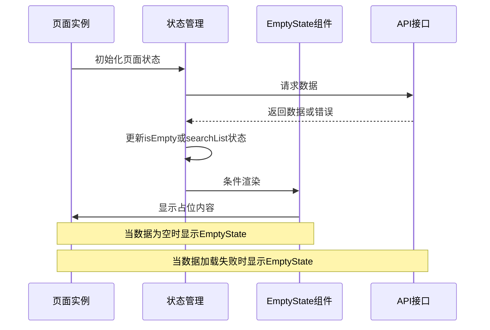

# EmptyState组件

<cite>
**本文档引用的文件**
- [demoDetail/index.uvue](file://src/pages/demoDetail/index.uvue)
- [favorites/index.uvue](file://src/pages/favorites/index.uvue)
- [App.uvue](file://src/App.uvue)
- [uni.scss](file://src/uni.scss)
- [api.uts](file://src/utils/api.uts)
- [README.md](file://README.md)
</cite>

## 目录
1. [简介](#简介)
2. [项目结构](#项目结构)
3. [核心组件](#核心组件)
4. [架构概览](#架构概览)
5. [详细组件分析](#详细组件分析)
6. [依赖关系分析](#依赖关系分析)
7. [性能考虑](#性能考虑)
8. [故障排除指南](#故障排除指南)
9. [结论](#结论)

## 简介

EmptyState组件是一个轻量级的占位展示组件，专门用于在数据为空或加载失败时为用户提供清晰的视觉反馈和操作引导。该组件在项目中以CSS样式的形式实现，主要包含在`demoDetail/index.uvue`和`favorites/index.uvue`两个页面中使用。

EmptyState组件的核心设计理念是：
- **明确的状态指示**：通过简洁的文字和视觉元素告知用户当前的数据状态
- **友好的用户体验**：提供适当的文案和可能的操作引导
- **统一的视觉风格**：与整体UI设计保持一致的色彩和排版规范
- **响应式适配**：确保在不同设备和屏幕尺寸下都有良好的显示效果

## 项目结构

该项目采用uni-app x框架构建，基于Vue 3 + TypeScript/UTS技术栈，支持多项目Profile机制和一键构建发布流程。



**图表来源**
- [README.md:85-130](file://README.md#L85-L130)

**章节来源**
- [README.md:85-130](file://README.md#L85-L130)

## 核心组件

### EmptyState组件概述

EmptyState组件在项目中以CSS样式类的形式实现，主要包含以下核心元素：

#### 核心样式结构
- `.empty-state`：容器样式，采用flex布局，居中显示
- `.empty-title`：标题样式，使用半透明白色文字
- `.empty-desc`：描述文字样式，使用更浅的灰色文字

#### 设计特点
- **垂直居中布局**：使用`display: flex`和`align-items: center`实现垂直居中
- **统一的视觉层次**：标题使用较大的字体和较深的颜色，描述使用较小的字体和较浅的颜色
- **充足的留白**：顶部和底部都有较大的内边距，确保内容不会紧贴屏幕边缘
- **响应式设计**：使用rpx单位确保在不同设备上的适配

**章节来源**
- [demoDetail/index.uvue:772-787](file://src/pages/demoDetail/index.uvue#L772-L787)
- [favorites/index.uvue:314-330](file://src/pages/favorites/index.uvue#L314-L330)

## 架构概览

EmptyState组件在整个应用架构中的位置和交互关系如下：



**图表来源**
- [demoDetail/index.uvue:39-42](file://src/pages/demoDetail/index.uvue#L39-L42)
- [favorites/index.uvue:35-38](file://src/pages/favorites/index.uvue#L35-L38)

## 详细组件分析

### 组件实现细节

#### 样式实现
EmptyState组件的样式实现采用了简洁而有效的CSS方案：



**图表来源**
- [demoDetail/index.uvue:772-787](file://src/pages/demoDetail/index.uvue#L772-L787)
- [favorites/index.uvue:314-330](file://src/pages/favorites/index.uvue#L314-L330)

#### 数据驱动的渲染逻辑

EmptyState组件的显示完全由页面的数据状态控制：



**图表来源**
- [demoDetail/index.uvue:39-42](file://src/pages/demoDetail/index.uvue#L39-L42)
- [favorites/index.uvue:35-38](file://src/pages/favorites/index.uvue#L35-L38)

**章节来源**
- [demoDetail/index.uvue:38-42](file://src/pages/demoDetail/index.uvue#L38-L42)
- [favorites/index.uvue:34-38](file://src/pages/favorites/index.uvue#L34-L38)

### 使用场景分析

#### 搜索无结果场景
在demoDetail页面中，当用户进行搜索但没有找到匹配结果时，EmptyState组件提供清晰的反馈：

- **标题**："暂无搜索结果"
- **描述**："换个关键词试试吧"
- **触发条件**：`searchList.length === 0 && searchDone === true`

#### 收藏夹为空场景
在favorites页面中，EmptyState组件根据不同的状态显示不同的提示：

- **无搜索关键词**：显示"还没有收藏任何内容哦"
- **有搜索关键词**：显示"换个搜索关键词试试吧"
- **触发条件**：`isEmpty === true`

**章节来源**
- [demoDetail/index.uvue:39-42](file://src/pages/demoDetail/index.uvue#L39-L42)
- [favorites/index.uvue:35-38](file://src/pages/favorites/index.uvue#L35-L38)

### 样式定制方案

#### 主题集成
EmptyState组件的样式设计充分考虑了主题集成的需求：

```mermaid
graph LR
subgraph "主题变量"
PRIMARY[$uni-color-primary]
SUCCESS[$uni-color-success]
WARNING[$uni-color-warning]
ERROR[$uni-color-error]
TEXT_COLOR[$uni-text-color]
BG_COLOR[$uni-bg-color]
end
subgraph "EmptyState样式"
TITLE_COLOR[标题颜色: rgba(255,255,255,0.5)]
DESC_COLOR[描述颜色: rgba(255,255,255,0.3)]
CONTAINER[容器背景: #000]
end
PRIMARY -.-> TITLE_COLOR
SUCCESS -.-> DESC_COLOR
TEXT_COLOR -.-> CONTAINER
BG_COLOR -.-> CONTAINER
```

**图表来源**
- [uni.scss:15-38](file://src/uni.scss#L15-L38)

#### 响应式适配
组件使用rpx单位确保在不同设备上的良好适配：

- **内边距**：`200rpx 32rpx` - 在小屏幕上提供充足的上下留白，在大屏幕上保持合适的比例
- **字体大小**：标题`32rpx`，描述`24rpx` - 确保在各种设备上都有良好的可读性
- **颜色透明度**：使用`rgba`确保在深色背景下有足够的对比度

**章节来源**
- [demoDetail/index.uvue:772-787](file://src/pages/demoDetail/index.uvue#L772-L787)
- [favorites/index.uvue:314-330](file://src/pages/favorites/index.uvue#L314-L330)

## 依赖关系分析

### 组件依赖关系



**图表来源**
- [api.uts:1-200](file://src/utils/api.uts#L1-L200)
- [App.uvue:42-335](file://src/App.uvue#L42-L335)

### 数据流分析

EmptyState组件的数据流相对简单，主要通过页面状态控制：



**图表来源**
- [demoDetail/index.uvue:388-456](file://src/pages/demoDetail/index.uvue#L388-L456)
- [favorites/index.uvue:132-191](file://src/pages/favorites/index.uvue#L132-L191)

**章节来源**
- [demoDetail/index.uvue:388-456](file://src/pages/demoDetail/index.uvue#L388-L456)
- [favorites/index.uvue:132-191](file://src/pages/favorites/index.uvue#L132-L191)

## 性能考虑

### 渲染优化
EmptyState组件由于其实现的简洁性，在性能方面具有以下优势：

- **最小DOM结构**：仅包含必要的div元素，减少DOM树深度
- **纯CSS实现**：无需JavaScript逻辑，渲染开销极低
- **条件渲染**：只有在特定状态下才会渲染，避免不必要的DOM节点

### 内存使用
- **无事件监听**：不需要绑定任何事件处理器
- **无状态存储**：不需要维护内部状态
- **无第三方依赖**：完全依赖原生CSS和HTML

### 加载性能
- **内联样式**：样式与组件紧密耦合，无需额外的样式加载
- **无图片依赖**：不依赖任何图标或图片资源
- **响应式单位**：使用rpx确保在不同设备上的高效渲染

## 故障排除指南

### 常见问题及解决方案

#### EmptyState不显示
**问题症状**：页面数据为空时仍然显示内容列表而不是EmptyState

**可能原因**：
1. 状态判断逻辑错误
2. 数据加载状态未正确更新
3. CSS类名拼写错误

**解决方案**：
```javascript
// 检查状态判断逻辑
if (searchList.length === 0 && searchDone) {
    // 应该显示EmptyState
}

// 确保状态正确更新
this.searchDone = true;
this.isEmpty = true;
```

#### 样式显示异常
**问题症状**：EmptyState样式不正确或显示位置不对

**可能原因**：
1. CSS优先级问题
2. 样式覆盖冲突
3. rpx单位计算错误

**解决方案**：
```css
/* 确保样式优先级足够高 */
.empty-state {
    display: flex !important;
    align-items: center !important;
    justify-content: center !important;
}

/* 检查父容器的定位和高度 */
.main-content {
    min-height: 50vh; /* 确保有足够空间 */
}
```

#### 响应式适配问题
**问题症状**：在某些设备上EmptyState显示不正确

**解决方案**：
- 使用`rpx`单位替代`px`
- 测试不同屏幕尺寸下的表现
- 调整内边距和字体大小的比例

**章节来源**
- [demoDetail/index.uvue:38-42](file://src/pages/demoDetail/index.uvue#L38-L42)
- [favorites/index.uvue:34-38](file://src/pages/favorites/index.uvue#L34-L38)

## 结论

EmptyState组件虽然实现简洁，但在整个应用架构中发挥着重要作用。它通过提供清晰的状态反馈和友好的用户体验，有效提升了应用的整体质量。

### 主要优势
1. **实现简单**：纯CSS实现，易于维护和理解
2. **性能优秀**：无JavaScript逻辑，渲染开销极低
3. **样式灵活**：易于与其他组件集成和定制
4. **用户体验友好**：提供明确的状态指示和操作引导

### 改进建议
1. **增加可配置性**：允许通过属性传递自定义的标题和描述
2. **添加图标支持**：为不同场景提供相应的图标
3. **增强交互性**：添加按钮或其他交互元素
4. **无障碍支持**：添加适当的ARIA标签和键盘导航支持

### 最佳实践
- 在所有可能显示空状态的场景中保持一致的用户体验
- 提供有意义的提示信息，帮助用户理解当前状态
- 考虑添加适当的加载状态，避免用户困惑
- 确保在所有设备和屏幕尺寸下都有良好的显示效果

通过合理使用和适当改进，EmptyState组件能够为用户提供更加完善和一致的使用体验。
