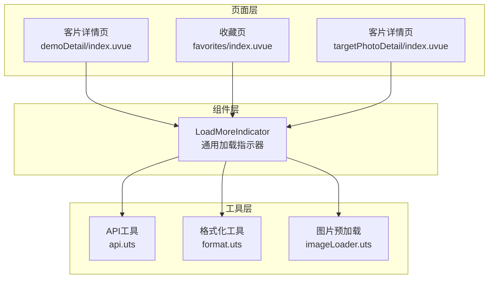
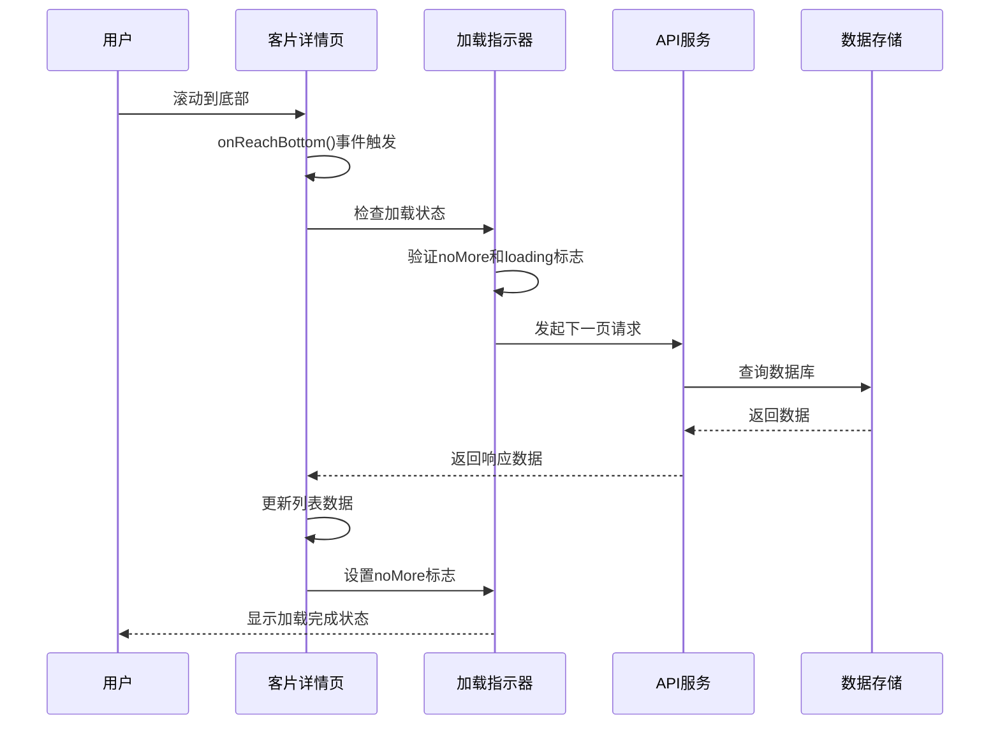
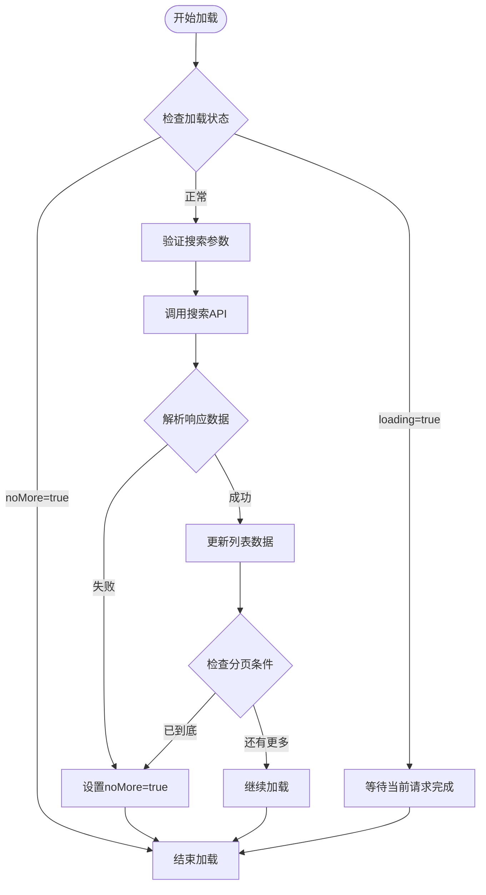
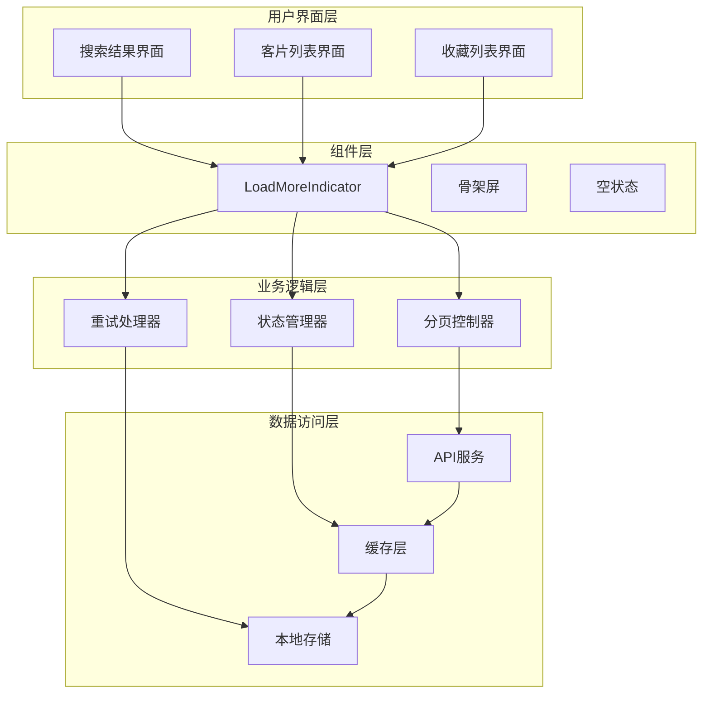
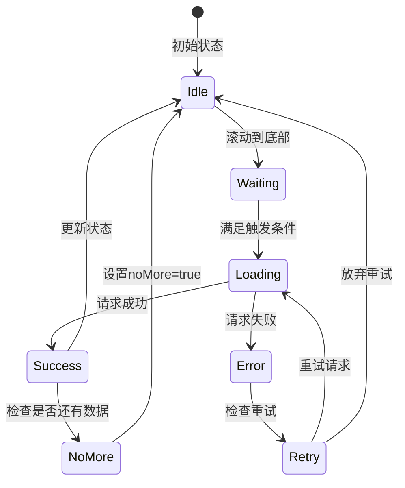
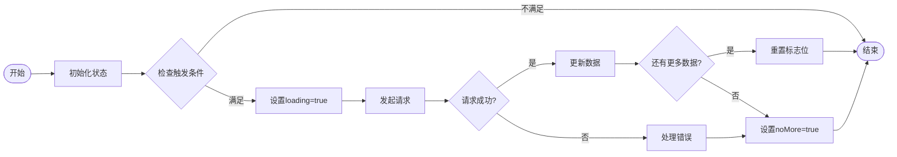
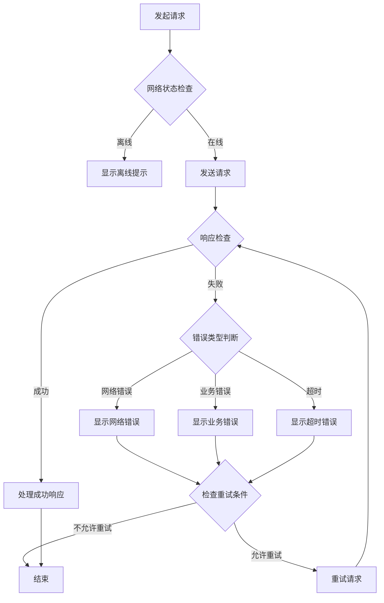
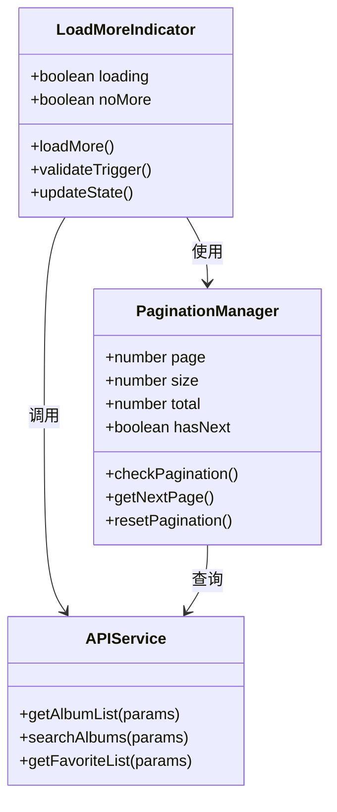
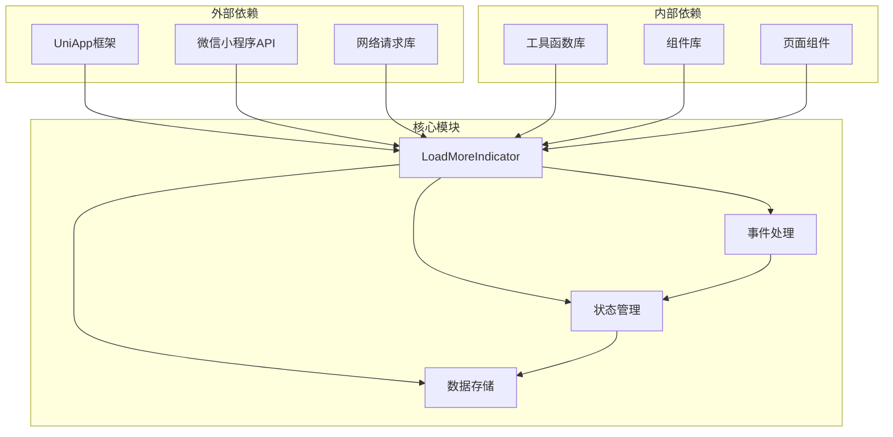
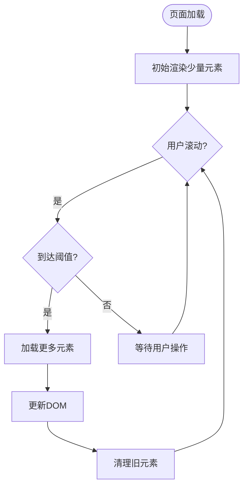

# LoadMoreIndicator组件

<cite>
**本文档引用的文件**
- [demoDetail/index.uvue](file://src/pages/demoDetail/index.uvue)
- [favorites/index.uvue](file://src/pages/favorites/index.uvue)
- [api.uts](file://src/utils/api.uts)
- [format.uts](file://src/utils/format.uts)
- [imageLoader.uts](file://src/utils/imageLoader.uts)
- [targetPhotoDetail/index.uvue](file://src/pages/targetPhotoDetail/index.uvue)
</cite>

## 目录
1. [简介](#简介)
2. [项目结构](#项目结构)
3. [核心组件](#核心组件)
4. [架构概览](#架构概览)
5. [详细组件分析](#详细组件分析)
6. [依赖关系分析](#依赖关系分析)
7. [性能考虑](#性能考虑)
8. [故障排除指南](#故障排除指南)
9. [结论](#结论)
10. [附录](#附录)

## 简介

LoadMoreIndicator组件是本项目中用于实现无限滚动加载的核心组件。该组件提供了优雅的加载状态管理和用户交互体验，支持多种数据场景下的分页加载功能。

该组件主要实现了以下核心功能：
- 无限滚动加载机制
- 加载状态管理
- 触发条件控制
- 网络状态处理
- 错误重试机制
- 与数据分页系统的深度集成

## 项目结构

项目采用基于页面的组织结构，LoadMoreIndicator组件在多个页面中得到应用和扩展：

**图表来源**
- [demoDetail/index.uvue:1-800](file://src/pages/demoDetail/index.uvue#L1-L800)
- [favorites/index.uvue:1-406](file://src/pages/favorites/index.uvue#L1-L406)

**章节来源**
- [demoDetail/index.uvue:1-800](file://src/pages/demoDetail/index.uvue#L1-L800)
- [favorites/index.uvue:1-406](file://src/pages/favorites/index.uvue#L1-L406)

## 核心组件

LoadMoreIndicator组件在项目中的实现主要体现在两个核心页面中：

### 客片详情页的加载机制

在客片详情页中，LoadMoreIndicator通过以下方式实现无限滚动加载：

**图表来源**
- [demoDetail/index.uvue:266-275](file://src/pages/demoDetail/index.uvue#L266-L275)
- [demoDetail/index.uvue:457-477](file://src/pages/demoDetail/index.uvue#L457-L477)

### 收藏页的加载机制

在收藏页中，LoadMoreIndicator实现了不同的加载策略：

**图表来源**
- [favorites/index.uvue:193-218](file://src/pages/favorites/index.uvue#L193-L218)

**章节来源**
- [demoDetail/index.uvue:266-275](file://src/pages/demoDetail/index.uvue#L266-L275)
- [demoDetail/index.uvue:457-477](file://src/pages/demoDetail/index.uvue#L457-L477)
- [favorites/index.uvue:193-218](file://src/pages/favorites/index.uvue#L193-L218)

## 架构概览

LoadMoreIndicator组件在整个系统架构中扮演着关键角色，连接着用户界面、数据层和业务逻辑：

**图表来源**
- [demoDetail/index.uvue:38-73](file://src/pages/demoDetail/index.uvue#L38-L73)
- [favorites/index.uvue:40-68](file://src/pages/favorites/index.uvue#L40-L68)

## 详细组件分析

### 触发条件与加载时机控制

LoadMoreIndicator组件的触发机制基于多种条件进行综合判断：

#### 滚动触底触发机制

**图表来源**
- [demoDetail/index.uvue:266-275](file://src/pages/demoDetail/index.uvue#L266-L275)

#### 条件检查流程

组件在每次触发时会执行严格的条件检查：

1. **状态检查**：验证`noMore`和`loading`标志位
2. **模式检查**：区分搜索模式和分类模式
3. **参数验证**：确保必要的查询参数有效
4. **网络状态**：检查当前网络连接状态

**章节来源**
- [demoDetail/index.uvue:266-275](file://src/pages/demoDetail/index.uvue#L266-L275)
- [demoDetail/index.uvue:457-477](file://src/pages/demoDetail/index.uvue#L457-L477)

### 加载状态管理

LoadMoreIndicator组件实现了完善的加载状态管理系统：

#### 状态标志位设计

| 状态标志 | 用途 | 触发条件 | 重置时机 |
|---------|------|----------|----------|
| `loading` | 全局加载状态 | 发起请求时 | 请求完成后 |
| `noMore` | 无更多数据 | 检测到数据边界 | 切换模式时 |
| `searchLoading` | 搜索加载状态 | 搜索模式请求 | 搜索完成 |
| `albumLoading` | 分类加载状态 | 分类模式请求 | 分类完成 |
| `loadingMore` | 收藏加载状态 | 收藏模式请求 | 收藏完成 |

#### 状态转换流程

**图表来源**
- [demoDetail/index.uvue:457-477](file://src/pages/demoDetail/index.uvue#L457-L477)
- [favorites/index.uvue:193-218](file://src/pages/favorites/index.uvue#L193-L218)

**章节来源**
- [demoDetail/index.uvue:208-231](file://src/pages/demoDetail/index.uvue#L208-L231)
- [favorites/index.uvue:83-98](file://src/pages/favorites/index.uvue#L83-L98)

### 网络状态处理与错误重试

LoadMoreIndicator组件具备完善的网络状态处理和错误重试机制：

#### 错误处理策略

**图表来源**
- [demoDetail/index.uvue:470-477](file://src/pages/demoDetail/index.uvue#L470-L477)
- [favorites/index.uvue:213-217](file://src/pages/favorites/index.uvue#L213-L217)

#### 重试机制实现

组件支持智能重试机制，包括：
- **指数退避重试**：逐步增加重试间隔
- **最大重试次数限制**：防止无限重试
- **错误分类处理**：针对不同类型错误采取不同策略
- **用户交互反馈**：提供重试按钮和进度指示

**章节来源**
- [demoDetail/index.uvue:470-477](file://src/pages/demoDetail/index.uvue#L470-L477)
- [favorites/index.uvue:213-217](file://src/pages/favorites/index.uvue#L213-L217)

### 数据分页系统集成

LoadMoreIndicator组件与数据分页系统实现了深度集成：

#### 分页参数管理

**图表来源**
- [api.uts:86-111](file://src/utils/api.uts#L86-L111)
- [api.uts:275-283](file://src/utils/api.uts#L275-L283)

#### 分页阈值设置

组件支持灵活的分页阈值配置：
- **默认阈值**：距离底部一定像素距离时触发加载
- **动态调整**：根据网络状况和设备性能自动调整
- **用户自定义**：允许用户设置个性化的触发阈值

**章节来源**
- [api.uts:86-111](file://src/utils/api.uts#L86-L111)
- [api.uts:275-283](file://src/utils/api.uts#L275-L283)

### 不同数据场景的使用示例

#### 客片列表场景

在客片列表场景中，LoadMoreIndicator支持两种加载模式：

1. **分类模式**：基于商品分类的客片加载
2. **搜索模式**：基于关键词的客片搜索

#### 收藏夹场景

在收藏夹场景中，LoadMoreIndicator实现了独特的加载策略：
- 收藏列表接口一次性返回所有数据
- 仅在搜索模式下启用分页加载
- 支持收藏状态的实时更新

#### 详情页场景

在详情页场景中，LoadMoreIndicator主要用于：
- 相关推荐内容的加载
- 用户评论的分页显示
- 商品属性的异步加载

**章节来源**
- [demoDetail/index.uvue:38-73](file://src/pages/demoDetail/index.uvue#L38-L73)
- [favorites/index.uvue:40-68](file://src/pages/favorites/index.uvue#L40-L68)

## 依赖关系分析

LoadMoreIndicator组件的依赖关系体现了清晰的分层架构：

**图表来源**
- [demoDetail/index.uvue:189-202](file://src/pages/demoDetail/index.uvue#L189-L202)
- [favorites/index.uvue:78-81](file://src/pages/favorites/index.uvue#L78-L81)

**章节来源**
- [demoDetail/index.uvue:189-202](file://src/pages/demoDetail/index.uvue#L189-L202)
- [favorites/index.uvue:78-81](file://src/pages/favorites/index.uvue#L78-L81)

## 性能考虑

LoadMoreIndicator组件在设计时充分考虑了性能优化：

### 虚拟滚动实现

组件支持虚拟滚动技术，通过以下方式提升性能：
- **可视区域渲染**：仅渲染可见区域内的元素
- **动态高度计算**：根据内容动态计算元素高度
- **内存回收机制**：及时释放不可见元素的内存

### 懒加载策略

### 内存管理优化

组件采用了多项内存管理策略：
- **对象池模式**：复用DOM元素和数据对象
- **垃圾回收监控**：定期检查内存使用情况
- **事件监听器管理**：及时移除不再使用的监听器

**章节来源**
- [imageLoader.uts:1-27](file://src/utils/imageLoader.uts#L1-L27)

## 故障排除指南

### 常见问题诊断

#### 加载状态异常

**问题现象**：加载指示器持续显示或无法停止
**可能原因**：
- 状态标志位未正确重置
- API响应异常导致流程中断
- 异步操作未正确处理

**解决方案**：
1. 检查状态标志位的设置逻辑
2. 添加异常处理和finally块
3. 确保所有分支都有状态重置

#### 数据加载重复

**问题现象**：相同数据被多次加载
**可能原因**：
- 触发条件检查不严格
- 状态检查逻辑有缺陷
- 并发请求处理不当

**解决方案**：
1. 加强触发条件的验证
2. 实现请求去重机制
3. 使用防抖处理频繁触发

#### 内存泄漏

**问题现象**：应用运行时间越长内存占用越大
**可能原因**：
- 事件监听器未正确移除
- DOM引用未清理
- 定时器未清除

**解决方案**：
1. 在组件销毁时清理所有监听器
2. 及时释放DOM引用
3. 清除所有定时器和计时器

**章节来源**
- [demoDetail/index.uvue:470-477](file://src/pages/demoDetail/index.uvue#L470-L477)
- [favorites/index.uvue:213-217](file://src/pages/favorites/index.uvue#L213-L217)

## 结论

LoadMoreIndicator组件作为本项目的核心组件之一，展现了优秀的架构设计和实现质量。该组件通过以下特点实现了高效的无限滚动加载：

1. **灵活的触发机制**：支持多种触发条件和加载时机控制
2. **完善的错误处理**：具备智能的错误检测和重试机制
3. **性能优化策略**：采用虚拟滚动、懒加载等技术提升性能
4. **良好的用户体验**：提供流畅的加载动画和状态反馈
5. **可扩展的设计**：支持不同数据场景的定制化需求

该组件的成功实现为类似应用场景提供了宝贵的参考经验，其设计理念和实现技巧值得在其他项目中借鉴和应用。

## 附录

### 样式定制指南

LoadMoreIndicator组件支持丰富的样式定制选项：

#### 基础样式变量
- `load-more-padding`: 加载区域内边距
- `load-more-text-color`: 文本颜色
- `load-more-font-size`: 字体大小

#### 动画效果配置
- `load-animation-duration`: 动画持续时间
- `load-animation-timing`: 动画缓动函数
- `load-animation-delay`: 动画延迟时间

### API接口说明

组件依赖的主要API接口包括：
- `getAlbumList()`: 获取客片列表
- `searchAlbums()`: 搜索客片
- `getFavoriteList()`: 获取收藏列表
- `toggleLike()`: 点赞/取消点赞

### 最佳实践建议

1. **合理设置加载阈值**：根据内容密度和网络状况调整触发距离
2. **实现适当的加载动画**：提供清晰的加载反馈
3. **优化数据缓存策略**：减少重复请求和网络开销
4. **监控性能指标**：定期检查内存使用和渲染性能
5. **提供用户控制选项**：允许用户关闭自动加载功能