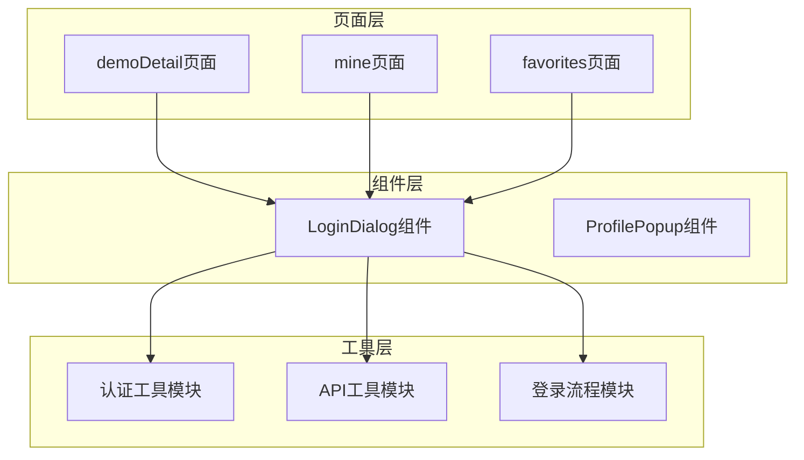
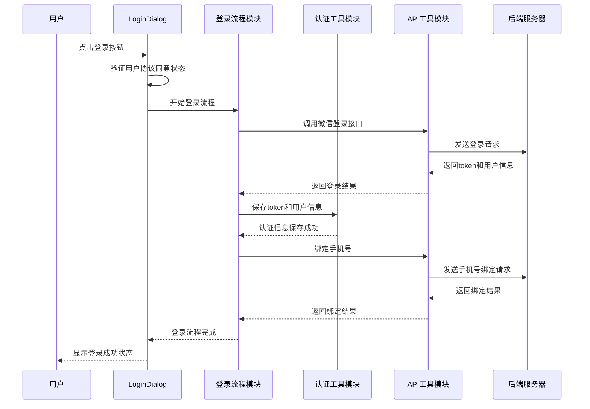
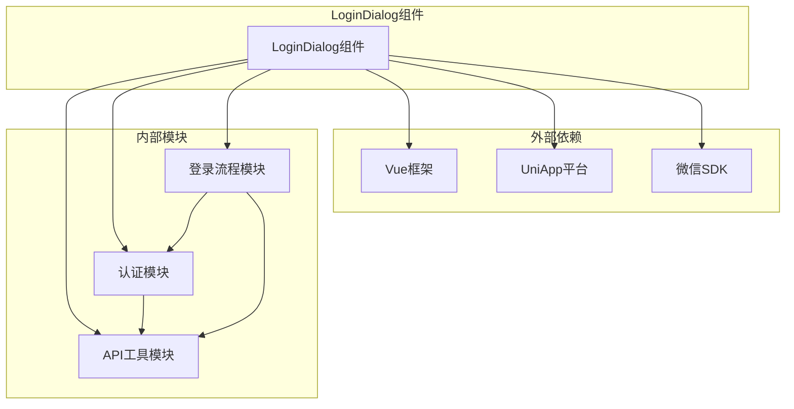

# LoginDialog组件

<cite>
**本文档引用的文件**
- [loginFlow.uts](file://src/utils/loginFlow.uts)
- [auth.uts](file://src/utils/auth.uts)
- [api.uts](file://src/utils/api.uts)
- [demoDetail/index.uvue](file://src/pages/demoDetail/index.uvue)
- [mine/index.uvue](file://src/pages/mine/index.uvue)
</cite>

## 目录
1. [简介](#简介)
2. [项目结构](#项目结构)
3. [核心组件](#核心组件)
4. [架构概览](#架构概览)
5. [详细组件分析](#详细组件分析)
6. [依赖关系分析](#依赖关系分析)
7. [性能考虑](#性能考虑)
8. [故障排除指南](#故障排除指南)
9. [结论](#结论)

## 简介

LoginDialog组件是蓝莓小程序项目中的核心认证组件，负责处理用户的登录弹窗功能。该组件实现了完整的微信授权登录流程，包括手机号绑定和登录状态管理。组件采用现代化的设计理念，提供了直观的用户界面和流畅的交互体验。

该组件的主要功能包括：
- 微信授权登录：通过微信提供的静默登录机制获取用户授权
- 手机号绑定：支持用户手机号的绑定和验证
- 登录状态管理：维护用户的登录状态和会话信息
- 用户协议同意：确保用户同意相关的服务条款和隐私政策
- 错误处理：提供完善的错误处理和用户反馈机制

## 项目结构

LoginDialog组件位于项目的组件目录中，与认证相关的工具函数分布在utils目录下。整个认证系统采用模块化设计，各个组件职责明确，耦合度低。

**图表来源**
- [demoDetail/index.uvue:137-163](file://src/pages/demoDetail/index.uvue#L137-L163)
- [mine/index.uvue:258-275](file://src/pages/mine/index.uvue#L258-L275)

**章节来源**
- [demoDetail/index.uvue:137-163](file://src/pages/demoDetail/index.uvue#L137-L163)
- [mine/index.uvue:258-275](file://src/pages/mine/index.uvue#L258-L275)

## 核心组件

LoginDialog组件的核心功能围绕三个主要模块构建：

### 认证工具模块 (auth.uts)
负责管理用户登录状态、token和用户信息的持久化存储。提供了完整的认证状态检查、token管理和用户信息操作功能。

### API工具模块 (api.uts)
封装了所有与后端服务交互的API调用，包括微信登录、手机号绑定、用户信息获取等功能。采用统一的请求处理机制，确保API调用的一致性和可靠性。

### 登录流程模块 (loginFlow.uts)
实现了完整的登录三步骤流程，包括静默登录获取微信code、通过code换取token、以及手机号绑定等核心逻辑。

**章节来源**
- [auth.uts:1-149](file://src/utils/auth.uts#L1-L149)
- [api.uts:1-312](file://src/utils/api.uts#L1-L312)
- [loginFlow.uts:1-71](file://src/utils/loginFlow.uts#L1-L71)

## 架构概览

LoginDialog组件采用了分层架构设计，确保了代码的可维护性和扩展性。整个系统分为表示层、业务逻辑层和数据访问层三个层次。

**图表来源**
- [loginFlow.uts:27-70](file://src/utils/loginFlow.uts#L27-L70)
- [auth.uts:135-139](file://src/utils/auth.uts#L135-L139)
- [api.uts:129-154](file://src/utils/api.uts#L129-L154)

## 详细组件分析

### 登录弹窗界面设计

LoginDialog组件采用了简洁直观的界面设计，主要包含以下元素：

#### 用户协议同意区域
组件要求用户必须同意相关的服务条款和隐私政策才能进行登录操作。这一设计确保了法律合规性和用户体验的透明度。

#### 微信授权登录按钮
使用微信官方提供的`getPhoneNumber`开放能力，实现一键登录功能。按钮根据用户协议同意状态动态显示，提供良好的用户体验。

#### 暂不登录选项
为用户提供灵活的选择，允许用户稍后进行登录操作。

**章节来源**
- [demoDetail/index.uvue:137-163](file://src/pages/demoDetail/index.uvue#L137-L163)

### 登录流程控制

组件实现了完整的登录流程控制机制，包括流程启动、状态监控和结果处理。

#### 流程启动机制
当用户点击登录按钮时，组件会首先检查用户是否已同意相关协议。只有在协议同意的情况下，才会启动登录流程。

#### 状态监控
组件在整个登录过程中保持状态同步，实时更新用户界面反馈，确保用户了解当前的操作状态。

#### 结果处理
登录完成后，组件会根据不同的结果类型执行相应的处理逻辑，包括成功登录、需要完善个人信息等情况。

**章节来源**
- [demoDetail/index.uvue:276-291](file://src/pages/demoDetail/index.uvue#L276-L291)

### 表单验证机制

LoginDialog组件内置了完善的表单验证机制，确保用户输入的有效性和安全性。

#### 用户协议验证
组件强制要求用户必须同意服务条款和隐私政策，这是登录操作的前提条件。

#### 输入格式验证
对于手机号等关键信息，组件提供了基础的格式验证，确保用户输入符合预期格式。

#### 实时状态反馈
组件通过视觉反馈和用户提示，实时告知用户当前的操作状态和可能的问题。

**章节来源**
- [demoDetail/index.uvue:137-163](file://src/pages/demoDetail/index.uvue#L137-L163)

### 用户交互设计

组件的用户交互设计注重易用性和直观性，提供了流畅的用户体验。

#### 点击区域优化
登录按钮和协议同意区域都经过精心设计，确保用户能够轻松地进行操作。

#### 加载状态指示
在登录过程中，组件会显示适当的加载状态，让用户了解当前的操作进度。

#### 错误处理反馈
当发生错误时，组件会提供清晰的错误信息和解决方案建议。

**章节来源**
- [demoDetail/index.uvue:276-291](file://src/pages/demoDetail/index.uvue#L276-L291)

### 状态反馈机制

LoginDialog组件实现了多层次的状态反馈机制，确保用户能够及时了解系统状态。

#### 成功状态反馈
登录成功后，组件会显示相应的成功状态，并更新相关的用户界面元素。

#### 失败状态反馈
当登录失败时，组件会提供详细的错误信息和可能的解决方案。

#### 进度状态反馈
在复杂的登录流程中，组件会显示详细的进度信息，帮助用户理解当前所处的阶段。

**章节来源**
- [loginFlow.uts:27-70](file://src/utils/loginFlow.uts#L27-L70)

### 错误处理机制

组件具备完善的错误处理机制，能够优雅地处理各种异常情况。

#### 网络错误处理
组件能够识别和处理网络连接问题，提供相应的用户提示和重试机制。

#### 业务逻辑错误处理
对于业务层面的错误，组件会提供清晰的错误信息和解决方案建议。

#### 用户中断处理
如果用户在登录过程中主动取消操作，组件会正确处理这种中断情况。

**章节来源**
- [loginFlow.uts:27-70](file://src/utils/loginFlow.uts#L27-L70)

### 加载状态显示

组件在登录过程中提供了丰富的加载状态显示，改善用户体验。

#### 骨架屏加载
在数据加载期间，组件会显示骨架屏效果，减少用户的等待焦虑感。

#### 进度指示器
对于耗时较长的操作，组件会显示进度指示器，让用户了解操作的进展情况。

#### 状态切换动画
组件使用平滑的动画效果，在不同的状态之间进行切换，提供流畅的视觉体验。

**章节来源**
- [demoDetail/index.uvue:276-291](file://src/pages/demoDetail/index.uvue#L276-L291)

### 关闭逻辑

LoginDialog组件实现了完整的关闭逻辑，确保用户能够方便地退出登录流程。

#### 点击外部区域关闭
用户可以通过点击弹窗外部区域来关闭登录弹窗，提供便捷的退出方式。

#### 按钮关闭功能
组件提供了明确的关闭按钮，让用户可以主动选择退出登录流程。

#### 状态重置机制
当弹窗关闭时，组件会自动重置相关的状态变量，确保下次使用时的正常行为。

**章节来源**
- [demoDetail/index.uvue:271-275](file://src/pages/demoDetail/index.uvue#L271-L275)

### 不同登录场景的使用示例

LoginDialog组件在不同的登录场景下表现出色，能够适应各种使用需求。

#### 首次访问场景
对于首次访问应用的用户，组件会引导他们完成完整的登录流程，包括协议同意和手机号绑定。

#### 会话过期场景
当用户会话过期时，组件会自动检测并重新触发登录流程，确保用户能够继续使用应用功能。

#### 权限验证场景
在需要特定权限的操作中，组件会检查用户的登录状态，必要时触发登录流程。

**章节来源**
- [demoDetail/index.uvue:258-269](file://src/pages/demoDetail/index.uvue#L258-L269)

### 与认证系统的集成

LoginDialog组件与整个认证系统深度集成，形成了完整的认证解决方案。

#### Token管理集成
组件通过认证工具模块管理token的存储和检索，确保用户会话的持续性。

#### 用户信息获取集成
组件集成了用户信息获取功能，能够在登录成功后获取和更新用户的基本信息。

#### 登录回调处理集成
组件提供了灵活的登录回调处理机制，允许上层页面根据登录结果执行相应的业务逻辑。

**章节来源**
- [auth.uts:135-139](file://src/utils/auth.uts#L135-L139)
- [api.uts:159-166](file://src/utils/api.uts#L159-L166)

### 样式定制和动画效果

组件提供了丰富的样式定制选项和动画效果，满足不同的设计需求。

#### 主题适配
组件支持主题定制，能够适配不同的品牌色彩和设计风格。

#### 动画效果
组件使用了多种动画效果，包括淡入淡出、滑动等，提升用户体验。

#### 响应式设计
组件具有良好的响应式设计，能够在不同尺寸的设备上正常显示。

**章节来源**
- [demoDetail/index.uvue:137-163](file://src/pages/demoDetail/index.uvue#L137-L163)

### 无障碍访问支持

LoginDialog组件充分考虑了无障碍访问的需求，确保所有用户都能正常使用。

#### 屏幕阅读器支持
组件提供了适当的ARIA标签和语义化标记，支持屏幕阅读器的使用。

#### 键盘导航支持
组件支持键盘快捷键操作，方便键盘用户进行导航和交互。

#### 高对比度支持
组件支持高对比度模式，确保视力障碍用户能够清晰地看到界面元素。

**章节来源**
- [demoDetail/index.uvue:137-163](file://src/pages/demoDetail/index.uvue#L137-L163)

## 依赖关系分析

LoginDialog组件的依赖关系清晰明确，遵循了依赖倒置原则，降低了模块间的耦合度。

**图表来源**
- [loginFlow.uts:8-9](file://src/utils/loginFlow.uts#L8-L9)
- [auth.uts:1-149](file://src/utils/auth.uts#L1-L149)
- [api.uts:1-312](file://src/utils/api.uts#L1-L312)

**章节来源**
- [loginFlow.uts:8-9](file://src/utils/loginFlow.uts#L8-L9)
- [auth.uts:1-149](file://src/utils/auth.uts#L1-L149)
- [api.uts:1-312](file://src/utils/api.uts#L1-L312)

## 性能考虑

LoginDialog组件在设计时充分考虑了性能优化，确保在各种设备上都能提供流畅的用户体验。

### 内存管理
组件采用了高效的内存管理策略，避免不必要的内存占用和泄漏。

### 网络优化
组件优化了网络请求的处理方式，减少了不必要的网络往返和数据传输。

### 渲染优化
组件使用了虚拟DOM和高效的渲染机制，确保界面更新的流畅性。

### 缓存策略
组件实现了智能的缓存策略，合理利用缓存提高应用的响应速度。

## 故障排除指南

在使用LoginDialog组件时，可能会遇到一些常见问题。以下是详细的故障排除指南：

### 登录失败问题
当用户遇到登录失败时，可以按照以下步骤进行排查：
1. 检查网络连接是否正常
2. 确认微信授权是否正常
3. 验证用户协议是否已同意
4. 查看控制台是否有错误日志

### 用户协议同意问题
如果用户无法同意协议，可能是由于：
1. 协议内容加载失败
2. 用户界面显示异常
3. 状态同步问题

### 手机号绑定问题
手机号绑定失败的常见原因包括：
1. 手机号格式不正确
2. 服务器验证失败
3. 网络连接问题

**章节来源**
- [loginFlow.uts:27-70](file://src/utils/loginFlow.uts#L27-L70)

## 结论

LoginDialog组件作为蓝莓小程序项目的核心认证组件，展现了优秀的架构设计和实现质量。组件不仅功能完整、易于使用，还具备良好的可维护性和扩展性。

通过采用模块化的架构设计，LoginDialog组件成功地将复杂的登录流程简化为直观的用户界面，为用户提供了流畅的登录体验。同时，组件完善的错误处理机制和状态管理功能，确保了系统的稳定性和可靠性。

未来，随着业务需求的发展和技术的进步，LoginDialog组件还可以进一步优化，例如增加更多的登录方式支持、改进用户体验设计、增强安全防护措施等。但目前的实现已经为项目的成功奠定了坚实的基础。
