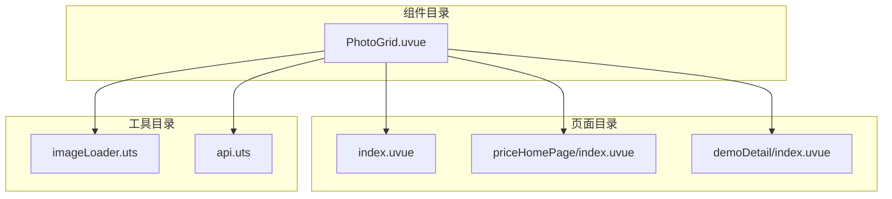
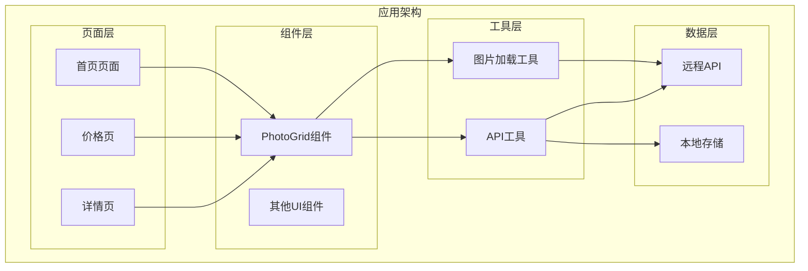
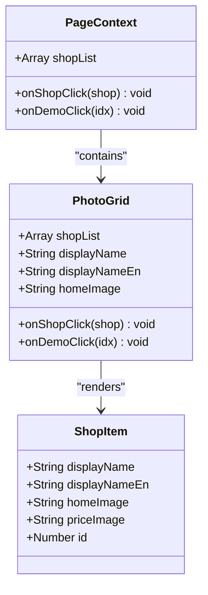
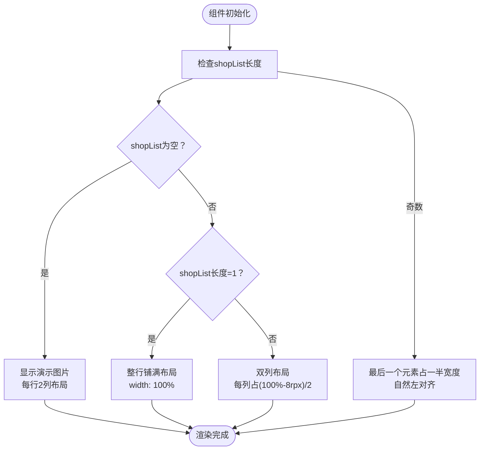
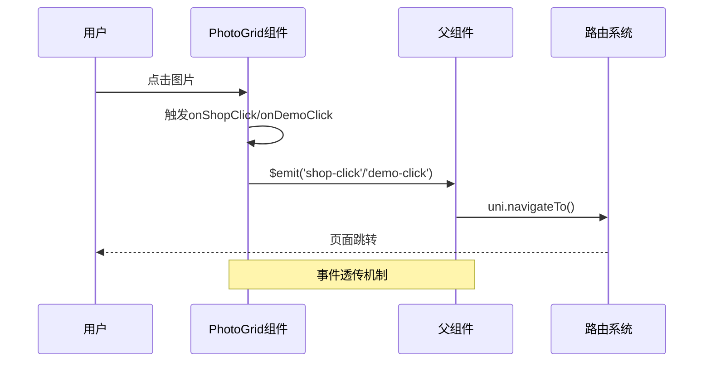
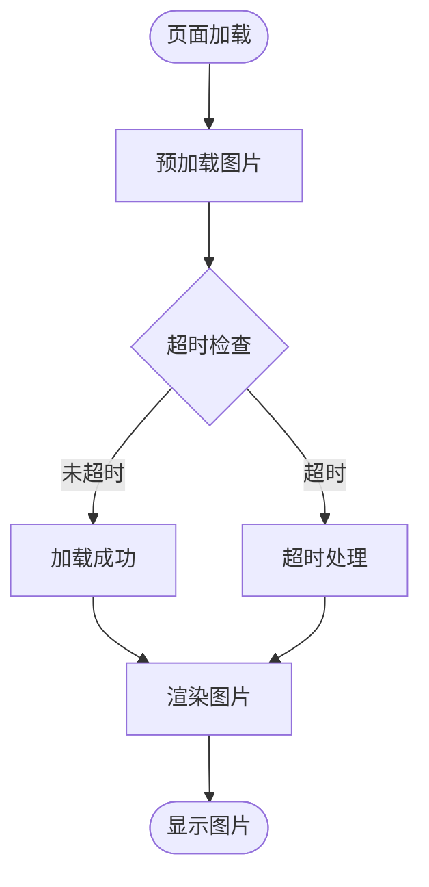
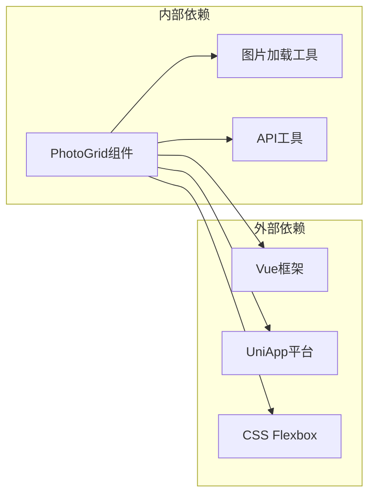
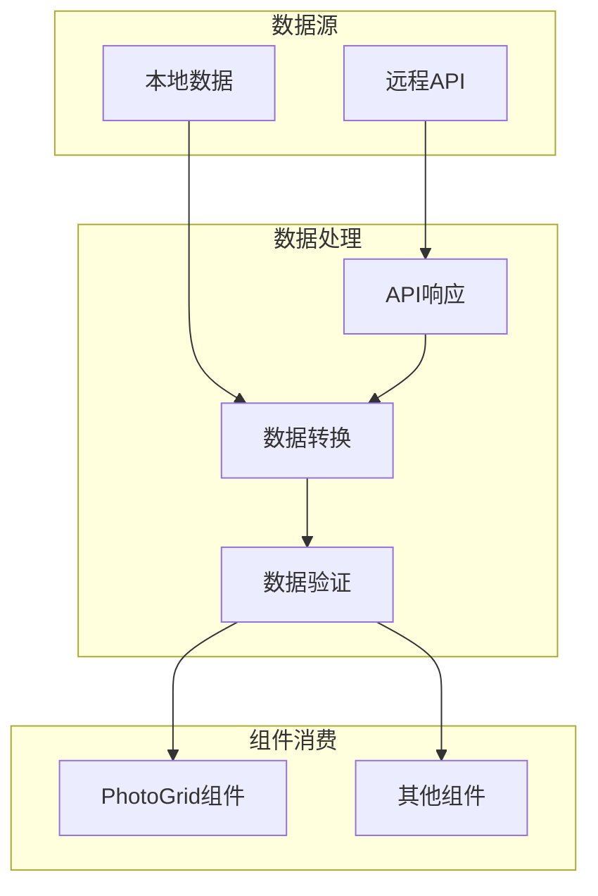

# PhotoGrid组件

<cite>
**本文档引用的文件**
- [PhotoGrid.uvue](file://src/components/PhotoGrid/PhotoGrid.uvue)
- [index.uvue](file://src/pages/index/index.uvue)
- [priceHomePage/index.uvue](file://src/pages/priceHomePage/index.uvue)
- [demoDetail/index.uvue](file://src/pages/demoDetail/index.uvue)
- [imageLoader.uts](file://src/utils/imageLoader.uts)
- [api.uts](file://src/utils/api.uts)
</cite>

## 目录
1. [简介](#简介)
2. [项目结构](#项目结构)
3. [核心组件](#核心组件)
4. [架构概览](#架构概览)
5. [详细组件分析](#详细组件分析)
6. [依赖关系分析](#依赖关系分析)
7. [性能考虑](#性能考虑)
8. [故障排除指南](#故障排除指南)
9. [结论](#结论)

## 简介

PhotoGrid组件是一个专门用于展示图片网格的Vue组件，主要负责店铺/客片的网格展示功能。该组件的设计目标是收敛多个页面中重复的图片容器结构与样式，统一店铺卡片网格的渲染规则。组件支持响应式网格布局、图片懒加载机制，并提供了灵活的交互功能。

## 项目结构

PhotoGrid组件位于项目的组件目录中，与其他页面组件协同工作：

**图表来源**
- [PhotoGrid.uvue:1-119](file://src/components/PhotoGrid/PhotoGrid.uvue#L1-L119)
- [index.uvue:25](file://src/pages/index/index.uvue#L25-L25)
- [priceHomePage/index.uvue:16](file://src/pages/priceHomePage/index.uvue#L16-L16)

**章节来源**
- [PhotoGrid.uvue:1-119](file://src/components/PhotoGrid/PhotoGrid.uvue#L1-L119)
- [index.uvue:1-359](file://src/pages/index/index.uvue#L1-L359)
- [priceHomePage/index.uvue:1-113](file://src/pages/priceHomePage/index.uvue#L1-L113)

## 核心组件

PhotoGrid组件的核心功能包括：

### 主要特性
- **响应式网格布局**：支持单列和双列布局模式
- **图片懒加载**：通过uni.getImageInfo实现图片预加载
- **事件透传**：将点击事件传递给父组件进行路由处理
- **回退机制**：当数据为空时显示演示图片

### 数据结构
组件接收`shopList`属性，期望的数据结构包含：
- `homeImage`: 图片URL
- `displayName`: 显示名称
- `displayNameEn`: 英文显示名称

**章节来源**
- [PhotoGrid.uvue:49-54](file://src/components/PhotoGrid/PhotoGrid.uvue#L49-L54)
- [api.uts:15-23](file://src/utils/api.uts#L15-L23)

## 架构概览

PhotoGrid组件在整个应用架构中的位置和作用：

**图表来源**
- [PhotoGrid.uvue:17-44](file://src/components/PhotoGrid/PhotoGrid.uvue#L17-L44)
- [index.uvue:25](file://src/pages/index/index.uvue#L25-L25)
- [priceHomePage/index.uvue:16](file://src/pages/priceHomePage/index.uvue#L16-L16)

## 详细组件分析

### 组件结构分析

**图表来源**
- [PhotoGrid.uvue:47-64](file://src/components/PhotoGrid/PhotoGrid.uvue#L47-L64)
- [api.uts:15-23](file://src/utils/api.uts#L15-L23)

### 布局算法实现

PhotoGrid组件实现了智能的网格布局算法：

**图表来源**
- [PhotoGrid.uvue:7-12](file://src/components/PhotoGrid/PhotoGrid.uvue#L7-L12)
- [PhotoGrid.uvue:77-89](file://src/components/PhotoGrid/PhotoGrid.uvue#L77-L89)

### 事件处理流程

**图表来源**
- [PhotoGrid.uvue:56-62](file://src/components/PhotoGrid/PhotoGrid.uvue#L56-L62)
- [index.uvue:283-292](file://src/pages/index/index.uvue#L283-L292)

**章节来源**
- [PhotoGrid.uvue:17-44](file://src/components/PhotoGrid/PhotoGrid.uvue#L17-L44)
- [PhotoGrid.uvue:67-118](file://src/components/PhotoGrid/PhotoGrid.uvue#L67-L118)

### 图片加载优化

虽然PhotoGrid组件本身没有实现复杂的懒加载机制，但项目提供了完整的图片加载优化方案：

**图表来源**
- [imageLoader.uts:22-27](file://src/utils/imageLoader.uts#L22-L27)

**章节来源**
- [imageLoader.uts:1-28](file://src/utils/imageLoader.uts#L1-L28)

## 依赖关系分析

### 组件间依赖关系

**图表来源**
- [PhotoGrid.uvue:17-44](file://src/components/PhotoGrid/PhotoGrid.uvue#L17-L44)
- [imageLoader.uts:8-16](file://src/utils/imageLoader.uts#L8-L16)

### 数据流分析

**图表来源**
- [api.uts:27-47](file://src/utils/api.uts#L27-L47)
- [PhotoGrid.uvue:49-54](file://src/components/PhotoGrid/PhotoGrid.uvue#L49-L54)

**章节来源**
- [api.uts:1-200](file://src/utils/api.uts#L1-L200)
- [PhotoGrid.uvue:1-119](file://src/components/PhotoGrid/PhotoGrid.uvue#L1-L119)

## 性能考虑

### 布局性能优化

PhotoGrid组件采用了高效的CSS布局方案：

- **Flexbox布局**：使用CSS Flexbox实现响应式网格，性能优于传统表格布局
- **CSS计算属性**：使用`calc()`函数动态计算列宽，减少JavaScript计算开销
- **最小化重排**：通过类名切换实现布局变化，避免频繁DOM操作

### 图片加载优化

虽然PhotoGrid组件本身专注于布局，但项目提供了完整的图片加载优化策略：

- **预加载机制**：使用`uni.getImageInfo`预加载图片，避免页面切换时的白屏
- **超时保护**：设置5秒超时，防止长时间等待影响用户体验
- **并发加载**：使用Promise.all并行加载多张图片

**章节来源**
- [PhotoGrid.uvue:68-118](file://src/components/PhotoGrid/PhotoGrid.uvue#L68-L118)
- [imageLoader.uts:18-27](file://src/utils/imageLoader.uts#L18-L27)

## 故障排除指南

### 常见问题及解决方案

#### 图片显示问题
- **问题**：图片无法显示或显示异常
- **原因**：图片URL无效或网络问题
- **解决方案**：检查API返回的图片URL，确保网络连接正常

#### 布局错乱问题
- **问题**：网格布局显示异常
- **原因**：CSS样式冲突或屏幕尺寸变化
- **解决方案**：检查容器宽度设置，确保CSS优先级正确

#### 事件处理问题
- **问题**：点击事件无法触发
- **原因**：事件监听器未正确绑定
- **解决方案**：检查组件的事件发射和父组件的事件处理

**章节来源**
- [PhotoGrid.uvue:56-62](file://src/components/PhotoGrid/PhotoGrid.uvue#L56-L62)

## 结论

PhotoGrid组件是一个设计精良的图片网格展示组件，具有以下特点：

1. **简洁高效**：代码结构清晰，功能职责明确
2. **响应式设计**：智能的网格布局算法适应不同屏幕尺寸
3. **可扩展性强**：通过事件透传机制支持多种使用场景
4. **性能优化**：结合项目提供的图片加载工具实现性能优化

该组件为整个应用提供了统一的图片展示解决方案，支持多种业务场景，包括客片展示、相册浏览、商品列表等。通过合理的架构设计和性能优化，PhotoGrid组件能够满足现代移动应用对图片展示的各种需求。