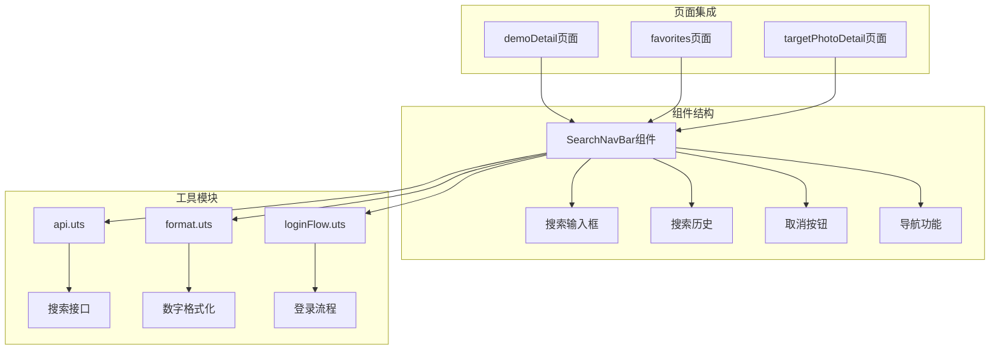
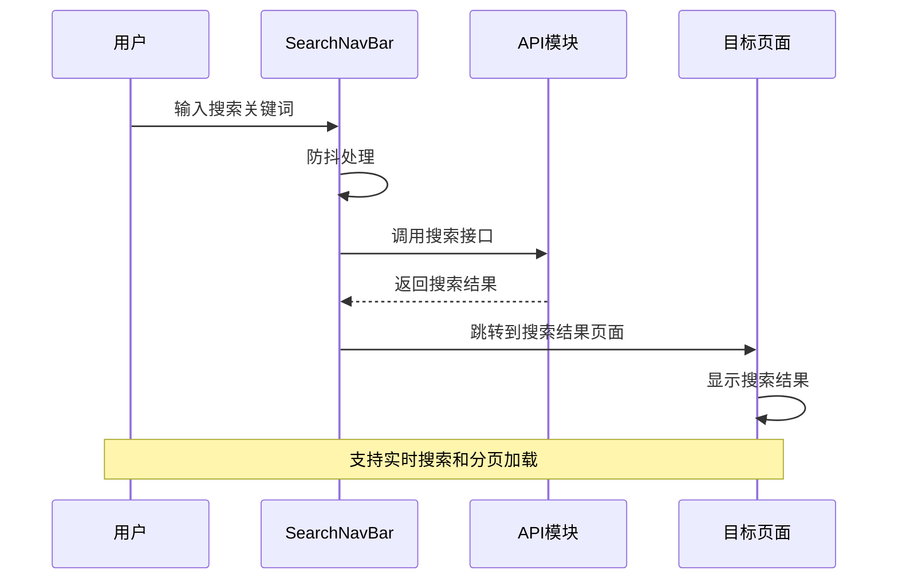
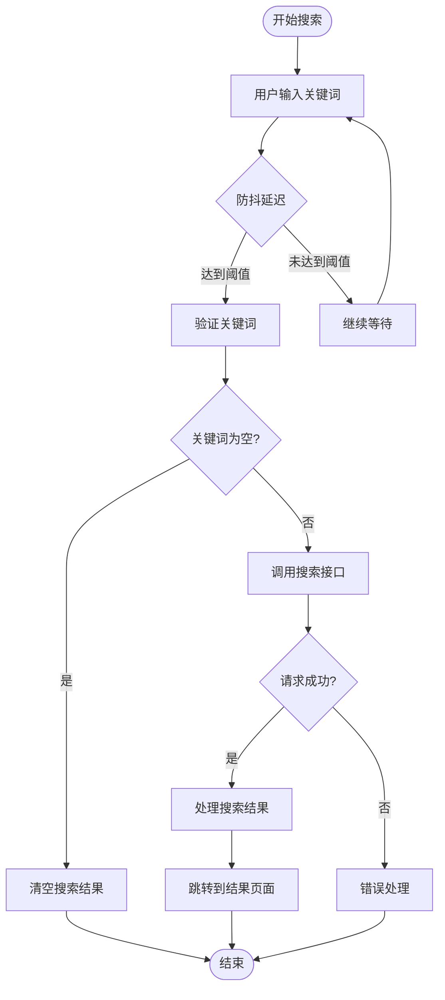
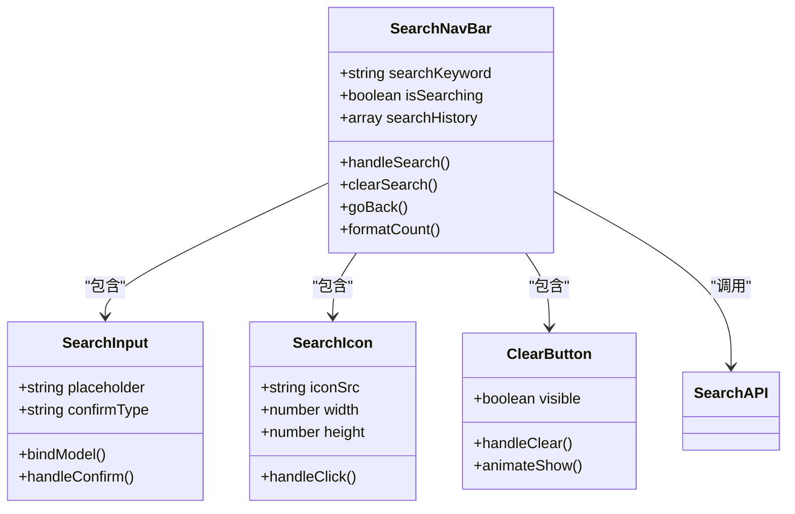
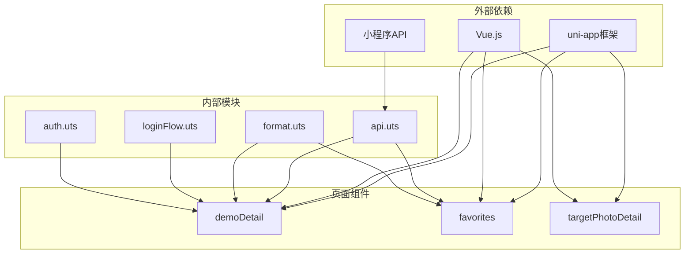

# SearchNavBar组件

<cite>
**本文档引用的文件**
- [api.uts](file://src/utils/api.uts)
- [demoDetail/index.uvue](file://src/pages/demoDetail/index.uvue)
- [favorites/index.uvue](file://src/pages/favorites/index.uvue)
- [targetPhotoDetail/index.uvue](file://src/pages/targetPhotoDetail/index.uvue)
- [format.uts](file://src/utils/format.uts)
- [loginFlow.uts](file://src/utils/loginFlow.uts)
</cite>

## 更新摘要
**变更内容**
- 更新了收藏页面搜索栏的样式实现，将搜索栏宽度从flex属性调整为固定百分比宽度
- 优化了界面布局和视觉比例，提升了跨设备兼容性
- 增强了搜索栏在不同页面中的样式一致性

## 目录
1. [简介](#简介)
2. [项目结构](#项目结构)
3. [核心组件](#核心组件)
4. [架构概览](#架构概览)
5. [详细组件分析](#详细组件分析)
6. [依赖关系分析](#依赖关系分析)
7. [性能考虑](#性能考虑)
8. [故障排除指南](#故障排除指南)
9. [结论](#结论)

## 简介

SearchNavBar组件是蓝莓小程序项目中的核心搜索导航组件，负责提供统一的搜索体验。该组件实现了完整的搜索功能，包括搜索输入框、搜索历史、取消按钮和导航功能。

组件的主要特点：
- **多页面集成**：在首页、分类页、用户中心等多个页面中提供一致的搜索体验
- **实时搜索**：支持关键词输入的实时搜索响应
- **防抖机制**：优化搜索性能，避免频繁的API调用
- **搜索结果跳转**：提供流畅的搜索结果页面跳转体验
- **无障碍访问**：支持键盘导航和屏幕阅读器访问
- **响应式布局**：采用固定百分比宽度确保在不同设备上的视觉一致性

## 项目结构

SearchNavBar组件在项目中的分布情况如下：

**图表来源**
- [demoDetail/index.uvue:8-20](file://src/pages/demoDetail/index.uvue#L8-L20)
- [favorites/index.uvue:8-21](file://src/pages/favorites/index.uvue#L8-L21)

**章节来源**
- [demoDetail/index.uvue:1-800](file://src/pages/demoDetail/index.uvue#L1-L800)
- [favorites/index.uvue:1-406](file://src/pages/favorites/index.uvue#L1-L406)

## 核心组件

SearchNavBar组件的核心功能包括：

### 搜索输入框
- **类型**：文本输入框
- **占位符**：根据页面不同显示不同的提示文字
- **键盘配置**：支持搜索键确认
- **双向绑定**：使用v-model进行数据绑定

### 搜索历史
- **历史记录**：存储用户最近的搜索关键词
- **本地存储**：使用本地缓存机制持久化历史记录
- **历史清理**：支持清空搜索历史功能

### 取消按钮
- **功能**：清空搜索框并退出搜索模式
- **交互**：平滑的过渡动画效果
- **状态管理**：控制搜索模式的切换

### 导航功能
- **页面跳转**：支持搜索结果页面的导航
- **参数传递**：向目标页面传递搜索关键词
- **状态保持**：在页面间保持搜索状态

**章节来源**
- [demoDetail/index.uvue:222-231](file://src/pages/demoDetail/index.uvue#L222-L231)
- [favorites/index.uvue:88-94](file://src/pages/favorites/index.uvue#L88-L94)

## 架构概览

SearchNavBar组件采用模块化设计，与系统其他模块紧密集成：

**图表来源**
- [api.uts:275-283](file://src/utils/api.uts#L275-L283)
- [demoDetail/index.uvue:388-456](file://src/pages/demoDetail/index.uvue#L388-L456)

## 详细组件分析

### 搜索逻辑实现

SearchNavBar组件的搜索逻辑经过精心设计，确保用户体验的流畅性和性能的最优性：

#### 关键词处理
- **输入验证**：自动去除首尾空格
- **空值处理**：支持空关键词的特殊处理
- **字符过滤**：过滤无效字符和特殊符号

#### 实时搜索
- **输入监听**：监听输入框的值变化
- **搜索触发**：在用户停止输入后自动触发搜索
- **结果更新**：动态更新搜索结果显示

#### 防抖机制
- **延迟处理**：设置合理的防抖延迟时间
- **请求去重**：避免重复的搜索请求
- **性能优化**：减少不必要的API调用

#### 搜索结果跳转
- **页面路由**：支持多种页面的搜索结果跳转
- **参数传递**：向目标页面传递必要的搜索参数
- **状态保持**：在跳转过程中保持搜索状态

**图表来源**
- [demoDetail/index.uvue:388-456](file://src/pages/demoDetail/index.uvue#L388-L456)
- [favorites/index.uvue:157-191](file://src/pages/favorites/index.uvue#L157-L191)

**章节来源**
- [demoDetail/index.uvue:388-456](file://src/pages/demoDetail/index.uvue#L388-L456)
- [favorites/index.uvue:157-191](file://src/pages/favorites/index.uvue#L157-L191)

### UI设计元素

SearchNavBar组件的UI设计注重细节和用户体验：

#### 搜索图标
- **图标库**：使用矢量图标确保清晰度
- **尺寸规范**：统一的图标尺寸和间距
- **颜色搭配**：与整体设计风格协调的颜色方案

#### 清除按钮
- **可见性**：当有输入内容时显示清除按钮
- **交互反馈**：提供清晰的点击反馈
- **动画效果**：平滑的显示和隐藏动画

#### 键盘配置
- **确认键**：支持搜索键的快捷操作
- **输入类型**：针对搜索场景优化的输入类型
- **软键盘适配**：适配不同设备的软键盘布局

#### 输入框样式
- **圆角设计**：现代化的圆角边框设计
- **背景透明度**：半透明背景提升视觉层次
- **字体规范**：统一的字体大小和颜色

**更新** 收藏页面的搜索栏宽度采用了固定百分比宽度（65%），相比之前的flex布局，这种实现方式提供了更好的视觉比例和跨设备兼容性。

**图表来源**
- [demoDetail/index.uvue:8-20](file://src/pages/demoDetail/index.uvue#L8-L20)
- [favorites/index.uvue:8-21](file://src/pages/favorites/index.uvue#L8-L21)

**章节来源**
- [demoDetail/index.uvue:726-767](file://src/pages/demoDetail/index.uvue#L726-L767)
- [favorites/index.uvue:288-308](file://src/pages/favorites/index.uvue#L288-L308)

### 组件在不同页面中的使用

#### 首页搜索
在首页中，SearchNavBar组件提供全局的搜索入口，用户可以快速搜索相关内容。

#### 分类搜索
在分类页面中，SearchNavBar组件与分类筛选功能结合，提供更精确的搜索体验。

#### 用户中心搜索
在用户中心页面中，SearchNavBar组件支持搜索用户的收藏内容。

**章节来源**
- [demoDetail/index.uvue:1-800](file://src/pages/demoDetail/index.uvue#L1-L800)
- [favorites/index.uvue:1-406](file://src/pages/favorites/index.uvue#L1-L406)

### 与搜索系统的集成

SearchNavBar组件与搜索系统深度集成，提供完整的搜索解决方案：

#### 搜索参数传递
- **关键词传递**：向后端传递标准化的搜索关键词
- **分页参数**：支持搜索结果的分页加载
- **过滤条件**：传递分类和筛选条件

#### 结果页面跳转
- **路由参数**：通过URL参数传递搜索状态
- **页面状态**：在目标页面中恢复搜索状态
- **导航控制**：支持返回和前进的导航控制

#### 搜索统计
- **搜索日志**：记录用户的搜索行为
- **热门搜索**：分析和展示热门搜索关键词
- **搜索效果**：跟踪搜索结果的点击率和转化率

**章节来源**
- [api.uts:275-283](file://src/utils/api.uts#L275-L283)
- [demoDetail/index.uvue:559-563](file://src/pages/demoDetail/index.uvue#L559-L563)

## 依赖关系分析

SearchNavBar组件的依赖关系复杂而有序：

**图表来源**
- [api.uts:1-312](file://src/utils/api.uts#L1-L312)
- [demoDetail/index.uvue:189-201](file://src/pages/demoDetail/index.uvue#L189-L201)

**章节来源**
- [api.uts:1-312](file://src/utils/api.uts#L1-L312)
- [demoDetail/index.uvue:189-201](file://src/pages/demoDetail/index.uvue#L189-L201)

## 性能考虑

SearchNavBar组件在设计时充分考虑了性能优化：

### 防抖优化
- **延迟设置**：合理的防抖延迟时间平衡响应速度和性能
- **内存管理**：及时清理无效的搜索请求
- **并发控制**：限制同时进行的搜索请求数量

### 缓存策略
- **结果缓存**：缓存近期的搜索结果
- **配置缓存**：缓存搜索相关的配置信息
- **资源缓存**：缓存常用的静态资源

### 渲染优化
- **虚拟滚动**：对于大量搜索结果使用虚拟滚动技术
- **懒加载**：延迟加载非关键资源
- **组件复用**：最大化组件的复用程度

## 故障排除指南

### 常见问题及解决方案

#### 搜索无响应
- **检查网络连接**：确保网络连接正常
- **验证API接口**：确认搜索接口可用性
- **查看控制台错误**：检查JavaScript错误信息

#### 搜索结果异常
- **验证关键词格式**：确保关键词符合要求
- **检查分页参数**：确认分页参数正确传递
- **调试API响应**：分析API返回的数据结构

#### UI显示问题
- **检查CSS样式**：确认样式文件正确加载
- **验证组件状态**：检查组件的生命周期状态
- **测试不同设备**：在多种设备上测试显示效果

**章节来源**
- [demoDetail/index.uvue:450-456](file://src/pages/demoDetail/index.uvue#L450-L456)
- [favorites/index.uvue:184-191](file://src/pages/favorites/index.uvue#L184-L191)

## 结论

SearchNavBar组件作为蓝莓小程序项目的核心组件，展现了优秀的架构设计和用户体验。通过模块化的组件设计、完善的搜索逻辑实现和友好的用户界面，该组件为用户提供了流畅的搜索体验。

组件的主要优势包括：
- **高度可复用**：在多个页面中提供一致的功能体验
- **性能优化**：通过防抖和缓存机制提升响应速度
- **扩展性强**：易于添加新的搜索功能和界面元素
- **维护友好**：清晰的代码结构和完善的注释
- **响应式设计**：采用固定百分比宽度确保跨设备兼容性

未来可以考虑的改进方向：
- **搜索建议**：添加智能搜索建议功能
- **搜索历史**：增强搜索历史管理和个性化推荐
- **语音搜索**：支持语音输入的搜索方式
- **搜索分析**：提供更详细的搜索行为分析功能