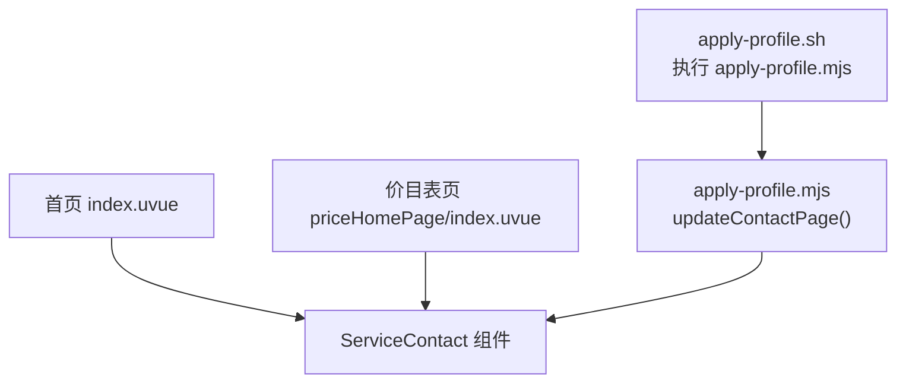
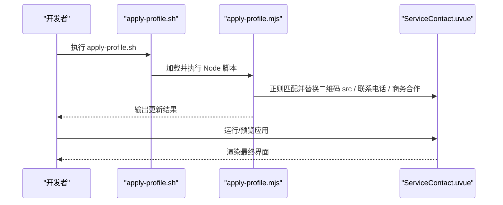
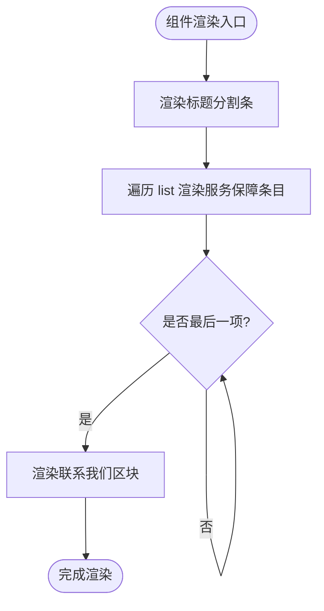
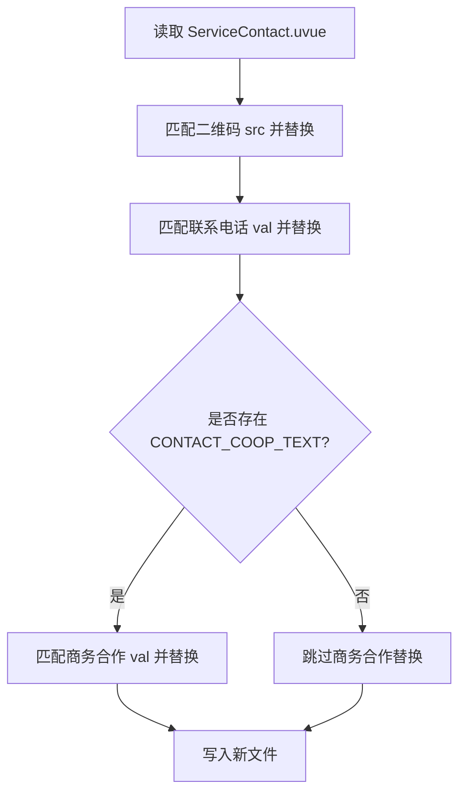
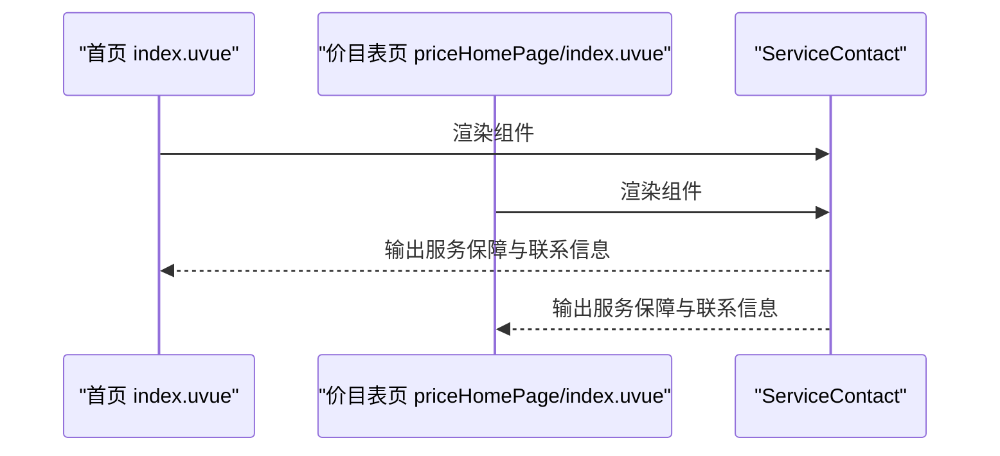
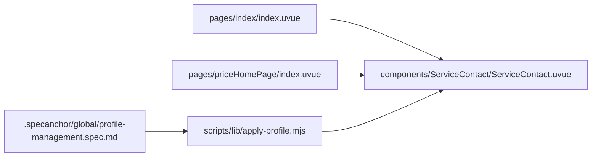

# ServiceContact组件

<cite>
**本文引用的文件**
- [ServiceContact.uvue](file://src/components/ServiceContact/ServiceContact.uvue)
- [index.uvue（首页）](file://src/pages/index/index.uvue)
- [index.uvue（价目表页）](file://src/pages/priceHomePage/index.uvue)
- [apply-profile.mjs](file://scripts/lib/apply-profile.mjs)
- [apply-profile.sh](file://scripts/apply-profile.sh)
- [profile-management.spec.md](file://.specanchor/global/profile-management.spec.md)
</cite>

## 目录
1. [简介](#简介)
2. [项目结构](#项目结构)
3. [核心组件](#核心组件)
4. [架构总览](#架构总览)
5. [详细组件分析](#详细组件分析)
6. [依赖关系分析](#依赖关系分析)
7. [性能与可维护性](#性能与可维护性)
8. [故障排查指南](#故障排查指南)
9. [结论](#结论)
10. [附录](#附录)

## 简介
ServiceContact 是一个用于展示“服务保障”和“联系我们”区块的通用 UI 组件，被首页与价目表页复用。其设计目标包括：
- 收敛重复的底部区块，统一样式与交互。
- 将二维码图片、联系电话、商务合作电话等品牌相关内容由构建期 profile 注入替换，组件内不硬编码品牌信息。
- 保持稳定的 DOM 结构契约，以便脚本通过正则精准替换关键字段。

该组件由模板、脚本与样式三部分组成，并在首页与价目表页中直接引用。

**章节来源**
- [ServiceContact.uvue:1-10](file://src/components/ServiceContact/ServiceContact.uvue#L1-L10)
- [index.uvue（首页）:61-63](file://src/pages/index/index.uvue#L61-L63)
- [index.uvue（价目表页）:16-18](file://src/pages/priceHomePage/index.uvue#L16-L18)

## 项目结构
ServiceContact 位于组件目录，被两个页面使用；构建阶段通过 profile 脚本对组件中的特定位置进行内容替换。

**图表来源**
- [index.uvue（首页）:61-63](file://src/pages/index/index.uvue#L61-L63)
- [index.uvue（价目表页）:16-18](file://src/pages/priceHomePage/index.uvue#L16-L18)
- [apply-profile.mjs:158-173](file://scripts/lib/apply-profile.mjs#L158-L173)
- [apply-profile.sh:89-95](file://scripts/apply-profile.sh#L89-L95)

**章节来源**
- [ServiceContact.uvue:11-63](file://src/components/ServiceContact/ServiceContact.uvue#L11-L63)
- [apply-profile.mjs:158-173](file://scripts/lib/apply-profile.mjs#L158-L173)
- [apply-profile.sh:89-95](file://scripts/apply-profile.sh#L89-L95)

## 核心组件
- 名称：ServiceContact
- 职责：渲染“服务保障列表”和“联系我们（二维码、电话、商务合作）”区块
- 数据：内置服务保障条目列表，按索引渲染序号与分隔线
- 样式：统一的卡片容器、标题分割条、装饰花边、联系方式背景图与排版

组件在模板中定义了稳定结构，供构建期脚本匹配并替换：
- 二维码 image 节点具备 class="code"
- 联系电话与商务合作分别以 <view class="label"> + <view class="val"> 的结构呈现

**章节来源**
- [ServiceContact.uvue:11-63](file://src/components/ServiceContact/ServiceContact.uvue#L11-L63)
- [ServiceContact.uvue:65-83](file://src/components/ServiceContact/ServiceContact.uvue#L65-L83)
- [ServiceContact.uvue:85-213](file://src/components/ServiceContact/ServiceContact.uvue#L85-L213)

## 架构总览
ServiceContact 属于纯展示型组件，无业务逻辑与外部依赖。其内容在构建时通过 profile 注入，运行时仅负责渲染。

**图表来源**
- [apply-profile.sh:89-95](file://scripts/apply-profile.sh#L89-L95)
- [apply-profile.mjs:158-173](file://scripts/lib/apply-profile.mjs#L158-L173)
- [ServiceContact.uvue:46-61](file://src/components/ServiceContact/ServiceContact.uvue#L46-L61)

## 详细组件分析

### 结构与渲染流程
- 顶部标题分割条：左右分割线与中间标题图标组合
- 服务保障区：循环渲染条目，每项包含序号标记与文案，最后一项不显示分隔线
- 联系我们区：背景图 + 二维码 + 联系电话 + 商务合作（可选）

**图表来源**
- [ServiceContact.uvue:11-63](file://src/components/ServiceContact/ServiceContact.uvue#L11-L63)

**章节来源**
- [ServiceContact.uvue:11-63](file://src/components/ServiceContact/ServiceContact.uvue#L11-L63)

### 数据与状态
- data.list：服务保障条目数组，用于 v-for 渲染
- 序号：基于索引生成，便于视觉编号
- 条件渲染：最后一项隐藏分隔线，避免多余线条

复杂度说明：
- 列表渲染时间复杂度 O(n)，n 为条目数量
- 空间复杂度 O(n)，存储列表数据

**章节来源**
- [ServiceContact.uvue:65-83](file://src/components/ServiceContact/ServiceContact.uvue#L65-L83)

### 样式与布局
- 卡片容器：圆角、渐变背景、边框与装饰花边
- 标题分割条：flex 居中，左右分割线固定尺寸
- 联系方式区：背景图铺满，二维码居中，标签与值分行排列
- 响应式单位：大量使用 rpx，适配不同屏幕宽度

注意：
- 样式集中在组件内部，便于复用与独立维护
- 装饰元素通过绝对定位叠加，不影响流式布局

**章节来源**
- [ServiceContact.uvue:85-213](file://src/components/ServiceContact/ServiceContact.uvue#L85-L213)

### Profile 注入机制
构建阶段通过正则替换以下位置：
- 二维码 src：匹配 <image class="code" ... src="...">
- 联系电话：匹配 <view class="label">联系电话</view> + <view class="val">...</view>
- 商务合作（可选）：匹配 <view class="label">商务合作</view> + <view class="val">...</view>

**图表来源**
- [apply-profile.mjs:158-173](file://scripts/lib/apply-profile.mjs#L158-L173)
- [ServiceContact.uvue:46-61](file://src/components/ServiceContact/ServiceContact.uvue#L46-L61)

**章节来源**
- [apply-profile.mjs:158-173](file://scripts/lib/apply-profile.mjs#L158-L173)
- [ServiceContact.uvue:46-61](file://src/components/ServiceContact/ServiceContact.uvue#L46-L61)

### 使用方式
- 首页：在页面模板中引入并渲染 ServiceContact
- 价目表页：同样引入并渲染 ServiceContact

**图表来源**
- [index.uvue（首页）:61-63](file://src/pages/index/index.uvue#L61-L63)
- [index.uvue（价目表页）:16-18](file://src/pages/priceHomePage/index.uvue#L16-L18)

**章节来源**
- [index.uvue（首页）:61-63](file://src/pages/index/index.uvue#L61-L63)
- [index.uvue（价目表页）:16-18](file://src/pages/priceHomePage/index.uvue#L16-L18)

## 依赖关系分析
- 组件自身无外部模块依赖，仅依赖静态资源与样式
- 页面层通过模板语法引入组件
- 构建期依赖 apply-profile.mjs 提供的替换能力
- 规范约束确保 profile 键与注入点一致

**图表来源**
- [index.uvue（首页）:61-63](file://src/pages/index/index.uvue#L61-L63)
- [index.uvue（价目表页）:16-18](file://src/pages/priceHomePage/index.uvue#L16-L18)
- [apply-profile.mjs:158-173](file://scripts/lib/apply-profile.mjs#L158-L173)
- [profile-management.spec.md:31-47](file://.specanchor/global/profile-management.spec.md#L31-L47)

**章节来源**
- [apply-profile.mjs:158-173](file://scripts/lib/apply-profile.mjs#L158-L173)
- [profile-management.spec.md:31-47](file://.specanchor/global/profile-management.spec.md#L31-L47)

## 性能与可维护性
- 渲染性能：列表项较少，v-for 开销可忽略；条件渲染减少不必要的 DOM 节点
- 样式隔离：组件内聚样式，避免全局污染，便于维护
- 可维护性：通过稳定 DOM 契约与 profile 注入，实现内容与样式的解耦
- 扩展性：如需新增联系方式字段，需同时修改组件结构与注入脚本，遵循规范约定

[本节为通用指导，不直接分析具体文件]

## 故障排查指南
常见问题与处理建议：
- 二维码未显示或链接错误
  - 检查构建阶段是否成功替换二维码 src
  - 确认 profile 中 CONTACT_QR_SRC 配置正确
- 联系电话未更新
  - 检查正则匹配是否命中 <view class="label">联系电话</view> + <view class="val">...</view>
  - 若修改了结构，需同步更新 apply-profile.mjs 的正则
- 商务合作未生效
  - 确认 profile 中存在 CONTACT_COOP_TEXT，且不为空
- 构建失败或替换失败
  - 查看 apply-profile.mjs 的错误日志，确认模式匹配成功
  - 校验源码结构未被破坏，保持契约不变

**章节来源**
- [apply-profile.mjs:158-173](file://scripts/lib/apply-profile.mjs#L158-L173)
- [ServiceContact.uvue:46-61](file://src/components/ServiceContact/ServiceContact.uvue#L46-L61)

## 结论
ServiceContact 组件通过清晰的职责划分与稳定的 DOM 契约，实现了“服务保障”与“联系我们”区块的统一化与可配置化。结合 profile 注入机制，能够在多品牌或多环境场景下灵活替换关键内容，提升可维护性与复用性。建议在后续迭代中继续遵守现有规范，确保注入点与正则匹配的一致性。

[本节为总结性内容，不直接分析具体文件]

## 附录
- 构建流程参考：apply-profile.sh 调用 apply-profile.mjs，后者对组件内容进行替换
- 规范参考：profile 必填键与注入点约定，确保一致性

**章节来源**
- [apply-profile.sh:89-95](file://scripts/apply-profile.sh#L89-L95)
- [profile-management.spec.md:31-47](file://.specanchor/global/profile-management.spec.md#L31-L47)