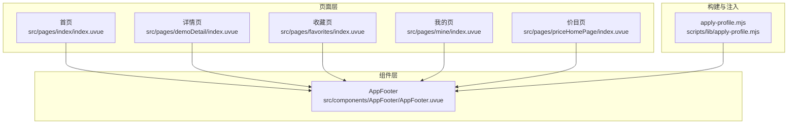
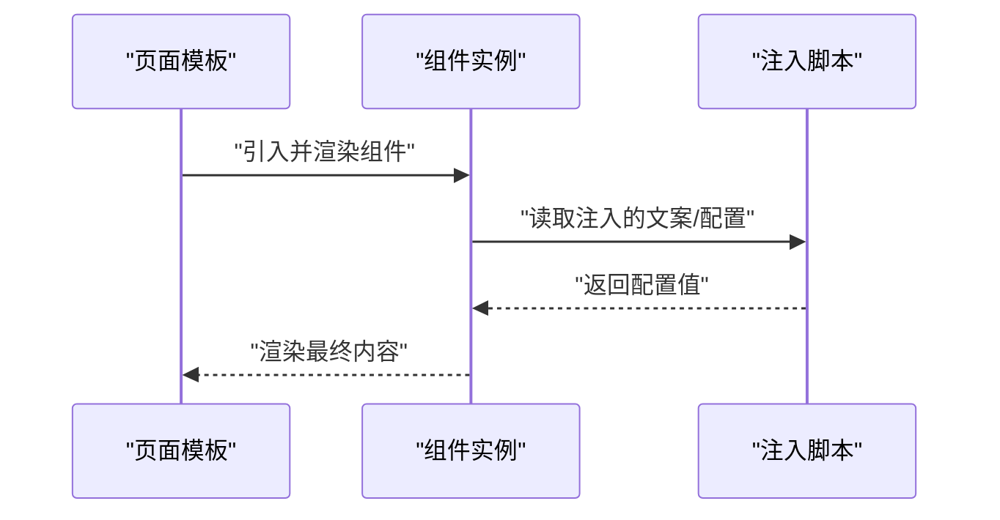
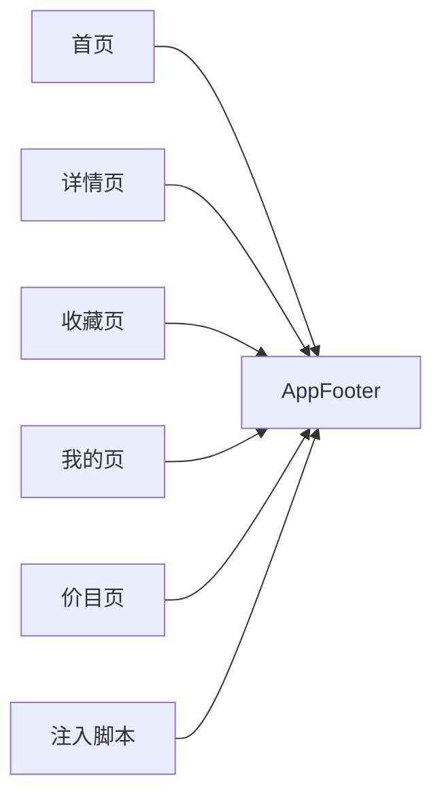

# UI组件系统

<cite>
**本文引用的文件**
- [AppFooter.uvue](file://src/components/AppFooter/AppFooter.uvue)
- [index.uvue（首页）](file://src/pages/index/index.uvue)
- [demoDetail/index.uvue](file://src/pages/demoDetail/index.uvue)
- [favorites/index.uvue](file://src/pages/favorites/index.uvue)
- [mine/index.uvue](file://src/pages/mine/index.uvue)
- [priceHomePage/index.uvue](file://src/pages/priceHomePage/index.uvue)
- [apply-profile.mjs](file://scripts/lib/apply-profile.mjs)
- [_cross-module/2026-05-15_dedup-refactor.spec.md](file://.specanchor/tasks/_cross-module/2026-05-15_dedup-refactor.spec.md)
</cite>

## 目录
1. [简介](#简介)
2. [项目结构](#项目结构)
3. [核心组件](#核心组件)
4. [架构总览](#架构总览)
5. [组件详解](#组件详解)
6. [依赖关系分析](#依赖关系分析)
7. [性能考量](#性能考量)
8. [故障排查指南](#故障排查指南)
9. [结论](#结论)
10. [附录](#附录)

## 简介
本文件面向UI开发者，系统化梳理蓝莓小程序项目的UI组件体系，重点围绕以下组件展开：AppFooter、EmptyState、LoadMoreIndicator、LoginDialog、PhotoGrid、SearchNavBar。文档从设计原则、开发规范、功能与使用方法、props/事件/插槽、样式定制、组合与性能优化、无障碍与跨平台兼容等方面进行说明，并结合仓库现有代码与重构任务记录，给出可操作的最佳实践与扩展建议。

## 项目结构
- 组件集中于 src/components 下，采用“按组件名命名目录”的组织方式，便于复用与维护。
- 页面级模板与样式位于 src/pages 下，页面通过模板与样式直接消费组件或复用通用布局/状态占位。
- 构建与注入脚本位于 scripts/lib/apply-profile.mjs，负责将品牌/文案等配置注入到组件与页面，确保一致性与可替换性。

图表来源
- [AppFooter.uvue:1-25](file://src/components/AppFooter/AppFooter.uvue#L1-L25)
- [index.uvue（首页）:1-37](file://src/pages/index/index.uvue#L1-L37)
- [demoDetail/index.uvue:35-118](file://src/pages/demoDetail/index.uvue#L35-L118)
- [favorites/index.uvue:189-265](file://src/pages/favorites/index.uvue#L189-L265)
- [mine/index.uvue:1-32](file://src/pages/mine/index.uvue#L1-L32)
- [priceHomePage/index.uvue:1-39](file://src/pages/priceHomePage/index.uvue#L1-L39)
- [apply-profile.mjs](file://scripts/lib/apply-profile.mjs)

章节来源
- [AppFooter.uvue:1-25](file://src/components/AppFooter/AppFooter.uvue#L1-L25)
- [index.uvue（首页）:1-37](file://src/pages/index/index.uvue#L1-L37)
- [demoDetail/index.uvue:35-118](file://src/pages/demoDetail/index.uvue#L35-L118)
- [favorites/index.uvue:189-265](file://src/pages/favorites/index.uvue#L189-L265)
- [mine/index.uvue:1-32](file://src/pages/mine/index.uvue#L1-L32)
- [priceHomePage/index.uvue:1-39](file://src/pages/priceHomePage/index.uvue#L1-L39)
- [apply-profile.mjs](file://scripts/lib/apply-profile.mjs)

## 核心组件
本节对六大组件进行分组说明：基础布局与文案组件（AppFooter）、状态占位组件（EmptyState）、加载与分页组件（LoadMoreIndicator）、登录交互组件（LoginDialog）、网格展示组件（PhotoGrid）、搜索导航组件（SearchNavBar）。后续章节将逐一展开。

章节来源
- [AppFooter.uvue:1-25](file://src/components/AppFooter/AppFooter.uvue#L1-L25)
- [_cross-module/2026-05-15_dedup-refactor.spec.md:119-145](file://.specanchor/tasks/_cross-module/2026-05-15_dedup-refactor.spec.md#L119-L145)

## 架构总览
组件与页面之间的调用关系如下：

图表来源
- [AppFooter.uvue:14-23](file://src/components/AppFooter/AppFooter.uvue#L14-L23)
- [apply-profile.mjs](file://scripts/lib/apply-profile.mjs)

## 组件详解

### AppFooter（全局页脚版权文本）
- 设计目标
  - 将多处硬编码的版权字符串收敛到组件的默认 props 中，通过注入脚本统一替换，降低重复与维护成本。
  - 保持渲染为行内文本元素，外层容器样式由各页面保留，确保视觉零变化。
- 功能与使用
  - 作为纯展示组件，接收一个可选的 copyrightText 属性，默认值来自组件自身。
  - 在首页、详情页、收藏页、我的页、价目页等页面中被引入并渲染。
- Props
  - copyrightText: 字符串，用于覆盖默认版权文案。
- 事件与插槽
  - 无事件与插槽。
- 样式与主题
  - 以行内文本形式渲染，具体颜色、字号等由页面容器样式控制。
- 最佳实践
  - 优先通过注入脚本统一替换文案，避免在页面中直接硬编码。
  - 如需局部差异化，可通过 props 覆盖，但应尽量减少差异点。
- 无障碍与跨平台
  - 文本组件无需额外无障碍属性；跨平台兼容性由注入脚本与页面样式共同保障。

章节来源
- [AppFooter.uvue:1-25](file://src/components/AppFooter/AppFooter.uvue#L1-L25)
- [index.uvue（首页）:1-37](file://src/pages/index/index.uvue#L1-L37)
- [demoDetail/index.uvue:35-118](file://src/pages/demoDetail/index.uvue#L35-L118)
- [favorites/index.uvue:189-265](file://src/pages/favorites/index.uvue#L189-L265)
- [mine/index.uvue:1-32](file://src/pages/mine/index.uvue#L1-L32)
- [priceHomePage/index.uvue:1-39](file://src/pages/priceHomePage/index.uvue#L1-L39)
- [apply-profile.mjs](file://scripts/lib/apply-profile.mjs)

### EmptyState（空状态）
- 功能与使用
  - 在无数据或搜索无结果场景下，提供标题与描述的占位提示，提升用户感知与引导性。
  - 在收藏页与详情页的搜索结果为空时被复用。
- Props
  - 无内置 props（当前页面直接使用内联样式与文案）。
- 事件与插槽
  - 无事件与插槽。
- 样式与主题
  - 使用页面内联样式类 empty-state、empty-title、empty-desc 控制布局与视觉。
- 最佳实践
  - 保持文案简洁明确，提供可行的操作引导（如更换关键词）。
  - 与 LoadMoreIndicator 的“已到底”状态区分，避免用户困惑。
- 无障碍与跨平台
  - 文本语义清晰，配合页面整体可访问性策略即可。

章节来源
- [favorites/index.uvue:314-330](file://src/pages/favorites/index.uvue#L314-L330)
- [demoDetail/index.uvue:39-42](file://src/pages/demoDetail/index.uvue#L39-L42)

### LoadMoreIndicator（加载更多指示器）
- 功能与使用
  - 在搜索或分页场景中，提供“加载更多/已到底”的状态提示与交互入口。
  - 支持点击触发加载更多与滚动触底触发两种方式。
- 事件与交互
  - 提供点击回调（如 loadMoreSearch）与 onReachBottom 生命周期联动。
- 状态管理
  - 通过 loading、noMore、loadingMore 等布尔标志控制显示逻辑。
- 最佳实践
  - 区分“点击加载更多”与“触底加载”，避免重复触发。
  - 在数据不足一页时隐藏“加载更多”按钮，减少误操作。
- 无障碍与跨平台
  - 按钮具备可点击语义，建议补充 aria-label 或替代文案以增强可访问性。

章节来源
- [demoDetail/index.uvue:67-72](file://src/pages/demoDetail/index.uvue#L67-L72)
- [demoDetail/index.uvue:266-275](file://src/pages/demoDetail/index.uvue#L266-L275)
- [favorites/index.uvue:193-218](file://src/pages/favorites/index.uvue#L193-L218)

### LoginDialog（登录弹窗）
- 功能与使用
  - 在用户需要登录才能执行某些操作（如点赞）时弹出登录确认与协议勾选。
  - 在“我的”页中作为登录弹窗使用，在多个页面中复用登录流程。
- 事件与交互
  - 打开/关闭弹窗、勾选协议、跳转协议页面、完成登录后的回调。
- 最佳实践
  - 登录前要求用户同意协议，避免后续争议。
  - 登录完成后刷新页面状态，确保 UI 与数据一致。
- 无障碍与跨平台
  - 弹窗需具备焦点管理与键盘可达性；协议链接应可被屏幕阅读器识别。

章节来源
- [mine/index.uvue:258-291](file://src/pages/mine/index.uvue#L258-L291)
- [_cross-module/2026-05-15_dedup-refactor.spec.md:119-145](file://.specanchor/tasks/_cross-module/2026-05-15_dedup-refactor.spec.md#L119-L145)

### PhotoGrid（照片网格）
- 功能与使用
  - 以网格形式展示图片列表，支持点击进入详情、展示点赞状态与数量等。
  - 在首页、价目页、收藏页等页面中复用，保持一致的视觉与交互体验。
- 事件与交互
  - 点击网格项触发详情跳转；点击点赞区域触发收藏/取消收藏。
- 最佳实践
  - 图片懒加载与预加载结合，提升首屏与滚动性能。
  - 点赞状态与后端保持一致，避免 UI 与数据不一致。
- 无障碍与跨平台
  - 为图片提供替代文本；为操作区域提供可访问名称。

章节来源
- [index.uvue（首页）:25-37](file://src/pages/index/index.uvue#L25-L37)
- [priceHomePage/index.uvue:16-27](file://src/pages/priceHomePage/index.uvue#L16-L27)
- [favorites/index.uvue:231-238](file://src/pages/favorites/index.uvue#L231-L238)

### SearchNavBar（搜索导航栏）
- 功能与使用
  - 提供搜索输入与返回按钮，支持自定义样式与交互。
  - 在收藏页等页面中复用，保持一致的导航体验。
- 事件与交互
  - 返回按钮点击、搜索输入变更、搜索提交等。
- 样式与主题
  - 使用页面内联样式类 custom-nav、nav-content、search-bar-nav 等控制外观。
- 最佳实践
  - 输入框聚焦态与键盘行为需在不同平台下测试一致。
  - 搜索结果为空时与 EmptyState 协同展示。
- 无障碍与跨平台
  - 输入框具备可访问名称与占位符；返回按钮具备可访问标签。

章节来源
- [favorites/index.uvue:267-308](file://src/pages/favorites/index.uvue#L267-L308)

## 依赖关系分析
- 组件与页面的耦合度低：页面通过模板引入组件，组件不反向依赖页面。
- 注入脚本与组件的耦合：AppFooter 的文案由注入脚本提供，确保全局一致性。
- 业务逻辑与视图分离：加载更多、登录弹窗等交互逻辑集中在页面或工具模块，组件专注渲染。

图表来源
- [AppFooter.uvue:14-23](file://src/components/AppFooter/AppFooter.uvue#L14-L23)
- [index.uvue（首页）:1-37](file://src/pages/index/index.uvue#L1-L37)
- [demoDetail/index.uvue:35-118](file://src/pages/demoDetail/index.uvue#L35-L118)
- [favorites/index.uvue:189-265](file://src/pages/favorites/index.uvue#L189-L265)
- [mine/index.uvue:1-32](file://src/pages/mine/index.uvue#L1-L32)
- [priceHomePage/index.uvue:1-39](file://src/pages/priceHomePage/index.uvue#L1-L39)
- [apply-profile.mjs](file://scripts/lib/apply-profile.mjs)

章节来源
- [AppFooter.uvue:1-25](file://src/components/AppFooter/AppFooter.uvue#L1-L25)
- [apply-profile.mjs](file://scripts/lib/apply-profile.mjs)

## 性能考量
- 图片加载优化
  - 使用懒加载与预加载策略，减少首屏阻塞与滚动抖动。
  - 对大图采用合适的尺寸与压缩策略，避免内存占用过高。
- 事件节流与防抖
  - 滚动触底加载与搜索请求需做去抖处理，避免频繁请求。
- 状态与渲染
  - 将计算属性与异步方法拆分，避免不必要的重渲染。
- 缓存与复用
  - 对搜索结果与分页数据进行缓存，减少重复请求。
- 内存管理
  - 页面切换时及时清理定时器与监听器，避免内存泄漏。

## 故障排查指南
- 版权文案未生效
  - 检查注入脚本是否正确执行，以及组件 props 是否被覆盖。
- 加载更多不触发
  - 检查 noMore、loadingMore 标志位与页面 onReachBottom 逻辑。
- 登录弹窗无法关闭
  - 检查弹窗状态与关闭回调是否正确绑定。
- 网格图片显示异常
  - 检查图片地址、懒加载配置与容器尺寸。

章节来源
- [AppFooter.uvue:14-23](file://src/components/AppFooter/AppFooter.uvue#L14-L23)
- [demoDetail/index.uvue:193-218](file://src/pages/demoDetail/index.uvue#L193-L218)
- [mine/index.uvue:271-275](file://src/pages/mine/index.uvue#L271-L275)
- [index.uvue（首页）:1-37](file://src/pages/index/index.uvue#L1-L37)

## 结论
本UI组件系统通过“组件+注入脚本+页面模板”的分层设计，实现了全局文案一致性、交互复用与页面解耦。建议在后续迭代中：
- 将 EmptyState、LoadMoreIndicator、LoginDialog、PhotoGrid、SearchNavBar 等组件标准化为独立包，完善 props/事件/插槽定义与文档。
- 引入单元测试与可视化回归测试，保障跨平台一致性。
- 建立组件主题与无障碍规范，提升可访问性与可维护性。

## 附录
- 全局样式与响应式
  - 使用 rpx 与相对单位适配多设备；通过容器与 Flex 布局实现响应式。
- 无障碍与跨平台
  - 为关键交互元素提供可访问名称与状态提示；在不同平台下测试键盘导航与语音朗读。
- 自定义扩展
  - 通过 props 覆盖默认行为，通过事件回调扩展交互；必要时引入插槽以支持更灵活的布局。