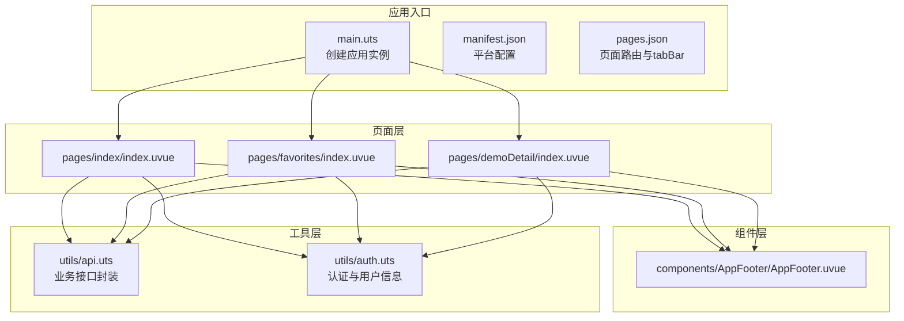
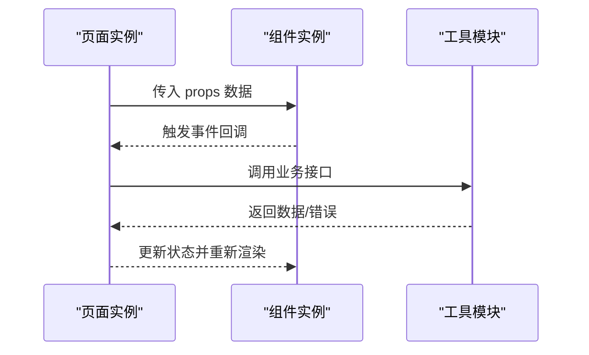
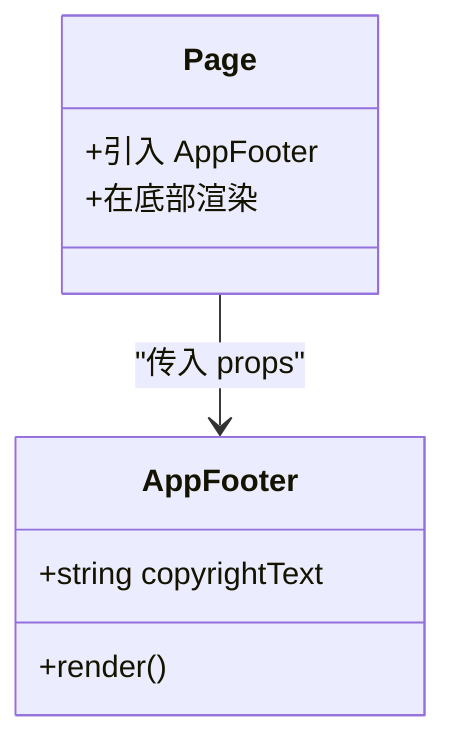
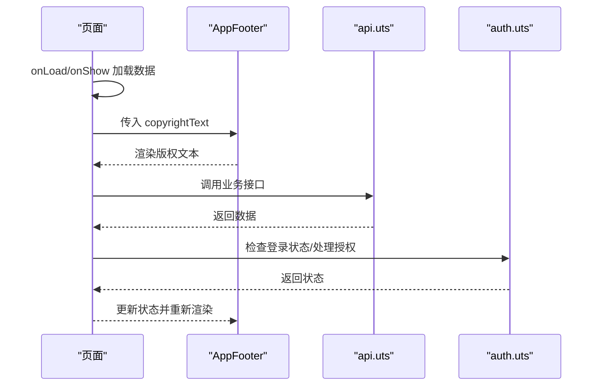
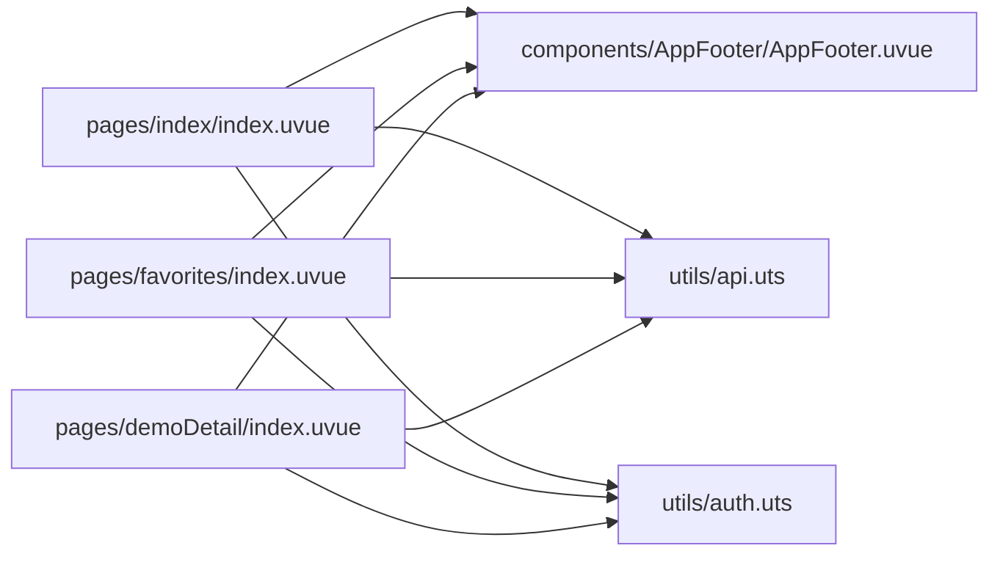

# 组件设计原则与规范

<cite>
**本文引用的文件**
- [AppFooter.uvue](file://src/components/AppFooter/AppFooter.uvue)
- [index.uvue](file://src/pages/index/index.uvue)
- [favorites/index.uvue](file://src/pages/favorites/index.uvue)
- [demoDetail/index.uvue](file://src/pages/demoDetail/index.uvue)
- [main.uts](file://src/main.uts)
- [manifest.json](file://src/manifest.json)
- [pages.json](file://src/pages.json)
- [api.uts](file://src/utils/api.uts)
- [auth.uts](file://src/utils/auth.uts)
- [package.json](file://package.json)
- [vite.config.ts](file://vite.config.ts)
- [tsconfig.json](file://tsconfig.json)
</cite>

## 目录
1. [简介](#简介)
2. [项目结构](#项目结构)
3. [核心组件](#核心组件)
4. [架构总览](#架构总览)
5. [详细组件分析](#详细组件分析)
6. [依赖关系分析](#依赖关系分析)
7. [性能考虑](#性能考虑)
8. [故障排查指南](#故障排查指南)
9. [结论](#结论)
10. [附录](#附录)

## 简介
本规范面向蓝莓小程序项目的UI组件设计与开发，旨在建立统一的设计原则、命名规范、文件组织结构、样式管理策略与最佳实践，确保组件具备单一职责、高可复用性、接口一致性，并能在不同页面中稳定使用。同时提供生命周期管理、性能优化与调试技巧，形成完整的质量保证体系。

## 项目结构
项目采用基于功能域的目录组织方式，页面与组件分离，工具函数集中于 utils，入口与构建配置位于根目录。页面通过 import 方式引入组件并在模板中渲染；组件以独立文件形式存在，便于复用与维护。

图表来源
- [main.uts:1-9](file://src/main.uts#L1-L9)
- [manifest.json:1-73](file://src/manifest.json#L1-L73)
- [pages.json:1-90](file://src/pages.json#L1-L90)
- [AppFooter.uvue:1-25](file://src/components/AppFooter/AppFooter.uvue#L1-L25)
- [index.uvue:1-432](file://src/pages/index/index.uvue#L1-L432)
- [favorites/index.uvue:1-406](file://src/pages/favorites/index.uvue#L1-L406)
- [demoDetail/index.uvue:1-897](file://src/pages/demoDetail/index.uvue#L1-L897)
- [api.uts:1-312](file://src/utils/api.uts#L1-L312)
- [auth.uts:1-149](file://src/utils/auth.uts#L1-L149)

章节来源
- [main.uts:1-9](file://src/main.uts#L1-L9)
- [manifest.json:1-73](file://src/manifest.json#L1-L73)
- [pages.json:1-90](file://src/pages.json#L1-L90)

## 核心组件
- AppFooter：全局页脚版权文本组件，通过 props 接收文案，渲染为行内文本，保证视觉一致性与可配置性。
- 页面级组件：各页面通过 import 引入 AppFooter 并在底部区域渲染，实现跨页复用与统一风格。

章节来源
- [AppFooter.uvue:1-25](file://src/components/AppFooter/AppFooter.uvue#L1-L25)
- [index.uvue:54-56](file://src/pages/index/index.uvue#L54-L56)
- [favorites/index.uvue:70-74](file://src/pages/favorites/index.uvue#L70-L74)
- [demoDetail/index.uvue:131-134](file://src/pages/demoDetail/index.uvue#L131-L134)

## 架构总览
组件与页面的关系遵循“页面组合组件”的模式：页面负责业务流程与状态管理，组件负责UI呈现与交互细节。页面通过 props 向组件传递数据，组件通过事件向上反馈状态变更。

图表来源
- [index.uvue:111-310](file://src/pages/index/index.uvue#L111-L310)
- [favorites/index.uvue:78-244](file://src/pages/favorites/index.uvue#L78-L244)
- [demoDetail/index.uvue:189-708](file://src/pages/demoDetail/index.uvue#L189-L708)
- [api.uts:1-312](file://src/utils/api.uts#L1-L312)
- [auth.uts:1-149](file://src/utils/auth.uts#L1-L149)

## 详细组件分析

### AppFooter 组件
- 设计目标
  - 将多处硬编码的版权文案收敛到组件默认 props，通过配置脚本统一替换，降低维护成本。
  - 渲染为行内文本，外层容器由页面保留，保证视觉零变化。
- 接口设计
  - 单一 props：copyrightText（String，默认值包含版权信息）。
- 使用方式
  - 在页面底部区域直接引入并渲染，无需额外逻辑。
- 可扩展性
  - 如需支持多语言或动态文案，可在 props 中增加 i18nKey 或通过外部注入。

图表来源
- [AppFooter.uvue:14-23](file://src/components/AppFooter/AppFooter.uvue#L14-L23)
- [index.uvue:54-56](file://src/pages/index/index.uvue#L54-L56)
- [favorites/index.uvue:70-74](file://src/pages/favorites/index.uvue#L70-L74)
- [demoDetail/index.uvue:131-134](file://src/pages/demoDetail/index.uvue#L131-L134)

章节来源
- [AppFooter.uvue:1-25](file://src/components/AppFooter/AppFooter.uvue#L1-L25)

### 页面与组件的协作流程
- 页面加载与数据准备
  - 页面在 onLoad/onShow 生命周期中并行加载必要数据，减少首屏等待时间。
  - 使用骨架屏提升感知性能。
- 组件渲染与交互
  - 页面向组件传递数据（如版权文案），组件负责渲染与最小化交互。
  - 组件通过事件向上反馈，页面统一处理业务逻辑。
- 登录与授权流程
  - 页面在需要时弹出登录弹窗，授权成功后继续之前的操作（如点赞、完善资料）。

图表来源
- [index.uvue:139-308](file://src/pages/index/index.uvue#L139-L308)
- [favorites/index.uvue:101-243](file://src/pages/favorites/index.uvue#L101-L243)
- [demoDetail/index.uvue:253-706](file://src/pages/demoDetail/index.uvue#L253-L706)
- [AppFooter.uvue:14-23](file://src/components/AppFooter/AppFooter.uvue#L14-L23)
- [api.uts:1-312](file://src/utils/api.uts#L1-L312)
- [auth.uts:1-149](file://src/utils/auth.uts#L1-L149)

章节来源
- [index.uvue:1-432](file://src/pages/index/index.uvue#L1-L432)
- [favorites/index.uvue:1-406](file://src/pages/favorites/index.uvue#L1-L406)
- [demoDetail/index.uvue:1-897](file://src/pages/demoDetail/index.uvue#L1-L897)

## 依赖关系分析
- 页面依赖
  - 页面通过 import 引入组件与工具模块，形成单向依赖链。
- 组件依赖
  - 组件尽量保持无副作用，仅依赖 props 与内部状态，避免直接访问全局状态。
- 工具模块
  - api.uts 封装网络请求，auth.uts 管理认证状态，二者被页面与组件间接使用。

图表来源
- [index.uvue:111-116](file://src/pages/index/index.uvue#L111-L116)
- [favorites/index.uvue:78-80](file://src/pages/favorites/index.uvue#L78-L80)
- [demoDetail/index.uvue:189-201](file://src/pages/demoDetail/index.uvue#L189-L201)
- [AppFooter.uvue:14-23](file://src/components/AppFooter/AppFooter.uvue#L14-L23)
- [api.uts:1-312](file://src/utils/api.uts#L1-L312)
- [auth.uts:1-149](file://src/utils/auth.uts#L1-L149)

章节来源
- [index.uvue:1-432](file://src/pages/index/index.uvue#L1-L432)
- [favorites/index.uvue:1-406](file://src/pages/favorites/index.uvue#L1-L406)
- [demoDetail/index.uvue:1-897](file://src/pages/demoDetail/index.uvue#L1-L897)

## 性能考虑
- 骨架屏与首屏优化
  - 页面在数据加载期间显示骨架屏，减少白屏时间，提升感知性能。
- 并行加载
  - 页面在 onLoad 中并行请求多个接口，缩短首屏时间。
- 图片预加载
  - 页面在合适时机预加载首屏图片，避免首屏闪烁。
- 列表分页与懒加载
  - 收藏页与客片页在搜索模式下启用分页，触底加载更多，避免一次性渲染大量数据。
- 样式与布局
  - 使用 calc 与 flex 布局，减少复杂计算，提高渲染效率。
- 构建与运行时
  - 使用 Vite 插件与 TypeScript 配置，确保类型安全与快速构建。

章节来源
- [index.uvue:3-12](file://src/pages/index/index.uvue#L3-L12)
- [favorites/index.uvue:25-30](file://src/pages/favorites/index.uvue#L25-L30)
- [demoDetail/index.uvue:25-33](file://src/pages/demoDetail/index.uvue#L25-L33)
- [index.uvue:140-157](file://src/pages/index/index.uvue#L140-L157)
- [demoDetail/index.uvue:331-342](file://src/pages/demoDetail/index.uvue#L331-L342)
- [vite.config.ts:1-9](file://vite.config.ts#L1-L9)
- [tsconfig.json:1-33](file://tsconfig.json#L1-L33)

## 故障排查指南
- 登录与授权问题
  - 检查登录弹窗是否正确弹出，授权回调是否触发，错误信息是否通过 Toast 展示。
  - 若授权失败，查看 detail.errMsg 并给出明确提示。
- 数据加载异常
  - 页面在加载失败时捕获异常并提示用户，避免崩溃。
  - 对接口返回进行健壮性判断，防止空数据导致渲染异常。
- 点赞与收藏状态
  - 登录用户在 onShow 时刷新点赞状态，非登录用户引导登录。
  - 点赞失败时提示用户并记录日志。
- 样式与布局问题
  - 检查页面底部容器是否正确设置 margin-top: auto，确保页脚固定在底部。
  - 确认自定义导航栏高度与系统状态栏高度一致。

章节来源
- [index.uvue:181-234](file://src/pages/index/index.uvue#L181-L234)
- [favorites/index.uvue:132-154](file://src/pages/favorites/index.uvue#L132-L154)
- [demoDetail/index.uvue:478-542](file://src/pages/demoDetail/index.uvue#L478-L542)
- [demoDetail/index.uvue:543-705](file://src/pages/demoDetail/index.uvue#L543-L705)

## 结论
通过统一的组件设计原则与开发规范，蓝莓小程序实现了高内聚、低耦合的组件体系。组件以单一职责为核心，配合清晰的 props 接口与事件机制，在页面间实现稳定复用。结合并行加载、骨架屏、分页与预加载等性能策略，显著提升了用户体验。建议持续完善组件文档与测试用例，确保长期演进中的质量与一致性。

## 附录

### 组件化开发核心理念
- 单一职责：组件只负责一个功能领域，避免“上帝组件”。
- 可复用性：通过 props 与事件解耦，支持在多页面中灵活使用。
- 接口一致性：统一 props 命名与默认值，保持行为一致。
- 最小依赖：组件内部尽量不访问全局状态，通过 props 注入所需数据。

### 命名规范
- 组件文件：采用 PascalCase 命名（如 AppFooter），目录与文件名一致。
- Props：使用 camelCase，提供合理默认值。
- 事件：使用 kebab-case，语义明确（如 close-popup）。

### 文件组织结构
- 组件：src/components/<组件名>/<组件名>.uvue
- 页面：src/pages/<页面路径>/index.uvue
- 工具：src/utils/*.uts

### 样式管理策略
- 页面样式：在页面 uvue 的 style 区域定义，避免全局污染。
- 组件样式：组件内部样式隔离，必要时通过类名与页面配合。
- 布局：优先使用 Flex 与 calc，减少复杂选择器。

### 组件与页面的关系
- 页面负责业务流程与状态管理，组件负责 UI 呈现与交互细节。
- 页面通过 import 引入组件并在模板中渲染，向组件传递 props。
- 组件通过事件向上反馈，页面统一处理业务逻辑。

### props 设计、事件处理与插槽使用
- props 设计：类型明确、提供默认值、避免过度嵌套。
- 事件处理：使用 $emit 触发事件，页面统一接收并处理。
- 插槽使用：在需要高度定制的场景使用具名插槽，但需控制数量与复杂度。

### 生命周期管理
- 页面：onLoad/onShow/onReachBottom 等生命周期按需使用，避免冗余请求。
- 组件：尽量无状态，必要时使用 data/computed/watch 管理内部状态。

### 性能优化策略
- 骨架屏与首屏优化：在数据加载期间显示骨架屏。
- 并行加载：在 onLoad 中并行请求多个接口。
- 图片预加载：在合适时机预加载首屏图片。
- 列表分页与懒加载：触底加载更多，避免一次性渲染大量数据。
- 样式与布局：使用 calc 与 flex 布局，减少复杂计算。

### 调试技巧
- 使用 uni.showToast 输出关键信息，便于定位问题。
- 在关键流程添加日志输出，记录请求参数与返回结果。
- 对接口返回进行健壮性判断，防止空数据导致渲染异常。