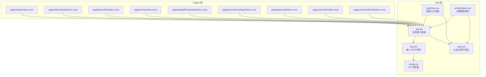
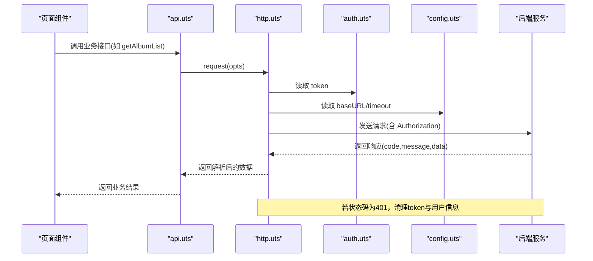
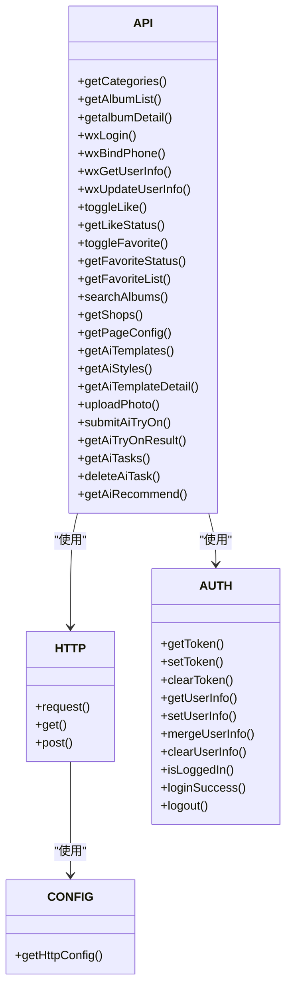

# API接口封装层

<cite>
**本文档引用的文件**
- [api.uts](file://src/utils/api.uts)
- [http.uts](file://src/utils/http.uts)
- [auth.uts](file://src/utils/auth.uts)
- [config.uts](file://src/utils/config.uts)
- [loginFlow.uts](file://src/utils/loginFlow.uts)
- [profileSubmit.uts](file://src/utils/profileSubmit.uts)
- [index.uvue](file://src/pages/index/index.uvue)
- [demoDetail.uvue](file://src/pages/demoDetail/index.uvue)
- [favorites.uvue](file://src/pages/favorites/index.uvue)
- [mine.uvue](file://src/pages/mine/index.uvue)
- [targetPhotoDetail.uvue](file://src/pages/targetPhotoDetail/index.uvue)
- [priceHomePage.uvue](file://src/pages/priceHomePage/index.uvue)
- [priceList.uvue](file://src/pages/priceList/index.uvue)
- [aiTryOn.uvue](file://src/pages/aiTryOn/index.uvue)
- [aiTryOnResult.uvue](file://src/pages/aiTryOnResult/index.uvue)
</cite>

## 目录
1. [简介](#简介)
2. [项目结构](#项目结构)
3. [核心组件](#核心组件)
4. [架构总览](#架构总览)
5. [详细组件分析](#详细组件分析)
6. [AI试衣功能模块](#ai试衣功能模块)
7. [依赖关系分析](#依赖关系分析)
8. [性能考虑](#性能考虑)
9. [故障排除指南](#故障排除指南)
10. [结论](#结论)
11. [附录](#附录)

## 简介
本文件系统性梳理了 API 接口封装层的设计与实现，重点围绕 src/utils/api.uts 模块展开，涵盖以下方面：
- 接口分类体系：客片管理、用户认证、社交互动、搜索功能、店铺管理、页面配置、**AI试衣功能**
- 数据模型定义：AlbumBasic、ShopInfo、**AiTemplate** 等接口类型及其字段语义
- 接口函数的参数定义、返回值类型与错误处理机制
- 最佳实践：参数校验、错误码处理、响应数据结构
- 使用示例与常见问题解决方案

该封装层通过统一的 HTTP 层（http.uts）进行网络请求，自动注入认证头与基础配置，并在需要时进行 401 未授权处理。**新增的AI试衣功能模块提供了完整的虚拟试衣解决方案，包括模板管理、照片上传、任务提交和结果查询等核心功能。**

## 项目结构
API 封装层位于 src/utils 目录下，核心文件如下：
- api.uts：对外暴露的业务接口集合，包含客片、认证、社交、搜索、店铺、页面配置、**AI试衣**等接口
- http.uts：统一的 HTTP 请求封装，负责 URL 拼接、头部注入、超时控制、401 处理
- auth.uts：认证状态与用户信息管理，提供 token 与用户信息的存储、读取、合并写入
- config.uts：HTTP 基础配置（baseURL、timeout）
- loginFlow.uts：登录三步流程封装（静默登录 -> 微信登录 -> 绑定手机号）
- profileSubmit.uts：头像/昵称提交封装（调用更新接口并合并用户信息）

**图表来源**
- [api.uts:1-503](file://src/utils/api.uts#L1-L503)
- [http.uts:1-82](file://src/utils/http.uts#L1-L82)
- [auth.uts:1-149](file://src/utils/auth.uts#L1-L149)
- [config.uts:1-12](file://src/utils/config.uts#L1-L12)
- [loginFlow.uts:1-71](file://src/utils/loginFlow.uts#L1-L71)
- [profileSubmit.uts:1-37](file://src/utils/profileSubmit.uts#L1-L37)

**章节来源**
- [api.uts:1-503](file://src/utils/api.uts#L1-L503)
- [http.uts:1-82](file://src/utils/http.uts#L1-L82)
- [auth.uts:1-149](file://src/utils/auth.uts#L1-L149)
- [config.uts:1-12](file://src/utils/config.uts#L1-L12)

## 核心组件
本节聚焦 api.uts 的核心接口与数据模型，说明其职责、参数、返回值与错误处理策略。

- 数据模型
  - AlbumBasic：客片基础信息，包含标识、标题、封面图、所属店铺、价格、点赞数等
  - ShopInfo：店铺信息，包含标识、名称、展示名、排序等
  - UserInfo：用户信息，包含标识、开放平台标识、手机号、昵称、头像等
  - **AiTemplate：AI试衣模板信息，包含模板ID、风格名称、类别、性别、图片URL等**

- 接口分类与职责
  - 客片管理：分类与列表获取、详情获取、点赞/取消点赞、批量查询点赞状态、收藏/取消收藏、批量查询收藏状态、我的收藏列表
  - 用户认证：微信登录、绑定手机号、获取/更新用户信息
  - 搜索功能：相册模糊搜索（公开接口，支持分页）
  - 店铺管理：获取启用的店铺列表
  - 页面配置：获取中台页配置（金刚区+Banner）
  - **AI试衣功能：模板管理、照片上传、任务提交、结果查询、历史记录管理**

- 错误处理机制
  - 统一返回结构：包含 code、message、data 字段
  - 成功码：通常为 0 或 200
  - **AI试衣接口特殊处理：aiface 接口成功 code === 0，非 200**
  - 未授权（401）：http.uts 自动清理 token 与用户信息并提示重新登录
  - 参数校验：调用方需确保必填参数存在，如 shopId、albumId 等

**章节来源**
- [api.uts:6-326](file://src/utils/api.uts#L6-L326)
- [http.uts:48-61](file://src/utils/http.uts#L48-L61)

## 架构总览
API 封装层采用"接口层 + HTTP 层 + 认证层"的分层设计：
- 接口层（api.uts）：面向业务的高层封装，屏蔽底层细节
- HTTP 层（http.uts）：统一请求构建、头部注入、超时控制、401 处理
- 认证层（auth.uts）：token 与用户信息的持久化与合并写入
- 配置层（config.uts）：HTTP 基础配置（baseURL、timeout）

**图表来源**
- [api.uts:86-111](file://src/utils/api.uts#L86-L111)
- [http.uts:20-73](file://src/utils/http.uts#L20-L73)
- [auth.uts:21-52](file://src/utils/auth.uts#L21-L52)
- [config.uts:7-11](file://src/utils/config.uts#L7-L11)

## 详细组件分析

### 数据模型定义
- AlbumBasic
  - 字段含义：客片标识、标题、封面图地址、所属店铺标识、价格、点赞数
  - 数据类型：id、shopId 为数字；title、coverImageUrl 为字符串；price 为数字；likeCount 为数字
  - 可选属性：price
- ShopInfo
  - 字段含义：店铺标识、店铺名称、展示名（中/英）、首页图、价格图、排序
  - 数据类型：id、sortOrder 为数字；shopName、displayName、displayNameEn、homeImage、priceImage 为字符串
- UserInfo
  - 字段含义：用户标识、开放平台标识、手机号（可空）、昵称（可空）、头像地址（可空）
  - 数据类型：id 为数字；openid 为字符串；phone、nickname、avatarUrl 为可空字符串
- **AiTemplate**
  - 字段含义：AI试衣模板标识、风格名称、类别、套餐类型、子类别、性别、图片URL、场景描述、激活状态
  - 数据类型：id、is_active 为数字；style_name、category、package_type、sub_category、gender、image_url、scene_prompt 为字符串

**章节来源**
- [api.uts:6-326](file://src/utils/api.uts#L6-L326)
- [auth.uts:7-13](file://src/utils/auth.uts#L7-L13)

### 客片管理接口
- getCategories
  - 参数：shopId（必填，类型：string | number）
  - 返回：分类树结构（父级、子级、查询参数透传）
  - 错误处理：非 200/0 视为失败，需在调用方判断并降级
- getAlbumList
  - 参数：shopId（必填）、其余参数由子分类 query 对象透传（如 parentId/childId/subName 等）、keyword（可选）、page（可选）、size（可选）
  - 返回：分页数据（albums、total、page、size）
  - 错误处理：非 200/0 视为失败，调用方可清空列表并提示
- getalbumDetail
  - 参数：method、params
  - 返回：详情数据
  - 注意：此接口已废弃，建议使用新的分类+列表组合方案

最佳实践
- 在页面初始化时先获取分类，再根据选中的子分类查询列表
- 搜索场景复用 getAlbumList，传入 keyword 参数
- 分页加载时拼接 query 对象与分页参数

**章节来源**
- [api.uts:55-122](file://src/utils/api.uts#L55-L122)
- [demoDetail.uvue:304-477](file://src/pages/demoDetail/index.uvue#L304-L477)

### 用户认证接口
- wxLogin
  - 参数：code（必填）、nickname（可选）、avatarUrl（可选）
  - 返回：{ code, message, data: { token, userInfo } }
  - 错误处理：非 200 视为失败，调用方可提示错误并引导重试
- wxBindPhone
  - 参数：code（必填）
  - 返回：{ code, message, data: UserInfo }
  - 错误处理：非 200 视为失败，调用方可提示错误
- wxGetUserInfo
  - 返回：{ code, message, data: UserInfo }
- wxUpdateUserInfo
  - 参数：nickname（可选）、avatarUrl（可选，至少传一项）
  - 返回：{ code, message, data: UserInfo }
  - 实现要点：仅传递非空字段，避免覆盖后端已有值

登录流程封装
- runPhoneLogin：封装静默登录 -> 微信登录 -> 绑定手机号的三步流程，返回标准化结果
- submitUserProfile：封装头像/昵称提交并合并用户信息

**章节来源**
- [api.uts:129-190](file://src/utils/api.uts#L129-L190)
- [loginFlow.uts:27-70](file://src/utils/loginFlow.uts#L27-L70)
- [profileSubmit.uts:18-36](file://src/utils/profileSubmit.uts#L18-L36)

### 社交互动接口
- toggleLike
  - 参数：albumId（必填）
  - 返回：{ code, data: { liked: boolean, likeCount: number } }
- getLikeStatus
  - 参数：albumIds（逗号分隔的字符串）
  - 返回：批量点赞状态数组
- toggleFavorite
  - 参数：albumId（必填）
  - 返回：{ code, data: { favorited: boolean } }
- getFavoriteStatus
  - 参数：albumIds（逗号分隔的字符串）
  - 返回：批量收藏状态数组
- getFavoriteList
  - 参数：shopId（可选）
  - 返回：收藏列表（AlbumBasic[]）

最佳实践
- 登录状态下定期刷新点赞/收藏状态
- 批量查询接口一次传入多个 ID，减少请求次数

**章节来源**
- [api.uts:197-259](file://src/utils/api.uts#L197-L259)

### 搜索功能接口
- searchAlbums
  - 参数：keyword（必填）、page（默认 1）、size（默认 10）
  - 返回：{ code, data: { list: AlbumBasic[], total, page, pageSize, totalPages } }
  - 适用场景：收藏页的搜索与分页加载

最佳实践
- 搜索前清理状态，搜索完成后计算 totalPages 并更新列表
- 加载更多时递增 page 并拼接结果

**章节来源**
- [api.uts:275-283](file://src/utils/api.uts#L275-L283)
- [favorites.uvue:169-218](file://src/pages/favorites/index.uvue#L169-L218)

### 店铺管理接口
- getShops
  - 返回：启用的店铺列表（ShopInfo[]）

最佳实践
- 首页并行加载轮播图与店铺列表，提升首屏体验

**章节来源**
- [api.uts:290-297](file://src/utils/api.uts#L290-L297)
- [index.uvue:142-151](file://src/pages/index/index.uvue#L142-L151)

### 页面配置接口
- getPageConfig
  - 返回：{ code, data: { menuItems: any[], banners: any[] } }

最佳实践
- 作为首页或中台页的静态配置数据源

**章节来源**
- [api.uts:304-311](file://src/utils/api.uts#L304-L311)
- [mine.uvue:137-137](file://src/pages/mine/index.uvue#L137-L137)

## AI试衣功能模块

### 数据模型定义
- **AiTemplate**
  - 字段含义：AI试衣模板标识、风格名称、类别、套餐类型、子类别、性别、图片URL、场景描述、激活状态
  - 数据类型：id、is_active 为数字；style_name、category、package_type、sub_category、gender、image_url、scene_prompt 为字符串
  - 可选属性：无

### AI试衣模板管理接口
- **getAiTemplates**
  - 参数：style（可选）、keyword（可选）、category（可选）、package_type（可选）、sub_category（可选）、**shop_id（可选，类型：string）**、gender（可选）
  - 返回：{ code: number; message: string; data: AiTemplate[] }
  - 错误处理：code === 0 表示成功，其他值表示失败
  - 适用场景：获取可用的AI试衣模板列表
  - **更新**：shop_id 参数类型从 number 改为 string，以匹配页面传参方式
- **getAiStyles**
  - 参数：category（可选）、package_type（可选）、sub_category（可选）、**shop_id（可选，类型：number）**
  - 返回：{ code: number; message: string; data: Array<{ style_name: string; count: number; cover_url: string }> }
  - 错误处理：code === 0 表示成功
  - 适用场景：获取AI试衣风格分组信息
  - **更新**：shop_id 参数类型保持 number 类型，与任务提交接口一致
- **getAiTemplateDetail**
  - 参数：id（必填）
  - 返回：{ code: number; message: string; data: AiTemplate }
  - 错误处理：code === 0 表示成功

### 照片上传接口
- **uploadPhoto**
  - 参数：filePath（必填，本地文件路径）
  - 返回：Promise<{ code: number; message: string; data: { file_url: string; filename: string } }>
  - 特殊处理：使用 uni.uploadFile 直接上传，不通过 request 函数
  - 认证要求：需登录状态（Authorization 头部包含 Bearer token）
  - 文件限制：大小不超过10MB
  - 错误处理：code === 0 表示成功

### AI试衣任务接口
- **submitAiTryOn**
  - 参数：templateId（必填）、userPhotoFilename（必填）、**shopId（必填，类型：number）**、userOpenid（可选）、category（可选）、bodyType（可选）、ageRange（可选）
  - 返回：{ code: number; message: string; data: { task_id: number } }
  - 错误处理：code === 0 表示成功；非0时表示失败（如：功能未启用 / 配额不足 / 缺少参数 / 店铺不存在）
  - 适用场景：创建AI试衣任务
  - **更新**：shopId 参数类型保持 number 类型，与后端期望一致
- **getAiTryOnResult**
  - 参数：taskId（必填，字符串形式）
  - 返回：{
    code: number
    message: string
    data: {
      id: number
      user_openid: string
      template_id: number
      status: string  // 'pending' | 'processing' | 'completed' | 'failed'
      result_image_url: string
      error_message: string
      template_image_url: string
      style_name: string
      category: string
      created_at: string
      updated_at: string
    }
  }
  - 错误处理：code === 0 表示成功
  - 适用场景：轮询查询AI试衣任务状态

### 历史记录管理接口
- **getAiTasks**
  - 参数：openid（必填）
  - 返回：{ code: number; message: string; data: Array<{ id: number; status: string; result_image_url: string; template_image_url: string; style_name: string; created_at: string }> }
  - 错误处理：code === 0 表示成功
  - 适用场景：获取用户AI试衣历史记录
- **deleteAiTask**
  - 参数：id（必填）
  - 返回：{ code: number; message: string }
  - 错误处理：code === 0 表示成功
  - 适用场景：删除AI试衣历史记录

### AI推荐接口
- **getAiRecommend**
  - 参数：userPhotoFilename（必填）、**shopId（必填，类型：number）**
  - 返回：{ code: number; message: string; data: AiTemplate[] }
  - 错误处理：code === 0 表示成功
  - 适用场景：基于用户照片的AI模板推荐
  - **更新**：shopId 参数类型保持 number 类型

最佳实践
- **AI试衣接口特殊处理**：aiface 接口成功 code === 0，非 200
- **任务轮询策略**：每3秒轮询一次，最长等待60秒
- **错误重试机制**：连续失败3次后停止重试
- **文件上传限制**：严格控制照片大小不超过10MB
- **登录态检查**：所有AI试衣相关接口均需登录状态
- **参数类型一致性**：注意不同接口间 shop_id 参数类型的差异（string vs number）

**章节来源**
- [api.uts:314-502](file://src/utils/api.uts#L314-L502)
- [aiTryOn.uvue:94-239](file://src/pages/aiTryOn/index.uvue#L94-L239)
- [aiTryOnResult.uvue:57-229](file://src/pages/aiTryOnResult/index.uvue#L57-L229)

## 依赖关系分析
- api.uts 依赖 http.uts 进行网络请求，依赖 auth.uts 获取/注入 token
- http.uts 依赖 config.uts 获取 baseURL 与 timeout
- 页面组件通过 import api.uts 使用业务接口
- 登录流程与头像/昵称提交分别封装在 loginFlow.uts 与 profileSubmit.uts 中，内部调用 api.uts 与 auth.uts
- **AI试衣功能依赖：aiTryOn 页面使用 getAiTemplates、uploadPhoto、submitAiTryOn；aiTryOnResult 页面使用 getAiTryOnResult**

**图表来源**
- [api.uts:1-503](file://src/utils/api.uts#L1-L503)
- [http.uts:1-82](file://src/utils/http.uts#L1-L82)
- [auth.uts:1-149](file://src/utils/auth.uts#L1-L149)
- [config.uts:1-12](file://src/utils/config.uts#L1-L12)

## 性能考虑
- 并行请求：首页同时拉取轮播图与店铺列表，减少首屏等待时间
- 预加载图片：客片详情页预加载首屏封面图，提升骨架屏消失时机
- 批量查询：点赞/收藏状态尽量使用批量接口一次性获取
- 分页策略：合理设置 page 与 size，避免过大请求体
- 401 自动处理：统一在 HTTP 层处理 401，避免重复逻辑
- **AI试衣优化**：
  - **模板缓存**：AI试衣页面首次加载后缓存模板列表
  - **轮询优化**：合理的轮询间隔（3秒）和超时控制（60秒）
  - **图片预加载**：结果页图片懒加载，提升用户体验
  - **文件大小限制**：前端严格控制照片大小，减少服务器压力
  - **参数类型优化**：统一 shop_id 参数类型，减少类型转换开销

**章节来源**
- [index.uvue:142-151](file://src/pages/index/index.uvue#L142-L151)
- [demoDetail.uvue:332-336](file://src/pages/demoDetail/index.uvue#L332-L336)
- [http.uts:50-61](file://src/utils/http.uts#L50-L61)
- [aiTryOn.uvue:129-142](file://src/pages/aiTryOn/index.uvue#L129-L142)
- [aiTryOnResult.uvue:85-106](file://src/pages/aiTryOnResult/index.uvue#L85-L106)

## 故障排除指南
- 未授权（401）
  - 现象：弹出"登录已过期，请重新登录"，后续请求不再带 Authorization
  - 处理：引导用户重新登录，登录成功后自动恢复请求能力
- 登录流程异常
  - 现象：静默登录失败、微信登录失败、绑定手机号失败
  - 处理：runPhoneLogin 返回标准化错误类型，调用方可据此提示并重试
- 头像/昵称更新失败
  - 现象：wxUpdateUserInfo 返回非 200
  - 处理：submitUserProfile 收敛异常并返回 { ok: false }，调用方可提示重试
- 搜索无结果
  - 现象：searchAlbums 返回空列表
  - 处理：清空状态并提示"暂无相关客片"
- 分类/列表为空
  - 现象：getCategories 返回空或 getAlbumList 返回空
  - 处理：降级显示空状态，提示用户稍后重试
- **AI试衣功能异常**：
  - **模板加载失败**：检查网络连接和后端服务状态
  - **照片上传失败**：确认文件大小不超过10MB，检查网络连接
  - **任务提交失败**：检查必填参数（templateId、userPhotoFilename、shopId），查看错误消息
  - **结果查询超时**：60秒后自动转为失败，可手动重试
  - **保存图片失败**：检查相册保存权限，用户可能需要授权
  - **参数类型错误**：注意 shop_id 在不同接口间的类型差异（string vs number）

**章节来源**
- [http.uts:50-61](file://src/utils/http.uts#L50-L61)
- [loginFlow.uts:36-46](file://src/utils/loginFlow.uts#L36-L46)
- [profileSubmit.uts:32-35](file://src/utils/profileSubmit.uts#L32-L35)
- [demoDetail.uvue:314-317](file://src/pages/demoDetail/index.uvue#L314-L317)
- [favorites.uvue:180-183](file://src/pages/favorites/index.uvue#L180-L183)
- [aiTryOn.uvue:176-239](file://src/pages/aiTryOn/index.uvue#L176-L239)
- [aiTryOnResult.uvue:108-130](file://src/pages/aiTryOnResult/index.uvue#L108-L130)

## 结论
API 接口封装层以清晰的分层设计实现了业务接口的统一管理，结合认证与 HTTP 层的自动化处理，显著降低了页面开发复杂度。通过规范化的数据模型、参数与返回值约定以及错误处理策略，开发者可以更专注于业务逻辑实现。

**新增的AI试衣功能模块提供了完整的虚拟试衣解决方案，包括模板管理、照片上传、任务提交和结果查询等核心功能。该模块采用了专门的错误处理策略（aiface 接口成功 code === 0），并实现了智能的轮询机制和超时控制，确保了良好的用户体验。**

**本次更新重点关注了参数类型的一致性和兼容性，特别是 getAiTemplates 和 getAiStyles 函数中 shop_id 参数类型的差异化设计，既满足了页面传参的便利性（string），又保持了与后端接口的兼容性（number）。这种设计体现了对前后端协作的细致考量，为后续的功能扩展奠定了坚实的技术基础。**

建议在后续迭代中持续完善错误码与日志上报，进一步提升可观测性与可维护性。同时，AI试衣功能的成功实施为其他AI相关功能的扩展奠定了坚实的技术基础。

## 附录

### 使用示例与最佳实践清单
- 客片管理
  - 初始化：先调用 getCategories，再根据子分类调用 getAlbumList
  - 搜索：调用 getAlbumList 并传入 keyword
  - 点赞/收藏：在登录状态下调用对应 toggle 接口，随后刷新状态
- 用户认证
  - 登录：runPhoneLogin 完成三步流程，登录成功后调用 mergeUserInfo
  - 更新资料：wxUpdateUserInfo 仅传入非空字段，避免覆盖
- 搜索与收藏
  - 搜索：searchAlbums 支持分页，注意计算 totalPages
  - 收藏：getFavoriteList 支持按店铺筛选
- 店铺与页面配置
  - 首页并行加载 getShops 与轮播图，提升首屏体验
  - getPageConfig 用于中台页展示
- **AI试衣功能**
  - **模板管理**：使用 getAiTemplates 获取模板列表，getAiStyles 获取风格分组
  - **照片上传**：使用 uploadPhoto 上传用户照片，严格控制文件大小
  - **任务提交**：使用 submitAiTryOn 创建AI试衣任务，检查必填参数
  - **结果查询**：使用 getAiTryOnResult 轮询查询任务状态，设置60秒超时
  - **历史记录**：使用 getAiTasks 获取历史记录，deleteAiTask 删除记录
  - **推荐功能**：使用 getAiRecommend 基于用户照片推荐模板
  - **参数类型注意事项**：注意不同接口间 shop_id 参数类型的差异（string vs number）

**章节来源**
- [demoDetail.uvue:304-477](file://src/pages/demoDetail/index.uvue#L304-L477)
- [index.uvue:142-151](file://src/pages/index/index.uvue#L142-L151)
- [favorites.uvue:169-218](file://src/pages/favorites/index.uvue#L169-L218)
- [mine.uvue:137-137](file://src/pages/mine/index.uvue#L137-L137)
- [loginFlow.uts:27-70](file://src/utils/loginFlow.uts#L27-L70)
- [profileSubmit.uts:18-36](file://src/utils/profileSubmit.uts#L18-L36)
- [aiTryOn.uvue:94-239](file://src/pages/aiTryOn/index.uvue#L94-L239)
- [aiTryOnResult.uvue:57-229](file://src/pages/aiTryOnResult/index.uvue#L57-L229)