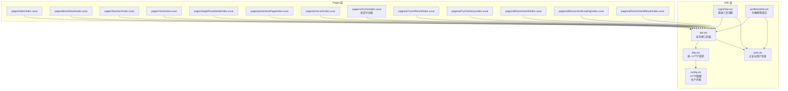
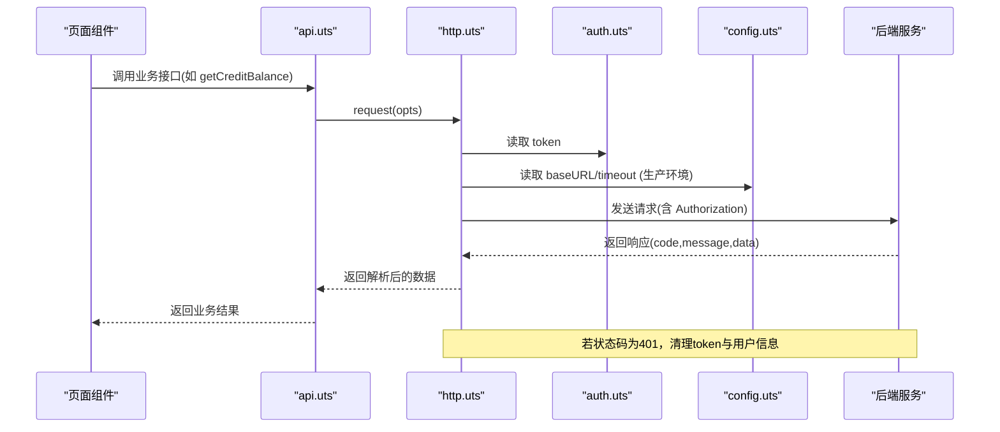
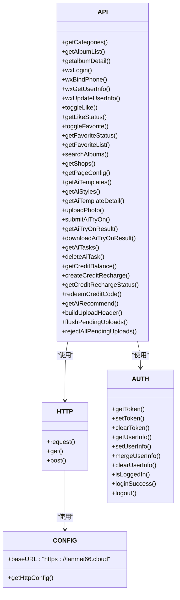

# API接口封装层

<cite>
**本文档引用的文件**
- [api.uts](file://src/utils/api.uts)
- [http.uts](file://src/utils/http.uts)
- [auth.uts](file://src/utils/auth.uts)
- [config.uts](file://src/utils/config.uts)
- [loginFlow.uts](file://src/utils/loginFlow.uts)
- [profileSubmit.uts](file://src/utils/profileSubmit.uts)
- [index.uvue](file://src/pages/index/index.uvue)
- [demoDetail.uvue](file://src/pages/demoDetail/index.uvue)
- [favorites.uvue](file://src/pages/favorites/index.uvue)
- [mine.uvue](file://src/pages/mine/index.uvue)
- [targetPhotoDetail.uvue](file://src/pages/targetPhotoDetail/index.uvue)
- [priceHomePage.uvue](file://src/pages/priceHomePage/index.uvue)
- [priceList.uvue](file://src/pages/priceList/index.uvue)
- [aiTryOn.uvue](file://src/pages/aiTryOn/index.uvue)
- [aiTryOnResult.uvue](file://src/pages/aiTryOnResult/index.uvue)
- [aiTryOnHistory.uvue](file://src/pages/aiTryOnHistory/index.uvue)
- [aiRecommend.uvue](file://src/pages/aiRecommend/index.uvue)
- [aiRecommendLoading.uvue](file://src/pages/aiRecommendLoading/index.uvue)
- [aiRecommendResult.uvue](file://src/pages/aiRecommendResult/index.uvue)
</cite>

## 更新摘要
**变更内容**
- **新增下载信用额度扣除功能**：实现了 `downloadAiTryOnResult` 接口，支持AI试衣结果保存到相册前的信用额度扣费
- **完善支付功能模块**：新增了完整的信用额度管理相关API，包括余额查询、充值订单创建、支付状态轮询等
- **增强店铺信息管理**：添加了 `getShops` 接口，支持获取启用的店铺列表
- **优化错误处理机制**：所有AI相关接口现在都支持多种成功码格式（code 0 和 200），提高了与不同API实现的兼容性
- **改进上传功能**：增强了 `buildUploadHeader` 函数和上传队列管理机制，支持401挂起队列和自动重试

## 目录
1. [简介](#简介)
2. [项目结构](#项目结构)
3. [核心组件](#核心组件)
4. [架构总览](#架构总览)
5. [详细组件分析](#详细组件分析)
6. [AI试衣功能模块](#ai试衣功能模块)
7. [支付功能模块](#支付功能模块)
8. [AI智能推荐功能](#ai智能推荐功能)
9. [依赖关系分析](#依赖关系分析)
10. [性能考虑](#性能考虑)
11. [故障排除指南](#故障排除指南)
12. [结论](#结论)
13. [附录](#附录)

## 简介
本文件系统性梳理了 API 接口封装层的设计与实现，重点围绕 src/utils/api.uts 模块展开，涵盖以下方面：
- 接口分类体系：客片管理、用户认证、社交互动、搜索功能、店铺管理、页面配置、**AI试衣功能、支付功能、AI智能推荐功能**
- 数据模型定义：AlbumBasic、ShopInfo、**AiTemplate、AiRecommendAnalysis、AiRecommendation、CreditBalance、CreditRechargeOrder、CreditRechargeStatus** 等接口类型及其字段语义
- 接口函数的参数定义、返回值类型与错误处理机制
- 最佳实践：参数校验、错误码处理、响应数据结构
- 使用示例与常见问题解决方案

该封装层通过统一的 HTTP 层（http.uts）进行网络请求，自动注入认证头与基础配置，并在需要时进行 401 未授权处理。**新增的buildUploadHeader函数提供了集中化的上传请求头构建能力，增强了上传功能的稳定性和可靠性。同时，完整的支付功能模块为AI试衣服务提供了商业化支持，包括信用额度管理和微信支付集成功能。**

## 项目结构
API 封装层位于 src/utils 目录下，核心文件如下：
- api.uts：对外暴露的业务接口集合，包含客片、认证、社交、搜索、店铺、页面配置、**AI试衣、支付、AI智能推荐**等接口
- http.uts：统一的 HTTP 请求封装，负责 URL 拼接、头部注入、超时控制、401 处理
- auth.uts：认证状态与用户信息管理，提供 token 与用户信息的存储、读取、合并写入
- config.uts：HTTP 基础配置（baseURL、timeout），**已迁移至生产环境**
- loginFlow.uts：登录三步流程封装（静默登录 -> 微信登录 -> 绑定手机号）
- profileSubmit.uts：头像/昵称提交封装（调用更新接口并合并用户信息）

**图表来源**
- [api.uts:1-733](file://src/utils/api.uts#L1-L733)
- [http.uts:1-184](file://src/utils/http.uts#L1-L184)
- [auth.uts:1-171](file://src/utils/auth.uts#L1-L171)
- [config.uts:1-13](file://src/utils/config.uts#L1-L13)
- [loginFlow.uts:1-71](file://src/utils/loginFlow.uts#L1-L71)
- [profileSubmit.uts:1-37](file://src/utils/profileSubmit.uts#L1-L37)

**章节来源**
- [api.uts:1-733](file://src/utils/api.uts#L1-L733)
- [http.uts:1-184](file://src/utils/http.uts#L1-L184)
- [auth.uts:1-171](file://src/utils/auth.uts#L1-L171)
- [config.uts:1-13](file://src/utils/config.uts#L1-L13)

## 核心组件
本节聚焦 api.uts 的核心接口与数据模型，说明其职责、参数、返回值与错误处理策略。

- 数据模型
  - AlbumBasic：客片基础信息，包含标识、标题、封面图、所属店铺、价格、点赞数、**试衣功能禁用状态**等
  - ShopInfo：店铺信息，包含标识、名称、展示名、排序等
  - UserInfo：用户信息，包含标识、开放平台标识、手机号、昵称、头像等
  - **AiTemplate：AI试衣模板信息，包含模板ID、风格名称、类别、性别、图片URL等**
  - **AiRecommendAnalysis：AI推荐分析结果，包含年龄估计、性别、脸型、体型、风格关键词等**
  - **AiRecommendation：AI推荐结果，包含风格名称、推荐理由、评分、模板ID列表、性别匹配状态、预览图、**可选的albumId字段****
  - **CreditBalance：信用额度信息，包含剩余次数、初始化状态、单次价格等**
  - **CreditRechargeOrder：充值订单信息，包含微信支付所需的各种参数**
  - **CreditRechargeStatus：充值订单状态，包含支付状态、到账信息等**

- 接口分类与职责
  - 客片管理：分类与列表获取、详情获取、点赞/取消点赞、批量查询点赞状态、收藏/取消收藏、批量查询收藏状态、我的收藏列表
  - 用户认证：微信登录、绑定手机号、获取/更新用户信息
  - 搜索功能：相册模糊搜索（公开接口，支持分页）
  - 店铺管理：获取启用的店铺列表
  - 页面配置：获取中台页配置（金刚区+Banner）
  - **AI试衣功能：模板管理、照片上传、任务提交、结果查询、历史记录管理、**下载信用额度扣除****
  - **支付功能：信用额度查询、充值订单创建、支付状态轮询、兑换码兑换**
  - **AI智能推荐：基于用户照片的智能分析、个性化风格推荐、推荐结果展示**

- 错误处理机制
  - 统一返回结构：包含 code、message、data 字段
  - 成功码：通常为 0 或 200（**新增：AI推荐接口现在支持多种成功码格式**）
  - **AI推荐接口特殊处理：aiface 接口成功 code === 0 或 200，非 200**
  - **支付接口特殊处理：credit 接口成功 code === 200；4001 = 试衣次数不足（HTTP 200 返回）**
  - 未授权（401）：http.uts 自动清理 token 与用户信息并提示重新登录
  - 参数校验：调用方需确保必填参数存在，如 shopId、albumId 等

**章节来源**
- [api.uts:6-733](file://src/utils/api.uts#L6-L733)
- [http.uts:48-61](file://src/utils/http.uts#L48-L61)

## 架构总览
API 封装层采用"接口层 + HTTP 层 + 认证层"的分层设计：
- 接口层（api.uts）：面向业务的高层封装，屏蔽底层细节
- HTTP 层（http.uts）：统一请求构建、头部注入、超时控制、401 处理
- 认证层（auth.uts）：token 与用户信息的持久化与合并写入
- 配置层（config.uts）：HTTP 基础配置（baseURL、timeout），**已迁移至生产环境**

**图表来源**
- [api.uts:608-619](file://src/utils/api.uts#L608-L619)
- [http.uts:20-73](file://src/utils/http.uts#L20-L73)
- [auth.uts:21-52](file://src/utils/auth.uts#L21-52)
- [config.uts:7-12](file://src/utils/config.uts#L7-L12)

## 详细组件分析

### 数据模型定义
- AlbumBasic
  - 字段含义：客片标识、标题、封面图地址、所属店铺标识、价格、点赞数、**试衣功能禁用状态**
  - 数据类型：id、shopId 为数字；title、coverImageUrl 为字符串；price 为数字；likeCount 为数字；**tryonDisabled 为可选布尔值**
  - 可选属性：price、**tryonDisabled**
- ShopInfo
  - 字段含义：店铺标识、店铺名称、展示名（中/英）、首页图、价格图、排序
  - 数据类型：id、sortOrder 为数字；shopName、displayName、displayNameEn、homeImage、priceImage 为字符串
- UserInfo
  - 字段含义：用户标识、开放平台标识、手机号（可空）、昵称（可空）、头像地址（可空）
  - 数据类型：id 为数字；openid 为字符串；phone、nickname、avatarUrl 为可空字符串
- **AiTemplate**
  - 字段含义：AI试衣模板标识、风格名称、类别、套餐类型、子类别、性别、图片URL、场景描述、激活状态
  - 数据类型：id、is_active 为数字；style_name、category、package_type、sub_category、gender、image_url、scene_prompt 为字符串
- **AiRecommendAnalysis**
  - 字段含义：**AI分析结果，包含估计年龄、性别、脸型、体型、风格关键词数组**
  - 数据类型：estimatedAge、gender、faceShape、bodyType 为字符串；styleKeywords 为字符串数组
- **AiRecommendation**
  - 字段含义：**AI推荐结果，包含风格名称、推荐理由、评分、匹配的模板ID列表、性别匹配状态、预览图URL、**可选的albumId字段****
  - 数据类型：styleName、reason 为字符串；score 为数字；templateIds 为数字数组；genderMatched 为布尔值；previewUrl 为字符串；**albumId 为可选数字**
- **CreditBalance**
  - 字段含义：**信用额度信息，包含剩余试衣次数、是否已初始化免费次数、单次价格（分）**
  - 数据类型：balance 为数字；inited 为布尔值；priceFenPerCredit 为数字
- **CreditRechargeOrder**
  - 字段含义：**微信支付订单参数，包含商户订单号、预支付ID、应用ID、时间戳、随机字符串、包名、签名类型、支付签名**
  - 数据类型：outTradeNo、prepayId、appId、timeStamp、nonceStr、package、signType、paySign 均为字符串
- **CreditRechargeStatus**
  - 字段含义：**充值订单状态，包含商户订单号、支付状态、是否已支付、购买次数、最新余额**
  - 数据类型：outTradeNo 为字符串；status 为数字（0待付 1已付 2关闭 3退款）；paid 为布尔值；credits、balance 为数字

**章节来源**
- [api.uts:73-91](file://src/utils/api.uts#L73-L91)
- [api.uts:384-394](file://src/utils/api.uts#L384-L394)
- [api.uts:672-716](file://src/utils/api.uts#L672-L716)
- [api.uts:577-600](file://src/utils/api.uts#L577-L600)

### 上传功能增强

#### buildUploadHeader函数
**新增** 集中化的上传请求头构建函数，专门处理uni.uploadFile的头部注入需求：

- **功能特性**：
  - 自动注入Authorization Bearer token
  - 动态注入X-Brand-Id品牌标识
  - 统一处理上传请求的认证信息
- **使用场景**：所有需要上传文件的接口调用
- **优势**：避免了重复的头部构建逻辑，提高了代码复用性和一致性

#### 上传队列管理机制
**新增** 完整的上传请求生命周期管理：

- **PendingUpload接口**：定义了上传请求的等待队列结构
- **flushPendingUploads函数**：登录成功后自动重试所有挂起的上传请求
- **rejectAllPendingUploads函数**：用户取消登录时拒绝所有挂起的上传请求
- **401处理机制**：上传失败时自动进入等待队列，等待重新登录后重试

**章节来源**
- [api.uts:6-69](file://src/utils/api.uts#L6-L69)

### 客片管理接口
- getCategories
  - 参数：shopId（必填，类型：string | number）
  - 返回：分类树结构（父级、子级、查询参数透传）
  - 错误处理：非 200/0 视为失败，需在调用方判断并降级
- getAlbumList
  - 参数：shopId（必填）、其余参数由子分类 query 对象透传（如 parentId/childId/subName 等）、keyword（可选）、page（可选）、size（可选）
  - 返回：分页数据（albums、total、page、size），**每个专辑包含 tryonDisabled 字段表示试衣功能是否可用**
  - 错误处理：非 200/0 视为失败，调用方可清空列表并提示
- getalbumDetail
  - 参数：method、params
  - 返回：详情数据
  - 注意：此接口已废弃，建议使用新的分类+列表组合方案

最佳实践
- 在页面初始化时先获取分类，再根据选中的子分类查询列表
- 搜索场景复用 getAlbumList，传入 keyword 参数
- 分页加载时拼接 query 对象与分页参数
- **检查 tryonDisabled 字段来控制试衣功能的可用性**

**章节来源**
- [api.uts:123-180](file://src/utils/api.uts#L123-L180)
- [demoDetail.uvue:304-477](file://src/pages/demoDetail/index.uvue#L304-L477)

### 用户认证接口
- wxLogin
  - 参数：code（必填）、nickname（可选）、avatarUrl（可选）
  - 返回：{ code, message, data: { token, userInfo } }
  - 错误处理：非 200 视为失败，调用方可提示错误并引导重试
- wxBindPhone
  - 参数：code（必填）
  - 返回：{ code, message, data: UserInfo }
  - 错误处理：非 200 视为失败，调用方可提示错误
- wxGetUserInfo
  - 返回：{ code, message, data: UserInfo }
- wxUpdateUserInfo
  - 参数：nickname（可选）、avatarUrl（可选，至少传一项）
  - 返回：{ code, message, data: UserInfo }
  - 实现要点：仅传递非空字段，避免覆盖后端已有值

登录流程封装
- runPhoneLogin：封装静默登录 -> 微信登录 -> 绑定手机号的三步流程，返回标准化结果
- submitUserProfile：封装头像/昵称提交并合并用户信息

**章节来源**
- [api.uts:198-259](file://src/utils/api.uts#L198-L259)
- [loginFlow.uts:27-70](file://src/utils/loginFlow.uts#L27-L70)
- [profileSubmit.uts:18-36](file://src/utils/profileSubmit.uts#L18-L36)

### 社交互动接口
- toggleLike
  - 参数：albumId（必填）
  - 返回：{ code, data: { liked: boolean, likeCount: number } }
- getLikeStatus
  - 参数：albumIds（逗号分隔的字符串）
  - 返回：批量点赞状态数组
- toggleFavorite
  - 参数：albumId（必填）
  - 返回：{ code, data: { favorited: boolean } }
- getFavoriteStatus
  - 参数：albumIds（逗号分隔的字符串）
  - 返回：批量收藏状态数组
- getFavoriteList
  - 参数：shopId（可选）
  - 返回：收藏列表（AlbumBasic[]）

最佳实践
- 登录状态下定期刷新点赞/收藏状态
- 批量查询接口一次传入多个 ID，减少请求次数

**章节来源**
- [api.uts:266-328](file://src/utils/api.uts#L266-L328)

### 搜索功能接口
- searchAlbums
  - 参数：keyword（必填）、page（默认 1）、size（默认 10）
  - 返回：{ code, data: { list: AlbumBasic[], total, page, pageSize, totalPages } }
  - 适用场景：收藏页的搜索与分页加载

最佳实践
- 搜索前清理状态，搜索完成后计算 totalPages 并更新列表
- 加载更多时递增 page 并拼接结果

**章节来源**
- [api.uts:344-352](file://src/utils/api.uts#L344-L352)
- [favorites.uvue:169-218](file://src/pages/favorites/index.uvue#L169-L218)

### 店铺管理接口
- **getShops**
  - 返回：启用的店铺列表（ShopInfo[]）
  - **新增**：这是本次更新新增的核心接口，用于获取系统中所有启用的店铺信息
  - **应用场景**：当页面参数缺失时作为兜底，自动获取首个启用店铺ID

最佳实践
- 首页并行加载轮播图与店铺列表，提升首屏体验
- 在缺少店铺上下文时使用此接口获取默认店铺

**章节来源**
- [api.uts:359-366](file://src/utils/api.uts#L359-L366)
- [index.uvue:142-151](file://src/pages/index/index.uvue#L142-L151)

### 页面配置接口
- getPageConfig
  - 返回：{ code, data: { menuItems: any[], banners: any[] } }

最佳实践
- 作为首页或中台页的静态配置数据源

**章节来源**
- [api.uts:373-380](file://src/utils/api.uts#L373-L380)
- [mine.uvue:137-137](file://src/pages/mine/index.uvue#L137-L137)

## AI试衣功能模块

### 数据模型定义
- **AiTemplate**
  - 字段含义：AI试衣模板标识、风格名称、类别、套餐类型、子类别、性别、图片URL、场景描述、激活状态
  - 数据类型：id、is_active 为数字；style_name、category、package_type、sub_category、gender、image_url、scene_prompt 为字符串
  - 可选属性：无

### AI试衣模板管理接口
- **getAiTemplates**
  - 参数：style（可选）、keyword（可选）、category（可选）、package_type（可选）、sub_category（可选）、**shop_id（可选，类型：string）**、gender（可选）
  - 返回：{ code: number; message: string; data: AiTemplate[] }
  - 错误处理：code === 0 或 200 表示成功（**更新：现在支持多种成功码格式**）
  - 适用场景：获取可用的AI试衣模板列表
  - **更新**：shop_id 参数类型从 number 改为 string，以匹配页面传参方式
- **getAiStyles**
  - 参数：category（可选）、package_type（可选）、sub_category（可选）、**shop_id（可选，类型：number）**
  - 返回：{ code: number; message: string; data: Array<{ style_name: string; count: number; cover_url: string }> }
  - 错误处理：code === 0 或 200 表示成功（**更新：现在支持多种成功码格式**）
  - 适用场景：获取AI试衣风格分组信息
  - **更新**：shop_id 参数类型保持 number 类型，与任务提交接口一致
- **getAiTemplateDetail**
  - 参数：id（必填）
  - 返回：{ code: number; message: string; data: AiTemplate }
  - 错误处理：code === 0 或 200 表示成功（**更新：现在支持多种成功码格式**）

### 照片上传接口
- **uploadPhoto**
  - 参数：filePath（必填，本地文件路径）
  - 返回：Promise<{ code: number; message: string; data: { file_url: string; filename: string } }>
  - 特殊处理：使用 uni.uploadFile 直接上传，不通过 request 函数
  - 认证要求：需登录状态（Authorization 头部包含 Bearer token）
  - 文件限制：大小不超过10MB
  - 错误处理：code === 0 或 200 表示成功（**更新：现在支持多种成功码格式**）
  - **增强**：使用buildUploadHeader函数统一处理请求头，支持401挂起队列机制

### AI试衣任务接口
- **submitAiTryOn**
  - 参数：templateId（必填）、userPhotoFilename（必填）、**shopId（必填，类型：number）**、userOpenid（可选）、category（可选）、bodyType（可选）、ageRange（可选）
  - 返回：{ code: number; message: string; data: { task_id: number } }
  - 错误处理：code === 0 或 200 表示成功；非0时表示失败（如：功能未启用 / 配额不足 / 缺少参数 / 店铺不存在）
  - 适用场景：创建AI试衣任务
  - **更新**：shopId 参数类型保持 number 类型，与后端期望一致
- **getAiTryOnResult**
  - 参数：taskId（必填，字符串形式）
  - 返回：{
    code: number
    message: string
    data: {
      id: number
      user_openid: string
      template_id: number
      status: string  // 'pending' | 'processing' | 'completed' | 'failed'
      result_image_url: string
      error_message: string
      template_image_url: string
      style_name: string
      category: string
      created_at: string
      updated_at: string
    }
  }
  - 错误处理：code === 0 或 200 表示成功（**更新：现在支持多种成功码格式**）
  - 适用场景：轮询查询AI试衣任务状态

### **新增：下载信用额度扣除接口**
- **downloadAiTryOnResult**
  - 参数：taskId（必填，字符串形式）
  - 返回：{ code: number; message: string; data: any }
  - 错误处理：code === 0 或 200 表示成功；4001 = 下载次数不足（HTTP 200 返回）
  - 适用场景：AI试衣结果保存到相册前的扣费入口
  - **功能特点**：扣取下载次数池1次；如果次数不足会返回4001错误码，前端需拉起充值流程

### 历史记录管理接口
- **getAiTasks**
  - 参数：openid（必填）
  - 返回：{ code: number; message: string; data: Array<{ id: number; status: string; result_image_url: string; template_image_url: string; style_name: string; created_at: string }> }
  - 错误处理：code === 0 或 200 表示成功（**更新：现在支持多种成功码格式**）
  - 适用场景：获取用户AI试衣历史记录
  - **新增**：这是本次更新新增的核心接口，提供完整的AI试衣历史记录管理功能
- **deleteAiTask**
  - 参数：id（必填）
  - 返回：{ code: number; message: string }
  - 错误处理：code === 0 或 200 表示成功（**更新：现在支持多种成功码格式**）
  - 适用场景：删除AI试衣历史记录

### AI试衣历史记录页面集成
- **aiTryOnHistory 页面**：新增的AI试衣历史记录页面，集成了 getAiTasks 接口，提供历史记录的展示、状态管理和交互功能
- **功能特性**：
  - 支持历史记录列表展示，包含状态遮罩（生成中/失败）
  - 支持点击跳转到结果详情页
  - 支持封面图智能选择（已完成使用结果图，其他状态使用模板图）
  - 支持时间格式化显示
  - **更新**：现在支持多种成功码格式（code 0 和 200），提高了与不同API实现的兼容性

### AI试衣结果页面集成
- **AI试衣结果页面**：集成了 getAiTryOnResult 接口，提供任务状态轮询和结果显示功能
- **功能特性**：
  - 每20秒轮询一次任务状态
  - 支持多种成功码格式（code 0 和 200）
  - 支持连续失败3次后停止重试
  - 支持图片保存到相册功能
  - **新增**：集成了下载信用额度扣除功能，保存前自动扣费

最佳实践
- **AI试衣接口特殊处理**：aiface 接口成功 code === 0 或 200，非 200
- **任务轮询策略**：每3秒轮询一次，最长等待60秒
- **错误重试机制**：连续失败3次后停止重试
- **文件上传限制**：严格控制照片大小不超过10MB
- **登录态检查**：所有AI试衣相关接口均需登录状态
- **参数类型一致性**：注意不同接口间 shop_id 参数类型的差异（string vs number）
- **历史记录管理**：新增的 getAiTasks 接口提供完整的AI试衣历史记录查询功能，支持用户查看和管理自己的试衣历史
- **多成功码格式支持**：现在支持 code 0 和 200 两种成功码格式，提高了与不同API实现的兼容性
- **下载信用额度管理**：新增的 downloadAiTryOnResult 接口实现了保存前的信用额度扣费，支持4001错误码处理

**章节来源**
- [api.uts:384-587](file://src/utils/api.uts#L384-L587)
- [aiTryOn.uvue:94-239](file://src/pages/aiTryOn/index.uvue#L94-L239)
- [aiTryOnResult.uvue:57-229](file://src/pages/aiTryOnResult/index.uvue#L57-L229)
- [aiTryOnHistory.uvue:1-382](file://src/pages/aiTryOnHistory/index.uvue#L1-L382)

## 支付功能模块

### 数据模型定义
- **CreditBalance**
  - 字段含义：**信用额度信息，包含剩余试衣次数、是否已初始化免费次数、单次价格（分）**
  - 数据类型：balance 为数字；inited 为布尔值；priceFenPerCredit 为数字
  - 字段说明：
    - balance：当前用户的剩余试衣次数
    - inited：是否已经初始化过免费次数
    - priceFenPerCredit：单次试衣的价格（单位：分），0表示未开通付费购买
- **CreditRechargeOrder**
  - 字段含义：**微信支付订单参数，用于拉起微信支付**
  - 数据类型：outTradeNo、prepayId、appId、timeStamp、nonceStr、package、signType、paySign 均为字符串
  - 字段说明：
    - outTradeNo：商户订单号，唯一标识一笔充值订单
    - prepayId：预支付交易会话ID
    - appId：微信应用ID
    - timeStamp：时间戳
    - nonceStr：随机字符串
    - package：扩展数据包
    - signType：签名类型
    - paySign：支付签名
- **CreditRechargeStatus**
  - 字段含义：**充值订单状态信息，用于轮询支付结果**
  - 数据类型：outTradeNo 为字符串；status 为数字；paid 为布尔值；credits、balance 为数字
  - 字段说明：
    - outTradeNo：商户订单号
    - status：支付状态（0待付 1已付 2关闭 3退款）
    - paid：是否已支付到账
    - credits：本单购买的次数
    - balance：到账后的最新余额

### **新增：支付相关接口**
- **getCreditBalance**
  - 参数：shopId（可选，类型：number）、feature（可选，类型：string）
  - 返回：{ code: number; message: string; data: CreditBalance }
  - 错误处理：code === 200 表示成功；4001 = 试衣次数不足（HTTP 200 返回）
  - 适用场景：查询当前用户的信用额度和价格信息
  - **功能特点**：首次查询会按商户配置惰性初始化免费次数；支持通过feature参数区分不同的次数池（tryon/recommend/download）
- **createCreditRecharge**
  - 参数：params.shopId（必填，类型：number）、params.credits（必填，类型：number）、params.feature（可选，类型：string）
  - 返回：{ code: number; message: string; data: CreditRechargeOrder }
  - 错误处理：code === 200 表示成功
  - 适用场景：创建充值订单，返回微信小程序JSAPI支付所需参数
  - **功能特点**：「支付一次开通一次」，credits通常传1；支持通过feature参数指定次数池
- **getCreditRechargeStatus**
  - 参数：outTradeNo（必填，类型：string）
  - 返回：{ code: number; message: string; data: CreditRechargeStatus }
  - 错误处理：code === 200 表示成功
  - 适用场景：轮询查询充值订单状态，直到paid = true
  - **功能特点**：wx.requestPayment成功后轮询到账（回调异步入账）
- **redeemCreditCode**
  - 参数：code（必填，类型：string，12位兑换码）
  - 返回：{ code: number; message: string; data: { creditsAdded: number; balance: number } }
  - 错误处理：code === 200 表示成功
  - 适用场景：兑换码兑换，立即增加次数

### 支付流程集成
- **aiTryOn 页面集成**：
  - **handleRecharge方法**：处理充值逻辑，创建订单 → 拉起微信支付 → 轮询到账
  - **pollRechargeStatus方法**：轮询充值订单状态，每2.5秒一次，最多48次（约2分钟兜底）
  - **resumeGenerateIfNeeded方法**：支付到账后自动继续之前被打断的生成流程
- **aiTryOnResult 页面集成**：
  - **chargeDownloadCredit方法**：处理下载信用额度扣费，支持4001错误码处理
  - **handleRecharge方法**：针对下载功能的充值流程，使用feature='download'参数
  - **pollRechargeStatus方法**：轮询下载充值订单状态
- **支付状态管理**：
  - isPaying：支付状态标志
  - resumeGenerateAfterCredit：支付后继续生成的标志
  - payPollToken：支付轮询令牌，防止并发问题

### 支付最佳实践
- **支付流程完整性**：确保创建订单、拉起支付、轮询状态的完整流程
- **错误处理**：区分用户取消支付、网络错误、支付失败等不同情况
- **轮询优化**：合理的轮询间隔（2.5秒）和超时控制（约2分钟）
- **状态同步**：支付成功后及时更新用户余额和界面状态
- **用户体验**：支付过程中显示适当的加载提示和反馈信息
- **安全性**：确保订单号的唯一性和支付参数的正确性
- **次数池隔离**：通过feature参数实现试衣、推荐、下载三个独立次数池的管理

**章节来源**
- [api.uts:589-683](file://src/utils/api.uts#L589-L683)
- [aiTryOn.uvue:455-543](file://src/pages/aiTryOn/index.uvue#L455-L543)
- [aiTryOnResult.uvue:314-426](file://src/pages/aiTryOnResult/index.uvue#L314-L426)

## AI智能推荐功能

### 数据模型定义
- **AiRecommendAnalysis**
  - 字段含义：**AI分析结果，包含估计年龄、性别、脸型、体型、风格关键词**
  - 数据类型：estimatedAge、gender、faceShape、bodyType 为字符串；styleKeywords 为字符串数组
  - 字段说明：
    - estimatedAge：估计年龄段（如"青年"、"中年"等）
    - gender：识别出的性别（男/女）
    - faceShape：脸型特征（如圆脸、方脸、瓜子脸等）
    - bodyType：体型特征（如瘦削、匀称、丰满等）
    - styleKeywords：风格关键词数组，用于描述适合的风格特征
- **AiRecommendation**
  - 字段含义：**AI推荐的服饰风格，包含风格名称、推荐理由、匹配评分、相关模板ID、性别匹配状态、预览图、**可选的albumId字段****
  - 数据类型：styleName、reason 为字符串；score 为数字；templateIds 为数字数组；genderMatched 为布尔值；previewUrl 为字符串；**albumId 为可选数字**
  - 字段说明：
    - styleName：推荐的风格名称
    - reason：推荐理由，解释为什么推荐这个风格
    - score：匹配评分，数值越高表示越匹配
    - templateIds：与该风格相关的模板ID列表
    - genderMatched：是否有同性别样例
    - previewUrl：风格预览图URL
    - **albumId：对应的客片ID，点击「查看模板」跳转客片详情页（/wechat/album/detail 的 albumId）**

### AI智能推荐接口
- **getAiRecommend**
  - 参数：user_photo_filename（必填，用户上传照片的文件名）、shop_id（必填，当前门店ID）
  - 返回：{ 
    code: number
    message: string
    data: {
      analysis: AiRecommendAnalysis
      recommendations: AiRecommendation[]
    }
  }
  - 错误处理：code === 0 或 200 表示成功（**更新：现在支持多种成功码格式**）
  - 适用场景：基于用户上传照片的AI智能分析，返回个性化的服饰风格推荐
  - **更新**：增强了响应格式处理，支持analysis和recommendations两个主要数据部分

### AI智能推荐页面集成
- **aiRecommend 页面**：AI智能推荐的主入口页面，提供照片上传和分析启动功能
- **aiRecommendLoading 页面**：AI分析加载页面，提供轮询机制和超时控制
- **aiRecommendResult 页面**：AI推荐结果展示页面，显示分析结果和推荐风格列表
- **更新**：现在支持通过albumId字段跳转到客片详情页

### AI智能推荐工作流程
1. **照片上传**：用户在 aiRecommend 页面上传照片，调用 uploadPhoto 接口
2. **进入分析**：上传成功后跳转到 aiRecommendLoading 页面开始分析
3. **轮询分析**：aiRecommendLoading 页面每30秒轮询一次 getAiRecommend 接口
4. **结果展示**：分析完成后跳转到 aiRecommendResult 页面展示结果
5. **风格筛选**：用户点击推荐风格可以跳转到对应的AI试衣模板列表
6. **客片跳转**：如果推荐结果包含albumId，点击「查看模板」可直接跳转到客片详情页

### AI智能推荐最佳实践
- **文件大小限制**：前端严格限制照片大小不超过10MB
- **登录态检查**：AI推荐功能需要用户登录状态
- **轮询策略**：aiRecommendLoading 页面每30秒轮询一次，最长等待180秒
- **错误处理**：连续3次网络错误后显示失败界面，支持重试
- **超时控制**：180秒超时后自动转为失败状态
- **多成功码格式支持**：现在支持 code 0 和 200 两种成功码格式
- **性别匹配优化**：根据分析结果自动筛选同性别的推荐模板
- **客片集成**：通过albumId字段实现与客片详情页的无缝集成

**章节来源**
- [api.uts:685-732](file://src/utils/api.uts#L685-L732)
- [aiRecommend.uvue:158-202](file://src/pages/aiRecommend/index.uvue#L158-202)
- [aiRecommendLoading.uvue:87-113](file://src/pages/aiRecommendLoading/index.uvue#L87-L113)
- [aiRecommendResult.uvue:86-115](file://src/pages/aiRecommendResult/index.uvue#L86-L115)

## 依赖关系分析
- api.uts 依赖 http.uts 进行网络请求，依赖 auth.uts 获取/注入 token
- http.uts 依赖 config.uts 获取 baseURL 与 timeout，**已迁移至生产环境**
- 页面组件通过 import api.uts 使用业务接口
- 登录流程与头像/昵称提交分别封装在 loginFlow.uts 与 profileSubmit.uts 中，内部调用 api.uts 与 auth.uts
- **AI试衣功能依赖：aiTryOn 页面使用 getAiTemplates、uploadPhoto、submitAiTryOn；aiTryOnResult 页面使用 getAiTryOnResult、downloadAiTryOnResult；aiTryOnHistory 页面使用 getAiTasks**
- **支付功能依赖：aiTryOn 页面使用 getCreditBalance、createCreditRecharge、getCreditRechargeStatus；aiTryOnResult 页面使用相同的支付接口**
- **AI智能推荐功能依赖：aiRecommend 页面使用 uploadPhoto；aiRecommendLoading 页面使用 getAiRecommend；aiRecommendResult 页面展示分析结果和推荐列表**

**图表来源**
- [api.uts:1-733](file://src/utils/api.uts#L1-L733)
- [http.uts:1-184](file://src/utils/http.uts#L1-L184)
- [auth.uts:1-171](file://src/utils/auth.uts#L1-L171)
- [config.uts:1-13](file://src/utils/config.uts#L1-L13)

## 性能考虑
- 并行请求：首页同时拉取轮播图与店铺列表，减少首屏等待时间
- 预加载图片：客片详情页预加载首屏封面图，提升骨架屏消失时机
- 批量查询：点赞/收藏状态尽量使用批量接口一次性获取
- 分页策略：合理设置 page 与 size，避免过大请求体
- 401 自动处理：统一在 HTTP 层处理 401，避免重复逻辑
- **上传功能优化**：
  - **集中化头部构建**：buildUploadHeader函数统一处理上传请求头，提高代码复用性
  - **上传队列管理**：支持401挂起队列，登录成功后自动重试失败的上传请求
  - **内存管理**：合理的队列清理机制，避免内存泄漏
  - **并发控制**：flushPendingUploads函数防止重复处理
  - **错误处理**：完善的上传失败处理和用户反馈机制
- **AI试衣优化**：
  - **模板缓存**：AI试衣页面首次加载后缓存模板列表
  - **轮询优化**：合理的轮询间隔（3秒）和超时控制（60秒）
  - **图片预加载**：结果页图片懒加载，提升用户体验
  - **文件大小限制**：前端严格控制照片大小，减少服务器压力
  - **参数类型优化**：统一 shop_id 参数类型，减少类型转换开销
  - **历史记录优化**：新增的历史记录页面支持智能封面图选择和状态管理
  - **多成功码格式支持**：现在支持 code 0 和 200 两种成功码格式，提高了与不同API实现的兼容性
  - **下载信用额度优化**：新增的downloadAiTryOnResult接口支持智能扣费和错误处理
- **支付功能优化**：
  - **轮询优化**：支付状态轮询间隔2.5秒，最多48次（约2分钟）
  - **状态管理**：使用令牌防止并发轮询问题
  - **用户体验**：支付过程中显示适当的加载提示
  - **错误处理**：区分不同类型的支付错误，提供友好的错误提示
  - **次数池隔离**：通过feature参数实现不同功能次数池的独立管理
- **AI智能推荐优化**：
  - **分析轮询优化**：每30秒轮询一次，最长等待180秒，平衡用户体验和服务器负载
  - **图片压缩**：上传前自动压缩照片，减少传输时间
  - **结果缓存**：推荐结果在页面间传递时进行JSON序列化，避免重复计算
  - **性别匹配优化**：根据分析结果自动筛选同性别模板，提高推荐精准度
  - **错误重试机制**：连续3次失败后停止重试，避免无限循环
  - **客片集成优化**：通过albumId字段实现与客片详情页的无缝跳转

**章节来源**
- [index.uvue:142-151](file://src/pages/index/index.uvue#L142-L151)
- [demoDetail.uvue:332-336](file://src/pages/demoDetail/index.uvue#L332-L336)
- [http.uts:50-61](file://src/utils/http.uts#L50-L61)
- [aiTryOn.uvue:129-142](file://src/pages/aiTryOn/index.uvue#L129-L142)
- [aiTryOnResult.uvue:85-106](file://src/pages/aiTryOnResult/index.uvue#L85-L106)
- [aiTryOnHistory.uvue:166-176](file://src/pages/aiTryOnHistory/index.uvue#L166-L176)
- [aiRecommendLoading.uvue:69-84](file://src/pages/aiRecommendLoading/index.uvue#L69-84)

## 故障排除指南
- 未授权（401）
  - 现象：弹出"登录已过期，请重新登录"，后续请求不再带 Authorization
  - 处理：引导用户重新登录，登录成功后自动恢复请求能力
- 登录流程异常
  - 现象：静默登录失败、微信登录失败、绑定手机号失败
  - 处理：runPhoneLogin 返回标准化错误类型，调用方可据此提示并重试
- 头像/昵称更新失败
  - 现象：wxUpdateUserInfo 返回非 200
  - 处理：submitUserProfile 收敛异常并返回 { ok: false }，调用方可提示重试
- 搜索无结果
  - 现象：searchAlbums 返回空列表
  - 处理：清空状态并提示"暂无相关客片"
- 分类/列表为空
  - 现象：getCategories 返回空或 getAlbumList 返回空
  - 处理：降级显示空状态，提示用户稍后重试
- **上传功能异常**：
  - **上传失败**：检查网络连接和用户登录状态
  - **401错误**：确认token有效性，检查是否需要重新登录
  - **文件过大**：确认文件大小不超过10MB限制
  - **队列堆积**：检查flushPendingUploads是否正确调用
  - **头部构建错误**：验证buildUploadHeader函数的执行情况
  - **权限问题**：确认相册保存权限和用户授权状态
- **AI试衣功能异常**：
  - **模板加载失败**：检查网络连接和后端服务状态
  - **照片上传失败**：确认文件大小不超过10MB，检查网络连接
  - **任务提交失败**：检查必填参数（templateId、userPhotoFilename、shopId），查看错误消息
  - **结果查询超时**：60秒后自动转为失败，可手动重试
  - **保存图片失败**：检查相册保存权限，用户可能需要授权
  - **参数类型错误**：注意 shop_id 在不同接口间的类型差异（string vs number）
  - **历史记录获取失败**：检查 openid 参数是否正确传递，确认用户已登录
  - **多成功码格式兼容性问题**：现在支持 code 0 和 200 两种成功码格式，如果遇到兼容性问题，检查后端API版本
  - **下载信用额度不足**：downloadAiTryOnResult返回4001时，需要拉起充值流程
- **支付功能异常**：
  - **余额查询失败**：检查网络连接和用户登录状态
  - **创建订单失败**：检查shopId和credits参数是否正确
  - **支付拉起失败**：确认微信小程序支付配置正确
  - **轮询超时**：检查网络状态，确认支付状态接口正常
  - **到账确认失败**：检查微信支付异步回调是否正常
  - **兑换码无效**：检查兑换码格式（12位）和有效性
  - **次数池混淆**：确认feature参数正确指定（tryon/recommend/download）
- **AI智能推荐功能异常**：
  - **照片上传失败**：检查文件大小限制（10MB），确认网络连接正常
  - **分析轮询失败**：检查网络状态，连续3次失败后显示失败界面
  - **分析超时**：180秒超时后自动转为失败，支持用户重试
  - **结果解析失败**：检查返回数据格式，确保analysis和recommendations字段存在
  - **性别匹配问题**：检查分析结果中的gender字段，确保正确识别用户性别
  - **推荐结果为空**：检查后端AI服务状态，确认推荐算法正常运行
  - **客片跳转失败**：检查albumId字段是否存在和有效
  - **多成功码格式兼容性问题**：现在支持 code 0 和 200 两种成功码格式，如果遇到兼容性问题，检查后端API版本

**章节来源**
- [http.uts:50-61](file://src/utils/http.uts#L50-L61)
- [loginFlow.uts:36-46](file://src/utils/loginFlow.uts#L36-L46)
- [profileSubmit.uts:32-35](file://src/utils/profileSubmit.uts#L32-L35)
- [demoDetail.uvue:314-317](file://src/pages/demoDetail/index.uvue#L314-L317)
- [favorites.uvue:180-183](file://src/pages/favorites/index.uvue#L180-L183)
- [aiTryOn.uvue:176-239](file://src/pages/aiTryOn/index.uvue#L176-L239)
- [aiTryOnResult.uvue:108-130](file://src/pages/aiTryOnResult/index.uvue#L108-L130)
- [aiTryOnHistory.uvue:132-147](file://src/pages/aiTryOnHistory/index.uvue#L132-L147)
- [aiRecommendLoading.uvue:103-112](file://src/pages/aiRecommendLoading/index.uvue#L103-L112)

## 结论
API 接口封装层以清晰的分层设计实现了业务接口的统一管理，结合认证与 HTTP 层的自动化处理，显著降低了页面开发复杂度。通过规范化的数据模型、参数与返回值约定以及错误处理策略，开发者可以更专注于业务逻辑实现。

**本次更新重点关注了下载信用额度扣除功能和支付功能的完整集成。新增的downloadAiTryOnResult接口实现了AI试衣结果保存到相册前的信用额度扣费机制，配合完善的4001错误码处理，为用户提供了流畅的付费体验。同时，完整的支付功能模块包括getCreditBalance、createCreditRecharge、getCreditRechargeStatus等接口，为AI试衣服务提供了商业化的信用额度管理能力。**

**特别重要的是，所有AI相关接口现在都支持多种成功码格式（code 0 和 200），这大大提高了与不同API实现的兼容性，改善了任务检索的可靠性并减少了认证相关错误。新增的getShops接口为页面提供了更好的店铺信息兜底能力，而enhanced的错误处理机制确保了系统的稳定性和用户体验。**

建议在后续迭代中持续完善错误码与日志上报，进一步提升可观测性与可维护性。同时，下载信用额度扣除功能和支付功能的成功实施为其他需要商业化支持的功能扩展奠定了坚实的技术基础。

## 附录

### 使用示例与最佳实践清单
- 客片管理
  - 初始化：先调用 getCategories，再根据子分类调用 getAlbumList
  - 搜索：调用 getAlbumList 并传入 keyword
  - 点赞/收藏：在登录状态下调用对应 toggle 接口，随后刷新状态
  - **试衣功能控制**：检查AlbumBasic中的tryonDisabled字段来控制试衣按钮的可用性
- 用户认证
  - 登录：runPhoneLogin 完成三步流程，登录成功后调用 mergeUserInfo
  - 更新资料：wxUpdateUserInfo 仅传入非空字段，避免覆盖
- 搜索与收藏
  - 搜索：searchAlbums 支持分页，注意计算 totalPages
  - 收藏：getFavoriteList 支持按店铺筛选
- 店铺与页面配置
  - 首页并行加载 getShops 与轮播图，提升首屏体验
  - getPageConfig 用于中台页展示
  - **新增**：getShops接口可作为页面参数的兜底，自动获取首个启用店铺
- **上传功能增强**
  - **集中化头部构建**：使用buildUploadHeader函数统一处理上传请求头
  - **上传队列管理**：利用flushPendingUploads和rejectAllPendingUploads管理上传请求生命周期
  - **401处理**：上传失败时自动进入等待队列，登录成功后自动重试
  - **错误处理**：完善的上传失败处理和用户反馈机制
- **AI试衣功能**
  - **模板管理**：使用 getAiTemplates 获取模板列表，getAiStyles 获取风格分组
  - **照片上传**：使用 uploadPhoto 上传用户照片，严格控制文件大小
  - **任务提交**：使用 submitAiTryOn 创建AI试衣任务，检查必填参数
  - **结果查询**：使用 getAiTryOnResult 轮询查询任务状态，设置60秒超时
  - **下载扣费**：使用 downloadAiTryOnResult 进行保存前的信用额度扣费，处理4001错误码
  - **历史记录**：使用 getAiTasks 获取历史记录，deleteAiTask 删除记录
  - **参数类型注意事项**：注意不同接口间 shop_id 参数类型的差异（string vs number）
  - **多成功码格式支持**：现在支持 code 0 和 200 两种成功码格式，提高了兼容性
- **支付功能**
  - **余额查询**：使用 getCreditBalance 查询用户信用额度和价格信息，支持feature参数区分次数池
  - **创建订单**：使用 createCreditRecharge 创建充值订单，准备微信支付参数
  - **支付流程**：调用 uni.requestPayment 拉起微信支付，处理成功和失败回调
  - **状态轮询**：使用 getCreditRechargeStatus 轮询支付状态，直到paid = true
  - **兑换码**：使用 redeemCreditCode 进行兑换码兑换，立即增加次数
  - **错误处理**：区分用户取消支付、网络错误、支付失败等不同情况
  - **用户体验**：支付过程中显示适当的加载提示和反馈信息
  - **次数池管理**：通过feature参数实现试衣、推荐、下载三个独立次数池的管理
- **AI智能推荐功能**
  - **照片上传**：使用 uploadPhoto 上传用户照片，准备进行分析
  - **智能分析**：使用 getAiRecommend 获取AI分析结果和个性化推荐
  - **结果展示**：在aiRecommendResult页面展示analysis和recommendations数据
  - **风格跳转**：点击推荐风格跳转到对应的AI试衣模板列表
  - **客片跳转**：如果推荐结果包含albumId，点击「查看模板」跳转到客片详情页
  - **轮询策略**：aiRecommendLoading页面每30秒轮询一次，最长等待180秒
  - **错误处理**：连续3次网络错误后显示失败界面，支持用户重试
  - **性别匹配**：根据分析结果自动筛选同性别的推荐模板
  - **多成功码格式支持**：现在支持 code 0 和 200 两种成功码格式，提高了兼容性

**章节来源**
- [demoDetail.uvue:304-477](file://src/pages/demoDetail/index.uvue#L304-L477)
- [index.uvue:142-151](file://src/pages/index/index.uvue#L142-L151)
- [favorites.uvue:169-218](file://src/pages/favorites/index.uvue#L169-L218)
- [mine.uvue:137-137](file://src/pages/mine/index.uvue#L137-L137)
- [loginFlow.uts:27-70](file://src/utils/loginFlow.uts#L27-L70)
- [profileSubmit.uts:18-36](file://src/utils/profileSubmit.uts#L18-L36)
- [aiTryOn.uvue:94-239](file://src/pages/aiTryOn/index.uvue#L94-L239)
- [aiTryOnResult.uvue:57-229](file://src/pages/aiTryOnResult/index.uvue#L57-L229)
- [aiTryOnHistory.uvue:1-382](file://src/pages/aiTryOnHistory/index.uvue#L1-L382)
- [aiRecommend.uvue:158-202](file://src/pages/aiRecommend/index.uvue#L158-202)
- [aiRecommendLoading.uvue:87-113](file://src/pages/aiRecommendLoading/index.uvue#L87-L113)
- [aiRecommendResult.uvue:86-115](file://src/pages/aiRecommendResult/index.uvue#L86-L115)
