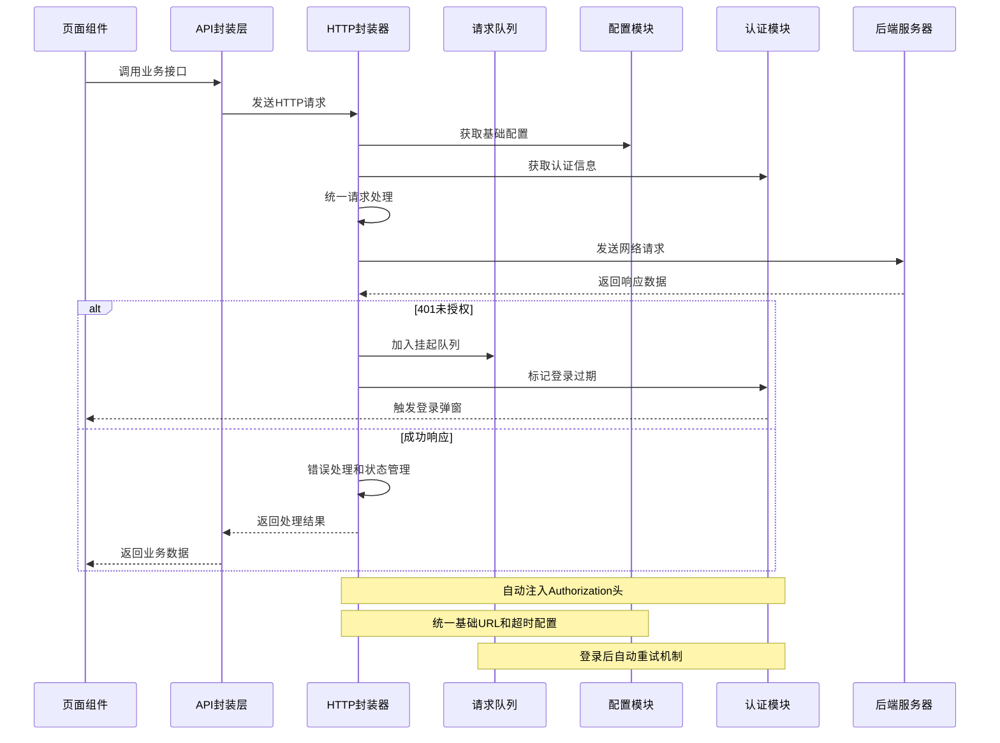
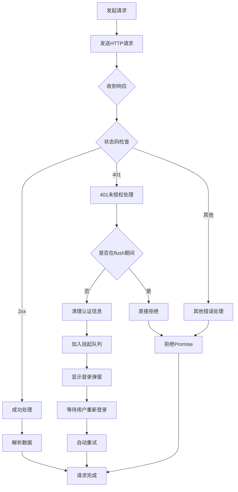
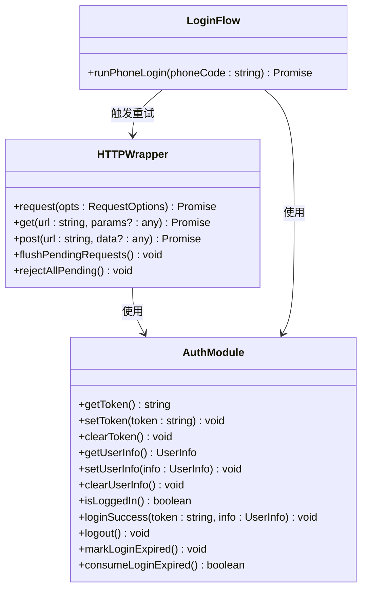
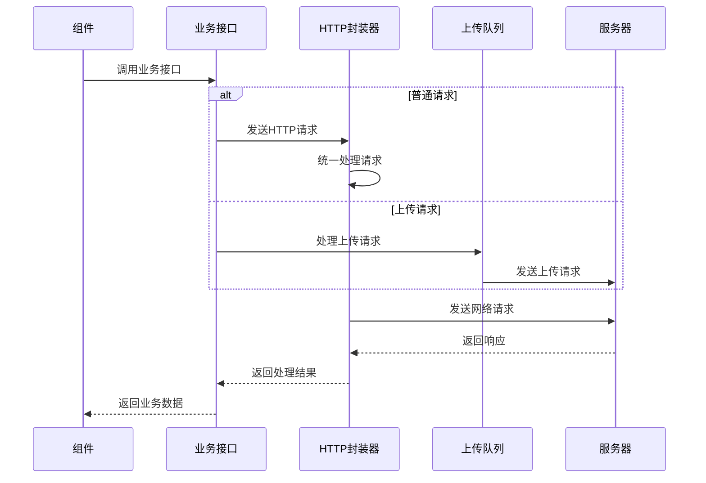
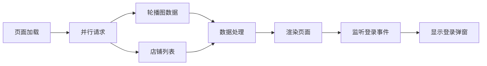
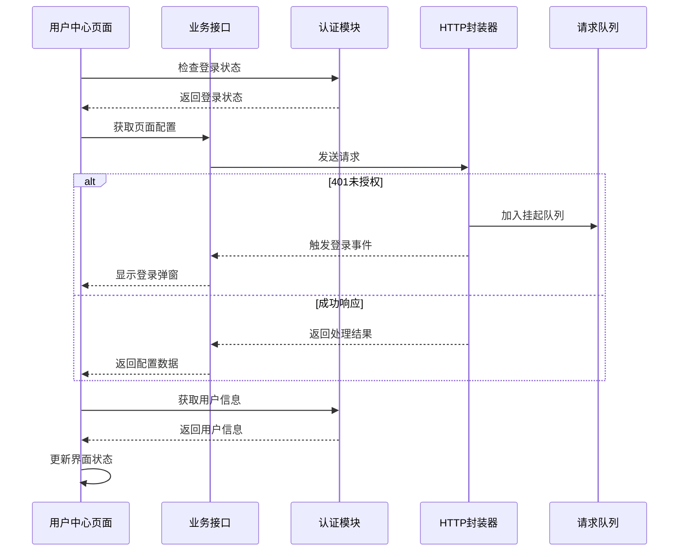
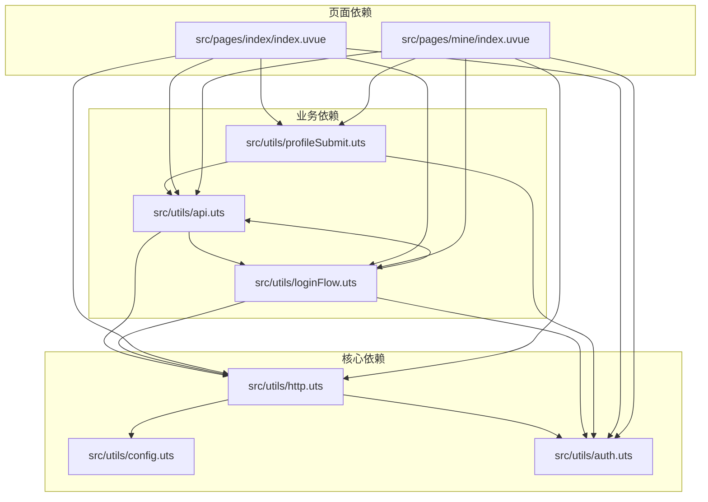

# HTTP请求封装器

<cite>
**本文档引用的文件**
- [http.uts](file://src/utils/http.uts)
- [config.uts](file://src/utils/config.uts)
- [api.uts](file://src/utils/api.uts)
- [auth.uts](file://src/utils/auth.uts)
- [loginFlow.uts](file://src/utils/loginFlow.uts)
- [profileSubmit.uts](file://src/utils/profileSubmit.uts)
- [index.uvue](file://src/pages/index/index.uvue)
- [mine.uvue](file://src/pages/mine/index.uvue)
</cite>

## 更新摘要
**所做更改**
- 新增完整的401认证错误处理机制和请求挂起队列系统
- 实现登录后自动重试功能，支持普通请求和上传请求的独立队列管理
- 增强认证状态管理和用户交互流程
- 完善错误处理和用户体验优化

## 目录
1. [简介](#简介)
2. [项目结构](#项目结构)
3. [核心组件](#核心组件)
4. [架构概览](#架构概览)
5. [详细组件分析](#详细组件分析)
6. [依赖分析](#依赖分析)
7. [性能考虑](#性能考虑)
8. [故障排除指南](#故障排除指南)
9. [结论](#结论)
10. [附录](#附录)

## 简介

本文档详细介绍了蓝莓摄影小程序项目的HTTP请求封装器技术实现。该封装器基于uni-app框架，提供了统一的HTTP请求处理机制，包括请求拦截器、响应拦截器、错误处理策略、认证token自动注入、请求头统一处理等功能。

**更新** 系统新增了复杂的401认证错误处理机制，实现了请求挂起队列系统，支持登录后自动重试所有因认证过期而失败的请求，包括普通HTTP请求和文件上传请求。

系统采用模块化设计，通过`http.uts`模块提供核心请求能力，`config.uts`模块管理配置，`auth.uts`模块处理认证状态，`api.uts`模块提供业务接口封装。整个架构遵循单一职责原则，确保了代码的可维护性和可扩展性。

## 项目结构

该项目采用功能模块化的组织方式，HTTP相关的核心文件分布如下：

```mermaid
graph TB
subgraph "工具模块"
HTTP[http.uts<br/>HTTP请求封装]
CONFIG[config.uts<br/>配置管理]
AUTH[auth.uts<br/>认证管理]
API[api.uts<br/>业务接口封装]
LOGIN[loginFlow.uts<br/>登录流程]
PROFILE[profileSubmit.uts<br/>资料提交]
end
subgraph "页面模块"
INDEX[index.uvue<br/>首页]
MINE[mine.uvue<br/>我的页面]
end
subgraph "辅助工具"
FORMAT[format.uts<br/>格式化工具]
end
HTTP --> CONFIG
HTTP --> AUTH
API --> HTTP
API --> LOGIN
LOGIN --> API
LOGIN --> AUTH
LOGIN --> HTTP
PROFILE --> API
PROFILE --> AUTH
INDEX --> API
INDEX --> AUTH
INDEX --> LOGIN
INDEX --> PROFILE
INDEX --> HTTP
MINE --> API
MINE --> AUTH
MINE --> LOGIN
MINE --> PROFILE
MINE --> HTTP
```



**图表来源**
- [http.uts:1-172](file://src/utils/http.uts#L1-L172)
- [config.uts:1-13](file://src/utils/config.uts#L1-L13)
- [auth.uts:1-171](file://src/utils/auth.uts#L1-L171)
- [api.uts:1-607](file://src/utils/api.uts#L1-L607)
- [loginFlow.uts:1-75](file://src/utils/loginFlow.uts#L1-L75)
- [profileSubmit.uts:1-37](file://src/utils/profileSubmit.uts#L1-L37)

## 核心组件

### HTTP请求封装器

HTTP请求封装器是整个系统的核心组件，提供了统一的请求处理机制。其主要特性包括：

- **请求统一处理**：集中处理所有HTTP请求，确保一致的错误处理和状态管理
- **认证集成**：自动注入Bearer token，支持无感认证
- **配置管理**：通过配置模块统一管理基础URL和超时参数
- **加载状态**：支持可选的加载状态显示
- **错误处理**：完善的错误处理策略，包括401未授权处理
- **请求队列**：智能的请求挂起和自动重试机制

**更新** 新增的智能请求队列系统能够自动处理401认证错误，将失败的请求挂起到队列中，在用户重新登录后自动重试，极大提升了用户体验。

### 配置管理模块

配置管理模块负责管理HTTP请求的基础配置，包括：
- **基础URL设置**：统一的API基础地址
- **超时参数**：全局超时时间配置
- **环境切换**：支持不同环境的配置管理

### 认证管理模块

认证管理模块处理用户认证状态和token管理：
- **Token存储**：基于localStorage的token持久化
- **用户信息管理**：完整的用户信息生命周期管理
- **登录状态检测**：便捷的登录状态检查接口
- **过期标志管理**：支持登录过期状态的标记和消费

**更新** 增强了登录过期状态的管理，支持跨页面的登录状态同步和用户提示。

### 登录流程管理

**新增** 登录流程管理模块提供了完整的三步骤登录逻辑：
- **微信静默登录**：获取微信code
- **Token交换**：使用code换取token和用户信息
- **手机号绑定**：可选的手机号绑定流程
- **自动重试**：登录成功后自动重试所有挂起的请求

**章节来源**
- [http.uts:14-91](file://src/utils/http.uts#L14-L91)
- [config.uts:7-12](file://src/utils/config.uts#L7-L12)
- [auth.uts:15-171](file://src/utils/auth.uts#L15-L171)
- [loginFlow.uts:28-74](file://src/utils/loginFlow.uts#L28-L74)

## 架构概览

系统采用分层架构设计，各层职责明确，耦合度低：



**图表来源**
- [http.uts:93-163](file://src/utils/http.uts#L93-L163)
- [api.uts:1-607](file://src/utils/api.uts#L1-L607)
- [config.uts:7-12](file://src/utils/config.uts#L7-L12)
- [auth.uts:121-141](file://src/utils/auth.uts#L121-L141)
- [loginFlow.uts:40-42](file://src/utils/loginFlow.uts#L40-L42)

## 详细组件分析

### HTTP请求封装器核心实现

HTTP请求封装器提供了三个核心方法：`request`、`get`、`post`，每个方法都有特定的用途和配置选项。

#### 请求配置选项详解

| 配置项 | 类型 | 默认值 | 描述 |
|--------|------|--------|------|
| url | string | 必填 | 请求的API路径，支持相对路径和绝对路径 |
| method | HttpMethod | 'GET' | HTTP请求方法，支持GET、POST、PUT、DELETE |
| data | any | undefined | 请求体数据，GET请求时作为查询参数 |
| header | Record<string, string> | {} | 自定义请求头，会与默认头合并 |
| showLoading | boolean | false | 是否显示加载状态 |

#### 请求拦截器机制

HTTP封装器实现了以下请求拦截器：

1. **URL处理拦截器**：自动处理相对路径和绝对路径
2. **认证拦截器**：动态获取token并注入Authorization头
3. **请求头拦截器**：统一设置Content-Type和应用标识
4. **加载状态拦截器**：根据配置显示/隐藏加载状态

#### 响应拦截器机制

响应拦截器处理以下场景：

1. **状态码验证**：检查HTTP状态码范围
2. **401未授权处理**：自动清理认证信息并挂起请求等待重新登录
3. **数据提取**：从响应对象中提取实际数据
4. **错误包装**：将底层错误包装为统一格式

#### 错误处理策略

系统实现了多层次的错误处理：



**图表来源**
- [http.uts:120-151](file://src/utils/http.uts#L120-L151)

**更新** 新增了智能的401处理流程，包括防重复登录弹窗、请求队列管理和自动重试机制。

**章节来源**
- [http.uts:6-12](file://src/utils/http.uts#L6-L12)
- [http.uts:93-172](file://src/utils/http.uts#L93-L172)

### 401认证错误处理与请求队列系统

**新增** 系统实现了复杂的401认证错误处理机制，包含两个独立的队列系统：

#### 普通请求队列

普通HTTP请求队列管理所有因401错误而失败的请求：

```typescript
interface PendingRequest {
  url: string
  method: HttpMethod
  data: any
  header: Record<string, string>
  timeout: number
  showLoading: boolean
  resolve: (value: any) => void
  reject: (reason: any) => void
}
```

#### 上传请求队列

文件上传请求队列专门处理上传操作的401错误：

```typescript
interface PendingUpload {
  filePath: string
  resolve: (value: any) => void
  reject: (reason: any) => void
}
```

#### 队列管理机制

- **防重复登录**：通过`_waitingForLogin`和`_uploadWaitingForLogin`标志防止重复弹出登录框
- **防死循环**：通过`_isFlushing`和`_uploadIsFlushing`标志避免重试过程中的无限循环
- **并发控制**：队列按顺序处理，确保请求的正确执行顺序

#### 自动重试机制

登录成功后，系统会自动重试所有挂起的请求：

1. **刷新token**：获取最新的认证信息
2. **重建请求头**：使用新的token重新构建请求头
3. **批量重试**：按顺序重试队列中的所有请求
4. **错误处理**：对重试失败的请求进行适当的错误处理

**章节来源**
- [http.uts:14-91](file://src/utils/http.uts#L14-L91)
- [api.uts:5-57](file://src/utils/api.uts#L5-L57)

### 配置模块集成

配置模块提供了统一的配置管理接口，支持基础URL和超时时间的配置。

#### 配置结构定义

```typescript
interface HttpConfig {
  baseURL: string
  timeout: number
}
```

#### 配置获取机制

配置模块通过`getHttpConfig()`函数提供配置，支持不同环境的配置切换。当前配置为测试环境，生产环境需要替换为实际的域名。

**章节来源**
- [config.uts:2-12](file://src/utils/config.uts#L2-L12)

### 认证模块集成

认证模块与HTTP封装器深度集成，实现了自动认证token注入和状态管理。

#### Token管理机制



**图表来源**
- [auth.uts:21-171](file://src/utils/auth.uts#L21-L171)
- [http.uts:42-91](file://src/utils/http.uts#L42-L91)
- [loginFlow.uts:28-74](file://src/utils/loginFlow.uts#L28-L74)

#### 自动认证注入

HTTP封装器在每次请求时都会动态获取最新的token，确保认证信息的时效性。只有当token存在时才会添加Authorization头，避免不必要的请求头。

#### 登录过期状态管理

**更新** 系统实现了跨页面的登录过期状态管理：

- **状态标记**：通过`markLoginExpired()`标记登录过期
- **状态消费**：通过`consumeLoginExpired()`在页面onShow时消费过期状态
- **自动提示**：页面进入时自动检查并显示登录弹窗

**章节来源**
- [auth.uts:15-171](file://src/utils/auth.uts#L15-L171)
- [http.uts:24-36](file://src/utils/http.uts#L24-L36)

### 业务接口封装

API模块提供了丰富的业务接口封装，每个接口都基于统一的HTTP封装器实现。

#### 接口分类

系统提供了多个业务领域的接口封装：

1. **客片管理接口**：包括分类、列表、详情等
2. **用户认证接口**：微信登录、手机号绑定、用户信息管理
3. **收藏点赞接口**：收藏、点赞功能
4. **搜索接口**：相册模糊搜索
5. **店铺接口**：获取启用的店铺列表
6. **页面配置接口**：中台页配置获取
7. **AI试衣接口**：AI模板、上传、任务管理等

#### 上传接口特殊处理

**更新** 上传接口实现了独立的401处理机制：

- **独立队列**：上传请求使用专门的队列管理
- **特殊处理**：上传接口的成功判断逻辑（code === 0）
- **自动重试**：登录成功后自动重试上传请求

#### 接口使用模式

所有业务接口都遵循统一的使用模式：



**图表来源**
- [api.uts:441-480](file://src/utils/api.uts#L441-L480)
- [http.uts:93-172](file://src/utils/http.uts#L93-L172)

**章节来源**
- [api.uts:1-607](file://src/utils/api.uts#L1-L607)

### 登录流程管理

**新增** 登录流程管理模块提供了完整的三步骤登录逻辑封装：

#### 登录三步骤

1. **微信静默登录**：调用`uni.login({ provider: 'weixin' })`获取微信code
2. **Token交换**：使用code换取token和用户信息，成功后调用`loginSuccess()`
3. **手机号绑定**：可选的手机号绑定流程，失败不影响整体登录成功

#### 自动重试触发

**更新** 登录成功后自动触发所有挂起请求的重试：

- **普通请求重试**：调用`flushPendingRequests()`重试所有HTTP请求
- **上传请求重试**：调用`flushPendingUploads()`重试所有上传请求
- **状态清理**：清除登录过期标志和等待状态

#### 错误处理策略

- **非阻塞式**：任何步骤的异常都不会抛出，而是收敛为统一的错误结果
- **容错设计**：手机号绑定失败不视为整体登录失败
- **用户体验**：提供详细的错误信息和友好的错误提示

**章节来源**
- [loginFlow.uts:28-74](file://src/utils/loginFlow.uts#L28-L74)

### 页面集成示例

系统中的页面组件展示了HTTP封装器和登录队列系统的实际使用方式。

#### 首页数据加载

首页通过并行加载多个接口来提升用户体验，同时集成了登录队列监听：



**图表来源**
- [index.uvue:127-141](file://src/pages/index/index.uvue#L127-L141)
- [index.uvue:144-154](file://src/pages/index/index.uvue#L144-L154)

#### 用户中心数据加载

用户中心页面展示了更复杂的认证和数据加载流程，包括登录状态检查和自动登录提示：



**图表来源**
- [mine.uvue:187-236](file://src/pages/mine/index.uvue#L187-L236)
- [mine.uvue:192-200](file://src/pages/mine/index.uvue#L192-L200)

#### 登录取消处理

**更新** 系统完善了用户取消登录的处理逻辑：

- **请求拒绝**：调用`rejectAllPending()`和`rejectAllPendingUploads()`拒绝所有挂起请求
- **状态清理**：清除所有等待状态和队列
- **用户体验**：提供友好的取消提示

**章节来源**
- [index.uvue:124-142](file://src/pages/index/index.uvue#L124-L142)
- [mine.uvue:187-236](file://src/pages/mine/index.uvue#L187-L236)
- [index.uvue:160-166](file://src/pages/index/index.uvue#L160-L166)

## 依赖分析

系统采用模块化依赖设计，各模块之间的依赖关系清晰明确：



**图表来源**
- [http.uts:1-2](file://src/utils/http.uts#L1-L2)
- [api.uts:1-3](file://src/utils/api.uts#L1-L3)
- [loginFlow.uts:8-10](file://src/utils/loginFlow.uts#L8-L10)
- [profileSubmit.uts:5-6](file://src/utils/profileSubmit.uts#L5-L6)

### 依赖关系特点

1. **单向依赖**：HTTP封装器不依赖业务模块，保持通用性
2. **松耦合**：业务模块通过HTTP封装器间接依赖网络层
3. **可替换性**：配置模块可以独立替换，不影响其他模块
4. **可测试性**：模块间依赖清晰，便于单元测试
5. **队列解耦**：请求队列系统与核心请求逻辑解耦，便于扩展和维护

**更新** 新增的队列系统保持了良好的解耦性，普通请求队列和上传请求队列相互独立，互不影响。

**章节来源**
- [http.uts:1-2](file://src/utils/http.uts#L1-L2)
- [api.uts:1-3](file://src/utils/api.uts#L1-L3)
- [loginFlow.uts:8-10](file://src/utils/loginFlow.uts#L8-L10)

## 性能考虑

### 请求优化策略

1. **并行请求**：页面加载时使用Promise.all进行并行请求，减少总等待时间
2. **缓存策略**：合理利用浏览器缓存，避免重复请求相同数据
3. **懒加载**：非关键资源采用懒加载方式，提升首屏速度
4. **请求去重**：避免同一请求的重复发送
5. **队列批处理**：登录后批量重试请求，减少网络开销

### 内存管理

1. **及时清理**：请求完成后及时清理事件监听和定时器
2. **状态管理**：合理管理组件状态，避免内存泄漏
3. **资源释放**：及时释放图片等大资源的引用
4. **队列清理**：请求重试完成后及时清理队列中的Promise引用

### 网络优化

1. **超时控制**：合理的超时时间设置，避免长时间阻塞
2. **重试机制**：对于临时性错误提供重试机制
3. **错误降级**：网络异常时提供友好的错误提示
4. **防重复登录**：通过标志位防止重复弹出登录框
5. **防死循环**：通过flush标志防止重试过程中的无限循环

**更新** 新增的性能优化包括队列批处理、防重复登录和防死循环机制，有效提升了系统的稳定性和用户体验。

## 故障排除指南

### 常见问题及解决方案

#### 1. 认证失败问题

**问题描述**：用户登录后仍然出现401未授权错误

**排查步骤**：
1. 检查token是否正确存储
2. 验证Authorization头是否正确注入
3. 确认服务器端token有效性
4. 检查请求队列是否正确触发重试

**解决方案**：
- 在请求前手动刷新token
- 检查token过期时间
- 实现token自动刷新机制
- 验证`flushPendingRequests()`是否正确调用

#### 2. 登录弹窗重复问题

**问题描述**：多个请求同时触发导致重复弹出登录框

**排查步骤**：
1. 检查`_waitingForLogin`标志位是否正确设置
2. 验证登录事件监听是否正确注册
3. 确认用户取消登录时的状态清理

**解决方案**：
- 确保防重复登录机制正常工作
- 检查事件监听的注册和注销时机
- 验证用户取消登录时的状态清理逻辑

#### 3. 请求重试失败问题

**问题描述**：登录后挂起的请求没有正确重试

**排查步骤**：
1. 检查请求队列是否正确保存了resolve/reject函数
2. 验证`flushPendingRequests()`的执行时机
3. 确认重试请求的header是否正确重建

**解决方案**：
- 检查队列数据结构完整性
- 验证登录成功后的重试触发逻辑
- 确保重试请求携带正确的认证信息

#### 4. 上传请求处理问题

**问题描述**：上传请求的401处理与普通请求不一致

**排查步骤**：
1. 检查上传队列的独立管理机制
2. 验证上传接口的成功判断逻辑
3. 确认上传请求的重试机制

**解决方案**：
- 确保上传队列与普通队列独立管理
- 检查上传接口的特殊成功判断逻辑
- 验证上传请求的重试header设置

**章节来源**
- [http.uts:120-151](file://src/utils/http.uts#L120-L151)
- [api.uts:452-470](file://src/utils/api.uts#L452-L470)
- [loginFlow.uts:40-42](file://src/utils/loginFlow.uts#L40-L42)

### 调试技巧

1. **日志记录**：在关键节点添加详细的日志输出
2. **断点调试**：使用浏览器开发者工具进行断点调试
3. **网络监控**：监控网络请求的详细信息
4. **状态检查**：定期检查应用状态和数据流
5. **队列监控**：监控请求队列的状态和执行情况

**更新** 建议增加队列状态的监控，包括队列长度、重试次数、失败原因等信息，便于问题定位和性能优化。

## 结论

HTTP请求封装器为蓝莓摄影小程序提供了强大而灵活的网络通信能力。通过模块化的设计和统一的处理机制，系统实现了：

1. **统一的请求处理**：所有HTTP请求都经过统一的处理流程
2. **完善的错误处理**：多层次的错误处理和恢复机制
3. **灵活的配置管理**：支持不同环境的配置切换
4. **自动认证集成**：无缝的认证状态管理和token注入
5. **智能的请求队列**：自动处理401错误，支持登录后自动重试
6. **良好的扩展性**：清晰的模块边界，便于功能扩展

**更新** 新增的401认证错误处理机制和请求队列系统显著提升了用户体验，避免了因认证过期导致的操作中断，实现了真正的无感认证体验。

该封装器不仅满足了当前业务需求，还为未来的功能扩展和技术演进奠定了坚实的基础。通过持续的优化和完善，相信能够为用户提供更好的使用体验。

## 附录

### 使用示例

#### 基本请求示例

```typescript
// GET请求示例
const data = await api.getAlbumList({
  shopId: 1,
  page: 1,
  size: 10
})

// POST请求示例
const result = await api.toggleLike({
  albumId: 123
})
```

#### 高级配置示例

```typescript
// 自定义请求头
const response = await http.request({
  url: '/api/custom',
  method: 'POST',
  data: payload,
  header: {
    'Custom-Header': 'value'
  },
  showLoading: true
})
```

#### 上传请求示例

**更新** 上传请求现在支持自动的401处理和重试：

```typescript
// 上传照片到AI试衣服务
try {
  const result = await api.uploadPhoto(filePath)
  console.log('上传成功:', result.data.file_url)
} catch (error) {
  if (error.message.includes('未授权')) {
    // 自动触发登录流程，成功后自动重试上传
    console.log('需要重新登录')
  }
}
```

### 最佳实践

1. **统一错误处理**：所有API调用都要进行错误处理
2. **合理使用加载状态**：复杂操作时显示加载状态
3. **及时清理资源**：组件销毁时清理相关资源
4. **保持配置一致性**：确保各模块使用相同的配置
5. **关注性能优化**：合理安排请求顺序和数量
6. **利用自动重试**：充分利用系统的自动重试机制，无需手动处理401错误
7. **监控队列状态**：在生产环境中监控请求队列的状态和性能

**更新** 建议充分利用系统的自动重试机制，开发者无需手动处理401错误，系统会在用户重新登录后自动重试所有失败的请求。