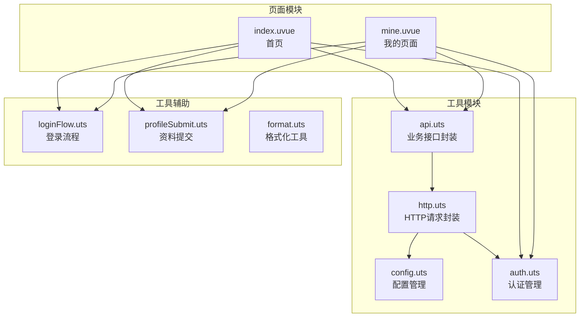
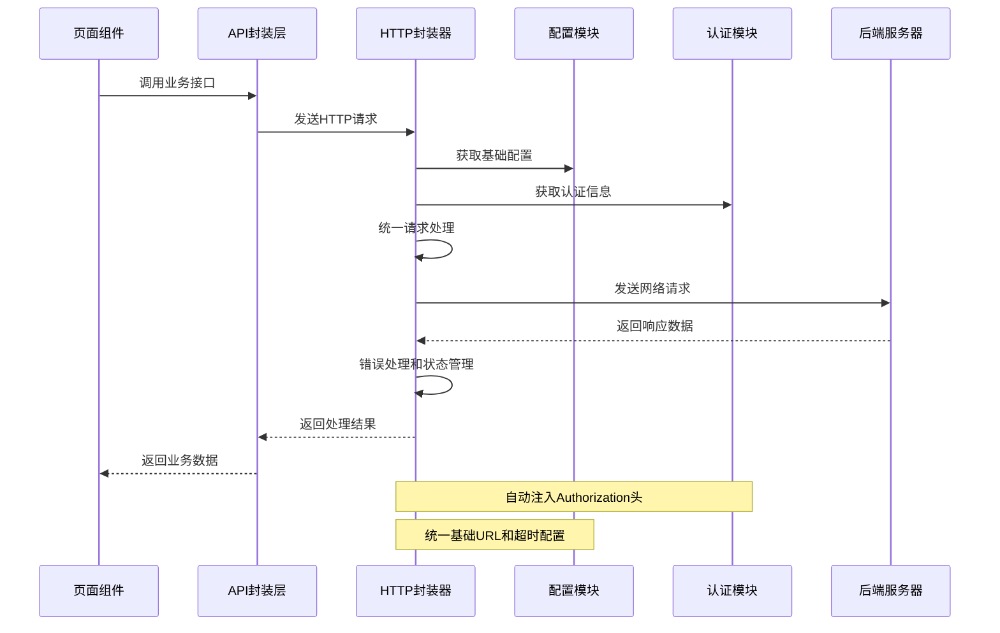
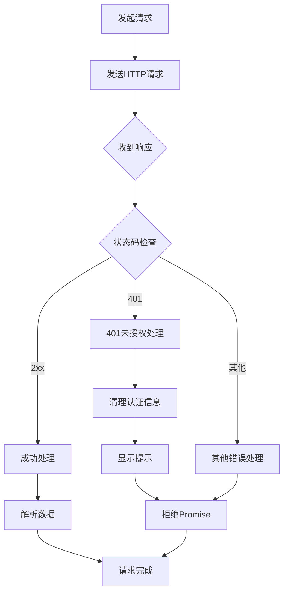
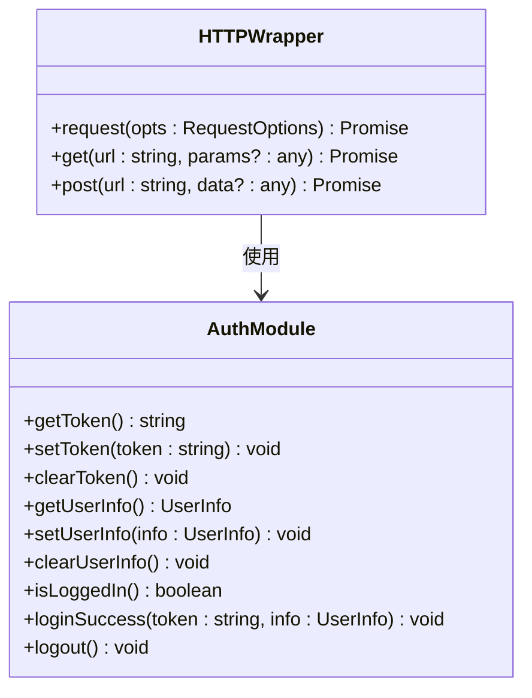
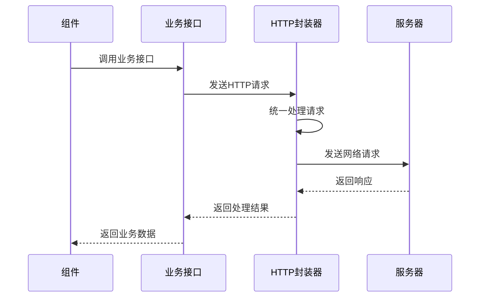
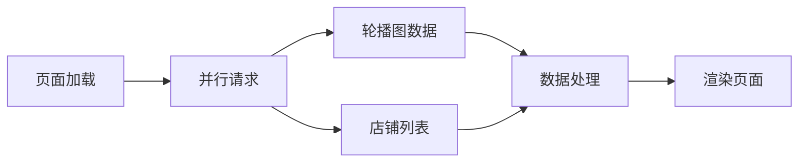
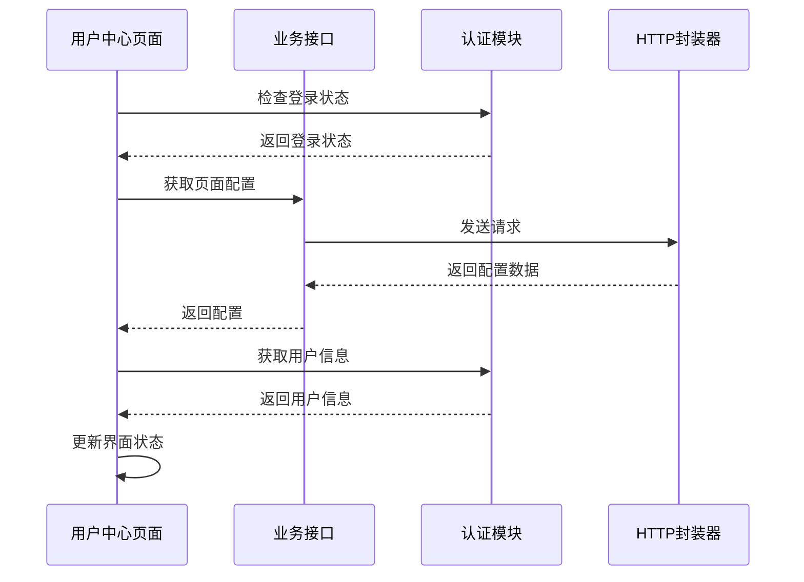
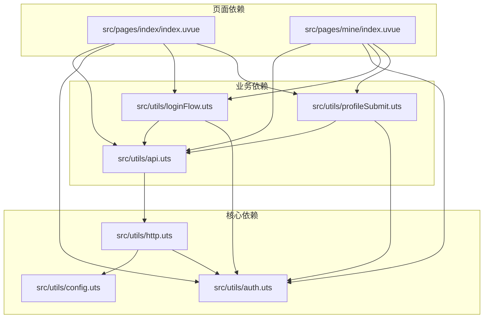

# HTTP请求封装器

<cite>
**本文档引用的文件**
- [http.uts](file://src/utils/http.uts)
- [config.uts](file://src/utils/config.uts)
- [api.uts](file://src/utils/api.uts)
- [auth.uts](file://src/utils/auth.uts)
- [loginFlow.uts](file://src/utils/loginFlow.uts)
- [profileSubmit.uts](file://src/utils/profileSubmit.uts)
- [format.uts](file://src/utils/format.uts)
- [index.uvue](file://src/pages/index/index.uvue)
- [mine.uvue](file://src/pages/mine/index.uvue)
</cite>

## 目录
1. [简介](#简介)
2. [项目结构](#项目结构)
3. [核心组件](#核心组件)
4. [架构概览](#架构概览)
5. [详细组件分析](#详细组件分析)
6. [依赖分析](#依赖分析)
7. [性能考虑](#性能考虑)
8. [故障排除指南](#故障排除指南)
9. [结论](#结论)
10. [附录](#附录)

## 简介

本文档详细介绍了蓝莓摄影小程序项目的HTTP请求封装器技术实现。该封装器基于uni-app框架，提供了统一的HTTP请求处理机制，包括请求拦截器、响应拦截器、错误处理策略、认证token自动注入、请求头统一处理等功能。

系统采用模块化设计，通过`http.uts`模块提供核心请求能力，`config.uts`模块管理配置，`auth.uts`模块处理认证状态，`api.uts`模块提供业务接口封装。整个架构遵循单一职责原则，确保了代码的可维护性和可扩展性。

## 项目结构

该项目采用功能模块化的组织方式，HTTP相关的核心文件分布如下：



**图表来源**
- [http.uts:1-82](file://src/utils/http.uts#L1-L82)
- [config.uts:1-12](file://src/utils/config.uts#L1-L12)
- [auth.uts:1-149](file://src/utils/auth.uts#L1-L149)
- [api.uts:1-312](file://src/utils/api.uts#L1-L312)

**章节来源**
- [http.uts:1-82](file://src/utils/http.uts#L1-L82)
- [config.uts:1-12](file://src/utils/config.uts#L1-L12)
- [auth.uts:1-149](file://src/utils/auth.uts#L1-L149)
- [api.uts:1-312](file://src/utils/api.uts#L1-L312)

## 核心组件

### HTTP请求封装器

HTTP请求封装器是整个系统的核心组件，提供了统一的请求处理机制。其主要特性包括：

- **请求统一处理**：集中处理所有HTTP请求，确保一致的错误处理和状态管理
- **认证集成**：自动注入Bearer token，支持无感认证
- **配置管理**：通过配置模块统一管理基础URL和超时参数
- **加载状态**：支持可选的加载状态显示
- **错误处理**：完善的错误处理策略，包括401未授权处理

### 配置管理模块

配置管理模块负责管理HTTP请求的基础配置，包括：
- **基础URL设置**：统一的API基础地址
- **超时参数**：全局超时时间配置
- **环境切换**：支持不同环境的配置管理

### 认证管理模块

认证管理模块处理用户认证状态和token管理：
- **Token存储**：基于localStorage的token持久化
- **用户信息管理**：完整的用户信息生命周期管理
- **登录状态检测**：便捷的登录状态检查接口

**章节来源**
- [http.uts:20-82](file://src/utils/http.uts#L20-L82)
- [config.uts:7-12](file://src/utils/config.uts#L7-L12)
- [auth.uts:15-149](file://src/utils/auth.uts#L15-L149)

## 架构概览

系统采用分层架构设计，各层职责明确，耦合度低：



**图表来源**
- [http.uts:20-73](file://src/utils/http.uts#L20-L73)
- [api.uts:27-312](file://src/utils/api.uts#L27-L312)
- [config.uts:7-12](file://src/utils/config.uts#L7-L12)
- [auth.uts:21-52](file://src/utils/auth.uts#L21-L52)

## 详细组件分析

### HTTP请求封装器核心实现

HTTP请求封装器提供了三个核心方法：`request`、`get`、`post`，每个方法都有特定的用途和配置选项。

#### 请求配置选项详解

| 配置项 | 类型 | 默认值 | 描述 |
|--------|------|--------|------|
| url | string | 必填 | 请求的API路径，支持相对路径和绝对路径 |
| method | HttpMethod | 'GET' | HTTP请求方法，支持GET、POST、PUT、DELETE |
| data | any | undefined | 请求体数据，GET请求时作为查询参数 |
| header | Record<string, string> | {} | 自定义请求头，会与默认头合并 |
| showLoading | boolean | false | 是否显示加载状态 |

#### 请求拦截器机制

HTTP封装器实现了以下请求拦截器：

1. **URL处理拦截器**：自动处理相对路径和绝对路径
2. **认证拦截器**：动态获取token并注入Authorization头
3. **请求头拦截器**：统一设置Content-Type和应用标识
4. **加载状态拦截器**：根据配置显示/隐藏加载状态

#### 响应拦截器机制

响应拦截器处理以下场景：

1. **状态码验证**：检查HTTP状态码范围
2. **401未授权处理**：自动清理认证信息并提示用户
3. **数据提取**：从响应对象中提取实际数据
4. **错误包装**：将底层错误包装为统一格式

#### 错误处理策略

系统实现了多层次的错误处理：



**图表来源**
- [http.uts:47-71](file://src/utils/http.uts#L47-L71)

**章节来源**
- [http.uts:6-12](file://src/utils/http.uts#L6-L12)
- [http.uts:20-82](file://src/utils/http.uts#L20-L82)

### 配置模块集成

配置模块提供了统一的配置管理接口，支持基础URL和超时时间的配置。

#### 配置结构定义

```typescript
interface HttpConfig {
  baseURL: string
  timeout: number
}
```

#### 配置获取机制

配置模块通过`getHttpConfig()`函数提供配置，支持不同环境的配置切换。当前配置为测试环境，生产环境需要替换为实际的域名。

**章节来源**
- [config.uts:2-12](file://src/utils/config.uts#L2-L12)

### 认证模块集成

认证模块与HTTP封装器深度集成，实现了自动认证token注入和状态管理。

#### Token管理机制



**图表来源**
- [auth.uts:21-149](file://src/utils/auth.uts#L21-L149)
- [http.uts:24-36](file://src/utils/http.uts#L24-L36)

#### 自动认证注入

HTTP封装器在每次请求时都会动态获取最新的token，确保认证信息的时效性。只有当token存在时才会添加Authorization头，避免不必要的请求头。

**章节来源**
- [auth.uts:15-52](file://src/utils/auth.uts#L15-L52)
- [http.uts:24-36](file://src/utils/http.uts#L24-L36)

### 业务接口封装

API模块提供了丰富的业务接口封装，每个接口都基于统一的HTTP封装器实现。

#### 接口分类

系统提供了多个业务领域的接口封装：

1. **客片管理接口**：包括分类、列表、详情等
2. **用户认证接口**：微信登录、手机号绑定、用户信息管理
3. **收藏点赞接口**：收藏、点赞功能
4. **搜索接口**：相册模糊搜索
5. **店铺接口**：获取启用的店铺列表
6. **页面配置接口**：中台页配置获取

#### 接口使用模式

所有业务接口都遵循统一的使用模式：



**图表来源**
- [api.uts:27-312](file://src/utils/api.uts#L27-L312)
- [http.uts:20-82](file://src/utils/http.uts#L20-L82)

**章节来源**
- [api.uts:1-312](file://src/utils/api.uts#L1-L312)

### 页面集成示例

系统中的页面组件展示了HTTP封装器的实际使用方式。

#### 首页数据加载

首页通过并行加载多个接口来提升用户体验：



**图表来源**
- [index.uvue:127-141](file://src/pages/index/index.uvue#L127-L141)

#### 用户中心数据加载

用户中心页面展示了更复杂的认证和数据加载流程：



**图表来源**
- [mine.uvue:187-236](file://src/pages/mine/index.uvue#L187-L236)
- [mine.uvue:198-206](file://src/pages/mine/index.uvue#L198-L206)

**章节来源**
- [index.uvue:124-142](file://src/pages/index/index.uvue#L124-L142)
- [mine.uvue:187-236](file://src/pages/mine/index.uvue#L187-L236)

## 依赖分析

系统采用模块化依赖设计，各模块之间的依赖关系清晰明确：



**图表来源**
- [http.uts:1-3](file://src/utils/http.uts#L1-L3)
- [api.uts:1-2](file://src/utils/api.uts#L1-L2)
- [loginFlow.uts:8-9](file://src/utils/loginFlow.uts#L8-L9)
- [profileSubmit.uts:5-6](file://src/utils/profileSubmit.uts#L5-L6)

### 依赖关系特点

1. **单向依赖**：HTTP封装器不依赖业务模块，保持通用性
2. **松耦合**：业务模块通过HTTP封装器间接依赖网络层
3. **可替换性**：配置模块可以独立替换，不影响其他模块
4. **可测试性**：模块间依赖清晰，便于单元测试

**章节来源**
- [http.uts:1-3](file://src/utils/http.uts#L1-L3)
- [api.uts:1-2](file://src/utils/api.uts#L1-L2)

## 性能考虑

### 请求优化策略

1. **并行请求**：页面加载时使用Promise.all进行并行请求，减少总等待时间
2. **缓存策略**：合理利用浏览器缓存，避免重复请求相同数据
3. **懒加载**：非关键资源采用懒加载方式，提升首屏速度
4. **请求去重**：避免同一请求的重复发送

### 内存管理

1. **及时清理**：请求完成后及时清理事件监听和定时器
2. **状态管理**：合理管理组件状态，避免内存泄漏
3. **资源释放**：及时释放图片等大资源的引用

### 网络优化

1. **超时控制**：合理的超时时间设置，避免长时间阻塞
2. **重试机制**：对于临时性错误提供重试机制
3. **错误降级**：网络异常时提供友好的错误提示

## 故障排除指南

### 常见问题及解决方案

#### 1. 认证失败问题

**问题描述**：用户登录后仍然出现401未授权错误

**排查步骤**：
1. 检查token是否正确存储
2. 验证Authorization头是否正确注入
3. 确认服务器端token有效性

**解决方案**：
- 在请求前手动刷新token
- 检查token过期时间
- 实现token自动刷新机制

#### 2. 跨域问题

**问题描述**：请求出现跨域错误

**排查步骤**：
1. 检查基础URL配置
2. 验证服务器CORS设置
3. 确认请求头配置

**解决方案**：
- 确保基础URL指向正确的服务器
- 配置服务器端CORS白名单
- 检查代理配置

#### 3. 超时问题

**问题描述**：请求长时间无响应

**排查步骤**：
1. 检查网络连接状态
2. 验证服务器响应时间
3. 调整超时配置

**解决方案**：
- 增加超时时间
- 实现请求重试机制
- 优化服务器性能

**章节来源**
- [http.uts:47-71](file://src/utils/http.uts#L47-L71)
- [auth.uts:21-52](file://src/utils/auth.uts#L21-L52)

### 调试技巧

1. **日志记录**：在关键节点添加详细的日志输出
2. **断点调试**：使用浏览器开发者工具进行断点调试
3. **网络监控**：监控网络请求的详细信息
4. **状态检查**：定期检查应用状态和数据流

## 结论

HTTP请求封装器为蓝莓摄影小程序提供了强大而灵活的网络通信能力。通过模块化的设计和统一的处理机制，系统实现了：

1. **统一的请求处理**：所有HTTP请求都经过统一的处理流程
2. **完善的错误处理**：多层次的错误处理和恢复机制
3. **灵活的配置管理**：支持不同环境的配置切换
4. **自动认证集成**：无缝的认证状态管理和token注入
5. **良好的扩展性**：清晰的模块边界，便于功能扩展

该封装器不仅满足了当前业务需求，还为未来的功能扩展和技术演进奠定了坚实的基础。通过持续的优化和完善，相信能够为用户提供更好的使用体验。

## 附录

### 使用示例

#### 基本请求示例

```typescript
// GET请求示例
const data = await api.getAlbumList({
  shopId: 1,
  page: 1,
  size: 10
})

// POST请求示例
const result = await api.toggleLike({
  albumId: 123
})
```

#### 高级配置示例

```typescript
// 自定义请求头
const response = await http.request({
  url: '/api/custom',
  method: 'POST',
  data: payload,
  header: {
    'Custom-Header': 'value'
  },
  showLoading: true
})
```

### 最佳实践

1. **统一错误处理**：所有API调用都要进行错误处理
2. **合理使用加载状态**：复杂操作时显示加载状态
3. **及时清理资源**：组件销毁时清理相关资源
4. **保持配置一致性**：确保各模块使用相同的配置
5. **关注性能优化**：合理安排请求顺序和数量