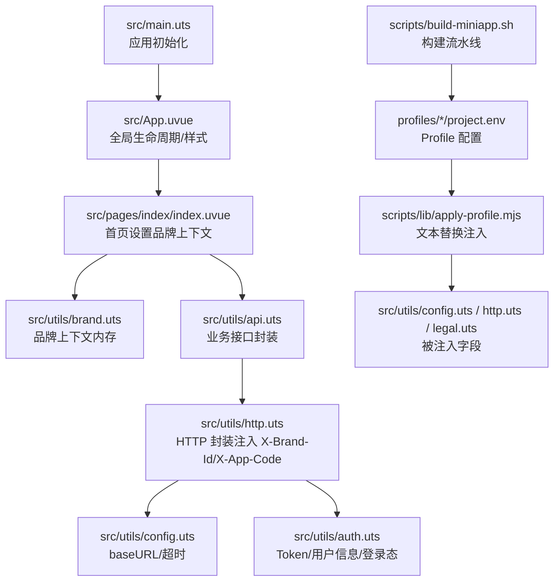
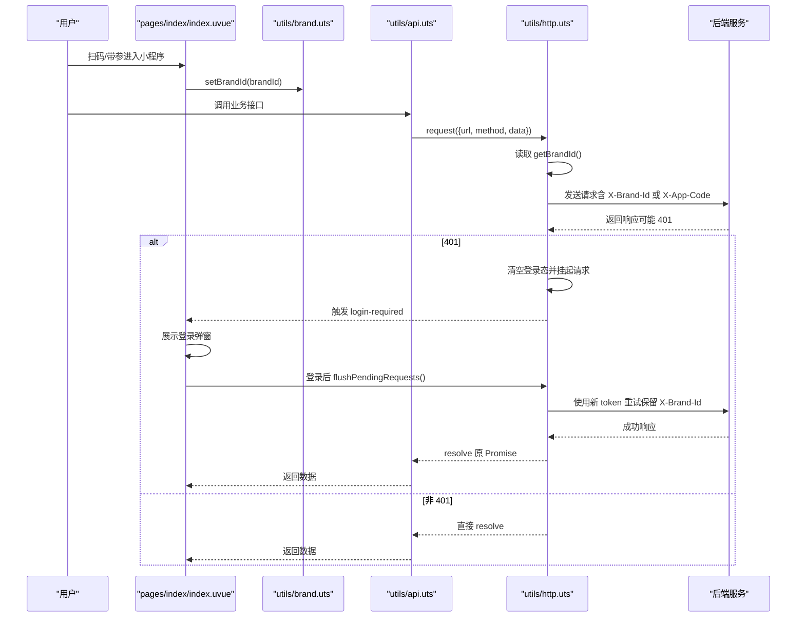
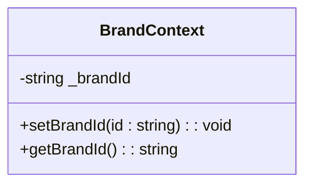
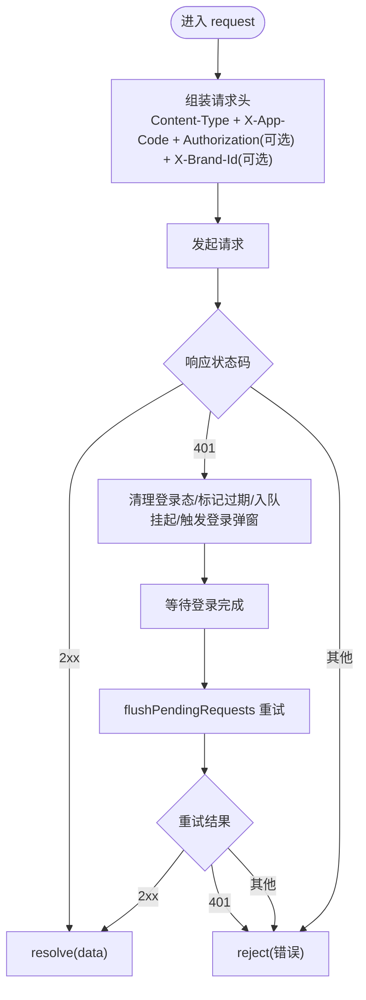
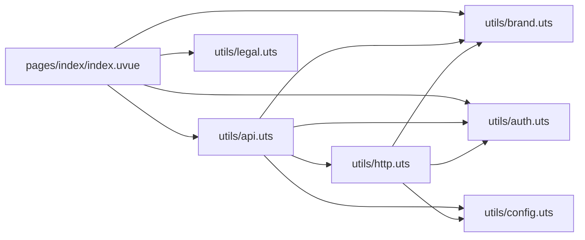

# 多品牌上下文系统

<cite>
**本文引用的文件**   
- [README.md](file://README.md)
- [package.json](file://package.json)
- [src/main.uts](file://src/main.uts)
- [src/App.uvue](file://src/App.uvue)
- [src/utils/brand.uts](file://src/utils/brand.uts)
- [src/utils/http.uts](file://src/utils/http.uts)
- [src/utils/api.uts](file://src/utils/api.uts)
- [src/utils/config.uts](file://src/utils/config.uts)
- [src/utils/auth.uts](file://src/utils/auth.uts)
- [src/utils/legal.uts](file://src/utils/legal.uts)
- [src/pages/index/index.uvue](file://src/pages/index/index.uvue)
- [profiles/blueberry/project.env](file://profiles/blueberry/project.env)
- [profiles/huahua/project.env](file://profiles/huahua/project.env)
- [scripts/lib/apply-profile.mjs](file://scripts/lib/apply-profile.mjs)
- [scripts/build-miniapp.sh](file://scripts/build-miniapp.sh)
</cite>

## 目录
1. [简介](#简介)
2. [项目结构](#项目结构)
3. [核心组件](#核心组件)
4. [架构总览](#架构总览)
5. [详细组件分析](#详细组件分析)
6. [依赖关系分析](#依赖关系分析)
7. [性能与可靠性](#性能与可靠性)
8. [故障排查指南](#故障排查指南)
9. [结论](#结论)
10. [附录](#附录)

## 简介
本仓库是一个基于 uni-app x（Vue 3 + UTS/TypeScript）的微信小程序模板，内置“多项目 Profile”机制与一键构建/校验/发布脚本。在多品牌上下文中，系统通过运行时内存保存“品牌编码”，在扫码或带参进入小程序时注入 X-Brand-Id 请求头，实现同一套源码对多个品牌的差异化路由与数据隔离；当无品牌上下文时，自动回退到历史逻辑（X-App-Code），保证向后兼容。

## 项目结构
- 源码集中在 src/ 下，包含页面、组件、工具模块与应用入口。
- profiles/ 存放各项目的私有配置（project.env），由脚本在构建前注入到源码与产物中。
- scripts/ 提供 Profile 应用、模板同步、构建、校验与发布的完整流水线。

图表来源 
- [src/main.uts:1-9](file://src/main.uts#L1-L9)
- [src/App.uvue:1-335](file://src/App.uvue#L1-L335)
- [src/pages/index/index.uvue:101-130](file://src/pages/index/index.uvue#L101-L130)
- [src/utils/brand.uts:1-22](file://src/utils/brand.uts#L1-L22)
- [src/utils/api.uts:1-710](file://src/utils/api.uts#L1-L710)
- [src/utils/http.uts:1-184](file://src/utils/http.uts#L1-L184)
- [src/utils/config.uts:1-13](file://src/utils/config.uts#L1-L13)
- [src/utils/auth.uts:1-171](file://src/utils/auth.uts#L1-L171)
- [profiles/blueberry/project.env:1-23](file://profiles/blueberry/project.env#L1-L23)
- [profiles/huahua/project.env:1-24](file://profiles/huahua/project.env#L1-L24)
- [scripts/lib/apply-profile.mjs:1-190](file://scripts/lib/apply-profile.mjs#L1-L190)
- [scripts/build-miniapp.sh:1-106](file://scripts/build-miniapp.sh#L1-L106)

章节来源
- [README.md:85-130](file://README.md#L85-L130)
- [package.json:1-48](file://package.json#L1-L48)

## 核心组件
- 品牌上下文（brand.uts）：纯内存保存品牌编码，提供 set/get 方法，空串表示无品牌上下文。
- HTTP 层（http.uts）：统一 request/get/post，自动附加 Authorization、X-App-Code，并在有品牌上下文时注入 X-Brand-Id；处理 401 挂起队列与登录后重试。
- 业务 API（api.uts）：封装所有后端接口，上传场景单独注入品牌头；同样支持 401 挂起与重试。
- 认证（auth.uts）：管理 token、用户信息与登录过期标志，提供合并写入与状态消费。
- 配置（config.uts）：集中 baseURL 与超时，由 Profile 注入。
- 合规（legal.uts）：导出小程序名称与协议跳转函数，由 Profile 注入名称。

章节来源
- [src/utils/brand.uts:1-22](file://src/utils/brand.uts#L1-L22)
- [src/utils/http.uts:1-184](file://src/utils/http.uts#L1-L184)
- [src/utils/api.uts:1-710](file://src/utils/api.uts#L1-L710)
- [src/utils/auth.uts:1-171](file://src/utils/auth.uts#L1-L171)
- [src/utils/config.uts:1-13](file://src/utils/config.uts#L1-L13)
- [src/utils/legal.uts:1-16](file://src/utils/legal.uts#L1-L16)

## 架构总览
多品牌上下文的关键在于“运行时注入 + 请求头透传”。首页根据 scene/brandId 设置品牌上下文，后续所有请求经 http.uts 与 api.uts 自动携带 X-Brand-Id；若无品牌上下文则回退到 X-App-Code。Profile 机制确保不同品牌拥有独立的 AppID、域名、标题等静态配置。

图表来源 
- [src/pages/index/index.uvue:101-130](file://src/pages/index/index.uvue#L101-L130)
- [src/utils/brand.uts:1-22](file://src/utils/brand.uts#L1-L22)
- [src/utils/api.uts:1-710](file://src/utils/api.uts#L1-L710)
- [src/utils/http.uts:1-184](file://src/utils/http.uts#L1-L184)

## 详细组件分析

### 品牌上下文（brand.uts）
- 设计要点：纯内存、不持久化；冷启动即清空；空串代表无品牌上下文，保持与历史行为一致。
- 复杂度：O(1) 读写；线程安全由单进程 JS 上下文保障。
- 优化建议：可考虑扩展为多键值（如 brandId + tenantId），但需评估内存与并发影响。

图表来源 
- [src/utils/brand.uts:1-22](file://src/utils/brand.uts#L1-L22)

章节来源
- [src/utils/brand.uts:1-22](file://src/utils/brand.uts#L1-L22)

### HTTP 层（http.uts）
- 职责：统一请求封装、自动注入 Authorization/X-App-Code/X-Brand-Id、401 挂起队列与登录后重试。
- 关键流程：
  - 首次 401：清理登录态、标记过期、入队挂起请求、触发登录弹窗。
  - 登录成功：flushPendingRequests 重放队列，重新注入最新 token 与品牌上下文。
- 错误处理：区分网络失败与业务失败；避免重复弹窗与死循环。

图表来源 
- [src/utils/http.uts:1-184](file://src/utils/http.uts#L1-L184)

章节来源
- [src/utils/http.uts:1-184](file://src/utils/http.uts#L1-L184)

### 业务 API（api.uts）
- 职责：封装所有后端接口，包括轮播、分类、相册、登录、手机号绑定、点赞收藏、搜索、店铺、AI 试衣、信用额度等。
- 上传特殊处理：uploadFile 不走 http.uts，需手动注入 Authorization 与 X-Brand-Id；同样支持 401 挂起与重试。
- 类型定义：为各类接口返回数据提供明确类型，便于前端消费。

章节来源
- [src/utils/api.uts:1-710](file://src/utils/api.uts#L1-L710)

### 认证（auth.uts）
- 职责：token 存取、用户信息管理、登录过期标志、登录/登出流程。
- 合并写入：mergeUserInfo 仅覆盖非空字段，防止部分接口返回缺失字段覆盖已有数据。

章节来源
- [src/utils/auth.uts:1-171](file://src/utils/auth.uts#L1-L171)

### 配置与合规（config.uts / legal.uts）
- config.uts：集中 baseURL 与超时，由 Profile 注入。
- legal.uts：导出小程序名称与协议跳转函数，由 Profile 注入名称。

章节来源
- [src/utils/config.uts:1-13](file://src/utils/config.uts#L1-L13)
- [src/utils/legal.uts:1-16](file://src/utils/legal.uts#L1-L16)

### 首页（pages/index/index.uvue）
- 职责：根据 scene/brandId 设置品牌上下文；监听 login-required 事件弹出登录弹窗；处理手机号授权与用户资料完善。

章节来源
- [src/pages/index/index.uvue:101-130](file://src/pages/index/index.uvue#L101-L130)

## 依赖关系分析
- 模块耦合：
  - api.uts 依赖 http.uts、config.uts、auth.uts、brand.uts。
  - http.uts 依赖 auth.uts、brand.uts、config.uts。
  - pages/index/index.uvue 依赖 brand.uts、api.uts、auth.uts、legal.uts。
- 外部依赖：uni.request/uni.uploadFile、微信开发者工具、npm 包。
- 构建期依赖：Profile 脚本将 project.env 注入到 config.uts、http.uts、legal.uts 等文件。

图表来源 
- [src/pages/index/index.uvue:101-130](file://src/pages/index/index.uvue#L101-L130)
- [src/utils/api.uts:1-710](file://src/utils/api.uts#L1-L710)
- [src/utils/http.uts:1-184](file://src/utils/http.uts#L1-L184)
- [src/utils/brand.uts:1-22](file://src/utils/brand.uts#L1-L22)
- [src/utils/auth.uts:1-171](file://src/utils/auth.uts#L1-L171)
- [src/utils/config.uts:1-13](file://src/utils/config.uts#L1-L13)
- [src/utils/legal.uts:1-16](file://src/utils/legal.uts#L1-L16)

章节来源
- [README.md:155-167](file://README.md#L155-L167)

## 性能与可靠性
- 性能特性：
  - 品牌上下文为 O(1) 内存读写，无 IO 开销。
  - 请求挂起队列避免重复登录弹窗与并发 401 风暴。
  - 上传接口独立队列，避免阻塞普通请求。
- 可靠性：
  - 401 处理严格：flush 期间不再入队，避免死循环。
  - 登录成功后统一重试，保证用户体验一致性。
- 优化建议：
  - 对高频接口可引入本地缓存（注意失效策略）。
  - 上传队列可按品牌分桶，减少跨品牌干扰。

[本节为通用指导，不直接分析具体文件]

## 故障排查指南
- 常见问题定位：
  - 未携带 X-Brand-Id：检查首页是否调用 setBrandId，确认 scene/brandId 解析正确。
  - 401 频繁出现：检查 token 存储与刷新流程，确认 flushPendingRequests 是否被调用。
  - 上传失败：确认 buildUploadHeader 是否正确注入 Authorization 与 X-Brand-Id。
  - Profile 未生效：检查 apply-profile.mjs 是否成功替换目标文件，verify 是否通过。
- 调试步骤：
  - 查看 dist/build/mp-weixin/utils/http.js 与 utils/api.js 中的请求头生成逻辑。
  - 在微信开发者工具控制台观察 login-required 事件触发时机。
  - 使用 verify-miniapp.sh 校验产物一致性。

章节来源
- [src/utils/http.uts:1-184](file://src/utils/http.uts#L1-L184)
- [src/utils/api.uts:1-710](file://src/utils/api.uts#L1-L710)
- [scripts/lib/apply-profile.mjs:1-190](file://scripts/lib/apply-profile.mjs#L1-L190)

## 结论
多品牌上下文系统以“运行时内存 + 请求头注入”为核心，结合 Profile 机制与自动化构建流水线，实现了“一套源码、多品牌复用”的目标。通过严格的 401 处理与上传队列管理，系统在用户体验与可靠性之间取得良好平衡。未来可在缓存策略与队列分桶方面进一步优化。

[本节为总结性内容，不直接分析具体文件]

## 附录
- Profile 字段映射与构建产物校验详见 README 与脚本说明。
- 快速开始与常见工作流请参考 README 对应章节。

章节来源
- [README.md:169-286](file://README.md#L169-L286)
- [scripts/build-miniapp.sh:1-106](file://scripts/build-miniapp.sh#L1-L106)
