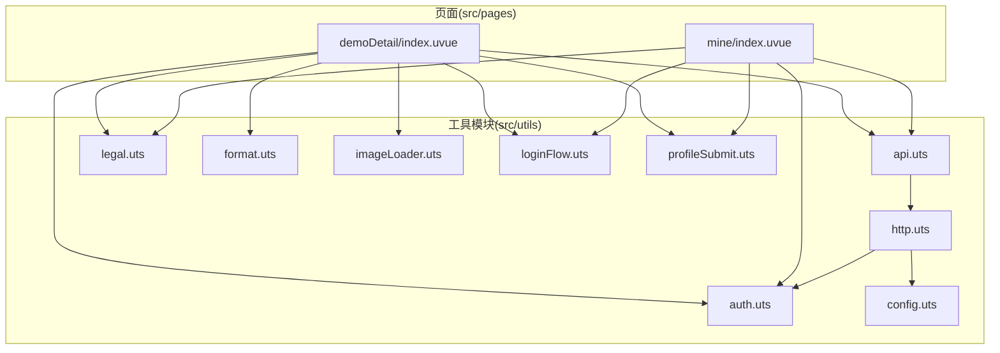
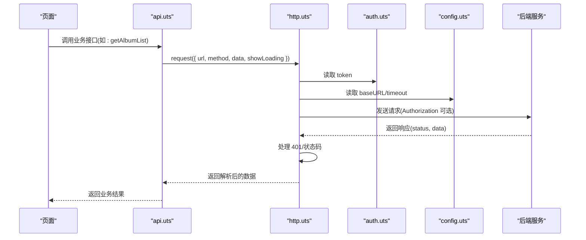
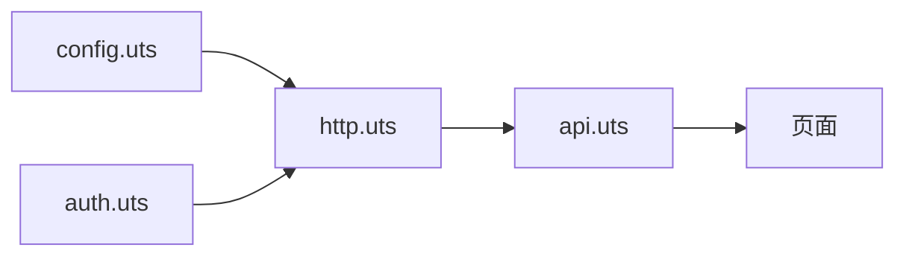

# 工具模块详解

<cite>
**本文引用的文件**
- [api.uts](file://src/utils/api.uts)
- [http.uts](file://src/utils/http.uts)
- [auth.uts](file://src/utils/auth.uts)
- [config.uts](file://src/utils/config.uts)
- [legal.uts](file://src/utils/legal.uts)
- [format.uts](file://src/utils/format.uts)
- [imageLoader.uts](file://src/utils/imageLoader.uts)
- [loginFlow.uts](file://src/utils/loginFlow.uts)
- [profileSubmit.uts](file://src/utils/profileSubmit.uts)
- [demoDetail/index.uvue](file://src/pages/demoDetail/index.uvue)
- [mine/index.uvue](file://src/pages/mine/index.uvue)
</cite>

## 目录
1. [简介](#简介)
2. [项目结构](#项目结构)
3. [核心组件](#核心组件)
4. [架构总览](#架构总览)
5. [详细组件分析](#详细组件分析)
6. [依赖关系分析](#依赖关系分析)
7. [性能考量](#性能考量)
8. [故障排查指南](#故障排查指南)
9. [结论](#结论)
10. [附录](#附录)

## 简介
本文件面向蓝莓小程序的开发者，系统性梳理 src/utils 目录下的工具模块，重点解析以下方面：
- api.uts 的接口封装策略：接口分类、参数校验、响应处理
- http.uts 的请求统一处理、错误处理、超时控制、加载状态管理
- auth.uts 的认证流程、token 管理、用户状态检查
- config.uts 的配置管理、API 基础 URL 设置、超时参数配置
- legal.uts 的合规页面管理、协议名称处理
- 其他实用工具：format.uts、imageLoader.uts、loginFlow.uts、profileSubmit.uts
- 提供使用指南、扩展建议与最佳实践

## 项目结构
工具模块位于 src/utils 下，围绕“网络请求”“认证”“配置”“合规”“通用工具”五大维度组织，页面通过导入相应模块完成业务功能。

图表来源
- [api.uts](file://src/utils/api.uts)
- [http.uts](file://src/utils/http.uts)
- [auth.uts](file://src/utils/auth.uts)
- [config.uts](file://src/utils/config.uts)
- [legal.uts](file://src/utils/legal.uts)
- [format.uts](file://src/utils/format.uts)
- [imageLoader.uts](file://src/utils/imageLoader.uts)
- [loginFlow.uts](file://src/utils/loginFlow.uts)
- [profileSubmit.uts](file://src/utils/profileSubmit.uts)
- [demoDetail/index.uvue](file://src/pages/demoDetail/index.uvue)
- [mine/index.uvue](file://src/pages/mine/index.uvue)

章节来源
- [api.uts](file://src/utils/api.uts)
- [http.uts](file://src/utils/http.uts)
- [auth.uts](file://src/utils/auth.uts)
- [config.uts](file://src/utils/config.uts)
- [legal.uts](file://src/utils/legal.uts)
- [format.uts](file://src/utils/format.uts)
- [imageLoader.uts](file://src/utils/imageLoader.uts)
- [loginFlow.uts](file://src/utils/loginFlow.uts)
- [profileSubmit.uts](file://src/utils/profileSubmit.uts)
- [demoDetail/index.uvue](file://src/pages/demoDetail/index.uvue)
- [mine/index.uvue](file://src/pages/mine/index.uvue)

## 核心组件
- api.uts：对后端接口进行二次封装，按领域拆分（客片、登录、点赞/收藏、搜索、店铺、中台页配置），统一返回结构与参数透传策略
- http.uts：统一请求入口，负责 URL 拼接、头部注入、鉴权、超时、错误处理、加载状态
- auth.uts：token 与用户信息的持久化、合并写入、登录状态判断
- config.uts：HTTP 基础配置（baseURL、timeout）
- legal.uts：合规页面导航与协议名称
- format.uts：数值格式化（万级单位）
- imageLoader.uts：图片预加载与并发超时保护
- loginFlow.uts：登录三步流程封装（静默登录→换取 token→绑定手机）
- profileSubmit.uts：头像/昵称提交与本地合并

章节来源
- [api.uts](file://src/utils/api.uts)
- [http.uts](file://src/utils/http.uts)
- [auth.uts](file://src/utils/auth.uts)
- [config.uts](file://src/utils/config.uts)
- [legal.uts](file://src/utils/legal.uts)
- [format.uts](file://src/utils/format.uts)
- [imageLoader.uts](file://src/utils/imageLoader.uts)
- [loginFlow.uts](file://src/utils/loginFlow.uts)
- [profileSubmit.uts](file://src/utils/profileSubmit.uts)

## 架构总览
工具层采用“低耦合、高内聚”的分层设计：
- config.uts 提供全局配置
- http.uts 作为网络层，集中处理鉴权、超时、错误与加载
- api.uts 在 http.uts 之上，按业务域封装具体接口
- auth.uts 与 http.uts 协作，自动注入 Authorization
- 页面仅感知 api.uts 的语义化接口与 auth.uts 的登录状态

图表来源
- [api.uts](file://src/utils/api.uts)
- [http.uts](file://src/utils/http.uts)
- [auth.uts](file://src/utils/auth.uts)
- [config.uts](file://src/utils/config.uts)

## 详细组件分析

### api.uts：接口封装策略
- 设计目的
  - 将 HTTP 层与业务层解耦，提供清晰的领域接口
  - 统一参数传递、分页结构、返回结构，便于页面消费
- 接口分类
  - 客片与导航：getImage、getalbum（已废弃）、getCategories、getAlbumList、getalbumDetail
  - 微信登录：wxLogin、wxBindPhone、wxGetUserInfo、wxUpdateUserInfo
  - 点赞/收藏：toggleLike、getLikeStatus、toggleFavorite、getFavoriteStatus、getFavoriteList
  - 搜索：searchAlbums
  - 店铺：getShops
  - 中台页配置：getPageConfig
- 参数验证与健壮性
  - 对于需要登录的接口，统一由 http.uts 自动注入 Authorization
  - 针对头像/昵称更新，仅透传非空字段，避免后端误覆盖
  - 分页接口统一透传 shopId、keyword、page、size 等参数
- 响应处理机制
  - 统一返回 { code, message, data } 结构，页面以 code === 200 或 0 作为成功判断
  - 部分接口返回复杂分页结构，便于页面直接渲染
- 使用建议
  - 页面调用前先检查登录状态（isLoggedIn），必要时引导登录
  - 对于公开接口，避免开启 showLoading，减少 UI 抖动

章节来源
- [api.uts](file://src/utils/api.uts)
- [http.uts](file://src/utils/http.uts)
- [auth.uts](file://src/utils/auth.uts)

### http.uts：请求统一处理
- 统一入口 request
  - URL 规范化：自动拼接 baseURL，支持绝对/相对路径
  - 头部注入：固定 Content-Type 与 X-App-Code，动态注入 Authorization（存在 token 时）
  - 超时控制：读取配置 timeout
  - 加载状态：根据 showLoading 控制 uni.showLoading/uni.hideLoading
- 错误处理
  - 401 未授权：清理 token 与用户信息，提示重新登录
  - 非 2xx：reject 并携带状态信息
  - fail：直接 reject
- 辅助方法
  - get/post：基于 request 的便捷封装
- 最佳实践
  - 对需要登录的接口，尽量显式传入 showLoading，避免频繁闪烁
  - 对公开接口，关闭 showLoading，提升交互流畅度

章节来源
- [http.uts](file://src/utils/http.uts)
- [config.uts](file://src/utils/config.uts)
- [auth.uts](file://src/utils/auth.uts)

### auth.uts：认证流程与状态管理
- Token 管理
  - 读取/设置/清除 token，异常安全处理
  - 登录成功：setToken + setUserInfo
  - 登出：clearToken + clearUserInfo
- 用户信息管理
  - 读取/设置/合并写入用户信息
  - mergeUserInfo：仅用非空字段覆盖，避免历史头像/昵称被空值覆盖
- 登录状态检查
  - isLoggedIn：token 存在且非特殊字符串即视为已登录
- 与 api.uts 的协作
  - api.uts 的登录相关接口返回 token 与 userInfo，auth.uts 负责落盘
  - http.uts 读取 token 注入 Authorization，形成闭环

章节来源
- [auth.uts](file://src/utils/auth.uts)
- [api.uts](file://src/utils/api.uts)
- [http.uts](file://src/utils/http.uts)

### config.uts：配置管理
- 提供 HttpConfig：baseURL、timeout
- 当前默认 baseURL 指向测试环境，建议在不同环境通过 profile 或构建脚本替换
- 超时时间默认 15000ms，可根据网络环境调整

章节来源
- [config.uts](file://src/utils/config.uts)

### legal.uts：合规页面管理
- 协议名称：MINI_APP_NAME、USER_AGREEMENT_NAME、PRIVACY_POLICY_NAME
- 打开协议页面：openUserAgreement、openPrivacyPolicy
- 页面通过 uni.navigateTo 跳转至对应路由

章节来源
- [legal.uts](file://src/utils/legal.uts)

### format.uts：数值格式化
- 将数字格式化为展示字符串：小于 10000 直接返回；≥ 10000 格式化为 “X.X万”
- 用于点赞数、收藏数、浏览数等统一展示

章节来源
- [format.uts](file://src/utils/format.uts)

### imageLoader.uts：图片预加载
- 单图预加载：返回布尔值，成功 true、失败 false
- 批量预加载：Promise.all 并发，带超时保护，避免无限等待
- 页面可结合首屏封面图进行预加载，减少切换白屏

章节来源
- [imageLoader.uts](file://src/utils/imageLoader.uts)

### loginFlow.uts：登录三步流程
- 步骤
  - 静默登录获取 wx code
  - wxLogin 换取 token 与 userInfo，并调用 loginSuccess
  - wxBindPhone 绑定手机号，mergeUserInfo 合并写入
- 错误收敛
  - 任一步骤异常均收敛为 { ok:false }，phone 步骤失败不视为整体失败
- 与页面的协作
  - 页面负责 UX（弹窗、toast、关闭弹窗、打开 profile 弹窗）

章节来源
- [loginFlow.uts](file://src/utils/loginFlow.uts)
- [api.uts](file://src/utils/api.uts)
- [auth.uts](file://src/utils/auth.uts)

### profileSubmit.uts：头像/昵称提交
- 逻辑
  - 调用 wxUpdateUserInfo 更新后端
  - 成功后 mergeUserInfo 合并写入本地
- 错误收敛：异常统一返回 { ok:false }

章节来源
- [profileSubmit.uts](file://src/utils/profileSubmit.uts)
- [api.uts](file://src/utils/api.uts)
- [auth.uts](file://src/utils/auth.uts)

## 依赖关系分析
- 低耦合
  - api.uts 仅依赖 http.uts 与 auth.uts 的类型
  - http.uts 仅依赖 config.uts 与 auth.uts
  - 页面仅依赖 api.uts 与 auth.uts
- 关键依赖链
  - config.uts ← http.uts ← api.uts ← 页面
  - auth.uts ← http.uts ← api.uts ← 页面
- 无循环依赖

图表来源
- [config.uts](file://src/utils/config.uts)
- [http.uts](file://src/utils/http.uts)
- [auth.uts](file://src/utils/auth.uts)
- [api.uts](file://src/utils/api.uts)

章节来源
- [config.uts](file://src/utils/config.uts)
- [http.uts](file://src/utils/http.uts)
- [auth.uts](file://src/utils/auth.uts)
- [api.uts](file://src/utils/api.uts)

## 性能考量
- 请求层面
  - 合理使用 showLoading：公开接口关闭，关键操作开启
  - 统一超时时间，避免长时间阻塞 UI
- 数据层面
  - 批量状态查询接口（点赞/收藏）优先使用批量接口，减少多次请求
  - 分页接口合理设置 size，避免单页过大
- 图片层面
  - 首屏图片预加载，结合超时保护，避免阻塞
- 本地存储
  - 合并写入用户信息，避免频繁 IO 与覆盖风险

## 故障排查指南
- 401 未授权
  - 现象：出现“登录已过期，请重新登录”提示
  - 处理：http.uts 已自动清理 token 与用户信息，引导重新登录
- 请求失败
  - 现象：状态码非 2xx
  - 处理：检查 baseURL、接口路径、参数是否正确
- 登录流程异常
  - 现象：静默登录失败、wxLogin 失败、phone 绑定失败
  - 处理：loginFlow.uts 已收敛错误，页面根据 errorKind 提示用户
- 头像/昵称更新无效
  - 现象：后端返回成功，但本地未更新
  - 处理：profileSubmit.uts 与 loginFlow.uts 均通过 mergeUserInfo 合并写入，确保非空字段覆盖

章节来源
- [http.uts](file://src/utils/http.uts)
- [loginFlow.uts](file://src/utils/loginFlow.uts)
- [profileSubmit.uts](file://src/utils/profileSubmit.uts)
- [auth.uts](file://src/utils/auth.uts)

## 结论
本工具模块通过“配置-请求-认证-业务接口-页面”的清晰分层，实现了网络层与业务层的解耦，提供了统一的登录、鉴权、错误处理与加载体验。开发者在扩展新接口时，遵循现有封装策略与命名规范，即可快速集成并保持一致性。

## 附录

### 使用指南与最佳实践
- 页面如何调用
  - 导入 api.uts 的业务接口与 auth.uts 的登录状态/用户信息
  - 对需要登录的接口，先检查 isLoggedIn，否则引导登录
  - 对公开接口，谨慎开启 showLoading
- 扩展新接口
  - 在 api.uts 新增接口，复用 request，统一返回结构
  - 如需登录，无需手动注入 Authorization，由 http.uts 自动处理
  - 对批量状态查询，优先使用批量接口
- 登录流程
  - 使用 loginFlow.uts 执行三步流程
  - 页面负责 UX 与错误提示，工具层仅负责逻辑收敛
- 头像/昵称
  - 使用 profileSubmit.uts 提交，内部自动合并写入
- 合规页面
  - 使用 legal.uts 的协议名称与导航方法

章节来源
- [api.uts](file://src/utils/api.uts)
- [http.uts](file://src/utils/http.uts)
- [auth.uts](file://src/utils/auth.uts)
- [loginFlow.uts](file://src/utils/loginFlow.uts)
- [profileSubmit.uts](file://src/utils/profileSubmit.uts)
- [legal.uts](file://src/utils/legal.uts)
- [demoDetail/index.uvue](file://src/pages/demoDetail/index.uvue)
- [mine/index.uvue](file://src/pages/mine/index.uvue)