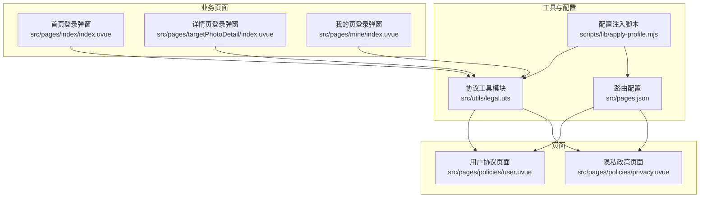
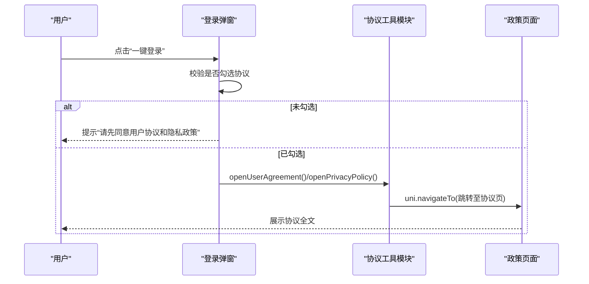
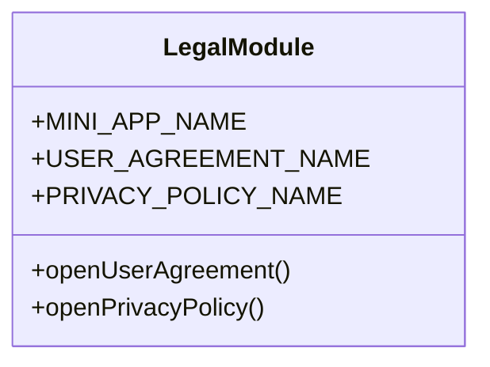
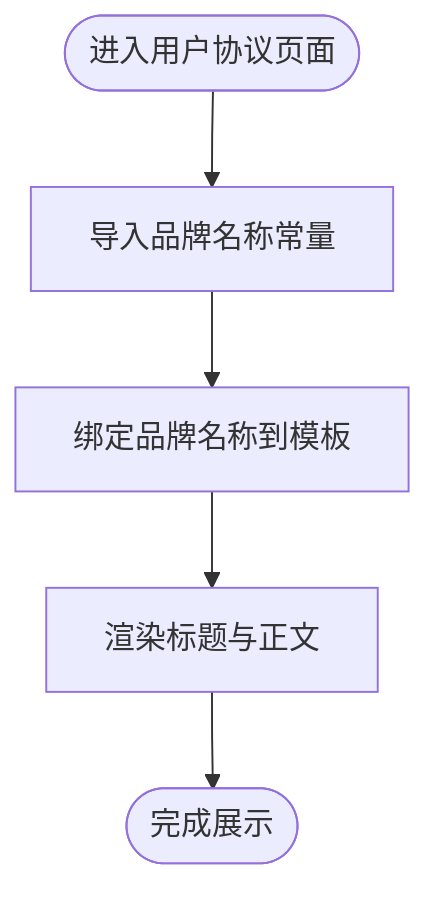
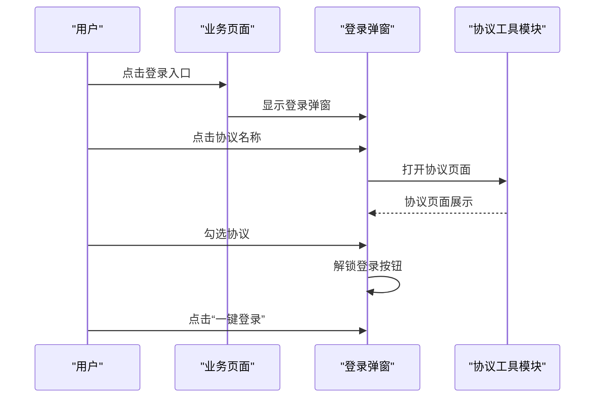
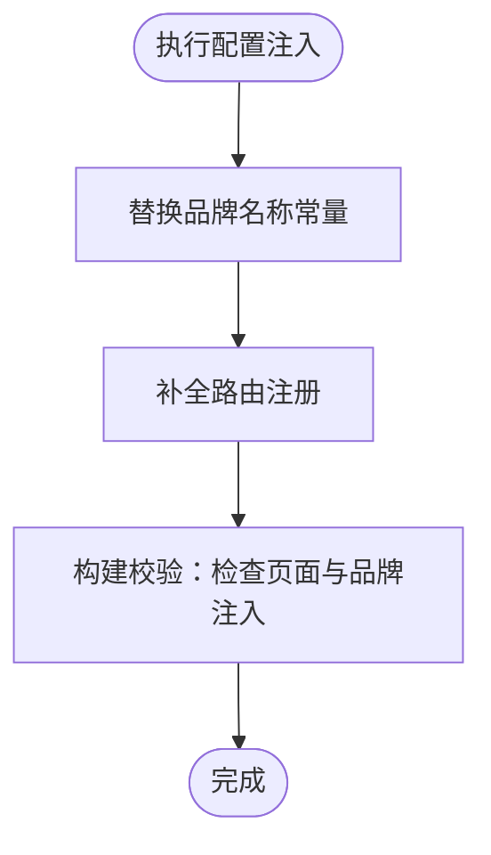
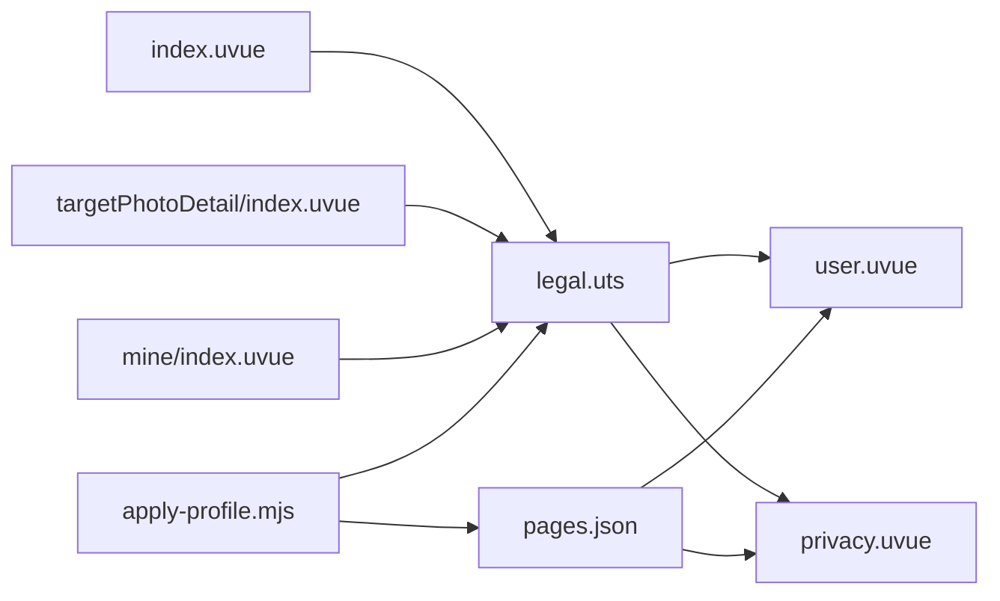

# 法律合规模块

<cite>
**本文引用的文件**
- [legal.uts](file://src/utils/legal.uts)
- [user.uvue](file://src/pages/policies/user.uvue)
- [privacy.uvue](file://src/pages/policies/privacy.uvue)
- [pages.json](file://src/pages.json)
- [apply-profile.mjs](file://scripts/lib/apply-profile.mjs)
- [wechat-auth-compliance.spec.md](file://.specanchor/global/wechat-auth-compliance.spec.md)
- [src-pages-policies.spec.md](file://.specanchor/modules/src-pages-policies.spec.md)
- [index.uvue](file://src/pages/index/index.uvue)
- [targetPhotoDetail/index.uvue](file://src/pages/targetPhotoDetail/index.uvue)
- [mine/index.uvue](file://src/pages/mine/index.uvue)
- [verify-miniapp.sh](file://scripts/verify-miniapp.sh)
</cite>

## 目录
1. [简介](#简介)
2. [项目结构](#项目结构)
3. [核心组件](#核心组件)
4. [架构总览](#架构总览)
5. [详细组件分析](#详细组件分析)
6. [依赖分析](#依赖分析)
7. [性能考虑](#性能考虑)
8. [故障排查指南](#故障排查指南)
9. [结论](#结论)
10. [附录](#附录)

## 简介
本文件面向“法律合规模块”的技术文档，聚焦 legal.uts 模块的合规管理机制，涵盖：
- 协议页面的动态加载与路由配置
- 协议名称的本地化与品牌注入
- 合规检查流程与登录弹窗中的协议勾选前置条件
- 合规页面的数据结构与渲染逻辑
- 与政策页面组件的集成关系
- 合规状态的检查与更新机制
- 完整的合规流程示例（首次启动、版本更新、用户同意记录）
- 合规性要求与最佳实践

## 项目结构
法律合规模块围绕两条政策页面（用户协议、隐私政策）展开，配合统一的协议入口与品牌注入机制，确保合规性与一致性。

图表来源
- [user.uvue:1-153](file://src/pages/policies/user.uvue#L1-L153)
- [privacy.uvue](file://src/pages/policies/privacy.uvue)
- [legal.uts:1-16](file://src/utils/legal.uts#L1-L16)
- [pages.json:44-54](file://src/pages.json#L44-L54)
- [apply-profile.mjs:100-135](file://scripts/lib/apply-profile.mjs#L100-L135)
- [index.uvue:44-70](file://src/pages/index/index.uvue#L44-L70)
- [targetPhotoDetail/index.uvue:51-77](file://src/pages/targetPhotoDetail/index.uvue#L51-L77)
- [mine/index.uvue:75-100](file://src/pages/mine/index.uvue#L75-L100)

章节来源
- [pages.json:44-54](file://src/pages.json#L44-L54)
- [src-pages-policies.spec.md:12-35](file://.specanchor/modules/src-pages-policies.spec.md#L12-L35)

## 核心组件
- 协议工具模块（legal.uts）
  - 提供品牌名称常量与协议页面跳转函数，统一协议命名与入口。
  - 关键导出：品牌名称、用户协议跳转、隐私政策跳转。
- 政策页面组件（user.uvue、privacy.uvue）
  - 承载协议全文，采用滚动容器展示，支持品牌名称插值注入。
  - 页面标题与导航栏标题在路由配置中定义。
- 路由与构建注入（pages.json、apply-profile.mjs）
  - 路由注册确保页面可访问；注入脚本负责品牌名称替换与路由补全。
- 登录弹窗（index.uvue、targetPhotoDetail/index.uvue、mine/index.uvue）
  - 在登录弹窗中展示协议名称并提供跳转入口，登录按钮受协议勾选前置条件控制。

章节来源
- [legal.uts:1-16](file://src/utils/legal.uts#L1-L16)
- [user.uvue:71-81](file://src/pages/policies/user.uvue#L71-L81)
- [pages.json:44-54](file://src/pages.json#L44-L54)
- [apply-profile.mjs:152-156](file://scripts/lib/apply-profile.mjs#L152-L156)
- [index.uvue:44-70](file://src/pages/index/index.uvue#L44-L70)
- [targetPhotoDetail/index.uvue:51-77](file://src/pages/targetPhotoDetail/index.uvue#L51-L77)
- [mine/index.uvue:75-100](file://src/pages/mine/index.uvue#L75-L100)

## 架构总览
法律合规模块遵循“统一入口、品牌注入、静态展示、路由校验”的设计原则，确保合规页面的一致性与可维护性。

图表来源
- [wechat-auth-compliance.spec.md:83-102](file://.specanchor/global/wechat-auth-compliance.spec.md#L83-L102)
- [legal.uts:5-15](file://src/utils/legal.uts#L5-L15)
- [index.uvue:88-98](file://src/pages/index/index.uvue#L88-L98)
- [targetPhotoDetail/index.uvue:64-74](file://src/pages/targetPhotoDetail/index.uvue#L64-L74)
- [mine/index.uvue:281-291](file://src/pages/mine/index.uvue#L281-L291)

## 详细组件分析

### 组件A：协议工具模块（legal.uts）
- 功能职责
  - 定义品牌名称常量，用于协议标题与正文的品牌注入。
  - 提供打开用户协议与隐私政策的导航函数，统一跳转入口。
- 数据结构与复杂度
  - 常量与函数均为 O(1) 访问，无额外数据结构开销。
- 依赖关系
  - 被政策页面与多个业务页面导入，形成单向依赖。
- 错误处理与边界
  - 导航函数依赖运行时框架能力，需确保路由配置正确。
- 性能影响
  - 导航为轻量操作，性能开销可忽略。

图表来源
- [legal.uts:1-16](file://src/utils/legal.uts#L1-L16)

章节来源
- [legal.uts:1-16](file://src/utils/legal.uts#L1-L16)

### 组件B：用户协议页面（user.uvue）
- 页面结构
  - 使用滚动视图容器承载协议内容，包含标题、元信息（更新日期/生效日期）、分节标题、段落与列表项、分割线与页脚声明。
- 品牌注入
  - 通过导入协议工具模块的常量，将品牌名称注入到标题与正文。
- 渲染逻辑
  - 采用模板插值绑定品牌名称，保证不同品牌配置下的一致展示。
- 合规要点
  - 页面为纯静态展示，无需登录态；正文日期与公司信息需手动维护。

图表来源
- [user.uvue:71-81](file://src/pages/policies/user.uvue#L71-L81)

章节来源
- [user.uvue:1-153](file://src/pages/policies/user.uvue#L1-L153)

### 组件C：隐私政策页面（privacy.uvue）
- 页面结构与渲染逻辑同用户协议页面，差异在于政策主题与条款内容。
- 品牌注入与合规要求一致。

章节来源
- [privacy.uvue](file://src/pages/policies/privacy.uvue)

### 组件D：登录弹窗与协议勾选前置条件
- 勾选前置
  - 登录按钮仅在协议勾选状态下启用；未勾选时点击提示用户先同意协议。
- 协议名称与跳转
  - 协议名称来自协议工具模块；跳转统一调用导航函数，避免硬编码路由。
- 业务页面复用
  - 首页、详情页与“我的”页均复用同一登录弹窗与协议交互逻辑。

图表来源
- [wechat-auth-compliance.spec.md:83-102](file://.specanchor/global/wechat-auth-compliance.spec.md#L83-L102)
- [index.uvue:44-70](file://src/pages/index/index.uvue#L44-L70)
- [targetPhotoDetail/index.uvue:51-77](file://src/pages/targetPhotoDetail/index.uvue#L51-L77)
- [mine/index.uvue:75-100](file://src/pages/mine/index.uvue#L75-L100)

章节来源
- [wechat-auth-compliance.spec.md:83-102](file://.specanchor/global/wechat-auth-compliance.spec.md#L83-L102)
- [index.uvue:44-70](file://src/pages/index/index.uvue#L44-L70)
- [targetPhotoDetail/index.uvue:51-77](file://src/pages/targetPhotoDetail/index.uvue#L51-L77)
- [mine/index.uvue:75-100](file://src/pages/mine/index.uvue#L75-L100)

### 组件E：路由与品牌注入（pages.json、apply-profile.mjs）
- 路由注册
  - 用户协议与隐私政策路由在全局配置中注册，确保页面可访问。
- 品牌注入
  - 注入脚本将协议工具模块中的品牌名称常量替换为目标品牌值，实现多品牌支持。
- 校验机制
  - 构建验证脚本会检查协议页面是否存在以及品牌名称是否注入成功。

图表来源
- [apply-profile.mjs:152-156](file://scripts/lib/apply-profile.mjs#L152-L156)
- [apply-profile.mjs:100-135](file://scripts/lib/apply-profile.mjs#L100-L135)
- [verify-miniapp.sh:139-152](file://scripts/verify-miniapp.sh#L139-L152)

章节来源
- [pages.json:44-54](file://src/pages.json#L44-L54)
- [apply-profile.mjs:152-156](file://scripts/lib/apply-profile.mjs#L152-L156)
- [verify-miniapp.sh:139-152](file://scripts/verify-miniapp.sh#L139-L152)

## 依赖分析
- 协议工具模块被政策页面与多个业务页面依赖，形成清晰的单向依赖链。
- 路由配置与注入脚本共同保障页面可用性与品牌一致性。
- 登录弹窗依赖协议工具模块提供的名称与跳转函数，确保合规流程可控。

图表来源
- [legal.uts:1-16](file://src/utils/legal.uts#L1-L16)
- [user.uvue:71-81](file://src/pages/policies/user.uvue#L71-L81)
- [privacy.uvue](file://src/pages/policies/privacy.uvue)
- [index.uvue:44-70](file://src/pages/index/index.uvue#L44-L70)
- [targetPhotoDetail/index.uvue:51-77](file://src/pages/targetPhotoDetail/index.uvue#L51-L77)
- [mine/index.uvue:75-100](file://src/pages/mine/index.uvue#L75-L100)
- [pages.json:44-54](file://src/pages.json#L44-L54)
- [apply-profile.mjs:152-156](file://scripts/lib/apply-profile.mjs#L152-L156)

章节来源
- [src-pages-policies.spec.md:18-26](file://.specanchor/modules/src-pages-policies.spec.md#L18-L26)

## 性能考虑
- 协议页面为静态展示，渲染开销极低，性能影响可忽略。
- 品牌注入在构建阶段完成，不影响运行时性能。
- 统一导航函数避免了重复路由解析，提升跳转效率。

## 故障排查指南
- 协议页面缺失
  - 现象：构建输出缺少协议页面文件。
  - 排查：确认路由配置中存在对应路径，注入脚本是否正确执行。
  - 参考：构建校验脚本会检测协议页面是否存在。
- 品牌名称未注入
  - 现象：协议页面显示默认品牌或未替换为目标品牌。
  - 排查：检查注入脚本是否替换品牌常量，目标环境变量是否正确设置。
- 登录按钮无法启用
  - 现象：勾选协议后登录按钮仍不可用。
  - 排查：确认登录弹窗逻辑是否正确读取协议勾选状态，协议跳转函数是否被调用。
- 路由标题不一致
  - 现象：页面标题与导航栏标题不匹配。
  - 排查：核对路由配置中的标题设置。

章节来源
- [verify-miniapp.sh:139-152](file://scripts/verify-miniapp.sh#L139-L152)
- [wechat-auth-compliance.spec.md:83-102](file://.specanchor/global/wechat-auth-compliance.spec.md#L83-L102)

## 结论
法律合规模块通过“协议工具模块 + 政策页面 + 路由与注入 + 登录弹窗”的协同，实现了品牌注入、统一入口与合规前置控制。该设计具备良好的可维护性与扩展性，满足微信小程序合规审核要求。

## 附录

### 合规页面数据结构（示例）
- 协议标题
  - 字段：标题文本
  - 来源：页面模板绑定品牌名称与固定标题
- 更新日期/生效日期
  - 字段：更新日期、生效日期
  - 来源：页面元信息区域
- 版本号
  - 字段：版本号（如适用）
  - 来源：页面元信息或正文版本说明
- 内容结构
  - 字段：章节标题、段落、列表项、分割线、页脚声明
  - 来源：页面模板结构

章节来源
- [user.uvue:6-66](file://src/pages/policies/user.uvue#L6-L66)

### 合规检查流程（首次启动）
- 步骤
  - 用户进入小程序，触发登录弹窗。
  - 弹窗显示协议名称与勾选框，用户勾选后登录按钮解锁。
  - 用户点击“一键登录”，完成授权流程。
- 关键点
  - 未勾选协议前不得触发授权请求。
  - 协议名称与跳转统一由协议工具模块提供。

章节来源
- [wechat-auth-compliance.spec.md:83-102](file://.specanchor/global/wechat-auth-compliance.spec.md#L83-L102)
- [index.uvue:88-98](file://src/pages/index/index.uvue#L88-L98)

### 版本更新处理
- 步骤
  - 当协议内容更新时，页面维护更新日期与生效日期。
  - 用户再次登录时，重新阅读最新协议。
- 注意事项
  - 日期与公司信息需手动维护，避免硬编码。

章节来源
- [src-pages-policies.spec.md:54-58](file://.specanchor/modules/src-pages-policies.spec.md#L54-L58)

### 用户同意记录
- 说明
  - 登录弹窗中通过勾选状态控制登录按钮启用，体现用户同意协议的前置条件。
  - 实际存储与状态同步由登录流程负责，协议页面本身为静态展示。

章节来源
- [wechat-auth-compliance.spec.md:83-102](file://.specanchor/global/wechat-auth-compliance.spec.md#L83-L102)
- [index.uvue:88-98](file://src/pages/index/index.uvue#L88-L98)

### 合规性要求与最佳实践
- 必须走 legal.uts：品牌名称统一通过常量注入，模板中不得硬编码字面量。
- 路由必存：pages.json 中必须包含协议路由，否则注入脚本会报错。
- 无登录要求：协议页完全静态，不依赖 token 或用户信息。
- 入口统一：其他页面跳转协议页必须调用导航函数，禁止硬编码路由。
- 构建校验：确保协议页面存在且品牌名称已注入。

章节来源
- [src-pages-policies.spec.md:60-66](file://.specanchor/modules/src-pages-policies.spec.md#L60-L66)
- [verify-miniapp.sh:139-152](file://scripts/verify-miniapp.sh#L139-L152)