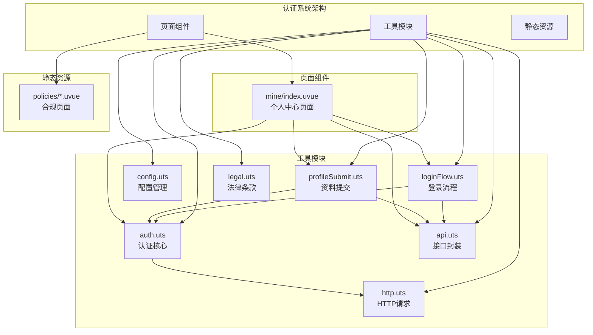
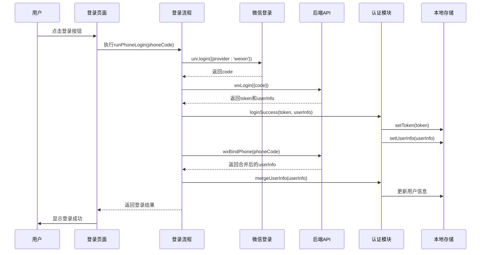
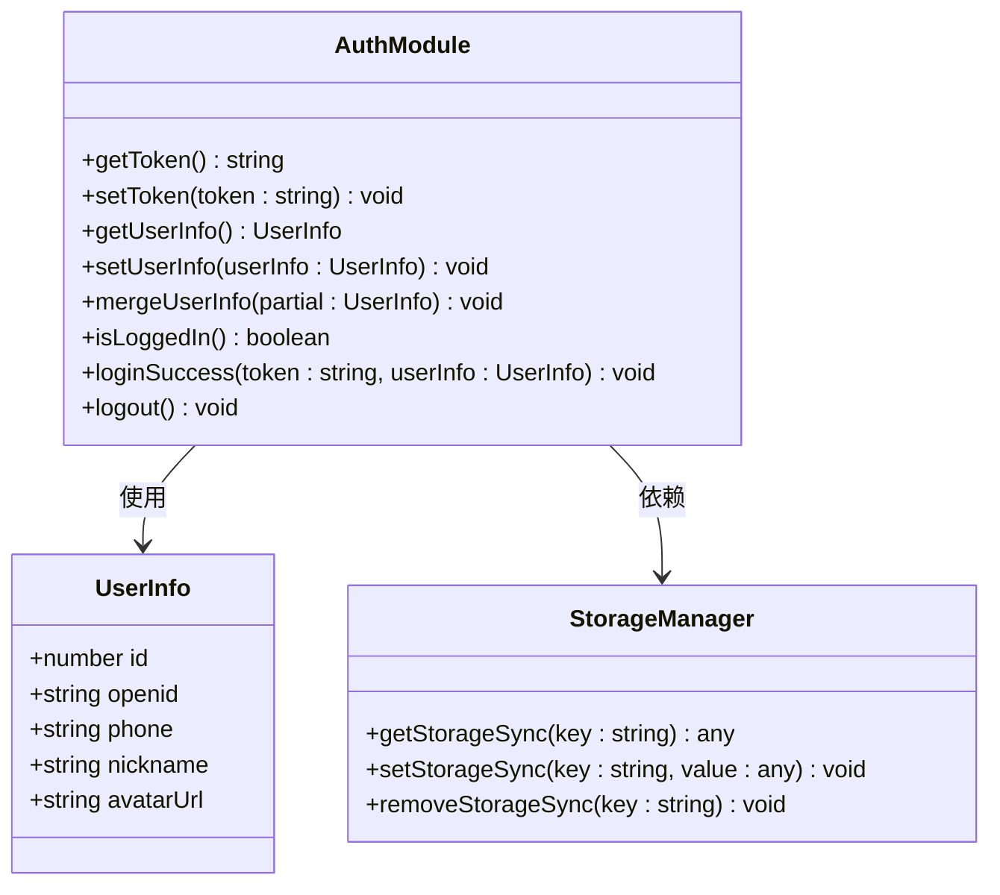
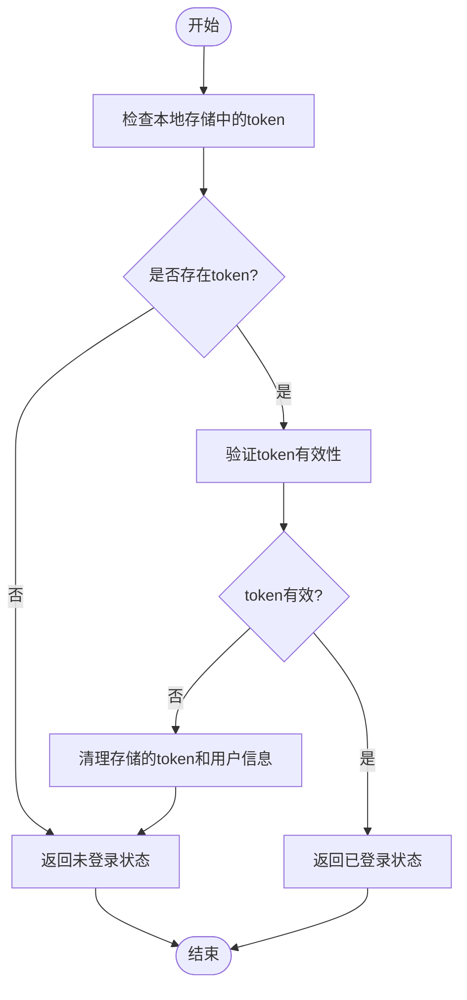
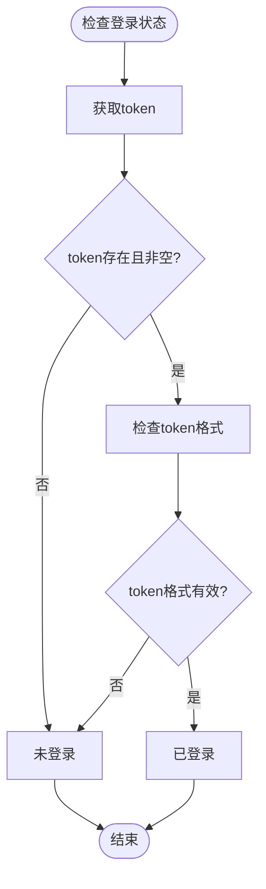
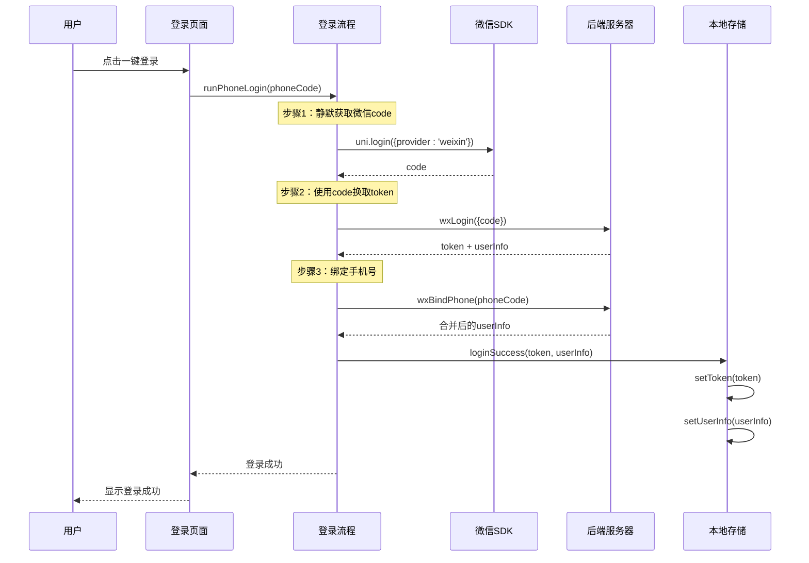
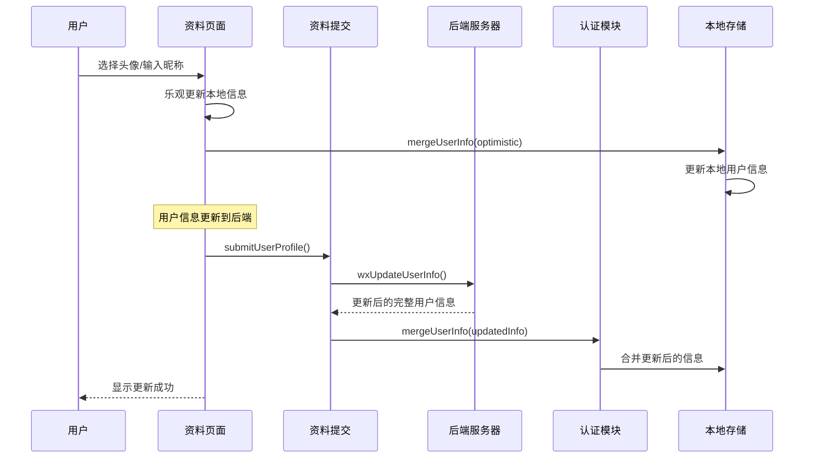
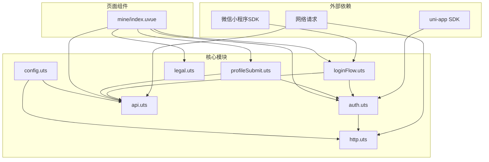

# 认证管理系统

<cite>
**本文档引用的文件**
- [auth.uts](file://src/utils/auth.uts)
- [loginFlow.uts](file://src/utils/loginFlow.uts)
- [api.uts](file://src/utils/api.uts)
- [http.uts](file://src/utils/http.uts)
- [config.uts](file://src/utils/config.uts)
- [mine/index.uvue](file://src/pages/mine/index.uvue)
- [profileSubmit.uts](file://src/utils/profileSubmit.uts)
- [legal.uts](file://src/utils/legal.uts)
- [README.md](file://README.md)
</cite>

## 目录
1. [简介](#简介)
2. [项目结构](#项目结构)
3. [核心组件](#核心组件)
4. [架构概览](#架构概览)
5. [详细组件分析](#详细组件分析)
6. [依赖关系分析](#依赖关系分析)
7. [性能考虑](#性能考虑)
8. [故障排除指南](#故障排除指南)
9. [结论](#结论)
10. [附录](#附录)

## 简介

认证管理系统是基于 uni-app x (Vue 3 + TypeScript/UTS) 的微信小程序模板的核心模块，负责处理用户身份验证、令牌管理和用户信息缓存。该系统提供了完整的微信登录流程，包括静默登录、手机号绑定和用户信息管理，确保用户能够无缝地访问受保护的功能。

系统采用模块化设计，将认证逻辑分离到独立的工具模块中，便于维护和扩展。通过统一的接口封装，实现了跨页面的一致用户体验和安全的认证流程。

## 项目结构

认证管理系统主要分布在以下目录结构中：

**图表来源**
- [auth.uts:1-149](file://src/utils/auth.uts#L1-L149)
- [loginFlow.uts:1-71](file://src/utils/loginFlow.uts#L1-L71)
- [api.uts:1-312](file://src/utils/api.uts#L1-L312)
- [http.uts:1-82](file://src/utils/http.uts#L1-L82)
- [config.uts:1-12](file://src/utils/config.uts#L1-L12)
- [mine/index.uvue:1-604](file://src/pages/mine/index.uvue#L1-L604)

**章节来源**
- [README.md:85-130](file://README.md#L85-L130)

## 核心组件

认证管理系统包含以下核心组件：

### 认证工具模块 (auth.uts)
- **用户信息接口**：定义了UserInfo接口，包含用户ID、openid、手机号、昵称、头像URL等字段
- **令牌管理**：提供getToken、setToken、clearToken等方法，使用uni.getStorageSync进行本地存储
- **用户信息管理**：提供getUserInfo、setUserInfo、mergeUserInfo等方法，支持部分字段合并更新
- **登录状态检查**：isLoggedIn方法检查用户是否已登录
- **完整登录/登出**：loginSuccess和logout方法处理完整的认证状态变更

### 登录流程模块 (loginFlow.uts)
- **三步骤登录流程**：封装了微信登录的完整流程，包括静默登录、换取token、绑定手机号
- **错误处理**：提供详细的错误分类和处理机制
- **异步流程控制**：使用Promise和async/await确保步骤间的正确执行顺序

### API封装模块 (api.uts)
- **微信登录接口**：wxLogin方法处理code换取token的逻辑
- **手机号绑定接口**：wxBindPhone方法处理手机号授权绑定
- **用户信息接口**：wxGetUserInfo和wxUpdateUserInfo处理用户信息的获取和更新
- **点赞收藏接口**：提供相关业务接口的封装

### HTTP请求模块 (http.uts)
- **统一请求处理**：封装了所有HTTP请求，自动添加认证头信息
- **401自动处理**：检测到401未授权时自动清理认证信息
- **配置管理**：集成基础URL和超时设置

**章节来源**
- [auth.uts:6-149](file://src/utils/auth.uts#L6-L149)
- [loginFlow.uts:1-71](file://src/utils/loginFlow.uts#L1-L71)
- [api.uts:125-190](file://src/utils/api.uts#L125-L190)
- [http.uts:20-73](file://src/utils/http.uts#L20-L73)

## 架构概览

认证管理系统采用分层架构设计，各层职责明确，耦合度低：

**图表来源**
- [loginFlow.uts:27-70](file://src/utils/loginFlow.uts#L27-L70)
- [api.uts:129-154](file://src/utils/api.uts#L129-L154)
- [auth.uts:135-148](file://src/utils/auth.uts#L135-L148)

系统架构特点：
- **分层清晰**：UI层、业务逻辑层、数据访问层职责分明
- **模块化设计**：每个功能模块都有独立的职责和接口
- **错误隔离**：登录流程中的错误被集中处理和分类
- **状态管理**：使用本地存储实现持久化的认证状态

## 详细组件分析

### 用户信息管理 (UserInfo接口)

UserInfo接口定义了完整的用户信息结构：

**图表来源**
- [auth.uts:7-13](file://src/utils/auth.uts#L7-L13)
- [auth.uts:21-148](file://src/utils/auth.uts#L21-L148)

UserInfo接口的关键字段说明：
- **id**: 用户唯一标识符，用于后端识别用户身份
- **openid**: 微信用户的唯一标识，用于微信生态内的身份识别
- **phone**: 用户手机号，可能为空表示尚未绑定手机号
- **nickname**: 用户昵称，可能为空表示尚未完善个人信息
- **avatarUrl**: 用户头像URL，可能为空表示尚未设置头像

**章节来源**
- [auth.uts:6-149](file://src/utils/auth.uts#L6-L149)

### 令牌存储和管理机制

系统采用本地存储的方式管理令牌，确保用户状态的持久化：

**图表来源**
- [auth.uts:21-29](file://src/utils/auth.uts#L21-L29)
- [auth.uts:125-128](file://src/utils/auth.uts#L125-L128)
- [http.uts:50-61](file://src/utils/http.uts#L50-L61)

令牌管理的关键特性：
- **本地存储**：使用uni.getStorageSync进行持久化存储
- **自动清理**：检测到401错误时自动清理所有认证信息
- **类型安全**：确保token始终为字符串类型
- **错误处理**：对存储操作进行异常捕获和处理

**章节来源**
- [auth.uts:17-52](file://src/utils/auth.uts#L17-L52)
- [http.uts:24-36](file://src/utils/http.uts#L24-L36)

### 登录状态检查逻辑

登录状态检查采用多层验证机制：

**图表来源**
- [auth.uts:125-128](file://src/utils/auth.uts#L125-L128)

登录状态检查的验证规则：
- **存在性检查**：token必须存在且不为空字符串
- **格式验证**：排除'undefined'和'null'字符串
- **实时验证**：每次检查都会从存储中重新读取最新状态

**章节来源**
- [auth.uts:121-128](file://src/utils/auth.uts#L121-L128)

### 用户信息缓存策略

系统采用智能缓存策略，确保用户信息的及时性和完整性：

**图表来源**
- [auth.uts:60-71](file://src/utils/auth.uts#L60-L71)
- [auth.uts:92-106](file://src/utils/auth.uts#L92-L106)

用户信息缓存的优化策略：
- **部分字段合并**：mergeUserInfo方法只更新非空字段，避免覆盖已有信息
- **延迟加载**：首次访问时才从存储读取用户信息
- **类型转换**：确保返回的用户信息符合接口定义

**章节来源**
- [auth.uts:56-106](file://src/utils/auth.uts#L56-L106)

### 微信登录流程详解

微信登录采用三步骤流程，确保用户授权的完整性和安全性：

**图表来源**
- [loginFlow.uts:27-70](file://src/utils/loginFlow.uts#L27-L70)
- [api.uts:129-154](file://src/utils/api.uts#L129-L154)

登录流程的关键特性：
- **异步处理**：所有步骤都是异步执行，确保UI响应性
- **错误隔离**：每个步骤的错误都被单独处理和报告
- **状态恢复**：即使手机号绑定失败，也保持登录状态
- **用户体验**：提供详细的错误反馈和进度提示

**章节来源**
- [loginFlow.uts:20-70](file://src/utils/loginFlow.uts#L20-L70)

### 手机号绑定机制

手机号绑定采用微信提供的加密解密能力：

**图表来源**
- [api.uts:146-154](file://src/utils/api.uts#L146-L154)
- [loginFlow.uts:48-63](file://src/utils/loginFlow.uts#L48-L63)

手机号绑定的安全特性：
- **加密传输**：使用微信官方的加密解密机制
- **权限控制**：需要用户主动授权手机号
- **错误处理**：绑定失败不影响整体登录流程
- **信息合并**：只更新手机号字段，保持其他信息不变

**章节来源**
- [api.uts:143-154](file://src/utils/api.uts#L143-L154)
- [loginFlow.uts:48-63](file://src/utils/loginFlow.uts#L48-L63)

### 用户信息管理流程

用户信息管理采用乐观更新策略，提升用户体验：

**图表来源**
- [profileSubmit.uts:18-36](file://src/utils/profileSubmit.uts#L18-L36)
- [mine/index.uvue:372-408](file://src/pages/mine/index.uvue#L372-L408)

用户信息更新的优化策略：
- **乐观更新**：先更新本地状态，提升响应速度
- **容错处理**：即使后端更新失败，本地状态仍然有效
- **信息合并**：只更新用户提供的字段，避免覆盖其他信息
- **渐进增强**：逐步完善用户信息，不需要一次性完成

**章节来源**
- [profileSubmit.uts:13-36](file://src/utils/profileSubmit.uts#L13-L36)
- [mine/index.uvue:370-408](file://src/pages/mine/index.uvue#L370-L408)

## 依赖关系分析

认证系统的依赖关系呈现清晰的单向依赖结构：

**图表来源**
- [auth.uts:1-149](file://src/utils/auth.uts#L1-L149)
- [loginFlow.uts:8-10](file://src/utils/loginFlow.uts#L8-L10)
- [api.uts:1-3](file://src/utils/api.uts#L1-L3)
- [http.uts:1-3](file://src/utils/http.uts#L1-L3)

依赖关系的特点：
- **向下依赖**：上层模块依赖下层模块，形成清晰的层次结构
- **无循环依赖**：不存在模块间的循环引用
- **接口隔离**：每个模块都有明确的接口边界
- **单一职责**：每个模块专注于特定的功能领域

**章节来源**
- [auth.uts:1-149](file://src/utils/auth.uts#L1-L149)
- [loginFlow.uts:8-10](file://src/utils/loginFlow.uts#L8-L10)
- [api.uts:1-3](file://src/utils/api.uts#L1-L3)

## 性能考虑

认证系统在设计时充分考虑了性能优化：

### 存储优化
- **本地存储**：使用uni.getStorageSync避免频繁的网络请求
- **懒加载**：用户信息只在需要时从存储中读取
- **批量操作**：合并用户信息时避免多次存储操作

### 网络优化
- **请求复用**：HTTP模块统一处理请求头和错误处理
- **超时控制**：配置合理的超时时间，避免长时间阻塞
- **并发控制**：避免同时发起多个认证相关的请求

### UI优化
- **响应式更新**：使用Vue的响应式系统确保界面及时更新
- **骨架屏**：在数据加载时显示骨架屏提升用户体验
- **防抖处理**：避免重复点击导致的重复请求

## 故障排除指南

### 常见问题及解决方案

#### 登录失败
**问题描述**：用户点击登录按钮后无法完成登录流程
**可能原因**：
- 微信授权被拒绝
- 网络连接异常
- 后端服务不可用

**解决步骤**：
1. 检查微信授权状态
2. 验证网络连接
3. 查看控制台错误日志
4. 重新尝试登录流程

#### 令牌过期
**问题描述**：用户已登录但访问受保护资源时提示未授权
**可能原因**：
- 令牌已过期
- 服务器时间不同步
- 多设备登录冲突

**解决步骤**：
1. 检查本地存储中的token
2. 观察401错误处理是否正常
3. 重新登录获取新token
4. 清理浏览器缓存后重试

#### 用户信息不完整
**问题描述**：用户头像或昵称显示为空
**可能原因**：
- 用户尚未完善个人信息
- 网络请求失败
- 存储数据损坏

**解决步骤**：
1. 检查getUserInfo返回值
2. 验证mergeUserInfo逻辑
3. 重新获取用户信息
4. 手动完善个人信息

**章节来源**
- [http.uts:50-61](file://src/utils/http.uts#L50-L61)
- [auth.uts:60-71](file://src/utils/auth.uts#L60-L71)

### 调试技巧

#### 控制台调试
- 使用console.log记录关键流程节点
- 捕获并记录所有异常信息
- 监控存储操作的成功率

#### 网络调试
- 检查请求头中的Authorization字段
- 验证响应状态码和消息
- 监控请求耗时和成功率

#### 存储调试
- 检查本地存储中的token和用户信息
- 验证数据序列化和反序列化
- 监控存储容量使用情况

## 结论

认证管理系统通过模块化的设计和清晰的分层架构，实现了完整的用户身份验证功能。系统具有以下优势：

### 技术优势
- **模块化设计**：每个功能模块职责明确，便于维护和扩展
- **安全性考虑**：采用本地存储和HTTPS传输，确保用户信息安全
- **用户体验**：提供流畅的登录流程和及时的状态反馈
- **错误处理**：完善的错误分类和处理机制

### 架构优势
- **分层清晰**：UI层、业务逻辑层、数据访问层职责分明
- **依赖管理**：单向依赖关系，避免循环引用问题
- **接口设计**：清晰的模块接口，便于单元测试和集成测试
- **扩展性**：模块化设计支持功能的灵活扩展

### 最佳实践建议
1. **持续监控**：定期检查认证系统的运行状态和性能指标
2. **安全审计**：定期审查认证相关的安全配置和代码实现
3. **用户反馈**：收集用户在使用过程中的问题和建议
4. **版本管理**：建立完善的版本控制和发布流程

该系统为微信小程序提供了可靠的认证基础设施，支持后续功能的快速开发和部署。

## 附录

### 安全考虑和最佳实践

#### 数据安全
- **敏感信息保护**：token和用户信息应加密存储
- **传输安全**：所有认证相关的请求必须使用HTTPS
- **权限控制**：严格区分不同用户的访问权限

#### 错误处理
- **用户友好**：错误信息应该清晰易懂，避免暴露系统细节
- **日志记录**：记录关键错误但避免记录敏感信息
- **降级策略**：在网络异常时提供合理的降级方案

#### 性能优化
- **缓存策略**：合理使用缓存减少不必要的网络请求
- **异步处理**：使用异步操作避免UI阻塞
- **资源管理**：及时释放不再使用的资源

#### 用户体验
- **进度反馈**：在长时间操作时提供进度指示
- **重试机制**：在网络异常时提供自动重试功能
- **状态保持**：在页面切换时保持认证状态