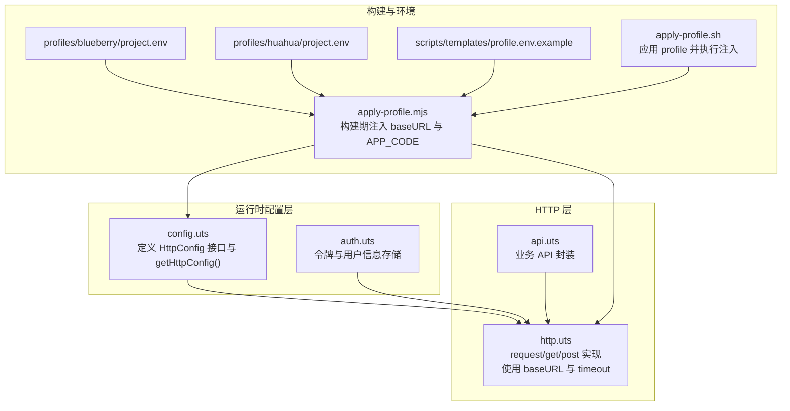
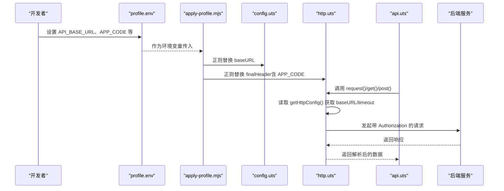
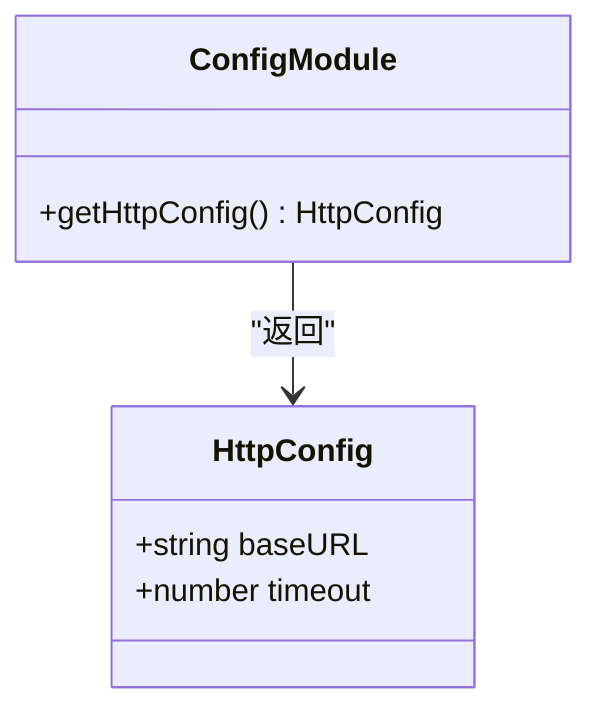
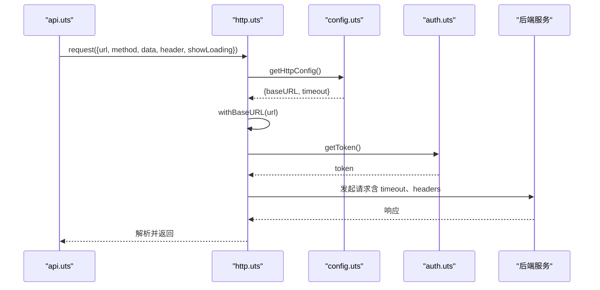
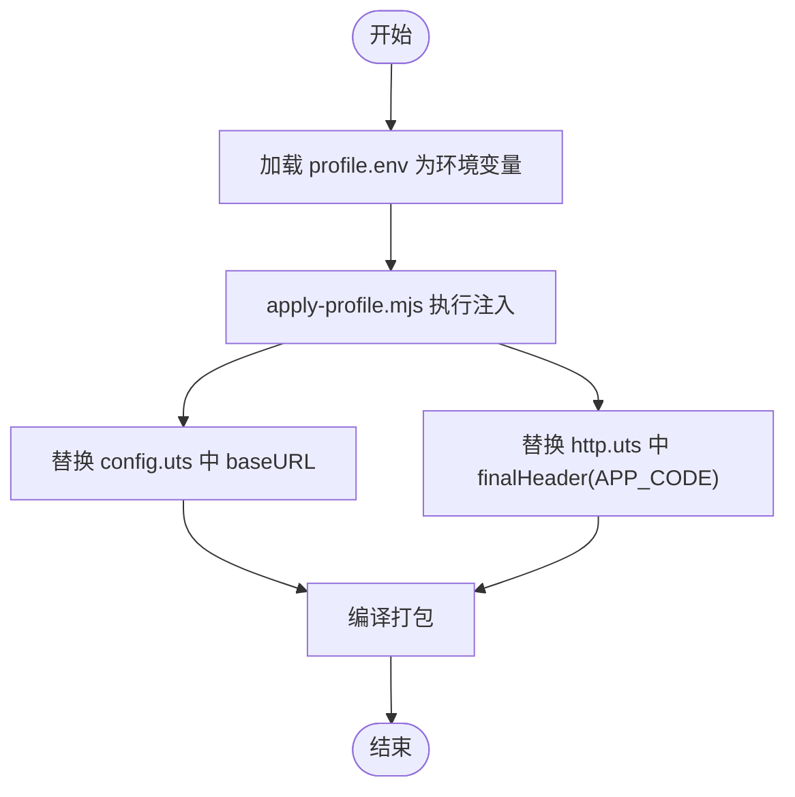
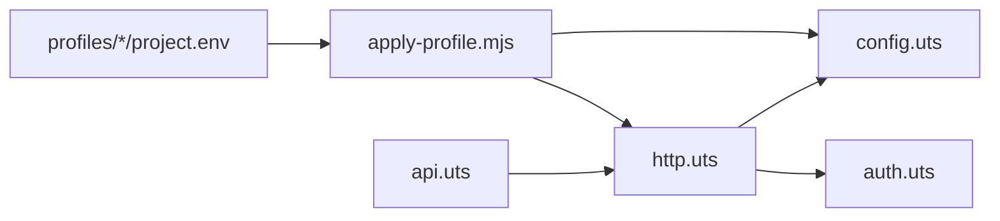

# 配置管理器

<cite>
**本文档引用的文件**
- [config.uts](file://src/utils/config.uts)
- [http.uts](file://src/utils/http.uts)
- [api.uts](file://src/utils/api.uts)
- [auth.uts](file://src/utils/auth.uts)
- [apply-profile.mjs](file://scripts/lib/apply-profile.mjs)
- [apply-profile.sh](file://scripts/apply-profile.sh)
- [build-all-profiles.sh](file://scripts/build-all-profiles.sh)
- [verify-miniapp.sh](file://scripts/verify-miniapp.sh)
- [blueberry/project.env](file://profiles/blueberry/project.env)
- [huahua/project.env](file://profiles/huahua/project.env)
- [profile.env.example](file://scripts/templates/profile.env.example)
- [legal.uts](file://src/utils/legal.uts)
- [main.uts](file://src/main.uts)
</cite>

## 目录
1. [简介](#简介)
2. [项目结构](#项目结构)
3. [核心组件](#核心组件)
4. [架构总览](#架构总览)
5. [详细组件分析](#详细组件分析)
6. [依赖关系分析](#依赖关系分析)
7. [性能考量](#性能考量)
8. [故障排查指南](#故障排查指南)
9. [结论](#结论)
10. [附录](#附录)

## 简介
本文件面向配置管理器的技术文档，聚焦于 config.uts 模块的配置管理策略，涵盖以下主题：
- API 基础 URL 设置与环境变量处理
- 超时参数配置与默认值
- 配置项优先级与覆盖机制
- 开发环境与生产环境的配置差异
- 配置的动态更新机制与运行时修改支持
- 配置项完整列表与默认值说明
- 最佳实践与安全考虑（敏感信息保护）

## 项目结构
配置管理涉及的核心文件分布如下：
- 运行时配置定义与读取：src/utils/config.uts
- HTTP 请求层与超时参数使用：src/utils/http.uts
- API 接口封装：src/utils/api.uts
- 认证与令牌存储：src/utils/auth.uts
- 构建期配置注入脚本：scripts/lib/apply-profile.mjs
- Profile 应用脚本与环境文件：scripts/apply-profile.sh、profiles/*/project.env
- 示例模板：scripts/templates/profile.env.example
- 其他工具模块：src/utils/legal.uts、src/main.uts

图表来源
- [config.uts:1-12](file://src/utils/config.uts#L1-L12)
- [http.uts:1-82](file://src/utils/http.uts#L1-L82)
- [api.uts:1-312](file://src/utils/api.uts#L1-L312)
- [auth.uts:1-149](file://src/utils/auth.uts#L1-L149)
- [apply-profile.mjs:137-150](file://scripts/lib/apply-profile.mjs#L137-L150)
- [apply-profile.sh:78-89](file://scripts/apply-profile.sh#L78-L89)
- [blueberry/project.env:16-17](file://profiles/blueberry/project.env#L16-L17)
- [huahua/project.env:17-18](file://profiles/huahua/project.env#L17-L18)
- [profile.env.example:18-19](file://scripts/templates/profile.env.example#L18-L19)

章节来源
- [config.uts:1-12](file://src/utils/config.uts#L1-L12)
- [http.uts:1-82](file://src/utils/http.uts#L1-L82)
- [apply-profile.mjs:137-150](file://scripts/lib/apply-profile.mjs#L137-L150)
- [apply-profile.sh:78-89](file://scripts/apply-profile.sh#L78-L89)
- [blueberry/project.env:16-17](file://profiles/blueberry/project.env#L16-L17)
- [huahua/project.env:17-18](file://profiles/huahua/project.env#L17-L18)
- [profile.env.example:18-19](file://scripts/templates/profile.env.example#L18-L19)

## 核心组件
- 配置接口与默认值
  - HttpConfig 接口定义包含 baseURL 与 timeout 两个关键字段
  - getHttpConfig() 提供默认 baseURL 与默认 timeout（毫秒）
- HTTP 请求层
  - request 函数读取 getHttpConfig() 返回的 baseURL 与 timeout
  - 自动拼接绝对 URL，并在存在 token 时注入 Authorization 头
- 构建期注入
  - apply-profile.mjs 通过正则替换将 API_BASE_URL 注入 config.uts
  - APP_CODE 注入 http.uts 的 finalHeader 块
- Profile 环境文件
  - profiles/*/project.env 定义 API_BASE_URL、APP_CODE 等环境变量
  - scripts/templates/profile.env.example 提供模板与示例

章节来源
- [config.uts:2-11](file://src/utils/config.uts#L2-L11)
- [http.uts:14-46](file://src/utils/http.uts#L14-L46)
- [apply-profile.mjs:137-150](file://scripts/lib/apply-profile.mjs#L137-L150)
- [blueberry/project.env:16-17](file://profiles/blueberry/project.env#L16-L17)
- [huahua/project.env:17-18](file://profiles/huahua/project.env#L17-L18)
- [profile.env.example:18-19](file://scripts/templates/profile.env.example#L18-L19)

## 架构总览
配置管理采用“构建期注入 + 运行时读取”的双阶段策略：
- 构建期：根据 profile.env 中的 API_BASE_URL、APP_CODE 等变量，通过 apply-profile.mjs 注入到源码中
- 运行时：config.uts 提供 getHttpConfig() 读取注入后的配置；http.uts 使用该配置发起请求

图表来源
- [apply-profile.mjs:137-150](file://scripts/lib/apply-profile.mjs#L137-L150)
- [config.uts:7-11](file://src/utils/config.uts#L7-L11)
- [http.uts:14-46](file://src/utils/http.uts#L14-L46)
- [api.uts:28-36](file://src/utils/api.uts#L28-L36)

## 详细组件分析

### config.uts 组件分析
- 角色定位
  - 定义 HttpConfig 接口，统一管理 baseURL 与 timeout
  - 提供 getHttpConfig() 返回当前运行时配置
- 关键行为
  - 默认 baseURL 为固定值（测试用途），默认 timeout 为 15000 毫秒
  - 该默认值会被构建期注入覆盖
- 运行时特性
  - 由于 getHttpConfig() 是纯函数且返回常量对象，不支持运行时动态修改
  - 如需动态更新，需在构建期注入或通过外部注入方式（见后续章节）

图表来源
- [config.uts:2-11](file://src/utils/config.uts#L2-L11)

章节来源
- [config.uts:2-11](file://src/utils/config.uts#L2-L11)

### http.uts 组件分析
- 角色定位
  - HTTP 请求封装，负责 URL 拼接、头部注入、超时控制与错误处理
- 关键流程
  - withBaseURL：若传入 URL 不以 http(s) 开头，则拼接 getHttpConfig().baseURL
  - request：读取 getHttpConfig().timeout，统一注入 Content-Type 与 X-App-Code（若有），并在存在 token 时注入 Authorization
  - 错误处理：401 时清理本地 token 与用户信息并提示
- 与 config.uts 的耦合
  - 通过 import getHttpConfig() 读取 baseURL 与 timeout
  - 依赖 auth.uts 的 getToken() 获取令牌

图表来源
- [http.uts:14-73](file://src/utils/http.uts#L14-L73)
- [config.uts:7-11](file://src/utils/config.uts#L7-L11)
- [auth.uts:21-29](file://src/utils/auth.uts#L21-L29)

章节来源
- [http.uts:14-73](file://src/utils/http.uts#L14-L73)
- [auth.uts:21-29](file://src/utils/auth.uts#L21-L29)

### 构建期注入与环境变量处理
- 注入范围
  - config.uts：API_BASE_URL 注入到 baseURL
  - http.uts：APP_CODE 注入到 finalHeader（可选）
- 环境变量来源
  - profiles/*/project.env：定义 API_BASE_URL、APP_CODE 等
  - scripts/templates/profile.env.example：提供模板与示例
- 注入流程
  - apply-profile.sh 加载 profile.env 并导出为环境变量
  - apply-profile.mjs 通过正则替换写回源码
  - build-all-profiles.sh 与 verify-miniapp.sh 支持批量与验证场景

图表来源
- [apply-profile.sh:78-89](file://scripts/apply-profile.sh#L78-L89)
- [apply-profile.mjs:137-150](file://scripts/lib/apply-profile.mjs#L137-L150)
- [blueberry/project.env:16-17](file://profiles/blueberry/project.env#L16-L17)
- [huahua/project.env:17-18](file://profiles/huahua/project.env#L17-L18)
- [profile.env.example:18-19](file://scripts/templates/profile.env.example#L18-L19)

章节来源
- [apply-profile.sh:78-89](file://scripts/apply-profile.sh#L78-L89)
- [apply-profile.mjs:137-150](file://scripts/lib/apply-profile.mjs#L137-L150)
- [blueberry/project.env:16-17](file://profiles/blueberry/project.env#L16-L17)
- [huahua/project.env:17-18](file://profiles/huahua/project.env#L17-L18)
- [profile.env.example:18-19](file://scripts/templates/profile.env.example#L18-L19)

### 配置项优先级与覆盖机制
- 优先级顺序（从高到低）
  1) 构建期注入：apply-profile.mjs 将 profile.env 的 API_BASE_URL 注入 config.uts
  2) 运行时默认值：config.uts 中的默认 baseURL 与 timeout
- 覆盖机制
  - 构建期注入会直接替换源码中的 baseURL 常量，因此运行时读取的是注入后的值
  - APP_CODE 通过注入 finalHeader，影响所有请求头
- 运行时动态更新
  - 当前实现不支持运行时动态修改配置（getHttpConfig() 返回常量对象）
  - 若需动态更新，可在构建期注入或引入外部配置源（见最佳实践）

章节来源
- [config.uts:7-11](file://src/utils/config.uts#L7-L11)
- [apply-profile.mjs:137-150](file://scripts/lib/apply-profile.mjs#L137-L150)

### 开发环境与生产环境的配置差异
- 开发环境
  - 默认 baseURL 在 config.uts 中为测试域名，便于本地联调
  - 构建期注入会覆盖为实际 API_BASE_URL（来自 profile.env）
- 生产环境
  - 通过 apply-profile.mjs 将 API_BASE_URL 注入，确保线上使用真实域名
  - APP_CODE 注入 finalHeader，便于后端区分不同小程序实例
- 环境文件差异
  - profiles/blueberry/project.env 与 profiles/huahua/project.env 分别定义了不同的 API_BASE_URL 与 APP_CODE
  - scripts/templates/profile.env.example 提供标准模板与示例

章节来源
- [config.uts:8-10](file://src/utils/config.uts#L8-L10)
- [blueberry/project.env:16-17](file://profiles/blueberry/project.env#L16-L17)
- [huahua/project.env:17-18](file://profiles/huahua/project.env#L17-L18)
- [profile.env.example:18-19](file://scripts/templates/profile.env.example#L18-L19)

### 配置的动态更新机制与运行时修改支持
- 当前实现
  - config.uts 的 getHttpConfig() 返回常量对象，不支持运行时修改
  - http.uts 读取 getHttpConfig() 的结果，无法在运行时改变
- 可行的扩展方案
  - 引入全局配置对象（如单例），在应用启动时从注入的环境变量初始化，运行时允许更新
  - 通过事件/订阅模式通知 HTTP 层刷新配置
  - 注意：扩展需保证线程安全与一致性

章节来源
- [config.uts:7-11](file://src/utils/config.uts#L7-L11)
- [http.uts:38-46](file://src/utils/http.uts#L38-L46)

### 配置项完整列表与默认值说明
- HttpConfig 接口字段
  - baseURL: string
  - timeout: number（单位：毫秒）
- 默认值
  - baseURL: 测试域名（构建期会被覆盖）
  - timeout: 15000（毫秒）
- 环境变量
  - API_BASE_URL: 用于注入 config.uts 的 baseURL
  - APP_CODE: 用于注入 http.uts 的 finalHeader（可选）
- 其他相关配置
  - 令牌与用户信息：通过 auth.uts 管理（与配置相关但非配置项本身）

章节来源
- [config.uts:2-11](file://src/utils/config.uts#L2-L11)
- [http.uts:27-36](file://src/utils/http.uts#L27-L36)
- [blueberry/project.env:16-17](file://profiles/blueberry/project.env#L16-L17)
- [huahua/project.env:17-18](file://profiles/huahua/project.env#L17-L18)
- [profile.env.example:18-19](file://scripts/templates/profile.env.example#L18-L19)

## 依赖关系分析
- 模块间依赖
  - http.uts 依赖 config.uts（读取 baseURL 与 timeout）、auth.uts（读取 token）
  - api.uts 依赖 http.uts（统一请求入口）
  - apply-profile.mjs 依赖 profile.env（读取 API_BASE_URL、APP_CODE）
- 耦合度与内聚性
  - config.uts 与 http.uts 耦合度适中，职责清晰
  - 构建期注入降低了运行时复杂度，提高了可维护性
- 循环依赖
  - 未发现循环依赖

图表来源
- [api.uts:1-3](file://src/utils/api.uts#L1-L3)
- [http.uts:1-2](file://src/utils/http.uts#L1-L2)
- [config.uts:1-1](file://src/utils/config.uts#L1-L1)
- [apply-profile.mjs:1-1](file://scripts/lib/apply-profile.mjs#L1-L1)
- [blueberry/project.env:1-1](file://profiles/blueberry/project.env#L1-L1)

章节来源
- [api.uts:1-3](file://src/utils/api.uts#L1-L3)
- [http.uts:1-2](file://src/utils/http.uts#L1-L2)
- [config.uts:1-1](file://src/utils/config.uts#L1-L1)
- [apply-profile.mjs:1-1](file://scripts/lib/apply-profile.mjs#L1-L1)

## 性能考量
- 超时参数
  - 默认 timeout 为 15000 毫秒，可根据网络环境调整
  - 过短可能导致频繁超时，过长可能影响用户体验
- URL 拼接
  - withBaseURL 仅在相对路径时拼接，避免重复拼接导致的性能损耗
- 头部注入
  - finalHeader 合并逻辑简单，开销极小
- 建议
  - 在弱网环境下适当提高 timeout
  - 对高频接口可考虑缓存策略（与配置管理配合）

## 故障排查指南
- 常见问题
  - 请求超时：检查 http.uts 中 timeout 设置与网络状况
  - 401 未授权：确认 token 是否过期，系统会在 401 时自动清理本地 token 与用户信息
  - 基础 URL 错误：确认 profile.env 中 API_BASE_URL 是否正确，以及是否成功注入
- 排查步骤
  - 检查 config.uts 中 baseURL 是否被构建期注入覆盖
  - 检查 http.uts 中 finalHeader 是否包含正确的 APP_CODE
  - 确认 auth.uts 中 token 是否存在且有效
- 相关实现位置
  - 超时与 URL 拼接：http.uts
  - 401 处理：http.uts
  - 配置读取：config.uts
  - 令牌管理：auth.uts

章节来源
- [http.uts:38-73](file://src/utils/http.uts#L38-L73)
- [config.uts:7-11](file://src/utils/config.uts#L7-L11)
- [auth.uts:21-52](file://src/utils/auth.uts#L21-L52)

## 结论
本配置管理器采用“构建期注入 + 运行时读取”的设计，实现了环境变量驱动的基础 URL 与请求头配置。其优点是：
- 构建期一次性注入，运行时稳定可靠
- 配置集中管理，易于维护
- 支持多环境差异化配置（通过不同 profile.env）

不足之处在于：
- 运行时无法动态修改配置
- 默认 baseURL 仅为测试用途，需依赖构建期注入

建议在现有基础上引入运行时配置更新能力，并加强敏感信息保护（见附录）。

## 附录

### 配置项与默认值对照表
- HttpConfig.baseURL
  - 默认值：测试域名（构建期注入后覆盖）
  - 来源：profile.env 的 API_BASE_URL，经 apply-profile.mjs 注入 config.uts
- HttpConfig.timeout
  - 默认值：15000 毫秒
  - 来源：config.uts 默认值，运行时通过 http.uts 使用
- X-App-Code
  - 默认值：可选（未提供时不注入）
  - 来源：profile.env 的 APP_CODE，经 apply-profile.mjs 注入 http.uts 的 finalHeader

章节来源
- [config.uts:7-11](file://src/utils/config.uts#L7-L11)
- [http.uts:27-36](file://src/utils/http.uts#L27-L36)
- [blueberry/project.env:16-17](file://profiles/blueberry/project.env#L16-L17)
- [huahua/project.env:17-18](file://profiles/huahua/project.env#L17-L18)
- [profile.env.example:18-19](file://scripts/templates/profile.env.example#L18-L19)

### 最佳实践与安全考虑
- 最佳实践
  - 使用 profile.env 管理各环境配置，避免硬编码
  - 通过 apply-profile.sh 与 apply-profile.mjs 统一注入，减少手工修改
  - 对高频接口设置合理的 timeout，兼顾性能与稳定性
  - 在弱网环境下适当提高 timeout
- 安全考虑
  - 避免在源码中暴露敏感信息（如密钥、令牌）
  - 通过环境变量与构建期注入传递配置，不在客户端存储敏感数据
  - 对外暴露的 API_BASE_URL 应使用 HTTPS
  - 定期轮换 APP_CODE 与后端密钥，限制访问权限