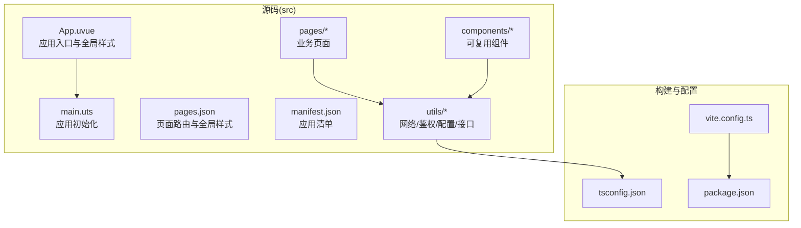
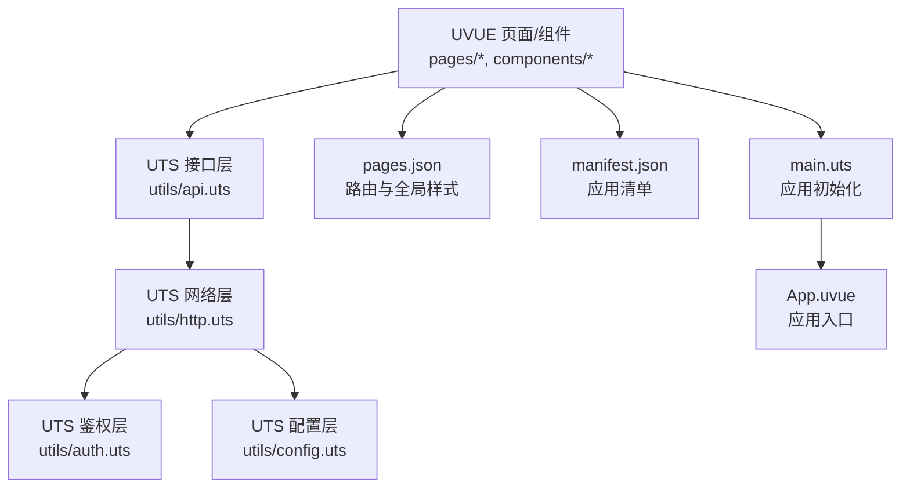
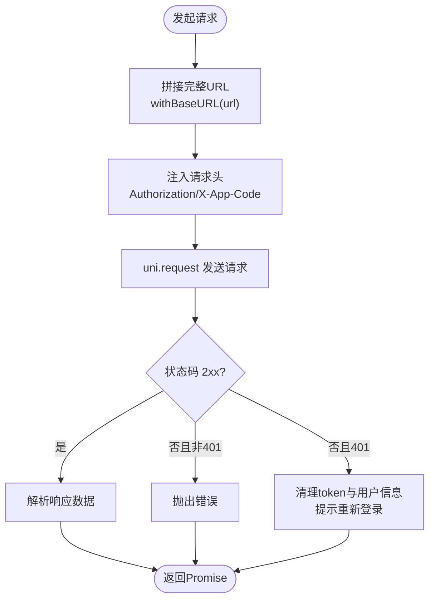
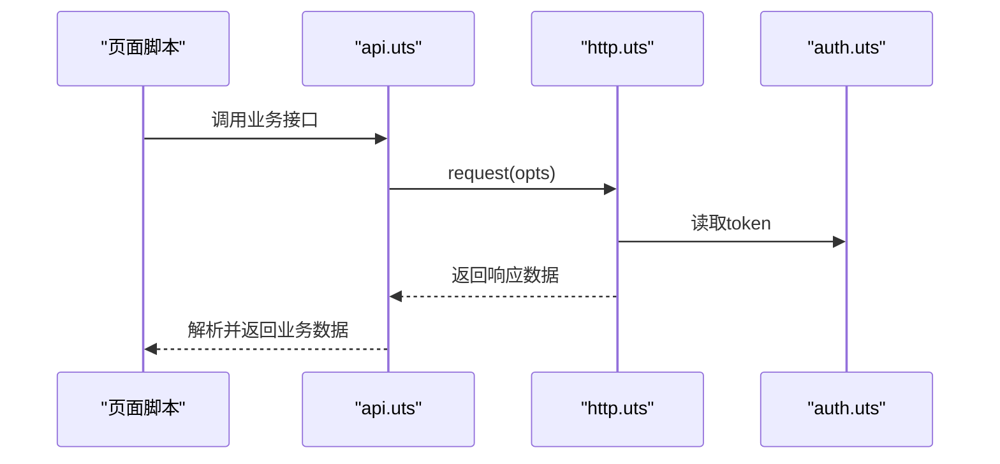
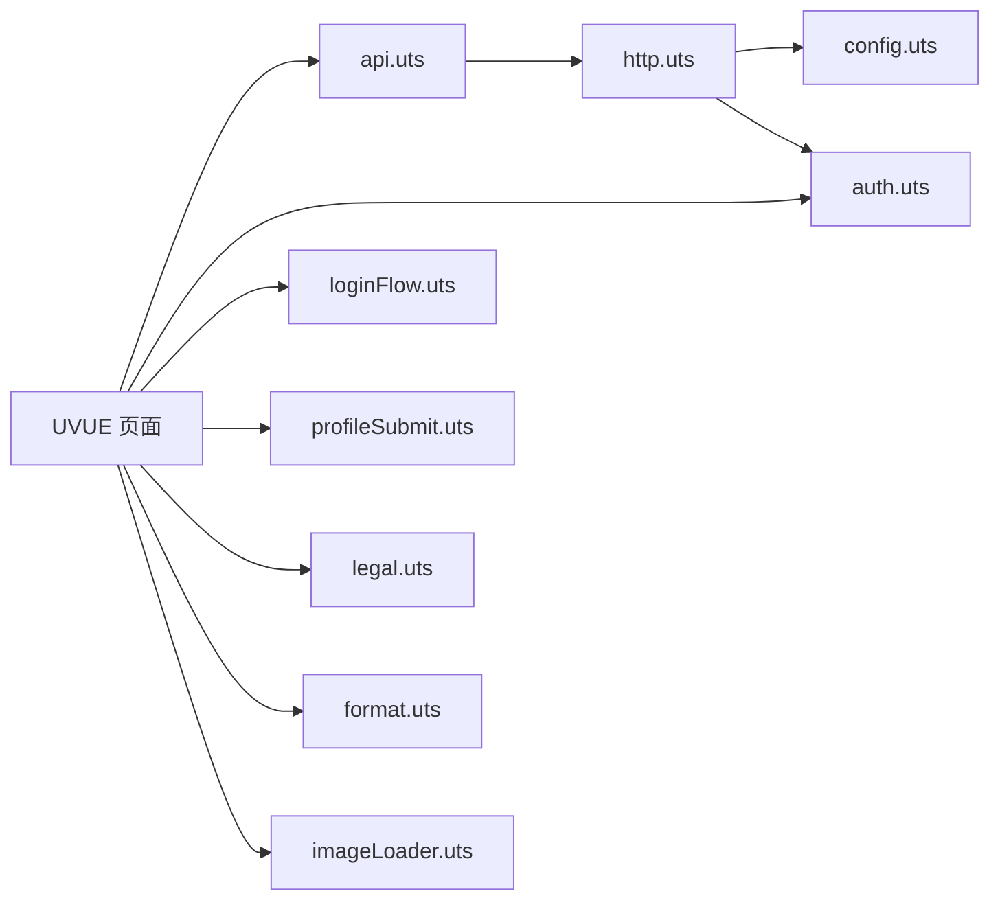

# 代码规范与最佳实践

<cite>
**本文引用的文件**
- [README.md](file://README.md)
- [package.json](file://package.json)
- [tsconfig.json](file://tsconfig.json)
- [vite.config.ts](file://vite.config.ts)
- [src/env.d.ts](file://src/env.d.ts)
- [src/main.uts](file://src/main.uts)
- [src/pages.json](file://src/pages.json)
- [src/manifest.json](file://src/manifest.json)
- [src/App.uvue](file://src/App.uvue)
- [src/components/AppFooter/AppFooter.uvue](file://src/components/AppFooter/AppFooter.uvue)
- [src/utils/api.uts](file://src/utils/api.uts)
- [src/utils/http.uts](file://src/utils/http.uts)
- [src/utils/auth.uts](file://src/utils/auth.uts)
- [src/utils/config.uts](file://src/utils/config.uts)
- [src/pages/index/index.uvue](file://src/pages/index/index.uvue)
- [src/pages/demoDetail/index.uvue](file://src/pages/demoDetail/index.uvue)
</cite>

## 目录
1. [简介](#简介)
2. [项目结构](#项目结构)
3. [核心组件](#核心组件)
4. [架构总览](#架构总览)
5. [详细组件分析](#详细组件分析)
6. [依赖关系分析](#依赖关系分析)
7. [性能考虑](#性能考虑)
8. [故障排查指南](#故障排查指南)
9. [结论](#结论)
10. [附录](#附录)

## 简介
本指南面向“蓝莓”小程序模板的团队协作与工程化实践，围绕文件命名、目录组织、TypeScript/UTS/UVUE 编码规范、Vue 3 组件开发规范、Git 提交与分支管理策略、以及代码审查与质量保障措施，提供系统化的落地建议。内容基于仓库现有实现与脚手架约定，确保“一套模板、多端复用”的可维护性与一致性。

## 项目结构
- 源码统一置于 src/，根目录其余文件为构建/发布/脚本与配置。
- 页面路由集中于 src/pages.json，全局样式与主题变量位于 src/uni.scss（未在当前快照中显示，但已在 tsconfig.json 中纳入类型扫描）。
- 工具模块集中在 src/utils/，采用 UTS 实现，统一管理网络请求、鉴权、配置与业务接口。
- 组件以功能域划分在 src/components/，遵循“目录即组件”的命名与职责收敛原则。
- 应用入口与全局样式在 src/App.uvue，应用初始化在 src/main.uts。
- 构建与运行通过 uni-app x 与 Vite 插件完成，目标平台为 mp-weixin。

**图表来源**
- [src/App.uvue](file://src/App.uvue)
- [src/main.uts](file://src/main.uts)
- [src/pages.json](file://src/pages.json)
- [src/manifest.json](file://src/manifest.json)
- [src/utils/api.uts](file://src/utils/api.uts)
- [src/utils/http.uts](file://src/utils/http.uts)
- [src/utils/auth.uts](file://src/utils/auth.uts)
- [src/utils/config.uts](file://src/utils/config.uts)
- [vite.config.ts](file://vite.config.ts)
- [tsconfig.json](file://tsconfig.json)
- [package.json](file://package.json)

**章节来源**
- [README.md:85-130](file://README.md#L85-L130)
- [tsconfig.json:15-17](file://tsconfig.json#L15-L17)

## 核心组件
- 应用入口与全局样式：src/App.uvue，包含应用生命周期钩子与全局样式（含骨架屏与登录弹窗样式）。
- 应用初始化：src/main.uts，导出 createApp 工厂函数，供 uni-app x 初始化。
- 页面路由与全局样式：src/pages.json，集中管理页面、导航栏与 tabBar。
- 应用清单：src/manifest.json，包含 mp-weixin 的 appid 与基础元信息。
- 工具模块：
  - 网络层：src/utils/http.uts，封装 request/get/post，统一注入 Authorization/X-App-Code，处理 401 自动登出。
  - 配置层：src/utils/config.uts，集中管理 baseURL 与超时。
  - 鉴权层：src/utils/auth.uts，提供 token 与用户信息的存储、合并与登录状态判断。
  - 接口层：src/utils/api.uts，聚合业务接口，定义类型与返回结构。
- 页面示例：
  - 首页：src/pages/index/index.uvue，演示骨架屏、登录弹窗、头像昵称授权、并行数据加载等。
  - 客片详情页：src/pages/demoDetail/index.uvue，演示自定义导航栏、搜索/分类双模式、加载更多、点赞与登录联动等。

**章节来源**
- [src/App.uvue:1-335](file://src/App.uvue#L1-L335)
- [src/main.uts:1-9](file://src/main.uts#L1-L9)
- [src/pages.json:1-90](file://src/pages.json#L1-L90)
- [src/manifest.json:1-73](file://src/manifest.json#L1-L73)
- [src/utils/http.uts:1-82](file://src/utils/http.uts#L1-L82)
- [src/utils/config.uts:1-12](file://src/utils/config.uts#L1-L12)
- [src/utils/auth.uts:1-149](file://src/utils/auth.uts#L1-L149)
- [src/utils/api.uts:1-312](file://src/utils/api.uts#L1-L312)
- [src/pages/index/index.uvue:1-359](file://src/pages/index/index.uvue#L1-L359)
- [src/pages/demoDetail/index.uvue:1-800](file://src/pages/demoDetail/index.uvue#L1-L800)

## 架构总览
整体采用“页面路由集中 + 工具模块解耦 + 组件复用”的三层结构：
- 视图层：UVUE 页面与组件，负责渲染与交互。
- 逻辑层：UTS 工具模块，封装网络、鉴权、配置与业务接口。
- 配置层：pages.json、manifest.json、tsconfig.json、vite.config.ts，统一构建与运行时配置。

**图表来源**
- [src/pages/index/index.uvue:96-295](file://src/pages/index/index.uvue#L96-L295)
- [src/pages/demoDetail/index.uvue:189-707](file://src/pages/demoDetail/index.uvue#L189-L707)
- [src/utils/api.uts:1-312](file://src/utils/api.uts#L1-L312)
- [src/utils/http.uts:1-82](file://src/utils/http.uts#L1-L82)
- [src/utils/auth.uts:1-149](file://src/utils/auth.uts#L1-L149)
- [src/utils/config.uts:1-12](file://src/utils/config.uts#L1-L12)
- [src/pages.json:1-90](file://src/pages.json#L1-L90)
- [src/manifest.json:1-73](file://src/manifest.json#L1-L73)
- [src/main.uts:1-9](file://src/main.uts#L1-L9)
- [src/App.uvue:1-40](file://src/App.uvue#L1-L40)

## 详细组件分析

### 文件命名规范
- UVUE 页面与组件：统一使用 .uvue，目录名即组件名，例如 src/components/AppFooter/AppFooter.uvue。
- UTS 工具模块：统一使用 .uts，例如 src/utils/http.uts、src/utils/auth.uts、src/utils/api.uts、src/utils/config.uts。
- SCSS 全局样式：建议使用 uni.scss（当前快照未展示内容，但 tsconfig.json 已纳入扫描）。
- 类型声明：src/env.d.ts 用于声明 @dcloudio/types。
- 构建配置：vite.config.ts、tsconfig.json、package.json、project.config.json 等。

**章节来源**
- [README.md:85-130](file://README.md#L85-L130)
- [tsconfig.json:21-26](file://tsconfig.json#L21-L26)
- [src/env.d.ts:1-2](file://src/env.d.ts#L1-L2)

### 目录组织原则
- src/ 为唯一源码入口，页面、组件、工具模块、静态资源与全局配置均在此目录下按功能域划分。
- 页面路由集中于 src/pages.json，避免分散在各页面重复配置。
- 组件以“目录即组件”的方式组织，组件内部包含模板、脚本与样式，便于复用与维护。
- 工具模块按职责拆分：网络层、鉴权层、配置层、接口层，降低耦合度。

**章节来源**
- [README.md:85-130](file://README.md#L85-L130)
- [src/pages.json:1-90](file://src/pages.json#L1-L90)

### TypeScript 编码规范
- 路径别名：tsconfig.json 中配置 @/* → src/*，便于跨层级导入。
- 类型声明：src/env.d.ts 引入 @dcloudio/types，确保 uni-api 与平台类型可用。
- 类型定义与接口设计：
  - 在 src/utils/api.uts 中明确导出接口类型（如 AlbumBasic、ShopInfo、SearchPageResult），并在函数返回值上使用 as 断言，确保调用方拿到强类型数据结构。
  - 在 src/utils/auth.uts 中定义 UserInfo 接口，统一用户信息字段。
  - 在 src/utils/http.uts 中定义 RequestOptions 与 HttpMethod，约束请求参数与方法。
- 模块导入导出：
  - 统一使用相对路径导入，避免跨模块循环依赖。
  - 工具模块之间通过显式导出函数与接口进行通信，避免隐式共享状态。

**章节来源**
- [tsconfig.json:15-17](file://tsconfig.json#L15-L17)
- [src/env.d.ts:1-2](file://src/env.d.ts#L1-L2)
- [src/utils/api.uts:4-13, 267-273:4-13](file://src/utils/api.uts#L4-L13)
- [src/utils/auth.uts:6-13](file://src/utils/auth.uts#L6-L13)
- [src/utils/http.uts:4-12](file://src/utils/http.uts#L4-L12)

### UTS 语言最佳实践
- 统一网络请求封装：在 src/utils/http.uts 中集中处理 baseURL 拼接、Authorization/X-App-Code 注入、401 自动登出与 loading 控制。
- 配置集中化：在 src/utils/config.uts 中集中管理 baseURL 与超时，避免硬编码。
- 鉴权状态管理：在 src/utils/auth.uts 中提供 token 与用户信息的读写、合并与登录状态判断，避免在页面中分散处理。
- 接口聚合：在 src/utils/api.uts 中聚合业务接口，导出类型与函数，便于页面直接调用。

**图表来源**
- [src/utils/http.uts:14-73](file://src/utils/http.uts#L14-L73)

**章节来源**
- [src/utils/http.uts:1-82](file://src/utils/http.uts#L1-L82)
- [src/utils/config.uts:1-12](file://src/utils/config.uts#L1-L12)
- [src/utils/auth.uts:1-149](file://src/utils/auth.uts#L1-L149)
- [src/utils/api.uts:1-312](file://src/utils/api.uts#L1-L312)

### Vue 3 组件开发规范
- 响应式数据：在页面脚本中使用 data() 定义响应式数据，避免在模板中直接访问外部状态。
- 生命周期钩子：在页面脚本中使用 onLoad/onShow/onReachBottom 等生命周期钩子，按需加载与刷新数据。
- 组合式 API 使用：在复杂页面中，可将业务逻辑抽离为独立 UTS 函数（如登录流程、头像昵称授权），在页面中以函数调用的方式复用。
- 事件与交互：在模板中通过 v-if/v-else 控制骨架屏与主内容，通过 open-type 与事件回调处理微信授权与导航跳转。
- 组件复用：将公共 UI 与文案收敛到组件（如 AppFooter），通过 props/default props 传递配置，减少重复代码。

**图表来源**
- [src/pages/index/index.uvue:96-295](file://src/pages/index/index.uvue#L96-L295)
- [src/utils/api.uts:1-312](file://src/utils/api.uts#L1-L312)
- [src/utils/http.uts:1-82](file://src/utils/http.uts#L1-L82)
- [src/utils/auth.uts:1-149](file://src/utils/auth.uts#L1-L149)

**章节来源**
- [src/pages/index/index.uvue:1-359](file://src/pages/index/index.uvue#L1-L359)
- [src/pages/demoDetail/index.uvue:1-800](file://src/pages/demoDetail/index.uvue#L1-L800)
- [src/components/AppFooter/AppFooter.uvue:1-25](file://src/components/AppFooter/AppFooter.uvue#L1-L25)

### Git 提交规范与分支管理策略
- 提交信息格式建议：
  - feat: 新增功能
  - fix: 修复缺陷
  - docs: 文档更新
  - style: 样式调整（不影响逻辑）
  - refactor: 重构（既不修复缺陷也不新增功能）
  - perf: 性能优化
  - test: 测试相关
  - chore: 构建流程、依赖管理等杂项
- 分支策略建议：
  - main/master：稳定发布分支
  - develop：开发集成分支
  - feature/*：功能开发分支
  - hotfix/*：紧急修复分支
  - release/*：预发布分支
- 合并与审查：
  - 通过 Pull Request/Merge Request 进行代码审查，强制 CI 校验与产物校验脚本通过后方可合并。

[本节为通用规范建议，不直接分析具体文件，故无“章节来源”]

### 代码审查要点与质量保证
- 代码审查要点：
  - 结构清晰：页面/组件职责单一，工具模块按层解耦。
  - 类型安全：接口返回值使用 as 断言与类型定义，避免 any。
  - 错误处理：网络请求与鉴权异常路径清晰，401 自动登出与提示完善。
  - 可维护性：路径别名统一、相对路径导入、组件复用、配置集中化。
- 质量保证措施：
  - 构建与校验：通过 scripts/verify-miniapp.sh 校验 AppID、导航栏标题、协议页面与 X-App-Code 等关键项。
  - 产物一致性：通过 apply-profile 与 sync-template 保持 src/ 与目标仓库产物一致，避免模板漂移。
  - 自动化脚本：使用 npm scripts 与 Shell 脚本统一构建、发布与校验流程。

**章节来源**
- [README.md:242-285](file://README.md#L242-L285)
- [README.md:286-341](file://README.md#L286-L341)

## 依赖关系分析
- 页面依赖工具模块：页面通过 import 方式引入 api.uts、auth.uts、loginFlow.uts、profileSubmit.uts、legal.uts、format.uts、imageLoader.uts 等，形成清晰的单向依赖。
- 工具模块内部依赖：http.uts 依赖 config.uts 与 auth.uts；api.uts 依赖 http.uts 与 auth.uts；auth.uts 依赖 uni.storage。
- 构建与运行：vite.config.ts 集成 @dcloudio/vite-plugin-uni，tsconfig.json 配置路径别名与类型扫描，package.json 管理依赖与脚本。

**图表来源**
- [src/pages/index/index.uvue:96-295](file://src/pages/index/index.uvue#L96-L295)
- [src/pages/demoDetail/index.uvue:189-707](file://src/pages/demoDetail/index.uvue#L189-L707)
- [src/utils/api.uts:1-312](file://src/utils/api.uts#L1-L312)
- [src/utils/http.uts:1-82](file://src/utils/http.uts#L1-L82)
- [src/utils/auth.uts:1-149](file://src/utils/auth.uts#L1-L149)
- [src/utils/config.uts:1-12](file://src/utils/config.uts#L1-L12)

**章节来源**
- [vite.config.ts:1-9](file://vite.config.ts#L1-L9)
- [tsconfig.json:15-17](file://tsconfig.json#L15-L17)
- [package.json:1-48](file://package.json#L1-L48)

## 性能考虑
- 骨架屏与首屏优化：首页与详情页均采用骨架屏与图片预加载，提升感知性能。
- 并行加载：首页在 onLoad 中并行请求轮播图与店铺列表，缩短首屏等待时间。
- 分页与懒加载：详情页在 onReachBottom 中按需加载更多数据，避免一次性渲染大量节点。
- 图片缓存：通过 imageLoader.uts 的预加载与超时控制，减少白屏与闪烁。

**章节来源**
- [src/pages/index/index.uvue:124-142](file://src/pages/index/index.uvue#L124-L142)
- [src/pages/demoDetail/index.uvue:267-275](file://src/pages/demoDetail/index.uvue#L267-L275)
- [src/pages/demoDetail/index.uvue:331-342](file://src/pages/demoDetail/index.uvue#L331-L342)

## 故障排查指南
- 构建产物校验失败：
  - 检查 verify-miniapp.sh 校验项：AppID 一致性、导航栏标题、协议页面、X-App-Code、残留字符串扫描。
  - 如缺少协议页面，执行 build-miniapp.sh 时加上 --sync-template。
- 登录与鉴权问题：
  - 确认 http.uts 中 Authorization/X-App-Code 是否正确注入。
  - 检查 auth.uts 中 token 与用户信息的存储与合并逻辑。
- 网络请求异常：
  - 查看 http.uts 的 401 自动登出与错误提示逻辑，确认后端返回状态码与消息。
- 页面样式与资源：
  - 确认 pages.json 中的 tabBar 图标路径与 uni.scss 中的主题变量是否生效。

**章节来源**
- [README.md:277-284](file://README.md#L277-L284)
- [src/utils/http.uts:40-72](file://src/utils/http.uts#L40-L72)
- [src/utils/auth.uts:92-106](file://src/utils/auth.uts#L92-L106)

## 结论
本指南基于“蓝莓”小程序模板的现有实现，总结了文件命名、目录组织、TypeScript/UTS/UVUE 编码、Vue 3 组件开发、Git 规范与质量保障的最佳实践。建议团队在日常开发中严格遵循上述规范，结合自动化脚本与校验流程，持续提升代码质量与交付效率。

## 附录
- 快速开始与构建命令参考：参见 README.md 的“快速开始”与“构建与发布脚本”章节。
- 目录结构与页面清单：参见 README.md 的“目录结构”与“页面清单”章节。

**章节来源**
- [README.md:58-82](file://README.md#L58-L82)
- [README.md:242-270](file://README.md#L242-L270)
- [README.md:136-151](file://README.md#L136-L151)
