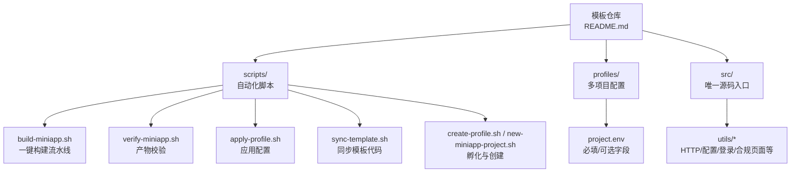
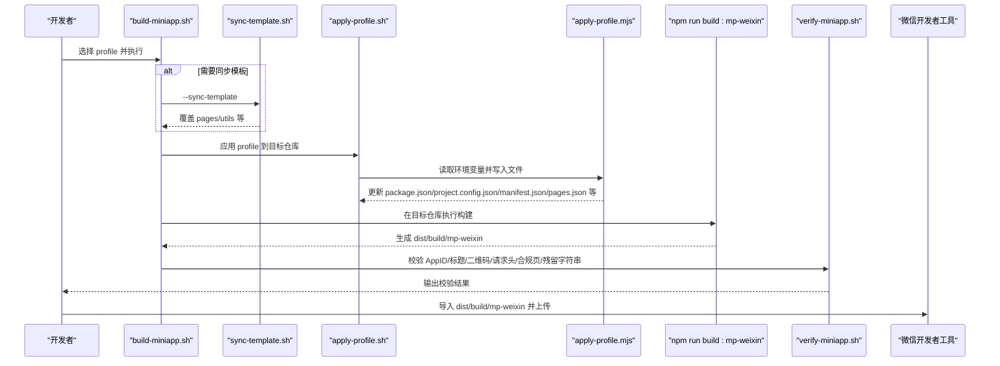
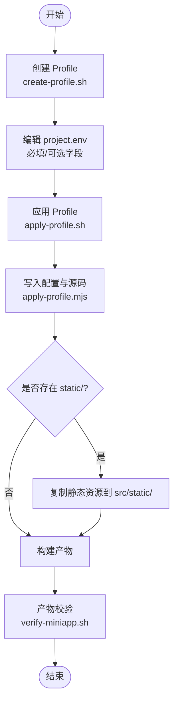
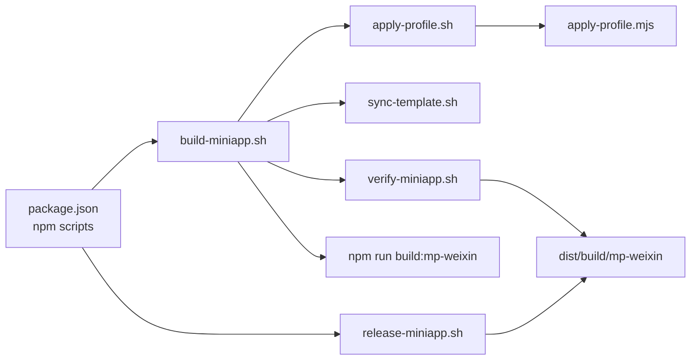

# 开发工作流程

<cite>
**本文引用的文件**
- [README.md](file://README.md)
- [package.json](file://package.json)
- [scripts/apply-profile.sh](file://scripts/apply-profile.sh)
- [scripts/build-miniapp.sh](file://scripts/build-miniapp.sh)
- [scripts/verify-miniapp.sh](file://scripts/verify-miniapp.sh)
- [scripts/create-profile.sh](file://scripts/create-profile.sh)
- [scripts/new-miniapp-project.sh](file://scripts/new-miniapp-project.sh)
- [scripts/sync-template.sh](file://scripts/sync-template.sh)
- [scripts/lib/apply-profile.mjs](file://scripts/lib/apply-profile.mjs)
- [scripts/build-all-profiles.sh](file://scripts/build-all-profiles.sh)
- [profiles/blueberry/project.env](file://profiles/blueberry/project.env)
- [project.config.json](file://project.config.json)
- [vite.config.ts](file://vite.config.ts)
- [tsconfig.json](file://tsconfig.json)
</cite>

## 目录
1. [简介](#简介)
2. [项目结构](#项目结构)
3. [核心组件](#核心组件)
4. [架构总览](#架构总览)
5. [详细组件分析](#详细组件分析)
6. [依赖关系分析](#依赖关系分析)
7. [性能考量](#性能考量)
8. [故障排查指南](#故障排查指南)
9. [结论](#结论)
10. [附录](#附录)

## 简介
本文件面向蓝莓小程序模板的团队协作与标准化开发，系统化梳理 Git 工作流程、日常开发任务（功能开发、Bug 修复、代码重构）、Profile 配置工作流（创建、应用、验证）、自动化脚本（构建、发布、校验）的使用方法，以及版本管理与发布流程、常见问题与解决方案。目标是让新成员快速上手，同时确保多项目并行维护的一致性与可追溯性。

## 项目结构
- 源码集中在 src/，根目录其他文件（如 dist、unpackage、node_modules）由 .gitignore 控制，避免与 src/ 源码产生漂移。
- Profile 机制通过 profiles/<project-key>/project.env 管理各小程序的私有配置，不污染模板源码。
- 自动化脚本集中于 scripts/，涵盖创建 Profile、应用 Profile、同步模板、构建、校验、批量构建、孵化新项目等。
- 构建工具链基于 uni-app x + Vite，目标平台为微信小程序（mp-weixin）。

图表来源
- [README.md:85-130](file://README.md#L85-L130)
- [scripts/build-miniapp.sh:14-25](file://scripts/build-miniapp.sh#L14-L25)
- [scripts/verify-miniapp.sh:34-45](file://scripts/verify-miniapp.sh#L34-L45)
- [scripts/apply-profile.sh:10-27](file://scripts/apply-profile.sh#L10-L27)
- [scripts/sync-template.sh:8-32](file://scripts/sync-template.sh#L8-L32)
- [scripts/create-profile.sh:10-19](file://scripts/create-profile.sh#L10-L19)
- [scripts/new-miniapp-project.sh:11-22](file://scripts/new-miniapp-project.sh#L11-L22)

章节来源
- [README.md:85-130](file://README.md#L85-L130)

## 核心组件
- 构建与发布脚本
  - npm scripts 提供统一入口：开发、生产构建、Profile 相关脚本调用。
  - 一键构建脚本整合“同步模板 → 应用 Profile → 安装依赖 → 编译 → 校验”。
- Profile 配置与应用
  - 通过 profiles/<project-key>/project.env 管理 AppID、品牌、API 域名、联系方式、协议名称等。
  - Node 脚本负责将环境变量映射到源码与配置文件。
- 产物校验
  - 校验 AppID、导航栏标题、本地联系二维码、请求头 X-App-Code、合规页面存在性、残留字符串等。
- 批量构建
  - 支持在模板仓库内或外部仓库批量构建多个 Profile，便于多项目并行产出。

章节来源
- [package.json:4-13](file://package.json#L4-L13)
- [scripts/build-miniapp.sh:14-25](file://scripts/build-miniapp.sh#L14-L25)
- [scripts/verify-miniapp.sh:34-45](file://scripts/verify-miniapp.sh#L34-L45)
- [scripts/lib/apply-profile.mjs:12-31](file://scripts/lib/apply-profile.mjs#L12-L31)
- [scripts/build-all-profiles.sh:16-33](file://scripts/build-all-profiles.sh#L16-L33)

## 架构总览
下图展示了从模板到多项目产物的端到端流程：模板更新、Profile 应用、构建与校验、产物导入微信开发者工具、发布。

图表来源
- [scripts/build-miniapp.sh:84-102](file://scripts/build-miniapp.sh#L84-L102)
- [scripts/sync-template.sh:13-31](file://scripts/sync-template.sh#L13-L31)
- [scripts/apply-profile.sh:15-26](file://scripts/apply-profile.sh#L15-L26)
- [scripts/lib/apply-profile.mjs:73-190](file://scripts/lib/apply-profile.mjs#L73-L190)
- [scripts/verify-miniapp.sh:114-164](file://scripts/verify-miniapp.sh#L114-L164)

## 详细组件分析

### Git 工作流程与分支策略
- 分支命名建议
  - develop：主开发分支，合并长期功能分支
  - feature/<issue-id>-短描述：功能开发分支
  - hotfix/<issue-id>-短描述：紧急修复分支
  - release/<版本号>：发布准备分支
- 提交规范
  - type(scope): subject
  - 常用类型：feat、fix、docs、style、refactor、test、chore
  - 示例：feat(profile): 新增 huahua 项目的 AppID 配置
- 合并流程
  - 使用 Pull Request（或 Merge Request）进行代码审查
  - 合并前确保自动化脚本通过（构建、校验）
  - 合并到 develop，再按需合并到 release 分支进行打包发布

章节来源
- [README.md:388-402](file://README.md#L388-L402)

### 日常开发任务标准流程

#### 功能开发
- 创建功能分支：feature/<issue-id>-短描述
- 在 src/ 下进行开发，遵循现有组件与页面结构
- 如涉及页面路由或合规页面，确保 pages.json 与合规页面存在
- 本地构建与校验：npm run build:mp-weixin 后在微信开发者工具导入 dist/build/mp-weixin
- 提交与评审：提交前执行自动化校验，发起 PR 并等待审查

章节来源
- [README.md:244-256](file://README.md#L244-L256)

#### Bug 修复
- 创建 hotfix/<issue-id>-短描述 分支
- 修复后执行 scripts/verify-miniapp.sh 校验产物
- 合并到 develop，必要时合并到 release 分支

章节来源
- [scripts/verify-miniapp.sh:34-45](file://scripts/verify-miniapp.sh#L34-L45)

#### 代码重构
- 优先在 feature 分支进行，避免影响主干
- 保持 pages.json 与合规页面的完整性
- 重构后运行 scripts/build-miniapp.sh 进行端到端验证

章节来源
- [scripts/build-miniapp.sh:14-25](file://scripts/build-miniapp.sh#L14-L25)

### Profile 配置工作流
- 创建 Profile
  - 使用 scripts/create-profile.sh <project-key> 生成 profiles/<key>/project.env 与 profiles/<key>/static/
  - 编辑 project.env，填写必填字段与可选字段
- 应用 Profile
  - 在模板仓库或目标仓库执行 scripts/apply-profile.sh <key>，将环境变量写入 package.json、project.config.json、src/manifest.json、src/pages.json、src/utils/* 等
  - 若存在 profiles/<key>/static/，会复制到目标仓库的 src/static/
- 验证 Profile
  - 执行 scripts/verify-miniapp.sh 校验 AppID、导航栏标题、本地联系二维码、X-App-Code、MINI_APP_NAME、合规页面、残留字符串等

图表来源
- [scripts/create-profile.sh:10-19](file://scripts/create-profile.sh#L10-L19)
- [scripts/apply-profile.sh:15-26](file://scripts/apply-profile.sh#L15-L26)
- [scripts/lib/apply-profile.mjs:73-190](file://scripts/lib/apply-profile.mjs#L73-L190)
- [scripts/verify-miniapp.sh:114-164](file://scripts/verify-miniapp.sh#L114-L164)

章节来源
- [scripts/create-profile.sh:10-19](file://scripts/create-profile.sh#L10-L19)
- [scripts/apply-profile.sh:15-26](file://scripts/apply-profile.sh#L15-L26)
- [scripts/lib/apply-profile.mjs:12-31](file://scripts/lib/apply-profile.mjs#L12-L31)
- [scripts/verify-miniapp.sh:114-164](file://scripts/verify-miniapp.sh#L114-L164)

### 自动化脚本使用方法

#### 一键构建与发布
- 一键构建：scripts/build-miniapp.sh <profile-key> [--repo <target>] [--sync-template] [--install] [--skip-apply] [--skip-verify]
  - 同步模板、应用 Profile、安装依赖、构建、校验
- 发布前构建：scripts/release-miniapp.sh <profile-key> [--repo <target>] [--sync-template]
  - 与构建脚本相同，但明确提示不自动上传，需在微信开发者工具中手动上传

章节来源
- [scripts/build-miniapp.sh:14-25](file://scripts/build-miniapp.sh#L14-L25)
- [scripts/release-miniapp.sh:6-14](file://scripts/release-miniapp.sh#L6-L14)

#### 产物校验
- scripts/verify-miniapp.sh <profile-key> [--repo <target>] [--output-dir <相对路径>]
- 校验项
  - project.config.json.appid 与 MP_WEIXIN_APPID 一致
  - app.json.window.navigationBarTitleText 与 NAVIGATION_TITLE 一致
  - 本地联系二维码（若以 /static/ 开头）存在于产物中
  - X-App-Code 是否写入（APP_CODE 非空时）
  - MINI_APP_NAME 是否写入 legal.uts 且合规页面存在
  - 可选：RESIDUAL_SEARCH_REGEX 匹配的残留字符串扫描

章节来源
- [scripts/verify-miniapp.sh:114-164](file://scripts/verify-miniapp.sh#L114-L164)

#### 同步模板
- scripts/sync-template.sh --repo <target-repo>
- 覆盖范围：src/App.uvue、src/main.uts、src/index.html、src/env.d.ts、src/pages/、src/utils/、src/components/
- 保留范围：package.json、project.config.json、src/manifest.json、src/pages.json、src/static/、profiles/

章节来源
- [scripts/sync-template.sh:13-31](file://scripts/sync-template.sh#L13-L31)

#### 批量构建
- scripts/build-all-profiles.sh [--only <keys>] [--skip <keys>] [--external-base <dir>] [--no-sync-template]
- 自动扫描 profiles/ 下所有 profile，主项目在当前仓库执行 npm run build:mp-weixin，扩展项目调用 build-miniapp.sh

章节来源
- [scripts/build-all-profiles.sh:16-33](file://scripts/build-all-profiles.sh#L16-L33)

### 版本管理与发布流程
- 模板仓库自身发布（GitHub）
  - 首次关联远程：git remote add origin <url>
  - 推送当前分支：git push -u origin <branch>
  - 日常迭代：git add . → git commit -m "feat/fix/docs: ..." → git push
- 多项目发布
  - 在模板仓库执行 scripts/release-miniapp.sh <profile-key> --repo <target> --sync-template
  - 校验通过后，在微信开发者工具导入 dist/build/mp-weixin 并上传

章节来源
- [README.md:371-384](file://README.md#L371-L384)
- [README.md:344-360](file://README.md#L344-L360)

### 团队协作规范
- 代码审查
  - 所有变更必须通过 PR/MR，至少一名 reviewer 同意
  - 审查重点：Profile 字段完整性、构建与校验通过、合规页面与文案一致性
- 任务分配与进度跟踪
  - 使用 Issue/任务看板（如 GitHub Issues）跟踪需求与缺陷
  - feature/hotfix 分支命名规范统一，PR 描述包含 issue 编号与变更摘要
- 沟通与文档
  - 重要变更在 README 或项目 Wiki 记录变更点与注意事项

章节来源
- [README.md:388-402](file://README.md#L388-L402)

## 依赖关系分析

图表来源
- [package.json:4-13](file://package.json#L4-L13)
- [scripts/build-miniapp.sh:84-102](file://scripts/build-miniapp.sh#L84-L102)
- [scripts/verify-miniapp.sh:114-164](file://scripts/verify-miniapp.sh#L114-L164)

章节来源
- [package.json:4-13](file://package.json#L4-L13)
- [scripts/build-miniapp.sh:84-102](file://scripts/build-miniapp.sh#L84-L102)
- [scripts/verify-miniapp.sh:114-164](file://scripts/verify-miniapp.sh#L114-L164)

## 性能考量
- 构建性能
  - 使用 Vite 作为构建工具，合理拆分页面与组件，避免单页体积过大
  - 静态资源尽量放置在 src/static/ 并通过 Profile 管理，减少重复构建
- 校验性能
  - verify-miniapp.sh 使用 ripgrep（rg）加速正则匹配，未安装时回退到 grep，确保跨环境可用
- 批量构建
  - build-all-profiles.sh 支持 --only/--skip 控制范围，减少不必要的构建

章节来源
- [scripts/verify-miniapp.sh:11-32](file://scripts/verify-miniapp.sh#L11-L32)
- [scripts/build-all-profiles.sh:16-33](file://scripts/build-all-profiles.sh#L16-L33)

## 故障排查指南
- AppID 不一致
  - 现象：verify-miniapp.sh 报错 AppID mismatch
  - 原因：project.config.json 与 Profile 中的 MP_WEIXIN_APPID 不一致
  - 解决：确认 Profile 字段正确，重新执行 apply-profile.sh 与 verify-miniapp.sh
- 导航栏标题不一致
  - 现象：verify-miniapp.sh 报错 navigation bar title mismatch
  - 原因：NAVIGATION_TITLE 与 app.json 中的标题不一致
  - 解决：检查 project.env 并重新应用 Profile
- 本地联系二维码缺失
  - 现象：verify-miniapp.sh 报告缺失 /static/* 资源
  - 原因：CONTACT_QR_SRC 以 /static/ 开头但产物中不存在
  - 解决：将图片放入 profiles/<key>/static/ 或调整为外链
- X-App-Code 未生效
  - 现象：APP_CODE 非空但产物中未找到 X-App-Code
  - 原因：APP_CODE 为空或替换逻辑未命中
  - 解决：检查 project.env 的 APP_CODE，确认 apply-profile.mjs 替换是否成功
- 合规页面缺失
  - 现象：verify-miniapp.sh 报告 pages/policies/* 缺失
  - 原因：目标仓库旧模板代码未同步
  - 解决：添加 --sync-template 参数后重新构建
- 残留字符串
  - 现象：verify-miniapp.sh 报告 RESIDUAL_SEARCH_REGEX 匹配到残留字符串
  - 原因：模板字符串未完全替换
  - 解决：清理多余模板内容或调整正则表达式

章节来源
- [scripts/verify-miniapp.sh:114-164](file://scripts/verify-miniapp.sh#L114-L164)
- [README.md:390-398](file://README.md#L390-L398)

## 结论
通过标准化的 Git 工作流程、清晰的 Profile 配置与应用流程、完善的自动化脚本与校验体系，蓝莓小程序模板实现了“一套模板、多端复用”的高效交付。团队应严格遵循分支与提交规范，配合自动化脚本完成构建与校验，确保多项目并行开发的质量与一致性。

## 附录

### Profile 字段说明与映射
- 必填字段
  - PROJECT_KEY、PACKAGE_NAME、MANIFEST_NAME、DESCRIPTION、MP_WEIXIN_APPID、NAVIGATION_TITLE、BRAND_NAME、COPYRIGHT_TEXT、CONTACT_PHONE_TEXT、CONTACT_QR_SRC、PRICE_FALLBACK_TITLE、API_BASE_URL、MINI_APP_NAME
- 可选字段
  - APP_CODE、RESIDUAL_SEARCH_REGEX
- 映射关系
  - PACKAGE_NAME → package.json.name
  - MP_WEIXIN_APPID → project.config.json.appid 与 src/manifest.json.mp-weixin.appid
  - NAVIGATION_TITLE → src/pages.json.globalStyle.navigationBarTitleText
  - API_BASE_URL → src/utils/config.uts.baseURL
  - APP_CODE → src/utils/http.uts 中的 X-App-Code（为空则移除）
  - MINI_APP_NAME → src/utils/legal.uts
  - CONTACT_QR_SRC/COPYRIGHT_TEXT → pages/index/index.uvue 与 pages/priceHomePage/index.uvue
  - PRICE_FALLBACK_TITLE → src/pages/priceList/index.uvue

章节来源
- [README.md:180-240](file://README.md#L180-L240)
- [scripts/lib/apply-profile.mjs:73-190](file://scripts/lib/apply-profile.mjs#L73-L190)

### 构建与发布脚本一览
- npm scripts
  - dev:mp-weixin、build:mp-weixin、profile:create、profile:apply、profile:build、profile:release、profile:new、profile:verify、profiles:build-all
- Shell 脚本
  - create-profile.sh、apply-profile.sh、build-miniapp.sh、verify-miniapp.sh、sync-template.sh、new-miniapp-project.sh、build-all-profiles.sh

章节来源
- [package.json:4-13](file://package.json#L4-L13)
- [README.md:244-269](file://README.md#L244-L269)

### 默认 Profile 示例
- profiles/blueberry/project.env 展示了默认示例，可作为新建项目的基础模板

章节来源
- [profiles/blueberry/project.env:1-23](file://profiles/blueberry/project.env#L1-L23)
