# 开发指南

<cite>
**本文引用的文件**
- [README.md](file://README.md)
- [package.json](file://package.json)
- [project.config.json](file://project.config.json)
- [vite.config.ts](file://vite.config.ts)
- [src/main.uts](file://src/main.uts)
- [src/App.uvue](file://src/App.uvue)
- [src/pages.json](file://src/pages.json)
- [src/manifest.json](file://src/manifest.json)
- [src/utils/api.uts](file://src/utils/api.uts)
- [src/utils/http.uts](file://src/utils/http.uts)
- [src/utils/auth.uts](file://src/utils/auth.uts)
- [src/utils/config.uts](file://src/utils/config.uts)
- [src/components/AppFooter/AppFooter.uvue](file://src/components/AppFooter/AppFooter.uvue)
- [scripts/build-miniapp.sh](file://scripts/build-miniapp.sh)
- [scripts/verify-miniapp.sh](file://scripts/verify-miniapp.sh)
- [profiles/blueberry/project.env](file://profiles/blueberry/project.env)
</cite>

## 目录
1. [简介](#简介)
2. [项目结构](#项目结构)
3. [核心组件](#核心组件)
4. [架构总览](#架构总览)
5. [详细组件分析](#详细组件分析)
6. [依赖关系分析](#依赖关系分析)
7. [性能考虑](#性能考虑)
8. [调试与排错指南](#调试与排错指南)
9. [结论](#结论)
10. [附录](#附录)

## 简介
本指南面向蓝莓小程序模板的开发者，提供从环境搭建、代码规范、调试技巧、性能优化、Git 工作流到质量保证与团队协作的全流程开发标准。项目基于 uni-app x（Vue 3 + TypeScript/UTS），目标平台为微信小程序，支持多项目 Profile 机制与一键构建/校验/发布流水线。

## 项目结构
- 源码集中在 src/，遵循“唯一源码入口”原则，根目录其他文件由 .gitignore 控制，避免与 src/ 产生漂移。
- scripts/ 提供模板同步、Profile 应用、构建、校验、发布、孵化新项目等自动化脚本。
- profiles/ 为多项目私有配置，每个项目一个 profile，包含项目变量与可选静态资源。
- 根级配置文件控制构建、工具与微信开发者工具设置。

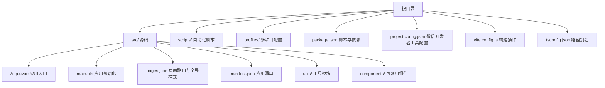

图表来源
- [README.md:85-130](file://README.md#L85-L130)
- [package.json:1-48](file://package.json#L1-L48)
- [project.config.json:1-35](file://project.config.json#L1-L35)
- [vite.config.ts:1-9](file://vite.config.ts#L1-L9)

章节来源
- [README.md:85-130](file://README.md#L85-L130)
- [package.json:1-48](file://package.json#L1-L48)
- [project.config.json:1-35](file://project.config.json#L1-L35)
- [vite.config.ts:1-9](file://vite.config.ts#L1-L9)

## 核心组件
- 应用入口与初始化
  - 应用入口：src/App.uvue，包含生命周期钩子与全局样式（骨架屏、登录弹窗等）。
  - 应用初始化：src/main.uts，创建 SSR 应用实例。
- 页面与导航
  - 页面路由与全局样式：src/pages.json，包含页面列表、全局导航样式与 tabBar 配置。
  - 应用清单：src/manifest.json，包含小程序平台配置与版本信息。
- 工具模块
  - 请求封装：src/utils/http.uts，统一请求、鉴权头、超时、401 处理。
  - 接口定义：src/utils/api.uts，业务接口聚合与类型约束。
  - 认证与用户信息：src/utils/auth.uts，token 与用户信息存储与合并策略。
  - 环境配置：src/utils/config.uts，集中管理 baseURL 与超时。
- 复用组件
  - 页脚组件：src/components/AppFooter/AppFooter.uvue，统一版权文案注入与渲染。

章节来源
- [src/App.uvue:1-335](file://src/App.uvue#L1-L335)
- [src/main.uts:1-9](file://src/main.uts#L1-L9)
- [src/pages.json:1-90](file://src/pages.json#L1-L90)
- [src/manifest.json:1-73](file://src/manifest.json#L1-L73)
- [src/utils/http.uts:1-82](file://src/utils/http.uts#L1-L82)
- [src/utils/api.uts:1-312](file://src/utils/api.uts#L1-L312)
- [src/utils/auth.uts:1-149](file://src/utils/auth.uts#L1-L149)
- [src/utils/config.uts:1-12](file://src/utils/config.uts#L1-L12)
- [src/components/AppFooter/AppFooter.uvue:1-25](file://src/components/AppFooter/AppFooter.uvue#L1-L25)

## 架构总览
整体采用“模板 + Profile + 自动化脚本”的多项目复用架构。开发者通过 scripts/ 脚本完成模板同步、配置应用、构建与产物校验，最终在微信开发者工具中导入构建产物进行调试与发布。

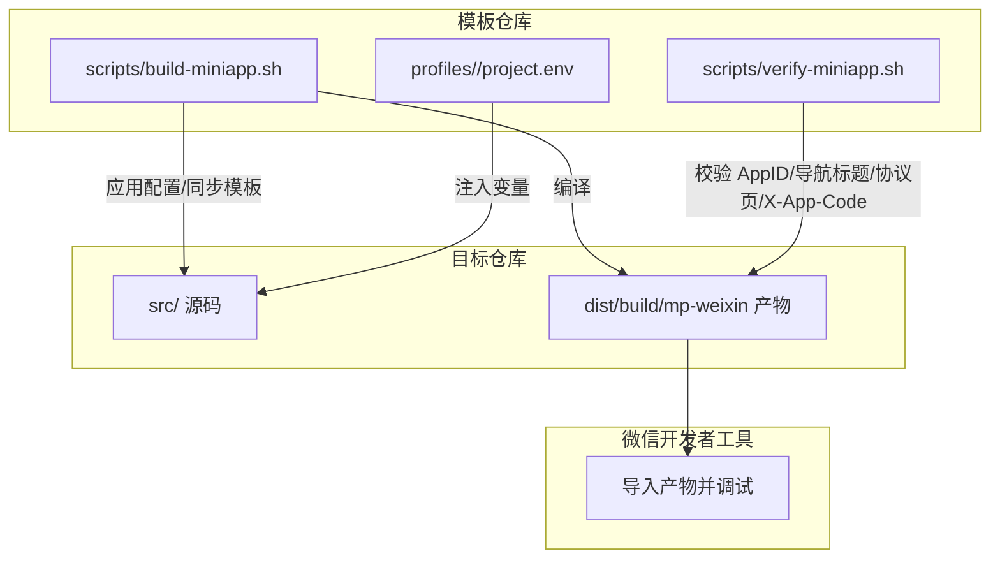

图表来源
- [README.md:242-286](file://README.md#L242-L286)
- [scripts/build-miniapp.sh:1-106](file://scripts/build-miniapp.sh#L1-L106)
- [scripts/verify-miniapp.sh:1-165](file://scripts/verify-miniapp.sh#L1-L165)

章节来源
- [README.md:242-286](file://README.md#L242-L286)
- [scripts/build-miniapp.sh:1-106](file://scripts/build-miniapp.sh#L1-L106)
- [scripts/verify-miniapp.sh:1-165](file://scripts/verify-miniapp.sh#L1-L165)

## 详细组件分析

### 组件：App.uvue（应用入口）
- 职责
  - 生命周期钩子：启动、显示、隐藏、退出等日志记录。
  - 平台特定逻辑：Android 返回键双击退出策略。
  - 全局样式：统一骨架屏动画、滚动条隐藏、登录弹窗样式。
- 设计要点
  - 使用条件编译适配 APP-ANDROID/APP-HARMONY 平台。
  - 骨架屏与登录弹窗样式集中管理，便于主题统一。

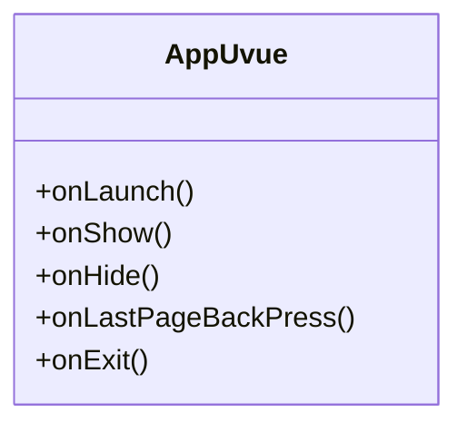

图表来源
- [src/App.uvue:6-39](file://src/App.uvue#L6-L39)

章节来源
- [src/App.uvue:1-335](file://src/App.uvue#L1-L335)

### 组件：main.uts（应用初始化）
- 职责
  - 创建 SSR 应用实例，导出 createApp，供运行时使用。
- 设计要点
  - 与 App.uvue 协作，形成标准 uni-app x 应用初始化流程。

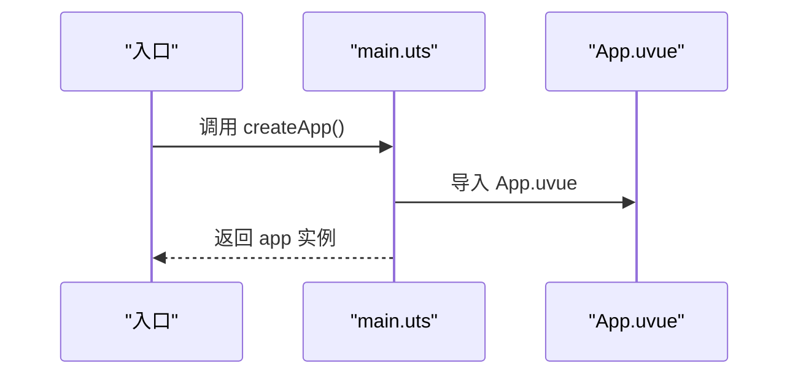

图表来源
- [src/main.uts:1-9](file://src/main.uts#L1-L9)

章节来源
- [src/main.uts:1-9](file://src/main.uts#L1-L9)

### 组件：pages.json（页面与导航）
- 职责
  - 定义页面路由、自定义导航与底部 tabBar。
  - 全局导航样式与标题文本。
- 设计要点
  - 不同页面可覆盖全局样式（如自定义导航、标题）。
  - tabBar 图标路径与文案统一管理。

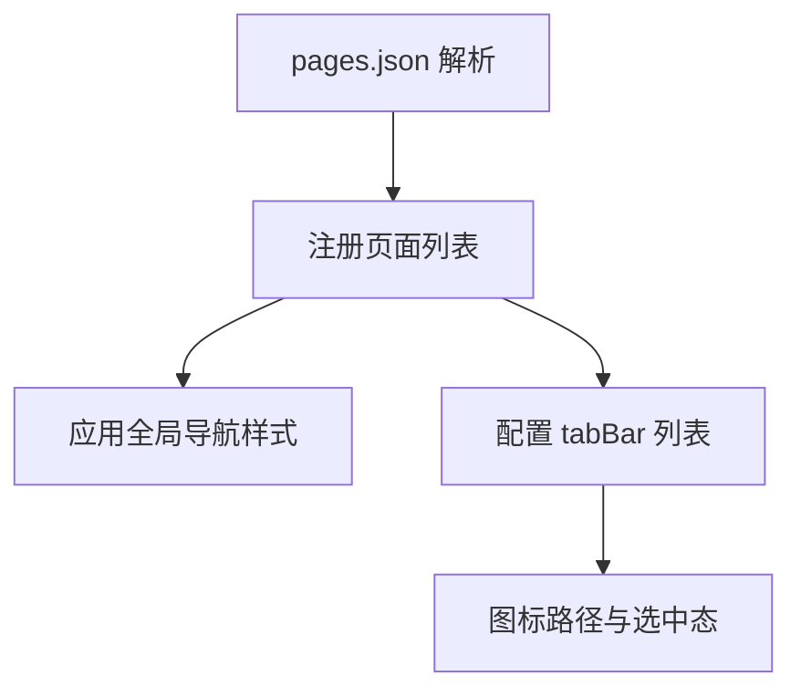

图表来源
- [src/pages.json:1-90](file://src/pages.json#L1-L90)

章节来源
- [src/pages.json:1-90](file://src/pages.json#L1-L90)

### 组件：manifest.json（应用清单）
- 职责
  - 应用元信息、版本、平台特定配置（mp-weixin）。
- 设计要点
  - mp-weixin setting 控制编译选项，确保与微信开发者工具一致。

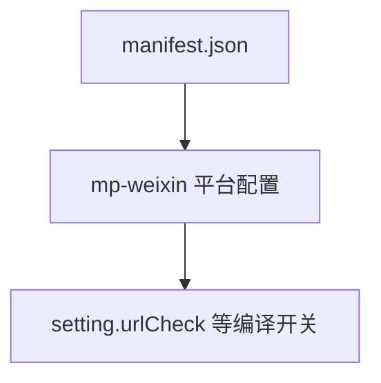

图表来源
- [src/manifest.json:11-20](file://src/manifest.json#L11-L20)

章节来源
- [src/manifest.json:1-73](file://src/manifest.json#L1-L73)

### 组件：utils/http.uts（请求封装）
- 职责
  - 统一请求入口，拼接 baseURL，注入 Authorization 与 X-App-Code，处理 401 自动登出。
  - 提供 get/post 辅助方法。
- 设计要点
  - 通过 config.uts 获取 baseURL 与超时。
  - 仅在存在 token 时附加 Authorization 头。
  - 支持可选 loading 显示与隐藏。

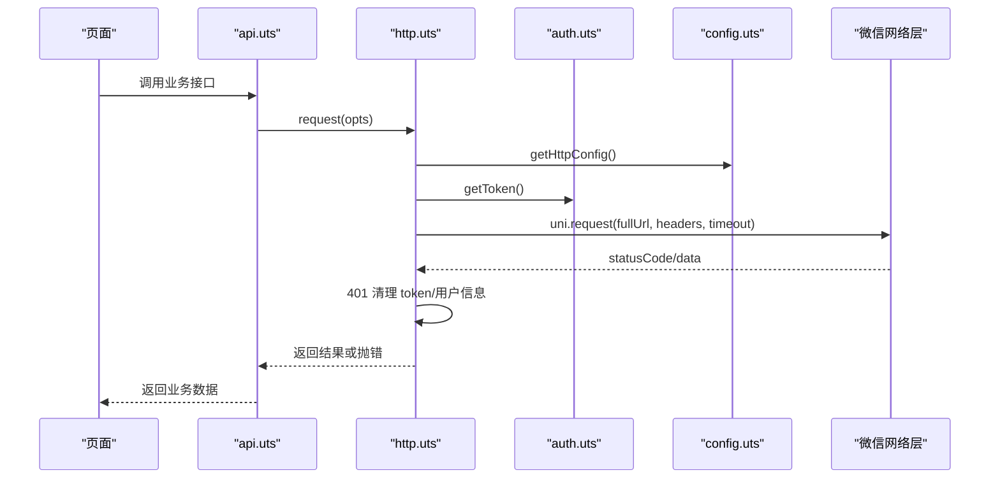

图表来源
- [src/utils/api.uts:1-312](file://src/utils/api.uts#L1-L312)
- [src/utils/http.uts:1-82](file://src/utils/http.uts#L1-L82)
- [src/utils/auth.uts:1-149](file://src/utils/auth.uts#L1-L149)
- [src/utils/config.uts:1-12](file://src/utils/config.uts#L1-L12)

章节来源
- [src/utils/http.uts:1-82](file://src/utils/http.uts#L1-L82)
- [src/utils/api.uts:1-312](file://src/utils/api.uts#L1-L312)
- [src/utils/auth.uts:1-149](file://src/utils/auth.uts#L1-L149)
- [src/utils/config.uts:1-12](file://src/utils/config.uts#L1-L12)

### 组件：utils/api.uts（接口定义）
- 职责
  - 客片分类/列表、详情、登录/绑定/用户信息、点赞/收藏、搜索、店铺、中台配置等接口。
  - 类型定义与参数约束，减少调用侧心智负担。
- 设计要点
  - 严格区分公开与登录态接口，避免误用。
  - 对批量查询与分页参数进行统一抽象。

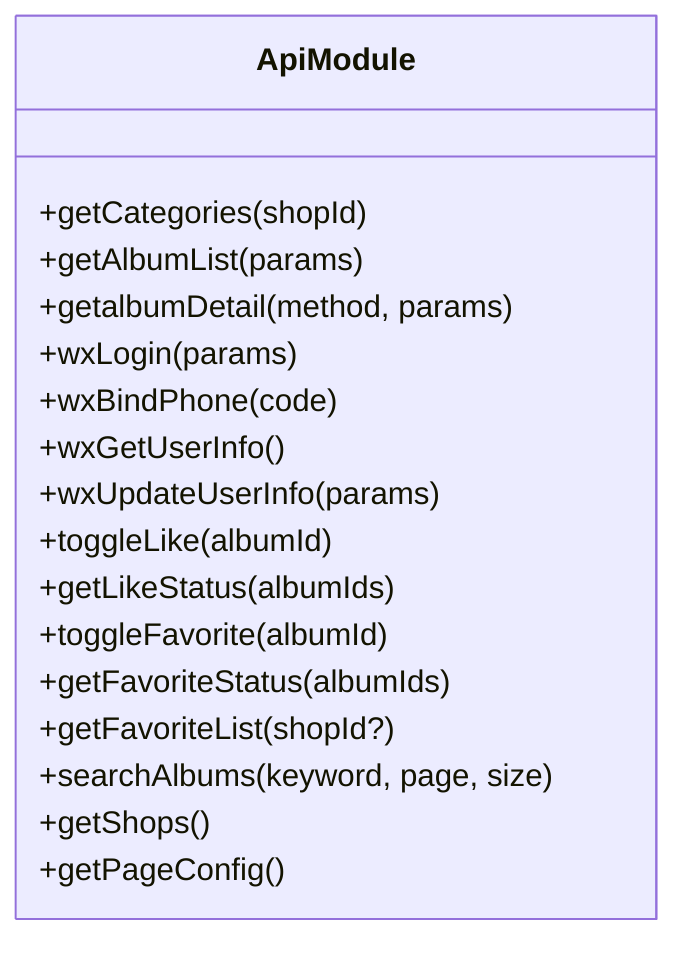

图表来源
- [src/utils/api.uts:27-312](file://src/utils/api.uts#L27-L312)

章节来源
- [src/utils/api.uts:1-312](file://src/utils/api.uts#L1-L312)

### 组件：utils/auth.uts（认证与用户信息）
- 职责
  - token 与用户信息的存取、合并、清理。
  - 登录状态判断与完整登录/登出流程。
- 设计要点
  - mergeUserInfo 避免部分字段覆盖导致信息丢失。
  - 统一的存储异常处理与日志记录。

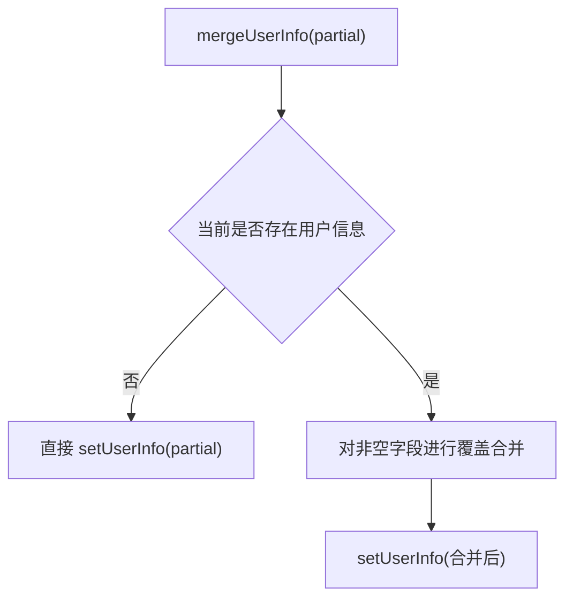

图表来源
- [src/utils/auth.uts:92-106](file://src/utils/auth.uts#L92-L106)

章节来源
- [src/utils/auth.uts:1-149](file://src/utils/auth.uts#L1-L149)

### 组件：components/AppFooter/AppFooter.uvue（全局页脚）
- 职责
  - 统一渲染版权文案，支持通过 profile 注入默认值。
- 设计要点
  - 保持与页面现有样式结构兼容，避免视觉变化。

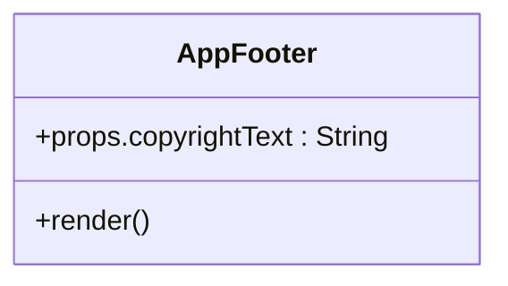

图表来源
- [src/components/AppFooter/AppFooter.uvue:14-24](file://src/components/AppFooter/AppFooter.uvue#L14-L24)

章节来源
- [src/components/AppFooter/AppFooter.uvue:1-25](file://src/components/AppFooter/AppFooter.uvue#L1-L25)

### 组件：scripts/build-miniapp.sh（构建流水线）
- 职责
  - 同步模板（可选）、应用 Profile、安装依赖（可选）、编译、产物校验。
- 设计要点
  - 参数化控制是否同步模板、是否安装依赖、是否跳过应用/校验。
  - 输出导入路径提示，便于微信开发者工具导入。

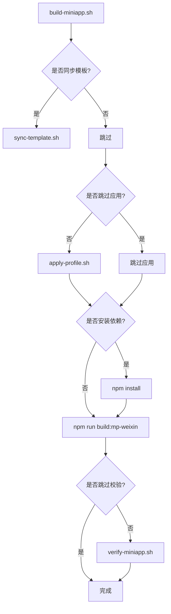

图表来源
- [scripts/build-miniapp.sh:14-106](file://scripts/build-miniapp.sh#L14-L106)

章节来源
- [scripts/build-miniapp.sh:1-106](file://scripts/build-miniapp.sh#L1-L106)

### 组件：scripts/verify-miniapp.sh（产物校验）
- 职责
  - 校验 AppID、导航标题、本地协议页、X-App-Code、可选残留字符串。
- 设计要点
  - 通过 JSON 解析与正则扫描结合，确保产物一致性与安全性。

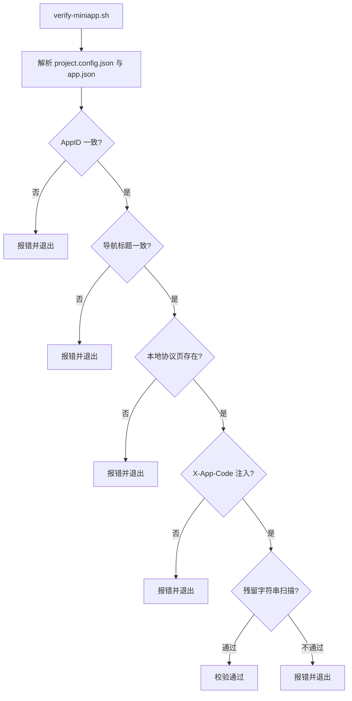

图表来源
- [scripts/verify-miniapp.sh:111-165](file://scripts/verify-miniapp.sh#L111-L165)

章节来源
- [scripts/verify-miniapp.sh:1-165](file://scripts/verify-miniapp.sh#L1-L165)

### 组件：profiles/blueberry/project.env（默认项目配置）
- 职责
  - 定义项目唯一标识、包名、小程序 AppID、导航标题、品牌文案、API 域名、X-App-Code、小程序名称等。
- 设计要点
  - 作为模板仓库的默认示例，其他项目可复制并修改。

章节来源
- [profiles/blueberry/project.env:1-23](file://profiles/blueberry/project.env#L1-L23)

## 依赖关系分析
- 构建与运行
  - package.json 定义了开发与生产构建脚本，Vite 插件由 @dcloudio/vite-plugin-uni 提供。
  - project.config.json 控制微信开发者工具编译行为与 libVersion。
- 模块耦合
  - api.uts 依赖 http.uts；http.uts 依赖 config.uts 与 auth.uts。
  - App.uvue 与 main.uts 形成应用初始化链路。
- Profile 注入
  - scripts/ 脚本将 profiles/<project-key>/project.env 注入到 src/ 与构建产物中，verify-miniapp.sh 校验一致性。

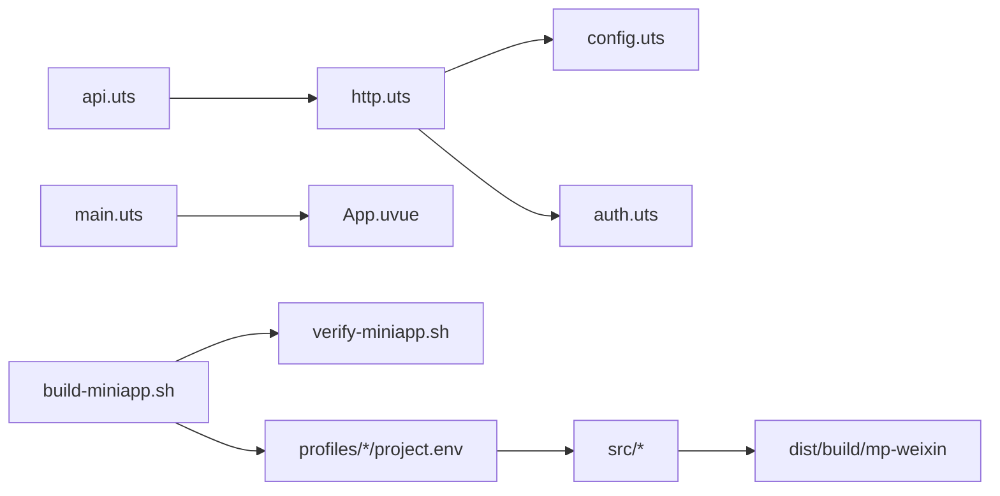

图表来源
- [src/utils/api.uts:1-312](file://src/utils/api.uts#L1-L312)
- [src/utils/http.uts:1-82](file://src/utils/http.uts#L1-L82)
- [src/utils/config.uts:1-12](file://src/utils/config.uts#L1-L12)
- [src/utils/auth.uts:1-149](file://src/utils/auth.uts#L1-L149)
- [src/main.uts:1-9](file://src/main.uts#L1-L9)
- [src/App.uvue:1-335](file://src/App.uvue#L1-L335)
- [scripts/build-miniapp.sh:1-106](file://scripts/build-miniapp.sh#L1-L106)
- [scripts/verify-miniapp.sh:1-165](file://scripts/verify-miniapp.sh#L1-L165)

章节来源
- [package.json:1-48](file://package.json#L1-L48)
- [project.config.json:1-35](file://project.config.json#L1-L35)
- [vite.config.ts:1-9](file://vite.config.ts#L1-L9)

## 性能考虑
- 构建优化
  - 使用 Vite 与 @dcloudio/vite-plugin-uni，开启压缩与资源打包，合理配置 minified 与 minifyWXML/WXSS。
  - project.config.json 中的 setting 控制编译优化级别，建议与实际需求匹配。
- 网络请求
  - 统一超时与重试策略，避免阻塞 UI；对高频接口进行缓存与去抖。
  - 仅在必要时显示 loading，减少不必要的遮罩层。
- UI 体验
  - 骨架屏与懒加载结合，提升首屏感知速度。
  - 避免大图与过多层级渲染，合理拆分页面与组件。

## 调试与排错指南
- 开发环境
  - 使用 npm run dev:mp-weixin 生成开发产物，导入微信开发者工具进行实时调试。
  - 确保微信开发者工具 libVersion ≥ 3.10.1，避免编译差异。
- 常见问题
  - AppID 不一致：检查 project.config.json 与 manifest.json 中的 AppID 是否与 Profile 一致，verify-miniapp.sh 会校验。
  - 导航标题不符：确认 pages.json 中全局标题与 Profile NAVIGATION_TITLE 一致。
  - 协议页缺失：若目标仓库旧代码缺少 pages/policies/*，执行 build-miniapp.sh 时加上 --sync-template 同步模板。
  - X-App-Code 未注入：verify-miniapp.sh 会扫描源码与产物，确保 APP_CODE 正确写入。
- 日志与断点
  - 在 App.uvue 与 utils/http.uts 中添加必要日志，定位请求与鉴权问题。
  - 使用微信开发者工具的“真机调试”与“性能面板”排查卡顿与内存占用。

章节来源
- [README.md:388-402](file://README.md#L388-L402)
- [scripts/verify-miniapp.sh:111-165](file://scripts/verify-miniapp.sh#L111-L165)
- [project.config.json:34](file://project.config.json#L34)

## 结论
本指南提供了蓝莓小程序模板的开发标准与实践路径，涵盖环境配置、代码规范、调试与性能优化、Git 工作流、质量保证与团队协作。通过 Profile 机制与自动化脚本，团队可高效孵化多小程序项目并保持一致性与可维护性。

## 附录

### 开发环境配置
- IDE 推荐
  - VS Code（配合 uni-app/TypeScript/UTS 相关插件）。
- 调试工具
  - 使用 npm run dev:mp-weixin 生成开发产物，导入微信开发者工具进行调试。
- 微信开发者工具设置
  - libVersion ≥ 3.10.1；根据项目需求调整编译设置（minified、minifyWXML/WXSS 等）。

章节来源
- [README.md:54](file://README.md#L54)
- [project.config.json:34](file://project.config.json#L34)

### 代码规范与最佳实践
- 文件命名与目录组织
  - 页面与组件均采用 .uvue/.uts 结尾，utils 下按职责划分模块。
  - 统一使用 src/ 作为唯一源码目录，避免在根目录维护重复文件。
- 注释规范
  - 对复杂逻辑与跨模块交互添加简要注释，保持简洁清晰。
- 类型与接口
  - 在 api.uts 中为接口参数与返回值提供类型定义，提升可维护性。

章节来源
- [README.md:85-130](file://README.md#L85-L130)
- [src/utils/api.uts:1-312](file://src/utils/api.uts#L1-L312)

### Git 工作流程与版本管理
- 建议流程
  - 新功能在独立分支开发，完成后通过 PR 合并主干。
  - 发布前使用 scripts/release-miniapp.sh 生成发布构建，并在微信开发者工具中上传。
- 版本管理
  - 使用语义化版本，配合 tag 管理发布版本。

章节来源
- [README.md:344-384](file://README.md#L344-L384)

### 功能扩展与模块定制
- 新增页面
  - 在 src/pages/ 下新增页面目录与 index.uvue，更新 pages.json。
- 新增组件
  - 在 src/components/ 下新增组件目录与 .uvue 文件，按需导出 props 与样式。
- 新增工具模块
  - 在 src/utils/ 下新增 .uts 文件，遵循现有命名与职责划分。

章节来源
- [README.md:136-151](file://README.md#L136-L151)
- [src/pages.json:1-90](file://src/pages.json#L1-L90)

### 代码审查要点与质量保证
- 审查要点
  - Profile 变量是否正确注入与校验。
  - 请求头与鉴权逻辑是否符合安全规范。
  - 页面与组件是否遵循统一样式与交互规范。
- 质量保证
  - 使用 scripts/verify-miniapp.sh 作为发布前校验步骤。
  - 对关键接口与登录流程进行单元测试与集成测试。

章节来源
- [scripts/verify-miniapp.sh:1-165](file://scripts/verify-miniapp.sh#L1-L165)