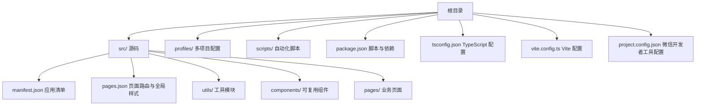
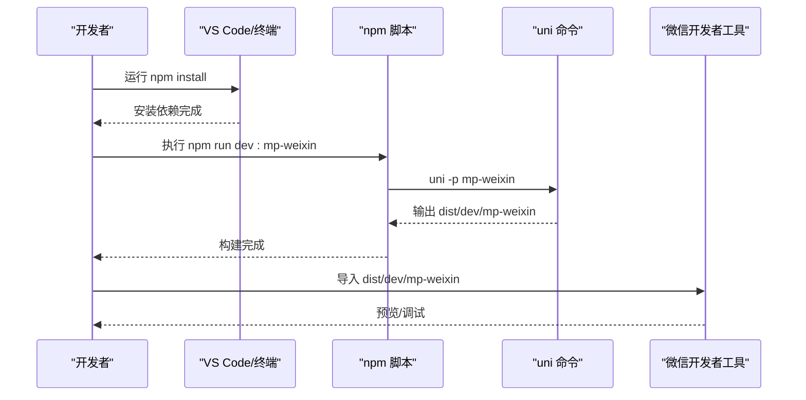
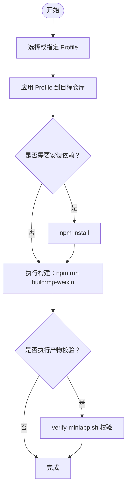
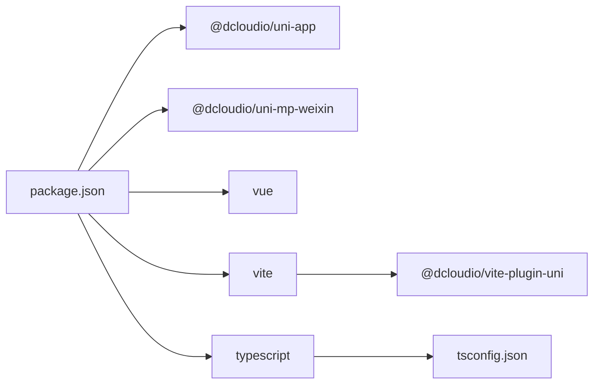

# 开发环境配置

<cite>
**本文引用的文件**
- [package.json](file://package.json)
- [README.md](file://README.md)
- [tsconfig.json](file://tsconfig.json)
- [vite.config.ts](file://vite.config.ts)
- [project.config.json](file://project.config.json)
- [微信开发者工具预览指南.md](file://微信开发者工具预览指南.md)
- [profiles/blueberry/project.env](file://profiles/blueberry/project.env)
- [scripts/build-miniapp.sh](file://scripts/build-miniapp.sh)
- [scripts/apply-profile.sh](file://scripts/apply-profile.sh)
- [scripts/verify-miniapp.sh](file://scripts/verify-miniapp.sh)
- [src/manifest.json](file://src/manifest.json)
- [src/pages.json](file://src/pages.json)
- [src/main.uts](file://src/main.uts)
- [src/env.d.ts](file://src/env.d.ts)
- [src/utils/config.uts](file://src/utils/config.uts)
</cite>

## 目录
1. [简介](#简介)
2. [项目结构](#项目结构)
3. [核心组件](#核心组件)
4. [架构概览](#架构概览)
5. [详细组件分析](#详细组件分析)
6. [依赖分析](#依赖分析)
7. [性能考虑](#性能考虑)
8. [故障排除指南](#故障排除指南)
9. [结论](#结论)
10. [附录](#附录)

## 简介
本指南面向蓝莓小程序项目的开发者，提供从零搭建开发环境的完整步骤，涵盖 Node.js 与 npm 版本要求、微信开发者工具安装与配置、IDE 推荐设置（VS Code 插件、TypeScript、Vue 开发工具）、uni-app x 框架安装与配置、环境变量与调试工具设置，以及开发环境验证与常见问题排查。

## 项目结构
蓝莓项目采用“模板 + Profile”的多项目复用架构：
- 源码统一存放于 src/，根目录文件通过 .gitignore 与构建脚本进行隔离
- profiles/ 下按项目键值维护独立的私有配置（AppID、品牌、API 域名等）
- scripts/ 提供一键构建、应用 Profile、产物校验与发布脚本
- 通过 npm scripts 与 uni 命令驱动开发与构建流程

图表来源
- [README.md:85-130](file://README.md#L85-L130)
- [package.json:1-48](file://package.json#L1-L48)
- [tsconfig.json:1-33](file://tsconfig.json#L1-L33)
- [vite.config.ts:1-9](file://vite.config.ts#L1-L9)
- [project.config.json:1-35](file://project.config.json#L1-L35)

章节来源
- [README.md:85-130](file://README.md#L85-L130)
- [package.json:1-48](file://package.json#L1-L48)

## 核心组件
- Node.js 与 npm：环境要求 Node.js ≥ 18、npm ≥ 9
- uni-app x：基于 Vue 3 + TypeScript/UTS 的跨小程序框架
- Vite 5 + @dcloudio/vite-plugin-uni：构建工具链
- 微信开发者工具：libVersion ≥ 3.10.1，用于导入 dist/dev 或 dist/build 预览与上传
- TypeScript 配置：启用路径别名 @/* → src/*，类型声明包含 @dcloudio/types
- Profile 机制：通过 profiles/<project-key>/project.env 注入 AppID、品牌、API 域名等

章节来源
- [README.md:54](file://README.md#L54)
- [package.json:15-46](file://package.json#L15-L46)
- [tsconfig.json:15-19](file://tsconfig.json#L15-L19)
- [project.config.json:34](file://project.config.json#L34)

## 架构概览
下图展示了从源码到微信开发者工具预览的整体流程，包括 Profile 应用、依赖安装、构建与产物校验的关键节点。

图表来源
- [package.json:4-13](file://package.json#L4-L13)
- [scripts/build-miniapp.sh:92-98](file://scripts/build-miniapp.sh#L92-L98)
- [微信开发者工具预览指南.md:14-24](file://微信开发者工具预览指南.md#L14-L24)

## 详细组件分析

### Node.js 与 npm 版本要求
- Node.js：≥ 18（确保 ES2020+ 语法与 ESM 支持）
- npm：≥ 9（支持现代包管理与工作区特性）
- 验证方式：在终端执行 node -v 与 npm -v

章节来源
- [README.md:54](file://README.md#L54)

### 微信开发者工具安装与配置
- 安装要求：libVersion ≥ 3.10.1
- 预览路径：
  - 开发预览：dist/dev/mp-weixin
  - 生产预览：dist/build/mp-weixin
- 项目配置：
  - project.config.json 中包含 setting、compileType、appid、libVersion 等
  - 通过 Profile 应用可覆盖 AppID 与项目名称

章节来源
- [README.md:54](file://README.md#L54)
- [project.config.json:1-35](file://project.config.json#L1-L35)
- [scripts/apply-profile.sh:15-25](file://scripts/apply-profile.sh#L15-L25)

### IDE 推荐设置（VS Code）
- 插件建议：
  - Vue Language Features (Volar)：提供 Vue 3 + TypeScript 支持
  - TypeScript Importer：自动导入 TS/UTS 模块
  - Prettier：代码格式化
  - ESLint：静态检查
  - Auto Rename Tag：HTML/XML 标签重命名
- TypeScript 配置：
  - 路径别名：@/* → src/*
  - 类型声明：包含 @dcloudio/types
  - include/exclude：覆盖 src/**/*.{ts,d.ts,uts,uvue}
- Vue 开发工具：
  - 使用 Volar 并启用“使用组合式 API”和“启用模板类型检查”
  - 关闭 Vetur（如已安装）

章节来源
- [tsconfig.json:15-19](file://tsconfig.json#L15-L19)
- [tsconfig.json:21-31](file://tsconfig.json#L21-L31)
- [src/env.d.ts:1](file://src/env.d.ts#L1)

### uni-app x 框架安装与配置
- 依赖安装：npm install
- 开发命令：npm run dev:mp-weixin
- 构建命令：npm run build:mp-weixin
- 构建工具：Vite 5 + @dcloudio/vite-plugin-uni
- 应用清单：src/manifest.json（含 mp-weixin appid 与 setting）
- 页面路由：src/pages.json（含全局样式与 tabBar）

章节来源
- [package.json:4-13](file://package.json#L4-L13)
- [vite.config.ts:1-9](file://vite.config.ts#L1-L9)
- [src/manifest.json:11-20](file://src/manifest.json#L11-L20)
- [src/pages.json:56-87](file://src/pages.json#L56-L87)

### 环境变量与 Profile 机制
- Profile 文件：profiles/<project-key>/project.env
- 关键字段（示例）：
  - MP_WEIXIN_APPID：微信小程序 AppID
  - NAVIGATION_TITLE：导航栏标题
  - API_BASE_URL：接口域名
  - APP_CODE：请求头 X-App-Code
  - MINI_APP_NAME：协议页面与登录弹窗中的小程序名称
- 应用流程：
  - apply-profile.sh：将 Profile 注入 package.json、project.config.json、src/manifest.json、src/pages.json、src/utils/*.uts 等
  - build-miniapp.sh：一键同步模板、应用 Profile、安装依赖、构建、校验
  - verify-miniapp.sh：校验 AppID、导航栏标题、协议页面、X-App-Code、残留字符串

图表来源
- [scripts/apply-profile.sh:15-25](file://scripts/apply-profile.sh#L15-L25)
- [scripts/build-miniapp.sh:92-102](file://scripts/build-miniapp.sh#L92-L102)
- [scripts/verify-miniapp.sh:114-152](file://scripts/verify-miniapp.sh#L114-L152)

章节来源
- [profiles/blueberry/project.env:1-23](file://profiles/blueberry/project.env#L1-L23)
- [scripts/apply-profile.sh:15-25](file://scripts/apply-profile.sh#L15-L25)
- [scripts/build-miniapp.sh:14-25](file://scripts/build-miniapp.sh#L14-L25)
- [scripts/verify-miniapp.sh:34-45](file://scripts/verify-miniapp.sh#L34-L45)

### 调试工具设置
- 开发预览：npm run dev:mp-weixin 后在微信开发者工具导入 dist/dev/mp-weixin
- 生产预览：npm run build:mp-weixin 后导入 dist/build/mp-weixin
- 常用调试技巧：
  - 使用 Volar 的“打开组件定义”定位 .uvue 组件
  - 在 src/utils/config.uts 中调整 API 域名与超时
  - 在 src/utils/http.uts 中检查请求头（含 X-App-Code）

章节来源
- [微信开发者工具预览指南.md:14-38](file://微信开发者工具预览指南.md#L14-L38)
- [src/utils/config.uts:7-11](file://src/utils/config.uts#L7-L11)

## 依赖分析
- 运行时依赖（部分）：
  - @dcloudio/uni-app、@dcloudio/uni-app-plus、@dcloudio/uni-mp-weixin：uni-app x 核心与微信小程序适配
  - vue、vue-i18n：Vue 3 与国际化
- 开发时依赖（部分）：
  - @dcloudio/types、@dcloudio/vite-plugin-uni、typescript、vite
- 构建链路：
  - npm run dev:mp-weixin → uni -p mp-weixin → Vite 插件处理 → 输出 dist/dev/mp-weixin
  - npm run build:mp-weixin → uni build -p mp-weixin → 输出 dist/build/mp-weixin

图表来源
- [package.json:15-46](file://package.json#L15-L46)
- [vite.config.ts:1-9](file://vite.config.ts#L1-L9)
- [tsconfig.json:15-19](file://tsconfig.json#L15-L19)

章节来源
- [package.json:15-46](file://package.json#L15-L46)

## 性能考虑
- 构建优化：
  - 使用 Vite 5 的原生 ESM 与按需编译，减少冷启动时间
  - 启用 TypeScript 的严格模式与路径别名，提升类型检查效率
- 资源优化：
  - 在 project.config.json 中开启 minified、minifyWXML、minifyWXSS 等压缩选项
  - 合理放置静态资源至 src/static，避免冗余拷贝

章节来源
- [vite.config.ts:1-9](file://vite.config.ts#L1-L9)
- [project.config.json:3-25](file://project.config.json#L3-L25)

## 故障排除指南
- Node.js/npm 版本不满足要求
  - 现象：安装依赖报错或构建失败
  - 解决：升级 Node.js 至 ≥ 18，npm 至 ≥ 9
- 微信开发者工具 AppID 不一致
  - 现象：预览失败或 AppID 显示异常
  - 解决：通过 apply-profile.sh 应用 Profile，确保 project.config.json 与 src/manifest.json 的 AppID 一致
- 导航栏标题不匹配
  - 现象：预览显示标题与预期不符
  - 解决：确认 Profile 中 NAVIGATION_TITLE 与 src/pages.json 的 globalStyle.navigationBarTitleText 一致
- X-App-Code 未生效
  - 现象：请求头缺失或错误
  - 解决：检查 Profile 中 APP_CODE 是否设置，verify-miniapp.sh 是否通过
- 协议页面缺失
  - 现象：verify-miniapp.sh 报告缺少 pages/policies/* 页面
  - 解决：使用 build-miniapp.sh 时添加 --sync-template 参数同步模板协议页
- 依赖未安装或版本冲突
  - 现象：构建时报找不到模块
  - 解决：执行 npm install 清理 node_modules 后重新安装

章节来源
- [scripts/apply-profile.sh:85-90](file://scripts/apply-profile.sh#L85-L90)
- [scripts/verify-miniapp.sh:114-152](file://scripts/verify-miniapp.sh#L114-L152)
- [scripts/build-miniapp.sh:84-90](file://scripts/build-miniapp.sh#L84-L90)

## 结论
通过遵循本指南，您可以快速搭建并稳定运行蓝莓小程序的开发环境。重点在于满足 Node.js 与 npm 版本要求、正确安装与配置微信开发者工具、合理设置 VS Code 与 TypeScript、理解并使用 Profile 机制进行多项目配置复用，最后通过 npm scripts 与自动化脚本完成依赖安装、构建与产物校验。

## 附录
- 开发环境验证清单
  - Node.js 与 npm 版本检查
  - 依赖安装：npm install
  - 开发预览：npm run dev:mp-weixin → 导入 dist/dev/mp-weixin
  - 生产预览：npm run build:mp-weixin → 导入 dist/build/mp-weixin
  - 产物校验：scripts/verify-miniapp.sh
- 常用命令参考
  - npm run dev:mp-weixin
  - npm run build:mp-weixin
  - scripts/build-miniapp.sh <profile-key> [--sync-template] [--install]
  - scripts/apply-profile.sh <profile-key>
  - scripts/verify-miniapp.sh <profile-key>

章节来源
- [README.md:58-79](file://README.md#L58-L79)
- [scripts/build-miniapp.sh:14-25](file://scripts/build-miniapp.sh#L14-L25)
- [scripts/verify-miniapp.sh:34-45](file://scripts/verify-miniapp.sh#L34-L45)