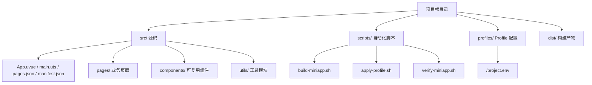
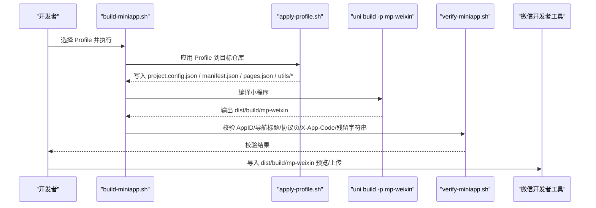
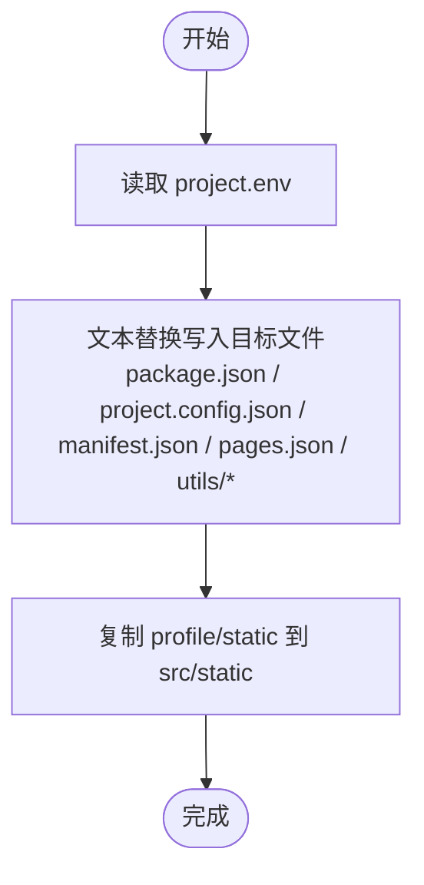
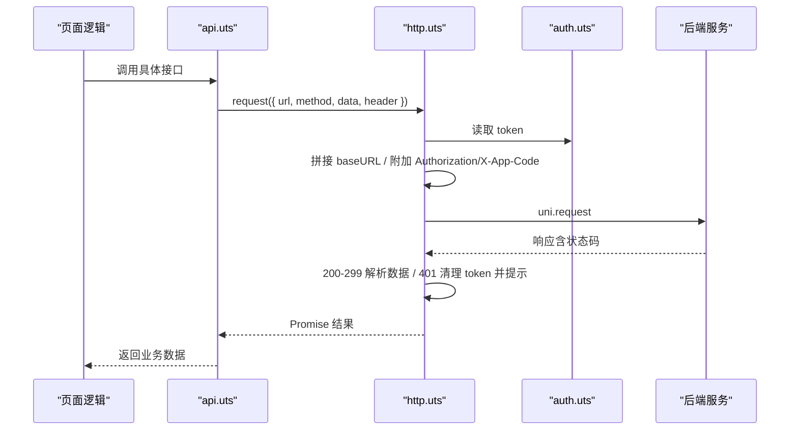
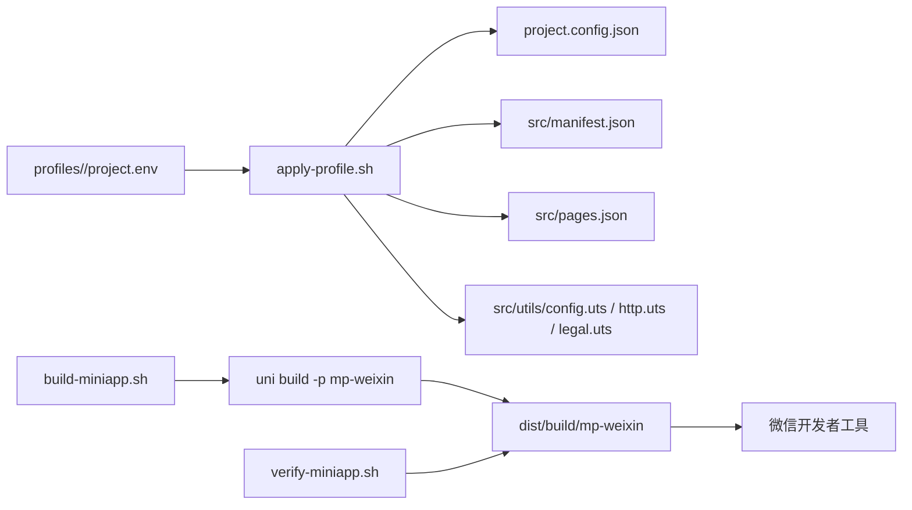

# 故障排除与问题解决

<cite>
**本文引用的文件**
- [README.md](file://README.md)
- [微信开发者工具预览指南.md](file://微信开发者工具预览指南.md)
- [package.json](file://package.json)
- [project.config.json](file://project.config.json)
- [vite.config.ts](file://vite.config.ts)
- [src/manifest.json](file://src/manifest.json)
- [src/pages.json](file://src/pages.json)
- [profiles/blueberry/project.env](file://profiles/blueberry/project.env)
- [scripts/apply-profile.sh](file://scripts/apply-profile.sh)
- [scripts/verify-miniapp.sh](file://scripts/verify-miniapp.sh)
- [scripts/build-miniapp.sh](file://scripts/build-miniapp.sh)
- [src/utils/config.uts](file://src/utils/config.uts)
- [src/utils/http.uts](file://src/utils/http.uts)
- [src/utils/api.uts](file://src/utils/api.uts)
- [src/utils/auth.uts](file://src/utils/auth.uts)
- [src/utils/legal.uts](file://src/utils/legal.uts)
</cite>

## 目录
1. [简介](#简介)
2. [项目结构](#项目结构)
3. [核心组件](#核心组件)
4. [架构总览](#架构总览)
5. [详细组件分析](#详细组件分析)
6. [依赖关系分析](#依赖关系分析)
7. [性能考虑](#性能考虑)
8. [故障排除指南](#故障排除指南)
9. [结论](#结论)
10. [附录](#附录)

## 简介
本指南面向蓝莓小程序项目的开发者与运维人员，系统性梳理常见问题与解决方案，覆盖环境配置、依赖安装、编译错误、运行时错误、微信开发者工具问题、Profile 配置诊断、API 接口调用失败排查、页面渲染与组件加载异常、性能诊断与优化建议，以及问题反馈与求助渠道。内容基于仓库实际文件与脚本，确保可操作性强。

## 项目结构
- 源码集中在 src/，包含应用入口、页面、组件、工具模块与全局配置。
- 构建产物输出至 dist/dev/mp-weixin（开发）与 dist/build/mp-weixin（生产）。
- Profile 机制通过 profiles/<project-key>/project.env 管理各小程序项目的私有配置，避免污染模板源码。
- 自动化脚本位于 scripts/，提供一键构建、应用 Profile、校验产物等功能。

图表来源
- [README.md:85-130](file://README.md#L85-L130)
- [微信开发者工具预览指南.md:3-57](file://微信开发者工具预览指南.md#L3-L57)

章节来源
- [README.md:85-130](file://README.md#L85-L130)
- [微信开发者工具预览指南.md:3-57](file://微信开发者工具预览指南.md#L3-L57)

## 核心组件
- 构建与发布脚本
  - build-miniapp.sh：一键同步模板、应用 Profile、编译、校验。
  - apply-profile.sh：将 Profile 字段写入目标仓库关键文件。
  - verify-miniapp.sh：校验 AppID、导航标题、协议页、X-App-Code、残留字符串等。
- 配置与网络
  - config.uts：集中管理 baseURL 与超时。
  - http.uts：统一请求封装、自动附加 Authorization/X-App-Code、401 自动登出。
  - api.uts：后端接口封装，含登录、收藏、点赞、搜索、店铺、中台页配置等。
  - auth.uts：Token 与用户信息管理，含合并写入策略。
  - legal.uts：协议名称与跳转函数。
- 平台配置
  - project.config.json：开发者工具公开配置（AppID、libVersion 等）。
  - src/manifest.json：uni-app 清单，含 mp-weixin 小程序 AppID 与设置。
  - src/pages.json：页面路由、全局导航与 tabBar 配置。

章节来源
- [scripts/build-miniapp.sh:1-106](file://scripts/build-miniapp.sh#L1-L106)
- [scripts/apply-profile.sh:1-98](file://scripts/apply-profile.sh#L1-L98)
- [scripts/verify-miniapp.sh:1-165](file://scripts/verify-miniapp.sh#L1-L165)
- [src/utils/config.uts:1-12](file://src/utils/config.uts#L1-L12)
- [src/utils/http.uts:1-82](file://src/utils/http.uts#L1-L82)
- [src/utils/api.uts:1-312](file://src/utils/api.uts#L1-L312)
- [src/utils/auth.uts:1-149](file://src/utils/auth.uts#L1-L149)
- [src/utils/legal.uts:1-16](file://src/utils/legal.uts#L1-L16)
- [project.config.json:1-35](file://project.config.json#L1-L35)
- [src/manifest.json:1-73](file://src/manifest.json#L1-L73)
- [src/pages.json:1-90](file://src/pages.json#L1-L90)

## 架构总览
下图展示从 Profile 应用到构建产物校验的关键流程，以及网络请求在运行时的处理路径。

图表来源
- [scripts/build-miniapp.sh:14-106](file://scripts/build-miniapp.sh#L14-L106)
- [scripts/apply-profile.sh:15-98](file://scripts/apply-profile.sh#L15-L98)
- [scripts/verify-miniapp.sh:39-165](file://scripts/verify-miniapp.sh#L39-L165)
- [package.json:4-14](file://package.json#L4-L14)

## 详细组件分析

### Profile 配置与应用
- Profile 字段映射
  - MP_WEIXIN_APPID：同时写入 project.config.json 与 src/manifest.json，并在构建后由 verify-miniapp.sh 校验一致性。
  - NAVIGATION_TITLE：写入 src/pages.json 的全局导航标题。
  - API_BASE_URL：写入 src/utils/config.uts（本仓库默认值可在该文件中查看）。
  - APP_CODE：写入 X-App-Code 请求头（若为空则移除）。
  - MINI_APP_NAME：写入 legal.uts，影响协议页名称与跳转。
  - CONTACT_QR_SRC/COPYRIGHT_TEXT/BRAND_NAME 等：写入页面文案或静态资源。
- 应用流程
  - apply-profile.sh 读取 project.env，调用 Node 脚本进行文本替换，再复制 profile/static 下的资源到 src/static。
  - verify-miniapp.sh 校验产物中的关键字段与文件是否存在。

图表来源
- [scripts/apply-profile.sh:15-98](file://scripts/apply-profile.sh#L15-L98)
- [README.md:225-240](file://README.md#L225-L240)

章节来源
- [scripts/apply-profile.sh:15-98](file://scripts/apply-profile.sh#L15-L98)
- [scripts/verify-miniapp.sh:114-152](file://scripts/verify-miniapp.sh#L114-L152)
- [README.md:169-240](file://README.md#L169-L240)

### 网络请求与鉴权
- 请求封装
  - http.uts 统一 request/get/post，自动拼接 baseURL、附加 Authorization/X-App-Code、设置超时。
  - 401 时自动清理 token 与用户信息并提示重新登录。
- 鉴权与用户信息
  - auth.uts 提供 token 与用户信息的存储、合并写入（避免覆盖已有的非空字段）、登录状态判断与登出。
- 接口封装
  - api.uts 汇聚登录、收藏、点赞、搜索、店铺、中台页配置等接口，统一调用 http.uts。

图表来源
- [src/utils/api.uts:1-312](file://src/utils/api.uts#L1-L312)
- [src/utils/http.uts:20-73](file://src/utils/http.uts#L20-L73)
- [src/utils/auth.uts:17-149](file://src/utils/auth.uts#L17-L149)

章节来源
- [src/utils/http.uts:1-82](file://src/utils/http.uts#L1-L82)
- [src/utils/auth.uts:1-149](file://src/utils/auth.uts#L1-L149)
- [src/utils/api.uts:1-312](file://src/utils/api.uts#L1-L312)

### 页面与导航
- pages.json 管理页面路由、全局导航样式与 tabBar 列表。
- manifest.json 的 mp-weixin 段落控制小程序 AppID 与编译设置。
- project.config.json 控制开发者工具行为（如 urlCheck、libVersion 等）。

章节来源
- [src/pages.json:1-90](file://src/pages.json#L1-L90)
- [src/manifest.json:11-20](file://src/manifest.json#L11-L20)
- [project.config.json:32-35](file://project.config.json#L32-L35)

## 依赖关系分析
- 构建链路
  - npm scripts -> uni cli -> Vite 插件 -> 产物 dist/
- 配置链路
  - Profile 字段 -> apply-profile.sh -> 目标仓库关键文件 -> 构建产物 -> verify-miniapp.sh 校验
- 运行时链路
  - 页面逻辑 -> api.uts -> http.uts -> auth.uts -> 后端服务

图表来源
- [scripts/build-miniapp.sh:84-102](file://scripts/build-miniapp.sh#L84-L102)
- [scripts/apply-profile.sh:15-98](file://scripts/apply-profile.sh#L15-L98)
- [scripts/verify-miniapp.sh:111-152](file://scripts/verify-miniapp.sh#L111-L152)
- [package.json:4-14](file://package.json#L4-L14)

章节来源
- [scripts/build-miniapp.sh:1-106](file://scripts/build-miniapp.sh#L1-L106)
- [scripts/apply-profile.sh:1-98](file://scripts/apply-profile.sh#L1-L98)
- [scripts/verify-miniapp.sh:1-165](file://scripts/verify-miniapp.sh#L1-L165)
- [package.json:1-48](file://package.json#L1-L48)

## 性能考虑
- 构建优化
  - 使用 Vite 与 uni 插件，开启压缩与按需打包，减少包体体积。
  - 合理拆分页面与组件，避免一次性加载过多资源。
- 运行时优化
  - 合理使用缓存与懒加载，减少重复请求。
  - 控制图片与媒体资源尺寸，避免大图导致渲染卡顿。
- Profile 与产物校验
  - 通过 verify-miniapp.sh 的残留字符串扫描，避免模板字符串进入产物，减少无效体积与潜在风险。

章节来源
- [vite.config.ts:1-9](file://vite.config.ts#L1-L9)
- [scripts/verify-miniapp.sh:154-159](file://scripts/verify-miniapp.sh#L154-L159)

## 故障排除指南

### 一、环境配置问题
- Node.js 与包管理器版本
  - 环境要求：Node.js ≥ 18，npm ≥ 9。请检查本地版本并升级。
- 微信开发者工具版本
  - project.config.json 中 libVersion ≥ 3.10.1。若版本过低可能导致预览/真机调试异常。
- 构建工具
  - Vite 与 @dcloudio/vite-plugin-uni 已在 devDependencies 中声明，确保安装完整。

章节来源
- [README.md:54](file://README.md#L54)
- [project.config.json:34-35](file://project.config.json#L34-L35)
- [vite.config.ts:1-9](file://vite.config.ts#L1-L9)
- [package.json:35-46](file://package.json#L35-L46)

### 二、依赖安装问题
- 症状
  - 安装阶段报错、node_modules 缺失、构建失败。
- 排查步骤
  - 确认已执行 npm install（build-miniapp.sh 默认会在缺失时自动安装）。
  - 检查网络与 registry 配置，必要时切换为国内镜像。
  - 清理缓存后重试：删除 node_modules 与 package-lock.json，重新安装。
- 相关脚本
  - build-miniapp.sh 在未检测到 node_modules 时会自动安装依赖。

章节来源
- [scripts/build-miniapp.sh:92-95](file://scripts/build-miniapp.sh#L92-L95)

### 三、编译错误
- 常见原因
  - 源码不在 src/ 或与 .gitignore 冲突。
  - pages.json、manifest.json、utils/*.uts 等关键文件格式错误。
  - Profile 字段缺失或非法（如 API_BASE_URL 未正确注入）。
- 排查步骤
  - 使用 build-miniapp.sh 完整流程：同步模板、应用 Profile、编译、校验。
  - 如目标仓库历史较旧，先执行 --sync-template 同步模板代码。
  - 检查 pages.json 语法与 tabBar 路径是否存在。
  - 检查 manifest.json 的 mp-weixin 段落与 project.config.json 的 appid 是否一致。
- 相关脚本
  - build-miniapp.sh、apply-profile.sh、verify-miniapp.sh。

章节来源
- [README.md:271-276](file://README.md#L271-L276)
- [scripts/build-miniapp.sh:84-102](file://scripts/build-miniapp.sh#L84-L102)
- [scripts/verify-miniapp.sh:101-122](file://scripts/verify-miniapp.sh#L101-L122)
- [src/pages.json:1-90](file://src/pages.json#L1-L90)
- [src/manifest.json:11-20](file://src/manifest.json#L11-L20)
- [project.config.json:32](file://project.config.json#L32)

### 四、运行时错误

#### 1. AppID 不匹配
- 症状
  - 预览/上传时报 AppID 不一致。
- 原因
  - project.config.json 与 src/manifest.json 的 AppID 与 Profile 中 MP_WEIXIN_APPID 不一致。
- 解决方案
  - 使用 apply-profile.sh 应用 Profile，确保双写一致。
  - 使用 verify-miniapp.sh 校验产物中的 appid 与期望一致。
- 相关脚本
  - apply-profile.sh、verify-miniapp.sh。

章节来源
- [scripts/apply-profile.sh:15-25](file://scripts/apply-profile.sh#L15-L25)
- [scripts/verify-miniapp.sh:114-117](file://scripts/verify-miniapp.sh#L114-L117)
- [README.md:390-391](file://README.md#L390-L391)

#### 2. 真机调试失败
- 症状
  - 真机无法连接或断连频繁。
- 排查步骤
  - 检查 project.config.json 的 setting.urlCheck 是否符合当前域名策略。
  - 确认 libVersion ≥ 3.10.1。
  - 确保网络稳定，必要时更换网络或关闭代理。
- 相关配置
  - project.config.json 的 setting 与 libVersion。

章节来源
- [project.config.json:2-25](file://project.config.json#L2-L25)
- [project.config.json:34-35](file://project.config.json#L34-L35)

#### 3. 网络请求异常
- 症状
  - 接口 401、跨域、超时、返回空数据。
- 排查步骤
  - 检查 API_BASE_URL 是否正确（Profile 注入或 config.uts 默认值）。
  - 检查 X-App-Code 是否在产物中存在（verify-miniapp.sh 校验）。
  - 检查 Authorization 是否正确附加（仅在 token 存在时添加）。
  - 检查后端是否允许当前域名访问（CORS）。
- 相关模块
  - http.uts、config.uts、verify-miniapp.sh。

章节来源
- [src/utils/http.uts:20-73](file://src/utils/http.uts#L20-L73)
- [src/utils/config.uts:7-11](file://src/utils/config.uts#L7-L11)
- [scripts/verify-miniapp.sh:132-137](file://scripts/verify-miniapp.sh#L132-L137)

#### 4. 页面渲染异常
- 症状
  - tabBar 图标不显示、导航标题不正确、页面空白。
- 排查步骤
  - 检查 src/pages.json 的 tabBar 配置与图标路径是否存在。
  - 检查 NAVIGATION_TITLE 是否与 pages.json 中的全局标题一致。
  - 检查页面路径是否正确，是否存在拼写错误。
- 相关配置
  - src/pages.json、apply-profile.sh 写入的导航标题。

章节来源
- [src/pages.json:62-87](file://src/pages.json#L62-L87)
- [scripts/verify-miniapp.sh:119-122](file://scripts/verify-miniapp.sh#L119-L122)
- [README.md:229-232](file://README.md#L229-L232)

#### 5. 组件加载失败
- 症状
  - 自定义组件无法渲染或报找不到组件。
- 排查步骤
  - 确认组件路径与命名正确，遵循 .uvue 后缀规范。
  - 检查 components 目录结构与引用方式。
  - 确保未在根目录维护 pages/static/utils 等副本（.gitignore 已限制）。
- 相关说明
  - README.md 明确禁止在根目录维护 src 下代码副本，避免漂移。

章节来源
- [README.md:132](file://README.md#L132)

#### 6. 协议页面缺失
- 症状
  - verify-miniapp.sh 报告缺少 pages/policies/user 或 pages/policies/privacy。
- 解决方案
  - 使用 build-miniapp.sh 时加上 --sync-template 同步模板协议页。
- 相关脚本
  - build-miniapp.sh、verify-miniapp.sh。

章节来源
- [scripts/verify-miniapp.sh:145-151](file://scripts/verify-miniapp.sh#L145-L151)
- [README.md:393-394](file://README.md#L393-L394)

#### 7. Profile 配置问题
- 症状
  - 导航标题不正确、AppID 不一致、X-App-Code 未生效、残留字符串。
- 排查步骤
  - 检查 profiles/<project-key>/project.env 字段是否完整。
  - 使用 apply-profile.sh 应用并确认写入目标文件。
  - 使用 verify-miniapp.sh 校验各项指标。
  - 如需扫描残留字符串，设置 RESIDUAL_SEARCH_REGEX 并执行校验。
- 相关脚本
  - apply-profile.sh、verify-miniapp.sh。

章节来源
- [scripts/apply-profile.sh:15-98](file://scripts/apply-profile.sh#L15-L98)
- [scripts/verify-miniapp.sh:154-159](file://scripts/verify-miniapp.sh#L154-L159)
- [README.md:225-240](file://README.md#L225-L240)

#### 8. API 接口调用失败
- 症状
  - 登录失败、收藏/点赞状态异常、搜索无结果。
- 排查步骤
  - 检查 wxLogin、wxBindPhone、wxGetUserInfo、wxUpdateUserInfo 等接口调用是否传参正确。
  - 检查 toggleLike、toggleFavorite、getFavoriteList、searchAlbums、getShops、getPageConfig 等接口返回结构。
  - 检查 401 自动登出逻辑是否触发（token 过期）。
- 相关模块
  - api.uts、http.uts、auth.uts。

章节来源
- [src/utils/api.uts:124-312](file://src/utils/api.uts#L124-L312)
- [src/utils/http.uts:50-61](file://src/utils/http.uts#L50-L61)
- [src/utils/auth.uts:125-149](file://src/utils/auth.uts#L125-L149)

### 五、微信开发者工具相关问题
- 导入路径
  - 开发预览：dist/dev/mp-weixin；生产预览：dist/build/mp-weixin。
- 常见问题
  - 导入旧目录或未编译导致预览失败。
  - AppID 不一致导致上传失败。
- 解决方案
  - 使用脚本生成最新产物后导入对应目录。
  - 确保 apply-profile.sh 已应用且 verify-miniapp.sh 校验通过。

章节来源
- [微信开发者工具预览指南.md:12-38](file://微信开发者工具预览指南.md#L12-L38)
- [scripts/build-miniapp.sh:104-106](file://scripts/build-miniapp.sh#L104-L106)

### 六、性能问题诊断与优化
- 诊断
  - 使用开发者工具的性能面板观察卡顿点。
  - 检查网络请求耗时与并发数。
- 优化建议
  - 合理拆分页面与组件，按需加载。
  - 减少不必要的 setData 与重绘。
  - 控制图片与媒体资源体积，使用 CDN。
  - 通过 verify-miniapp.sh 的残留字符串扫描避免无效资源进入产物。

章节来源
- [scripts/verify-miniapp.sh:154-159](file://scripts/verify-miniapp.sh#L154-L159)

### 七、问题反馈与求助渠道
- 模板仓库
  - 项目使用 MIT 许可，可在 GitHub 上提交 issue 反馈问题。
- 常见问题
  - FAQ 中已收录典型问题与解答，可优先查阅。

章节来源
- [README.md:388-407](file://README.md#L388-L407)

## 结论
本指南围绕蓝莓小程序模板的开发、构建、校验与运行时问题提供了系统化的排查思路与解决方案。建议在日常工作中：
- 优先使用 build-miniapp.sh 完整流程，确保 Profile 应用与产物校验。
- 遇到问题先对照 verify-miniapp.sh 的校验项逐项排查。
- 遵循 README 的目录与配置约束，避免源码漂移与 AppID 不一致。
- 借助微信开发者工具与性能面板定位运行时问题。

## 附录

### A. 关键文件与职责速览
- scripts/build-miniapp.sh：一键构建流水线
- scripts/apply-profile.sh：应用 Profile 到目标仓库
- scripts/verify-miniapp.sh：校验构建产物
- src/utils/config.uts：API 域名与超时
- src/utils/http.uts：统一请求封装与 401 处理
- src/utils/api.uts：接口封装
- src/utils/auth.uts：登录态与用户信息管理
- src/utils/legal.uts：协议名称与跳转
- project.config.json：开发者工具公开配置
- src/manifest.json：uni-app 清单（含 mp-weixin AppID）
- src/pages.json：页面路由、全局导航与 tabBar

章节来源
- [scripts/build-miniapp.sh:1-106](file://scripts/build-miniapp.sh#L1-L106)
- [scripts/apply-profile.sh:1-98](file://scripts/apply-profile.sh#L1-L98)
- [scripts/verify-miniapp.sh:1-165](file://scripts/verify-miniapp.sh#L1-L165)
- [src/utils/config.uts:1-12](file://src/utils/config.uts#L1-L12)
- [src/utils/http.uts:1-82](file://src/utils/http.uts#L1-L82)
- [src/utils/api.uts:1-312](file://src/utils/api.uts#L1-L312)
- [src/utils/auth.uts:1-149](file://src/utils/auth.uts#L1-L149)
- [src/utils/legal.uts:1-16](file://src/utils/legal.uts#L1-L16)
- [project.config.json:1-35](file://project.config.json#L1-L35)
- [src/manifest.json:1-73](file://src/manifest.json#L1-L73)
- [src/pages.json:1-90](file://src/pages.json#L1-L90)
