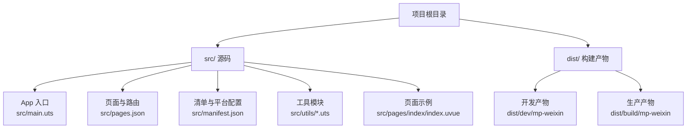
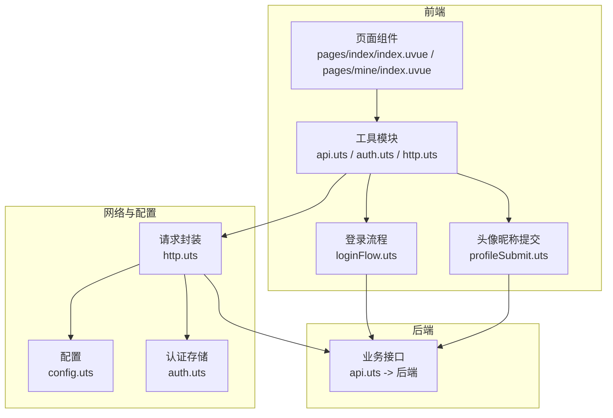
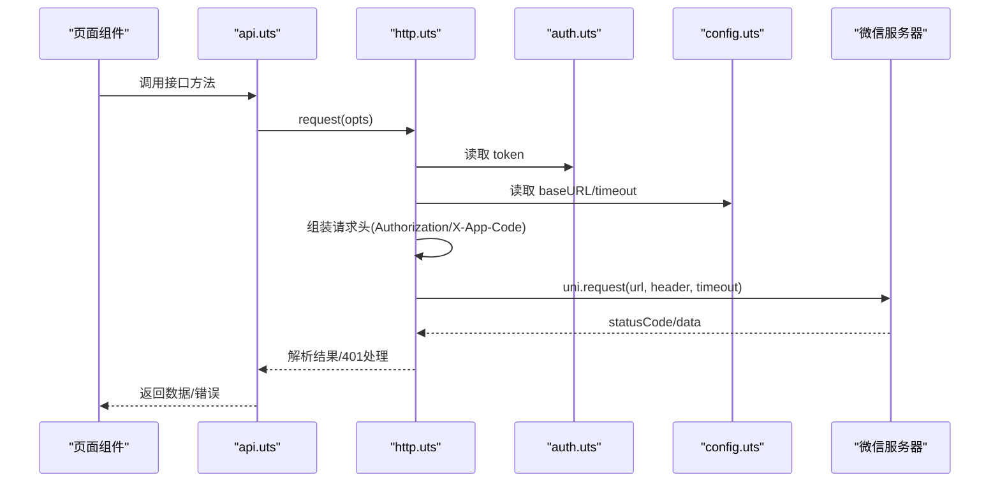
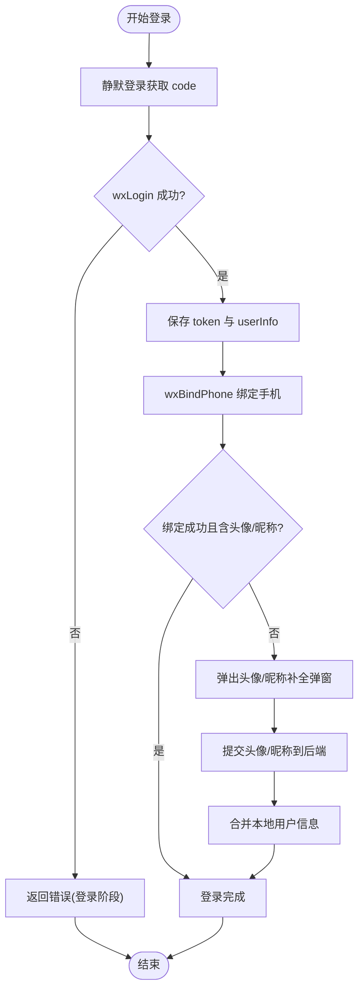
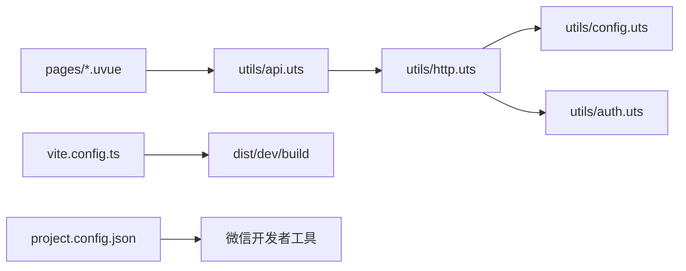

# 调试技巧与性能优化

<cite>
**本文引用的文件**
- [README.md](file://README.md)
- [微信开发者工具预览指南.md](file://微信开发者工具预览指南.md)
- [src/main.uts](file://src/main.uts)
- [src/manifest.json](file://src/manifest.json)
- [src/pages.json](file://src/pages.json)
- [src/utils/http.uts](file://src/utils/http.uts)
- [src/utils/config.uts](file://src/utils/config.uts)
- [src/utils/auth.uts](file://src/utils/auth.uts)
- [src/utils/api.uts](file://src/utils/api.uts)
- [src/utils/loginFlow.uts](file://src/utils/loginFlow.uts)
- [src/utils/profileSubmit.uts](file://src/utils/profileSubmit.uts)
- [src/utils/imageLoader.uts](file://src/utils/imageLoader.uts)
- [src/utils/format.uts](file://src/utils/format.uts)
- [src/utils/legal.uts](file://src/utils/legal.uts)
- [src/pages/index/index.uvue](file://src/pages/index/index.uvue)
- [src/pages/mine/index.uvue](file://src/pages/mine/index.uvue)
- [vite.config.ts](file://vite.config.ts)
- [project.config.json](file://project.config.json)
</cite>

## 目录
1. [简介](#简介)
2. [项目结构](#项目结构)
3. [核心组件](#核心组件)
4. [架构总览](#架构总览)
5. [详细组件分析](#详细组件分析)
6. [依赖关系分析](#依赖关系分析)
7. [性能考量](#性能考量)
8. [故障排查指南](#故障排查指南)
9. [结论](#结论)
10. [附录](#附录)

## 简介
本指南面向蓝莓小程序项目（基于 uni-app x + Vue 3 + UTS/TypeScript）的调试与性能优化，覆盖微信开发者工具使用、真机调试、网络监控、Storage 查看、Console 调试、uni-app 开发调试要点、HTTP 请求调试（请求拦截、响应查看、错误追踪）、性能分析（内存、渲染、网络）、常见问题定位（登录状态异常、API 调用失败、页面渲染问题）以及性能优化策略（图片懒加载、数据缓存、组件优化等）。

## 项目结构
- 源码集中在 src/，包含应用入口、页面、组件、工具模块与全局配置。
- 构建产物输出到 dist/dev/mp-weixin 或 dist/build/mp-weixin，供微信开发者工具导入。
- 通过 npm scripts 一键开发/生产构建，结合 Profile 机制注入 API 域名、AppID、导航标题等。

图表来源
- [README.md:85-130](file://README.md#L85-L130)
- [微信开发者工具预览指南.md:3-57](file://微信开发者工具预览指南.md#L3-L57)

章节来源
- [README.md:58-82](file://README.md#L58-L82)
- [微信开发者工具预览指南.md:12-39](file://微信开发者工具预览指南.md#L12-L39)

## 核心组件
- 应用入口与框架初始化：应用通过 src/main.uts 创建 SSR App 实例，配合 uni-app x 运行时。
- 网络层：src/utils/http.uts 封装统一请求、自动注入 Authorization/X-App-Code、401 自动登出、超时控制。
- 配置层：src/utils/config.uts 提供 baseURL 与超时配置，受 Profile 注入影响。
- 认证与用户态：src/utils/auth.uts 管理 token、用户信息存储与登录状态判断；src/utils/loginFlow.uts 封装登录三步流程；src/utils/profileSubmit.uts 封装头像/昵称提交。
- API 封装：src/utils/api.uts 汇聚所有后端接口，统一调用 http.uts。
- 页面与交互：首页与“我的”页面演示登录、授权、头像昵称补全、菜单与 Banner 展示等典型流程。
- 性能辅助：src/utils/imageLoader.uts 提供图片预加载与超时保护；src/utils/format.uts 统一计数格式化。

章节来源
- [src/main.uts:1-9](file://src/main.uts#L1-L9)
- [src/utils/http.uts:1-82](file://src/utils/http.uts#L1-L82)
- [src/utils/config.uts:1-12](file://src/utils/config.uts#L1-L12)
- [src/utils/auth.uts:1-149](file://src/utils/auth.uts#L1-L149)
- [src/utils/loginFlow.uts:1-71](file://src/utils/loginFlow.uts#L1-L71)
- [src/utils/profileSubmit.uts:1-37](file://src/utils/profileSubmit.uts#L1-L37)
- [src/utils/api.uts:1-312](file://src/utils/api.uts#L1-L312)
- [src/utils/imageLoader.uts:1-28](file://src/utils/imageLoader.uts#L1-L28)
- [src/utils/format.uts:1-16](file://src/utils/format.uts#L1-L16)

## 架构总览
下图展示从前端请求到后端接口的整体链路，以及登录与用户信息更新的关键节点。

图表来源
- [src/pages/index/index.uvue:96-294](file://src/pages/index/index.uvue#L96-L294)
- [src/pages/mine/index.uvue:136-485](file://src/pages/mine/index.uvue#L136-L485)
- [src/utils/api.uts:1-312](file://src/utils/api.uts#L1-L312)
- [src/utils/http.uts:1-82](file://src/utils/http.uts#L1-L82)
- [src/utils/config.uts:1-12](file://src/utils/config.uts#L1-L12)
- [src/utils/auth.uts:1-149](file://src/utils/auth.uts#L1-L149)
- [src/utils/loginFlow.uts:1-71](file://src/utils/loginFlow.uts#L1-L71)
- [src/utils/profileSubmit.uts:1-37](file://src/utils/profileSubmit.uts#L1-L37)

## 详细组件分析

### HTTP 请求与调试
- 统一请求封装：request/get/post，自动拼接 baseURL、注入 Authorization/X-App-Code、超时控制、401 自动登出。
- 调试建议：
  - 使用微信开发者工具 Network 面板观察请求头（Authorization/X-App-Code）、状态码、耗时。
  - 在调用处传入 showLoading=true 观察加载态，便于定位卡顿。
  - 通过 config.uts 修改 baseURL 快速切换环境。
- 错误追踪：
  - 401 时自动清理 token 与用户信息并提示，可在 Console 查看错误日志。
  - 成功/失败分支分别处理，便于在 Network 面板核对响应结构。

图表来源
- [src/utils/api.uts:1-312](file://src/utils/api.uts#L1-L312)
- [src/utils/http.uts:14-73](file://src/utils/http.uts#L14-L73)
- [src/utils/auth.uts:21-52](file://src/utils/auth.uts#L21-L52)
- [src/utils/config.uts:7-11](file://src/utils/config.uts#L7-L11)

章节来源
- [src/utils/http.uts:14-73](file://src/utils/http.uts#L14-L73)
- [src/utils/config.uts:7-11](file://src/utils/config.uts#L7-L11)
- [src/utils/api.uts:124-190](file://src/utils/api.uts#L124-L190)

### 登录与用户态调试
- 登录三步流程：静默登录获取 code → wxLogin 换取 token 与 userInfo → wxBindPhone 绑定手机号并合并用户信息。
- 头像/昵称补全：通过 chooseAvatar/open-type 与 wxUpdateUserInfo 更新后端并合并本地信息。
- 调试要点：
  - 在 Mine 页面与首页的手机号授权回调中观察 Console 输出，确认每一步返回值。
  - 使用 Storage 面板查看 token 与 userInfo 是否正确写入/更新。
  - onShow 生命周期中拉取最新用户信息，修复历史数据覆盖导致的头像缺失。

图表来源
- [src/utils/loginFlow.uts:20-70](file://src/utils/loginFlow.uts#L20-L70)
- [src/utils/profileSubmit.uts:13-36](file://src/utils/profileSubmit.uts#L13-L36)
- [src/pages/index/index.uvue:166-219](file://src/pages/index/index.uvue#L166-L219)
- [src/pages/mine/index.uvue:293-351](file://src/pages/mine/index.uvue#L293-L351)

章节来源
- [src/utils/loginFlow.uts:20-70](file://src/utils/loginFlow.uts#L20-L70)
- [src/utils/profileSubmit.uts:13-36](file://src/utils/profileSubmit.uts#L13-L36)
- [src/pages/index/index.uvue:166-219](file://src/pages/index/index.uvue#L166-L219)
- [src/pages/mine/index.uvue:293-351](file://src/pages/mine/index.uvue#L293-L351)

### 页面渲染与交互调试
- 骨架屏与并发加载：首页在 onLoad 中并行请求轮播图与店铺列表，减少首屏等待。
- 响应式与依赖追踪：Mine 页面将 userInfo 拆分为扁平字段，避免深层路径依赖导致的 computed 不更新。
- 调试建议：
  - 使用 Performance 面板观察渲染耗时，关注长列表与图片加载。
  - 在 Console 中打印关键状态变化，验证生命周期钩子（onLoad/onShow）执行顺序与时机。

章节来源
- [src/pages/index/index.uvue:124-142](file://src/pages/index/index.uvue#L124-L142)
- [src/pages/mine/index.uvue:172-185](file://src/pages/mine/index.uvue#L172-L185)

### 图片加载与预加载
- 预加载策略：通过 uni.getImageInfo 预加载一组图片，带超时保护，避免无限等待。
- 调试建议：
  - 在图片密集页面（如详情页）提前调用预加载，降低切换白屏概率。
  - 使用 Network 面板观察图片请求次数与缓存命中情况。

章节来源
- [src/utils/imageLoader.uts:8-27](file://src/utils/imageLoader.uts#L8-L27)

### 数据格式化
- 统一计数格式化：>=10000 显示为 “X.X万”，否则显示原始数字。
- 调试建议：
  - 在 Console 中打印格式化前后数值，确保边界值处理正确。

章节来源
- [src/utils/format.uts:10-15](file://src/utils/format.uts#L10-L15)

## 依赖关系分析
- 页面依赖工具模块：页面通过 api.uts 调用 http.uts，间接依赖 config.uts 与 auth.uts。
- 构建与运行：vite.config.ts 配合 @dcloudio/vite-plugin-uni，输出 mp-weixin 目标产物。
- 开发者工具：project.config.json 控制编译选项与 libVersion，确保调试体验稳定。

图表来源
- [src/pages/index/index.uvue:96-106](file://src/pages/index/index.uvue#L96-L106)
- [src/utils/api.uts:1-3](file://src/utils/api.uts#L1-L3)
- [src/utils/http.uts:1-2](file://src/utils/http.uts#L1-L2)
- [src/utils/config.uts:1-2](file://src/utils/config.uts#L1-L2)
- [src/utils/auth.uts:1-4](file://src/utils/auth.uts#L1-L4)
- [vite.config.ts:1-9](file://vite.config.ts#L1-L9)
- [project.config.json:1-35](file://project.config.json#L1-L35)

章节来源
- [vite.config.ts:1-9](file://vite.config.ts#L1-L9)
- [project.config.json:26-35](file://project.config.json#L26-L35)

## 性能考量
- 图片懒加载与预加载
  - 使用 imageLoader 预加载关键图片，缩短切换时延。
  - 在长列表场景中采用懒加载策略，减少首屏压力。
- 数据缓存
  - 利用 Storage 缓存 token 与用户信息，避免重复登录与频繁拉取。
  - 合并用户信息时仅覆盖非空字段，防止历史数据被清空。
- 组件优化
  - 将 userInfo 拆分为扁平字段，提升响应式更新可靠性。
  - 并行加载首页关键数据，缩短首屏时间。
- 网络优化
  - 统一超时与 baseURL 配置，便于切换环境与问题定位。
  - 401 自动登出，避免无效请求堆积。

章节来源
- [src/utils/imageLoader.uts:8-27](file://src/utils/imageLoader.uts#L8-L27)
- [src/utils/auth.uts:92-106](file://src/utils/auth.uts#L92-L106)
- [src/pages/index/index.uvue:124-142](file://src/pages/index/index.uvue#L124-L142)
- [src/pages/mine/index.uvue:172-185](file://src/pages/mine/index.uvue#L172-L185)
- [src/utils/config.uts:7-11](file://src/utils/config.uts#L7-L11)
- [src/utils/http.uts:40-72](file://src/utils/http.uts#L40-L72)

## 故障排查指南
- 真机调试
  - 使用微信开发者工具“真机调试”功能，实时查看 Console、Network、Storage。
  - 确认项目根目录导入 dist/dev/mp-weixin 或 dist/build/mp-weixin。
- Network 面板
  - 检查请求头 Authorization/X-App-Code 是否正确注入。
  - 关注 401/403 状态码与响应体，结合 Console 错误日志定位。
- Storage 面板
  - 核对 token 与 userInfo 是否存在且未被意外清理。
  - 登录后确认 token 与 userInfo 是否同步更新。
- Console 调试
  - 在关键流程（登录三步、头像昵称提交）添加日志，观察返回值与错误分支。
- 常见问题
  - 登录状态异常：检查 onShow 生命周期是否拉取最新用户信息；确认 mergeUserInfo 仅覆盖非空字段。
  - API 调用失败：核对 baseURL 与 APP_CODE；检查超时与 401 自动登出逻辑。
  - 页面渲染问题：确认 userInfo 拆分字段是否生效；检查长列表懒加载与图片预加载策略。

章节来源
- [微信开发者工具预览指南.md:12-39](file://微信开发者工具预览指南.md#L12-L39)
- [src/utils/http.uts:40-72](file://src/utils/http.uts#L40-L72)
- [src/utils/auth.uts:92-106](file://src/utils/auth.uts#L92-L106)
- [src/pages/mine/index.uvue:191-207](file://src/pages/mine/index.uvue#L191-L207)

## 结论
通过统一的网络层、清晰的登录流程与用户态管理、合理的图片加载策略与数据缓存，蓝莓小程序项目在调试与性能方面具备良好的可维护性与可观测性。建议在日常开发中持续利用微信开发者工具的 Network/Storage/Console 能力进行问题定位，并结合本文提供的优化策略持续改进用户体验。

## 附录
- 开发与构建
  - 开发模式：npm run dev:mp-weixin → 导入 dist/dev/mp-weixin。
  - 生产构建：npm run build:mp-weixin → 导入 dist/build/mp-weixin。
- 关键配置
  - baseURL 与超时：src/utils/config.uts。
  - AppID 与编译设置：src/manifest.json、project.config.json。
- 页面与路由
  - 页面清单与全局样式：src/pages.json。

章节来源
- [README.md:244-270](file://README.md#L244-L270)
- [src/manifest.json:11-20](file://src/manifest.json#L11-L20)
- [project.config.json:32-35](file://project.config.json#L32-L35)
- [src/pages.json:1-90](file://src/pages.json#L1-L90)