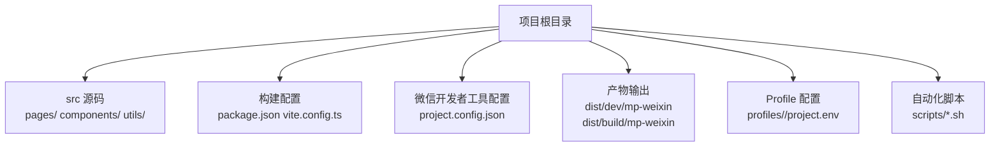
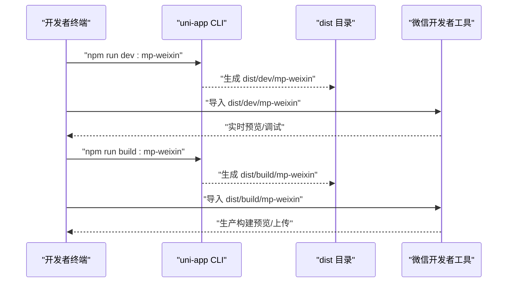
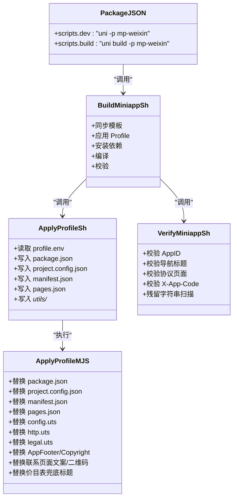

# 快速开始

<cite>
**本文引用的文件**
- [README.md](file://README.md)
- [微信开发者工具预览指南.md](file://微信开发者工具预览指南.md)
- [package.json](file://package.json)
- [vite.config.ts](file://vite.config.ts)
- [project.config.json](file://project.config.json)
- [src/manifest.json](file://src/manifest.json)
- [src/pages.json](file://src/pages.json)
- [src/utils/config.uts](file://src/utils/config.uts)
- [src/utils/http.uts](file://src/utils/http.uts)
- [scripts/build-miniapp.sh](file://scripts/build-miniapp.sh)
- [scripts/verify-miniapp.sh](file://scripts/verify-miniapp.sh)
- [scripts/apply-profile.sh](file://scripts/apply-profile.sh)
- [scripts/lib/apply-profile.mjs](file://scripts/lib/apply-profile.mjs)
- [profiles/blueberry/project.env](file://profiles/blueberry/project.env)
</cite>

## 目录
1. [简介](#简介)
2. [项目结构](#项目结构)
3. [核心组件](#核心组件)
4. [架构总览](#架构总览)
5. [详细组件分析](#详细组件分析)
6. [依赖关系分析](#依赖关系分析)
7. [性能考虑](#性能考虑)
8. [故障排查指南](#故障排查指南)
9. [结论](#结论)
10. [附录](#附录)

## 简介
本指南面向首次接触蓝莓小程序模板的开发者，帮助你在约 30 分钟内完成环境准备、项目克隆、依赖安装、开发模式运行，并了解微信开发者工具导入与预览流程。同时解释 dist/dev 与 dist/build 的区别，以及 Profile 多项目配置机制如何影响最终产物。

## 项目结构
蓝莓模板采用“源码集中于 src/”的组织方式，根目录仅保留构建与脚本相关文件。微信开发者工具导入的是 dist/dev 或 dist/build 下的 mp-weixin 产物目录。

图表来源
- [README.md:85-130](file://README.md#L85-L130)
- [微信开发者工具预览指南.md:3-11](file://微信开发者工具预览指南.md#L3-L11)

章节来源
- [README.md:85-130](file://README.md#L85-L130)
- [微信开发者工具预览指南.md:3-11](file://微信开发者工具预览指南.md#L3-L11)

## 核心组件
- 构建与运行命令
  - 开发模式：npm run dev:mp-weixin → 输出至 dist/dev/mp-weixin
  - 生产模式：npm run build:mp-weixin → 输出至 dist/build/mp-weixin
- 微信开发者工具配置
  - project.config.json：包含 AppID、libVersion 等开发者工具设置
  - src/manifest.json：uni-app 清单，含 mp-weixin 的 appid
- Profile 配置
  - profiles/<project-key>/project.env：定义项目私有变量，驱动构建产物
- 自动化脚本
  - scripts/build-miniapp.sh：一键同步模板、应用 Profile、安装依赖、编译、校验
  - scripts/verify-miniapp.sh：校验 AppID、导航标题、协议页面、请求头等
  - scripts/apply-profile.sh：将 Profile 变量写入目标仓库文件
  - scripts/lib/apply-profile.mjs：具体替换逻辑（package.json、project.config.json、manifest.json、pages.json、utils/* 等）

章节来源
- [README.md:58-82](file://README.md#L58-L82)
- [README.md:244-270](file://README.md#L244-L270)
- [project.config.json:1-35](file://project.config.json#L1-L35)
- [src/manifest.json:1-73](file://src/manifest.json#L1-L73)
- [scripts/build-miniapp.sh:1-106](file://scripts/build-miniapp.sh#L1-L106)
- [scripts/verify-miniapp.sh:1-165](file://scripts/verify-miniapp.sh#L1-L165)
- [scripts/apply-profile.sh:1-98](file://scripts/apply-profile.sh#L1-L98)
- [scripts/lib/apply-profile.mjs:1-190](file://scripts/lib/apply-profile.mjs#L1-L190)

## 架构总览
下面的序列图展示了从本地开发到微信开发者工具预览的整体流程。

图表来源
- [README.md:58-82](file://README.md#L58-L82)
- [微信开发者工具预览指南.md:12-38](file://微信开发者工具预览指南.md#L12-L38)

## 详细组件分析

### 环境准备与工具安装
- Node.js 版本要求：≥ 18
- npm 版本要求：≥ 9
- 微信开发者工具：建议 libVersion ≥ 3.10.1
- 安装方式：从官网下载并安装微信开发者工具

章节来源
- [README.md:54](file://README.md#L54)
- [project.config.json:34](file://project.config.json#L34)

### 项目克隆与依赖安装
- 克隆仓库后进入项目目录
- 安装依赖：npm install
- 如需一键构建流水线，可使用 scripts/build-miniapp.sh（详见“构建与发布脚本”）

章节来源
- [README.md:60-66](file://README.md#L60-L66)

### 开发模式运行与微信开发者工具导入
- 开发模式命令：npm run dev:mp-weixin
- 导入路径：dist/dev/mp-weixin
- 开发者工具中选择“导入项目”，指向该目录即可预览

章节来源
- [README.md:68-72](file://README.md#L68-L72)
- [微信开发者工具预览指南.md:12-24](file://微信开发者工具预览指南.md#L12-L24)

### 生产构建与上传
- 生产构建命令：npm run build:mp-weixin
- 导入路径：dist/build/mp-weixin
- 在开发者工具中导入后可进行上传与发布

章节来源
- [README.md:74-79](file://README.md#L74-L79)
- [微信开发者工具预览指南.md:26-38](file://微信开发者工具预览指南.md#L26-L38)

### dist/dev 与 dist/build 的区别
- dist/dev/mp-weixin：开发模式产物，便于热更新与调试
- dist/build/mp-weixin：生产模式产物，适合上传与发布

章节来源
- [微信开发者工具预览指南.md:7-8](file://微信开发者工具预览指南.md#L7-L8)

### Profile 多项目配置与构建校验
- Profile 文件：profiles/<project-key>/project.env
- 应用 Profile：scripts/apply-profile.sh
- 一键构建：scripts/build-miniapp.sh（同步模板 → 应用 Profile → 安装依赖 → 编译 → 校验）
- 校验内容：AppID 一致性、导航栏标题、协议页面、请求头 X-App-Code、残留字符串扫描等

章节来源
- [README.md:169-285](file://README.md#L169-L285)
- [scripts/apply-profile.sh:1-98](file://scripts/apply-profile.sh#L1-L98)
- [scripts/build-miniapp.sh:1-106](file://scripts/build-miniapp.sh#L1-L106)
- [scripts/verify-miniapp.sh:1-165](file://scripts/verify-miniapp.sh#L1-L165)

### HTTP 请求与 API 基础配置
- API 基础地址：src/utils/config.uts
- 请求封装与鉴权：src/utils/http.uts（自动附加 Authorization、X-App-Code，处理 401）
- Profile 注入：APP_CODE 会写入 http.uts 的请求头

章节来源
- [src/utils/config.uts:1-12](file://src/utils/config.uts#L1-L12)
- [src/utils/http.uts:1-82](file://src/utils/http.uts#L1-L82)
- [scripts/lib/apply-profile.mjs:143-150](file://scripts/lib/apply-profile.mjs#L143-L150)

### 页面与导航配置
- 页面路由与全局样式：src/pages.json
- 清单与 AppID：src/manifest.json
- 开发者工具配置：project.config.json

章节来源
- [src/pages.json:1-90](file://src/pages.json#L1-L90)
- [src/manifest.json:1-73](file://src/manifest.json#L1-L73)
- [project.config.json:1-35](file://project.config.json#L1-L35)

## 依赖关系分析
下面的类图展示了关键配置与脚本之间的关系。

图表来源
- [package.json:4-13](file://package.json#L4-L13)
- [scripts/build-miniapp.sh:1-106](file://scripts/build-miniapp.sh#L1-L106)
- [scripts/apply-profile.sh:1-98](file://scripts/apply-profile.sh#L1-L98)
- [scripts/lib/apply-profile.mjs:1-190](file://scripts/lib/apply-profile.mjs#L1-L190)
- [scripts/verify-miniapp.sh:1-165](file://scripts/verify-miniapp.sh#L1-L165)

## 性能考虑
- 开发模式使用实时编译与热更新，适合频繁调试
- 生产模式启用压缩与优化，体积更小，适合上传与发布
- 使用 scripts/build-miniapp.sh 可一次性完成模板同步、应用配置、安装依赖与校验，减少手工操作带来的性能与一致性风险

章节来源
- [README.md:244-270](file://README.md#L244-L270)

## 故障排查指南
- AppID 不一致
  - 现象：开发者工具提示 AppID 失效或无法继承
  - 解决：确认 project.config.json 与 src/manifest.json 中的 mp-weixin appid 与 profile 中的 MP_WEIXIN_APPID 一致；使用 scripts/verify-miniapp.sh 校验
- 导航栏标题不正确
  - 现象：预览标题与预期不符
  - 解决：检查 NAVIGATION_TITLE 是否正确写入 src/pages.json
- 协议页面缺失
  - 现象：verify-miniapp.sh 报告缺少 pages/policies/user 或 pages/policies/privacy
  - 解决：使用 scripts/build-miniapp.sh 并加上 --sync-template 同步模板协议页
- X-App-Code 未生效
  - 现象：请求头未包含 X-App-Code
  - 解决：确认 APP_CODE 已在 profile 中设置，且 scripts/lib/apply-profile.mjs 已将 APP_CODE 写入 src/utils/http.uts
- Node/npm 版本不满足要求
  - 现象：安装或运行时报错
  - 解决：升级 Node.js 至 ≥ 18，npm 至 ≥ 9

章节来源
- [README.md:388-401](file://README.md#L388-L401)
- [scripts/verify-miniapp.sh:114-159](file://scripts/verify-miniapp.sh#L114-L159)
- [scripts/lib/apply-profile.mjs:143-150](file://scripts/lib/apply-profile.mjs#L143-L150)

## 结论
通过本指南，你可以在 30 分钟内完成环境准备、项目克隆、依赖安装与开发/生产构建，并在微信开发者工具中完成预览与上传。借助 Profile 机制与自动化脚本，你可以快速为不同项目生成定制化的产物，降低重复劳动与配置错误的风险。

## 附录

### 常用命令速查
- 开发模式：npm run dev:mp-weixin
- 生产构建：npm run build:mp-weixin
- 一键构建流水线：scripts/build-miniapp.sh <profile-key>
- 应用 Profile：scripts/apply-profile.sh <profile-key>
- 校验构建产物：scripts/verify-miniapp.sh <profile-key>

章节来源
- [README.md:244-270](file://README.md#L244-L270)