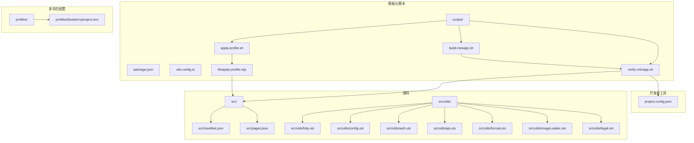
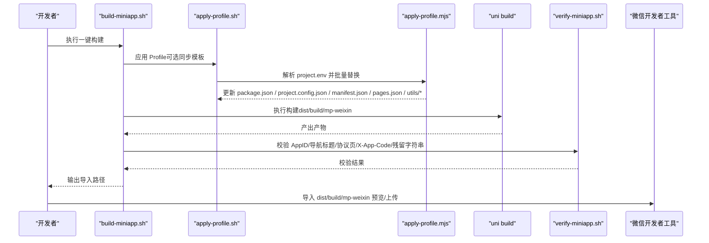
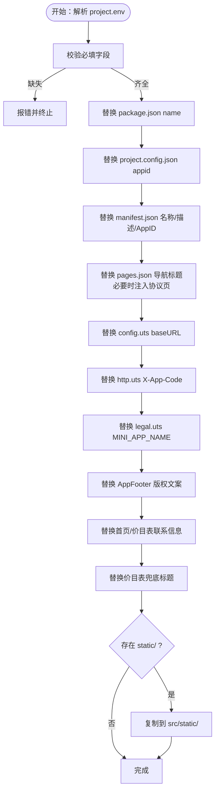
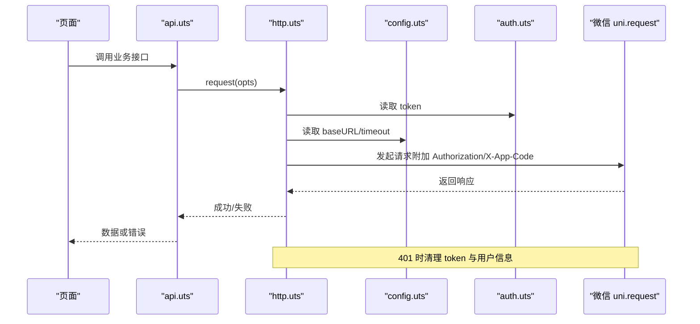
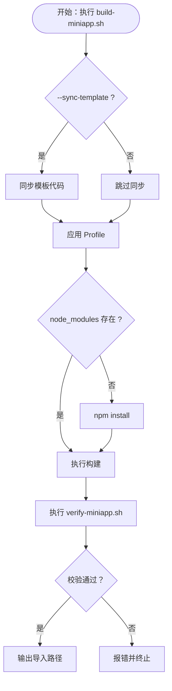
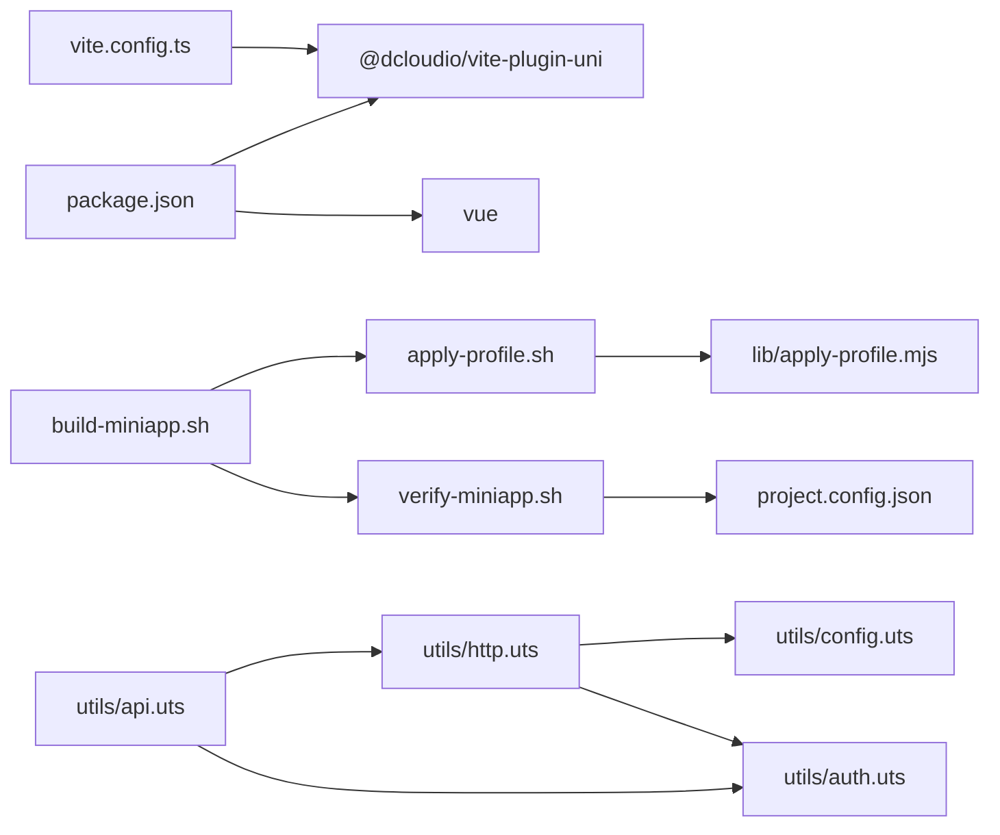

# 故障排除

<cite>
**本文引用的文件**
- [README.md](file://README.md)
- [微信开发者工具预览指南.md](file://微信开发者工具预览指南.md)
- [package.json](file://package.json)
- [project.config.json](file://project.config.json)
- [vite.config.ts](file://vite.config.ts)
- [profiles/blueberry/project.env](file://profiles/blueberry/project.env)
- [scripts/build-miniapp.sh](file://scripts/build-miniapp.sh)
- [scripts/verify-miniapp.sh](file://scripts/verify-miniapp.sh)
- [scripts/apply-profile.sh](file://scripts/apply-profile.sh)
- [scripts/lib/apply-profile.mjs](file://scripts/lib/apply-profile.mjs)
- [src/utils/http.uts](file://src/utils/http.uts)
- [src/utils/config.uts](file://src/utils/config.uts)
- [src/utils/auth.uts](file://src/utils/auth.uts)
- [src/utils/api.uts](file://src/utils/api.uts)
- [src/utils/format.uts](file://src/utils/format.uts)
- [src/utils/imageLoader.uts](file://src/utils/imageLoader.uts)
- [src/utils/legal.uts](file://src/utils/legal.uts)
- [src/manifest.json](file://src/manifest.json)
- [src/pages.json](file://src/pages.json)
</cite>

## 目录
1. [简介](#简介)
2. [项目结构](#项目结构)
3. [核心组件](#核心组件)
4. [架构总览](#架构总览)
5. [详细组件分析](#详细组件分析)
6. [依赖关系分析](#依赖关系分析)
7. [性能考虑](#性能考虑)
8. [故障排除指南](#故障排除指南)
9. [结论](#结论)
10. [附录](#附录)

## 简介
本指南面向蓝莓小程序模板的开发者与技术支持，聚焦于开发、构建、部署阶段的常见问题与系统化排查路径。内容涵盖：
- 微信开发者工具相关问题的定位与修复
- 构建失败的常见原因与修复步骤
- 网络请求错误的诊断与解决
- Profile 配置错误的识别与修正
- 性能问题的分析与优化建议
- 日志分析与调试技巧
- 快速定位与解决路径，降低开发中断时间

## 项目结构
蓝莓模板采用“源码集中于 src/，产物输出至 dist/”的组织方式，配合 profiles/ 多项目配置与 scripts/ 自动化脚本，形成“模板 + 多项目 Profile”的复用体系。

图表来源
- [package.json:1-48](file://package.json#L1-L48)
- [vite.config.ts:1-9](file://vite.config.ts#L1-L9)
- [scripts/apply-profile.sh:1-98](file://scripts/apply-profile.sh#L1-L98)
- [scripts/build-miniapp.sh:1-106](file://scripts/build-miniapp.sh#L1-L106)
- [scripts/verify-miniapp.sh:1-165](file://scripts/verify-miniapp.sh#L1-L165)
- [scripts/lib/apply-profile.mjs:1-190](file://scripts/lib/apply-profile.mjs#L1-L190)
- [profiles/blueberry/project.env:1-23](file://profiles/blueberry/project.env#L1-L23)
- [src/manifest.json:1-73](file://src/manifest.json#L1-L73)
- [src/pages.json:1-90](file://src/pages.json#L1-L90)
- [src/utils/http.uts:1-82](file://src/utils/http.uts#L1-L82)
- [src/utils/config.uts:1-12](file://src/utils/config.uts#L1-L12)
- [src/utils/auth.uts:1-149](file://src/utils/auth.uts#L1-L149)
- [src/utils/api.uts:1-312](file://src/utils/api.uts#L1-L312)
- [src/utils/format.uts:1-16](file://src/utils/format.uts#L1-L16)
- [src/utils/imageLoader.uts:1-28](file://src/utils/imageLoader.uts#L1-L28)
- [src/utils/legal.uts:1-16](file://src/utils/legal.uts#L1-L16)
- [project.config.json:1-35](file://project.config.json#L1-L35)

章节来源
- [README.md:85-130](file://README.md#L85-L130)
- [微信开发者工具预览指南.md:1-57](file://微信开发者工具预览指南.md#L1-L57)

## 核心组件
- 构建与发布流水线
  - 开发构建：npm run dev:mp-weixin 输出 dist/dev/mp-weixin
  - 生产构建：npm run build:mp-weixin 输出 dist/build/mp-weixin
  - 一键构建：scripts/build-miniapp.sh（同步模板/应用配置/编译/校验）
  - 发布前构建：scripts/release-miniapp.sh（包装构建，输出导入路径提示）
- Profile 多项目配置
  - profiles/<project-key>/project.env 提供 AppID、导航标题、品牌文案、API 域名、请求头 X-App-Code 等
  - scripts/apply-profile.sh + scripts/lib/apply-profile.mjs 将 Profile 注入到目标仓库
- 网络层
  - src/utils/http.uts 统一请求封装，自动附加 Authorization/X-App-Code，处理 401 自动登出
  - src/utils/config.uts 集中管理 baseURL 与超时
  - src/utils/api.uts 封装业务接口
- 认证与存储
  - src/utils/auth.uts 管理 token 与用户信息的持久化与合并写入
- 合规页面
  - src/utils/legal.uts 导出 MINI_APP_NAME 与协议页面跳转函数
  - src/pages/policies/user 与 privacy 由 apply-profile 自动注入

章节来源
- [README.md:242-286](file://README.md#L242-L286)
- [scripts/build-miniapp.sh:1-106](file://scripts/build-miniapp.sh#L1-L106)
- [scripts/apply-profile.sh:1-98](file://scripts/apply-profile.sh#L1-L98)
- [scripts/lib/apply-profile.mjs:1-190](file://scripts/lib/apply-profile.mjs#L1-L190)
- [src/utils/http.uts:1-82](file://src/utils/http.uts#L1-L82)
- [src/utils/config.uts:1-12](file://src/utils/config.uts#L1-L12)
- [src/utils/api.uts:1-312](file://src/utils/api.uts#L1-L312)
- [src/utils/auth.uts:1-149](file://src/utils/auth.uts#L1-L149)
- [src/utils/legal.uts:1-16](file://src/utils/legal.uts#L1-L16)

## 架构总览
以下序列图展示了“Profile 应用 → 构建 → 校验 → 导入开发者工具”的关键流程。

图表来源
- [scripts/build-miniapp.sh:1-106](file://scripts/build-miniapp.sh#L1-L106)
- [scripts/apply-profile.sh:1-98](file://scripts/apply-profile.sh#L1-L98)
- [scripts/lib/apply-profile.mjs:1-190](file://scripts/lib/apply-profile.mjs#L1-L190)
- [scripts/verify-miniapp.sh:1-165](file://scripts/verify-miniapp.sh#L1-L165)
- [package.json:4-13](file://package.json#L4-L13)

## 详细组件分析

### 组件A：Profile 应用与注入逻辑
- 关键点
  - 必填字段校验：PROJECT_KEY、PACKAGE_NAME、MANIFEST_NAME、DESCRIPTION、MP_WEIXIN_APPID、NAVIGATION_TITLE、COPYRIGHT_TEXT、CONTACT_PHONE_TEXT、CONTACT_QR_SRC、PRICE_FALLBACK_TITLE、API_BASE_URL、MINI_APP_NAME
  - 注入范围：package.json、project.config.json、src/manifest.json、src/pages.json、src/utils/config.uts、src/utils/http.uts、src/utils/legal.uts、多页面品牌文案与版权
  - 协议页自动注入：若 pages/policies/* 不存在，需先同步模板
- 常见问题
  - 缺失必填字段导致注入失败
  - CONTACT_QR_SRC 为本地静态资源时，未复制到 src/static/ 导致产物缺失
  - APP_CODE 为空时未按预期移除 X-App-Code

图表来源
- [scripts/lib/apply-profile.mjs:12-190](file://scripts/lib/apply-profile.mjs#L12-L190)
- [scripts/apply-profile.sh:75-98](file://scripts/apply-profile.sh#L75-L98)

章节来源
- [scripts/lib/apply-profile.mjs:12-190](file://scripts/lib/apply-profile.mjs#L12-L190)
- [scripts/apply-profile.sh:10-27](file://scripts/apply-profile.sh#L10-L27)
- [README.md:169-240](file://README.md#L169-L240)

### 组件B：网络请求与认证流程
- 关键点
  - request 封装：自动拼接 baseURL、附加 Authorization/X-App-Code、统一超时、401 自动登出
  - get/post 辅助：简化 GET/POST 调用
  - getHttpConfig：集中管理 baseURL 与超时
  - auth 工具：token 与用户信息的存取、合并写入、登出清理
  - api 工具：封装登录、绑定手机、点赞/收藏、搜索、店铺、页面配置等接口
- 常见问题
  - baseURL 未随 Profile 更新导致请求 404/跨域
  - 未携带 Authorization 导致接口 401
  - APP_CODE 未正确写入 http.uts 导致后端拒绝
  - 登录态异常导致频繁 401

图表来源
- [src/utils/api.uts:1-312](file://src/utils/api.uts#L1-L312)
- [src/utils/http.uts:1-82](file://src/utils/http.uts#L1-L82)
- [src/utils/config.uts:1-12](file://src/utils/config.uts#L1-L12)
- [src/utils/auth.uts:1-149](file://src/utils/auth.uts#L1-L149)

章节来源
- [src/utils/http.uts:14-73](file://src/utils/http.uts#L14-L73)
- [src/utils/config.uts:7-11](file://src/utils/config.uts#L7-L11)
- [src/utils/auth.uts:21-52](file://src/utils/auth.uts#L21-L52)
- [src/utils/api.uts:124-191](file://src/utils/api.uts#L124-L191)

### 组件C：构建与校验流程
- 关键点
  - build-miniapp.sh：可选同步模板 → 应用 Profile → 安装依赖 → 构建 → 校验
  - verify-miniapp.sh：校验 AppID、导航标题、本地联系二维码、X-App-Code、MINI_APP_NAME 与协议页、残留字符串
- 常见问题
  - 未安装依赖导致构建失败
  - 未同步模板导致协议页缺失
  - 未应用 Profile 导致 AppID/标题不一致
  - 未复制静态资源导致二维码缺失

图表来源
- [scripts/build-miniapp.sh:14-106](file://scripts/build-miniapp.sh#L14-L106)
- [scripts/verify-miniapp.sh:34-165](file://scripts/verify-miniapp.sh#L34-L165)

章节来源
- [scripts/build-miniapp.sh:84-102](file://scripts/build-miniapp.sh#L84-L102)
- [scripts/verify-miniapp.sh:101-165](file://scripts/verify-miniapp.sh#L101-L165)

## 依赖关系分析
- 构建工具链
  - uni-app x + Vite 插件：vite.config.ts 加载 @dcloudio/vite-plugin-uni
  - 开发者工具：project.config.json 控制编译选项与 libVersion
- 脚本依赖
  - apply-profile.sh 依赖 lib/apply-profile.mjs 完成文本替换
  - build-miniapp.sh 串联 sync-template/apply-profile/build/verify
  - verify-miniapp.sh 依赖 ripgrep/grep 进行残留字符串扫描
- 源码依赖
  - utils/http.uts 依赖 utils/config.uts 与 utils/auth.uts
  - utils/api.uts 依赖 utils/http.uts 与 utils/auth.uts

图表来源
- [vite.config.ts:1-9](file://vite.config.ts#L1-L9)
- [package.json:15-46](file://package.json#L15-L46)
- [scripts/apply-profile.sh:89](file://scripts/apply-profile.sh#L89)
- [scripts/lib/apply-profile.mjs:1-190](file://scripts/lib/apply-profile.mjs#L1-L190)
- [scripts/build-miniapp.sh:84-102](file://scripts/build-miniapp.sh#L84-L102)
- [scripts/verify-miniapp.sh:111-165](file://scripts/verify-miniapp.sh#L111-L165)
- [src/utils/http.uts:1-82](file://src/utils/http.uts#L1-L82)
- [src/utils/config.uts:1-12](file://src/utils/config.uts#L1-L12)
- [src/utils/auth.uts:1-149](file://src/utils/auth.uts#L1-L149)
- [src/utils/api.uts:1-312](file://src/utils/api.uts#L1-L312)
- [project.config.json:1-35](file://project.config.json#L1-L35)

章节来源
- [package.json:15-46](file://package.json#L15-L46)
- [vite.config.ts:4-8](file://vite.config.ts#L4-L8)
- [scripts/verify-miniapp.sh:11-32](file://scripts/verify-miniapp.sh#L11-L32)

## 性能考虑
- 图片加载优化
  - 使用 src/utils/imageLoader.uts 的预加载与超时保护，避免列表/详情切换时白屏
- 数字展示优化
  - 使用 src/utils/format.uts 统一格式化点赞/收藏/浏览数，减少重复逻辑
- 构建体积与编译选项
  - project.config.json 中 minified、minifyWXML、minifyWXSS 等开启有助于减小包体
- 调试与监控
  - 在 http.uts 中根据需要开启 loading 提示，便于感知请求耗时

章节来源
- [src/utils/imageLoader.uts:1-28](file://src/utils/imageLoader.uts#L1-L28)
- [src/utils/format.uts:1-16](file://src/utils/format.uts#L1-L16)
- [project.config.json:2-25](file://project.config.json#L2-L25)
- [src/utils/http.uts:38-72](file://src/utils/http.uts#L38-L72)

## 故障排除指南

### 一、微信开发者工具相关问题
- 症状：导入 dist/dev/mp-weixin 或 dist/build/mp-weixin 后无法预览/上传
  - 检查步骤
    - 确认使用的微信开发者工具 libVersion ≥ 3.10.1
    - 确认导入的是 dist/build/mp-weixin（生产构建产物）
    - 确认 project.config.json.appid 与 src/manifest.json.mp-weixin.appid 与 Profile 中 MP_WEIXIN_APPID 一致
  - 修复建议
    - 使用 scripts/build-miniapp.sh 一键构建并校验，确保 AppID 一致
    - 如需本地预览，使用 scripts/verify-miniapp.sh 校验后导入 dist/dev/mp-weixin
- 症状：协议页（用户协议/隐私政策）缺失
  - 检查步骤
    - verify-miniapp.sh 报告缺少 pages/policies/user|privacy
  - 修复建议
    - 重新执行 build-miniapp.sh 并勾选 --sync-template 同步模板代码

章节来源
- [微信开发者工具预览指南.md:12-38](file://微信开发者工具预览指南.md#L12-L38)
- [project.config.json:32-34](file://project.config.json#L32-L34)
- [src/manifest.json:11-20](file://src/manifest.json#L11-L20)
- [scripts/verify-miniapp.sh:139-151](file://scripts/verify-miniapp.sh#L139-L151)
- [README.md:393-394](file://README.md#L393-L394)

### 二、构建失败
- 症状：构建报错或产物缺失
  - 可能原因
    - 未安装依赖：node_modules 不存在
    - 未应用 Profile：AppID/导航标题不一致
    - 未同步模板：协议页缺失
    - 未复制静态资源：联系二维码缺失
  - 修复建议
    - 使用 scripts/build-miniapp.sh，默认会安装依赖并执行构建与校验
    - 如需仅应用配置不升级模板，使用 scripts/apply-profile.sh
    - 如需仅升级模板不应用配置，使用 scripts/sync-template.sh（由 build-miniapp.sh 的 --sync-template 触发）

章节来源
- [scripts/build-miniapp.sh:92-102](file://scripts/build-miniapp.sh#L92-L102)
- [scripts/verify-miniapp.sh:101-130](file://scripts/verify-miniapp.sh#L101-L130)
- [README.md:261-267](file://README.md#L261-L267)

### 三、网络请求错误
- 症状：接口 404/401/超时
  - 可能原因
    - baseURL 未随 Profile 更新：检查 src/utils/config.uts 是否被替换
    - 未携带 Authorization：确认登录态有效且 token 存在
    - 未携带 X-App-Code：确认 APP_CODE 已写入 src/utils/http.uts 并出现在产物中
    - 401 自动登出：检查 http.uts 的 401 处理逻辑
- 诊断步骤
  - 在调用接口前后打印 token 与 baseURL
  - 使用 verify-miniapp.sh 校验 X-App-Code 是否写入产物
  - 检查 auth 工具的 token 与用户信息存储状态
- 修复建议
  - 重新应用 Profile 并构建，确保 baseURL 与 X-App-Code 正确写入
  - 登录后重试，确认 Authorization 正常

章节来源
- [src/utils/http.uts:14-73](file://src/utils/http.uts#L14-L73)
- [src/utils/config.uts:7-11](file://src/utils/config.uts#L7-L11)
- [src/utils/auth.uts:21-52](file://src/utils/auth.uts#L21-L52)
- [scripts/verify-miniapp.sh:132-137](file://scripts/verify-miniapp.sh#L132-L137)

### 四、Profile 配置错误
- 症状：构建后文案/标题/AppID 不正确
  - 可能原因
    - 必填字段缺失：PROJECT_KEY、PACKAGE_NAME、MANIFEST_NAME、DESCRIPTION、MP_WEIXIN_APPID、NAVIGATION_TITLE、COPYRIGHT_TEXT、CONTACT_PHONE_TEXT、CONTACT_QR_SRC、PRICE_FALLBACK_TITLE、API_BASE_URL、MINI_APP_NAME
    - APP_CODE 为空但未按预期移除 X-App-Code
    - CONTACT_QR_SRC 为本地路径但未复制静态资源
- 诊断步骤
  - 查看 scripts/apply-profile.sh 的输出，确认各文件是否被更新
  - 使用 scripts/verify-miniapp.sh 校验 AppID 与导航标题
  - 检查 src/utils/http.uts 与产物 utils/http.js 中 X-App-Code 是否一致
- 修复建议
  - 在 profiles/<project-key>/project.env 中补齐必填字段
  - 如 APP_CODE 为空，确认 http.uts 的注入逻辑按预期移除该头
  - 将静态资源放入 profiles/<project-key>/static/ 并重新应用 Profile

章节来源
- [scripts/lib/apply-profile.mjs:12-31](file://scripts/lib/apply-profile.mjs#L12-L31)
- [scripts/lib/apply-profile.mjs:143-150](file://scripts/lib/apply-profile.mjs#L143-L150)
- [scripts/apply-profile.sh:91-95](file://scripts/apply-profile.sh#L91-L95)
- [scripts/verify-miniapp.sh:114-122](file://scripts/verify-miniapp.sh#L114-L122)
- [README.md:180-240](file://README.md#L180-L240)

### 五、性能问题
- 症状：页面切换卡顿、图片加载慢
  - 诊断步骤
    - 使用 src/utils/imageLoader.uts 的预加载与超时保护，观察是否存在大量失败图片
    - 检查项目配置中 minified、minifyWXML、minifyWXSS 是否开启
  - 优化建议
    - 对列表/详情页使用预加载，合理设置超时时间
    - 启用压缩与混淆，减少包体与请求数

章节来源
- [src/utils/imageLoader.uts:22-27](file://src/utils/imageLoader.uts#L22-L27)
- [project.config.json:2-25](file://project.config.json#L2-L25)

### 六、日志分析与调试技巧
- 建议做法
  - 在 http.uts 中根据需要开启 loading 提示，便于感知请求耗时
  - 在关键业务接口前后打印日志，记录 token、headers、响应状态
  - 使用 verify-miniapp.sh 的残留字符串扫描，定位模板字符串泄露
- 常用校验点
  - AppID 一致性：project.config.json 与 manifest.json
  - 导航标题一致性：pages.json.globalStyle.navigationBarTitleText
  - 协议页存在性：pages/policies/user|privacy
  - X-App-Code 注入：src/utils/http.uts 与产物 utils/http.js

章节来源
- [src/utils/http.uts:38-72](file://src/utils/http.uts#L38-L72)
- [scripts/verify-miniapp.sh:111-159](file://scripts/verify-miniapp.sh#L111-L159)

## 结论
通过规范化的 Profile 管理、一键构建与严格校验，蓝莓模板能够在多项目场景下保持一致性与可维护性。遇到问题时，优先使用 scripts/build-miniapp.sh 与 scripts/verify-miniapp.sh 完成自检，结合微信开发者工具与日志进行定位，可显著缩短排障时间并提升交付质量。

## 附录
- 快速检查清单
  - 构建：使用 scripts/build-miniapp.sh，确保依赖安装、模板同步、Profile 应用、构建与校验均通过
  - 开发者工具：导入 dist/build/mp-weixin，确认 AppID 与标题一致
  - 网络：确认 baseURL 与 X-App-Code 正确，登录态有效
  - Profile：补齐必填字段，复制静态资源，校验协议页存在
  - 性能：启用压缩、使用图片预加载、统一数字格式化
