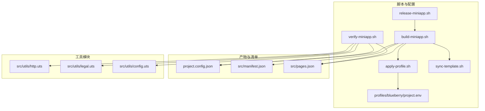
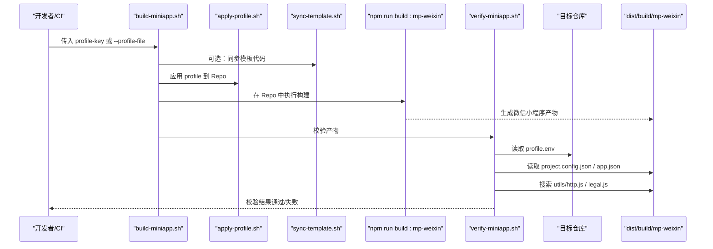
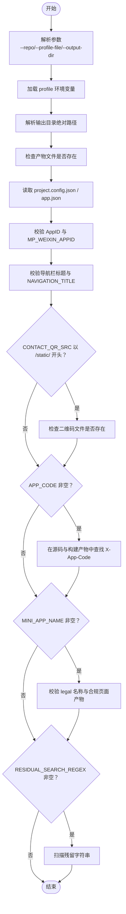
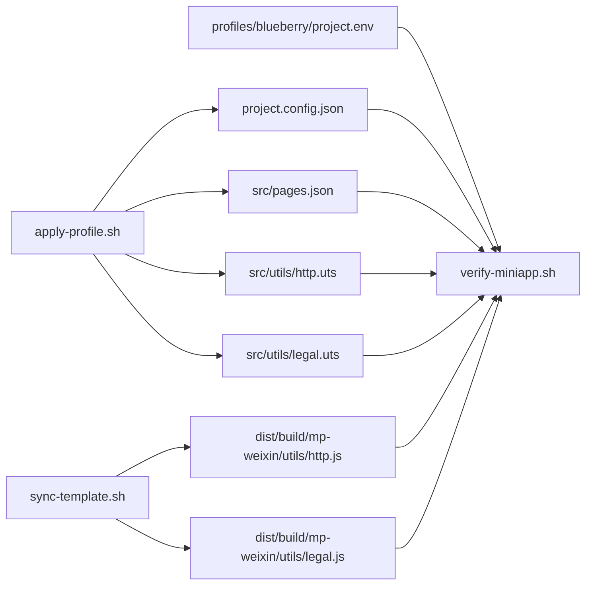

# 产物校验机制

<cite>
**本文引用的文件**
- [scripts/verify-miniapp.sh](file://scripts/verify-miniapp.sh)
- [scripts/build-miniapp.sh](file://scripts/build-miniapp.sh)
- [scripts/apply-profile.sh](file://scripts/apply-profile.sh)
- [scripts/sync-template.sh](file://scripts/sync-template.sh)
- [scripts/release-miniapp.sh](file://scripts/release-miniapp.sh)
- [profiles/blueberry/project.env](file://profiles/blueberry/project.env)
- [src/manifest.json](file://src/manifest.json)
- [src/pages.json](file://src/pages.json)
- [src/utils/http.uts](file://src/utils/http.uts)
- [src/utils/legal.uts](file://src/utils/legal.uts)
- [src/utils/config.uts](file://src/utils/config.uts)
- [project.config.json](file://project.config.json)
- [package.json](file://package.json)
- [README.md](file://README.md)
</cite>

## 目录
1. [简介](#简介)
2. [项目结构](#项目结构)
3. [核心组件](#核心组件)
4. [架构总览](#架构总览)
5. [详细组件分析](#详细组件分析)
6. [依赖关系分析](#依赖关系分析)
7. [性能考量](#性能考量)
8. [故障排查指南](#故障排查指南)
9. [结论](#结论)
10. [附录](#附录)

## 简介
本文件面向质量保证团队，系统化阐述蓝莓小程序模板的“产物校验机制”。重点解析 verify-miniapp.sh 脚本的校验逻辑与验证标准，覆盖构建产物的文件完整性、配置正确性、依赖关系验证等维度；同时给出常见失败原因与解决方法，对比手动与自动校验差异，提供扩展与自定义建议，并说明在 CI/CD 流程中的集成方式与最佳实践。

## 项目结构
围绕产物校验的关键文件与职责如下：
- 校验脚本：scripts/verify-miniapp.sh
- 构建流水线：scripts/build-miniapp.sh（含可选的模板同步与依赖安装）
- 配置应用：scripts/apply-profile.sh（将 profile 注入目标仓库）
- 模板同步：scripts/sync-template.sh（覆盖公共代码）
- 发布前置：scripts/release-miniapp.sh（仅提示导入路径，不自动上传）
- 配置与清单：
  - profiles/blueberry/project.env（示例 profile）
  - src/manifest.json（uni-app 清单，含 mp-weixin AppID）
  - src/pages.json（页面路由、全局导航、tabBar）
  - project.config.json（微信开发者工具配置，含 AppID）
  - package.json（脚本入口，含 profile:verify）
- 工具模块：
  - src/utils/http.uts（请求封装，包含 X-App-Code 请求头）
  - src/utils/legal.uts（协议名称与跳转）
  - src/utils/config.uts（API 基础地址）

图表来源
- [scripts/verify-miniapp.sh:1-165](file://scripts/verify-miniapp.sh#L1-L165)
- [scripts/build-miniapp.sh:1-106](file://scripts/build-miniapp.sh#L1-L106)
- [scripts/apply-profile.sh:1-98](file://scripts/apply-profile.sh#L1-L98)
- [scripts/sync-template.sh:1-81](file://scripts/sync-template.sh#L1-L81)
- [scripts/release-miniapp.sh:1-14](file://scripts/release-miniapp.sh#L1-L14)
- [profiles/blueberry/project.env:1-23](file://profiles/blueberry/project.env#L1-L23)
- [src/manifest.json:1-73](file://src/manifest.json#L1-L73)
- [src/pages.json:1-90](file://src/pages.json#L1-L90)
- [src/utils/http.uts:1-82](file://src/utils/http.uts#L1-L82)
- [src/utils/legal.uts:1-16](file://src/utils/legal.uts#L1-L16)
- [src/utils/config.uts:1-12](file://src/utils/config.uts#L1-L12)
- [project.config.json:1-35](file://project.config.json#L1-L35)

章节来源
- [README.md:277-285](file://README.md#L277-L285)
- [package.json:4-13](file://package.json#L4-L13)

## 核心组件
- 校验脚本 verify-miniapp.sh
  - 输入：profile-key 或 --profile-file；可选 --repo、--output-dir
  - 输出：校验通过或失败并打印原因
  - 核心校验点：project.config.json.appid、app.json.window.navigationBarTitleText、本地联系二维码资产、X-App-Code 请求头、MINI_APP_NAME 与合规页面、残留字符串扫描
- 构建流水线 build-miniapp.sh
  - 支持 --sync-template、--install、--skip-apply、--skip-verify 等开关
  - 默认顺序：同步模板 → 应用 profile → 安装依赖 → 构建 → 校验
- 配置应用 apply-profile.sh
  - 将 profile 注入 package.json、project.config.json、src/manifest.json、src/pages.json、src/utils/config.uts、src/utils/http.uts、src/utils/legal.uts，以及页面中的品牌/联系方式/版权文案
- 模板同步 sync-template.sh
  - 覆盖 src/App.uvue、src/main.uts、src/index.html、src/env.d.ts、src/pages/、src/utils/、src/components/，保留 package.json、project.config.json、src/manifest.json、src/pages.json、src/static/、profiles/
- 发布前置 release-miniapp.sh
  - 提示导入路径，不自动上传

章节来源
- [scripts/verify-miniapp.sh:34-45](file://scripts/verify-miniapp.sh#L34-L45)
- [scripts/build-miniapp.sh:14-25](file://scripts/build-miniapp.sh#L14-L25)
- [scripts/apply-profile.sh:10-27](file://scripts/apply-profile.sh#L10-L27)
- [scripts/sync-template.sh:8-32](file://scripts/sync-template.sh#L8-L32)
- [scripts/release-miniapp.sh:6-12](file://scripts/release-miniapp.sh#L6-L12)

## 架构总览
下图展示了从应用 profile 到构建产物再到校验的整体流程，以及关键输入输出与依赖关系：

图表来源
- [scripts/build-miniapp.sh:84-102](file://scripts/build-miniapp.sh#L84-L102)
- [scripts/apply-profile.sh:89-89](file://scripts/apply-profile.sh#L89-L89)
- [scripts/sync-template.sh:62-80](file://scripts/sync-template.sh#L62-L80)
- [scripts/verify-miniapp.sh:94-159](file://scripts/verify-miniapp.sh#L94-L159)

章节来源
- [README.md:242-270](file://README.md#L242-L270)

## 详细组件分析

### 校验脚本 verify-miniapp.sh 的校验逻辑与验证标准
- 输入参数与定位
  - 支持 --repo 指定目标仓库根目录，默认使用工具仓库根目录
  - 支持 --profile-file 指定 profile 文件，或根据 <profile-key> 查找 profiles/<key>/project.env
  - 支持 --output-dir 指定相对输出目录，默认 dist/build/mp-weixin
- 校验步骤概览
  1) 读取并加载 profile 环境变量
  2) 解析输出目录绝对路径
  3) 校验必要产物文件是否存在
  4) 校验 AppID 与导航栏标题
  5) 校验本地联系二维码资产（若 CONTACT_QR_SRC 以 /static/ 开头）
  6) 校验 X-App-Code 请求头（APP_CODE 非空时）
  7) 校验 MINI_APP_NAME 与合规页面（MINI_APP_NAME 非空时）
  8) 可选：残留字符串扫描（RESIDUAL_SEARCH_REGEX 非空时）
  9) 输出校验摘要
- 关键实现要点
  - 使用 ripgrep（rg）进行正则/固定字符串匹配，若未安装则回退到 grep
  - 通过 Node 读取 JSON 产物中的关键字段
  - 对本地二维码路径进行拼接与存在性检查
  - 对请求头与协议页面的校验分别覆盖源码与构建产物

图表来源
- [scripts/verify-miniapp.sh:47-159](file://scripts/verify-miniapp.sh#L47-L159)

章节来源
- [scripts/verify-miniapp.sh:11-32](file://scripts/verify-miniapp.sh#L11-L32)
- [scripts/verify-miniapp.sh:94-159](file://scripts/verify-miniapp.sh#L94-L159)

### 构建与发布脚本的协作关系
- build-miniapp.sh
  - 默认顺序：sync-template → apply-profile → npm install（如需）→ npm run build:mp-weixin → verify
  - 支持跳过步骤：--skip-apply、--skip-verify、--install、--sync-template
- release-miniapp.sh
  - 仅提示导入路径，不自动上传，便于人工在微信开发者工具中操作
- apply-profile.sh
  - 将 profile 注入多个配置与源文件，确保构建产物与 profile 一致
- sync-template.sh
  - 覆盖公共代码，确保目标仓库具备最新页面/工具层代码

章节来源
- [scripts/build-miniapp.sh:14-25](file://scripts/build-miniapp.sh#L14-L25)
- [scripts/build-miniapp.sh:84-102](file://scripts/build-miniapp.sh#L84-L102)
- [scripts/release-miniapp.sh:6-12](file://scripts/release-miniapp.sh#L6-L12)
- [scripts/apply-profile.sh:15-25](file://scripts/apply-profile.sh#L15-L25)
- [scripts/sync-template.sh:13-31](file://scripts/sync-template.sh#L13-L31)

### 关键配置与产物的映射关系
- AppID 校验
  - 依据：profile.env 中 MP_WEIXIN_APPID
  - 产物：project.config.json 与 src/manifest.json（由 apply-profile 注入）
  - 校验：verify 读取 project.config.json 并与 MP_WEIXIN_APPID 比较
- 导航栏标题校验
  - 依据：profile.env 中 NAVIGATION_TITLE
  - 产物：src/pages.json globalStyle.navigationBarTitleText
  - 校验：verify 读取 app.json window.navigationBarTitleText 并与 NAVIGATION_TITLE 比较
- 本地联系二维码资产
  - 依据：profile.env 中 CONTACT_QR_SRC
  - 校验：若以 /static/ 开头，则检查 dist/build/mp-weixin 下对应文件是否存在
- X-App-Code 请求头
  - 依据：profile.env 中 APP_CODE
  - 产物：src/utils/http.uts（请求头）与构建产物 utils/http.js
  - 校验：verify 在源码与构建产物中查找 X-App-Code
- MINI_APP_NAME 与合规页面
  - 依据：profile.env 中 MINI_APP_NAME
  - 产物：src/utils/legal.uts 与 pages/policies/user、pages/policies/privacy 的构建产物
  - 校验：verify 检查 legal 名称与两个合规页面产物是否存在
- 残留字符串扫描
  - 依据：profile.env 中 RESIDUAL_SEARCH_REGEX
  - 校验：verify 使用正则扫描源码、配置与产物，发现匹配则失败

章节来源
- [profiles/blueberry/project.env:7-22](file://profiles/blueberry/project.env#L7-L22)
- [src/manifest.json:11-20](file://src/manifest.json#L11-L20)
- [src/pages.json:56-61](file://src/pages.json#L56-L61)
- [src/utils/http.uts:27-31](file://src/utils/http.uts#L27-L31)
- [src/utils/legal.uts:1-3](file://src/utils/legal.uts#L1-L3)
- [scripts/verify-miniapp.sh:111-159](file://scripts/verify-miniapp.sh#L111-L159)

## 依赖关系分析
- verify-miniapp.sh 的直接依赖
  - profile 环境变量（来自 profiles/<key>/project.env）
  - 构建产物（dist/build/mp-weixin 下的 project.config.json、app.json、utils/http.js、utils/legal.js 等）
  - 源码（src/utils/http.uts、src/utils/legal.uts）
  - 工具：Node（读取 JSON）、ripgrep/grep（文本匹配）
- 构建流水线的间接依赖
  - apply-profile.sh 将 profile 注入多个文件，确保 verify 的输入与预期一致
  - sync-template.sh 确保页面与工具层代码是最新的，避免 verify 因缺失合规页面而失败

图表来源
- [scripts/verify-miniapp.sh:94-159](file://scripts/verify-miniapp.sh#L94-L159)
- [scripts/apply-profile.sh:89-89](file://scripts/apply-profile.sh#L89-L89)
- [scripts/sync-template.sh:62-80](file://scripts/sync-template.sh#L62-L80)
- [profiles/blueberry/project.env:1-23](file://profiles/blueberry/project.env#L1-L23)

章节来源
- [scripts/verify-miniapp.sh:94-159](file://scripts/verify-miniapp.sh#L94-L159)
- [scripts/apply-profile.sh:89-89](file://scripts/apply-profile.sh#L89-L89)
- [scripts/sync-template.sh:62-80](file://scripts/sync-template.sh#L62-L80)

## 性能考量
- 文本搜索性能
  - verify 使用 ripgrep（rg）优先进行正则/固定字符串匹配，若未安装则回退到 grep。ripgrep 在大型项目中通常更快，但两者均支持递归与正则匹配。
- I/O 成本
  - 校验主要涉及少量 JSON 文件读取与有限的静态资源存在性检查，整体 I/O 成本较低。
- 并行化建议
  - 在 CI 中可并行执行不同 profile 的构建与校验任务，以缩短总耗时。
- 依赖安装
  - build-miniapp.sh 支持 --install 与 --skip-apply/--skip-verify，可在 CI 中按需启用，减少重复安装与重复校验。

[本节为通用性能讨论，不直接分析具体文件]

## 故障排查指南
- 常见失败原因与解决方法
  - AppID 不一致
    - 现象：verify 输出 AppID mismatch
    - 原因：project.config.json 与 src/manifest.json 中 AppID 与 profile.env 不一致
    - 解决：确保 apply-profile 正确注入，或检查项目配置是否被外部工具覆盖
  - 导航栏标题不一致
    - 现象：verify 输出导航栏标题不一致
    - 原因：src/pages.json globalStyle.navigationBarTitleText 与 profile.env NAVIGATION_TITLE 不一致
    - 解决：检查 apply-profile 是否正确写入 pages.json
  - 本地联系二维码缺失
    - 现象：verify 输出二维码资产缺失
    - 原因：CONTACT_QR_SRC 以 /static/ 开头但产物中未找到对应文件
    - 解决：将二维码文件放入目标仓库的 src/static/，并确保路径与 CONTACT_QR_SRC 一致
  - X-App-Code 未找到
    - 现象：verify 输出 X-App-Code 未找到
    - 原因：APP_CODE 非空但源码与构建产物中未包含该值
    - 解决：确认 profile.env APP_CODE 设置正确，且 http.uts 中请求头逻辑未被删除
  - MINI_APP_NAME 或合规页面缺失
    - 现象：verify 输出 MINI_APP_NAME 未找到或合规页面缺失
    - 原因：legal.uts 未注入 MINI_APP_NAME，或 pages/policies/* 未同步到目标仓库
    - 解决：执行 build-miniapp.sh 时加上 --sync-template，确保模板页面与工具层代码同步
  - 残留字符串扫描失败
    - 现象：verify 输出残留模板字符串
    - 原因：RESIDUAL_SEARCH_REGEX 匹配到源码、配置或产物中的敏感字符串
    - 解决：清理残留字符串或调整 RESIDUAL_SEARCH_REGEX 以更精确匹配
- 手动校验 vs 自动校验
  - 手动校验：适合小规模、临时性检查，可灵活选择性地核对关键点
  - 自动校验：适合持续集成与批量验证，确保每次变更都能快速发现问题
  - 建议：在本地开发阶段可结合手动与自动；在 CI 中强制执行自动校验，保证质量门槛

章节来源
- [scripts/verify-miniapp.sh:114-159](file://scripts/verify-miniapp.sh#L114-L159)
- [README.md:390-398](file://README.md#L390-L398)

## 结论
verify-miniapp.sh 通过严格的产物校验，确保微信小程序构建产物与 profile 配置保持一致，涵盖 AppID、导航栏标题、本地资产、请求头、协议页面与残留字符串等多个关键维度。配合 build-miniapp.sh 的一键流水线，可在本地与 CI 中高效落地质量保障。对于质量保证团队，建议在日常回归与发布前严格执行自动校验，并针对常见问题建立标准化的修复流程。

[本节为总结性内容，不直接分析具体文件]

## 附录

### 校验清单与验证标准
- 产物文件完整性
  - project.config.json、app.json 必须存在
- 配置正确性
  - project.config.json.appid 与 profile.env.MP_WEIXIN_APPID 一致
  - app.json.window.navigationBarTitleText 与 profile.env.NAVIGATION_TITLE 一致
- 依赖关系验证
  - 本地联系二维码资产（若 CONTACT_QR_SRC 以 /static/ 开头）必须存在于产物中
  - X-App-Code 请求头（APP_CODE 非空时）必须存在于源码与构建产物中
  - MINI_APP_NAME 必须存在于 legal.uts 且 pages/policies/user、pages/policies/privacy 的构建产物存在
- 可选：残留字符串扫描
  - RESIDUAL_SEARCH_REGEX 非空时，扫描源码、配置与产物，不得出现匹配项

章节来源
- [scripts/verify-miniapp.sh:101-159](file://scripts/verify-miniapp.sh#L101-L159)
- [profiles/blueberry/project.env:7-22](file://profiles/blueberry/project.env#L7-L22)

### CI/CD 集成建议
- 触发时机
  - PR 合并请求：执行 profile:verify 与冒烟测试
  - 主干推送：执行批量 profile 构建与校验
- 关键步骤
  - 使用 build-miniapp.sh 作为统一入口，必要时开启 --sync-template 与 --install
  - 在 verify 失败时中断流水线并输出详细日志
- 可观测性
  - 记录校验摘要与失败原因，便于追溯
  - 对残留字符串扫描失败提供可定位的匹配行号与上下文

章节来源
- [scripts/build-miniapp.sh:14-25](file://scripts/build-miniapp.sh#L14-L25)
- [scripts/verify-miniapp.sh:34-45](file://scripts/verify-miniapp.sh#L34-L45)

### 扩展与自定义方法
- 新增校验项
  - 在 verify-miniapp.sh 中增加新的检查逻辑，例如新增配置字段或产物文件
  - 保持错误输出清晰，包含期望值与实际值
- 调整匹配策略
  - 对 X-App-Code 或残留字符串扫描，可调整正则表达式以适配不同格式
- 与 CI 集成
  - 将 profile:verify 作为 CI 的必检步骤，失败即阻断
  - 对不同 profile 创建独立 job，提升并行度

章节来源
- [scripts/verify-miniapp.sh:12-32](file://scripts/verify-miniapp.sh#L12-L32)
- [scripts/verify-miniapp.sh:154-159](file://scripts/verify-miniapp.sh#L154-L159)
