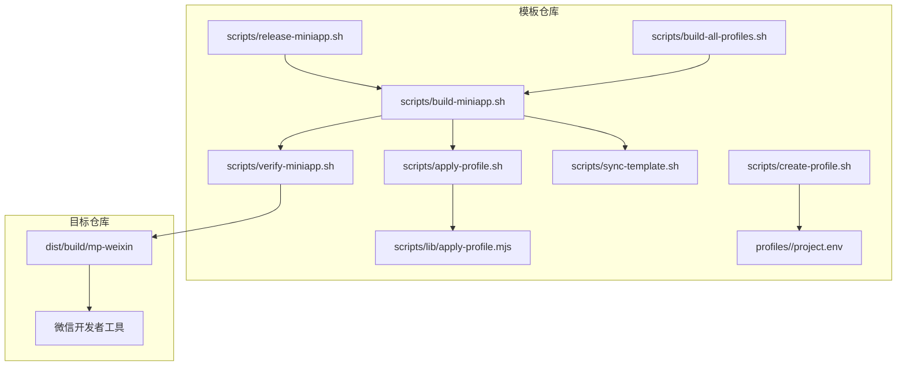
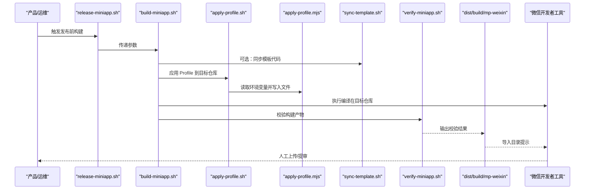
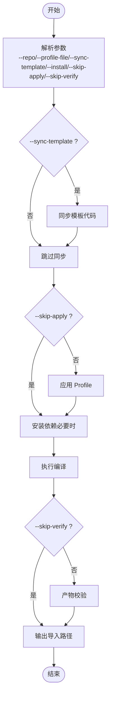
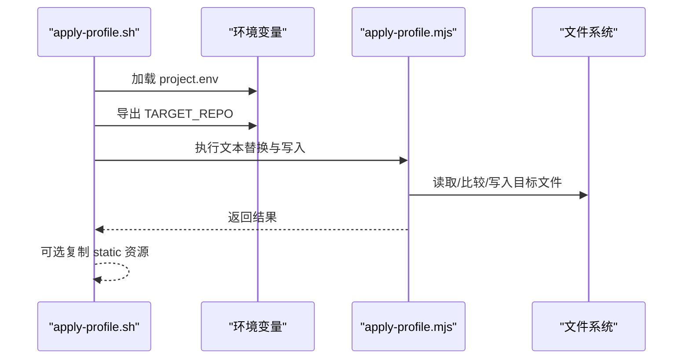
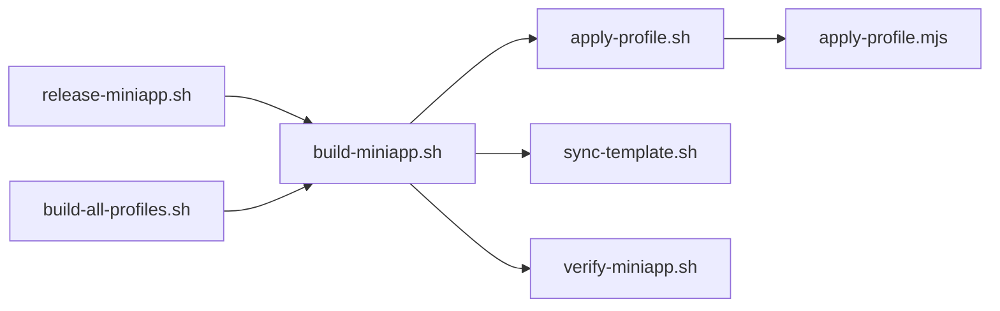

# 发布管理流程

<cite>
**本文档引用的文件**
- [release-miniapp.sh](file://scripts/release-miniapp.sh)
- [build-miniapp.sh](file://scripts/build-miniapp.sh)
- [verify-miniapp.sh](file://scripts/verify-miniapp.sh)
- [apply-profile.sh](file://scripts/apply-profile.sh)
- [sync-template.sh](file://scripts/sync-template.sh)
- [build-all-profiles.sh](file://scripts/build-all-profiles.sh)
- [create-profile.sh](file://scripts/create-profile.sh)
- [apply-profile.mjs](file://scripts/lib/apply-profile.mjs)
- [project.env（blueberry）](file://profiles/blueberry/project.env)
- [project.env（huahua）](file://profiles/huahua/project.env)
- [README.md](file://README.md)
- [package.json](file://package.json)
- [project.config.json](file://project.config.json)
</cite>

## 目录
1. [简介](#简介)
2. [项目结构](#项目结构)
3. [核心组件](#核心组件)
4. [架构总览](#架构总览)
5. [详细组件分析](#详细组件分析)
6. [依赖关系分析](#依赖关系分析)
7. [性能考量](#性能考量)
8. [故障排查指南](#故障排查指南)
9. [结论](#结论)
10. [附录](#附录)

## 简介
本文件面向产品与运维团队，系统化梳理蓝莓小程序项目的发布管理流程，重点围绕 release-miniapp.sh 的发布逻辑与版本管理策略，给出发布准备、质量门禁、关键节点、不同发布场景操作指南、回滚与应急处理、发布后监控与验证等完整实践指引。

## 项目结构
蓝莓项目采用“模板仓库 + 多项目 Profile”的多租户架构，发布脚本体系围绕 scripts/ 下的一组 Bash/Node 脚本与 profiles/ 下的项目配置展开。发布产物统一输出至 dist/build/mp-weixin，供微信开发者工具导入并上传。

图表来源
- [release-miniapp.sh:1-15](file://scripts/release-miniapp.sh#L1-L15)
- [build-miniapp.sh:1-106](file://scripts/build-miniapp.sh#L1-L106)
- [verify-miniapp.sh:1-165](file://scripts/verify-miniapp.sh#L1-L165)
- [apply-profile.sh:1-97](file://scripts/apply-profile.sh#L1-L97)
- [sync-template.sh:1-81](file://scripts/sync-template.sh#L1-L81)
- [build-all-profiles.sh:1-178](file://scripts/build-all-profiles.sh#L1-L178)
- [create-profile.sh:1-77](file://scripts/create-profile.sh#L1-L77)
- [apply-profile.mjs:1-63](file://scripts/lib/apply-profile.mjs#L1-L63)

章节来源
- [README.md:111-120](file://README.md#L111-L120)
- [README.md:242-267](file://README.md#L242-L267)

## 核心组件
- 发布脚本入口：release-miniapp.sh 作为“发布前构建”的包装器，调用 build-miniapp.sh 并输出导入路径提示，不自动上传。
- 构建流水线：build-miniapp.sh 统一执行“模板同步（可选）→ 应用 Profile → 安装依赖（可选）→ 编译 → 校验”。
- 质量校验：verify-miniapp.sh 对 AppID、导航标题、本地协议页、请求头标记、残留字符串等进行断言。
- 配置应用：apply-profile.sh 与 apply-profile.mjs 将 Profile 注入目标仓库的 manifest、pages.json、utils 等文件。
- 模板同步：sync-template.sh 将模板公共代码覆盖到目标仓库，避免外部项目组件缺失导致的构建失败。
- 批量构建：build-all-profiles.sh 支持批量扫描 profiles/ 并按主项目/扩展项目分别构建。
- Profile 管理：create-profile.sh 生成项目级配置与静态资源目录。

章节来源
- [release-miniapp.sh:1-15](file://scripts/release-miniapp.sh#L1-L15)
- [build-miniapp.sh:14-25](file://scripts/build-miniapp.sh#L14-L25)
- [verify-miniapp.sh:34-45](file://scripts/verify-miniapp.sh#L34-L45)
- [apply-profile.sh:10-27](file://scripts/apply-profile.sh#L10-L27)
- [sync-template.sh:8-32](file://scripts/sync-template.sh#L8-L32)
- [build-all-profiles.sh:16-33](file://scripts/build-all-profiles.sh#L16-L33)
- [create-profile.sh:10-19](file://scripts/create-profile.sh#L10-L19)

## 架构总览
发布流程以“构建 + 校验”为核心，release-miniapp.sh 作为入口，最终输出 dist/build/mp-weixin 供人工导入微信开发者工具上传。

图表来源
- [release-miniapp.sh:14](file://scripts/release-miniapp.sh#L14)
- [build-miniapp.sh:84-102](file://scripts/build-miniapp.sh#L84-L102)
- [apply-profile.sh:89](file://scripts/apply-profile.sh#L89)
- [apply-profile.mjs:10-31](file://scripts/lib/apply-profile.mjs#L10-L31)
- [sync-template.sh:62-80](file://scripts/sync-template.sh#L62-L80)
- [verify-miniapp.sh:99-165](file://scripts/verify-miniapp.sh#L99-L165)

## 详细组件分析

### 发布脚本 release-miniapp.sh
- 作用：打印发布前提示，明确“不自动上传”，仅输出导入路径，引导人工上传。
- 行为：调用 build-miniapp.sh 并透传参数。
- 使用建议：在模板仓库或目标仓库中运行，确保已应用 Profile 且产物通过校验。

章节来源
- [release-miniapp.sh:6-14](file://scripts/release-miniapp.sh#L6-L14)

### 构建流水线 build-miniapp.sh
- 参数控制：
  - --repo：目标仓库路径
  - --profile-file：自定义 Profile 文件
  - --sync-template：是否同步模板代码
  - --install：是否安装依赖
  - --skip-apply：跳过应用 Profile
  - --skip-verify：跳过产物校验
- 流程要点：
  - 可选同步模板（覆盖 pages/utils/components 等）
  - 可选跳过应用 Profile（需确保目标仓库已具备所需配置）
  - 强制安装依赖（若缺失）
  - 执行编译
  - 可选跳过校验（不建议）

图表来源
- [build-miniapp.sh:14-106](file://scripts/build-miniapp.sh#L14-L106)

章节来源
- [build-miniapp.sh:14-106](file://scripts/build-miniapp.sh#L14-L106)

### 质量校验 verify-miniapp.sh
- 校验项：
  - project.config.json.appid 与 Profile 中 MP_WEIXIN_APPID 一致
  - app.json.window.navigationBarTitleText 与 NAVIGATION_TITLE 一致
  - 若 CONTACT_QR_SRC 以 /static/ 开头，则对应文件必须存在于产物中
  - 若 APP_CODE 非空，则 X-App-Code 必须出现在源码与构建产物中
  - 若 MINI_APP_NAME 非空，则 legal 页面与产物中均需出现
  - 可选：RESIDUAL_SEARCH_REGEX 扫描残留字符串
- 失败即终止，确保上线前零偏差。

章节来源
- [verify-miniapp.sh:111-165](file://scripts/verify-miniapp.sh#L111-L165)
- [README.md:277-284](file://README.md#L277-L284)

### 配置应用 apply-profile.sh 与 apply-profile.mjs
- apply-profile.sh：
  - 解析参数，定位 Profile 文件（模板或目标仓库）
  - 设置环境变量并导出 TARGET_REPO
  - 调用 apply-profile.mjs 执行文本替换与写入
  - 可选复制 static 资源
- apply-profile.mjs：
  - 校验必需字段（PROJECT_KEY、PACKAGE_NAME、MANIFEST_NAME、DESCRIPTION、MP_WEIXIN_APPID、NAVIGATION_TITLE、COPYRIGHT_TEXT、CONTACT_PHONE_TEXT、CONTACT_QR_SRC、PRICE_FALLBACK_TITLE、API_BASE_URL、MINI_APP_NAME）
  - 读取/写入目标仓库文件，按需更新内容

图表来源
- [apply-profile.sh:78-97](file://scripts/apply-profile.sh#L78-L97)
- [apply-profile.mjs:10-63](file://scripts/lib/apply-profile.mjs#L10-L63)

章节来源
- [apply-profile.sh:10-97](file://scripts/apply-profile.sh#L10-L97)
- [apply-profile.mjs:10-63](file://scripts/lib/apply-profile.mjs#L10-L63)

### 模板同步 sync-template.sh
- 覆盖范围：src/App.uvue、src/index.html、src/main.uts、src/pages/、src/utils/、src/components/
- 不覆盖范围：package.json、project.config.json、src/manifest.json、src/pages.json、src/static/、profiles/
- 作用：确保外部项目拥有最新模板代码与共享组件，避免 apply-profile.mjs 因文件缺失报错。

章节来源
- [sync-template.sh:15-31](file://scripts/sync-template.sh#L15-L31)
- [sync-template.sh:62-80](file://scripts/sync-template.sh#L62-L80)

### 批量构建 build-all-profiles.sh
- 功能：扫描 profiles/，对主项目（blueberry）在当前仓库执行编译，对外部项目调用 build-miniapp.sh
- 控制选项：--only、--skip、--external-base、--no-sync-template
- 结果汇总：统计成功/失败/跳过的项目

章节来源
- [build-all-profiles.sh:16-178](file://scripts/build-all-profiles.sh#L16-L178)

### Profile 管理 create-profile.sh
- 生成：profiles/<key>/project.env 与 profiles/<key>/static/
- 初始化：自动填充 PROJECT_KEY、PACKAGE_NAME、MANIFEST_NAME、APP_CODE
- 后续：编辑 project.env 并放置静态资源，再执行构建

章节来源
- [create-profile.sh:54-77](file://scripts/create-profile.sh#L54-L77)

## 依赖关系分析
- release-miniapp.sh 依赖 build-miniapp.sh
- build-miniapp.sh 依赖 apply-profile.sh、sync-template.sh、verify-miniapp.sh
- apply-profile.sh 依赖 apply-profile.mjs
- verify-miniapp.sh 依赖目标仓库编译产物与 Profile 配置
- build-all-profiles.sh 依赖 build-miniapp.sh 与各 Profile

图表来源
- [release-miniapp.sh:14](file://scripts/release-miniapp.sh#L14)
- [build-miniapp.sh:84-102](file://scripts/build-miniapp.sh#L84-L102)
- [apply-profile.sh:89](file://scripts/apply-profile.sh#L89)
- [apply-profile.mjs:10](file://scripts/lib/apply-profile.mjs#L10)
- [build-all-profiles.sh:141-162](file://scripts/build-all-profiles.sh#L141-L162)

章节来源
- [README.md:242-267](file://README.md#L242-L267)

## 性能考量
- 依赖安装：--install 会在缺失 node_modules 时执行安装，建议在 CI 中缓存依赖以提升速度。
- 模板同步：仅在需要时启用 --sync-template，避免不必要的 rsync 操作。
- 校验工具：verify-miniapp.sh 内置 ripgrep 回退 grep，确保在不同环境可用；建议提前安装 ripgrep 以获得更快的正则扫描。
- 批量构建：build-all-profiles.sh 支持 --only/--skip 控制范围，减少不必要的项目构建。

## 故障排查指南
- AppID 不一致
  - 现象：verify-miniapp.sh 报错 AppID mismatch
  - 排查：确认 project.config.json 与 Profile 中 MP_WEIXIN_APPID 一致；检查 apply-profile 是否成功写入
- 导航标题不一致
  - 现象：verify-miniapp.sh 报错导航标题不一致
  - 排查：检查 pages.json 中 navigationBarTitleText 与 NAVIGATION_TITLE
- 协议页缺失
  - 现象：verify-miniapp.sh 报告缺少本地协议页
  - 排查：执行带 --sync-template 的构建，确保 pages/policies/* 同步
- X-App-Code 未生效
  - 现象：verify-miniapp.sh 报告未找到 X-App-Code
  - 排查：确认 APP_CODE 非空，检查 http.uts 与构建产物中是否包含该标记
- 残留字符串
  - 现象：verify-miniapp.sh 报告发现残留字符串
  - 排查：配置 RESIDUAL_SEARCH_REGEX，清理模板/其他项目残留
- 组件缺失导致 apply-profile.mjs 失败
  - 现象：ENOENT 错误
  - 排查：执行 --sync-template，确保 components/ 等目录同步

章节来源
- [verify-miniapp.sh:114-159](file://scripts/verify-miniapp.sh#L114-L159)
- [apply-profile.mjs:50-63](file://scripts/lib/apply-profile.mjs#L50-L63)
- [sync-template.sh:75-79](file://scripts/sync-template.sh#L75-L79)

## 结论
release-miniapp.sh 作为发布前构建的统一入口，配合 build-miniapp.sh 的完整流水线与 verify-miniapp.sh 的严格校验，形成“可重复、可追溯、可回滚”的发布体系。通过规范化的 Profile 管理与模板同步，确保多项目在上线前保持一致的质量基线。

## 附录

### 发布准备清单
- 确认已创建/更新 Profile（含 AppID、导航标题、品牌文案、API 域名、APP_CODE、小程序名称等）
- 准备静态资源（联系二维码、TabBar 图标、兜底图等），放置于 profiles/<key>/static/
- 如需升级模板代码，启用 --sync-template
- 在目标仓库执行构建并确保通过 verify-miniapp.sh 校验

章节来源
- [README.md:361-369](file://README.md#L361-L369)
- [README.md:180-238](file://README.md#L180-L238)

### 版本管理策略
- 仓库版本：package.json 中的 version 字段用于记录模板版本，便于追踪
- 项目版本：各项目通过 Profile 的 PROJECT_KEY 与 APP_CODE 区分，不混用
- 发布节奏：建议以功能/热修复为粒度，结合 CI 执行 build-all-profiles.sh 进行批量验证

章节来源
- [package.json:2-4](file://package.json#L2-L4)
- [README.md:242-267](file://README.md#L242-L267)

### 发布流程关键节点与质量门禁
- 关键节点
  - 应用 Profile 完成（apply-profile.sh）
  - 模板同步完成（sync-template.sh）
  - 编译完成（dist/build/mp-weixin）
  - 产物校验通过（verify-miniapp.sh）
- 质量门禁
  - AppID 与导航标题一致性
  - 协议页与本地资源存在性
  - 请求头标记与残留字符串扫描
  - 可选：模板代码同步（当目标仓库历史较旧）

章节来源
- [README.md:344-359](file://README.md#L344-L359)
- [README.md:277-284](file://README.md#L277-L284)

### 不同发布场景操作指南
- 热修复发布
  - 仅调整 Profile 配置（如 API 域名、APP_CODE、文案等），不升级模板
  - 在目标仓库执行：scripts/build-miniapp.sh <key> --repo <path> --skip-verify（本地快速验证后，再开启校验）
- 功能发布
  - 同步模板代码：scripts/build-miniapp.sh <key> --repo <path> --sync-template
  - 校验通过后，执行 release-miniapp.sh 输出导入路径
- 全量发布
  - 使用 build-all-profiles.sh 批量构建所有项目，统一校验与上传

章节来源
- [README.md:344-359](file://README.md#L344-L359)
- [build-all-profiles.sh:21-31](file://scripts/build-all-profiles.sh#L21-L31)

### 发布回滚机制与应急处理
- 回滚策略
  - 保留最近一次通过 verify-miniapp.sh 的 dist/build/mp-weixin 目录
  - 在微信开发者工具中选择“上传历史版本”进行回滚
- 应急处理
  - 若校验失败，优先检查 Profile 字段完整性与模板同步状态
  - 对于组件缺失问题，重新执行 --sync-template
  - 对于残留字符串问题，配置 RESIDUAL_SEARCH_REGEX 并清理

章节来源
- [verify-miniapp.sh:154-159](file://scripts/verify-miniapp.sh#L154-L159)
- [sync-template.sh:75-79](file://scripts/sync-template.sh#L75-L79)

### 发布后监控与验证
- 微信开发者工具上传后，在微信公众平台关注审核状态与版本记录
- 建议在灰度期监控关键指标（如登录、支付、分享等），发现问题及时回滚
- 建立发布后巡检清单，核对 AppID、导航标题、协议页、请求头标记等

章节来源
- [README.md:344-359](file://README.md#L344-L359)
