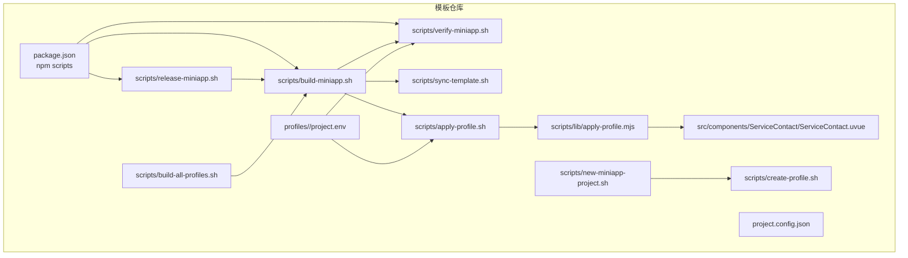
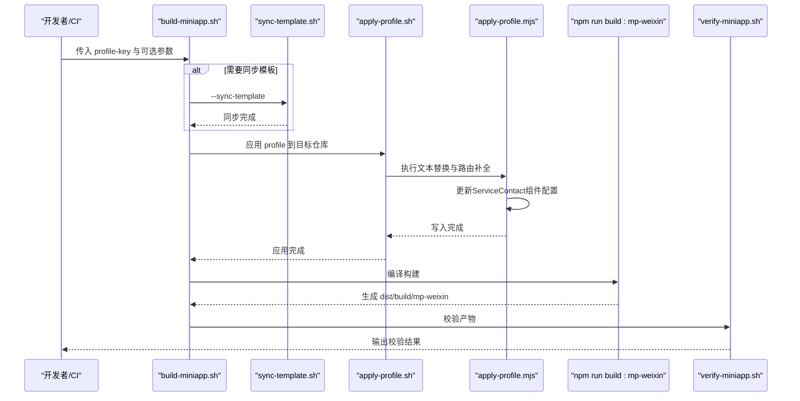
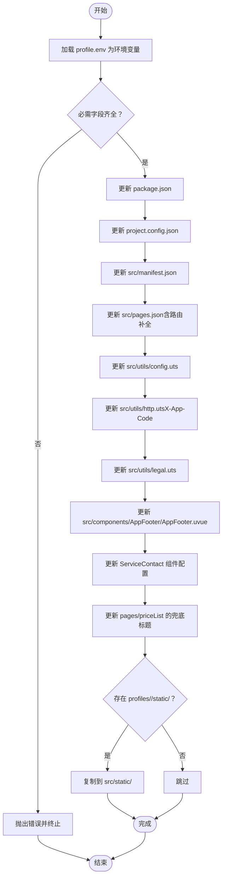
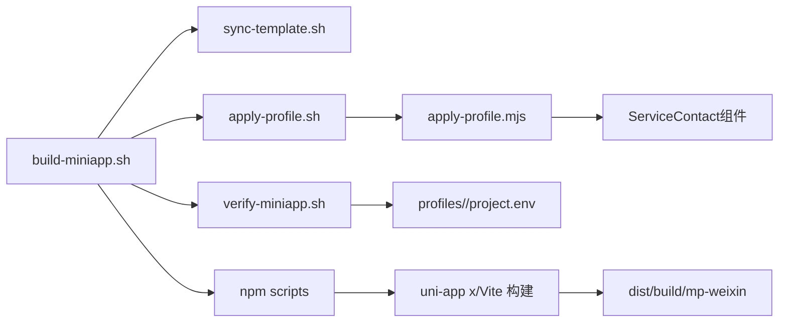

# 构建与部署

<cite>
**本文引用的文件**
- [scripts/build-miniapp.sh](file://scripts/build-miniapp.sh)
- [scripts/verify-miniapp.sh](file://scripts/verify-miniapp.sh)
- [scripts/release-miniapp.sh](file://scripts/release-miniapp.sh)
- [scripts/sync-template.sh](file://scripts/sync-template.sh)
- [scripts/apply-profile.sh](file://scripts/apply-profile.sh)
- [scripts/lib/apply-profile.mjs](file://scripts/lib/apply-profile.mjs)
- [src/components/ServiceContact/ServiceContact.uvue](file://src/components/ServiceContact/ServiceContact.uvue)
- [src/pages/index/index.uvue](file://src/pages/index/index.uvue)
- [src/pages/priceHomePage/index.uvue](file://src/pages/priceHomePage/index.uvue)
- [scripts/new-miniapp-project.sh](file://scripts/new-miniapp-project.sh)
- [scripts/create-profile.sh](file://scripts/create-profile.sh)
- [scripts/build-all-profiles.sh](file://scripts/build-all-profiles.sh)
- [profiles/blueberry/project.env](file://profiles/blueberry/project.env)
- [package.json](file://package.json)
- [project.config.json](file://project.config.json)
- [README.md](file://README.md)
</cite>

## 更新摘要
**变更内容**
- 新增ServiceContact组件作为服务信息和联系方式的统一注入点
- 更新apply-profile.mjs脚本以支持ServiceContact组件的配置注入
- 移除主页和价目表页面中的重复代码，统一使用ServiceContact组件
- 优化构建流程中的配置应用阶段

## 目录
1. [简介](#简介)
2. [项目结构](#项目结构)
3. [核心组件](#核心组件)
4. [架构总览](#架构总览)
5. [详细组件分析](#详细组件分析)
6. [依赖关系分析](#依赖关系分析)
7. [性能与可维护性](#性能与可维护性)
8. [故障排查指南](#故障排查指南)
9. [结论](#结论)
10. [附录](#附录)

## 简介
本文件面向开发者与运维人员，系统化阐述蓝莓小程序模板的构建与部署体系。重点包括：
- 自动化构建脚本的工作原理与使用方法
- 构建流程的五个阶段：模板同步、配置应用、依赖安装、编译构建、产物校验
- 产物校验的检查项与验证标准
- 不同场景下的构建命令与参数配置
- 开发构建与生产构建的区别与适用场景
- CI/CD 集成建议与常见问题排查

## 项目结构
围绕构建与发布，项目的关键目录与文件如下：
- scripts/：自动化脚本与库
  - build-miniapp.sh、verify-miniapp.sh、release-miniapp.sh、sync-template.sh、apply-profile.sh、build-all-profiles.sh、new-miniapp-project.sh、create-profile.sh
  - scripts/lib/apply-profile.mjs：profile 文本替换的核心实现
- src/components/ServiceContact/：服务信息与联系方式的统一组件
- profiles/：多项目配置（每个项目一个 profile）
  - profiles/<project-key>/project.env：必填的项目私有变量
- package.json：npm scripts 与依赖
- project.config.json：微信开发者工具公开配置（AppID 由 profile 覆盖）
- README.md：功能与使用说明

图表来源
- [package.json](file://package.json)
- [scripts/build-miniapp.sh](file://scripts/build-miniapp.sh)
- [scripts/verify-miniapp.sh](file://scripts/verify-miniapp.sh)
- [scripts/release-miniapp.sh](file://scripts/release-miniapp.sh)
- [scripts/sync-template.sh](file://scripts/sync-template.sh)
- [scripts/apply-profile.sh](file://scripts/apply-profile.sh)
- [scripts/lib/apply-profile.mjs](file://scripts/lib/apply-profile.mjs)
- [src/components/ServiceContact/ServiceContact.uvue](file://src/components/ServiceContact/ServiceContact.uvue)
- [scripts/new-miniapp-project.sh](file://scripts/new-miniapp-project.sh)
- [scripts/create-profile.sh](file://scripts/create-profile.sh)
- [scripts/build-all-profiles.sh](file://scripts/build-all-profiles.sh)
- [profiles/blueberry/project.env](file://profiles/blueberry/project.env)

章节来源
- [README.md](file://README.md)
- [package.json](file://package.json)

## 核心组件
- 构建流水线脚本：scripts/build-miniapp.sh
  - 功能：串联"模板同步、配置应用、依赖安装、编译构建、产物校验"
  - 参数：--repo、--profile-file、--sync-template、--install、--skip-apply、--skip-verify、--help
- 产物校验脚本：scripts/verify-miniapp.sh
  - 功能：校验 AppID、导航标题、联系二维码、请求头 X-App-Code、协议页面、残留字符串
  - 参数：--repo、--profile-file、--output-dir、--help
- 发布前置脚本：scripts/release-miniapp.sh
  - 功能：提示"不自动上传"，引导手动导入 dist/build/mp-weixin
- 模板同步脚本：scripts/sync-template.sh
  - 功能：将模板的 src/App.uvue、src/pages、src/utils、src/components 等同步到目标仓库（部分文件保留）
  - 参数：--repo、--help
- 配置应用脚本：scripts/apply-profile.sh
  - 功能：将 profile 变量写入 package.json、project.config.json、src/manifest.json、src/pages.json、src/utils/* 等
  - 参数：--repo、--profile-file、--help
- 核心替换逻辑：scripts/lib/apply-profile.mjs
  - 功能：按规则读取/写入文件，进行文本替换与必要路由补全，支持ServiceContact组件注入
- 服务联系组件：src/components/ServiceContact/ServiceContact.uvue
  - 功能：统一的服务保障和联系我们区块，包含二维码、联系电话、商务合作信息
  - 特点：通过正则表达式匹配进行配置注入，保持组件结构稳定
- 批量构建：scripts/build-all-profiles.sh
  - 功能：遍历 profiles/ 下的所有项目，统一执行构建
- 新项目孵化：scripts/new-miniapp-project.sh、scripts/create-profile.sh
  - 功能：从模板创建新仓库并生成初始 profile

章节来源
- [scripts/build-miniapp.sh](file://scripts/build-miniapp.sh)
- [scripts/verify-miniapp.sh](file://scripts/verify-miniapp.sh)
- [scripts/release-miniapp.sh](file://scripts/release-miniapp.sh)
- [scripts/sync-template.sh](file://scripts/sync-template.sh)
- [scripts/apply-profile.sh](file://scripts/apply-profile.sh)
- [scripts/lib/apply-profile.mjs](file://scripts/lib/apply-profile.mjs)
- [src/components/ServiceContact/ServiceContact.uvue](file://src/components/ServiceContact/ServiceContact.uvue)
- [scripts/build-all-profiles.sh](file://scripts/build-all-profiles.sh)
- [scripts/new-miniapp-project.sh](file://scripts/new-miniapp-project.sh)
- [scripts/create-profile.sh](file://scripts/create-profile.sh)
- [README.md](file://README.md)

## 架构总览
下图展示了从模板到产物的完整构建链路，以及各脚本之间的调用关系。

图表来源
- [scripts/build-miniapp.sh](file://scripts/build-miniapp.sh)
- [scripts/sync-template.sh](file://scripts/sync-template.sh)
- [scripts/apply-profile.sh](file://scripts/apply-profile.sh)
- [scripts/lib/apply-profile.mjs](file://scripts/lib/apply-profile.mjs)
- [scripts/verify-miniapp.sh](file://scripts/verify-miniapp.sh)

## 详细组件分析

### 构建脚本 build-miniapp.sh
- 流程阶段
  1) 可选：模板同步（--sync-template）
  2) 应用配置（--skip-apply 控制是否跳过）
  3) 依赖安装（--install 或检测 node_modules）
  4) 编译构建（npm run build:mp-weixin）
  5) 产物校验（--skip-verify 控制是否跳过）
- 关键行为
  - 解析参数并拼装 apply-profile 参数
  - 使用 TARGET_REPO 作为目标仓库根目录
  - 依赖可用性：npm、node
- 适用场景
  - 本地快速构建
  - CI 中的单项目构建
  - 作为 release-miniapp.sh 的前置步骤

章节来源
- [scripts/build-miniapp.sh](file://scripts/build-miniapp.sh)
- [package.json](file://package.json)

### 产物校验脚本 verify-miniapp.sh
- 校验项
  - 产物 project.config.json.appid 与 MP_WEIXIN_APPID 一致
  - 产物 app.json.window.navigationBarTitleText 与 NAVIGATION_TITLE 一致
  - 若 CONTACT_QR_SRC 以 /static/ 开头，则对应文件需存在于产物中
  - 若设置 APP_CODE，则 X-App-Code 需出现在 http.uts 源与构建产物 utils/http.js 中
  - 若设置 MINI_APP_NAME，则 legal.uts 源与构建产物 utils/legal.js 均需包含该名称，且 pages/policies/user 与 pages/policies/privacy 的 js 产物必须存在
  - 可选：RESIDUAL_SEARCH_REGEX 匹配的残留字符串不得出现
- 依赖工具
  - 优先使用 ripgrep（rg），否则回退到 grep/grep -E
- 适用场景
  - CI 中的强校验
  - 发布前最终确认

章节来源
- [scripts/verify-miniapp.sh](file://scripts/verify-miniapp.sh)
- [profiles/blueberry/project.env](file://profiles/blueberry/project.env)

### 发布前置脚本 release-miniapp.sh
- 行为
  - 输出"不自动上传"的提示
  - 调用 build-miniapp.sh 完成构建与校验
- 适用场景
  - 人工发布流程的前置步骤

章节来源
- [scripts/release-miniapp.sh](file://scripts/release-miniapp.sh)
- [scripts/build-miniapp.sh](file://scripts/build-miniapp.sh)

### 模板同步脚本 sync-template.sh
- 同步范围
  - 覆盖：src/App.uvue、src/index.html、src/main.uts、src/env.d.ts、src/pages、src/utils、src/components
  - 保留：package.json、project.config.json、src/manifest.json、src/pages.json、src/static、profiles/
- 适用场景
  - 为已有目标仓库升级模板代码（页面、工具层）

章节来源
- [scripts/sync-template.sh](file://scripts/sync-template.sh)

### 配置应用脚本 apply-profile.sh 与核心逻辑 apply-profile.mjs
- 应用范围
  - package.json、project.config.json、src/manifest.json、src/pages.json、src/utils/config.uts、src/utils/http.uts、src/utils/legal.uts、pages/*.uvue 的品牌/联系/版权字段
  - 可选：将 profiles/<key>/static/ 复制到 src/static/
- 核心逻辑要点
  - 读取 profile.env 并导出为环境变量
  - 对关键文件进行文本替换，必要时插入路由条目
  - 严格校验必需字段是否存在
  - **新增**：ServiceContact组件的统一配置注入
- 适用场景
  - 将项目私有配置注入到目标仓库

图表来源
- [scripts/apply-profile.sh](file://scripts/apply-profile.sh)
- [scripts/lib/apply-profile.mjs](file://scripts/lib/apply-profile.mjs)

章节来源
- [scripts/apply-profile.sh](file://scripts/apply-profile.sh)
- [scripts/lib/apply-profile.mjs](file://scripts/lib/apply-profile.mjs)
- [profiles/blueberry/project.env](file://profiles/blueberry/project.env)

### ServiceContact组件分析
- 组件功能
  - 统一展示服务保障列表和联系我们信息
  - 包含二维码图片、联系电话、商务合作电话
  - 通过正则表达式匹配进行配置注入
- 注入机制
  - 二维码src：通过 `updateContactPage` 函数替换 `<image class="code">` 的src属性
  - 联系电话：替换 `<view class="label">联系电话</view>` 后的值
  - 商务合作：可选替换 `<view class="label">商务合作</view>` 后的值
- 使用方式
  - 在主页（index.uvue）和价目表页（priceHomePage/index.uvue）中直接引用
  - 移除了原有的重复代码，统一使用组件

章节来源
- [src/components/ServiceContact/ServiceContact.uvue](file://src/components/ServiceContact/ServiceContact.uvue)
- [scripts/lib/apply-profile.mjs](file://scripts/lib/apply-profile.mjs)

### 批量构建脚本 build-all-profiles.sh
- 行为
  - 扫描 profiles/ 下的项目，逐个执行构建
  - 主项目（blueberry）在当前仓库执行 npm run build:mp-weixin
  - 扩展项目在各自仓库执行 scripts/build-miniapp.sh
  - 支持 --only、--skip、--external-base、--no-sync-template
- 适用场景
  - 多项目矩阵的统一构建与产出核对

章节来源
- [scripts/build-all-profiles.sh](file://scripts/build-all-profiles.sh)

### 新项目孵化脚本 new-miniapp-project.sh 与 create-profile.sh
- new-miniapp-project.sh
  - 基于模板仓库创建新项目目录，初始化 git、生成 profile
  - 可选安装依赖
- create-profile.sh
  - 生成 profiles/<key>/project.env 与 profiles/<key>/static/
  - 替换默认占位符为项目 key
- 适用场景
  - 从零孵化新小程序项目

章节来源
- [scripts/new-miniapp-project.sh](file://scripts/new-miniapp-project.sh)
- [scripts/create-profile.sh](file://scripts/create-profile.sh)

## 依赖关系分析
- 构建链路
  - build-miniapp.sh 依赖 sync-template.sh、apply-profile.sh、verify-miniapp.sh
  - apply-profile.sh 依赖 lib/apply-profile.mjs
  - verify-miniapp.sh 依赖 profile.env 与构建产物
- 项目级依赖
  - package.json 提供 npm scripts 与构建依赖（uni-app x、Vite、类型定义等）
  - project.config.json 为微信开发者工具提供公开配置（AppID 由 profile 覆盖）
- **新增**：ServiceContact组件依赖
  - 主页和价目表页面依赖ServiceContact组件
  - apply-profile.mjs脚本负责组件配置的注入

图表来源
- [scripts/build-miniapp.sh](file://scripts/build-miniapp.sh)
- [scripts/sync-template.sh](file://scripts/sync-template.sh)
- [scripts/apply-profile.sh](file://scripts/apply-profile.sh)
- [scripts/lib/apply-profile.mjs](file://scripts/lib/apply-profile.mjs)
- [scripts/verify-miniapp.sh](file://scripts/verify-miniapp.sh)
- [src/components/ServiceContact/ServiceContact.uvue](file://src/components/ServiceContact/ServiceContact.uvue)
- [package.json](file://package.json)

章节来源
- [package.json](file://package.json)
- [project.config.json](file://project.config.json)

## 性能与可维护性
- 性能
  - 依赖安装仅在缺失或显式要求时执行，减少重复安装成本
  - 构建阶段使用 npm run build:mp-weixin，遵循 uni-app x 的生产构建策略
- 可维护性
  - 通过 profiles/<key>/project.env 隔离项目私有配置，避免污染模板源码
  - apply-profile.mjs 采用精确的文本替换与路由补全，降低手改风险
  - verify-miniapp.sh 支持可选的残留字符串扫描，防止串号与模板泄露
  - **新增**：ServiceContact组件集中管理服务信息，消除重复代码，提高维护效率

[本节为通用建议，不直接分析具体文件]

## 故障排查指南
- 常见问题与解决
  - AppID 不一致
    - 现象：verify-miniapp.sh 报错 AppID 不匹配
    - 原因：project.config.json 与 profile 中的 MP_WEIXIN_APPID 不一致
    - 解决：确保 apply-profile.sh 成功写入 project.config.json 与 src/manifest.json，并重新构建
  - 协议页面缺失
    - 现象：verify-miniapp.sh 报告缺少 pages/policies/user|privacy 的产物
    - 原因：目标仓库旧代码未包含模板协议页
    - 解决：使用 --sync-template 重新构建，或在 apply-profile 阶段自动补全
  - X-App-Code 未生效
    - 现象：verify-miniapp.sh 报告未找到 X-App-Code
    - 原因：APP_CODE 为空或替换未成功
    - 解决：检查 profile.env 中 APP_CODE，确认 apply-profile.mjs 已写入 http.uts 与构建产物
  - 联系二维码缺失
    - 现象：verify-miniapp.sh 报告 /static/* 资源缺失
    - 原因：CONTACT_QR_SRC 以 /static/ 开头但未复制到 src/static/
    - 解决：将二维码放入 profiles/<key>/static/ 并确保 apply-profile.sh 复制到 src/static/
  - 模板残留字符串
    - 现象：verify-miniapp.sh 报告匹配 RESIDUAL_SEARCH_REGEX 的残留
    - 原因：模板占位符未完全替换
    - 解决：启用 --sync-template 并清理未替换的占位符
  - **新增**：ServiceContact组件配置失败
    - 现象：ServiceContact组件显示默认值而非配置值
    - 原因：apply-profile.mjs的正则表达式未能匹配组件结构
    - 解决：检查ServiceContact组件结构是否与脚本期望一致，确保class名称正确
- 调试建议
  - 在 CI 中开启 --skip-verify 仅做快速构建，线下再单独运行 verify-miniapp.sh
  - 使用 --output-dir 指向非默认输出目录，便于对比不同构建配置的影响

章节来源
- [scripts/verify-miniapp.sh](file://scripts/verify-miniapp.sh)
- [scripts/apply-profile.sh](file://scripts/apply-profile.sh)
- [scripts/lib/apply-profile.mjs](file://scripts/lib/apply-profile.mjs)
- [src/components/ServiceContact/ServiceContact.uvue](file://src/components/ServiceContact/ServiceContact.uvue)
- [README.md](file://README.md)

## 结论
本套构建与发布体系通过脚本化与参数化，实现了"模板同步—配置应用—依赖安装—编译构建—产物校验"的标准化流水线。配合 profiles 多项目配置与批量构建能力，既能满足单项目快速迭代，也能支撑多项目矩阵的统一治理。**新增的ServiceContact组件进一步提升了代码复用性和维护效率**。建议在 CI 中结合 release-miniapp.sh 与 verify-miniapp.sh，确保每次构建的可追溯与可验证。

[本节为总结性内容，不直接分析具体文件]

## 附录

### 构建流程阶段与参数对照
- 模板同步：--sync-template
- 配置应用：--skip-apply（跳过）、--profile-file（指定文件）
- 依赖安装：--install（强制安装）、默认检测 node_modules
- 编译构建：npm run build:mp-weixin（生产构建）
- 产物校验：--skip-verify（跳过）、--output-dir（自定义输出目录）

章节来源
- [scripts/build-miniapp.sh](file://scripts/build-miniapp.sh)
- [scripts/verify-miniapp.sh](file://scripts/verify-miniapp.sh)
- [package.json](file://package.json)

### 开发构建 vs 生产构建
- 开发构建
  - 命令：npm run dev:mp-weixin
  - 输出目录：dist/dev/mp-weixin
  - 适用：本地调试、热更新
- 生产构建
  - 命令：npm run build:mp-weixin
  - 输出目录：dist/build/mp-weixin
  - 适用：发布前校验与上传

章节来源
- [README.md](file://README.md)
- [package.json](file://package.json)

### CI/CD 集成建议
- 触发方式
  - PR 合并触发 build-all-profiles.sh，产出多项目构建结果
  - 主分支推送触发 release-miniapp.sh，生成可导入目录
- 关键步骤
  - 安装依赖（npm ci 或 npm install）
  - 执行 scripts/build-miniapp.sh 或 scripts/release-miniapp.sh
  - 校验 dist/build/mp-weixin 是否存在
  - 在制品库中归档 dist/build/mp-weixin 以供人工导入微信开发者工具
- 注意事项
  - 保持 Node.js 与 npm 版本满足要求
  - 为不同项目准备独立的 profiles/<key>/project.env
  - 如需模板升级，务必在构建前加入 --sync-template

章节来源
- [scripts/build-all-profiles.sh](file://scripts/build-all-profiles.sh)
- [scripts/release-miniapp.sh](file://scripts/release-miniapp.sh)
- [README.md](file://README.md)