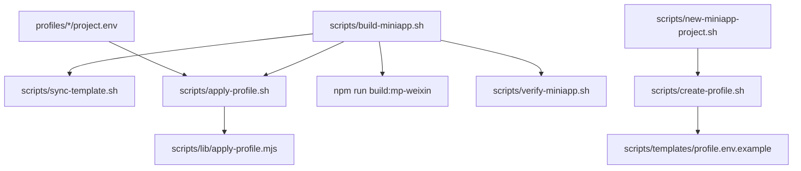
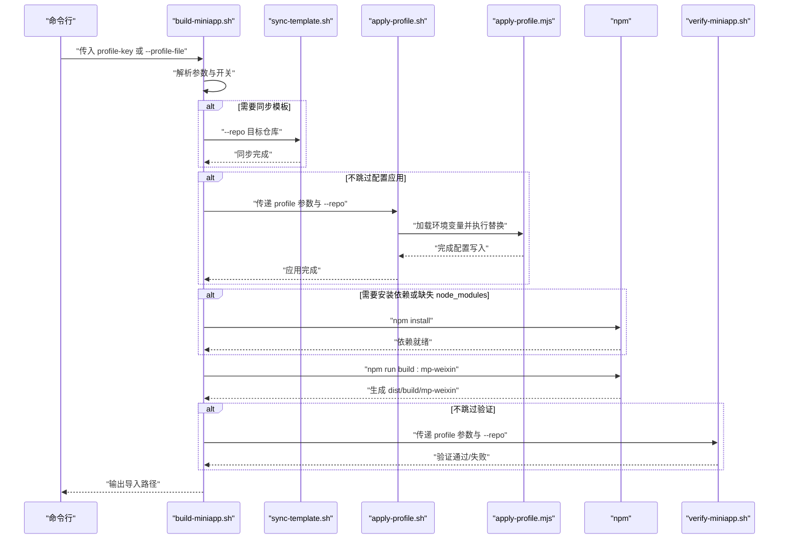
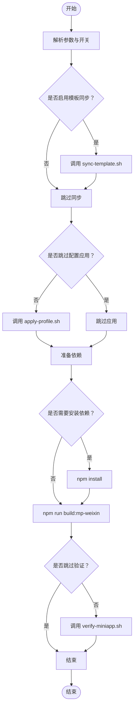
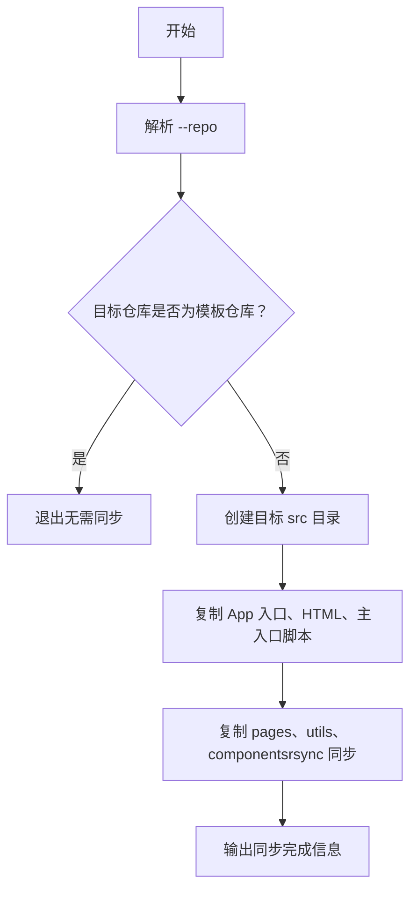
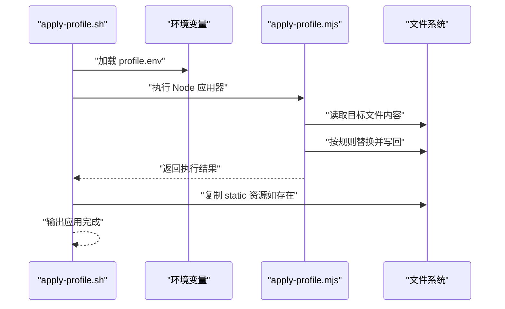
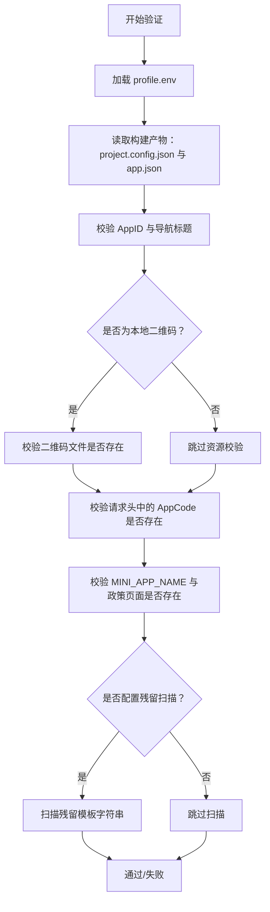
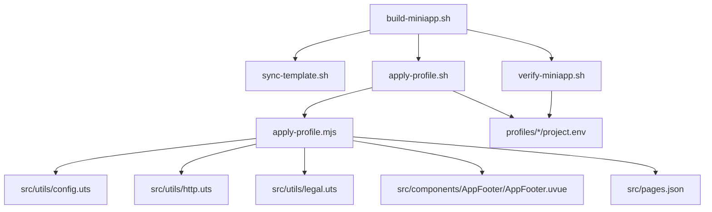

# 构建流程详解

<cite>
**本文档引用的文件**
- [scripts/build-miniapp.sh](file://scripts/build-miniapp.sh)
- [scripts/sync-template.sh](file://scripts/sync-template.sh)
- [scripts/apply-profile.sh](file://scripts/apply-profile.sh)
- [scripts/lib/apply-profile.mjs](file://scripts/lib/apply-profile.mjs)
- [scripts/verify-miniapp.sh](file://scripts/verify-miniapp.sh)
- [scripts/create-profile.sh](file://scripts/create-profile.sh)
- [scripts/new-miniapp-project.sh](file://scripts/new-miniapp-project.sh)
- [scripts/templates/profile.env.example](file://scripts/templates/profile.env.example)
- [profiles/blueberry/project.env](file://profiles/blueberry/project.env)
- [profiles/huahua/project.env](file://profiles/huahua/project.env)
- [package.json](file://package.json)
- [src/utils/config.uts](file://src/utils/config.uts)
- [src/utils/http.uts](file://src/utils/http.uts)
- [src/utils/legal.uts](file://src/utils/legal.uts)
- [src/components/AppFooter/AppFooter.uvue](file://src/components/AppFooter/AppFooter.uvue)
- [src/pages/index/index.uvue](file://src/pages/index/index.uvue)
</cite>

## 目录
1. [简介](#简介)
2. [项目结构](#项目结构)
3. [核心组件](#核心组件)
4. [架构总览](#架构总览)
5. [详细组件分析](#详细组件分析)
6. [依赖关系分析](#依赖关系分析)
7. [性能考虑](#性能考虑)
8. [故障排除指南](#故障排除指南)
9. [结论](#结论)
10. [附录](#附录)

## 简介
本文件面向蓝莓小程序项目的开发者，系统性阐述构建流程，重点解析 build-miniapp.sh 脚本的完整执行路径，涵盖模板同步、配置应用、依赖安装、编译构建与验证等阶段。文档同时说明模板同步机制如何将通用代码同步到目标仓库，以及配置应用过程如何依据 Profile 配置文件进行项目定制。最后提供参数选项、使用示例、错误处理与异常情况的应对策略，帮助开发者快速掌握并高效使用该构建体系。

## 项目结构
蓝莓项目采用“模板 + Profile 定制”的工程化组织方式：
- scripts 目录：存放构建与辅助脚本，包括构建主流程、模板同步、配置应用、校验、新建项目等。
- profiles 目录：存放不同业务线的 Profile 配置文件，每个 Profile 对应一套可定制的环境变量。
- src 目录：小程序源码，包含页面、组件、工具函数等。
- package.json：定义构建脚本与依赖，统一暴露构建入口。

图表来源
- [scripts/build-miniapp.sh:1-106](file://scripts/build-miniapp.sh#L1-L106)
- [scripts/sync-template.sh:1-81](file://scripts/sync-template.sh#L1-L81)
- [scripts/apply-profile.sh:1-98](file://scripts/apply-profile.sh#L1-L98)
- [scripts/lib/apply-profile.mjs:1-190](file://scripts/lib/apply-profile.mjs#L1-L190)
- [scripts/verify-miniapp.sh:1-165](file://scripts/verify-miniapp.sh#L1-L165)
- [scripts/new-miniapp-project.sh:1-100](file://scripts/new-miniapp-project.sh#L1-L100)
- [scripts/create-profile.sh:1-77](file://scripts/create-profile.sh#L1-L77)
- [scripts/templates/profile.env.example:1-25](file://scripts/templates/profile.env.example#L1-L25)

章节来源
- [package.json:1-48](file://package.json#L1-L48)

## 核心组件
- 构建主流程脚本：负责解析参数、协调模板同步、配置应用、依赖安装、编译与验证。
- 模板同步脚本：将模板仓库中的通用代码同步到目标仓库，避免重复维护。
- 配置应用脚本与 Node 应用器：基于 Profile 环境变量批量替换关键配置与文案。
- 校验脚本：对构建产物进行一致性校验，确保 AppID、导航标题、资源存在性与残留字符串等符合预期。
- Profile 创建与项目初始化脚本：协助快速生成新的 Profile 与项目骨架。

章节来源
- [scripts/build-miniapp.sh:14-25](file://scripts/build-miniapp.sh#L14-L25)
- [scripts/sync-template.sh:8-32](file://scripts/sync-template.sh#L8-L32)
- [scripts/apply-profile.sh:10-27](file://scripts/apply-profile.sh#L10-L27)
- [scripts/verify-miniapp.sh:34-45](file://scripts/verify-miniapp.sh#L34-L45)
- [scripts/create-profile.sh:10-19](file://scripts/create-profile.sh#L10-L19)
- [scripts/new-miniapp-project.sh:11-22](file://scripts/new-miniapp-project.sh#L11-L22)

## 架构总览
下图展示了从命令行到最终产物的完整流程，以及各组件之间的调用关系：

图表来源
- [scripts/build-miniapp.sh:70-106](file://scripts/build-miniapp.sh#L70-L106)
- [scripts/sync-template.sh:34-81](file://scripts/sync-template.sh#L34-L81)
- [scripts/apply-profile.sh:29-98](file://scripts/apply-profile.sh#L29-L98)
- [scripts/lib/apply-profile.mjs:12-190](file://scripts/lib/apply-profile.mjs#L12-L190)
- [scripts/verify-miniapp.sh:47-165](file://scripts/verify-miniapp.sh#L47-L165)

## 详细组件分析

### 构建主流程脚本（build-miniapp.sh）
- 目标：串联模板同步、配置应用、依赖安装、编译与验证，形成可重复的构建流水线。
- 关键行为：
  - 参数解析：支持 profile-key、--repo、--profile-file、--sync-template、--install、--skip-apply、--skip-verify。
  - 条件执行：
    - 当启用模板同步开关时，调用模板同步脚本。
    - 当未显式跳过配置应用时，调用配置应用脚本。
    - 当需要安装依赖或目标仓库缺少 node_modules 时，执行 npm install。
    - 固定执行 npm run build:mp-weixin。
    - 当未显式跳过验证时，调用验证脚本。
  - 输出：打印构建完成提示，并给出在微信开发者工具中导入的目录路径。

图表来源
- [scripts/build-miniapp.sh:27-106](file://scripts/build-miniapp.sh#L27-L106)

章节来源
- [scripts/build-miniapp.sh:14-25](file://scripts/build-miniapp.sh#L14-L25)
- [scripts/build-miniapp.sh:70-106](file://scripts/build-miniapp.sh#L70-L106)

### 模板同步机制（sync-template.sh）
- 目标：将模板仓库中的通用代码同步到目标仓库，避免重复维护。
- 同步范围：
  - 覆盖项：App 入口、HTML 入口、主入口脚本、pages、utils、components。
  - 非覆盖项：package.json、project.config.json、manifest.json、pages.json、static、profiles。
- 行为细节：
  - 若目标仓库与模板仓库相同，则直接退出，避免无意义操作。
  - 使用 rsync 进行目录级同步，确保删除目标侧多余文件。
  - components 目录必须同步，否则配置应用阶段可能因找不到组件文件而报错。

图表来源
- [scripts/sync-template.sh:34-81](file://scripts/sync-template.sh#L34-L81)

章节来源
- [scripts/sync-template.sh:8-32](file://scripts/sync-template.sh#L8-L32)
- [scripts/sync-template.sh:57-81](file://scripts/sync-template.sh#L57-L81)

### 配置应用流程（apply-profile.sh + apply-profile.mjs）
- 目标：基于 Profile 环境变量，批量替换关键配置与文案，实现项目定制。
- 关键点：
  - Profile 解析：优先使用 --profile-file，否则在模板或目标仓库查找 profiles/<key>/project.env。
  - 环境变量注入：加载 Profile 后导出到环境，供 Node 应用器使用。
  - Node 应用器职责：校验必需字段、读取/写入目标文件、执行正则替换、处理静态资源拷贝。
- 被替换的关键文件与字段：
  - package.json：包名。
  - project.config.json：小程序 AppID。
  - src/manifest.json：应用名、描述、微信 AppID。
  - src/pages.json：全局导航栏标题、必要路由注入。
  - src/utils/config.uts：基础接口地址。
  - src/utils/http.uts：请求头中的 X-App-Code。
  - src/utils/legal.uts：小程序名称。
  - src/components/AppFooter/AppFooter.uvue：版权文案。
  - 联系页面与价目表页面：联系二维码与默认标题。

图表来源
- [scripts/apply-profile.sh:61-98](file://scripts/apply-profile.sh#L61-L98)
- [scripts/lib/apply-profile.mjs:12-190](file://scripts/lib/apply-profile.mjs#L12-L190)

章节来源
- [scripts/apply-profile.sh:10-27](file://scripts/apply-profile.sh#L10-L27)
- [scripts/apply-profile.sh:61-98](file://scripts/apply-profile.sh#L61-L98)
- [scripts/lib/apply-profile.mjs:12-190](file://scripts/lib/apply-profile.mjs#L12-L190)

### 构建与验证（build-miniapp.sh + verify-miniapp.sh）
- 构建阶段：固定调用 npm run build:mp-weixin，生成 dist/build/mp-weixin。
- 验证阶段：校验构建产物中的 AppID、导航标题、本地联系二维码资源、请求头中的 AppCode、法律名称与政策页面的存在性，以及可选的残留字符串扫描。

图表来源
- [scripts/verify-miniapp.sh:47-165](file://scripts/verify-miniapp.sh#L47-L165)

章节来源
- [scripts/build-miniapp.sh:97-102](file://scripts/build-miniapp.sh#L97-L102)
- [scripts/verify-miniapp.sh:34-45](file://scripts/verify-miniapp.sh#L34-L45)
- [scripts/verify-miniapp.sh:101-165](file://scripts/verify-miniapp.sh#L101-L165)

### Profile 管理与项目初始化
- 新建项目：基于模板仓库创建新项目骨架，自动初始化 Profile。
- 创建 Profile：复制模板文件，填充基础字段，便于后续编辑。
- 示例 Profile：提供两个业务线的示例配置，包含 AppID、导航标题、联系方式、接口地址等。

章节来源
- [scripts/new-miniapp-project.sh:11-22](file://scripts/new-miniapp-project.sh#L11-L22)
- [scripts/new-miniapp-project.sh:53-100](file://scripts/new-miniapp-project.sh#L53-L100)
- [scripts/create-profile.sh:10-19](file://scripts/create-profile.sh#L10-L19)
- [scripts/create-profile.sh:54-77](file://scripts/create-profile.sh#L54-L77)
- [scripts/templates/profile.env.example:1-25](file://scripts/templates/profile.env.example#L1-L25)
- [profiles/blueberry/project.env:1-23](file://profiles/blueberry/project.env#L1-L23)
- [profiles/huahua/project.env:1-24](file://profiles/huahua/project.env#L1-L24)

## 依赖关系分析
- 构建主流程依赖于模板同步、配置应用与验证脚本；配置应用依赖 Node 应用器；验证脚本依赖构建产物与 Profile。
- Profile 文件决定构建产物的关键属性，如 AppID、导航标题、接口地址、法律名称等。
- 源码中的关键文件（如 config.uts、http.uts、legal.uts、AppFooter.uvue）与 pages.json 中的路由配置共同构成最终产物的外观与行为。

图表来源
- [scripts/build-miniapp.sh:84-102](file://scripts/build-miniapp.sh#L84-L102)
- [scripts/apply-profile.sh:89](file://scripts/apply-profile.sh#L89)
- [scripts/lib/apply-profile.mjs:137-190](file://scripts/lib/apply-profile.mjs#L137-L190)
- [scripts/verify-miniapp.sh:99-165](file://scripts/verify-miniapp.sh#L99-L165)

章节来源
- [scripts/lib/apply-profile.mjs:137-190](file://scripts/lib/apply-profile.mjs#L137-L190)
- [src/utils/config.uts:1-12](file://src/utils/config.uts#L1-L12)
- [src/utils/http.uts:1-82](file://src/utils/http.uts#L1-L82)
- [src/utils/legal.uts:1-16](file://src/utils/legal.uts#L1-L16)
- [src/components/AppFooter/AppFooter.uvue:1-25](file://src/components/AppFooter/AppFooter.uvue#L1-L25)
- [src/pages/index/index.uvue:46-56](file://src/pages/index/index.uvue#L46-L56)

## 性能考虑
- 模板同步使用 rsync，具备增量与删除多余文件的能力，减少冗余。
- 依赖安装仅在必要时执行，避免重复安装带来的耗时。
- 验证阶段优先使用 ripgrep（若可用）进行快速匹配，否则回退到 grep，兼顾跨平台可用性。
- 建议在 CI 环境中缓存 node_modules，进一步缩短构建时间。

## 故障排除指南
- Profile 未找到
  - 现象：提示未找到指定的 profile。
  - 原因：未提供 --profile-file，且在模板与目标仓库均未找到 profiles/<key>/project.env。
  - 处理：提供正确的 profile-key 或 --profile-file，或先通过 create-profile.sh 创建 Profile。
  - 章节来源
    - [scripts/apply-profile.sh:62-73](file://scripts/apply-profile.sh#L62-L73)
- 必需环境变量缺失
  - 现象：抛出缺少必需字段的错误。
  - 原因：Profile 中缺少 PROJECT_KEY、PACKAGE_NAME、MANIFEST_NAME、DESCRIPTION、MP_WEIXIN_APPID、NAVIGATION_TITLE、COPYRIGHT_TEXT、CONTACT_PHONE_TEXT、CONTACT_QR_SRC、PRICE_FALLBACK_TITLE、API_BASE_URL、MINI_APP_NAME 等。
  - 处理：在 profile.env 中补齐对应字段。
  - 章节来源
    - [scripts/lib/apply-profile.mjs:12-31](file://scripts/lib/apply-profile.mjs#L12-L31)
- 模板字符串残留
  - 现象：验证阶段发现残留模板字符串。
  - 原因：源码或配置中仍包含模板占位符。
  - 处理：在 profile.env 中配置 RESIDUAL_SEARCH_REGEX，或清理源码中的占位符。
  - 章节来源
    - [scripts/verify-miniapp.sh:154-159](file://scripts/verify-miniapp.sh#L154-L159)
- 本地联系二维码缺失
  - 现象：输出目录缺少本地二维码文件。
  - 原因：CONTACT_QR_SRC 指向 /static/*，但构建产物中未包含该文件。
  - 处理：将二维码图片放入 Profile 的 static 目录，并确保同步模板后再构建。
  - 章节来源
    - [scripts/verify-miniapp.sh:124-130](file://scripts/verify-miniapp.sh#L124-L130)
- AppID 或导航标题不一致
  - 现象：构建产物与期望不一致。
  - 处理：检查 profile.env 中的 MP_WEIXIN_APPID 与 NAVIGATION_TITLE，确保与实际小程序配置一致。
  - 章节来源
    - [scripts/verify-miniapp.sh:114-122](file://scripts/verify-miniapp.sh#L114-L122)
- 组件文件缺失导致配置应用失败
  - 现象：apply-profile.mjs 报 ENOENT。
  - 原因：目标仓库未同步 components 目录。
  - 处理：使用 --sync-template 或手动同步 components。
  - 章节来源
    - [scripts/sync-template.sh:75-78](file://scripts/sync-template.sh#L75-L78)

## 结论
本构建体系通过“模板 + Profile”的方式实现了高度可复用的小程序工程化方案。build-miniapp.sh 作为主控脚本，将模板同步、配置应用、依赖管理、编译与验证串联为一条稳定的流水线。配合 apply-profile.mjs 的精准替换与 verify-miniapp.sh 的严格校验，能够有效降低人为疏漏，提升交付质量与效率。建议在团队内推广使用该流程，并结合 CI/CD 实现自动化构建与发布。

## 附录

### 参数选项与使用示例
- 构建主流程参数
  - profile-key：Profile 名称，用于定位 profiles/<key>/project.env。
  - --repo <target-repo>：目标仓库路径，默认为工具根目录。
  - --profile-file <file>：直接指定 Profile 文件路径。
  - --sync-template：启用模板同步。
  - --install：强制安装依赖。
  - --skip-apply：跳过配置应用。
  - --skip-verify：跳过构建验证。
  - 章节来源
    - [scripts/build-miniapp.sh:14-25](file://scripts/build-miniapp.sh#L14-L25)
    - [scripts/build-miniapp.sh:27-68](file://scripts/build-miniapp.sh#L27-L68)

- 验证脚本参数
  - --output-dir <relative-output-dir>：自定义输出目录，默认 dist/build/mp-weixin。
  - 章节来源
    - [scripts/verify-miniapp.sh:34-45](file://scripts/verify-miniapp.sh#L34-L45)

- 使用示例
  - 基本构建：scripts/build-miniapp.sh blueberry --repo /path/to/target
  - 同步模板并构建：scripts/build-miniapp.sh huahua --repo /path/to/target --sync-template
  - 跳过验证：scripts/build-miniapp.sh blueberry --repo /path/to/target --skip-verify
  - 指定 Profile 文件：scripts/build-miniapp.sh --profile-file ./custom.env --repo /path/to/target
  - 章节来源
    - [profiles/blueberry/project.env:1-23](file://profiles/blueberry/project.env#L1-L23)
    - [profiles/huahua/project.env:1-24](file://profiles/huahua/project.env#L1-L24)

### 关键配置字段说明
- 必需字段（缺失将触发错误）
  - PROJECT_KEY、PACKAGE_NAME、MANIFEST_NAME、DESCRIPTION、MP_WEIXIN_APPID、NAVIGATION_TITLE、COPYRIGHT_TEXT、CONTACT_PHONE_TEXT、CONTACT_QR_SRC、PRICE_FALLBACK_TITLE、API_BASE_URL、MINI_APP_NAME
  - 章节来源
    - [scripts/lib/apply-profile.mjs:12-31](file://scripts/lib/apply-profile.mjs#L12-L31)

- 可选字段
  - APP_CODE：用于在请求头中注入 X-App-Code。
  - RESIDUAL_SEARCH_REGEX：构建后扫描不应残留的模板字符串。
  - 章节来源
    - [scripts/lib/apply-profile.mjs:144-146](file://scripts/lib/apply-profile.mjs#L144-L146)
    - [scripts/verify-miniapp.sh:154-159](file://scripts/verify-miniapp.sh#L154-L159)
    - [scripts/templates/profile.env.example:23-24](file://scripts/templates/profile.env.example#L23-L24)

### 源码映射与替换点
- 接口基础地址：src/utils/config.uts
- 请求头 AppCode：src/utils/http.uts
- 法律名称与政策页面：src/utils/legal.uts
- 版权文案：src/components/AppFooter/AppFooter.uvue
- 导航标题与政策路由：src/pages.json
- 章节来源
  - [src/utils/config.uts:1-12](file://src/utils/config.uts#L1-L12)
  - [src/utils/http.uts:1-82](file://src/utils/http.uts#L1-L82)
  - [src/utils/legal.uts:1-16](file://src/utils/legal.uts#L1-L16)
  - [src/components/AppFooter/AppFooter.uvue:1-25](file://src/components/AppFooter/AppFooter.uvue#L1-L25)
  - [src/pages/index/index.uvue:46-56](file://src/pages/index/index.uvue#L46-L56)
