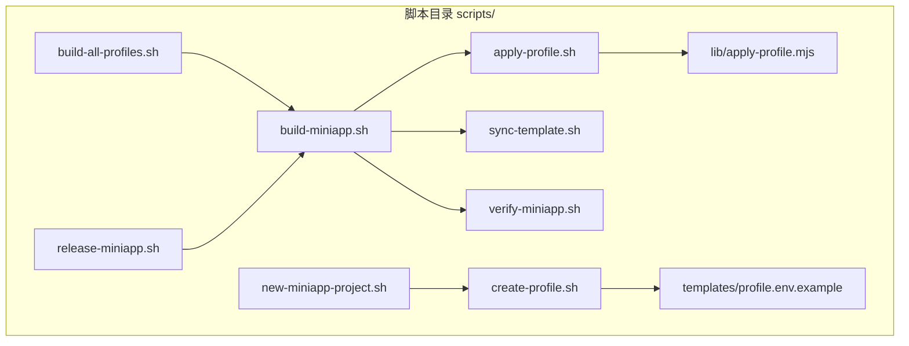
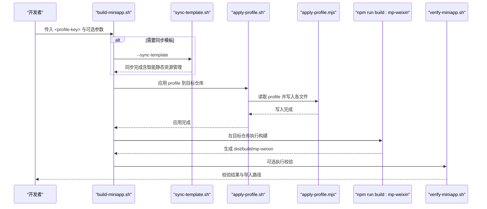
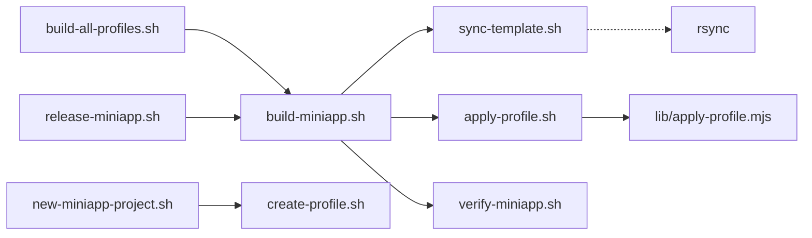

# 脚本使用手册

<cite>
**本文引用的文件**
- [scripts/build-all-profiles.sh](file://scripts/build-all-profiles.sh)
- [scripts/create-profile.sh](file://scripts/create-profile.sh)
- [scripts/new-miniapp-project.sh](file://scripts/new-miniapp-project.sh)
- [scripts/apply-profile.sh](file://scripts/apply-profile.sh)
- [scripts/build-miniapp.sh](file://scripts/build-miniapp.sh)
- [scripts/release-miniapp.sh](file://scripts/release-miniapp.sh)
- [scripts/sync-template.sh](file://scripts/sync-template.sh)
- [scripts/verify-miniapp.sh](file://scripts/verify-miniapp.sh)
- [scripts/lib/apply-profile.mjs](file://scripts/lib/apply-profile.mjs)
- [scripts/templates/profile.env.example](file://scripts/templates/profile.env.example)
- [package.json](file://package.json)
- [README.md](file://README.md)
- [project.config.json](file://project.config.json)
- [profiles/blueberry/project.env](file://profiles/blueberry/project.env)
- [profiles/huahua/project.env](file://profiles/huahua/project.env)
- [微信开发者工具预览指南.md](file://微信开发者工具预览指南.md)
</cite>

## 更新摘要
**变更内容**
- 更新了 sync-template.sh 脚本的静态资源管理机制说明
- 新增选择性同步共享UI图标文件的功能描述
- 完善了静态资源同步策略的详细文档
- 更新了相关的使用示例和注意事项

## 目录
1. [简介](#简介)
2. [项目结构](#项目结构)
3. [核心组件](#核心组件)
4. [架构总览](#架构总览)
5. [详细组件分析](#详细组件分析)
6. [依赖分析](#依赖分析)
7. [性能考虑](#性能考虑)
8. [故障排除指南](#故障排除指南)
9. [结论](#结论)
10. [附录](#附录)

## 简介
本手册面向运维人员与开发者，系统讲解蓝莓小程序模板的自动化脚本体系，涵盖脚本功能、参数选项、执行条件、使用场景、协作关系与调用顺序，并提供命令行示例、权限与环境要求、调试与排障方法，帮助您高效完成多项目 Profile 管理与一键构建、校验、发布。

## 项目结构
脚本体系位于 scripts/ 目录，围绕"模板 + 多 Profile"的模式组织，关键文件如下：
- 构建与发布：build-miniapp.sh、build-all-profiles.sh、release-miniapp.sh、verify-miniapp.sh
- 配置与模板：create-profile.sh、apply-profile.sh、sync-template.sh、templates/profile.env.example
- 新项目孵化：new-miniapp-project.sh
- 核心实现：lib/apply-profile.mjs（profile 文本替换逻辑）



**图表来源**
- [scripts/build-all-profiles.sh:1-178](file://scripts/build-all-profiles.sh#L1-L178)
- [scripts/build-miniapp.sh:1-106](file://scripts/build-miniapp.sh#L1-L106)
- [scripts/apply-profile.sh:1-98](file://scripts/apply-profile.sh#L1-L98)
- [scripts/sync-template.sh:1-87](file://scripts/sync-template.sh#L1-L87)
- [scripts/verify-miniapp.sh:1-165](file://scripts/verify-miniapp.sh#L1-L165)
- [scripts/create-profile.sh:1-77](file://scripts/create-profile.sh#L1-L77)
- [scripts/new-miniapp-project.sh:1-100](file://scripts/new-miniapp-project.sh#L1-L100)
- [scripts/release-miniapp.sh:1-15](file://scripts/release-miniapp.sh#L1-L15)
- [scripts/lib/apply-profile.mjs:1-190](file://scripts/lib/apply-profile.mjs#L1-L190)
- [scripts/templates/profile.env.example:1-25](file://scripts/templates/profile.env.example#L1-L25)

**章节来源**
- [README.md:111-120](file://README.md#L111-L120)
- [package.json:4-13](file://package.json#L4-L13)

## 核心组件
- build-all-profiles.sh：批量扫描 profiles/ 下的所有 profile，按主项目与扩展项目分别执行构建，支持选择/跳过、外部仓库基座、是否同步模板等控制。
- build-miniapp.sh：完整构建流水线（可选同步模板 → 应用 Profile → 安装依赖 → 编译 → 校验），是日常构建的推荐入口。
- apply-profile.sh：将 profile 的变量注入到目标仓库的关键配置与源码中，并可复制静态资源。
- **enhanced** sync-template.sh：将模板的公共代码（pages、utils、components 等）同步到目标仓库，**新增智能静态资源管理**，支持选择性同步共享UI图标文件（*.svg/*.png），避免覆盖各项目的私有静态资源。
- verify-miniapp.sh：对构建产物进行严格校验（AppID、导航标题、本地协议页、请求头、残留字符串等）。
- create-profile.sh：基于模板生成新的 profile，便于快速孵化新项目。
- new-miniapp-project.sh：从模板快速创建完整的新仓库，包含初始 profile、git 初始化与可选安装依赖。
- release-miniapp.sh：发布前构建的包装脚本，输出导入路径提示，不自动上传。
- lib/apply-profile.mjs：profile 文本替换的核心实现，负责写入 package.json、project.config.json、manifest.json、pages.json、utils 等文件。
- templates/profile.env.example：profile 模板，定义必填与可选字段及默认值。

**章节来源**
- [scripts/build-all-profiles.sh:16-33](file://scripts/build-all-profiles.sh#L16-L33)
- [scripts/build-miniapp.sh:14-25](file://scripts/build-miniapp.sh#L14-L25)
- [scripts/apply-profile.sh:10-27](file://scripts/apply-profile.sh#L10-L27)
- [scripts/sync-template.sh:8-32](file://scripts/sync-template.sh#L8-L32)
- [scripts/verify-miniapp.sh:34-45](file://scripts/verify-miniapp.sh#L34-L45)
- [scripts/create-profile.sh:10-19](file://scripts/create-profile.sh#L10-L19)
- [scripts/new-miniapp-project.sh:11-22](file://scripts/new-miniapp-project.sh#L11-L22)
- [scripts/release-miniapp.sh:6-12](file://scripts/release-miniapp.sh#L6-L12)
- [scripts/lib/apply-profile.mjs:12-31](file://scripts/lib/apply-profile.mjs#L12-L31)
- [scripts/templates/profile.env.example:1-25](file://scripts/templates/profile.env.example#L1-L25)

## 架构总览
以下序列图展示了"单个 profile 构建"的完整流程，从模板到产物校验：



**图表来源**
- [scripts/build-miniapp.sh:84-102](file://scripts/build-miniapp.sh#L84-L102)
- [scripts/sync-template.sh:80-87](file://scripts/sync-template.sh#L80-L87)
- [scripts/apply-profile.sh:89-95](file://scripts/apply-profile.sh#L89-L95)
- [scripts/lib/apply-profile.mjs:179-190](file://scripts/lib/apply-profile.mjs#L179-L190)
- [scripts/verify-miniapp.sh:161-165](file://scripts/verify-miniapp.sh#L161-L165)

## 详细组件分析

### build-all-profiles.sh 使用说明
- 功能概述
  - 扫描 profiles/ 目录，收集所有可用 profile，按主项目与扩展项目分别执行构建。
  - 主项目在当前仓库执行生产构建；扩展项目通过调用 build-miniapp.sh 完成。
- 关键参数
  - --only <key1,key2>：仅构建指定列表中的 profile
  - --skip <key1,key2>：跳过指定列表中的 profile
  - --external-base <dir>：扩展项目根目录，默认为当前仓库父目录
  - --no-sync-template：扩展项目构建时禁用 --sync-template
  - -h/--help：显示帮助
- 执行条件
  - profiles/ 目录必须存在且包含至少一个带 project.env 的子目录
  - 扩展项目的目标仓库目录需存在（否则视为失败并跳过）
- 使用场景
  - CI 批量构建多个目标仓库
  - 一键对比不同 profile 的构建结果
- 命令示例
  - 构建所有 profile：scripts/build-all-profiles.sh
  - 仅构建 blueberry：scripts/build-all-profiles.sh --only blueberry
  - 跳过 huahua：scripts/build-all-profiles.sh --skip huahua
  - 指定外部仓库基座：scripts/build-all-profiles.sh --external-base /path/to/ext
  - 不同步模板：scripts/build-all-profiles.sh --no-sync-template
- 输出与返回码
  - 成功/失败/跳过的统计汇总；失败条目非零时返回非零码

**章节来源**
- [scripts/build-all-profiles.sh:16-33](file://scripts/build-all-profiles.sh#L16-L33)
- [scripts/build-all-profiles.sh:69-100](file://scripts/build-all-profiles.sh#L69-L100)
- [scripts/build-all-profiles.sh:115-163](file://scripts/build-all-profiles.sh#L115-L163)
- [scripts/build-all-profiles.sh:165-177](file://scripts/build-all-profiles.sh#L165-L177)

### build-miniapp.sh 使用说明
- 功能概述
  - 一条命令完成：可选同步模板 → 应用 profile → 安装依赖 → 编译 → 可选校验
- 关键参数
  - --repo <target-repo>：目标仓库路径
  - --profile-file <file>：显式指定 profile 文件
  - --sync-template：同步模板代码（**现已支持智能静态资源管理**）
  - --install：强制安装依赖（当缺失或未安装时）
  - --skip-apply：跳过应用 profile
  - --skip-verify：跳过产物校验
  - -h/--help：显示帮助
- 使用场景
  - 日常构建与预览
  - 仅更新配置不升级模板
  - 首次孵化后快速构建
- 命令示例
  - 基础构建：scripts/build-miniapp.sh blueberry
  - 指定目标仓库：scripts/build-miniapp.sh huahua --repo /path/to/huahua
  - 同步模板再构建：scripts/build-miniapp.sh huahua --repo /path/to/huahua --sync-template
  - 跳过校验：scripts/build-miniapp.sh blueberry --skip-verify

**章节来源**
- [scripts/build-miniapp.sh:14-25](file://scripts/build-miniapp.sh#L14-L25)
- [scripts/build-miniapp.sh:27-68](file://scripts/build-miniapp.sh#L27-L68)
- [scripts/build-miniapp.sh:84-102](file://scripts/build-miniapp.sh#L84-L102)

### apply-profile.sh 使用说明
- 功能概述
  - 从 profiles/<key>/project.env 加载变量，写入目标仓库的关键文件
  - 如存在 profiles/<key>/static/，将其复制到目标仓库 src/static/
- 关键参数
  - <profile-key>：profile 键
  - --repo <target-repo>：目标仓库路径
  - --profile-file <file>：显式指定 profile 文件
  - -h/--help：显示帮助
- 使用场景
  - 仅应用配置（不升级模板）
  - 为已有仓库注入最新配置
- 命令示例
  - 应用到模板仓库：scripts/apply-profile.sh blueberry
  - 应用到外部仓库：scripts/apply-profile.sh huahua --repo /path/to/huahua

**章节来源**
- [scripts/apply-profile.sh:10-27](file://scripts/apply-profile.sh#L10-L27)
- [scripts/apply-profile.sh:61-73](file://scripts/apply-profile.sh#L61-L73)
- [scripts/apply-profile.sh:89-95](file://scripts/apply-profile.sh#L89-L95)

### sync-template.sh 使用说明
- 功能概述
  - 将模板的公共代码（App.uvue、main.uts、index.html、env.d.ts、pages、utils、components）同步到目标仓库
  - **增强功能**：智能静态资源管理，选择性同步共享UI图标文件
  - 不覆盖 package.json、project.config.json、manifest.json、pages.json、profiles/
- **新增静态资源管理策略**
  - **整体保护**：src/static/ 目录整体不同步，保护各项目私有资源
  - **选择性同步**：仅同步 *.svg 和 *.png 格式的共享UI图标文件
  - **智能过滤**：使用 rsync 的 include/exclude 规则精确匹配图标文件
- 关键参数
  - --repo <target-repo>：目标仓库路径
  - -h/--help：显示帮助
- 使用场景
  - 为旧仓库升级页面与工具层代码
  - 保持目标仓库与模板一致
  - **新增**：安全地同步共享UI图标而不影响项目私有资源
- 命令示例
  - 同步到外部仓库：scripts/sync-template.sh --repo /path/to/huahua

**更新** 新增了智能静态资源管理机制，支持选择性同步共享UI图标文件

**章节来源**
- [scripts/sync-template.sh:8-32](file://scripts/sync-template.sh#L8-L32)
- [scripts/sync-template.sh:57-60](file://scripts/sync-template.sh#L57-L60)
- [scripts/sync-template.sh:72-78](file://scripts/sync-template.sh#L72-L78)
- [scripts/sync-template.sh:80-87](file://scripts/sync-template.sh#L80-L87)

### verify-miniapp.sh 使用说明
- 功能概述
  - 对构建产物进行严格校验：AppID、导航标题、本地联系二维码、X-App-Code、MINI_APP_NAME、协议页、残留字符串等
- 关键参数
  - <profile-key>：profile 键
  - --repo <target-repo>：目标仓库路径
  - --profile-file <file>：显式指定 profile 文件
  - --output-dir <relative-output-dir>：自定义输出目录（相对路径）
  - -h/--help：显示帮助
- 使用场景
  - 发布前最终确认
  - CI 校验阶段
- 命令示例
  - 校验默认输出：scripts/verify-miniapp.sh blueberry
  - 校验外部仓库：scripts/verify-miniapp.sh huahua --repo /path/to/huahua

**章节来源**
- [scripts/verify-miniapp.sh:34-45](file://scripts/verify-miniapp.sh#L34-L45)
- [scripts/verify-miniapp.sh:101-122](file://scripts/verify-miniapp.sh#L101-L122)
- [scripts/verify-miniapp.sh:132-152](file://scripts/verify-miniapp.sh#L132-L152)

### create-profile.sh 使用说明
- 功能概述
  - 基于模板生成新的 profile 目录与 project.env，并创建 static/ 目录
- 关键参数
  - <project-key>：项目键
  - --profiles-dir <dir>：profiles 目录（默认当前仓库 profiles/）
  - --force：覆盖已存在的文件
  - -h/--help：显示帮助
- 使用场景
  - 为新项目快速创建初始配置
- 命令示例
  - 创建新 profile：scripts/create-profile.sh new-shop
  - 指定 profiles 目录：scripts/create-profile.sh my-shop --profiles-dir /path/to/repo/profiles

**章节来源**
- [scripts/create-profile.sh:10-19](file://scripts/create-profile.sh#L10-L19)
- [scripts/create-profile.sh:57-61](file://scripts/create-profile.sh#L57-L61)
- [scripts/create-profile.sh:68-76](file://scripts/create-profile.sh#L68-L76)

### new-miniapp-project.sh 使用说明
- 功能概述
  - 从模板复制完整仓库到目标目录，初始化 git、创建初始 profile、可选安装依赖
- 关键参数
  - <project-key> <target-dir>：项目键与目标目录
  - --force：覆盖已存在目标目录
  - --install：安装依赖
  - -h/--help：显示帮助
- 使用场景
  - 从零孵化全新小程序项目
- 命令示例
  - 孵化并安装依赖：scripts/new-miniapp-project.sh new-shop /path/to/new-shop --install

**章节来源**
- [scripts/new-miniapp-project.sh:11-22](file://scripts/new-miniapp-project.sh#L11-L22)
- [scripts/new-miniapp-project.sh:62-70](file://scripts/new-miniapp-project.sh#L62-L70)
- [scripts/new-miniapp-project.sh:85-87](file://scripts/new-miniapp-project.sh#L85-L87)
- [scripts/new-miniapp-project.sh:89-99](file://scripts/new-miniapp-project.sh#L89-L99)

### release-miniapp.sh 使用说明
- 功能概述
  - 发布前构建的包装脚本，输出导入路径提示（不自动上传）
- 关键参数
  - 与 build-miniapp.sh 相同
- 使用场景
  - 发布流程前置检查
- 命令示例
  - 发布前构建：scripts/release-miniapp.sh huahua --repo /path/to/huahua --sync-template

**章节来源**
- [scripts/release-miniapp.sh:6-12](file://scripts/release-miniapp.sh#L6-L12)
- [scripts/release-miniapp.sh:14-15](file://scripts/release-miniapp.sh#L14-L15)

### lib/apply-profile.mjs 实现要点
- 必填字段校验：PROJECT_KEY、PACKAGE_NAME、MANIFEST_NAME、DESCRIPTION、MP_WEIXIN_APPID、NAVIGATION_TITLE、COPYRIGHT_TEXT、CONTACT_PHONE_TEXT、CONTACT_QR_SRC、PRICE_FALLBACK_TITLE、API_BASE_URL、MINI_APP_NAME
- 写入范围：package.json、project.config.json、src/manifest.json、src/pages.json、src/utils/config.uts、src/utils/http.uts、src/utils/legal.uts、src/components/AppFooter/AppFooter.uvue、src/pages/index/index.uvue、src/pages/priceHomePage/index.uvue、src/pages/priceList/index.uvue
- 静态资源复制：将 profiles/<key>/static/ 复制到目标仓库 src/static/

**章节来源**
- [scripts/lib/apply-profile.mjs:12-31](file://scripts/lib/apply-profile.mjs#L12-L31)
- [scripts/lib/apply-profile.mjs:179-190](file://scripts/lib/apply-profile.mjs#L179-L190)

### templates/profile.env.example 字段说明
- 必填字段：PROJECT_KEY、PACKAGE_NAME、MANIFEST_NAME、DESCRIPTION、MP_WEIXIN_APPID、NAVIGATION_TITLE、BRAND_NAME、COPYRIGHT_TEXT、CONTACT_PHONE_TEXT、CONTACT_QR_SRC、PRICE_FALLBACK_TITLE、API_BASE_URL、APP_CODE、MINI_APP_NAME
- 可选字段：RESIDUAL_SEARCH_REGEX（用于构建后残留字符串扫描）

**章节来源**
- [scripts/templates/profile.env.example:5-24](file://scripts/templates/profile.env.example#L5-L24)

## 依赖分析
- 脚本间耦合关系
  - build-all-profiles.sh 依赖 build-miniapp.sh 与 apply-profile.sh（扩展项目）
  - build-miniapp.sh 依赖 sync-template.sh、apply-profile.sh、verify-miniapp.sh
  - apply-profile.sh 依赖 lib/apply-profile.mjs
  - new-miniapp-project.sh 依赖 create-profile.sh
- 外部依赖
  - Node.js ≥ 18、npm ≥ 9、微信开发者工具（libVersion ≥ 3.10.1）
  - 可选：ripgrep（rg）用于残留字符串扫描，未安装时回退到 grep
  - **必需**：rsync 用于高效的文件同步操作



**图表来源**
- [scripts/build-all-profiles.sh:140-162](file://scripts/build-all-profiles.sh#L140-L162)
- [scripts/build-miniapp.sh:84-102](file://scripts/build-miniapp.sh#L84-L102)
- [scripts/apply-profile.sh:89-95](file://scripts/apply-profile.sh#L89-L95)
- [scripts/lib/apply-profile.mjs:1-10](file://scripts/lib/apply-profile.mjs#L1-L10)
- [scripts/new-miniapp-project.sh:83-83](file://scripts/new-miniapp-project.sh#L83-83)
- [scripts/create-profile.sh:63-63](file://scripts/create-profile.sh#L63-63)
- [scripts/release-miniapp.sh:14-14](file://scripts/release-miniapp.sh#L14-14)
- [scripts/sync-template.sh:72-84](file://scripts/sync-template.sh#L72-L84)

**章节来源**
- [README.md:54-55](file://README.md#L54-L55)
- [scripts/verify-miniapp.sh:12-18](file://scripts/verify-miniapp.sh#L12-L18)

## 性能考虑
- 批量构建优化
  - 使用 --only 与 --skip 控制范围，减少不必要的构建
  - 扩展项目默认启用 --sync-template 时会进行 rsync 同步，建议在变更频繁时谨慎使用
- **静态资源同步优化**
  - sync-template.sh 使用 rsync 的 include/exclude 规则，仅同步必要的 *.svg/*.png 文件
  - 避免全量复制 src/static/ 目录，提升同步性能
  - 选择性同步策略减少了不必要的数据传输
- 依赖安装策略
  - --install 会触发 npm install，建议在首次或 node_modules 缺失时使用
- 校验阶段
  - verify-miniapp.sh 会读取构建产物并进行多处匹配，建议仅在发布前执行

## 故障排除指南
- 常见错误与处理
  - profiles 目录不存在或无 project.env：检查 profiles/ 结构与文件是否存在
  - 目标仓库不存在：扩展项目需确保 --repo 指向真实存在的仓库
  - profile 字段缺失：lib/apply-profile.mjs 会对必填字段进行校验，补齐后重试
  - AppID/导航标题不一致：verify-miniapp.sh 会明确提示期望与实际值，修正 profile 或重新应用
  - 本地联系二维码缺失： CONTACT_QR_SRC 以 /static/ 开头时需确保产物中存在该文件
  - X-App-Code 未写入：确认 APP_CODE 是否为空，空值会移除该请求头
  - 协议页缺失：未加 --sync-template 时不会升级 pages/policies/*，需先执行同步
  - 残留字符串：根据 RESIDUAL_SEARCH_REGEX 提示定位并清理
  - **新增**：静态资源同步问题 - 检查 rsync 是否正确安装，确认 *.svg/*.png 文件路径格式
- 调试建议
  - 使用 --skip-verify 临时跳过校验，定位问题阶段
  - 使用 --skip-apply 仅执行同步与编译，验证模板同步是否正常
  - 在 apply-profile.sh 中打印变量加载情况，确认 TARGET_REPO 与 PROFILE_FILE 解析正确
  - 检查 Node.js 与 npm 版本是否满足要求
  - **新增**：检查 rsync 版本和权限，确保具有读写目标目录的权限

**章节来源**
- [scripts/build-all-profiles.sh:69-72](file://scripts/build-all-profiles.sh#L69-L72)
- [scripts/verify-miniapp.sh:114-122](file://scripts/verify-miniapp.sh#L114-L122)
- [scripts/verify-miniapp.sh:124-130](file://scripts/verify-miniapp.sh#L124-L130)
- [scripts/verify-miniapp.sh:132-137](file://scripts/verify-miniapp.sh#L132-L137)
- [scripts/verify-miniapp.sh:139-151](file://scripts/verify-miniapp.sh#L139-L151)
- [scripts/verify-miniapp.sh:154-159](file://scripts/verify-miniapp.sh#L154-L159)
- [scripts/apply-profile.sh:61-73](file://scripts/apply-profile.sh#L61-L73)
- [scripts/lib/apply-profile.mjs:12-31](file://scripts/lib/apply-profile.mjs#L12-L31)
- [scripts/sync-template.sh:80-87](file://scripts/sync-template.sh#L80-L87)

## 结论
本脚本体系通过"模板 + 多 Profile"的方式，实现了多小程序项目的标准化孵化与一键构建、校验、发布。**最新的 sync-template.sh 增强功能**提供了更智能的静态资源管理，支持选择性同步共享UI图标文件，既保证了模板更新的完整性，又保护了各项目的私有资源。建议在日常工作中优先使用 build-miniapp.sh 作为统一入口，并结合 sync-template.sh 与 apply-profile.sh 确保配置与模板的一致性；在发布前务必执行 verify-miniapp.sh 与 release-miniapp.sh 的导入路径提示，确保产物符合预期。

## 附录

### 环境与权限要求
- 环境要求
  - Node.js ≥ 18、npm ≥ 9、微信开发者工具（libVersion ≥ 3.10.1）
  - **必需**：rsync 用于高效的文件同步操作
- 执行权限
  - 脚本均以 shebang 方式声明解释器，需赋予可执行权限（chmod +x scripts/*.sh）
- 路径解析
  - 脚本内部使用绝对路径解析（pwd），确保在任意工作目录下均可正确运行

**章节来源**
- [README.md:54-55](file://README.md#L54-L55)
- [scripts/build-all-profiles.sh:4-6](file://scripts/build-all-profiles.sh#L4-L6)
- [scripts/build-miniapp.sh:4-6](file://scripts/build-miniapp.sh#L4-L6)

### 常用命令行示例
- 批量构建
  - scripts/build-all-profiles.sh
  - scripts/build-all-profiles.sh --only blueberry
  - scripts/build-all-profiles.sh --skip huahua
- 单个构建
  - scripts/build-miniapp.sh blueberry
  - scripts/build-miniapp.sh huahua --repo /path/to/huahua --sync-template
  - scripts/build-miniapp.sh blueberry --skip-verify
- 应用配置
  - scripts/apply-profile.sh blueberry
  - scripts/apply-profile.sh huahua --repo /path/to/huahua
- **增强** 同步模板
  - scripts/sync-template.sh --repo /path/to/huahua
  - **新增**：自动同步共享UI图标文件（*.svg/*.png），保护项目私有资源
- 校验产物
  - scripts/verify-miniapp.sh blueberry
  - scripts/verify-miniapp.sh huahua --repo /path/to/huahua
- 新项目孵化
  - scripts/new-miniapp-project.sh new-shop /path/to/new-shop --install
- 创建 profile
  - scripts/create-profile.sh new-shop
- 发布前构建
  - scripts/release-miniapp.sh huahua --repo /path/to/huahua --sync-template

**章节来源**
- [scripts/build-all-profiles.sh:16-33](file://scripts/build-all-profiles.sh#L16-L33)
- [scripts/build-miniapp.sh:14-25](file://scripts/build-miniapp.sh#L14-L25)
- [scripts/apply-profile.sh:10-27](file://scripts/apply-profile.sh#L10-L27)
- [scripts/sync-template.sh:8-32](file://scripts/sync-template.sh#L8-L32)
- [scripts/verify-miniapp.sh:34-45](file://scripts/verify-miniapp.sh#L34-L45)
- [scripts/new-miniapp-project.sh:11-22](file://scripts/new-miniapp-project.sh#L11-L22)
- [scripts/create-profile.sh:10-19](file://scripts/create-profile.sh#L10-L19)
- [scripts/release-miniapp.sh:6-12](file://scripts/release-miniapp.sh#L6-L12)

### Profile 示例与字段映射
- 示例文件
  - profiles/blueberry/project.env
  - profiles/huahua/project.env
  - scripts/templates/profile.env.example
- 字段映射
  - PACKAGE_NAME → package.json.name
  - MP_WEIXIN_APPID → project.config.json.appid 与 src/manifest.json.mp-weixin.appid
  - MANIFEST_NAME/DESCRIPTION → src/manifest.json
  - NAVIGATION_TITLE → src/pages.json.globalStyle.navigationBarTitleText
  - API_BASE_URL → src/utils/config.uts.baseURL
  - APP_CODE → src/utils/http.uts.X-App-Code
  - MINI_APP_NAME → src/utils/legal.uts
  - CONTACT_QR_SRC/CONTACT_PHONE_TEXT/COPYRIGHT_TEXT → pages/index/index.uvue、pages/priceHomePage/index.uvue、AppFooter
  - PRICE_FALLBACK_TITLE → src/pages/priceList/index.uvue

**章节来源**
- [profiles/blueberry/project.env:3-22](file://profiles/blueberry/project.env#L3-L22)
- [profiles/huahua/project.env:4-23](file://profiles/huahua/project.env#L4-L23)
- [scripts/templates/profile.env.example:5-24](file://scripts/templates/profile.env.example#L5-L24)
- [README.md:225-238](file://README.md#L225-L238)

### 开发者工具导入路径
- 开发产物：dist/dev/mp-weixin
- 生产产物：dist/build/mp-weixin
- 模板仓库 AppID：project.config.json 中的 appid

**章节来源**
- [微信开发者工具预览指南.md:7-8](file://微信开发者工具预览指南.md#L7-L8)
- [project.config.json:32-32](file://project.config.json#L32-L32)

### 智能静态资源管理详解
**新增功能**：sync-template.sh 现在实现了智能的静态资源管理机制

#### 同步策略
- **整体保护**：src/static/ 目录整体受到保护，不会被完全覆盖
- **选择性同步**：仅同步特定类型的共享UI图标文件
- **精确匹配**：使用 rsync 的高级过滤规则

#### 支持的图标格式
- SVG 矢量图标：*.svg
- PNG 位图图标：*.png

#### 技术实现
```bash
# 智能同步命令
rsync -a --include='*.svg' --include='*.png' --exclude='*' \
  "$TEMPLATE_ROOT/src/static"/ "$TARGET_REPO/src/static"/
```

#### 优势特性
- **安全性**：保护各项目私有静态资源不被意外覆盖
- **效率性**：仅传输必要的图标文件，减少网络开销
- **一致性**：确保共享UI图标在所有项目中保持一致
- **灵活性**：支持未来扩展更多图标格式

**章节来源**
- [scripts/sync-template.sh:80-87](file://scripts/sync-template.sh#L80-L87)
