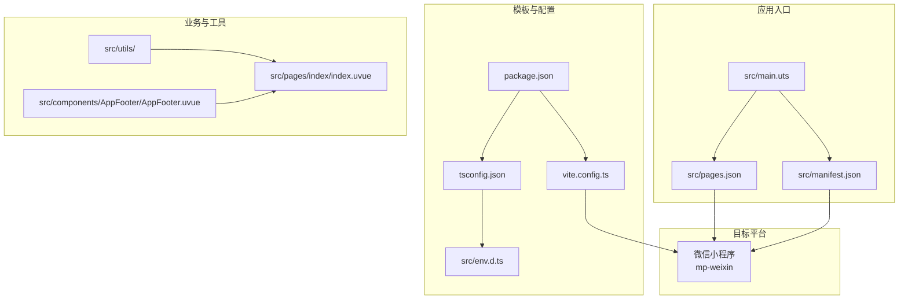
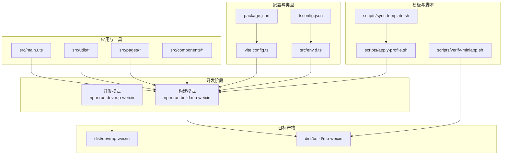
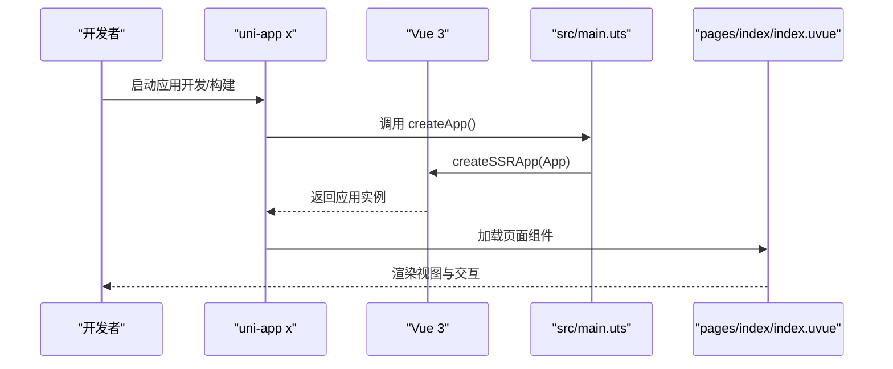
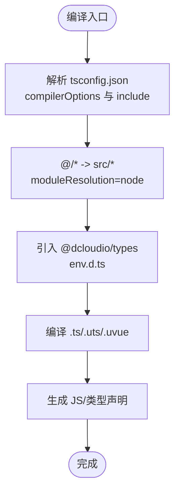
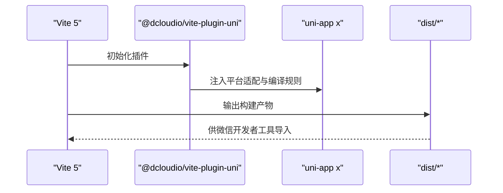
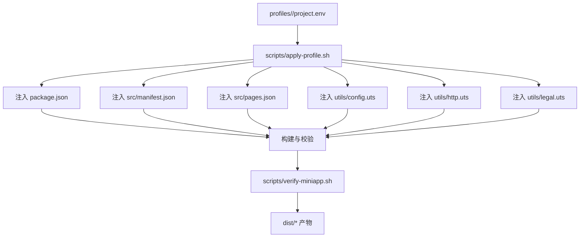
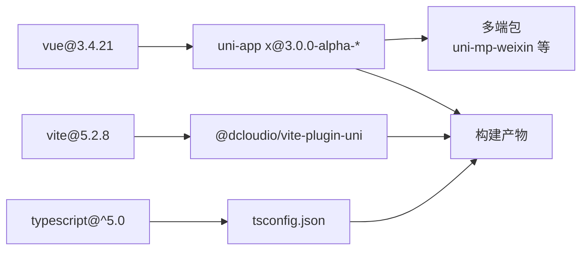

# 技术栈

<cite>
**本文引用的文件**
- [package.json](file://package.json)
- [vite.config.ts](file://vite.config.ts)
- [tsconfig.json](file://tsconfig.json)
- [src/main.uts](file://src/main.uts)
- [src/env.d.ts](file://src/env.d.ts)
- [src/utils/api.uts](file://src/utils/api.uts)
- [src/utils/http.uts](file://src/utils/http.uts)
- [src/utils/config.uts](file://src/utils/config.uts)
- [src/utils/auth.uts](file://src/utils/auth.uts)
- [src/utils/legal.uts](file://src/utils/legal.uts)
- [src/manifest.json](file://src/manifest.json)
- [src/pages.json](file://src/pages.json)
- [project.config.json](file://project.config.json)
- [README.md](file://README.md)
- [src/pages/index/index.uvue](file://src/pages/index/index.uvue)
- [src/components/AppFooter/AppFooter.uvue](file://src/components/AppFooter/AppFooter.uvue)
</cite>

## 目录
1. [引言](#引言)
2. [项目结构](#项目结构)
3. [核心组件](#核心组件)
4. [架构总览](#架构总览)
5. [详细组件分析](#详细组件分析)
6. [依赖关系分析](#依赖关系分析)
7. [性能考虑](#性能考虑)
8. [故障排查指南](#故障排查指南)
9. [结论](#结论)
10. [附录](#附录)

## 引言
本技术栈文档面向蓝莓小程序项目，系统梳理并解释项目采用的核心技术选型与协同机制，重点包括：
- 跨平台框架：uni-app x 3.0.0-alpha（基于 Vue 3）
- 前端开发体验：Vue 3.4.21
- 类型安全：TypeScript 5.0+
- 构建工具：Vite 5.2.8 + @dcloudio/vite-plugin-uni
- 移动端语言：UTS（Unified Typescript/TypeScript）在移动端开发中的优势与应用场景
- 技术组件间的协同：TypeScript 编译配置、模块解析策略、构建优化方案
- 业务价值与技术考量：为团队技术决策提供参考

## 项目结构
项目采用“模板 + Profile”的多项目复用架构，核心源码集中在 src/，通过 profiles/<project-key>/project.env 注入各小程序项目的差异化配置，实现“一套模板，多端复用”。



图表来源
- [package.json:1-48](file://package.json#L1-L48)
- [vite.config.ts:1-9](file://vite.config.ts#L1-L9)
- [tsconfig.json:1-33](file://tsconfig.json#L1-L33)
- [src/main.uts:1-9](file://src/main.uts#L1-L9)
- [src/manifest.json:1-73](file://src/manifest.json#L1-L73)
- [src/pages.json:1-90](file://src/pages.json#L1-L90)
- [src/pages/index/index.uvue:1-200](file://src/pages/index/index.uvue#L1-L200)
- [src/components/AppFooter/AppFooter.uvue:1-25](file://src/components/AppFooter/AppFooter.uvue#L1-L25)

章节来源
- [README.md:85-130](file://README.md#L85-L130)
- [package.json:1-48](file://package.json#L1-L48)
- [vite.config.ts:1-9](file://vite.config.ts#L1-L9)
- [tsconfig.json:1-33](file://tsconfig.json#L1-L33)
- [src/main.uts:1-9](file://src/main.uts#L1-L9)
- [src/manifest.json:1-73](file://src/manifest.json#L1-L73)
- [src/pages.json:1-90](file://src/pages.json#L1-L90)

## 核心组件
- uni-app x 3.0.0-alpha：统一跨平台框架，支持多端编译与运行，包含 Vue 3 生态能力与原生小程序 API 桥接。
- Vue 3.4.21：提供响应式与组合式 API，配合 .uvue 单文件组件与 UTS 语言，提升开发效率与类型安全。
- TypeScript 5.0+：通过 tsconfig.json 提供严格类型检查与模块解析策略，结合 @dcloudio/types 提供小程序类型定义。
- Vite 5.2.8：现代化构建工具，配合 @dcloudio/vite-plugin-uni 实现快速冷启动、热更新与按需打包。
- UTS（Unified Typescript/TypeScript）：在 uni-app x 中用于编写可在多端运行的 TypeScript/JavaScript 逻辑，具备更好的性能与更贴近原生的调用体验。

章节来源
- [README.md:43-55](file://README.md#L43-L55)
- [package.json:15-46](file://package.json#L15-L46)
- [tsconfig.json:1-33](file://tsconfig.json#L1-L33)
- [vite.config.ts:1-9](file://vite.config.ts#L1-L9)

## 架构总览
整体架构围绕“模板 + Profile”展开，通过脚本自动化完成模板同步、配置注入、构建与产物校验，最终输出微信小程序产物。



图表来源
- [README.md:242-285](file://README.md#L242-L285)
- [README.md:290-341](file://README.md#L290-L341)
- [package.json:4-13](file://package.json#L4-L13)
- [vite.config.ts:1-9](file://vite.config.ts#L1-L9)
- [tsconfig.json:1-33](file://tsconfig.json#L1-L33)
- [src/env.d.ts:1-2](file://src/env.d.ts#L1-L2)
- [src/main.uts:1-9](file://src/main.uts#L1-L9)

## 详细组件分析

### uni-app x 与 Vue 3 集成
- 应用入口通过 src/main.uts 使用 createSSRApp 创建 Vue 应用实例，统一导出 createApp，供 uni-app x 在不同平台初始化。
- 页面与组件采用 .uvue 单文件格式，既可承载模板与脚本，又可通过 lang="uts" 在组件脚本中使用 UTS 语法，实现高性能逻辑。
- 全局清单与页面路由由 src/manifest.json 与 src/pages.json 管理，目标平台为微信小程序（mp-weixin）。



图表来源
- [src/main.uts:1-9](file://src/main.uts#L1-L9)
- [src/pages/index/index.uvue:1-200](file://src/pages/index/index.uvue#L1-L200)
- [src/manifest.json:1-73](file://src/manifest.json#L1-L73)
- [src/pages.json:1-90](file://src/pages.json#L1-L90)

章节来源
- [src/main.uts:1-9](file://src/main.uts#L1-L9)
- [src/pages/index/index.uvue:1-200](file://src/pages/index/index.uvue#L1-L200)
- [src/manifest.json:1-73](file://src/manifest.json#L1-L73)
- [src/pages.json:1-90](file://src/pages.json#L1-L90)

### TypeScript 编译与模块解析
- 编译选项：target/module 设为 esnext，moduleResolution 为 node，开启 skipLibCheck、esModuleInterop、allowSyntheticDefaultImports 等，提升兼容性与构建速度。
- 路径别名：通过 baseUrl 与 paths 将 @/* 映射到 src/*，简化导入路径。
- 类型声明：env.d.ts 引入 @dcloudio/types，提供小程序全局类型与 uni API 类型。
- 包含范围：tsconfig.json include 涵盖 src/**/*.ts、src/**/*.d.ts、src/**/*.uts、src/**/*.uvue，确保 UTS 与 .uvue 文件参与类型检查。



图表来源
- [tsconfig.json:1-33](file://tsconfig.json#L1-L33)
- [src/env.d.ts:1-2](file://src/env.d.ts#L1-L2)

章节来源
- [tsconfig.json:1-33](file://tsconfig.json#L1-L33)
- [src/env.d.ts:1-2](file://src/env.d.ts#L1-L2)

### Vite 构建与插件
- 插件：vite.config.ts 仅引入 @dcloudio/vite-plugin-uni，该插件负责将 uni-app x 的多端能力与 Vite 构建链路打通，提供快速冷启动与热更新。
- 产物：开发模式输出至 dist/dev/mp-weixin，生产模式输出至 dist/build/mp-weixin，便于微信开发者工具导入与上传。



图表来源
- [vite.config.ts:1-9](file://vite.config.ts#L1-L9)
- [README.md:248-249](file://README.md#L248-L249)

章节来源
- [vite.config.ts:1-9](file://vite.config.ts#L1-L9)
- [README.md:248-249](file://README.md#L248-L249)

### UTS 语言的优势与应用
- 优势：在 uni-app x 中，UTS 提供更接近原生的执行性能与更丰富的 API 能力，适合在移动端处理网络请求、鉴权、工具函数等逻辑。
- 应用场景：
  - 网络层：src/utils/http.uts 统一封装请求、头部注入、401 自动登出。
  - 鉴权层：src/utils/auth.uts 管理 token 与用户信息存储、合并写入、登录状态判断。
  - 接口层：src/utils/api.uts 聚合业务接口，提供类型约束与调用封装。
  - 合规页面：src/utils/legal.uts 提供协议名称与跳转方法。
  - 组件脚本：src/components/AppFooter/AppFooter.uvue 使用 lang="uts" 实现高性能组件逻辑。

```mermaid
classDiagram
class HttpUtils {
+request(opts) Promise
+get(url, params, options) Promise
+post(url, data, options) Promise
}
class AuthUtils {
+getToken() string
+setToken(token) void
+getUserInfo() UserInfo
+mergeUserInfo(partial) void
+isLoggedIn() boolean
+loginSuccess(token, userInfo) void
+logout() void
}
class ApiUtils {
+getImage(method, params) Promise
+getCategories(shopId) Promise
+getAlbumList(params) Promise
+wxLogin(params) Promise
+wxBindPhone(code) Promise
+toggleLike(albumId) Promise
+toggleFavorite(albumId) Promise
+searchAlbums(keyword, page, size) Promise
+getShops() Promise
+getPageConfig() Promise
}
class LegalUtils {
+MINI_APP_NAME
+USER_AGREEMENT_NAME
+PRIVACY_POLICY_NAME
+openUserAgreement() void
+openPrivacyPolicy() void
}
HttpUtils --> AuthUtils : "使用 token/用户信息"
ApiUtils --> HttpUtils : "依赖请求封装"
ApiUtils --> AuthUtils : "依赖登录态"
PageIndex["pages/index/index.uvue"] --> ApiUtils : "调用接口"
PageIndex --> AuthUtils : "登录/鉴权"
FooterUvue["components/AppFooter/AppFooter.uvue"] --> LegalUtils : "协议名称"
```

图表来源
- [src/utils/http.uts:1-82](file://src/utils/http.uts#L1-L82)
- [src/utils/auth.uts:1-149](file://src/utils/auth.uts#L1-L149)
- [src/utils/api.uts:1-312](file://src/utils/api.uts#L1-L312)
- [src/utils/legal.uts:1-16](file://src/utils/legal.uts#L1-L16)
- [src/pages/index/index.uvue:1-200](file://src/pages/index/index.uvue#L1-L200)
- [src/components/AppFooter/AppFooter.uvue:14-24](file://src/components/AppFooter/AppFooter.uvue#L14-L24)

章节来源
- [src/utils/http.uts:1-82](file://src/utils/http.uts#L1-L82)
- [src/utils/auth.uts:1-149](file://src/utils/auth.uts#L1-L149)
- [src/utils/api.uts:1-312](file://src/utils/api.uts#L1-L312)
- [src/utils/legal.uts:1-16](file://src/utils/legal.uts#L1-L16)
- [src/pages/index/index.uvue:1-200](file://src/pages/index/index.uvue#L1-L200)
- [src/components/AppFooter/AppFooter.uvue:14-24](file://src/components/AppFooter/AppFooter.uvue#L14-L24)

### 配置与环境注入（Profile 机制）
- Profile：通过 profiles/<project-key>/project.env 注入项目私有配置（如 AppID、品牌、API 域名、联系方式、协议名称等），避免污染模板源码。
- 应用范围：package.json、manifest.json、pages.json、utils/config.uts、utils/http.uts、utils/legal.uts 等均通过脚本进行文本替换与注入。
- 校验：scripts/verify-miniapp.sh 校验 AppID 一致性、导航栏标题、协议页面存在性、X-App-Code 请求头、残留字符串等。



图表来源
- [README.md:169-240](file://README.md#L169-L240)
- [README.md:242-285](file://README.md#L242-L285)

章节来源
- [README.md:169-240](file://README.md#L169-L240)
- [README.md:242-285](file://README.md#L242-L285)

## 依赖关系分析
- 依赖层次：
  - 运行时依赖：@dcloudio/uni-app（含多端包）、vue、vue-i18n
  - 开发依赖：typescript、vite、@dcloudio/vite-plugin-uni、@dcloudio/types 等
- 版本匹配：package.json 中 uni-app x 与各端包版本保持一致，确保多端兼容性与稳定性。
- 类型与构建：tsconfig.json 与 @dcloudio/types 协同，vite.config.ts 与 @dcloudio/vite-plugin-uni 协同，形成完整的类型检查与构建链路。



图表来源
- [package.json:15-46](file://package.json#L15-L46)
- [tsconfig.json:1-33](file://tsconfig.json#L1-L33)
- [vite.config.ts:1-9](file://vite.config.ts#L1-L9)

章节来源
- [package.json:15-46](file://package.json#L15-L46)
- [tsconfig.json:1-33](file://tsconfig.json#L1-L33)
- [vite.config.ts:1-9](file://vite.config.ts#L1-L9)

## 性能考虑
- 构建性能：Vite 5 与 @dcloudio/vite-plugin-uni 提供快速冷启动与热更新，缩短开发等待时间。
- 模块解析：tsconfig.json 的 node 解析策略与路径别名减少模块查找成本，提升编译与运行效率。
- 运行时性能：UTS 语言在移动端具备更贴近原生的执行效率，适合高频调用的网络与鉴权逻辑。
- 产物体积：通过按需打包与压缩策略（微信开发者工具 setting 中 minified/postcss 等），控制最终产物体积。

## 故障排查指南
- AppID 不一致导致构建失效：微信开发者工具 AppID 继承有前置条件，模板通过 apply-profile 直接写入 project.config.json 与 src/manifest.json，并由 verify-miniapp.sh 校验一致性。
- 协议页面缺失：若目标仓库缺少 pages/policies/*，verify-miniapp.sh 校验失败，可通过 build-miniapp.sh --sync-template 同步模板协议页。
- Profile 未生效：确认 scripts/apply-profile.sh 已执行，且目标仓库的 package.json、manifest.json、pages.json、utils/* 已被替换。
- 登录过期：http.uts 在收到 401 时自动清理 token 与用户信息并提示重新登录，检查后端返回状态与前端拦截逻辑。

章节来源
- [README.md:390-398](file://README.md#L390-L398)
- [src/utils/http.uts:50-61](file://src/utils/http.uts#L50-L61)

## 结论
本技术栈以 uni-app x + Vue 3 为基础，结合 TypeScript 与 Vite，辅以 UTS 语言在移动端的高性能实现，形成“模板 + Profile”的多项目复用体系。通过完善的类型检查、模块解析与构建优化，以及严格的产物校验流程，项目在开发效率、运行性能与可维护性之间取得良好平衡，为团队在多小程序场景下的快速孵化与持续交付提供了坚实基础。

## 附录
- 开发与构建命令：参见 package.json scripts 与 README 的“快速开始”与“构建与发布脚本”章节。
- 目标平台：微信小程序（mp-weixin），开发者工具最低 libVersion 要求为 3.10.1。
- 环境要求：Node.js ≥ 18，npm ≥ 9。

章节来源
- [README.md:58-82](file://README.md#L58-L82)
- [README.md:242-270](file://README.md#L242-L270)
- [project.config.json:1-35](file://project.config.json#L1-L35)