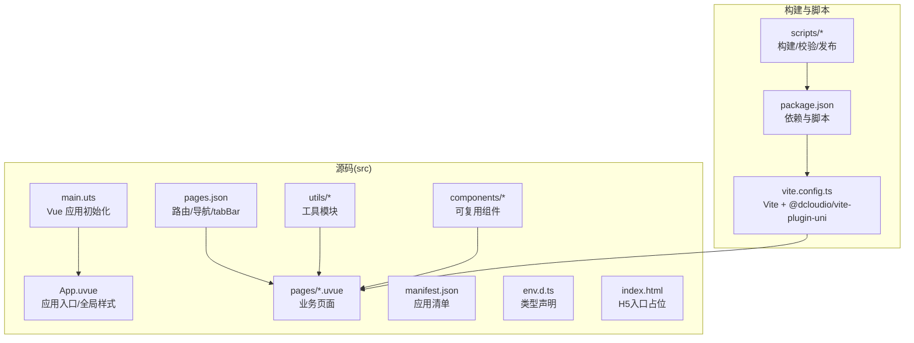
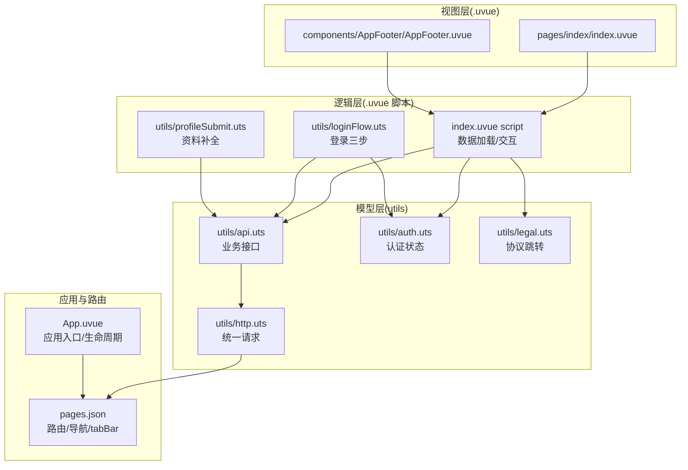
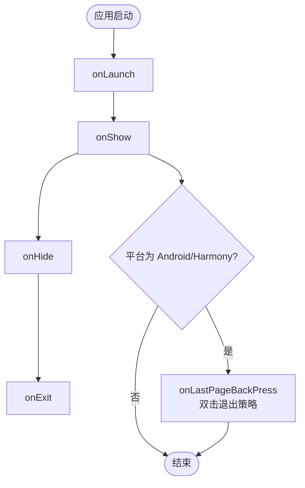
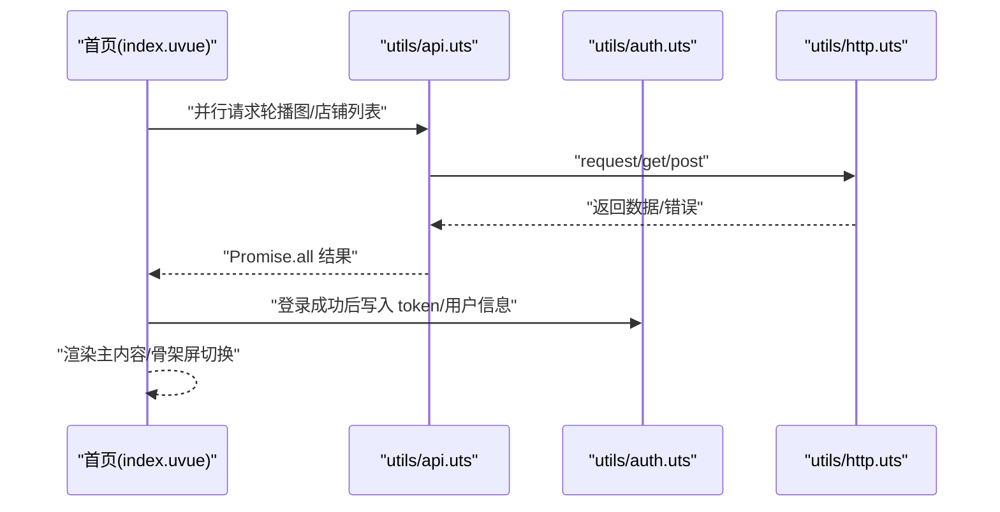
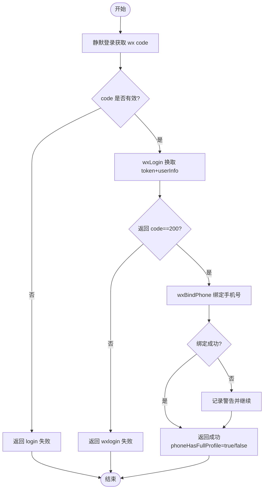
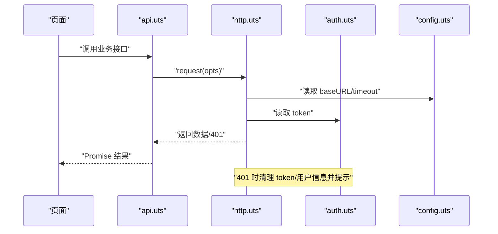
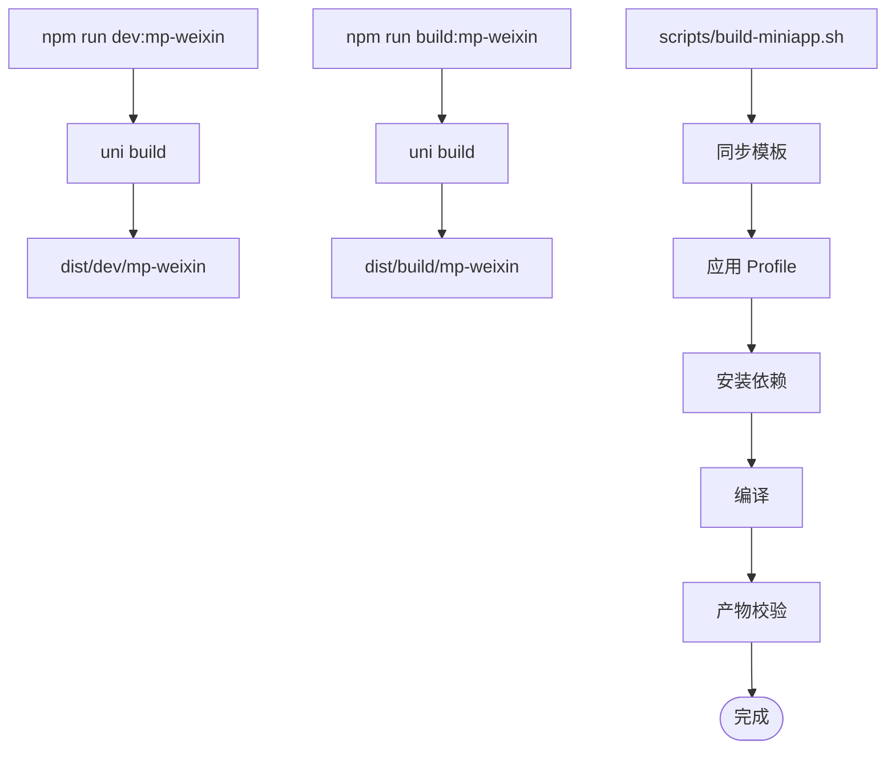
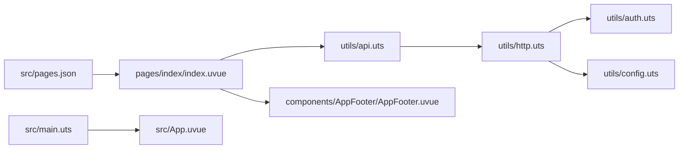

# 整体架构

<cite>
**本文引用的文件**
- [src/main.uts](file://src/main.uts)
- [src/App.uvue](file://src/App.uvue)
- [src/pages.json](file://src/pages.json)
- [src/pages/index/index.uvue](file://src/pages/index/index.uvue)
- [src/components/AppFooter/AppFooter.uvue](file://src/components/AppFooter/AppFooter.uvue)
- [src/utils/config.uts](file://src/utils/config.uts)
- [src/utils/http.uts](file://src/utils/http.uts)
- [src/utils/auth.uts](file://src/utils/auth.uts)
- [src/utils/api.uts](file://src/utils/api.uts)
- [src/utils/loginFlow.uts](file://src/utils/loginFlow.uts)
- [src/utils/profileSubmit.uts](file://src/utils/profileSubmit.uts)
- [src/utils/legal.uts](file://src/utils/legal.uts)
- [package.json](file://package.json)
- [vite.config.ts](file://vite.config.ts)
- [README.md](file://README.md)
- [scripts/build-miniapp.sh](file://scripts/build-miniapp.sh)
</cite>

## 目录
1. [引言](#引言)
2. [项目结构](#项目结构)
3. [核心组件](#核心组件)
4. [架构总览](#架构总览)
5. [详细组件分析](#详细组件分析)
6. [依赖关系分析](#依赖关系分析)
7. [性能考量](#性能考量)
8. [故障排查指南](#故障排查指南)
9. [结论](#结论)
10. [附录](#附录)

## 引言
本项目基于 uni-app x（Vue 3 + TypeScript/UTS）构建，采用 MVVM 架构模式，通过一套源码在多端运行（以微信小程序为主）。应用围绕“首页-价目表-我的”三大核心页面展开，辅以收藏、客片详情、WebView 外链、以及本地合规协议页。项目提供 Profile 多项目配置机制与自动化构建/校验/发布脚本，确保“模板化、可复用、可扩展”的工程化能力。

## 项目结构
- 源码集中在 src/ 目录，遵循“页面 pages + 组件 components + 工具 utils + 入口 main + 应用 App.uvue + 路由 pages.json + 清单 manifest.json + 构建 vite.config.ts + 类型 env.d.ts”的组织方式。
- scripts/ 提供模板同步、Profile 应用、构建、校验、发布等自动化脚本。
- profiles/ 存放多项目私有配置与静态资源，通过 apply-profile 流程注入到目标仓库。
- package.json 定义了 uni-app x 生态依赖与构建脚本，vite.config.ts 配置了 @dcloudio/vite-plugin-uni 插件。

图表来源
- [src/main.uts:1-9](file://src/main.uts#L1-L9)
- [src/App.uvue:1-335](file://src/App.uvue#L1-L335)
- [src/pages.json:1-90](file://src/pages.json#L1-L90)
- [vite.config.ts:1-9](file://vite.config.ts#L1-L9)
- [package.json:1-48](file://package.json#L1-L48)
- [scripts/build-miniapp.sh:1-106](file://scripts/build-miniapp.sh#L1-L106)

章节来源
- [README.md:85-130](file://README.md#L85-L130)
- [package.json:1-48](file://package.json#L1-L48)
- [vite.config.ts:1-9](file://vite.config.ts#L1-L9)

## 核心组件
- 应用入口与生命周期
  - main.uts 创建 SSR 应用实例，作为 uni-app x 的应用初始化入口。
  - App.uvue 定义应用级生命周期（launch/show/hide/exit）、平台特定事件（Android/鸿蒙返回键策略）、全局样式与骨架屏/登录弹窗样式。
- 页面与路由
  - pages.json 声明页面、全局导航样式、tabBar 与 uniIdRouter 空配置。
  - index 页面演示 MVVM 数据驱动：模板层 v-if/v-else 控制骨架屏与主内容切换；脚本层通过 Promise.all 并行加载数据；组件层复用 AppFooter。
- 工具模块
  - http.uts 统一请求封装，自动拼接 baseURL、注入 X-App-Code 与 Authorization、处理 401 自动登出与 loading。
  - auth.uts 管理 token 与用户信息的本地存储、合并写入与登录状态判断。
  - api.uts 汇聚业务接口（轮播、分类/列表、登录/绑定/资料、点赞/收藏、搜索、店铺、中台配置）。
  - loginFlow.uts 与 profileSubmit.uts 将登录三步与资料补全逻辑抽离为纯函数，便于页面按需调用。
  - legal.uts 提供协议名称与跳转方法，配合 pages/policies/* 合规页面。
  - config.uts 集中管理 API 基地址与超时。

章节来源
- [src/main.uts:1-9](file://src/main.uts#L1-L9)
- [src/App.uvue:6-39](file://src/App.uvue#L6-L39)
- [src/pages.json:1-90](file://src/pages.json#L1-L90)
- [src/pages/index/index.uvue:1-200](file://src/pages/index/index.uvue#L1-L200)
- [src/components/AppFooter/AppFooter.uvue:1-25](file://src/components/AppFooter/AppFooter.uvue#L1-L25)
- [src/utils/http.uts:1-82](file://src/utils/http.uts#L1-L82)
- [src/utils/auth.uts:1-149](file://src/utils/auth.uts#L1-L149)
- [src/utils/api.uts:1-312](file://src/utils/api.uts#L1-L312)
- [src/utils/loginFlow.uts:1-71](file://src/utils/loginFlow.uts#L1-L71)
- [src/utils/profileSubmit.uts:1-37](file://src/utils/profileSubmit.uts#L1-L37)
- [src/utils/legal.uts:1-16](file://src/utils/legal.uts#L1-L16)
- [src/utils/config.uts:1-12](file://src/utils/config.uts#L1-L12)

## 架构总览
本项目采用 uni-app x 的 MVVM 架构：
- 视图层（.uvue 模板）：基于 Vue 3 模板语法，结合小程序原生组件（如 swiper/image/button 等）实现页面布局与交互。
- 逻辑层（.uvue 脚本）：使用 UTS/TypeScript，通过响应式数据驱动视图更新，调用 utils 层接口与工具函数。
- 模型层（utils）：封装网络请求、认证状态、业务接口与登录流程，向上提供稳定 API。
- 路由与生命周期：pages.json 管理页面路由与导航，App.uvue 管理应用级生命周期与平台差异处理。
- 构建与多端：Vite + @dcloudio/vite-plugin-uni 将 .uvue 编译为多端可运行代码；package.json 定义多端 SDK 依赖。

图表来源
- [src/pages/index/index.uvue:1-200](file://src/pages/index/index.uvue#L1-L200)
- [src/components/AppFooter/AppFooter.uvue:1-25](file://src/components/AppFooter/AppFooter.uvue#L1-L25)
- [src/utils/api.uts:1-312](file://src/utils/api.uts#L1-L312)
- [src/utils/http.uts:1-82](file://src/utils/http.uts#L1-L82)
- [src/utils/auth.uts:1-149](file://src/utils/auth.uts#L1-L149)
- [src/utils/loginFlow.uts:1-71](file://src/utils/loginFlow.uts#L1-L71)
- [src/utils/profileSubmit.uts:1-37](file://src/utils/profileSubmit.uts#L1-L37)
- [src/utils/legal.uts:1-16](file://src/utils/legal.uts#L1-L16)
- [src/App.uvue:1-335](file://src/App.uvue#L1-L335)
- [src/pages.json:1-90](file://src/pages.json#L1-L90)

## 详细组件分析

### 应用入口与生命周期（App.uvue）
- 生命周期：onLaunch/onShow/onHide/onExit，提供应用启动、显示、隐藏、退出阶段的日志与后续扩展点。
- 平台差异：针对 APP-ANDROID/APP-HARMONY 定义最后一页返回按键策略，双击退出并提示。
- 全局样式：提供统一骨架屏动画、滚动条隐藏、登录弹窗与资料补全弹窗样式，保证跨页面一致性。

图表来源
- [src/App.uvue:6-39](file://src/App.uvue#L6-L39)

章节来源
- [src/App.uvue:1-335](file://src/App.uvue#L1-L335)

### 页面路由与导航（pages.json）
- 页面清单：包含首页、客片详情、价目表、目标客片、我的、收藏、WebView、用户协议与隐私政策等。
- 全局样式：导航栏文字颜色、背景色、标题文本与背景色统一配置。
- tabBar：首页、价目表、我的三栏，含图标与选中态图标及文案。
- uniIdRouter：预留配置项。

章节来源
- [src/pages.json:1-90](file://src/pages.json#L1-L90)

### 首页页面（index.uvue）
- 骨架屏：通过 v-if/v-else 在 loading 期间渲染骨架屏，提升感知性能。
- 数据加载：onLoad 使用 Promise.all 并行加载轮播图与店铺列表，失败容错不影响其他数据。
- 交互与弹窗：登录弹窗（协议勾选、一键登录）、头像昵称授权弹窗（chooseAvatar、输入昵称、提交）。
- 组件复用：底部版权由 AppFooter 组件提供，支持通过 Profile 注入。

图表来源
- [src/pages/index/index.uvue:139-157](file://src/pages/index/index.uvue#L139-L157)
- [src/utils/api.uts:1-312](file://src/utils/api.uts#L1-L312)
- [src/utils/http.uts:1-82](file://src/utils/http.uts#L1-L82)
- [src/utils/auth.uts:1-149](file://src/utils/auth.uts#L1-L149)

章节来源
- [src/pages/index/index.uvue:1-200](file://src/pages/index/index.uvue#L1-L200)
- [src/components/AppFooter/AppFooter.uvue:1-25](file://src/components/AppFooter/AppFooter.uvue#L1-L25)

### 登录流程（loginFlow.uts）
- 三步登录：静默登录获取 wx code → wxLogin 换取 token 与用户信息 → wxBindPhone 绑定手机号。
- 错误收敛：任一步骤异常均返回结构化错误信息，不抛出未捕获异常；手机号绑定失败不视为整体失败。
- 与页面解耦：页面负责 UX（弹窗、toast、关闭弹窗），逻辑由 runPhoneLogin 统一封装。

图表来源
- [src/utils/loginFlow.uts:27-70](file://src/utils/loginFlow.uts#L27-L70)

章节来源
- [src/utils/loginFlow.uts:1-71](file://src/utils/loginFlow.uts#L1-L71)

### 资料补全流程（profileSubmit.uts）
- 功能：将头像/昵称更新至后端并合并写入本地存储。
- 设计：不进行乐观写入，保持页面侧的乐观合并风格差异；异常收敛为返回值，不抛错。

章节来源
- [src/utils/profileSubmit.uts:1-37](file://src/utils/profileSubmit.uts#L1-L37)

### HTTP 请求与认证（http.uts / auth.uts / config.uts）
- http.uts
  - 统一请求入口 request/get/post，自动拼接 baseURL、注入 X-App-Code 与 Authorization（存在 token 时）。
  - 处理 401 未授权：清理 token 与用户信息、提示并拒绝请求。
  - 支持 showLoading 与超时控制。
- auth.uts
  - token 与用户信息的存取、合并写入（mergeUserInfo 避免字段被空值覆盖）。
  - 登录状态判断与登出清理。
- config.uts
  - 集中管理 baseURL 与超时，由 Profile 注入。

图表来源
- [src/utils/http.uts:20-73](file://src/utils/http.uts#L20-L73)
- [src/utils/auth.uts:21-52](file://src/utils/auth.uts#L21-L52)
- [src/utils/config.uts:7-11](file://src/utils/config.uts#L7-L11)

章节来源
- [src/utils/http.uts:1-82](file://src/utils/http.uts#L1-L82)
- [src/utils/auth.uts:1-149](file://src/utils/auth.uts#L1-L149)
- [src/utils/config.uts:1-12](file://src/utils/config.uts#L1-L12)

### 业务接口聚合（api.uts）
- 轮播图、客片分类/列表、详情、登录/绑定/资料、点赞/收藏、搜索、店铺、中台配置等接口。
- 统一通过 request 调用，隐藏底层细节，提供语义化方法名。

章节来源
- [src/utils/api.uts:1-312](file://src/utils/api.uts#L1-L312)

### 构建与多端运行（package.json / vite.config.ts / scripts）
- 依赖：@dcloudio/uni-app 系列 SDK、vue、vite、@dcloudio/vite-plugin-uni 等。
- 构建：npm run dev:mp-weixin / build:mp-weixin，输出 dist/dev/mp-weixin 与 dist/build/mp-weixin。
- 自动化：scripts/build-miniapp.sh 串联模板同步、应用 Profile、安装依赖、编译与产物校验。

图表来源
- [package.json:4-13](file://package.json#L4-L13)
- [vite.config.ts:1-9](file://vite.config.ts#L1-L9)
- [scripts/build-miniapp.sh:88-102](file://scripts/build-miniapp.sh#L88-L102)

章节来源
- [package.json:1-48](file://package.json#L1-L48)
- [vite.config.ts:1-9](file://vite.config.ts#L1-L9)
- [scripts/build-miniapp.sh:1-106](file://scripts/build-miniapp.sh#L1-L106)
- [README.md:242-286](file://README.md#L242-L286)

## 依赖关系分析
- 组件耦合
  - 页面与工具模块：页面通过 api.uts 调用业务接口，api.uts 依赖 http.uts；http.uts 依赖 auth.uts 与 config.uts。
  - 页面与组件：页面复用 AppFooter 组件，组件通过 props 接收文案，由 Profile 注入。
- 外部依赖
  - uni-app x 生态：@dcloudio/vite-plugin-uni 负责编译 .uvue；多端 SDK 提供平台 API。
  - Vue 3：响应式系统驱动 MVVM 数据流。

图表来源
- [src/pages/index/index.uvue:112-121](file://src/pages/index/index.uvue#L112-L121)
- [src/utils/api.uts:1-3](file://src/utils/api.uts#L1-L3)
- [src/utils/http.uts:1-2](file://src/utils/http.uts#L1-L2)
- [src/utils/auth.uts:1-149](file://src/utils/auth.uts#L1-L149)
- [src/utils/config.uts:1-12](file://src/utils/config.uts#L1-L12)
- [src/components/AppFooter/AppFooter.uvue:14-23](file://src/components/AppFooter/AppFooter.uvue#L14-L23)
- [src/main.uts:1-9](file://src/main.uts#L1-L9)
- [src/App.uvue:1-335](file://src/App.uvue#L1-L335)
- [src/pages.json:1-90](file://src/pages.json#L1-L90)

章节来源
- [src/pages/index/index.uvue:1-200](file://src/pages/index/index.uvue#L1-L200)
- [src/utils/api.uts:1-312](file://src/utils/api.uts#L1-L312)
- [src/utils/http.uts:1-82](file://src/utils/http.uts#L1-L82)
- [src/utils/auth.uts:1-149](file://src/utils/auth.uts#L1-L149)
- [src/utils/config.uts:1-12](file://src/utils/config.uts#L1-L12)
- [src/components/AppFooter/AppFooter.uvue:1-25](file://src/components/AppFooter/AppFooter.uvue#L1-L25)
- [src/main.uts:1-9](file://src/main.uts#L1-L9)
- [src/App.uvue:1-335](file://src/App.uvue#L1-L335)
- [src/pages.json:1-90](file://src/pages.json#L1-L90)

## 性能考量
- 骨架屏与并发加载：首页在数据加载阶段使用骨架屏，onLoad 并行请求轮播图与店铺列表，减少首屏等待时间。
- 请求优化：统一注入超时与 Loading 控制，避免重复请求与阻塞 UI。
- 存储与合并写入：mergeUserInfo 避免空值覆盖，降低无效写入与二次请求概率。
- 构建优化：Vite + @dcloudio/vite-plugin-uni 提升开发与生产构建效率；脚本化流水线减少人工干预与错误。

## 故障排查指南
- 登录失败
  - 检查 runPhoneLogin 的返回值与错误类型，确认静默登录、wxLogin、wxBindPhone 三个步骤的响应。
  - 若 wxBindPhone 失败，页面仍可进入资料补全流程。
- 401 未授权
  - http.uts 已自动清理 token 与用户信息并提示；检查后端返回状态与前端拦截逻辑。
- 构建产物校验失败
  - 使用 scripts/verify-miniapp.sh 校验 AppID、导航栏标题、协议页、X-App-Code 等关键项；必要时加上 --sync-template 同步模板页面。
- Profile 注入不生效
  - 确认 apply-profile.sh 已正确执行，且目标仓库的 src/manifest.json 与 project.config.json 中 AppID 已被覆盖。

章节来源
- [src/utils/loginFlow.uts:27-70](file://src/utils/loginFlow.uts#L27-L70)
- [src/utils/http.uts:50-72](file://src/utils/http.uts#L50-L72)
- [scripts/build-miniapp.sh:88-102](file://scripts/build-miniapp.sh#L88-L102)
- [README.md:277-284](file://README.md#L277-L284)

## 结论
本项目以 uni-app x 为基础，采用 MVVM 架构与 Vue 3 响应式系统，在微信小程序平台实现了一套高内聚、低耦合的源码体系。通过 utils 层的统一抽象、pages.json 的路由与导航管理、App.uvue 的生命周期与平台差异处理，以及 Profile 机制与自动化脚本，实现了“一套模板、多端复用”的工程化目标。架构在性能、可维护性与扩展性方面均有明确的设计取舍与实践路径。

## 附录
- 快速开始
  - 安装依赖后，执行 npm run dev:mp-weixin 或 npm run build:mp-weixin，使用微信开发者工具导入 dist/dev/mp-weixin 或 dist/build/mp-weixin。
- Profile 机制
  - 通过 profiles/<project-key>/project.env 管理项目私有配置，apply-profile 将其注入到目标仓库，避免污染模板源码。
- 合规与协议
  - 自动注入 pages/policies/*，并在 legal.uts 中提供协议名称与跳转方法，满足微信审核要求。

章节来源
- [README.md:58-82](file://README.md#L58-L82)
- [README.md:169-240](file://README.md#L169-L240)
- [README.md:344-384](file://README.md#L344-L384)
