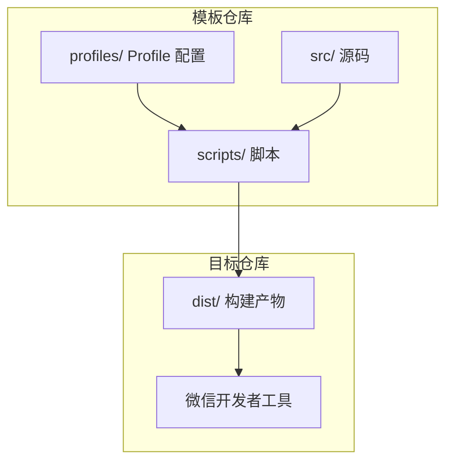
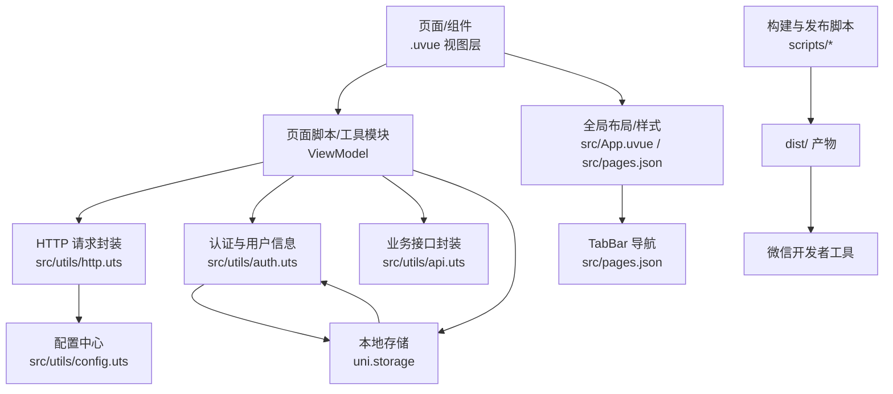
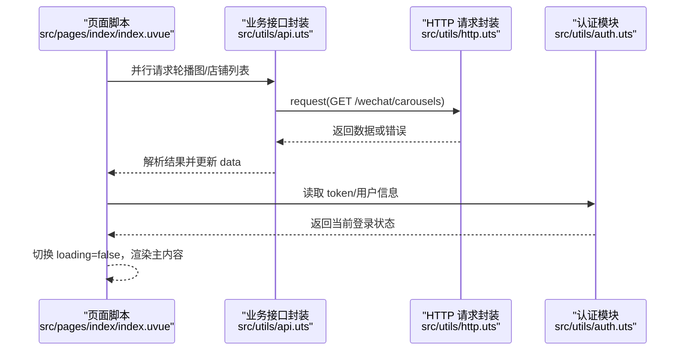
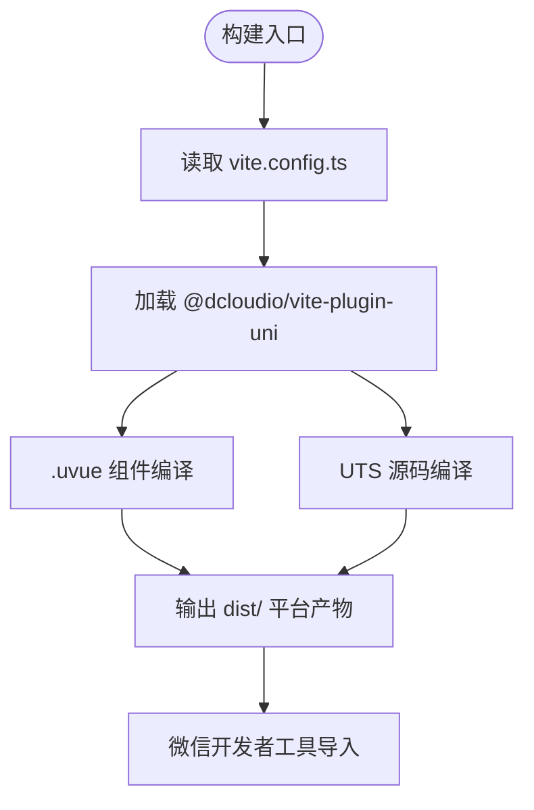
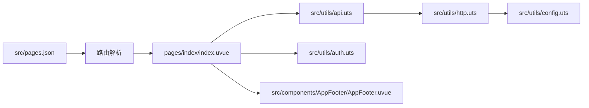
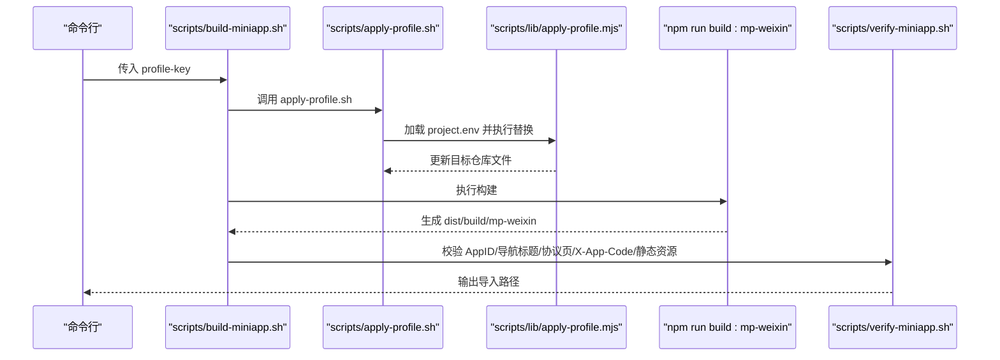
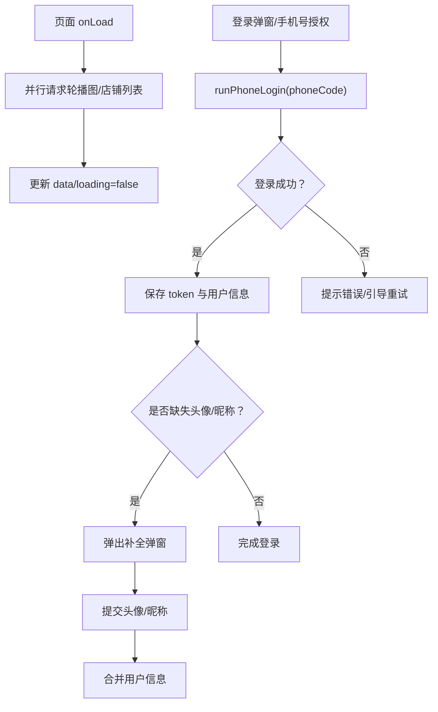
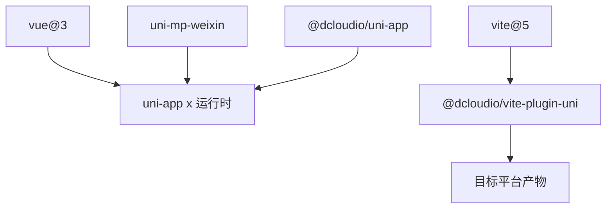

# 架构设计

<cite>
**本文引用的文件**
- [README.md](file://README.md)
- [package.json](file://package.json)
- [vite.config.ts](file://vite.config.ts)
- [src/main.uts](file://src/main.uts)
- [src/App.uvue](file://src/App.uvue)
- [src/pages.json](file://src/pages.json)
- [src/manifest.json](file://src/manifest.json)
- [profiles/blueberry/project.env](file://profiles/blueberry/project.env)
- [src/utils/config.uts](file://src/utils/config.uts)
- [src/utils/http.uts](file://src/utils/http.uts)
- [src/utils/auth.uts](file://src/utils/auth.uts)
- [src/utils/api.uts](file://src/utils/api.uts)
- [scripts/lib/apply-profile.mjs](file://scripts/lib/apply-profile.mjs)
- [scripts/build-miniapp.sh](file://scripts/build-miniapp.sh)
- [src/components/AppFooter/AppFooter.uvue](file://src/components/AppFooter/AppFooter.uvue)
- [src/pages/index/index.uvue](file://src/pages/index/index.uvue)
</cite>

## 目录
1. [引言](#引言)
2. [项目结构](#项目结构)
3. [核心组件](#核心组件)
4. [架构总览](#架构总览)
5. [详细组件分析](#详细组件分析)
6. [依赖分析](#依赖分析)
7. [性能考量](#性能考量)
8. [故障排查指南](#故障排查指南)
9. [结论](#结论)
10. [附录](#附录)

## 引言
本项目是基于 uni-app x（Vue 3 + TypeScript/UTS）的微信小程序模板，面向“同一产品矩阵下快速孵化多个相似小程序”的场景，提供统一的 MVVM 架构与跨平台能力。项目采用 uni-app x 作为运行时框架，结合 Vite 5 与 @dcloudio/vite-plugin-uni 实现高性能构建；通过 TypeScript/UTS 语言与类型系统提升可维护性；以配置驱动的 Profile 系统实现多项目定制与一键构建/校验/发布。

技术背景与权衡：
- uni-app x + Vue 3：在小程序生态中提供接近 Web 的开发体验，同时保持原生性能与平台特性。
- TypeScript/UTS：在保证类型安全的同时，兼容小程序运行时 API 与 uni-app 的 .uvue 组件格式。
- Vite 5：利用其插件体系与热更新能力，显著缩短开发与构建时间。
- Profile 驱动：将“品牌、AppID、导航标题、接口域名、请求头”等差异化配置集中管理，避免模板与目标仓库耦合。

## 项目结构
项目采用“模板 + Profile + 目标仓库”的三层结构：
- 模板层：src/ 下的页面、组件、工具模块与构建配置。
- Profile 层：profiles/<project-key>/project.env 与可选 static/，用于注入差异化配置。
- 目标仓库层：通过脚本将模板与 Profile 同步/应用到目标仓库，产出可部署的 dist 构建产物。

图表来源
- [README.md:85-130](file://README.md#L85-L130)
- [scripts/build-miniapp.sh:19-24](file://scripts/build-miniapp.sh#L19-L24)

章节来源
- [README.md:85-130](file://README.md#L85-L130)
- [package.json:14-14](file://package.json#L14-L14)

## 核心组件
- 应用入口与初始化
  - 应用入口：src/App.uvue，负责生命周期钩子与全局样式（骨架屏、登录弹窗样式等）。
  - 应用初始化：src/main.uts，创建 SSR App 并导出实例。
- 页面与路由
  - 页面清单：src/pages.json，定义页面路由、全局导航样式与 tabBar。
  - 应用清单：src/manifest.json，定义 uni-app 与 mp-weixin 平台配置。
- 工具模块（UTS）
  - 配置：src/utils/config.uts，集中管理 baseURL 与超时。
  - HTTP：src/utils/http.uts，统一封装请求、鉴权头、401 自动登出与加载态。
  - 认证：src/utils/auth.uts，管理 token 与用户信息的存储与合并策略。
  - 接口：src/utils/api.uts，封装业务接口（登录、收藏、点赞、搜索、店铺、中台配置等）。
- 组件
  - AppFooter：全局页脚版权文案注入点，由 Profile 一次性替换。
- Profile 应用
  - scripts/lib/apply-profile.mjs：将 Profile 字段映射到 package.json、project.config.json、src/manifest.json、src/pages.json、src/utils/config.uts、src/utils/http.uts、src/utils/legal.uts、src/components/AppFooter/AppFooter.uvue 等文件。

章节来源
- [src/App.uvue:1-335](file://src/App.uvue#L1-L335)
- [src/main.uts:1-9](file://src/main.uts#L1-L9)
- [src/pages.json:1-90](file://src/pages.json#L1-L90)
- [src/manifest.json:1-73](file://src/manifest.json#L1-L73)
- [src/utils/config.uts:1-12](file://src/utils/config.uts#L1-L12)
- [src/utils/http.uts:1-82](file://src/utils/http.uts#L1-L82)
- [src/utils/auth.uts:1-149](file://src/utils/auth.uts#L1-L149)
- [src/utils/api.uts:1-312](file://src/utils/api.uts#L1-L312)
- [src/components/AppFooter/AppFooter.uvue:1-25](file://src/components/AppFooter/AppFooter.uvue#L1-L25)
- [scripts/lib/apply-profile.mjs:1-190](file://scripts/lib/apply-profile.mjs#L1-L190)

## 架构总览
整体架构围绕 MVVM 模式展开：View（.uvue 页面/组件）通过响应式数据与事件绑定呈现 UI；ViewModel（页面 script 与工具模块）处理业务逻辑；Model（HTTP/Storage）提供数据与持久化。跨平台通过 uni-app x 抽象统一 API，构建阶段由 Vite + @dcloudio/vite-plugin-uni 输出目标平台产物。

图表来源
- [src/pages/index/index.uvue:111-310](file://src/pages/index/index.uvue#L111-L310)
- [src/utils/http.uts:20-73](file://src/utils/http.uts#L20-L73)
- [src/utils/auth.uts:21-148](file://src/utils/auth.uts#L21-L148)
- [src/utils/api.uts:1-312](file://src/utils/api.uts#L1-L312)
- [src/utils/config.uts:7-11](file://src/utils/config.uts#L7-L11)
- [src/App.uvue:6-39](file://src/App.uvue#L6-L39)
- [src/pages.json:56-87](file://src/pages.json#L56-L87)
- [scripts/build-miniapp.sh:97-102](file://scripts/build-miniapp.sh#L97-L102)

## 详细组件分析

### MVVM 与 Vue 3 响应式系统在小程序中的应用
- 数据驱动视图：页面通过 data/响应式属性与模板指令（如 v-if/v-else、v-for）渲染骨架屏与主内容，实现首屏体验与数据联动。
- 生命周期与事件：在 onLoad/onShow 等生命周期中发起并行请求，完成后切换 loading 状态，体现 MVVM 的 ViewModel 职责。
- 组件化：AppFooter 作为纯展示组件，接收来自 Profile 的默认文案，减少页面硬编码，提升复用性。

图表来源
- [src/pages/index/index.uvue:139-157](file://src/pages/index/index.uvue#L139-L157)
- [src/utils/api.uts:27-47](file://src/utils/api.uts#L27-L47)
- [src/utils/http.uts:20-73](file://src/utils/http.uts#L20-L73)
- [src/utils/auth.uts:21-148](file://src/utils/auth.erts#L21-L148)

章节来源
- [src/pages/index/index.uvue:111-310](file://src/pages/index/index.uvue#L111-L310)
- [src/App.uvue:6-39](file://src/App.uvue#L6-L39)

### 跨平台开发的设计原则与实现机制
- 统一抽象：通过 uni-app x 的 API（如 uni.request、uni.showToast、uni.navigateTo）屏蔽平台差异。
- 平台特定配置：mp-weixin 的 setting、usingComponents 等在 src/manifest.json 中集中管理。
- 构建平台：通过 Vite 插件 @dcloudio/vite-plugin-uni 将 .uvue 与 UTS 编译为目标平台代码。

图表来源
- [vite.config.ts:1-9](file://vite.config.ts#L1-L9)
- [package.json:41-41](file://package.json#L41-L41)

章节来源
- [src/manifest.json:11-20](file://src/manifest.json#L11-L20)
- [vite.config.ts:1-9](file://vite.config.ts#L1-L9)

### 模块化设计：页面路由系统、组件化架构、工具模块分离
- 页面路由系统：src/pages.json 统一管理页面路径、导航样式与 tabBar，支持自定义导航与标题。
- 组件化架构：AppFooter 作为全局 Footer 组件，通过 default props 接收版权文案，避免页面重复硬编码。
- 工具模块分离：config/http/auth/api 等职责清晰，便于复用与测试。

图表来源
- [src/pages.json:2-55](file://src/pages.json#L2-L55)
- [src/pages/index/index.uvue:111-122](file://src/pages/index/index.uvue#L111-L122)
- [src/utils/api.uts:1-312](file://src/utils/api.uts#L1-L312)
- [src/utils/http.uts:1-82](file://src/utils/http.uts#L1-L82)
- [src/utils/config.uts:1-12](file://src/utils/config.uts#L1-L12)
- [src/components/AppFooter/AppFooter.uvue:14-24](file://src/components/AppFooter/AppFooter.uvue#L14-L24)

章节来源
- [src/pages.json:56-87](file://src/pages.json#L56-L87)
- [src/components/AppFooter/AppFooter.uvue:14-24](file://src/components/AppFooter/AppFooter.uvue#L14-L24)

### 配置驱动的 Profile 系统与多项目定制
- Profile 字段映射：scripts/lib/apply-profile.mjs 将 PROJECT_KEY、PACKAGE_NAME、MP_WEIXIN_APPID、NAVIGATION_TITLE、API_BASE_URL、APP_CODE、MINI_APP_NAME、CONTACT_QR_SRC、CONTACT_PHONE_TEXT、COPYRIGHT_TEXT、PRICE_FALLBACK_TITLE 等注入到目标仓库。
- 注入范围：package.json、project.config.json、src/manifest.json、src/pages.json、src/utils/config.uts、src/utils/http.uts、src/utils/legal.uts、src/components/AppFooter/AppFooter.uvue、src/pages/index/index.uvue、src/pages/priceHomePage/index.uvue、src/pages/priceList/index.uvue 等。
- 一键构建：scripts/build-miniapp.sh 将“同步模板 + 应用 Profile + 安装依赖 + 构建 + 校验”串联为单命令流水线。

图表来源
- [scripts/build-miniapp.sh:19-24](file://scripts/build-miniapp.sh#L19-L24)
- [scripts/lib/apply-profile.mjs:73-190](file://scripts/lib/apply-profile.mjs#L73-L190)
- [README.md:242-285](file://README.md#L242-L285)

章节来源
- [scripts/lib/apply-profile.mjs:12-31](file://scripts/lib/apply-profile.mjs#L12-L31)
- [scripts/lib/apply-profile.mjs:137-190](file://scripts/lib/apply-profile.mjs#L137-L190)
- [scripts/build-miniapp.sh:75-102](file://scripts/build-miniapp.sh#L75-L102)
- [profiles/blueberry/project.env:1-23](file://profiles/blueberry/project.env#L1-L23)

### 数据流向分析
- 登录流程数据流：页面触发授权 -> 获取 phoneCode -> 调用 wxLogin -> 成功后保存 token 与用户信息 -> 若缺失头像/昵称则弹出补全弹窗 -> 提交头像/昵称 -> 更新本地用户信息 -> 完成登录。
- HTTP 请求数据流：页面调用 api.uts -> http.uts 组装 header（含 Authorization/X-App-Code）-> config.uts 提供 baseURL -> uni.request 发起请求 -> 401 自动清理 token 与用户信息 -> 统一错误提示。

图表来源
- [src/pages/index/index.uvue:139-157](file://src/pages/index/index.uvue#L139-L157)
- [src/pages/index/index.uvue:182-234](file://src/pages/index/index.uvue#L182-L234)
- [src/utils/auth.uts:135-148](file://src/utils/auth.uts#L135-L148)
- [src/utils/api.uts:129-190](file://src/utils/api.uts#L129-L190)

章节来源
- [src/utils/http.uts:20-73](file://src/utils/http.uts#L20-L73)
- [src/utils/auth.uts:21-148](file://src/utils/auth.uts#L21-L148)

## 依赖分析
- 运行时依赖
  - @dcloudio/uni-app、@dcloudio/uni-app-plus、@dcloudio/uni-mp-weixin 等：提供 uni-app x 运行时与多端支持。
  - vue：Vue 3 核心库。
- 构建依赖
  - @dcloudio/vite-plugin-uni：将 .uvue/UTS 编译为目标平台代码。
  - vite：构建工具。
  - @dcloudio/uni-uts-v1：UTS 类型支持。
- 开发依赖
  - @dcloudio/types、@vue/runtime-core、typescript 等：类型与开发工具链。

图表来源
- [package.json:15-46](file://package.json#L15-L46)

章节来源
- [package.json:15-46](file://package.json#L15-L46)

## 性能考量
- 骨架屏与懒加载：首页在数据加载期间显示骨架屏，降低感知卡顿；图片懒加载与分页加载控制首屏体积。
- 并行请求：首页在 onLoad 中并行请求轮播图与店铺列表，缩短首屏等待时间。
- 构建优化：Vite 5 与 @dcloudio/vite-plugin-uni 提升编译速度与热更新效率。
- 本地缓存：通过 uni.storage 缓存 token 与用户信息，减少重复登录成本。

章节来源
- [src/pages/index/index.uvue:139-157](file://src/pages/index/index.uvue#L139-L157)
- [src/App.uvue:58-154](file://src/App.uvue#L58-L154)
- [vite.config.ts:1-9](file://vite.config.ts#L1-L9)

## 故障排查指南
- 构建产物校验
  - AppID 不一致：确保 project.config.json 与 src/manifest.json 的 MP_WEIXIN_APPID 与 Profile 一致。
  - 导航标题不一致：确认 NAVIGATION_TITLE 与 src/pages.json 的 globalStyle.navigationBarTitleText 一致。
  - 协议页缺失：若目标仓库缺少 pages/policies/*，可通过 --sync-template 同步模板。
  - X-App-Code 未生效：检查 APP_CODE 是否为空，空值将导致移除该请求头。
  - 残留字符串：根据 RESIDUAL_SEARCH_REGEX 扫描构建产物，避免模板/其他项目字符串泄露。
- 常见问题
  - “目标仓库老代码缺少协议页面，verify 失败”：执行带 --sync-template 的构建脚本。
  - “Profile 文件不生效”：确认 apply-profile.mjs 的 required 字段均已在 project.env 中填写。

章节来源
- [README.md:277-284](file://README.md#L277-L284)
- [scripts/lib/apply-profile.mjs:12-31](file://scripts/lib/apply-profile.mjs#L12-L31)

## 结论
本项目以 uni-app x + Vue 3 为基础，结合 Vite 5 与 UTS，形成“模板 + Profile + 目标仓库”的可复用架构。通过 MVVM 模式与模块化设计，实现页面路由、组件化与工具模块的清晰分离；借助配置驱动的 Profile 系统，达成多项目定制与自动化构建/校验/发布的闭环。该架构在保证跨平台一致性的同时，兼顾了开发效率与可维护性，适合快速孵化多小程序产品矩阵。

## 附录
- 快速开始
  - 开发模式：npm run dev:mp-weixin
  - 生产构建：npm run build:mp-weixin
- Profile 使用
  - 创建：npm run profile:create
  - 应用：npm run profile:apply
  - 构建：npm run profile:build
  - 发布：npm run profile:release
- 页面清单与合规页面
  - 页面清单与合规页面（用户协议/隐私政策）在 README 的“页面清单”与“Profile 应用映射”中有详细说明。

章节来源
- [README.md:242-270](file://README.md#L242-L270)
- [README.md:136-151](file://README.md#L136-L151)