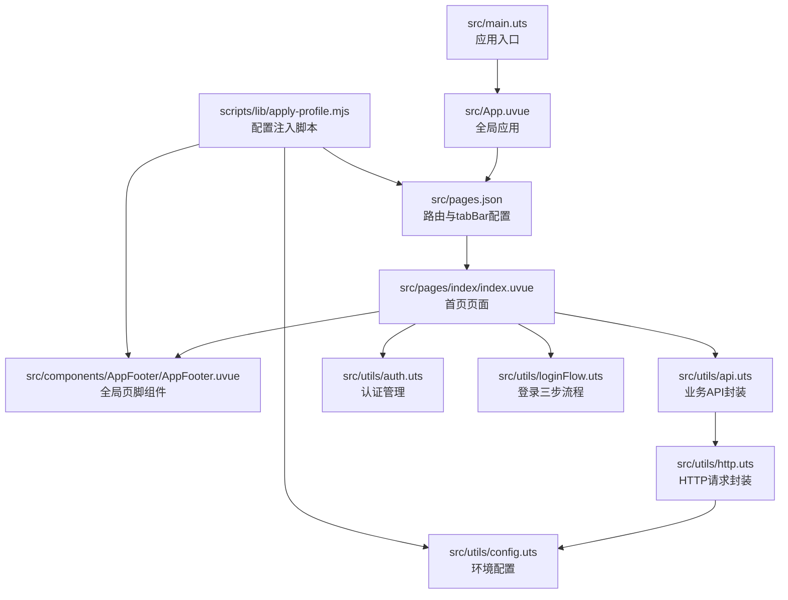
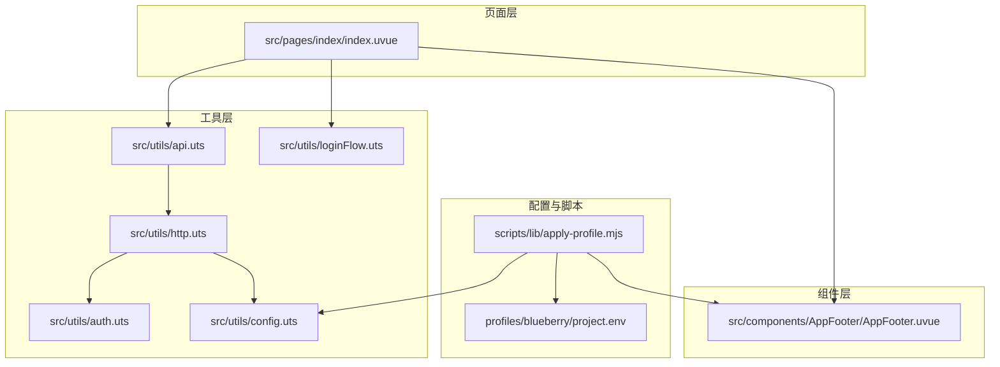
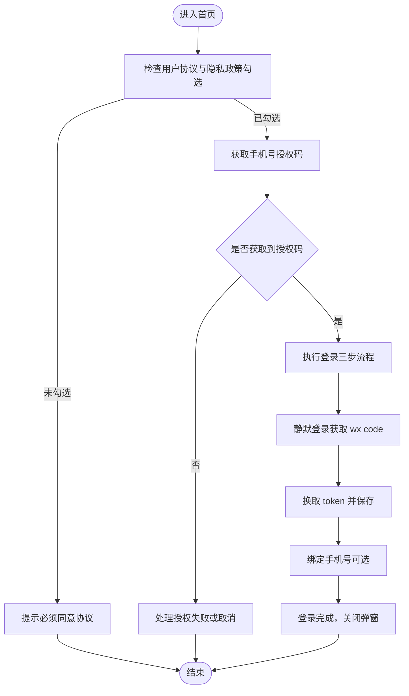
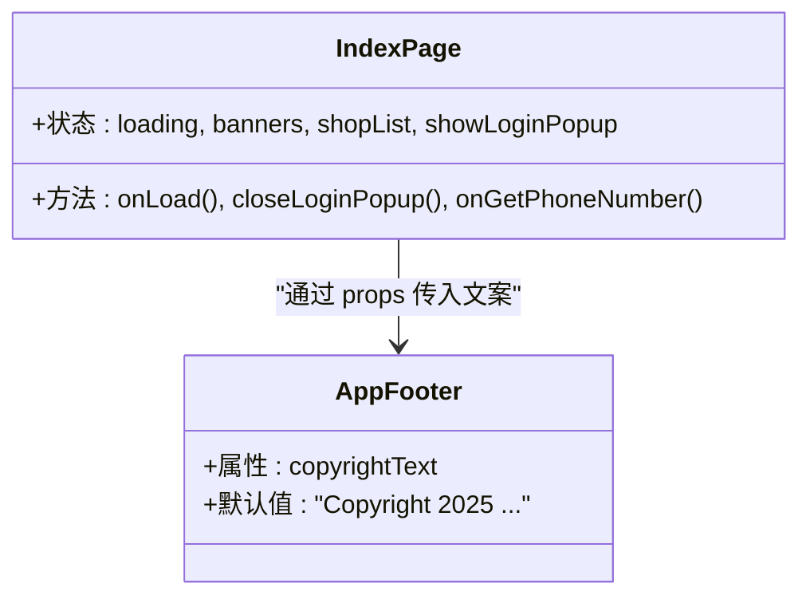
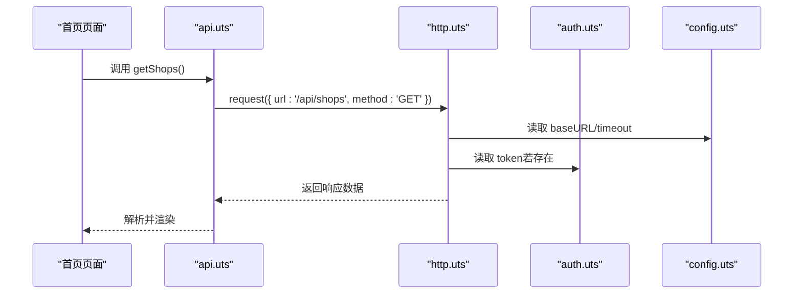
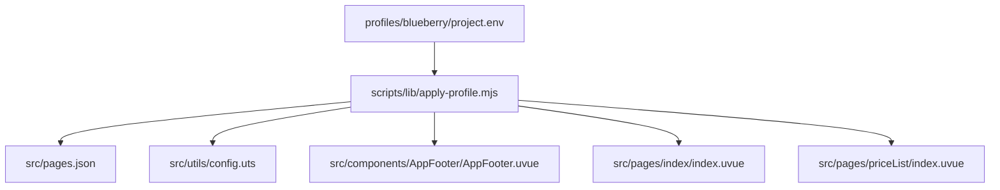
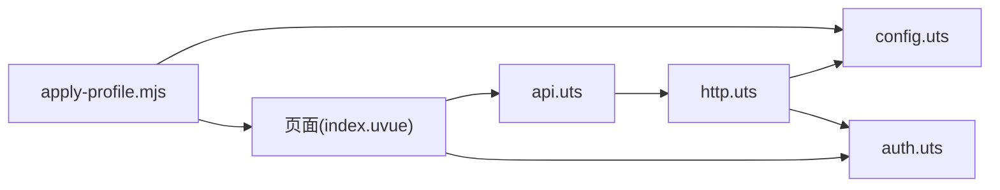

# 模块设计

<cite>
**本文引用的文件**
- [src/main.uts](file://src/main.uts)
- [src/App.uvue](file://src/App.uvue)
- [src/pages.json](file://src/pages.json)
- [src/pages/index/index.uvue](file://src/pages/index/index.uvue)
- [src/components/AppFooter/AppFooter.uvue](file://src/components/AppFooter/AppFooter.uvue)
- [src/utils/api.uts](file://src/utils/api.uts)
- [src/utils/http.uts](file://src/utils/http.uts)
- [src/utils/auth.uts](file://src/utils/auth.uts)
- [src/utils/config.uts](file://src/utils/config.uts)
- [src/utils/loginFlow.uts](file://src/utils/loginFlow.uts)
- [scripts/lib/apply-profile.mjs](file://scripts/lib/apply-profile.mjs)
- [profiles/blueberry/project.env](file://profiles/blueberry/project.env)
- [package.json](file://package.json)
- [vite.config.ts](file://vite.config.ts)
</cite>

## 目录
1. [引言](#引言)
2. [项目结构](#项目结构)
3. [核心组件](#核心组件)
4. [架构总览](#架构总览)
5. [详细组件分析](#详细组件分析)
6. [依赖分析](#依赖分析)
7. [性能考虑](#性能考虑)
8. [故障排查指南](#故障排查指南)
9. [结论](#结论)
10. [附录](#附录)

## 引言
本文件面向“蓝莓小程序”项目，系统性梳理其模块化架构设计与实现方式，重点覆盖以下方面：
- 页面路由系统：pages.json 配置、页面注册机制、导航策略
- 组件化开发：可复用组件设计规范、组件间通信机制、状态管理模式
- 工具模块分离：API 封装、HTTP 请求、认证管理等职责划分
- 配置管理：环境变量、主题配置、功能开关等
- 模块间依赖关系与交互流程

## 项目结构
项目采用基于功能域的组织方式，结合 uni-app 生态与 UTS/Vue 单文件组件（uvue）进行开发。核心目录与职责如下：
- src/main.uts：应用入口，创建 SSR 应用实例
- src/App.uvue：全局应用生命周期与通用样式
- src/pages.json：页面路由与 tabBar 配置
- src/pages/*：页面级单文件组件（uvue）
- src/components/*：可复用组件（如 AppFooter）
- src/utils/*：工具模块（API、HTTP、认证、配置、登录流程等）
- scripts/*：构建与配置注入脚本（按 profile 注入环境变量）
- profiles/*：不同业务线的配置文件（如 blueberry）

图表来源
- [src/main.uts:1-9](file://src/main.uts#L1-L9)
- [src/App.uvue:1-335](file://src/App.uvue#L1-L335)
- [src/pages.json:1-90](file://src/pages.json#L1-L90)
- [src/pages/index/index.uvue:1-200](file://src/pages/index/index.uvue#L1-L200)
- [src/components/AppFooter/AppFooter.uvue:1-25](file://src/components/AppFooter/AppFooter.uvue#L1-L25)
- [src/utils/api.uts:1-312](file://src/utils/api.uts#L1-L312)
- [src/utils/http.uts:1-82](file://src/utils/http.uts#L1-L82)
- [src/utils/config.uts:1-12](file://src/utils/config.uts#L1-L12)
- [src/utils/auth.uts:1-149](file://src/utils/auth.uts#L1-L149)
- [src/utils/loginFlow.uts:1-71](file://src/utils/loginFlow.uts#L1-L71)
- [scripts/lib/apply-profile.mjs:1-190](file://scripts/lib/apply-profile.mjs#L1-L190)

章节来源
- [src/main.uts:1-9](file://src/main.uts#L1-L9)
- [src/App.uvue:1-335](file://src/App.uvue#L1-L335)
- [src/pages.json:1-90](file://src/pages.json#L1-L90)
- [package.json:1-48](file://package.json#L1-L48)
- [vite.config.ts:1-9](file://vite.config.ts#L1-L9)

## 核心组件
- 应用入口与生命周期
  - 应用入口通过创建 SSR 应用实例导出应用对象，供运行时使用
  - 全局应用包含启动、显示、隐藏、返回键策略等生命周期钩子
- 页面路由与导航
  - pages.json 统一声明页面路径、页面样式（如自定义导航栏、底部触底距离）、全局样式与 tabBar
  - 通过 tabBar 配置实现底部导航切换
- 可复用组件
  - AppFooter 提供统一版权文案注入点，集中维护避免多处硬编码
- 工具模块
  - API 封装：对后端接口进行语义化封装，统一返回类型与错误处理
  - HTTP 请求：统一封装请求方法、超时、鉴权头、401 处理
  - 认证管理：token 与用户信息的存储、合并写入、登录状态判断
  - 登录流程：将登录三步（静默登录、换取 token、绑定手机）抽象为独立模块
  - 配置管理：环境基地址与超时时间

章节来源
- [src/main.uts:1-9](file://src/main.uts#L1-L9)
- [src/App.uvue:6-39](file://src/App.uvue#L6-L39)
- [src/pages.json:1-90](file://src/pages.json#L1-L90)
- [src/components/AppFooter/AppFooter.uvue:1-25](file://src/components/AppFooter/AppFooter.uvue#L1-L25)
- [src/utils/api.uts:1-312](file://src/utils/api.uts#L1-L312)
- [src/utils/http.uts:1-82](file://src/utils/http.uts#L1-L82)
- [src/utils/auth.uts:1-149](file://src/utils/auth.uts#L1-L149)
- [src/utils/loginFlow.uts:1-71](file://src/utils/loginFlow.uts#L1-L71)
- [src/utils/config.uts:1-12](file://src/utils/config.uts#L1-L12)

## 架构总览
下图展示从页面到工具模块的典型交互链路，以及配置注入脚本如何影响运行时行为。

图表来源
- [src/pages/index/index.uvue:1-200](file://src/pages/index/index.uvue#L1-L200)
- [src/components/AppFooter/AppFooter.uvue:1-25](file://src/components/AppFooter/AppFooter.uvue#L1-L25)
- [src/utils/api.uts:1-312](file://src/utils/api.uts#L1-L312)
- [src/utils/http.uts:1-82](file://src/utils/http.uts#L1-L82)
- [src/utils/auth.uts:1-149](file://src/utils/auth.uts#L1-L149)
- [src/utils/loginFlow.uts:1-71](file://src/utils/loginFlow.uts#L1-L71)
- [src/utils/config.uts:1-12](file://src/utils/config.uts#L1-L12)
- [scripts/lib/apply-profile.mjs:1-190](file://scripts/lib/apply-profile.mjs#L1-L190)
- [profiles/blueberry/project.env:1-23](file://profiles/blueberry/project.env#L1-L23)

## 详细组件分析

### 页面路由系统
- pages.json 配置要点
  - pages：声明页面路径与页面级样式（如自定义导航栏、底部触底距离）
  - globalStyle：全局导航栏文字颜色、背景色、标题文本、背景色
  - tabBar：底部导航列表、图标、选中态图标、文字
  - uniIdRouter：预留路由权限控制扩展点
- 页面注册机制
  - 通过 pages.json 声明式注册页面，框架自动完成页面映射与导航
- 导航策略
  - 使用 tabBar 实现底部导航切换
  - 页面内通过 uni.navigateTo/redirectTo/switchTab 等 API 进行页面跳转（页面中存在相关调用）

图表来源
- [src/pages/index/index.uvue:166-200](file://src/pages/index/index.uvue#L166-L200)
- [src/utils/loginFlow.uts:27-71](file://src/utils/loginFlow.uts#L27-L71)

章节来源
- [src/pages.json:1-90](file://src/pages.json#L1-L90)
- [src/pages/index/index.uvue:143-200](file://src/pages/index/index.uvue#L143-L200)

### 组件化开发模式
- 可复用组件设计规范
  - AppFooter：提供统一版权文案注入点，props 默认值集中维护，便于通过脚本批量替换
  - 在首页中直接复用该组件，保持视觉一致性与维护成本最小化
- 组件间通信机制
  - 页面与组件之间通过 props 传递数据（如 copyrightText）
  - 页面内部通过事件（如按钮点击）触发逻辑处理
- 状态管理模式
  - 页面内部使用 data 管理本地状态（如 loading、弹窗显隐、用户输入）
  - 认证状态与用户信息通过工具模块集中管理（auth.uts）

图表来源
- [src/components/AppFooter/AppFooter.uvue:14-24](file://src/components/AppFooter/AppFooter.uvue#L14-L24)
- [src/pages/index/index.uvue:108-142](file://src/pages/index/index.uvue#L108-L142)

章节来源
- [src/components/AppFooter/AppFooter.uvue:1-25](file://src/components/AppFooter/AppFooter.uvue#L1-L25)
- [src/pages/index/index.uvue:1-200](file://src/pages/index/index.uvue#L1-L200)

### 工具模块分离策略
- API 封装（api.uts）
  - 将后端接口按领域拆分：导航图、客片分类与列表、客片详情、登录、点赞/收藏、搜索、店铺、页面配置等
  - 统一返回类型与错误处理，屏蔽底层细节
- HTTP 请求（http.uts）
  - 统一拼接 baseURL、注入 Content-Type 与 X-App-Code、动态注入 Authorization
  - 统一处理 401 未授权（清空 token 与用户信息并提示）
  - 支持 get/post/通用 request 方法
- 认证管理（auth.uts）
  - token 与用户信息的存取、合并写入（避免覆盖已有字段）、登录状态判断、登出清理
- 登录流程（loginFlow.uts）
  - 将登录三步抽象为独立模块，便于页面按需调用并控制 UI 行为
- 配置管理（config.uts）
  - 提供 baseURL 与超时时间，配合脚本注入实现多环境切换

图表来源
- [src/pages/index/index.uvue:124-142](file://src/pages/index/index.uvue#L124-L142)
- [src/utils/api.uts:289-297](file://src/utils/api.uts#L289-L297)
- [src/utils/http.uts:20-73](file://src/utils/http.uts#L20-L73)
- [src/utils/auth.uts:21-52](file://src/utils/auth.uts#L21-L52)
- [src/utils/config.uts:7-11](file://src/utils/config.uts#L7-L11)

章节来源
- [src/utils/api.uts:1-312](file://src/utils/api.uts#L1-L312)
- [src/utils/http.uts:1-82](file://src/utils/http.uts#L1-L82)
- [src/utils/auth.uts:1-149](file://src/utils/auth.uts#L1-L149)
- [src/utils/loginFlow.uts:1-71](file://src/utils/loginFlow.uts#L1-L71)
- [src/utils/config.uts:1-12](file://src/utils/config.uts#L1-L12)

### 配置管理模块
- 环境变量与主题配置
  - 通过 profiles/blueberry/project.env 定义品牌名、导航标题、版权文案、联系方式、API 基地址、应用标识等
  - 通过 apply-profile.mjs 将上述变量注入到多个源文件（pages.json、config.uts、AppFooter、页面静态资源等）
- 功能开关
  - 通过脚本注入与条件编译（如 AppFooter 中的平台条件编译片段）实现差异化行为
- 多环境构建
  - 通过脚本批量替换，实现不同业务线（profile）的快速适配

图表来源
- [profiles/blueberry/project.env:1-23](file://profiles/blueberry/project.env#L1-L23)
- [scripts/lib/apply-profile.mjs:137-190](file://scripts/lib/apply-profile.mjs#L137-L190)
- [src/pages.json:93-135](file://src/pages.json#L93-L135)
- [src/utils/config.uts:7-11](file://src/utils/config.uts#L7-L11)
- [src/components/AppFooter/AppFooter.uvue:168-171](file://src/components/AppFooter/AppFooter.uvue#L168-L171)
- [src/pages/index/index.uvue:187-189](file://src/pages/index/index.uvue#L187-L189)

章节来源
- [profiles/blueberry/project.env:1-23](file://profiles/blueberry/project.env#L1-L23)
- [scripts/lib/apply-profile.mjs:1-190](file://scripts/lib/apply-profile.mjs#L1-L190)
- [src/utils/config.uts:1-12](file://src/utils/config.uts#L1-L12)

## 依赖分析
- 模块耦合与内聚
  - 页面与工具模块通过明确的 API 边界解耦，工具模块内部职责单一（HTTP、API、认证、配置）
  - 组件与页面通过 props/事件通信，降低耦合度
- 直接与间接依赖
  - 页面依赖 API 封装；API 封装依赖 HTTP；HTTP 依赖配置与认证模块
  - 脚本依赖环境变量，间接影响运行时配置
- 外部依赖与集成点
  - 依赖 uni-app 生态（uni.request、uni.login、uni.showToast 等）
  - 依赖 Vite 插件（@dcloudio/vite-plugin-uni）进行构建

图表来源
- [src/pages/index/index.uvue:96-107](file://src/pages/index/index.uvue#L96-L107)
- [src/utils/api.uts:1-3](file://src/utils/api.uts#L1-L3)
- [src/utils/http.uts:1-2](file://src/utils/http.uts#L1-L2)
- [src/utils/config.uts:1-5](file://src/utils/config.uts#L1-L5)
- [src/utils/auth.uts:1-4](file://src/utils/auth.uts#L1-L4)
- [scripts/lib/apply-profile.mjs:137-141](file://scripts/lib/apply-profile.mjs#L137-L141)

章节来源
- [src/pages/index/index.uvue:1-200](file://src/pages/index/index.uvue#L1-L200)
- [src/utils/api.uts:1-312](file://src/utils/api.uts#L1-L312)
- [src/utils/http.uts:1-82](file://src/utils/http.uts#L1-L82)
- [src/utils/auth.uts:1-149](file://src/utils/auth.uts#L1-L149)
- [src/utils/config.uts:1-12](file://src/utils/config.uts#L1-L12)
- [scripts/lib/apply-profile.mjs:1-190](file://scripts/lib/apply-profile.mjs#L1-L190)

## 性能考虑
- 并发请求
  - 首页在 onLoad 中并行加载轮播图与店铺列表，减少首屏等待时间
- 骨架屏与懒加载
  - 首页使用骨架屏占位，提升感知性能
- 请求缓存与去抖
  - 建议在业务层增加轻量缓存与去抖策略，避免重复请求
- 图片与资源优化
  - 使用合适的图片格式与尺寸，结合懒加载策略

章节来源
- [src/pages/index/index.uvue:124-142](file://src/pages/index/index.uvue#L124-L142)
- [src/App.uvue:58-154](file://src/App.uvue#L58-L154)

## 故障排查指南
- 登录流程异常
  - 检查静默登录是否成功获取 wx code
  - 核对换取 token 的接口返回与本地存储
  - 绑定手机号失败不影响登录成功，但可能导致用户资料不完整
- 401 未授权
  - HTTP 层检测到 401 自动清理 token 与用户信息并提示
  - 建议在页面层捕获并引导重新登录
- 配置注入问题
  - 确认环境变量齐全且 apply-profile.mjs 能正确匹配目标文件中的占位符
  - 注意 pages.json 中的路由块插入位置与格式

章节来源
- [src/utils/loginFlow.uts:27-71](file://src/utils/loginFlow.uts#L27-L71)
- [src/utils/http.uts:50-61](file://src/utils/http.uts#L50-L61)
- [scripts/lib/apply-profile.mjs:12-31](file://scripts/lib/apply-profile.mjs#L12-L31)

## 结论
本项目通过清晰的模块边界与职责划分，实现了页面路由、组件化、工具模块与配置管理的解耦设计。pages.json 提供统一的路由与导航配置，api.uts/http.uts/auth.uts 形成稳定的基础设施层，AppFooter 等组件承担跨页面的通用能力。通过 apply-profile.mjs 与 profile 环境变量，实现多环境与多业务线的快速适配。建议后续在状态管理、缓存与错误监控方面进一步完善，以提升稳定性与可维护性。

## 附录
- 构建与运行
  - 使用 uni-app CLI 与 Vite 插件进行构建与开发
- 脚本命令
  - 开发与构建：dev:mp-weixin、build:mp-weixin
  - Profile 相关：profile:create、profile:apply、profile:build、profile:release、profile:new、profile:verify、profiles:build-all

章节来源
- [package.json:4-13](file://package.json#L4-L13)
- [vite.config.ts:1-9](file://vite.config.ts#L1-L9)
