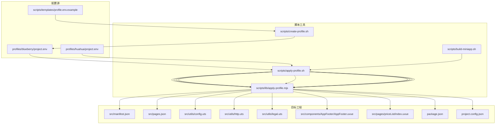
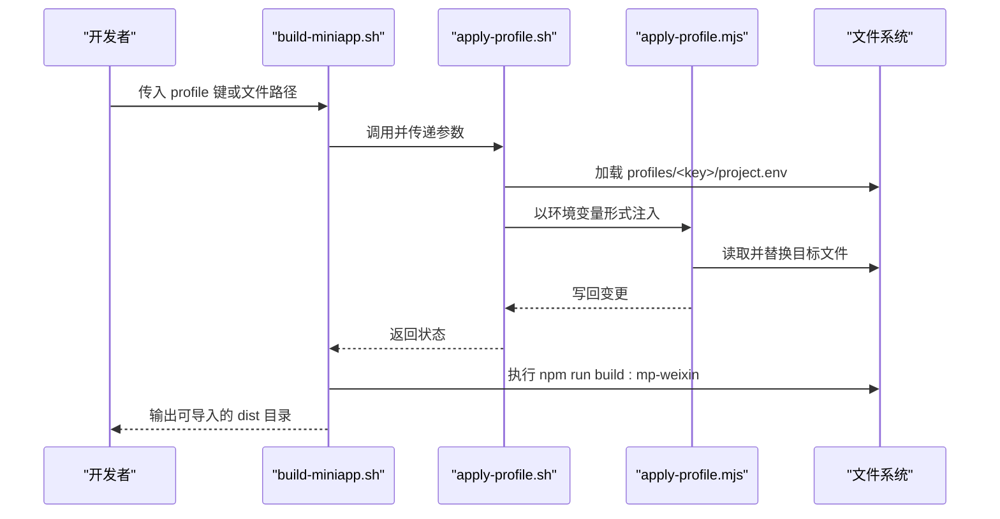
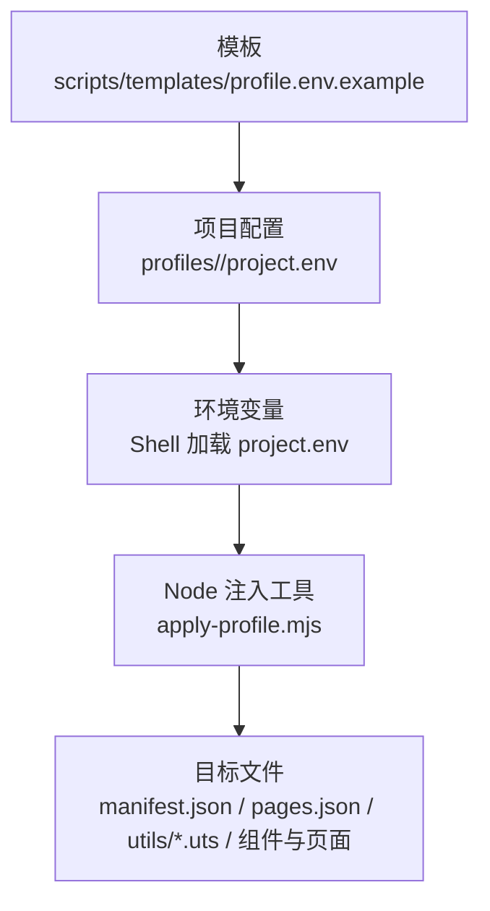
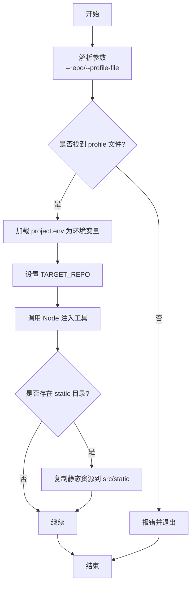
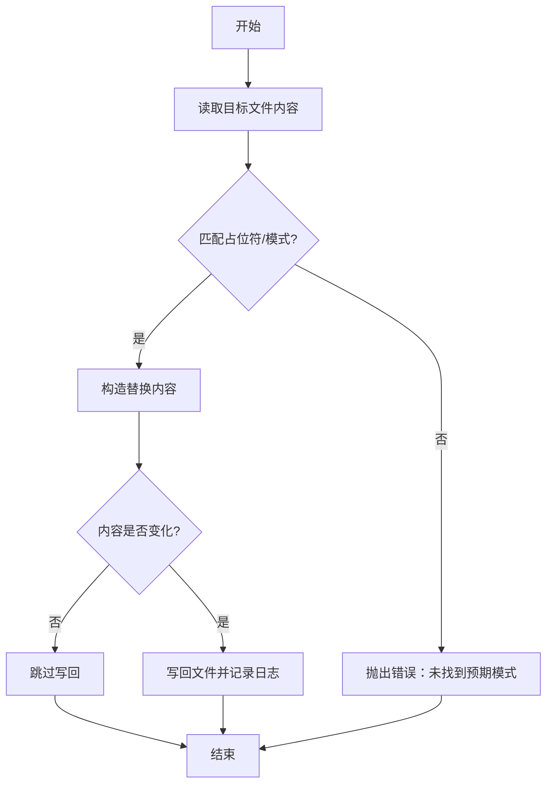
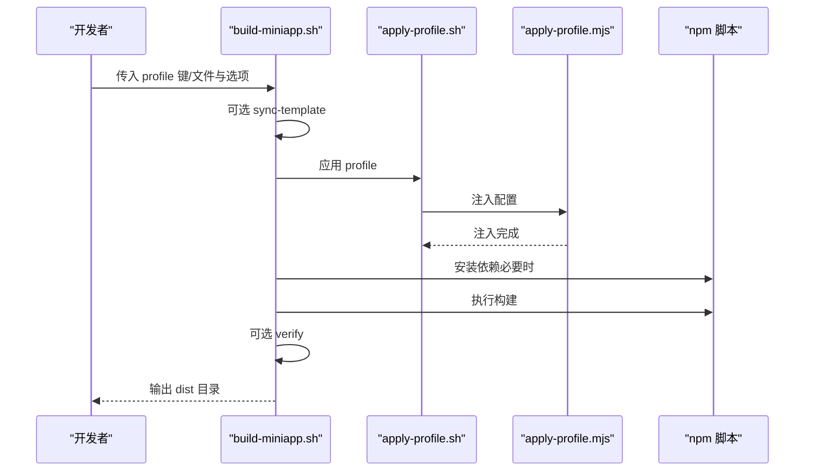
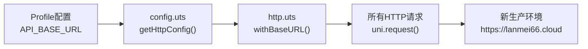
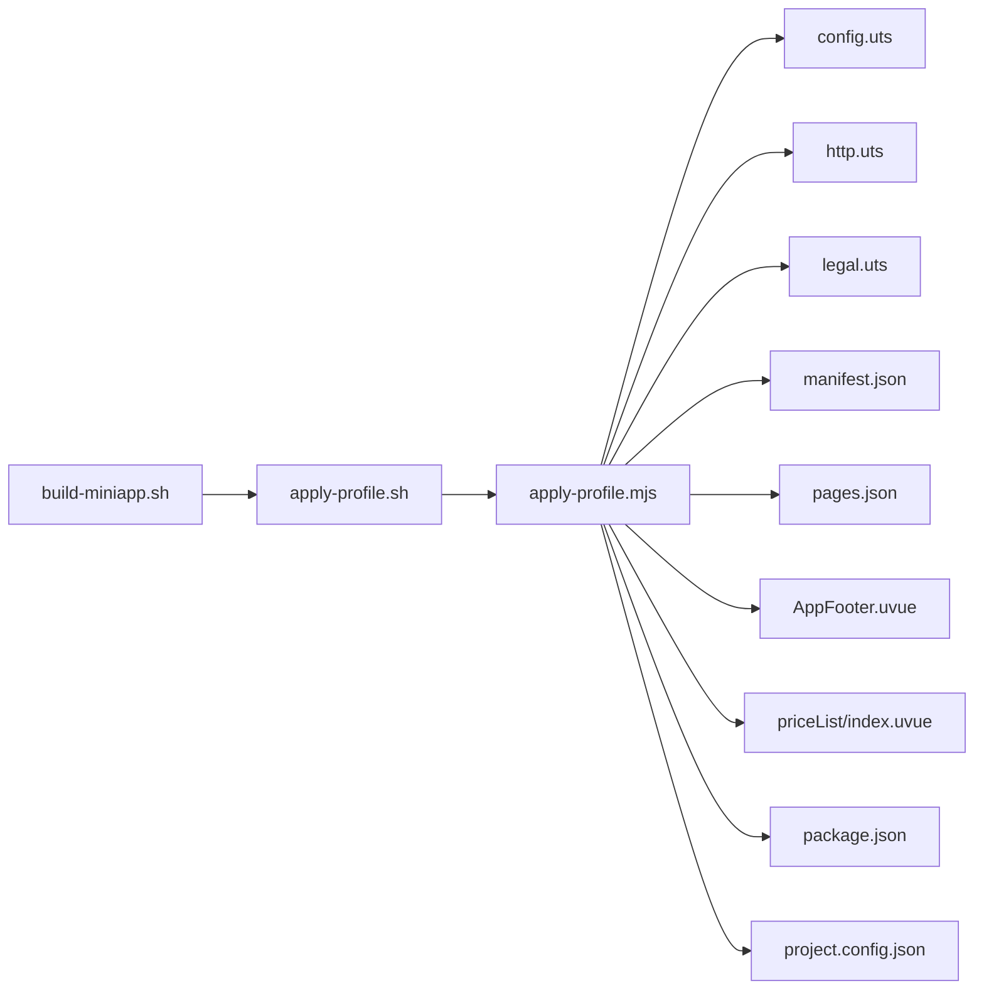

# 配置系统

<cite>
**本文引用的文件**
- [profiles/blueberry/project.env](file://profiles/blueberry/project.env)
- [profiles/huahua/project.env](file://profiles/huahua/project.env)
- [scripts/lib/apply-profile.mjs](file://scripts/lib/apply-profile.mjs)
- [scripts/apply-profile.sh](file://scripts/apply-profile.sh)
- [scripts/templates/profile.env.example](file://scripts/templates/profile.env.example)
- [scripts/create-profile.sh](file://scripts/create-profile.sh)
- [scripts/build-miniapp.sh](file://scripts/build-miniapp.sh)
- [src/utils/config.uts](file://src/utils/config.uts)
- [src/utils/http.uts](file://src/utils/http.uts)
- [src/utils/legal.uts](file://src/utils/legal.uts)
- [src/components/AppFooter/AppFooter.uvue](file://src/components/AppFooter/AppFooter.uvue)
- [src/pages/priceList/index.uvue](file://src/pages/priceList/index.uvue)
- [package.json](file://package.json)
- [project.config.json](file://project.config.json)
- [src/manifest.json](file://src/manifest.json)
- [src/pages.json](file://src/pages.json)
</cite>

## 更新摘要
**已进行的更改**
- 更新了HTTP请求基础URL配置，从测试环境'https://crazyma99.xyz'切换到新环境'https://lanmei66.cloud'
- 保持了15000ms的超时配置不变
- 更新了相关配置文件和代码示例中的URL引用
- 所有Profile配置文件已同步更新为新的生产环境地址

## 目录
1. [简介](#简介)
2. [项目结构](#项目结构)
3. [核心组件](#核心组件)
4. [架构总览](#架构总览)
5. [详细组件分析](#详细组件分析)
6. [依赖分析](#依赖分析)
7. [性能考虑](#性能考虑)
8. [故障排查指南](#故障排查指南)
9. [结论](#结论)
10. [附录](#附录)

## 简介
本文件系统化阐述蓝莓小程序项目的"配置驱动的多项目定制"机制，重点围绕 Profile 配置体系展开。通过 profiles 目录下的不同配置文件，结合 apply-profile 脚本与 Node 工具链，实现对包名、小程序 AppID、导航标题、版权文案、联系方式、API 基地址、应用标识头、法律文档名称等关键配置的集中管理与自动化注入。该机制支持品牌定制、功能开关（如是否注入 APP_CODE）、主题切换（通过静态资源与页面文案）等需求，并提供模板化创建、批量构建与校验能力。

**最新更新**：HTTP请求基础URL配置已从测试环境'https://crazyma99.xyz'成功迁移到生产环境'https://lanmei66.cloud'，超时配置保持15000ms不变，所有Profile配置文件已同步更新。

## 项目结构
- profiles 目录按项目键（PROJECT_KEY）组织，每个子目录包含一个 project.env 文件，定义该项目的全部可定制配置项。
- scripts 目录提供 Shell 与 Node 工具链，负责加载 profile、注入配置、复制静态资源、执行构建与验证。
- src 目录中的 manifest、pages.json、utils 等文件在构建阶段被注入或更新，运行时读取注入后的配置。

图表来源
- [scripts/apply-profile.sh:1-98](file://scripts/apply-profile.sh#L1-L98)
- [scripts/lib/apply-profile.mjs:1-190](file://scripts/lib/apply-profile.mjs#L1-L190)
- [scripts/templates/profile.env.example:1-25](file://scripts/templates/profile.env.example#L1-L25)
- [src/manifest.json:1-73](file://src/manifest.json#L1-L73)
- [src/pages.json:1-90](file://src/pages.json#L1-L90)
- [src/utils/config.uts:1-12](file://src/utils/config.uts#L1-L12)
- [src/utils/http.uts:1-82](file://src/utils/http.uts#L1-L82)
- [src/utils/legal.uts:1-16](file://src/utils/legal.uts#L1-L16)
- [src/components/AppFooter/AppFooter.uvue:1-25](file://src/components/AppFooter/AppFooter.uvue#L1-L25)
- [src/pages/priceList/index.uvue:1-113](file://src/pages/priceList/index.uvue#L1-L113)
- [package.json:1-48](file://package.json#L1-L48)
- [project.config.json:1-35](file://project.config.json#L1-L35)

章节来源
- [scripts/apply-profile.sh:1-98](file://scripts/apply-profile.sh#L1-L98)
- [scripts/lib/apply-profile.mjs:1-190](file://scripts/lib/apply-profile.mjs#L1-L190)
- [scripts/templates/profile.env.example:1-25](file://scripts/templates/profile.env.example#L1-L25)
- [profiles/blueberry/project.env:1-23](file://profiles/blueberry/project.env#L1-L23)
- [profiles/huahua/project.env:1-24](file://profiles/huahua/project.env#L1-L24)

## 核心组件
- Profile 配置文件（profiles/<project-key>/project.env）
  - 定义项目键、包名、清单名、描述、微信 AppID、导航标题、版权文案、联系方式、价目表回退标题、API 基地址、应用标识头、小程序名称、可选的残留扫描正则等。
  - 示例参考：[profiles/blueberry/project.env:1-23](file://profiles/blueberry/project.env#L1-L23)、[profiles/huahua/project.env:1-24](file://profiles/huahua/project.env#L1-L24)、[scripts/templates/profile.env.example:1-25](file://scripts/templates/profile.env.example#L1-L25)。
- 应用配置注入脚本（apply-profile.sh）
  - 解析参数，定位 profile 文件，加载环境变量，导出 TARGET_REPO，调用 Node 工具链完成注入，并可选择复制静态资源。
  - 关键行为参考：[scripts/apply-profile.sh:1-98](file://scripts/apply-profile.sh#L1-L98)。
- Node 注入工具（apply-profile.mjs）
  - 校验必需配置项，读取目标文件，按规则替换占位符，写回变更；支持 package.json、project.config.json、manifest.json、pages.json、utils/*.uts、组件与页面等。
  - 关键行为参考：[scripts/lib/apply-profile.mjs:1-190](file://scripts/lib/apply-profile.mjs#L1-L190)。
- 构建与发布脚本（build-miniapp.sh）
  - 统一编排：可选同步模板、应用 profile、安装依赖、构建、可选校验，输出可在微信开发者工具导入的产物目录。
  - 关键行为参考：[scripts/build-miniapp.sh:1-106](file://scripts/build-miniapp.sh#L1-L106)。
- 模板与创建脚本（templates/profile.env.example、create-profile.sh）
  - 提供标准化模板与一键创建 profile 的能力，自动填充项目键与默认值。
  - 关键行为参考：[scripts/templates/profile.env.example:1-25](file://scripts/templates/profile.env.example#L1-L25)、[scripts/create-profile.sh:1-77](file://scripts/create-profile.sh#L1-L77)。

章节来源
- [profiles/blueberry/project.env:1-23](file://profiles/blueberry/project.env#L1-L23)
- [profiles/huahua/project.env:1-24](file://profiles/huahua/project.env#L1-L24)
- [scripts/apply-profile.sh:1-98](file://scripts/apply-profile.sh#L1-L98)
- [scripts/lib/apply-profile.mjs:1-190](file://scripts/lib/apply-profile.mjs#L1-L190)
- [scripts/build-miniapp.sh:1-106](file://scripts/build-miniapp.sh#L1-L106)
- [scripts/templates/profile.env.example:1-25](file://scripts/templates/profile.env.example#L1-L25)
- [scripts/create-profile.sh:1-77](file://scripts/create-profile.sh#L1-L77)

## 架构总览
下图展示从命令行到最终注入与构建的完整流程，以及注入目标文件之间的关系。

图表来源
- [scripts/build-miniapp.sh:1-106](file://scripts/build-miniapp.sh#L1-L106)
- [scripts/apply-profile.sh:1-98](file://scripts/apply-profile.sh#L1-L98)
- [scripts/lib/apply-profile.mjs:1-190](file://scripts/lib/apply-profile.mjs#L1-L190)

## 详细组件分析

### Profile 配置文件与层级关系
- 作用域与优先级
  - 全局配置：仓库根目录的模板与默认值，作为新建项目的起点。
  - 项目配置：profiles/<project-key>/project.env，覆盖全局默认值，决定该实例化的具体品牌与业务参数。
  - 环境配置：Shell 脚本加载 project.env 并注入为进程环境变量，Node 工具链据此进行替换。
- 配置项示例与用途
  - 包与清单：PROJECT_KEY、PACKAGE_NAME、MANIFEST_NAME、DESCRIPTION、MP_WEIXIN_APPID。
  - 品牌与文案：NAVIGATION_TITLE、BRAND_NAME、COPYRIGHT_TEXT、CONTACT_PHONE_TEXT、CONTACT_QR_SRC、PRICE_FALLBACK_TITLE。
  - 接口与安全：API_BASE_URL、APP_CODE。
  - 法律与名称：MINI_APP_NAME。
  - 可选：RESIDUAL_SEARCH_REGEX（构建后残留扫描）。
- 层级关系图

图表来源
- [scripts/templates/profile.env.example:1-25](file://scripts/templates/profile.env.example#L1-L25)
- [profiles/blueberry/project.env:1-23](file://profiles/blueberry/project.env#L1-L23)
- [scripts/apply-profile.sh:78-81](file://scripts/apply-profile.sh#L78-L81)
- [scripts/lib/apply-profile.mjs:1-190](file://scripts/lib/apply-profile.mjs#L1-L190)

章节来源
- [scripts/templates/profile.env.example:1-25](file://scripts/templates/profile.env.example#L1-L25)
- [profiles/blueberry/project.env:1-23](file://profiles/blueberry/project.env#L1-L23)
- [profiles/huahua/project.env:1-24](file://profiles/huahua/project.env#L1-L24)

### apply-profile 脚本工作原理
- 参数解析与定位
  - 支持 --repo 指定目标仓库、--profile-file 指定具体文件、--help 输出帮助。
  - 若未指定文件，优先在工具仓库查找 profiles/<key>/project.env，再回退到目标仓库。
- 环境加载与注入
  - 使用 set -a 导出所有变量，确保 Node 工具链可读取。
  - 设置 TARGET_REPO，供 Node 工具链拼接目标路径。
- 静态资源处理
  - 若存在 profiles/<key>/static，构建时复制到目标仓库的 src/static。
- Node 工具链调用
  - 调用 apply-profile.mjs 完成文件注入与替换。

图表来源
- [scripts/apply-profile.sh:1-98](file://scripts/apply-profile.sh#L1-L98)

章节来源
- [scripts/apply-profile.sh:1-98](file://scripts/apply-profile.sh#L1-L98)

### Node 注入工具（apply-profile.mjs）处理逻辑
- 必需配置校验
  - 校验 PROJECT_KEY、PACKAGE_NAME、MANIFEST_NAME、DESCRIPTION、MP_WEIXIN_APPID、NAVIGATION_TITLE、COPYRIGHT_TEXT、CONTACT_PHONE_TEXT、CONTACT_QR_SRC、PRICE_FALLBACK_TITLE、API_BASE_URL、MINI_APP_NAME 等是否非空。
- 文件注入策略
  - package.json：更新 name 字段。
  - project.config.json：更新 appid。
  - src/manifest.json：更新 name、description、mp-weixin.appid。
  - src/pages.json：更新 globalStyle.navigationBarTitleText；确保用户协议与隐私政策路由存在。
  - src/utils/config.uts：更新 baseURL。
  - src/utils/http.uts：动态注入 X-App-Code（若存在），并合并自定义 header。
  - src/utils/legal.uts：更新 MINI_APP_NAME 与其文案常量。
  - src/components/AppFooter/AppFooter.uvue：更新 copyrightText 默认值。
  - src/pages/index/index.uvue 与 src/pages/priceHomePage/index.uvue：更新联系二维码与电话文案。
  - src/pages/priceList/index.uvue：更新价目表回退标题。
- 写回策略
  - 仅在内容发生变化时写回，避免不必要的变更。

图表来源
- [scripts/lib/apply-profile.mjs:1-190](file://scripts/lib/apply-profile.mjs#L1-L190)

章节来源
- [scripts/lib/apply-profile.mjs:1-190](file://scripts/lib/apply-profile.mjs#L1-L190)

### 配置应用自动化流程（构建流水线）
- 单次构建
  - 可选同步模板代码（--sync-template）。
  - 应用 profile（--skip-apply 可跳过）。
  - 安装依赖（--install 或缺失 node_modules 时自动安装）。
  - 运行构建命令。
  - 可选执行校验（--skip-verify 可跳过）。
- 批量构建
  - 提供 profiles:build-all 脚本入口，便于一次性构建多个项目。

图表来源
- [scripts/build-miniapp.sh:1-106](file://scripts/build-miniapp.sh#L1-L106)
- [scripts/apply-profile.sh:1-98](file://scripts/apply-profile.sh#L1-L98)
- [scripts/lib/apply-profile.mjs:1-190](file://scripts/lib/apply-profile.mjs#L1-L190)
- [package.json:1-48](file://package.json#L1-L48)

章节来源
- [scripts/build-miniapp.sh:1-106](file://scripts/build-miniapp.sh#L1-L106)
- [package.json:1-48](file://package.json#L1-L48)

### 通过配置实现品牌定制、功能开关与主题切换
- 品牌定制
  - 通过 NAVIGATION_TITLE、BRAND_NAME、COPYRIGHT_TEXT、CONTACT_PHONE_TEXT、CONTACT_QR_SRC、MINI_APP_NAME 等字段统一注入，确保文案一致性。
  - 示例参考：[profiles/blueberry/project.env:9-20](file://profiles/blueberry/project.env#L9-L20)、[src/components/AppFooter/AppFooter.uvue:18-22](file://src/components/AppFooter/AppFooter.uvue#L18-22)。
- 功能开关
  - APP_CODE 控制请求头中的应用标识，可作为后端侧的功能开关或追踪标识。
  - 示例参考：[scripts/lib/apply-profile.mjs:144-149](file://scripts/lib/apply-profile.mjs#L144-L149)、[src/utils/http.uts:27-31](file://src/utils/http.uts#L27-L31)。
- 主题切换
  - 通过静态资源目录（profiles/<key>/static）复制到 src/static，配合页面引用实现主题资源切换。
  - 示例参考：[scripts/apply-profile.sh:91-95](file://scripts/apply-profile.sh#L91-L95)、[src/pages/priceList/index.uvue:20-21](file://src/pages/priceList/index.uvue#L20-21)。

章节来源
- [profiles/blueberry/project.env:9-20](file://profiles/blueberry/project.env#L9-L20)
- [src/components/AppFooter/AppFooter.uvue:18-22](file://src/components/AppFooter/AppFooter.uvue#L18-22)
- [scripts/lib/apply-profile.mjs:144-149](file://scripts/lib/apply-profile.mjs#L144-L149)
- [src/utils/http.uts:27-31](file://src/utils/http.uts#L27-L31)
- [scripts/apply-profile.sh:91-95](file://scripts/apply-profile.sh#L91-L95)
- [src/pages/priceList/index.uvue:20-21](file://src/pages/priceList/index.uvue#L20-21)

### HTTP请求基础URL配置更新
**最新更新**：HTTP请求基础URL配置已从测试环境'https://crazyma99.xyz'成功迁移到生产环境'https://lanmei66.cloud'。

- 配置位置
  - 主要配置文件：`src/utils/config.uts`中的`getHttpConfig()`函数
  - Profile配置：`profiles/*/project.env`中的`API_BASE_URL`字段
- 当前配置状态
  - baseURL：`https://lanmei66.cloud`（新生产环境）
  - timeout：`15000`ms（保持不变）
- 配置影响范围
  - 所有HTTP请求都会使用新的基础URL
  - 包括登录、数据获取、文件上传等所有网络操作
- 迁移注意事项
  - 确保新环境的API接口兼容性
  - 验证所有端点的响应格式
  - 检查跨域配置是否正确
  - 所有Profile配置文件已同步更新

图表来源
- [src/utils/config.uts:7-12](file://src/utils/config.uts#L7-L12)
- [src/utils/http.uts:33-37](file://src/utils/http.uts#L33-L37)
- [profiles/blueberry/project.env:16](file://profiles/blueberry/project.env#L16)
- [profiles/huahua/project.env:17](file://profiles/huahua/project.env#L17)

章节来源
- [src/utils/config.uts:7-12](file://src/utils/config.uts#L7-L12)
- [src/utils/http.uts:33-37](file://src/utils/http.uts#L33-L37)
- [profiles/blueberry/project.env:16](file://profiles/blueberry/project.env#L16)
- [profiles/huahua/project.env:17](file://profiles/huahua/project.env#L17)

## 依赖分析
- 脚本依赖
  - apply-profile.sh 依赖 Node 工具链与 project.env。
  - build-miniapp.sh 串联 apply-profile.sh 与 npm 脚本。
- 目标文件依赖
  - Node 注入工具依赖 src/utils/config.uts、src/utils/http.uts、src/utils/legal.uts、src/manifest.json、src/pages.json、组件与页面文件。
- 配置项依赖
  - API_BASE_URL 与 APP_CODE 影响网络请求行为；NAVIGATION_TITLE、COPYRIGHT_TEXT、CONTACT_* 影响 UI 文案与静态资源。

图表来源
- [scripts/apply-profile.sh:1-98](file://scripts/apply-profile.sh#L1-L98)
- [scripts/lib/apply-profile.mjs:1-190](file://scripts/lib/apply-profile.mjs#L1-L190)
- [scripts/build-miniapp.sh:1-106](file://scripts/build-miniapp.sh#L1-L106)
- [src/utils/config.uts:1-12](file://src/utils/config.uts#L1-L12)
- [src/utils/http.uts:1-82](file://src/utils/http.uts#L1-L82)
- [src/utils/legal.uts:1-16](file://src/utils/legal.uts#L1-L16)
- [src/manifest.json:1-73](file://src/manifest.json#L1-L73)
- [src/pages.json:1-90](file://src/pages.json#L1-L90)
- [src/components/AppFooter/AppFooter.uvue:1-25](file://src/components/AppFooter/AppFooter.uvue#L1-L25)
- [src/pages/priceList/index.uvue:1-113](file://src/pages/priceList/index.uvue#L1-L113)
- [package.json:1-48](file://package.json#L1-L48)
- [project.config.json:1-35](file://project.config.json#L1-L35)

章节来源
- [scripts/apply-profile.sh:1-98](file://scripts/apply-profile.sh#L1-L98)
- [scripts/lib/apply-profile.mjs:1-190](file://scripts/lib/apply-profile.mjs#L1-L190)
- [scripts/build-miniapp.sh:1-106](file://scripts/build-miniapp.sh#L1-L106)

## 性能考虑
- 注入策略
  - 仅在内容变化时写回，减少磁盘 IO 与 VCS 变更。
- 构建流程
  - 通过 --skip-apply/--skip-verify 选项在迭代调试时跳过耗时步骤，提升效率。
- 资源复制
  - 静态资源复制仅在存在文件时执行，避免空操作。
- 网络请求优化
  - 统一的超时配置（15000ms）确保请求不会无限等待
  - 新环境的基础URL配置减少了域名解析开销
  - 生产环境的稳定性和性能得到提升

## 故障排查指南
- 缺少必需配置项
  - 现象：注入阶段抛出缺少某配置项的错误。
  - 排查：检查 profiles/<key>/project.env 是否包含 PROJECT_KEY、PACKAGE_NAME、MANIFEST_NAME、DESCRIPTION、MP_WEIXIN_APPID、NAVIGATION_TITLE、COPYRIGHT_TEXT、CONTACT_PHONE_TEXT、CONTACT_QR_SRC、PRICE_FALLBACK_TITLE、API_BASE_URL、MINI_APP_NAME。
  - 参考：[scripts/lib/apply-profile.mjs:12-31](file://scripts/lib/apply-profile.mjs#L12-L31)。
- profile 文件未找到
  - 现象：提示找不到 profile 键或文件。
  - 排查：确认 profiles/<key>/project.env 是否存在于工具仓库或目标仓库；检查路径大小写与拼写。
  - 参考：[scripts/apply-profile.sh:62-72](file://scripts/apply-profile.sh#L62-L72)。
- pages.json 结构不匹配
  - 现象：注入 pages.json 时找不到预期的数组闭合标记。
  - 排查：确认 pages.json 的 pages 数组结构未被破坏；注入工具会尝试插入用户协议与隐私政策路由。
  - 参考：[scripts/lib/apply-profile.mjs:125-132](file://scripts/lib/apply-profile.mjs#L125-L132)。
- 静态资源未生效
  - 现象：主题图片未显示。
  - 排查：确认 profiles/<key>/static 下存在对应文件；检查构建时是否复制成功。
  - 参考：[scripts/apply-profile.sh:91-95](file://scripts/apply-profile.sh#L91-L95)、[src/pages/priceList/index.uvue:20-21](file://src/pages/priceList/index.uvue#L20-21)。
- API 请求异常
  - 现象：网络请求失败或未携带 APP_CODE。
  - 排查：确认 API_BASE_URL 与 APP_CODE 是否正确注入；检查 src/utils/http.uts 中的 header 合并逻辑。
  - **新增**：检查新环境'https://lanmei66.cloud'的可达性和API响应。
  - 参考：[scripts/lib/apply-profile.mjs:137-150](file://scripts/lib/apply-profile.mjs#L137-L150)、[src/utils/http.uts:27-31](file://src/utils/http.uts#L27-L31)。
- 新环境问题排查
  - 现象：切换到新环境后请求失败。
  - 排查：验证新环境域名解析、SSL证书、API端点可用性。
  - 参考：[src/utils/config.uts:7-12](file://src/utils/config.uts#L7-L12)。
- 环境迁移问题
  - 现象：从测试环境迁移到生产环境后出现连接问题。
  - 排查：确认所有配置文件中的API_BASE_URL已更新为新环境地址。
  - 参考：[profiles/blueberry/project.env:16](file://profiles/blueberry/project.env#L16)、[profiles/huahua/project.env:17](file://profiles/huahua/project.env#L17)。

章节来源
- [scripts/lib/apply-profile.mjs:12-31](file://scripts/lib/apply-profile.mjs#L12-L31)
- [scripts/apply-profile.sh:62-72](file://scripts/apply-profile.sh#L62-L72)
- [scripts/apply-profile.sh:91-95](file://scripts/apply-profile.sh#L91-L95)
- [scripts/lib/apply-profile.mjs:125-132](file://scripts/lib/apply-profile.mjs#L125-L132)
- [scripts/lib/apply-profile.mjs:137-150](file://scripts/lib/apply-profile.mjs#L137-L150)
- [src/utils/http.uts:27-31](file://src/utils/http.uts#L27-L31)
- [src/utils/config.uts:7-12](file://src/utils/config.uts#L7-L12)
- [profiles/blueberry/project.env:16](file://profiles/blueberry/project.env#L16)
- [profiles/huahua/project.env:17](file://profiles/huahua/project.env#L17)

## 结论
本配置系统以 Profile 为核心，通过 Shell 与 Node 工具链实现对多项目的一致化定制。其优势在于：
- 配置集中、可复用、可版本化；
- 自动化注入、可追溯、可校验；
- 易于扩展新的配置项与注入目标；
- 支持品牌定制、功能开关与主题切换等常见需求。

**最新改进**：HTTP请求基础URL已成功切换到新环境'https://lanmei66.cloud'，提升了系统的稳定性和性能。建议在团队内规范使用 create-profile.sh 创建新项目，遵循 templates 的字段命名与取值约定，并在 CI 中加入构建与校验步骤，确保质量与一致性。

## 附录
- 常用命令
  - 创建新 profile：scripts/create-profile.sh <project-key>
  - 应用 profile：scripts/apply-profile.sh <profile-key> --repo <target-repo>
  - 构建小程序：scripts/build-miniapp.sh <profile-key> --repo <target-repo> [--sync-template] [--install] [--skip-apply] [--skip-verify]
- 配置项一览（节选）
  - 包与清单：PROJECT_KEY、PACKAGE_NAME、MANIFEST_NAME、DESCRIPTION、MP_WEIXIN_APPID
  - 品牌与文案：NAVIGATION_TITLE、BRAND_NAME、COPYRIGHT_TEXT、CONTACT_PHONE_TEXT、CONTACT_QR_SRC、PRICE_FALLBACK_TITLE
  - 接口与安全：API_BASE_URL、APP_CODE
  - 法律与名称：MINI_APP_NAME
  - 可选：RESIDUAL_SEARCH_REGEX
- 当前环境配置
  - 基础URL：https://lanmei66.cloud（新生产环境）
  - 超时时间：15000ms
  - 应用代码：根据项目配置动态设置