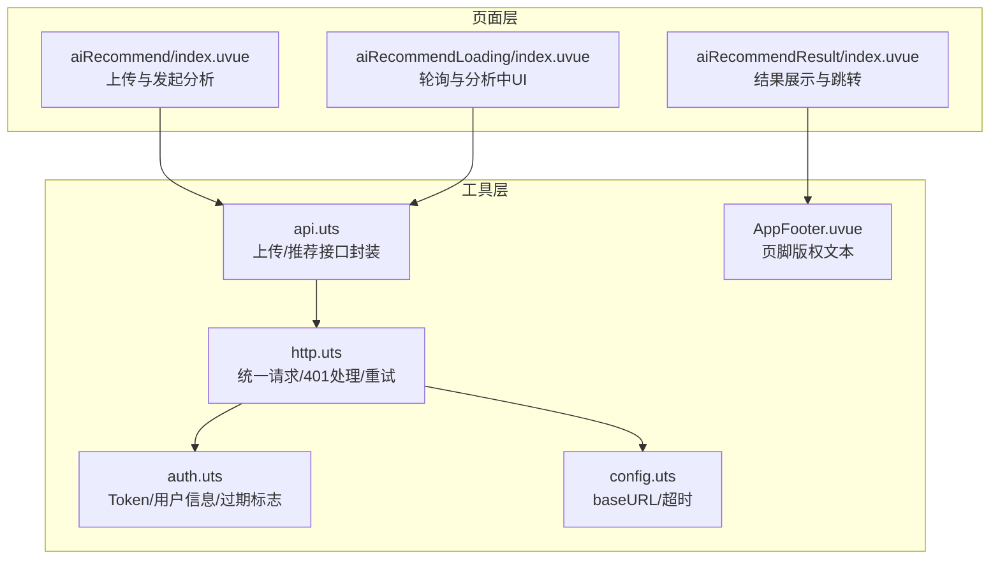
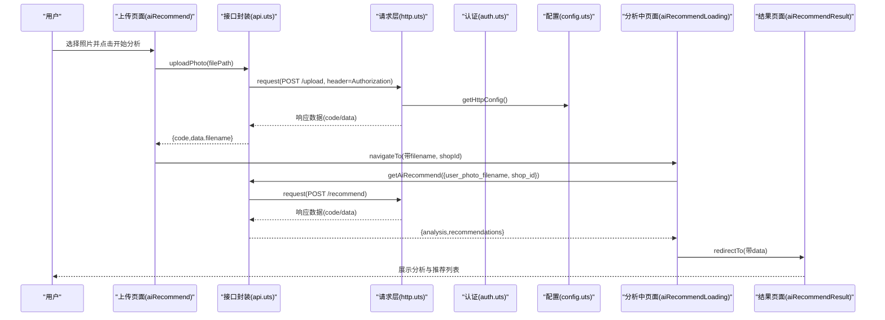
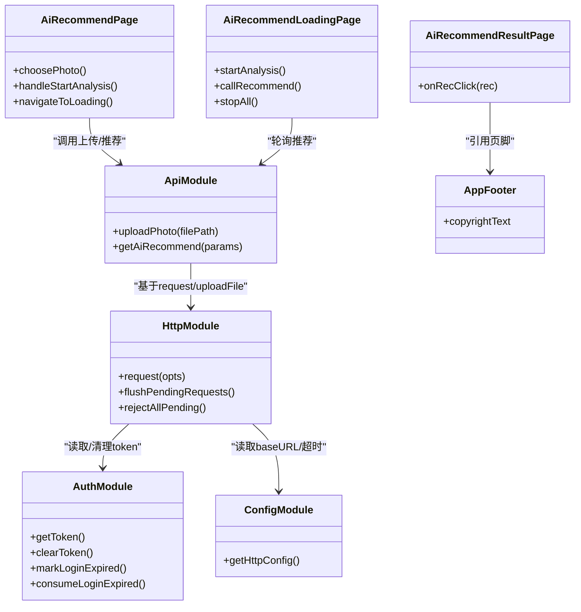

# AI服装推荐功能

<cite>
**本文引用的文件列表**
- [src/pages/aiRecommend/index.uvue](file://src/pages/aiRecommend/index.uvue)
- [src/pages/aiRecommendLoading/index.uvue](file://src/pages/aiRecommendLoading/index.uvue)
- [src/pages/aiRecommendResult/index.uvue](file://src/pages/aiRecommendResult/index.uvue)
- [src/utils/api.uts](file://src/utils/api.uts)
- [src/utils/http.uts](file://src/utils/http.uts)
- [src/utils/auth.uts](file://src/utils/auth.uts)
- [src/utils/config.uts](file://src/utils/config.uts)
- [src/components/AppFooter/AppFooter.uvue](file://src/components/AppFooter/AppFooter.uvue)
- [src/pages.json](file://src/pages.json)
- [README.md](file://README.md)
</cite>

## 目录
1. [简介](#简介)
2. [项目结构](#项目结构)
3. [核心组件](#核心组件)
4. [架构总览](#架构总览)
5. [详细组件分析](#详细组件分析)
6. [依赖关系分析](#依赖关系分析)
7. [性能与体验优化建议](#性能与体验优化建议)
8. [故障排查指南](#故障排查指南)
9. [结论](#结论)

## 简介
本章节聚焦于“AI服装推荐”能力，该能力由三个页面组成：上传照片、等待分析、展示结果。用户通过上传个人照片触发后端AI分析，系统返回用户画像（性别、年龄、脸型、体型、风格关键词）以及若干推荐的服饰风格卡片，点击后可跳转到“AI试衣模板列表”进行进一步交互。整个流程涉及前端上传、轮询获取结果、结果渲染与跳转等关键步骤，并内置了登录态管理、请求挂起重试、错误提示等通用机制。

## 项目结构
AI服装推荐相关代码位于 pages 与 utils 两个层次：
- 页面层：负责用户交互、状态管理与路由跳转
- 工具层：封装网络请求、认证、配置与业务接口

图表来源
- [src/pages/aiRecommend/index.uvue:1-222](file://src/pages/aiRecommend/index.uvue#L1-L222)
- [src/pages/aiRecommendLoading/index.uvue:1-235](file://src/pages/aiRecommendLoading/index.uvue#L1-L235)
- [src/pages/aiRecommendResult/index.uvue:1-284](file://src/pages/aiRecommendResult/index.uvue#L1-L284)
- [src/utils/api.uts:1-607](file://src/utils/api.uts#L1-L607)
- [src/utils/http.uts:1-172](file://src/utils/http.uts#L1-L172)
- [src/utils/auth.uts:1-171](file://src/utils/auth.uts#L1-L171)
- [src/utils/config.uts:1-13](file://src/utils/config.uts#L1-L13)
- [src/components/AppFooter/AppFooter.uvue:1-25](file://src/components/AppFooter/AppFooter.uvue#L1-L25)

章节来源
- [src/pages.json:74-90](file://src/pages.json#L74-L90)
- [README.md:136-166](file://README.md#L136-L166)

## 核心组件
- 上传与发起分析页面：提供图片选择、预览、大小校验、上传与跳转至分析中的页面
- 分析中页面：维护轮询定时器与倒计时，失败态支持重试与返回
- 结果展示页面：解析并展示分析结果与推荐列表，点击卡片跳转至AI试衣模板列表
- 接口封装：上传与推荐接口，包含401挂起队列与登录后自动重试
- 请求层：统一请求头注入、401处理、挂起队列与flush重试
- 认证模块：token与用户信息管理、登录过期标志消费
- 配置模块：API域名与超时时间
- 公共组件：全局页脚版权文本

章节来源
- [src/pages/aiRecommend/index.uvue:37-116](file://src/pages/aiRecommend/index.uvue#L37-L116)
- [src/pages/aiRecommendLoading/index.uvue:33-137](file://src/pages/aiRecommendLoading/index.uvue#L33-L137)
- [src/pages/aiRecommendResult/index.uvue:78-121](file://src/pages/aiRecommendResult/index.uvue#L78-L121)
- [src/utils/api.uts:441-607](file://src/utils/api.uts#L441-L607)
- [src/utils/http.uts:93-163](file://src/utils/http.uts#L93-L163)
- [src/utils/auth.uts:157-171](file://src/utils/auth.uts#L157-L171)
- [src/utils/config.uts:7-12](file://src/utils/config.uts#L7-L12)
- [src/components/AppFooter/AppFooter.uvue:14-24](file://src/components/AppFooter/AppFooter.uvue#L14-L24)

## 架构总览
AI服装推荐的整体调用链如下：
- 用户在上传页面选择照片并触发上传
- 上传成功后进入分析中页面，启动轮询请求推荐接口
- 当接口返回成功数据时，跳转到结果页面展示分析与推荐列表
- 点击推荐卡片后跳转到AI试衣模板列表，携带风格名与性别筛选参数

图表来源
- [src/pages/aiRecommend/index.uvue:75-113](file://src/pages/aiRecommend/index.uvue#L75-L113)
- [src/pages/aiRecommendLoading/index.uvue:87-113](file://src/pages/aiRecommendLoading/index.uvue#L87-L113)
- [src/pages/aiRecommendResult/index.uvue:90-118](file://src/pages/aiRecommendResult/index.uvue#L90-L118)
- [src/utils/api.uts:441-480](file://src/utils/api.uts#L441-L480)
- [src/utils/api.uts:588-607](file://src/utils/api.uts#L588-L607)
- [src/utils/http.uts:93-163](file://src/utils/http.uts#L93-L163)
- [src/utils/config.uts:7-12](file://src/utils/config.uts#L7-L12)

## 详细组件分析

### 上传与发起分析页面（aiRecommend）
- 功能要点
  - 图片选择与预览，限制最大10MB
  - 调用上传接口，成功后记录文件名并跳转分析中页面
  - 若已上传过则直接跳转，避免重复上传
  - 错误处理：未授权由全局机制处理，其他错误提示重试
- 关键路径
  - 选择照片与预览：[src/pages/aiRecommend/index.uvue:56-73](file://src/pages/aiRecommend/index.uvue#L56-L73)
  - 开始分析流程：[src/pages/aiRecommend/index.uvue:75-113](file://src/pages/aiRecommend/index.uvue#L75-L113)
  - 跳转分析中页面：[src/pages/aiRecommend/index.uvue:109-113](file://src/pages/aiRecommend/index.uvue#L109-L113)

章节来源
- [src/pages/aiRecommend/index.uvue:56-113](file://src/pages/aiRecommend/index.uvue#L56-L113)

### 分析中页面（aiRecommendLoading）
- 功能要点
  - 启动计时器显示已等待秒数，超过180秒自动失败
  - 每30秒轮询一次推荐接口，首次立即调用
  - 连续3次网络错误即失败；成功则跳转结果页
  - 失败态支持重试与返回
- 关键路径
  - 启动轮询与计时：[src/pages/aiRecommendLoading/index.uvue:63-85](file://src/pages/aiRecommendLoading/index.uvue#L63-L85)
  - 轮询调用与错误计数：[src/pages/aiRecommendLoading/index.uvue:87-113](file://src/pages/aiRecommendLoading/index.uvue#L87-L113)
  - 停止定时器与失败处理：[src/pages/aiRecommendLoading/index.uvue:115-134](file://src/pages/aiRecommendLoading/index.uvue#L115-L134)

章节来源
- [src/pages/aiRecommendLoading/index.uvue:63-134](file://src/pages/aiRecommendLoading/index.uvue#L63-L134)

### 结果展示页面（aiRecommendResult）
- 功能要点
  - 解析URL参数中的JSON数据，展示分析结果与推荐列表
  - 根据分析结果中的性别字段设置筛选条件
  - 点击推荐卡片跳转到AI试衣模板列表，传递风格名与性别
- 关键路径
  - 解析参数与初始化：[src/pages/aiRecommendResult/index.uvue:90-109](file://src/pages/aiRecommendResult/index.uvue#L90-L109)
  - 跳转逻辑：[src/pages/aiRecommendResult/index.uvue:111-118](file://src/pages/aiRecommendResult/index.uvue#L111-L118)

章节来源
- [src/pages/aiRecommendResult/index.uvue:90-118](file://src/pages/aiRecommendResult/index.uvue#L90-L118)

### 接口封装（api.uts）
- 上传接口
  - 使用uni.uploadFile，携带Authorization头
  - 401时清空登录态并加入上传挂起队列，触发登录事件
  - 登录成功后可批量重试上传
- 推荐接口
  - POST /api/aiface/recommend，返回analysis与recommendations
  - code为0或200表示成功
- 关键路径
  - 上传接口实现与401挂起：[src/utils/api.uts:441-480](file://src/utils/api.uts#L441-L480)
  - 推荐接口定义与类型：[src/utils/api.uts:564-607](file://src/utils/api.uts#L564-L607)

章节来源
- [src/utils/api.uts:441-480](file://src/utils/api.uts#L441-L480)
- [src/utils/api.uts:564-607](file://src/utils/api.uts#L564-L607)

### 请求层（http.uts）
- 功能要点
  - 统一request/get/post，自动拼接baseURL与超时
  - 自动附加Content-Type、X-App-Code与Authorization头
  - 401时清空登录态、标记过期、挂起请求并在登录后flush重试
- 关键路径
  - 请求封装与401处理：[src/utils/http.uts:93-163](file://src/utils/http.uts#L93-L163)
  - flushPendingRequests与rejectAllPending：[src/utils/http.uts:42-91](file://src/utils/http.uts#L42-L91)

章节来源
- [src/utils/http.uts:42-91](file://src/utils/http.uts#L42-L91)
- [src/utils/http.uts:93-163](file://src/utils/http.uts#L93-L163)

### 认证模块（auth.uts）
- 功能要点
  - token与用户信息的存取、合并写入、登出
  - 登录过期标志的置位与消费，供页面onShow检查拉起登录弹窗
- 关键路径
  - 登录成功与登出：[src/utils/auth.uts:157-171](file://src/utils/auth.uts#L157-L171)
  - 过期标志与消费：[src/utils/auth.uts:127-141](file://src/utils/auth.uts#L127-L141)

章节来源
- [src/utils/auth.uts:127-171](file://src/utils/auth.uts#L127-L171)

### 配置模块（config.uts）
- 功能要点
  - 集中管理API base URL与超时时间
- 关键路径
  - baseURL与timeout：[src/utils/config.uts:7-12](file://src/utils/config.uts#L7-L12)

章节来源
- [src/utils/config.uts:7-12](file://src/utils/config.uts#L7-L12)

### 公共组件（AppFooter）
- 功能要点
  - 提供统一的版权文本，便于profile替换
- 关键路径
  - 组件结构与默认文案：[src/components/AppFooter/AppFooter.uvue:14-24](file://src/components/AppFooter/AppFooter.uvue#L14-L24)

章节来源
- [src/components/AppFooter/AppFooter.uvue:14-24](file://src/components/AppFooter/AppFooter.uvue#L14-L24)

## 依赖关系分析
- 页面到接口：上传与推荐页面均依赖api.uts暴露的方法
- 接口到请求层：api.uts内部使用http.uts的request与uploadFile
- 请求层到认证与配置：http.uts依赖auth.uts的token读取与过期标志，依赖config.uts的baseURL与超时
- 结果页到公共组件：结果页引入AppFooter用于底部版权

图表来源
- [src/pages/aiRecommend/index.uvue:56-113](file://src/pages/aiRecommend/index.uvue#L56-L113)
- [src/pages/aiRecommendLoading/index.uvue:63-113](file://src/pages/aiRecommendLoading/index.uvue#L63-L113)
- [src/pages/aiRecommendResult/index.uvue:90-118](file://src/pages/aiRecommendResult/index.uvue#L90-L118)
- [src/utils/api.uts:441-607](file://src/utils/api.uts#L441-L607)
- [src/utils/http.uts:93-163](file://src/utils/http.uts#L93-L163)
- [src/utils/auth.uts:127-171](file://src/utils/auth.uts#L127-L171)
- [src/utils/config.uts:7-12](file://src/utils/config.uts#L7-L12)
- [src/components/AppFooter/AppFooter.uvue:14-24](file://src/components/AppFooter/AppFooter.uvue#L14-L24)

章节来源
- [src/pages.json:74-90](file://src/pages.json#L74-L90)

## 性能与体验优化建议
- 轮询频率与超时
  - 当前轮询间隔为30秒，超时为180秒。可根据后端实际处理时长调整间隔与上限，减少无效请求与等待焦虑
- 图片上传体积控制
  - 前端已限制10MB，建议在上传前进行压缩或转码，降低带宽占用与上传耗时
- 结果缓存与去抖
  - 对于相同filename的请求，可在本地做短时缓存，避免短时间内重复轮询
- 错误提示优化
  - 对网络异常与服务器错误进行分类提示，提升用户感知与操作指引
- 资源加载
  - 结果页的图片建议使用懒加载与占位图，提升首屏渲染速度

[本节为通用建议，不直接分析具体文件]

## 故障排查指南
- 上传失败
  - 检查文件大小是否超过10MB
  - 确认Authorization头是否正确注入
  - 查看401是否触发登录流程，必要时重新登录
- 分析中长时间无结果
  - 检查轮询是否被正确启动与清理
  - 观察网络错误计数是否达到阈值导致失败
  - 确认后端接口是否返回期望的code与data
- 结果页无法解析
  - 检查URL参数data是否为合法JSON字符串
  - 确认analysis与recommendations字段是否存在
- 跳转AI试衣模板列表失败
  - 核对style与gender参数是否正确编码与传递
  - 确认目标页面路由存在且接收参数

章节来源
- [src/pages/aiRecommend/index.uvue:75-107](file://src/pages/aiRecommend/index.uvue#L75-L107)
- [src/pages/aiRecommendLoading/index.uvue:87-113](file://src/pages/aiRecommendLoading/index.uvue#L87-L113)
- [src/pages/aiRecommendResult/index.uvue:90-118](file://src/pages/aiRecommendResult/index.uvue#L90-L118)
- [src/utils/api.uts:441-480](file://src/utils/api.uts#L441-L480)
- [src/utils/http.uts:124-150](file://src/utils/http.uts#L124-L150)

## 结论
AI服装推荐功能以清晰的三段式页面流程完成从上传到结果展示的闭环，并通过统一的请求层与认证模块保障登录态与401处理的健壮性。轮询策略与错误计数提升了长任务场景下的用户体验。后续可在轮询频率、图片压缩、结果缓存与错误分类方面进一步优化，以获得更流畅与稳定的使用体验。