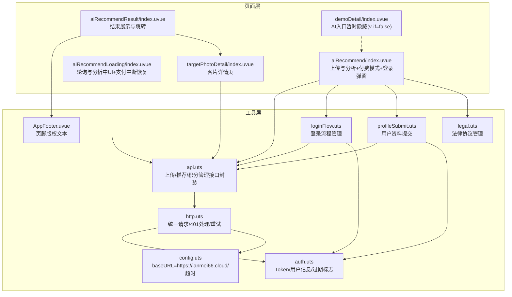
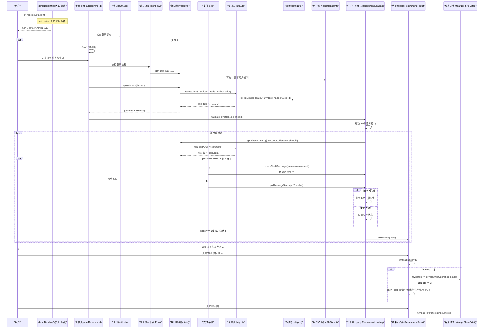

# AI服装推荐功能

<cite>
**本文引用的文件列表**
- [src/pages/aiRecommend/index.uvue](file://src/pages/aiRecommend/index.uvue)
- [src/pages/aiRecommendLoading/index.uvue](file://src/pages/aiRecommendLoading/index.uvue)
- [src/pages/aiRecommendResult/index.uvue](file://src/pages/aiRecommendResult/index.uvue)
- [src/pages/targetPhotoDetail/index.uvue](file://src/pages/targetPhotoDetail/index.uvue)
- [src/pages/demoDetail/index.uvue](file://src/pages/demoDetail/index.uvue)
- [src/utils/api.uts](file://src/utils/api.uts)
- [src/utils/http.uts](file://src/utils/http.uts)
- [src/utils/auth.uts](file://src/utils/auth.uts)
- [src/utils/config.uts](file://src/utils/config.uts)
- [src/utils/loginFlow.uts](file://src/utils/loginFlow.uts)
- [src/utils/profileSubmit.uts](file://src/utils/profileSubmit.uts)
- [src/utils/legal.uts](file://src/utils/legal.uts)
- [src/components/AppFooter/AppFooter.uvue](file://src/components/AppFooter/AppFooter.uvue)
- [src/pages.json](file://src/pages.json)
</cite>

## 更新摘要
**变更内容**
- AI服装推荐功能已增强为支持付费模式和积分余额管理，新增了微信支付集成、积分余额查询和充值功能
- 实现了智能支付中断恢复机制，支付成功后自动继续之前被打断的分析流程
- 新增积分余额查询接口，支持查询用户剩余推荐次数和单次定价
- 完善了错误处理机制，支持4001错误码（推荐次数不足）时的自动充值流程
- 保持了完整的登录流程管理系统和用户资料完善功能

## 目录
1. [简介](#简介)
2. [项目结构](#项目结构)
3. [核心组件](#核心组件)
4. [架构总览](#架构总览)
5. [详细组件分析](#详细组件分析)
6. [依赖关系分析](#依赖关系分析)
7. [性能与体验优化建议](#性能与体验优化建议)
8. [故障排查指南](#故障排查指南)
9. [结论](#结论)

## 简介
本章节聚焦于"AI服装推荐"能力，该能力经过重大增强后，现在提供完整的用户认证、资料管理和智能推荐服务。**重要更新**：AI智能推荐功能入口已暂时隐藏（v-if="false"），当前处于开发/测试阶段。系统现已全面支持付费模式和积分余额管理，用户可通过微信支付购买推荐次数，并在次数不足时自动引导充值。整个流程现已集成完整的登录态管理、用户资料完善系统、增强的错误处理机制和智能性别过滤功能。API端点配置已从'https://crazyma99.xyz'迁移至'https://lanmei66.cloud'，反映了生产环境切换或服务器迁移。

**最新增强**：AI推荐功能现已支持完整的付费模式，包括积分余额查询、微信支付集成、智能支付中断恢复等功能。当用户推荐次数不足时，系统会自动检测并引导用户进行充值，支付成功后自动继续之前的分析流程。

## 项目结构
AI服装推荐相关代码位于 pages 与 utils 两个层次，经过增强后新增了付费模式和积分管理模块：
- 页面层：负责用户交互、状态管理与路由跳转，现包含登录弹窗、用户资料完善对话框和支付流程
- 工具层：封装网络请求、认证、配置、登录流程、用户资料提交和积分管理等业务接口



**图表来源**
- [src/pages/aiRecommend/index.uvue:1-635](file://src/pages/aiRecommend/index.uvue#L1-L635)
- [src/pages/aiRecommendLoading/index.uvue:1-332](file://src/pages/aiRecommendLoading/index.uvue#L1-L332)
- [src/pages/aiRecommendResult/index.uvue:1-290](file://src/pages/aiRecommendResult/index.uvue#L1-L290)
- [src/pages/targetPhotoDetail/index.uvue:1-469](file://src/pages/targetPhotoDetail/index.uvue#L1-L469)
- [src/pages/demoDetail/index.uvue:1-995](file://src/pages/demoDetail/index.uvue#L1-L995)
- [src/utils/api.uts:1-717](file://src/utils/api.uts#L1-L717)
- [src/utils/http.uts:1-172](file://src/utils/http.uts#L1-L172)
- [src/utils/auth.uts:1-171](file://src/utils/auth.uts#L1-L171)
- [src/utils/config.uts:1-13](file://src/utils/config.uts#L1-L13)
- [src/utils/loginFlow.uts:1-75](file://src/utils/loginFlow.uts#L1-L75)
- [src/utils/profileSubmit.uts:1-37](file://src/utils/profileSubmit.uts#L1-L37)
- [src/utils/legal.uts:1-16](file://src/utils/legal.uts#L1-L16)

## 核心组件
- **上传与发起分析页面**：提供图片选择、预览、大小校验、上传与跳转至分析中的页面，现包含完整的登录检查、付费模式检测和弹窗系统
- **分析中页面**：维护轮询定时器与倒计时，超过180秒自动失败，失败态支持重试与返回，现支持4001错误码的自动充值流程
- **结果展示页面**：解析并展示分析结果与推荐列表，根据分析结果中的性别字段设置筛选条件，点击卡片跳转至AI试衣模板列表
- **客片详情页**：支持从AI推荐结果直接导航，携带albumId参数获取详细信息
- **登录流程管理**：实现微信授权登录、手机号绑定和用户资料完善的完整流程
- **用户资料提交**：处理头像选择和昵称编辑的用户资料更新逻辑
- **积分管理接口**：查询余额、创建充值订单、查询订单状态、兑换码兑换等完整功能
- **接口封装**：上传与推荐接口，包含401挂起队列与登录后自动重试
- **请求层**：统一请求头注入、401处理、挂起队列与flush重试
- **认证模块**：token与用户信息管理、登录过期标志消费
- **配置模块**：API域名已更新为'https://lanmei66.cloud'与超时时间
- **公共组件**：全局页脚版权文本
- **入口控制**：AI智能推荐入口在demoDetail页面中暂时隐藏（v-if="false"）

**章节来源**
- [src/pages/aiRecommend/index.uvue:158-357](file://src/pages/aiRecommend/index.uvue#L158-L357)
- [src/pages/aiRecommendLoading/index.uvue:63-234](file://src/pages/aiRecommendLoading/index.uvue#L63-L234)
- [src/pages/aiRecommendResult/index.uvue:86-130](file://src/pages/aiRecommendResult/index.uvue#L86-L130)
- [src/pages/targetPhotoDetail/index.uvue:142-152](file://src/pages/targetPhotoDetail/index.uvue#L142-L152)
- [src/utils/loginFlow.uts:28-74](file://src/utils/loginFlow.uts#L28-L74)
- [src/utils/profileSubmit.uts:18-36](file://src/utils/profileSubmit.uts#L18-L36)
- [src/utils/api.uts:577-717](file://src/utils/api.uts#L577-L717)
- [src/utils/http.uts:93-163](file://src/utils/http.uts#L93-L163)
- [src/utils/auth.uts:127-171](file://src/utils/auth.uts#L127-L171)
- [src/utils/config.uts:7-12](file://src/utils/config.uts#L7-L12)
- [src/components/AppFooter/AppFooter.uvue:14-24](file://src/components/AppFooter/AppFooter.uvue#L14-L24)
- [src/pages/demoDetail/index.uvue:78-81](file://src/pages/demoDetail/index.uvue#L78-L81)

## 架构总览
增强后的AI服装推荐整体调用链如下：
- 用户在上传页面选择照片并检查登录态，未登录则弹出登录弹窗
- 完成登录后进行用户资料完善（如果需要），然后上传照片
- 上传成功后进入分析中页面，启动180秒超时的轮询请求推荐接口
- 当接口返回成功数据时，跳转到结果页面展示分析与推荐列表
- 点击推荐卡片后跳转到AI试衣模板列表，携带风格名与性别筛选参数
- '查看模板'按钮支持albumId字段验证，可直接导航到客片详情页
- **新增付费模式**：当推荐次数不足时，系统自动检测并引导用户进行微信支付充值
- **智能支付恢复**：支付成功后自动继续之前被打断的分析流程

**重要更新**：AI智能推荐入口在demoDetail页面中通过`v-if="false"`暂时隐藏，当前处于开发/测试阶段，不向普通用户开放访问。同时新增了完整的付费模式支持，包括积分余额查询、微信支付集成和智能支付中断恢复机制。



**图表来源**
- [src/pages/aiRecommend/index.uvue:158-357](file://src/pages/aiRecommend/index.uvue#L158-L357)
- [src/pages/aiRecommendLoading/index.uvue:63-234](file://src/pages/aiRecommendLoading/index.uvue#L63-L234)
- [src/pages/aiRecommendResult/index.uvue:109-129](file://src/pages/aiRecommendResult/index.uvue#L109-L129)
- [src/pages/targetPhotoDetail/index.uvue:142-152](file://src/pages/targetPhotoDetail/index.uvue#L142-L152)
- [src/pages/demoDetail/index.uvue:78-81](file://src/pages/demoDetail/index.uvue#L78-L81)
- [src/utils/loginFlow.uts:28-74](file://src/utils/loginFlow.uts#L28-L74)
- [src/utils/api.uts:577-717](file://src/utils/api.uts#L577-L717)
- [src/utils/http.uts:93-163](file://src/utils/http.uts#L93-L163)
- [src/utils/config.uts:7-12](file://src/utils/config.uts#L7-L12)

## 详细组件分析

### 上传与发起分析页面（aiRecommend）
**更新** 新增完整的付费模式支持和积分余额管理

- **功能要点**
  - 图片选择与预览，限制最大10MB
  - 上传前检查登录态，未登录自动拉起登录弹窗
  - 支持微信授权登录和用户协议同意机制
  - 登录成功后可选择完善用户资料（头像和昵称）
  - **新增付费模式检测**：查询用户推荐次数余额和单次定价，动态调整按钮显示
  - **智能支付流程**：当次数不足时，自动拉起微信支付，支付成功后继续分析
  - 调用上传接口，成功后记录文件名并跳转分析中页面
  - 若已上传过则直接跳转，避免重复上传
  - 错误处理：未授权由全局机制处理，其他错误提示重试
- **关键路径**
  - 付费模式检测与余额查询：[src/pages/aiRecommend/index.uvue:145-155](file://src/pages/aiRecommend/index.uvue#L145-L155)
  - 登录检查与弹窗控制：[src/pages/aiRecommend/index.uvue:165-175](file://src/pages/aiRecommend/index.uvue#L165-L175)
  - 微信授权登录流程：[src/pages/aiRecommend/index.uvue:229-285](file://src/pages/aiRecommend/index.uvue#L229-L285)
  - 用户资料完善对话框：[src/pages/aiRecommend/index.uvue:287-343](file://src/pages/aiRecommend/index.uvue#L287-L343)
  - **新增支付流程**：[src/pages/aiRecommend/index.uvue:269-357](file://src/pages/aiRecommend/index.uvue#L269-L357)

**章节来源**
- [src/pages/aiRecommend/index.uvue:145-357](file://src/pages/aiRecommend/index.uvue#L145-L357)

### 分析中页面（aiRecommendLoading）
**更新** 实现180秒超时轮询机制和4001错误码的智能充值流程

- **功能要点**
  - 启动计时器显示已等待秒数，超过180秒自动失败
  - 每30秒轮询一次推荐接口，首次立即调用
  - 连续3次网络错误即失败；成功则跳转结果页
  - **新增4001错误处理**：当推荐次数不足时，自动拉起微信支付充值流程
  - **智能支付恢复**：支付成功后自动重新分析，无需用户再次操作
  - 失败态支持重试与返回
- **关键路径**
  - 启动轮询与计时：[src/pages/aiRecommendLoading/index.uvue:63-85](file://src/pages/aiRecommendLoading/index.uvue#L63-85)
  - 轮询调用与错误计数：[src/pages/aiRecommendLoading/index.uvue:87-113](file://src/pages/aiRecommendLoading/index.uvue#L87-L113)
  - **新增4001错误处理**：[src/pages/aiRecommendLoading/index.uvue:106-111](file://src/pages/aiRecommendLoading/index.uvue#L106-L111)
  - **新增支付流程**：[src/pages/aiRecommendLoading/index.uvue:138-221](file://src/pages/aiRecommendLoading/index.uvue#L138-L221)
  - 停止定时器与失败处理：[src/pages/aiRecommendLoading/index.uvue:115-134](file://src/pages/aiRecommendLoading/index.uvue#L115-L134)

**章节来源**
- [src/pages/aiRecommendLoading/index.uvue:63-221](file://src/pages/aiRecommendLoading/index.uvue#L63-L221)

### 结果展示页面（aiRecommendResult）
**更新** 增强导航逻辑和albumId字段支持

- **功能要点**
  - 解析URL参数中的JSON数据，展示分析结果与推荐列表
  - 根据分析结果中的性别字段设置筛选条件（male/female）
  - 点击推荐卡片跳转到AI试衣模板列表，传递风格名与性别
  - **'查看模板'按钮增强**：支持albumId字段验证，有值时直接导航到客片详情页，无值时显示友好提示
  - **封面图点击优化**：直接跳转到AI试衣模板列表，携带style、gender和shopId参数
  - **整体卡片点击移除**：避免与子元素点击事件冲突
  - 支持无同性样例的友好提示
- **关键路径**
  - 解析参数与初始化：[src/pages/aiRecommendResult/index.uvue:86-105](file://src/pages/aiRecommendResult/index.uvue#L86-L105)
  - **'查看模板'按钮逻辑**：[src/pages/aiRecommendResult/index.uvue:109-121](file://src/pages/aiRecommendResult/index.uvue#L109-L121)
  - **封面图点击逻辑**：[src/pages/aiRecommendResult/index.uvue:123-129](file://src/pages/aiRecommendResult/index.uvue#L123-L129)

**章节来源**
- [src/pages/aiRecommendResult/index.uvue:86-130](file://src/pages/aiRecommendResult/index.uvue#L86-L130)

### 客片详情页（targetPhotoDetail）
**更新** 支持从AI推荐结果直接导航

- **功能要点**
  - 接收来自AI推荐结果的albumId参数（通过idx字段）
  - 支持type参数标识来源（shopId）
  - 携带style参数用于'我也要拍'功能带回试衣页
  - 完整的登录态管理和用户资料完善流程
  - 点赞功能和状态同步
- **关键路径**
  - 参数接收与处理：[src/pages/targetPhotoDetail/index.uvue:142-152](file://src/pages/targetPhotoDetail/index.uvue#L142-L152)
  - 详情获取与数据处理：[src/pages/targetPhotoDetail/index.uvue:175-200](file://src/pages/targetPhotoDetail/index.uvue#L175-L200)

**章节来源**
- [src/pages/targetPhotoDetail/index.uvue:142-200](file://src/pages/targetPhotoDetail/index.uvue#L142-L200)

### 入口控制（demoDetail）
**新增** AI智能推荐入口暂时隐藏机制

- **功能要点**
  - 在demoDetail页面中通过`v-if="false"`暂时隐藏AI智能推荐入口
  - 保持goToAiRecommend方法可用，便于开发测试
  - 入口隐藏不影响核心功能的完整性
- **关键路径**
  - 入口隐藏控制：[src/pages/demoDetail/index.uvue:78-81](file://src/pages/demoDetail/index.uvue#L78-L81)
  - 跳转方法保留：[src/pages/demoDetail/index.uvue:618-622](file://src/pages/demoDetail/index.uvue#L618-L622)

**章节来源**
- [src/pages/demoDetail/index.uvue:78-81](file://src/pages/demoDetail/index.uvue#L78-L81)

### 登录流程管理（loginFlow.uts）
**新增** 完整的登录三步骤纯逻辑封装

- **功能要点**
  - 静默登录获取微信code
  - 使用code换取token和用户信息
  - 绑定手机号并合并用户信息
  - 登录成功后自动重试所有挂起的请求和上传
  - 统一的错误处理和结果返回
- **关键路径**
  - 登录流程执行：[src/utils/loginFlow.uts:28-74](file://src/utils/loginFlow.uts#L28-L74)

**章节来源**
- [src/utils/loginFlow.uts:28-74](file://src/utils/loginFlow.uts#L28-L74)

### 用户资料提交（profileSubmit.uts）
**新增** 头像昵称授权submit纯逻辑封装

- **功能要点**
  - 提交头像和昵称到后端并合并写入本地
  - 支持至少一个字段非空的验证
  - 统一的错误处理和结果返回
- **关键路径**
  - 用户资料提交：[src/utils/profileSubmit.uts:18-36](file://src/utils/profileSubmit.uts#L18-L36)

**章节来源**
- [src/utils/profileSubmit.uts:18-36](file://src/utils/profileSubmit.uts#L18-L36)

### 接口封装（api.uts）
**更新** 新增完整的积分管理和支付功能

- **上传接口**
  - 使用uni.uploadFile，携带Authorization头
  - 401时清空登录态并加入上传挂起队列，触发登录事件
  - 登录成功后可批量重试上传
- **推荐接口**
  - POST /api/aiface/recommend，返回analysis与recommendations
  - code为0或200表示成功，4001表示推荐次数不足
- **新增积分管理接口**
  - **余额查询**：GET /api/aiface/credit/balance，查询用户剩余次数和单次定价
  - **创建充值订单**：POST /api/aiface/credit/recharge，创建微信支付订单
  - **订单状态查询**：GET /api/aiface/credit/recharge/status，轮询支付到账状态
  - **兑换码兑换**：POST /api/aiface/credit/redeem，通过兑换码增加次数
- **关键路径**
  - 上传接口实现与401挂起：[src/utils/api.uts:443-482](file://src/utils/api.uts#L443-L482)
  - 推荐接口定义与类型：[src/utils/api.uts:691-717](file://src/utils/api.uts#L691-L717)
  - **新增积分管理接口**：[src/utils/api.uts:577-667](file://src/utils/api.uts#L577-L667)

**章节来源**
- [src/utils/api.uts:443-482](file://src/utils/api.uts#L443-L482)
- [src/utils/api.uts:577-717](file://src/utils/api.uts#L577-L717)

### 请求层（http.uts）
**更新** 增强的401处理和请求挂起机制

- **功能要点**
  - 统一request/get/post，自动拼接baseURL与超时
  - 自动附加Content-Type、X-App-Code与Authorization头
  - 401时清空登录态、标记过期、挂起请求并在登录后flush重试
  - 防止死循环的重试保护机制
- **关键路径**
  - 请求封装与401处理：[src/utils/http.uts:93-163](file://src/utils/http.uts#L93-L163)
  - flushPendingRequests与rejectAllPending：[src/utils/http.uts:42-91](file://src/utils/http.uts#L42-L91)

**章节来源**
- [src/utils/http.uts:42-91](file://src/utils/http.uts#L42-L91)
- [src/utils/http.uts:93-163](file://src/utils/http.uts#L93-L163)

### 认证模块（auth.uts）
**更新** 增强登录过期标志管理

- **功能要点**
  - token与用户信息的存取、合并写入、登出
  - 登录过期标志的置位与消费，供页面onShow检查拉起登录弹窗
  - 增强的用户信息合并逻辑，防止空值覆盖
- **关键路径**
  - 登录成功与登出：[src/utils/auth.uts:157-171](file://src/utils/auth.uts#L157-L171)
  - 过期标志与消费：[src/utils/auth.uts:127-141](file://src/utils/auth.uts#L127-L141)
  - 用户信息合并：[src/utils/auth.uts:92-106](file://src/utils/auth.uts#L92-L106)

**章节来源**
- [src/utils/auth.uts:92-171](file://src/utils/auth.uts#L92-L171)

### 配置模块（config.uts）
**更新** API域名已迁移至新服务器

- **功能要点**
  - baseURL已更新为'https://lanmei66.cloud'，原'https://crazyma99.xyz'已废弃
  - 集中管理API base URL与超时时间
- **关键路径**
  - baseURL与timeout：[src/utils/config.uts:7-12](file://src/utils/config.uts#L7-L12)

**章节来源**
- [src/utils/config.uts:7-12](file://src/utils/config.uts#L7-L12)

### 法律协议管理（legal.uts）
**新增** 用户协议和隐私政策管理

- **功能要点**
  - 动态应用名称和协议标题
  - 打开用户协议和隐私政策的导航方法
- **关键路径**
  - 协议名称定义：[src/utils/legal.uts:1-3](file://src/utils/legal.uts#L1-L3)
  - 协议页面导航：[src/utils/legal.uts:5-15](file://src/utils/legal.uts#L5-L15)

**章节来源**
- [src/utils/legal.uts:1-15](file://src/utils/legal.uts#L1-L15)

### 公共组件（AppFooter）
- **功能要点**
  - 提供统一的版权文本，便于profile替换
- **关键路径**
  - 组件结构与默认文案：[src/components/AppFooter/AppFooter.uvue:14-24](file://src/components/AppFooter/AppFooter.uvue#L14-L24)

**章节来源**
- [src/components/AppFooter/AppFooter.uvue:14-24](file://src/components/AppFooter/AppFooter.uvue#L14-L24)

## 依赖关系分析
**更新** 新增付费模式和积分管理的依赖关系，以及支付中断恢复机制

- 页面到接口：上传与推荐页面均依赖api.uts暴露的方法
- 页面到登录流程：上传页面依赖loginFlow.uts进行登录管理
- 页面到用户资料：上传页面依赖profileSubmit.uts进行资料提交
- **新增支付依赖**：页面依赖api.uts的积分管理接口进行余额查询和充值
- 接口到请求层：api.uts内部使用http.uts的request与uploadFile
- 请求层到认证与配置：http.uts依赖auth.uts的token读取与过期标志，依赖config.uts的baseURL与超时
- 登录流程到接口：loginFlow.uts依赖api.uts的登录相关接口
- 用户资料到接口：profileSubmit.uts依赖api.uts的用户信息更新接口
- 结果页到公共组件：结果页引入AppFooter用于底部版权
- 结果页到客片详情页：通过albumId字段支持直接导航
- 入口控制：demoDetail页面通过v-if控制AI推荐入口的可见性

```mermaid
classDiagram
class DemoDetailPage {
+goToAiRecommend()
+v-if="false" 入口隐藏
}
class AiRecommendPage {
+choosePhoto()
+handleStartAnalysis()
+navigateToLoading()
+loadCreditInfo()
+handleRecharge()
+pollRechargeStatus()
+resumeAnalyzeIfNeeded()
+onGetPhoneNumber()
+submitProfile()
}
class AiRecommendLoadingPage {
+startAnalysis()
+callRecommend()
+handleRecharge()
+pollRechargeStatus()
+stopAll()
}
class AiRecommendResultPage {
+onViewTemplateClick(rec)
+onPreviewClick(rec)
+albumId字段验证
}
class TargetPhotoDetailPage {
+getDetail(id, type)
+refreshLikeStatus(albumId)
+handleLike()
}
class LoginFlow {
+runPhoneLogin(phoneCode)
}
class ProfileSubmit {
+submitUserProfile(payload)
}
class ApiModule {
+uploadPhoto(filePath)
+getAiRecommend(params)
+getCreditBalance(shopId, feature)
+createCreditRecharge(params)
+getCreditRechargeStatus(outTradeNo)
+redeemCreditCode(code)
+wxLogin(params)
+wxBindPhone(code)
+wxUpdateUserInfo(params)
}
class HttpModule {
+request(opts)
+flushPendingRequests()
+rejectAllPending()
}
class AuthModule {
+getToken()
+clearToken()
+markLoginExpired()
+consumeLoginExpired()
+mergeUserInfo(partial)
}
class ConfigModule {
+getHttpConfig() // baseURL=https : //lanmei66.cloud
}
class LegalModule {
+openUserAgreement()
+openPrivacyPolicy()
}
class AppFooter {
+copyrightText
}
DemoDetailPage -.-> AiRecommendPage : "入口隐藏(v-if=false)"
AiRecommendPage --> ApiModule : "调用上传/推荐/积分管理"
AiRecommendPage --> LoginFlow : "执行登录流程"
AiRecommendPage --> ProfileSubmit : "提交用户资料"
AiRecommendPage --> LegalModule : "打开法律协议"
AiRecommendLoadingPage --> ApiModule : "轮询推荐/处理4001错误"
AiRecommendResultPage --> TargetPhotoDetailPage : "albumId导航"
AiRecommendResultPage --> AppFooter : "引用页脚"
TargetPhotoDetailPage --> ApiModule : "获取详情/点赞"
LoginFlow --> ApiModule : "调用登录接口"
LoginFlow --> AuthModule : "管理登录状态"
ProfileSubmit --> ApiModule : "更新用户信息"
ApiModule --> HttpModule : "基于request/uploadFile"
HttpModule --> AuthModule : "读取/清理token"
HttpModule --> ConfigModule : "读取baseURL/超时"
```

**图表来源**
- [src/pages/demoDetail/index.uvue:78-81](file://src/pages/demoDetail/index.uvue#L78-L81)
- [src/pages/aiRecommend/index.uvue:145-357](file://src/pages/aiRecommend/index.uvue#L145-L357)
- [src/pages/aiRecommendLoading/index.uvue:63-221](file://src/pages/aiRecommendLoading/index.uvue#L63-L221)
- [src/pages/aiRecommendResult/index.uvue:109-129](file://src/pages/aiRecommendResult/index.uvue#L109-L129)
- [src/pages/targetPhotoDetail/index.uvue:142-200](file://src/pages/targetPhotoDetail/index.uvue#L142-L200)
- [src/utils/loginFlow.uts:28-74](file://src/utils/loginFlow.uts#L28-L74)
- [src/utils/profileSubmit.uts:18-36](file://src/utils/profileSubmit.uts#L18-L36)
- [src/utils/api.uts:443-717](file://src/utils/api.uts#L443-L717)
- [src/utils/http.uts:93-163](file://src/utils/http.uts#L93-L163)
- [src/utils/auth.uts:92-171](file://src/utils/auth.uts#L92-L171)
- [src/utils/config.uts:7-12](file://src/utils/config.uts#L7-L12)
- [src/utils/legal.uts:5-15](file://src/utils/legal.uts#L5-L15)

**章节来源**
- [src/pages.json:74-90](file://src/pages.json#L74-L90)

## 性能与体验优化建议
**更新** 基于新功能特性和付费模式的优化建议

- **轮询频率与超时**
  - 当前轮询间隔为30秒，超时为180秒。可根据后端实际处理时长调整间隔与上限，减少无效请求与等待焦虑
- **图片上传体积控制**
  - 前端已限制10MB，建议在上传前进行压缩或转码，降低带宽占用与上传耗时
- **结果缓存与去抖**
  - 对于相同filename的请求，可在本地做短时缓存，避免短时间内重复轮询
- **错误提示优化**
  - 对网络异常与服务器错误进行分类提示，提升用户感知与操作指引
  - 登录失败的错误分类处理，提供更明确的错误信息
  - albumId验证失败时的友好提示
  - **新增4001错误处理**：次数不足时提供清晰的充值引导
- **资源加载**
  - 结果页的图片建议使用懒加载与占位图，提升首屏渲染速度
- **登录流程优化**
  - 考虑实现登录状态的本地缓存，减少重复登录
  - 优化用户资料提交的乐观更新策略
- **入口控制优化**
  - 入口隐藏机制便于开发测试，待功能稳定后可移除v-if="false"
  - 考虑添加环境变量控制入口可见性，便于不同环境部署
- **导航优化**
  - albumId字段验证确保导航准确性
  - 封面图点击直接跳转提升用户体验
  - 移除整体卡片点击避免事件冲突
- **付费模式优化**
  - 支付中断恢复机制确保用户体验连续性
  - 余额查询结果缓存，减少不必要的网络请求
  - 支付状态轮询优化，避免过度频繁的网络请求

## 故障排查指南
**更新** 新增付费模式和支付相关的故障排查

- **入口访问问题**
  - 检查demoDetail页面中的v-if="false"是否影响正常访问
  - 确认AI智能推荐入口是否需要在特定环境下显示
  - 验证入口隐藏是否为预期行为
- **上传失败**
  - 检查文件大小是否超过10MB
  - 确认Authorization头是否正确注入
  - 查看401是否触发登录流程，必要时重新登录
- **登录问题**
  - 检查微信授权是否成功获取code
  - 确认用户协议是否已同意
  - 验证手机号绑定是否成功
  - 检查登录成功后是否有正确的token和用户信息
- **用户资料完善问题**
  - 确认头像选择是否成功
  - 检查昵称输入是否符合要求
  - 验证用户资料提交是否成功
- **分析中长时间无结果**
  - 检查轮询是否被正确启动与清理
  - 观察网络错误计数是否达到阈值导致失败
  - 确认后端接口是否返回期望的code与data
  - 检查180秒超时是否合理
- **结果页无法解析**
  - 检查URL参数data是否为合法JSON字符串
  - 确认analysis与recommendations字段是否存在
  - 验证性别字段格式是否正确
- **'查看模板'按钮导航失败**
  - 检查rec.albumId字段是否存在且大于0
  - 确认目标页面路由存在且接收参数
  - 验证style参数是否正确编码与传递
  - 无albumId时显示友好提示信息
- **封面图点击跳转问题**
  - 确认style、gender、shopId参数是否正确传递
  - 检查AI试衣模板列表页面是否正常接收参数
- **API连接问题**
  - 检查baseURL是否已更新为'https://lanmei66.cloud'
  - 确认新服务器地址是否正确配置
  - 验证网络连接是否正常
- **新增付费模式问题**
  - **余额查询失败**：检查用户是否已登录，确认积分接口权限
  - **支付创建失败**：检查商户配置和微信支付配置
  - **支付中断恢复失败**：检查支付状态轮询逻辑和token管理
  - **4001错误处理**：确认推荐次数不足时的充值流程是否正常
  - **支付到账确认超时**：检查轮询次数限制和网络状态

**章节来源**
- [src/pages/demoDetail/index.uvue:78-81](file://src/pages/demoDetail/index.uvue#L78-L81)
- [src/pages/aiRecommend/index.uvue:145-357](file://src/pages/aiRecommend/index.uvue#L145-L357)
- [src/pages/aiRecommendLoading/index.uvue:63-221](file://src/pages/aiRecommendLoading/index.uvue#L63-L221)
- [src/pages/aiRecommendResult/index.uvue:109-129](file://src/pages/aiRecommendResult/index.uvue#L109-L129)
- [src/pages/targetPhotoDetail/index.uvue:142-200](file://src/pages/targetPhotoDetail/index.uvue#L142-L200)
- [src/utils/loginFlow.uts:28-74](file://src/utils/loginFlow.uts#L28-L74)
- [src/utils/profileSubmit.uts:18-36](file://src/utils/profileSubmit.uts#L18-L36)
- [src/utils/api.uts:443-717](file://src/utils/api.uts#L443-L717)
- [src/utils/http.uts:93-163](file://src/utils/http.uts#L93-L163)
- [src/utils/config.uts:7-12](file://src/utils/config.uts#L7-L12)

## 结论
AI服装推荐功能经过重大增强后，现已形成完整的用户认证、资料管理和智能推荐服务体系。**重要更新**：AI智能推荐功能入口已暂时隐藏（v-if="false"），当前处于开发/测试阶段，不向普通用户开放。同时，API端点配置已从'https://crazyma99.xyz'迁移至'https://lanmei66.cloud'，反映了生产环境切换或服务器迁移。新的架构以清晰的三段式页面流程完成从上传到结果展示的闭环，并通过统一的请求层与认证模块保障登录态与401处理的健壮性。新增的登录流程管理、用户资料完善系统和180秒超时轮询机制显著提升了用户体验。智能性别过滤功能和增强的错误处理机制进一步增强了系统的稳定性和易用性。

**最新增强亮点**：AI推荐功能现已全面支持付费模式，包括完整的积分余额管理、微信支付集成和智能支付中断恢复机制。当用户推荐次数不足时，系统会自动检测并引导用户进行充值，支付成功后自动继续之前的分析流程，大大提升了用户体验的连续性和流畅度。AI推荐结果页面的导航逻辑得到显著改进，'查看模板'按钮现在支持albumId字段验证，能够直接导航到客片详情页；封面图点击行为优化为直接跳转到AI试衣模板列表；整体卡片点击事件已移除以避免冲突。这些改进大大提升了用户体验和操作流畅度。入口隐藏机制便于开发测试，待功能稳定后可移除v-if="false"。后续可在轮询频率、图片压缩、结果缓存、登录状态缓存、错误分类和支付体验方面进一步优化，以获得更流畅与稳定的使用体验。