# AI试衣功能

<cite>
**本文档引用的文件**
- [src/pages/aiTryOn/index.uvue](file://src/pages/aiTryOn/index.uvue)
- [src/pages/aiTryOnHistory/index.uvue](file://src/pages/aiTryOnHistory/index.uvue)
- [src/pages/aiTryOnResult/index.uvue](file://src/pages/aiTryOnResult/index.uvue)
- [src/pages/demoDetail/index.uvue](file://src/pages/demoDetail/index.uvue)
- [src/pages/targetPhotoDetail/index.uvue](file://src/pages/targetPhotoDetail/index.uvue)
- [src/pages/aiRecommend/index.uvue](file://src/pages/aiRecommend/index.uvue)
- [src/pages/aiRecommendLoading/index.uvue](file://src/pages/aiRecommendLoading/index.uvue)
- [src/pages/aiRecommendResult/index.uvue](file://src/pages/aiRecommendResult/index.uvue)
- [src/utils/api.uts](file://src/utils/api.uts)
- [src/utils/auth.uts](file://src/utils/auth.uts)
- [src/utils/http.uts](file://src/utils/http.uts)
- [src/utils/config.uts](file://src/utils/config.uts)
- [src/utils/loginFlow.uts](file://src/utils/loginFlow.uts)
- [src/utils/profileSubmit.uts](file://src/utils/profileSubmit.uts)
- [src/components/LoginDialog/LoginDialog.uvue](file://src/components/LoginDialog/LoginDialog.uvue)
- [src/pages.json](file://src/pages.json)
- [src/manifest.json](file://src/manifest.json)
- [src/App.uvue](file://src/App.uvue)
- [src/components/AppFooter/AppFooter.uvue](file://src/components/AppFooter/AppFooter.uvue)
- [package.json](file://package.json)
</cite>

## 更新摘要
**所做更改**
- **新增**：AI试衣功能与AI推荐系统实现无缝集成，支持性别参数传递和条件渲染逻辑
- **新增**：demoDetail和targetPhotoDetail页面根据tryonDisabled标志动态显示AI试衣按钮
- **新增**：AI推荐结果页面支持性别筛选，自动跳转到对应的AI试衣模板列表
- **增强**：AI试衣主页面支持gender参数接收和模板过滤
- **优化**：实现了从AI推荐到AI试衣的完整用户流程闭环

## 目录
1. [简介](#简介)
2. [项目结构](#项目结构)
3. [核心组件](#核心组件)
4. [架构概览](#架构概览)
5. [详细组件分析](#详细组件分析)
6. [AI试衣历史记录页面](#ai试衣历史记录页面)
7. [微信认证系统](#微信认证系统)
8. **新增**：[AI推荐系统集成](#ai推荐系统集成)
9. [依赖关系分析](#依赖关系分析)
10. [性能考虑](#性能考虑)
11. [故障排除指南](#故障排除指南)
12. [结论](#结论)

## 简介

AI试衣功能是基于uni-app x框架开发的微信小程序特色功能，允许用户上传自己的照片，选择不同的服饰模板进行虚拟试穿，生成AI生成的试穿效果图片。该功能集成了完整的用户认证系统、图片上传处理、AI任务调度和结果轮询机制。**最新更新**：AI试衣功能已与AI推荐系统实现无缝集成，支持性别参数传递和条件渲染逻辑，demoDetail和targetPhotoDetail页面根据tryonDisabled标志动态显示AI试衣按钮。

**更新** 新增了AI试衣历史记录页面，提供用户试衣历史查询和管理功能。增强了模板过滤能力，支持category和subCategory参数。优化了参数处理机制，改进了shopId参数处理逻辑。新增了微信认证系统集成，实现了完整的三步登录流程（微信登录、手机号授权、头像昵称完善）。**新增**：照片上传状态指示器提供实时上传进度反馈，自动上传机制优化用户上传体验，样式参数支持增强模板自定义能力。**更新**：AI试衣页面集成统一登录状态检查，在照片选择前自动验证登录状态并显示登录弹窗；AI试衣历史和结果页面改进API响应处理，支持多种成功码格式（0和200）；结果页面进行UI样式优化和加载提示调整。**新增**：AI试衣功能与AI推荐系统实现无缝集成，支持性别参数传递和条件渲染逻辑。

## 项目结构

该项目采用uni-app x架构，使用Vue 3 + TypeScript/UTS混合开发模式。AI试衣功能主要涉及以下核心文件：

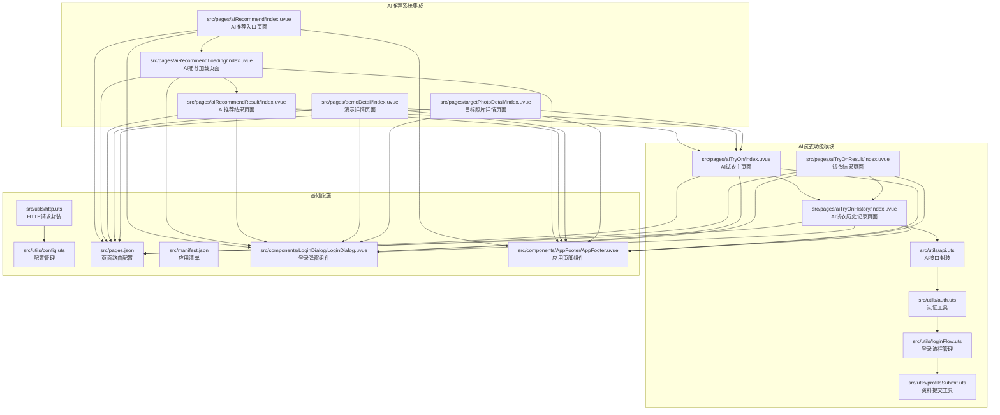

**图表来源**
- [src/pages/aiTryOn/index.uvue:1-749](file://src/pages/aiTryOn/index.uvue#L1-L749)
- [src/pages/aiTryOnResult/index.uvue:1-383](file://src/pages/aiTryOnResult/index.uvue#L1-L383)
- [src/pages/aiTryOnHistory/index.uvue:1-382](file://src/pages/aiTryOnHistory/index.uvue#L1-L382)
- [src/pages/aiRecommend/index.uvue:1-452](file://src/pages/aiRecommend/index.uvue#L1-L452)
- [src/pages/aiRecommendLoading/index.uvue:1-235](file://src/pages/aiRecommendLoading/index.uvue#L1-L235)
- [src/pages/aiRecommendResult/index.uvue:1-275](file://src/pages/aiRecommendResult/index.uvue#L1-L275)
- [src/pages/demoDetail/index.uvue:1-983](file://src/pages/demoDetail/index.uvue#L1-L983)
- [src/pages/targetPhotoDetail/index.uvue:1-469](file://src/pages/targetPhotoDetail/index.uvue#L1-L469)

**章节来源**
- [src/pages/aiTryOn/index.uvue:1-749](file://src/pages/aiTryOn/index.uvue#L1-L749)
- [src/pages/aiTryOnResult/index.uvue:1-383](file://src/pages/aiTryOnResult/index.uvue#L1-L383)
- [src/pages/aiTryOnHistory/index.uvue:1-382](file://src/pages/aiTryOnHistory/index.uvue#L1-L382)
- [src/pages/aiRecommend/index.uvue:1-452](file://src/pages/aiRecommend/index.uvue#L1-L452)
- [src/pages/aiRecommendLoading/index.uvue:1-235](file://src/pages/aiRecommendLoading/index.uvue#L1-L235)
- [src/pages/aiRecommendResult/index.uvue:1-275](file://src/pages/aiRecommendResult/index.uvue#L1-L275)
- [src/pages/demoDetail/index.uvue:1-983](file://src/pages/demoDetail/index.uvue#L1-L983)
- [src/pages/targetPhotoDetail/index.uvue:1-469](file://src/pages/targetPhotoDetail/index.uvue#L1-L469)

## 核心组件

AI试衣功能由三个主要页面和一系列工具模块组成：

### 主要页面组件

1. **AI试衣主页面** (`src/pages/aiTryOn/index.uvue`)
   - 模板轮播展示
   - 用户参数选择（体型、年龄）
   - 照片上传功能
   - 生成按钮控制
   - **新增**：性别参数接收和模板过滤支持
   - **新增**：微信登录弹窗和手机号授权
   - **新增**：头像昵称完善流程
   - **增强**：增强的模板过滤参数（shopId、category、subCategory、gender）
   - **新增**：照片上传状态指示器，提供实时上传进度反馈
   - **新增**：自动上传机制，优化用户上传体验
   - **更新**：集成统一登录状态检查，在照片选择前自动验证登录状态并显示登录弹窗

2. **试衣结果页面** (`src/pages/aiTryOnResult/index.uvue`)
   - 任务状态轮询
   - 结果图片展示
   - 保存到相册功能
   - 错误处理机制
   - **优化**：导航标题动态管理
   - **更新**：UI样式优化和加载提示调整

3. **AI试衣历史记录页面** (`src/pages/aiTryOnHistory/index.uvue`)
   - **新增**：用户试衣历史查询
   - **新增**：历史记录列表展示
   - **新增**：历史记录删除功能
   - **新增**：历史记录详情查看
   - **优化**：与主页面的导航集成
   - **更新**：改进API响应处理，支持多种成功码格式（0和200）

4. **AI推荐入口页面** (`src/pages/aiRecommend/index.uvue`)
   - **新增**：AI智能推荐功能入口
   - **新增**：照片上传和分析启动
   - **新增**：登录状态检查和用户认证

5. **AI推荐加载页面** (`src/pages/aiRecommendLoading/index.uvue`)
   - **新增**：AI分析任务轮询
   - **新增**：加载状态和超时处理
   - **新增**：失败重试机制

6. **AI推荐结果页面** (`src/pages/aiRecommendResult/index.uvue`)
   - **新增**：AI分析结果展示
   - **新增**：推荐风格列表
   - **新增**：性别筛选和模板跳转
   - **新增**：与AI试衣功能的无缝集成

7. **演示详情页面** (`src/pages/demoDetail/index.uvue`)
   - **新增**：tryonDisabled标志支持
   - **新增**：条件渲染AI试衣按钮
   - **新增**：智能显示/隐藏AI试衣功能

8. **目标照片详情页面** (`src/pages/targetPhotoDetail/index.uvue`)
   - **新增**：tryonDisabled标志支持
   - **新增**：条件渲染AI试衣悬浮按钮
   - **新增**：智能显示/隐藏AI试衣功能

### 工具模块

1. **API封装** (`src/utils/api.uts`)
   - AI模板获取（**增强**：支持category、sub_category、gender参数）
   - 照片上传处理
   - 任务提交和查询
   - **新增**：历史记录管理接口
   - **新增**：微信登录接口
   - **新增**：手机号绑定接口
   - **新增**：样式参数支持接口
   - **新增**：AI推荐接口
   - **更新**：改进API响应处理，支持多种成功码格式（0和200）

2. **认证管理** (`src/utils/auth.uts`)
   - Token管理
   - 用户信息存储
   - 登录状态检查
   - **新增**：用户信息合并功能

3. **HTTP请求** (`src/utils/http.uts`)
   - 统一请求处理
   - 自动认证头添加
   - 错误处理机制

4. **登录流程管理** (`src/utils/loginFlow.uts`)
   - **新增**：runPhoneLogin三步登录流程
   - 微信登录凭证获取
   - 手机号绑定处理
   - 用户信息完善

5. **资料提交工具** (`src/utils/profileSubmit.uts`)
   - **新增**：头像昵称提交处理
   - 用户信息更新接口

### 登录弹窗组件

1. **登录对话框** (`src/components/LoginDialog/LoginDialog.uvue`)
   - **新增**：统一的登录弹窗组件
   - 用户协议和隐私政策展示
   - 手机号授权按钮
   - 头像昵称完善表单

### 应用页脚组件

1. **应用页脚** (`src/components/AppFooter/AppFooter.uvue`)
   - **新增**：导航栏组件
   - AI试衣、历史记录、我的页面导航
   - 统一的底部导航样式

**章节来源**
- [src/pages/aiTryOn/index.uvue:155-452](file://src/pages/aiTryOn/index.uvue#L155-L452)
- [src/pages/aiTryOnResult/index.uvue:60-230](file://src/pages/aiTryOnResult/index.uvue#L60-L230)
- [src/pages/aiTryOnHistory/index.uvue:1-382](file://src/pages/aiTryOnHistory/index.uvue#L1-L382)
- [src/pages/aiRecommend/index.uvue:1-452](file://src/pages/aiRecommend/index.uvue#L1-L452)
- [src/pages/aiRecommendLoading/index.uvue:1-235](file://src/pages/aiRecommendLoading/index.uvue#L1-L235)
- [src/pages/aiRecommendResult/index.uvue:1-275](file://src/pages/aiRecommendResult/index.uvue#L1-L275)
- [src/pages/demoDetail/index.uvue:1-983](file://src/pages/demoDetail/index.uvue#L1-L983)
- [src/pages/targetPhotoDetail/index.uvue:1-469](file://src/pages/targetPhotoDetail/index.uvue#L1-L469)
- [src/utils/api.uts:332-503](file://src/utils/api.uts#L332-L503)
- [src/utils/loginFlow.uts:1-100](file://src/utils/loginFlow.uts#L1-L100)

## 架构概览

AI试衣功能采用分层架构设计，确保功能模块的清晰分离和可维护性：

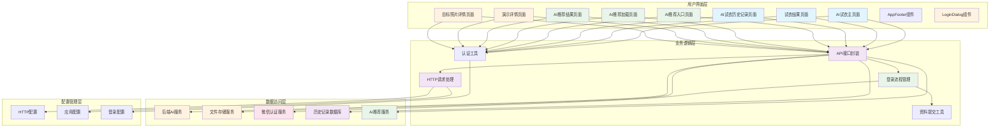

**图表来源**
- [src/pages/aiTryOn/index.uvue:144-147](file://src/pages/aiTryOn/index.uvue#L144-L147)
- [src/pages/aiTryOnResult/index.uvue:58](file://src/pages/aiTryOnResult/index.uvue#L58)
- [src/pages/aiTryOnHistory/index.uvue:1-382](file://src/pages/aiTryOnHistory/index.uvue#L1-L382)
- [src/pages/aiRecommend/index.uvue:1-452](file://src/pages/aiRecommend/index.uvue#L1-L452)
- [src/pages/aiRecommendLoading/index.uvue:1-235](file://src/pages/aiRecommendLoading/index.uvue#L1-L235)
- [src/pages/aiRecommendResult/index.uvue:1-275](file://src/pages/aiRecommendResult/index.uvue#L1-L275)
- [src/pages/demoDetail/index.uvue:1-983](file://src/pages/demoDetail/index.uvue#L1-L983)
- [src/pages/targetPhotoDetail/index.uvue:1-469](file://src/pages/targetPhotoDetail/index.uvue#L1-L469)
- [src/utils/api.uts:1-5](file://src/utils/api.uts#L1-L5)

## 详细组件分析

### AI试衣主页面组件分析

AI试衣主页面实现了完整的用户交互流程，包括模板选择、参数配置、任务提交和微信认证。

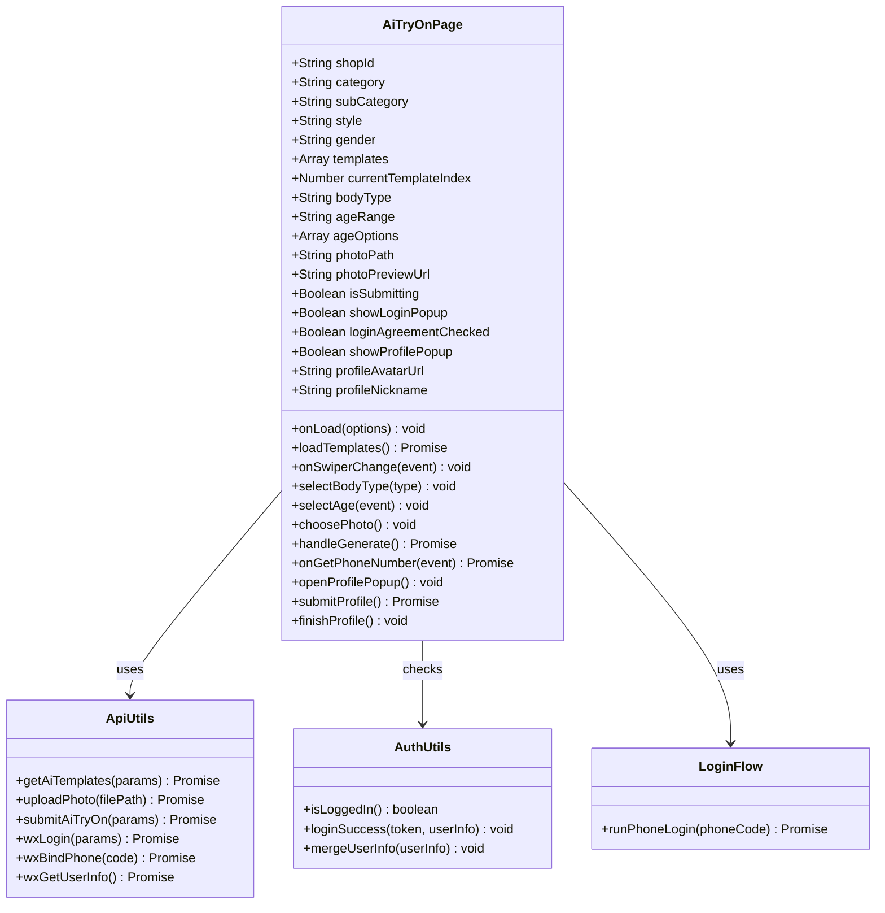

**图表来源**
- [src/pages/aiTryOn/index.uvue:155-452](file://src/pages/aiTryOn/index.uvue#L155-L452)
- [src/utils/api.uts:332-428](file://src/utils/api.uts#L332-L428)
- [src/utils/auth.uts:125-128](file://src/utils/auth.uts#L125-L128)
- [src/utils/loginFlow.uts:1-100](file://src/utils/loginFlow.uts#L1-L100)

#### 核心功能流程

1. **模板加载流程**
   ```mermaid
sequenceDiagram
participant User as 用户
participant Page as AI试衣页面
participant API as API封装
participant Server as 后端服务器
User->>Page : 打开页面
Page->>Page : 解析URL参数shopId/category/subCategory/gender/style
Page->>API : getAiTemplates(params)
API->>Server : GET /api/aiface/templates?gender={gender}&style={style}
Server-->>API : 模板列表数据
API-->>Page : 返回模板数组
Page->>Page : 渲染模板轮播
```

2. **统一登录状态检查流程**
   ```mermaid
sequenceDiagram
participant User as 用户
participant Page as AI试衣页面
participant Auth as 认证工具
participant LoginFlow as 登录流程
participant WeChat as 微信登录
participant API as API接口
User->>Page : 点击照片选择
Page->>Auth : 检查登录状态
Auth-->>Page : 未登录
Page->>Page : 显示登录弹窗
User->>Page : 授权手机号
Page->>LoginFlow : runPhoneLogin(phoneCode)
LoginFlow->>WeChat : 获取微信登录凭证
WeChat-->>LoginFlow : 返回code
LoginFlow->>API : wxLogin({code})
API->>Server : POST /api/wx/login
Server-->>API : 返回token和用户信息
API-->>LoginFlow : 用户信息
LoginFlow->>Auth : loginSuccess(token, userInfo)
LoginFlow->>API : wxBindPhone(phoneCode)
API->>Server : POST /api/wx/bindPhone
Server-->>API : 返回绑定结果
API-->>LoginFlow : 用户信息含头像昵称
LoginFlow-->>Page : 登录成功
Page->>Page : 关闭登录弹窗
```

3. **任务提交流程**
   ```mermaid
sequenceDiagram
participant User as 用户
participant Page as AI试衣页面
participant Auth as 认证工具
participant Upload as 照片上传
participant Task as 任务提交
participant Server as 后端服务器
participant Result as 结果页面
User->>Page : 点击生成按钮
Page->>Auth : 检查登录状态
Auth-->>Page : 已登录
Page->>Upload : 上传照片
Upload->>Server : POST /api/aiface/upload
Server-->>Upload : 返回文件名
Upload-->>Page : 文件名
Page->>Task : 提交AI试衣任务
Task->>Server : POST /api/aiface/tasks
Server-->>Task : 返回任务ID
Task-->>Page : 任务ID
Page->>Result : 跳转到结果页面
```

**更新** 新增了完整的微信认证系统，实现了三步登录流程和头像昵称完善功能。**新增**：照片上传状态指示器提供实时上传进度反馈，自动上传机制优化用户上传体验。**更新**：AI试衣页面集成统一登录状态检查，在照片选择前自动验证登录状态并显示登录弹窗。**新增**：性别参数支持和模板过滤功能。

**章节来源**
- [src/pages/aiTryOn/index.uvue:181-306](file://src/pages/aiTryOn/index.uvue#L181-L306)
- [src/utils/api.uts:387-428](file://src/utils/api.uts#L387-L428)
- [src/utils/loginFlow.uts:1-100](file://src/utils/loginFlow.uts#L1-L100)

### 试衣结果页面组件分析

试衣结果页面负责处理AI生成任务的状态轮询和结果展示。

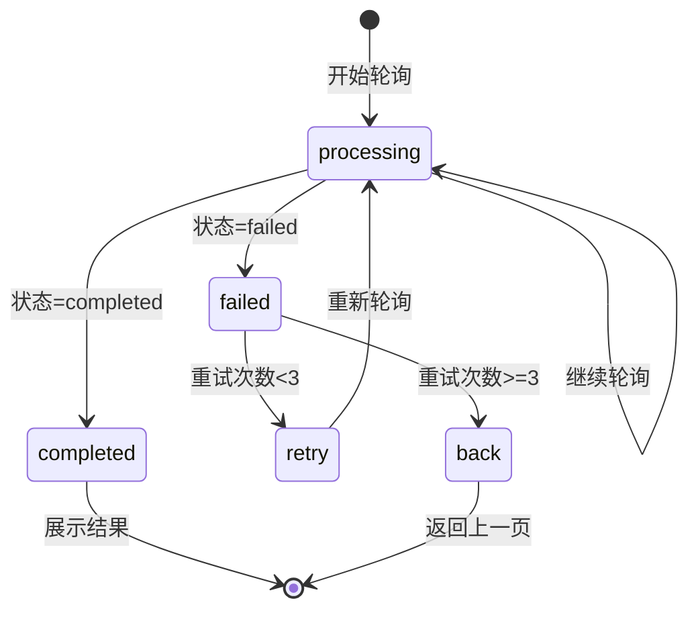

**图表来源**
- [src/pages/aiTryOnResult/index.uvue:84-141](file://src/pages/aiTryOnResult/index.uvue#L84-L141)

#### 轮询机制分析

试衣结果页面实现了智能的任务状态轮询机制：

1. **定时器管理**
   - 20秒间隔轮询任务状态
   - 180秒超时保护机制
   - 页面卸载时自动清理定时器

2. **状态处理逻辑**
   - `pending`/`processing`: 继续轮询
   - `completed`: 显示结果图片并更新导航标题
   - `failed`: 显示错误状态

3. **API响应处理优化**
   ```mermaid
flowchart TD
Start([开始轮询]) --> CallAPI[调用getAiTryOnResult]
CallAPI --> CheckCode{检查响应码}
CheckCode --> |code===0或200| CheckStatus{检查任务状态}
CheckCode --> |其他| HandleError[处理错误]
CheckStatus --> |completed| ShowResult[显示结果]
CheckStatus --> |failed| ShowFailed[显示失败]
CheckStatus --> |pending/processing| ContinuePolling[继续轮询]
ShowResult --> UpdateTitle[更新导航标题]
UpdateTitle --> End([结束])
ShowFailed --> End
ContinuePolling --> CallAPI
HandleError --> End
```

4. **图片处理流程**
   ```mermaid
flowchart TD
Start([开始保存]) --> CheckURL{"结果URL是否为HTTP?"}
CheckURL --> |是| Download[下载网络图片]
CheckURL --> |否| SaveDirect[直接保存]
Download --> Save[保存到相册]
SaveDirect --> Save
Save --> Success[保存成功]
Save --> Permission{权限检查}
Permission --> |需要授权| OpenSetting[打开设置]
Permission --> |权限拒绝| ShowError[显示错误]
OpenSetting --> End([结束])
ShowError --> End
Success --> End
```

**更新** 导航标题动态管理，在任务完成后自动更新为"AI试衣结果"。**更新**：改进API响应处理，支持多种成功码格式（0和200）；结果页面进行UI样式优化和加载提示调整。

**章节来源**
- [src/pages/aiTryOnResult/index.uvue:84-229](file://src/pages/aiTryOnResult/index.uvue#L84-L229)

### AI试衣历史记录页面组件分析

AI试衣历史记录页面提供了用户试衣历史的查询和管理功能。

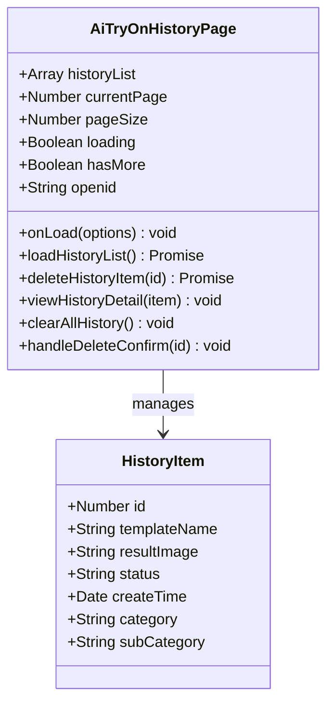

**图表来源**
- [src/pages/aiTryOnHistory/index.uvue:1-382](file://src/pages/aiTryOnHistory/index.uvue#L1-L382)

#### 历史记录功能流程

1. **历史记录加载流程**
   ```mermaid
sequenceDiagram
participant User as 用户
participant HistoryPage as 历史记录页面
participant API as API封装
participant Server as 后端服务器
User->>HistoryPage : 打开历史记录页面
HistoryPage->>HistoryPage : 获取openid
HistoryPage->>API : getAiTasks(openid)
API->>Server : GET /api/aiface/tasks
Server-->>API : 历史记录列表
API-->>HistoryPage : 返回历史记录数组
HistoryPage->>HistoryPage : 渲染历史记录列表
```

2. **历史记录删除流程**
   ```mermaid
sequenceDiagram
participant User as 用户
participant HistoryPage as 历史记录页面
participant API as API封装
participant Server as 后端服务器
User->>HistoryPage : 点击删除按钮
HistoryPage->>HistoryPage : 显示确认对话框
User->>HistoryPage : 确认删除
HistoryPage->>API : deleteAiTask(id)
API->>Server : DELETE /api/aiface/tasks/{id}
Server-->>API : 删除成功
API-->>HistoryPage : 返回删除成功
HistoryPage->>HistoryPage : 更新列表显示
```

3. **历史记录详情查看流程**
   ```mermaid
sequenceDiagram
participant User as 用户
participant HistoryPage as 历史记录页面
participant ResultPage as 结果页面
User->>HistoryPage : 点击历史记录项
HistoryPage->>ResultPage : 跳转到结果页面
ResultPage->>ResultPage : 加载对应任务状态
```

**新增** AI试衣历史记录页面提供了完整的用户试衣历史查询、删除和查看详情功能。**更新**：改进API响应处理，支持多种成功码格式（0和200）。

**章节来源**
- [src/pages/aiTryOnHistory/index.uvue:1-382](file://src/pages/aiTryOnHistory/index.uvue#L1-L382)

### API接口封装分析

AI试衣功能的API封装提供了完整的后端接口调用能力：

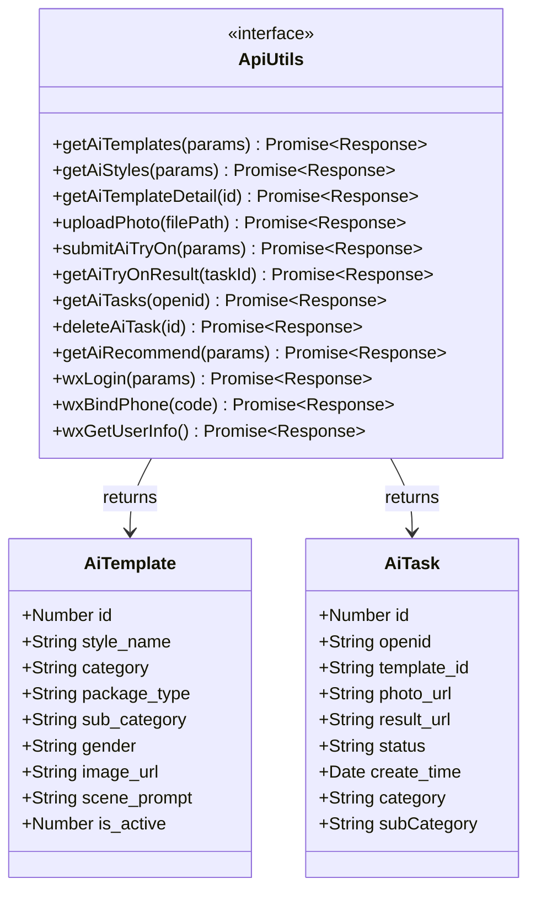

**图表来源**
- [src/utils/api.uts:316-326](file://src/utils/api.uts#L316-326)
- [src/utils/api.uts:332-458](file://src/utils/api.uts#L332-458)

#### 接口类型定义

AI试衣功能使用了专门的数据模型定义：

1. **AI模板接口** (`AiTemplate`)
   - 模板基本信息（ID、名称、分类）
   - 图片URL和场景描述
   - 性别和激活状态
   - **新增**：category和sub_category字段

2. **AI任务接口** (`AiTask`)
   - 任务基本信息（ID、用户ID、模板ID）
   - 照片和结果图片URL
   - 状态枚举（pending/processing/completed/failed）
   - 创建时间
   - **新增**：category和subCategory字段支持
   - **新增**：历史记录管理功能

3. **微信认证接口**
   - **新增**：wxLogin接口用于微信登录
   - **新增**：wxBindPhone接口用于手机号绑定
   - **新增**：wxGetUserInfo接口用于获取用户信息

**更新** 接口参数和返回值增加了对category和sub_category的支持，提升了模板筛选的精确度。新增了微信认证相关接口和历史记录管理接口。**新增**：样式参数支持接口，增强模板自定义能力。**更新**：改进API响应处理，支持多种成功码格式（0和200）。

**章节来源**
- [src/utils/api.uts:316-458](file://src/utils/api.uts#L316-458)

## AI试衣历史记录页面

AI试衣历史记录页面是新增的核心功能模块，为用户提供了完整的试衣历史管理能力。

### 历史记录数据模型

历史记录页面使用了专门的数据模型来管理试衣历史：

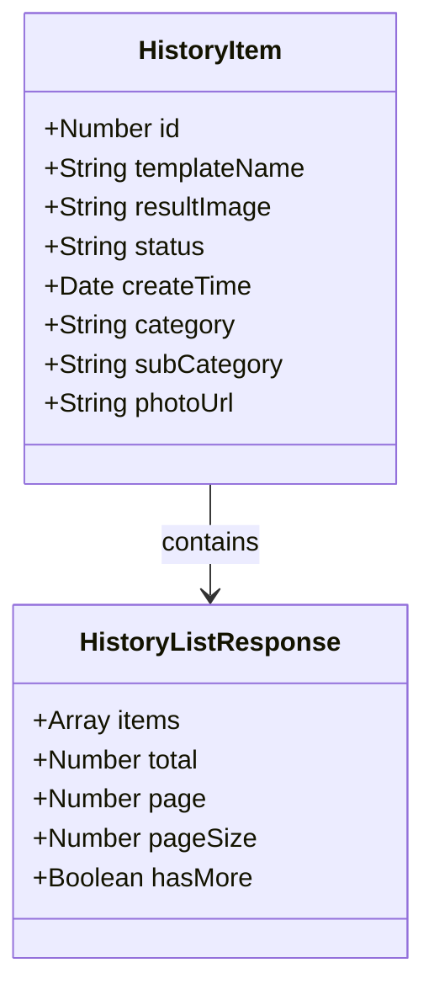

**图表来源**
- [src/pages/aiTryOnHistory/index.uvue:1-382](file://src/pages/aiTryOnHistory/index.uvue#L1-L382)

### 核心功能特性

1. **历史记录查询**
   - 支持分页加载历史记录
   - 按创建时间排序显示
   - 支持历史记录总数统计

2. **历史记录管理**
   - 单条历史记录删除
   - 批量删除功能
   - 清空所有历史记录

3. **历史记录详情**
   - 查看历史试衣结果
   - 重新查看试衣模板
   - 复制分享历史记录

4. **用户界面设计**
   - 列表式布局展示
   - 状态标识和时间显示
   - 操作按钮和确认对话框

### 历史记录页面流程

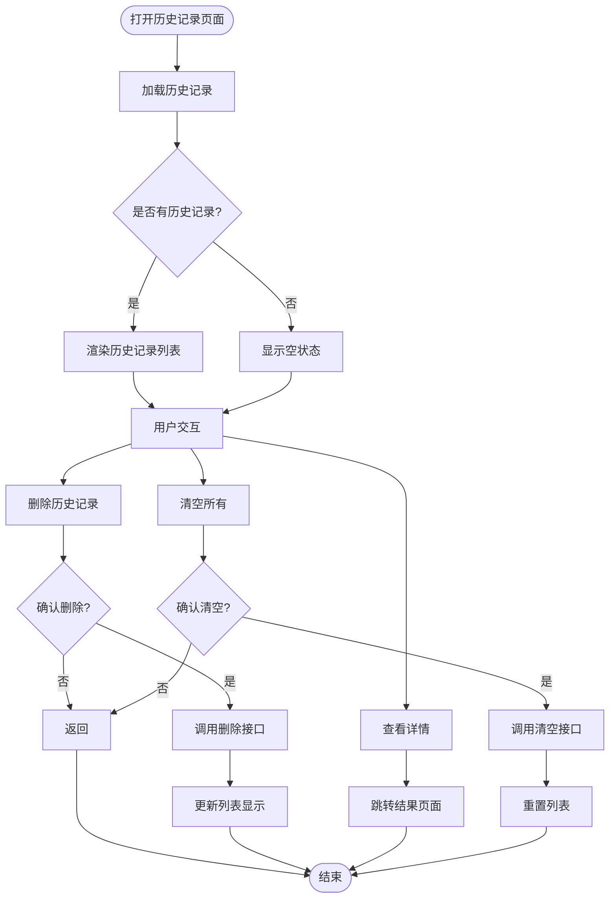

**图表来源**
- [src/pages/aiTryOnHistory/index.uvue:1-382](file://src/pages/aiTryOnHistory/index.uvue#L1-L382)

**新增** AI试衣历史记录页面提供了完整的用户试衣历史查询、删除和管理功能，增强了用户体验和功能完整性。**更新**：改进API响应处理，支持多种成功码格式（0和200）。

**章节来源**
- [src/pages/aiTryOnHistory/index.uvue:1-382](file://src/pages/aiTryOnHistory/index.uvue#L1-L382)

## 微信认证系统

微信认证系统是AI试衣功能的重要组成部分，实现了完整的用户身份验证和信息完善流程。

### 三步登录流程

runPhoneLogin函数实现了微信认证的三步登录流程：

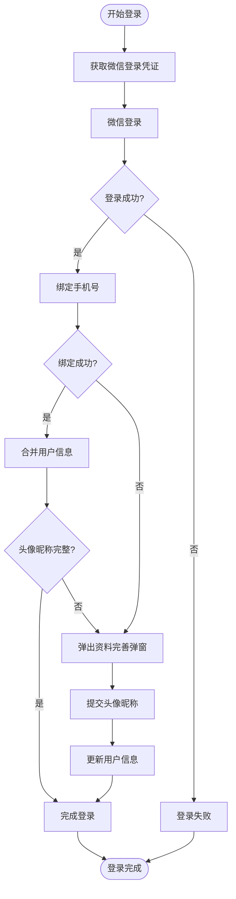

**图表来源**
- [src/utils/loginFlow.uts:1-100](file://src/utils/loginFlow.uts#L1-L100)

### 登录弹窗组件

登录弹窗组件提供了统一的用户交互界面：

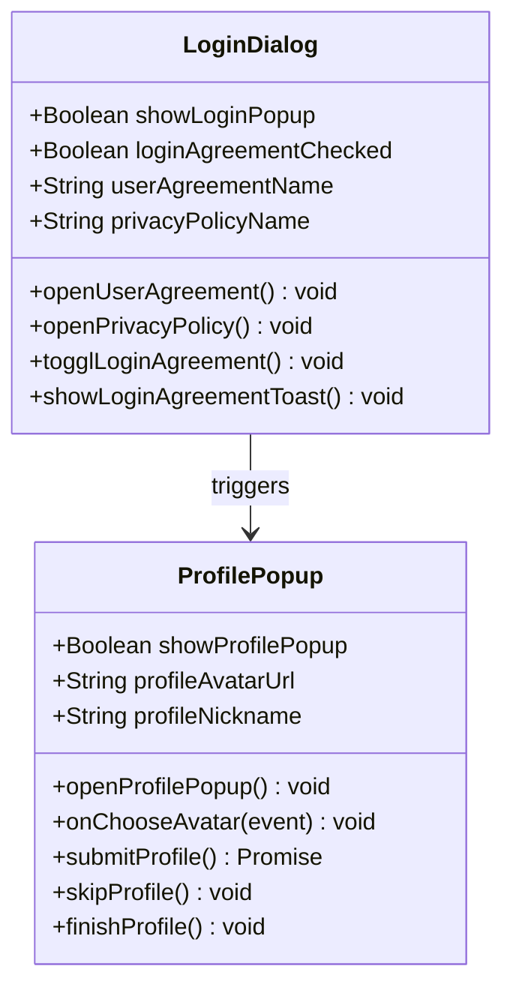

**图表来源**
- [src/components/LoginDialog/LoginDialog.uvue:1-200](file://src/components/LoginDialog/LoginDialog.uvue#L1-L200)

### 用户协议和隐私政策

系统集成了用户协议和隐私政策的展示功能：

1. **用户协议展示**
   - 点击协议名称查看详细内容
   - 支持内嵌网页展示
   - 合规要求满足

2. **隐私政策展示**
   - 详细的隐私条款说明
   - 数据收集和使用范围
   - 用户权利保障

**更新** 新增了完整的微信认证系统，包括登录弹窗、手机号授权、头像昵称完善流程和runPhoneLogin三步登录流程。

**章节来源**
- [src/utils/loginFlow.uts:1-100](file://src/utils/loginFlow.uts#L1-L100)
- [src/components/LoginDialog/LoginDialog.uvue:1-200](file://src/components/LoginDialog/LoginDialog.uvue#L1-L200)

## **新增**：AI推荐系统集成

AI推荐系统与AI试衣功能的无缝集成是该版本的重要更新，实现了从AI分析到AI试衣的完整用户流程闭环。

### 集成架构

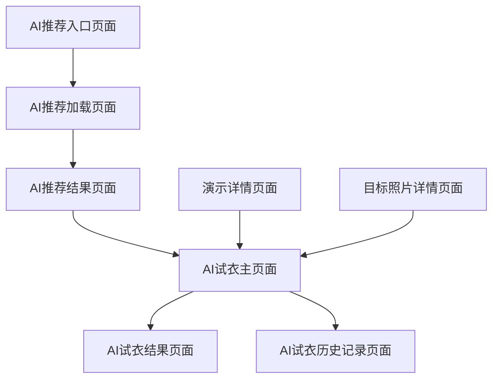

**图表来源**
- [src/pages/aiRecommend/index.uvue:1-452](file://src/pages/aiRecommend/index.uvue#L1-L452)
- [src/pages/aiRecommendLoading/index.uvue:1-235](file://src/pages/aiRecommendLoading/index.uvue#L1-L235)
- [src/pages/aiRecommendResult/index.uvue:1-275](file://src/pages/aiRecommendResult/index.uvue#L1-L275)
- [src/pages/aiTryOn/index.uvue:1-749](file://src/pages/aiTryOn/index.uvue#L1-L749)
- [src/pages/aiTryOnResult/index.uvue:1-383](file://src/pages/aiTryOnResult/index.uvue#L1-L383)
- [src/pages/aiTryOnHistory/index.uvue:1-382](file://src/pages/aiTryOnHistory/index.uvue#L1-L382)
- [src/pages/demoDetail/index.uvue:1-983](file://src/pages/demoDetail/index.uvue#L1-L983)
- [src/pages/targetPhotoDetail/index.uvue:1-469](file://src/pages/targetPhotoDetail/index.uvue#L1-L469)

### 性别参数传递机制

AI推荐系统与AI试衣功能通过性别参数实现无缝集成：

1. **AI推荐结果页面** (`src/pages/aiRecommendResult/index.uvue`)
   - 解析AI分析结果中的性别信息
   - 将性别转换为英文格式（male/female）
   - 跳转到AI试衣页面时携带gender参数

2. **AI试衣主页面** (`src/pages/aiTryOn/index.uvue`)
   - 接收gender参数并存储到本地状态
   - 在加载模板时将gender参数传递给API
   - 实现性别相关的模板过滤

3. **API接口支持** (`src/utils/api.uts`)
   - getAiTemplates接口支持gender参数
   - 后端根据性别返回相应的模板列表

### tryonDisabled标志支持

demoDetail和targetPhotoDetail页面实现了智能的AI试衣按钮显示控制：

1. **演示详情页面** (`src/pages/demoDetail/index.uvue`)
   - 检查item.tryonDisabled !== true条件
   - 条件渲染AI试衣标签按钮
   - 支持搜索模式和分类模式的智能显示

2. **目标照片详情页面** (`src/pages/targetPhotoDetail/index.uvue`)
   - 检查detail?.tryonDisabled !== true条件
   - 条件渲染AI试衣悬浮按钮
   - 结合loading状态避免闪烁

### 集成流程图

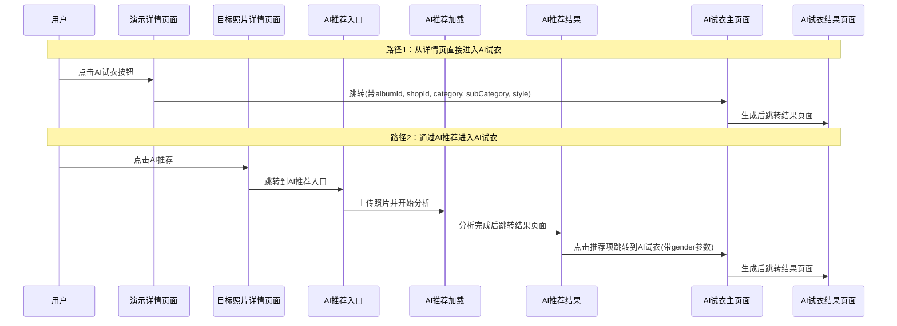

**图表来源**
- [src/pages/demoDetail/index.uvue:595-605](file://src/pages/demoDetail/index.uvue#L595-L605)
- [src/pages/targetPhotoDetail/index.uvue:367-373](file://src/pages/targetPhotoDetail/index.uvue#L367-L373)
- [src/pages/aiRecommend/index.uvue:606-610](file://src/pages/aiRecommend/index.uvue#L606-L610)
- [src/pages/aiRecommendLoading/index.uvue:98-100](file://src/pages/aiRecommendLoading/index.uvue#L98-L100)
- [src/pages/aiRecommendResult/index.uvue:111-113](file://src/pages/aiRecommendResult/index.uvue#L111-L113)
- [src/pages/aiTryOn/index.uvue:192-210](file://src/pages/aiTryOn/index.uvue#L192-L210)

### 条件渲染逻辑

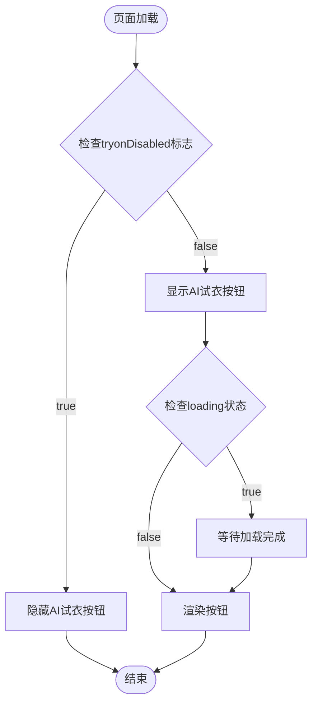

**图表来源**
- [src/pages/demoDetail/index.uvue:62-64](file://src/pages/demoDetail/index.uvue#L62-L64)
- [src/pages/demoDetail/index.uvue:124-131](file://src/pages/demoDetail/index.uvue#L124-L131)
- [src/pages/targetPhotoDetail/index.uvue:51-52](file://src/pages/targetPhotoDetail/index.uvue#L51-L52)

**新增** AI推荐系统与AI试衣功能实现了无缝集成，支持性别参数传递和条件渲染逻辑。demoDetail和targetPhotoDetail页面根据tryonDisabled标志动态显示AI试衣按钮，提供了智能化的用户交互体验。

**章节来源**
- [src/pages/aiRecommend/index.uvue:1-452](file://src/pages/aiRecommend/index.uvue#L1-L452)
- [src/pages/aiRecommendLoading/index.uvue:1-235](file://src/pages/aiRecommendLoading/index.uvue#L1-L235)
- [src/pages/aiRecommendResult/index.uvue:1-275](file://src/pages/aiRecommendResult/index.uvue#L1-L275)
- [src/pages/aiTryOn/index.uvue:192-210](file://src/pages/aiTryOn/index.uvue#L192-L210)
- [src/pages/demoDetail/index.uvue:62-64](file://src/pages/demoDetail/index.uvue#L62-L64)
- [src/pages/demoDetail/index.uvue:124-131](file://src/pages/demoDetail/index.uvue#L124-L131)
- [src/pages/targetPhotoDetail/index.uvue:51-52](file://src/pages/targetPhotoDetail/index.uvue#L51-L52)

## 依赖关系分析

AI试衣功能的依赖关系体现了清晰的分层架构：

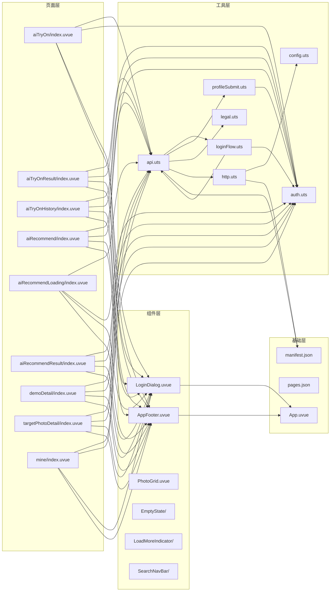

**图表来源**
- [src/pages/aiTryOn/index.uvue:144-147](file://src/pages/aiTryOn/index.uvue#L144-L147)
- [src/pages/aiTryOnResult/index.uvue:58](file://src/pages/aiTryOnResult/index.uvue#L58)
- [src/pages/aiTryOnHistory/index.uvue:1-382](file://src/pages/aiTryOnHistory/index.uvue#L1-L382)
- [src/pages/aiRecommend/index.uvue:1-452](file://src/pages/aiRecommend/index.uvue#L1-L452)
- [src/pages/aiRecommendLoading/index.uvue:1-235](file://src/pages/aiRecommendLoading/index.uvue#L1-L235)
- [src/pages/aiRecommendResult/index.uvue:1-275](file://src/pages/aiRecommendResult/index.uvue#L1-L275)
- [src/pages/demoDetail/index.uvue:1-983](file://src/pages/demoDetail/index.uvue#L1-L983)
- [src/pages/targetPhotoDetail/index.uvue:1-469](file://src/pages/targetPhotoDetail/index.uvue#L1-L469)
- [src/utils/api.uts:1-5](file://src/utils/api.uts#L1-L5)

### 关键依赖关系

1. **页面到工具的依赖**
   - AI试衣页面依赖API封装进行数据操作
   - 结果页面依赖API封装进行状态查询
   - 历史记录页面依赖API封装进行历史记录管理
   - **新增**：AI推荐相关页面依赖API封装进行AI分析操作
   - **新增**：演示详情和目标照片详情页面支持AI试衣功能集成
   - 个人中心页面依赖认证工具进行用户状态检查
   - 所有页面都依赖登录流程管理进行微信认证

2. **工具层内部依赖**
   - API封装依赖HTTP请求处理和认证工具
   - 登录流程管理依赖API封装和认证工具
   - 资料提交工具依赖认证工具和API封装
   - HTTP请求处理依赖配置管理和认证工具
   - 配置管理提供统一的环境配置

3. **组件依赖**
   - 登录弹窗组件被多个页面复用
   - 全局页脚组件提供统一的底部导航
   - 各种UI组件提供一致的用户体验

4. **配置依赖**
   - 页面路由配置定义页面访问路径
   - 应用清单配置应用基本信息
   - 登录配置管理认证相关设置

**更新** 新增了AI试衣历史记录页面的依赖关系，优化了导航系统集成，新增了登录流程管理和资料提交工具的依赖关系。**新增**：AI推荐系统集成相关的依赖关系，包括AI推荐入口、加载和结果页面的依赖。**更新**：改进API响应处理，支持多种成功码格式（0和200）。

**章节来源**
- [src/pages.json:56-66](file://src/pages.json#L56-L66)
- [src/manifest.json:1-73](file://src/manifest.json#L1-L73)

## 性能考虑

AI试衣功能在性能方面采用了多项优化策略：

### 1. 图片处理优化
- 照片上传前进行大小限制（10MB）
- 使用压缩格式减少传输体积
- 结果图片懒加载，提升首屏性能

### 2. 网络请求优化
- 统一的请求头管理，包含认证信息
- 自动超时处理和错误重试机制
- **优化**：轮询间隔合理设置（20秒），避免过度请求

### 3. 内存管理
- 页面卸载时自动清理定时器
- 及时释放图片资源
- 避免内存泄漏

### 4. 用户体验优化
- 加载状态反馈
- 错误处理和重试机制
- 本地缓存用户选择的参数
- **新增**：智能参数解析和验证
- **新增**：登录状态预检查，避免不必要的登录弹窗
- **新增**：历史记录分页加载，提升大数据量下的性能
- **新增**：照片上传状态指示器，提供实时上传进度反馈
- **新增**：自动上传机制，优化用户上传体验
- **更新**：统一登录状态检查，提升用户体验

### 5. 认证流程优化
- **新增**：runPhoneLogin三步登录流程，减少重复请求
- **新增**：登录状态检查，避免重复登录
- **新增**：头像昵称完善流程，提升用户体验

### 6. 历史记录优化
- **新增**：分页加载历史记录，避免一次性加载大量数据
- **新增**：历史记录缓存机制，提升重复访问性能
- **新增**：批量操作支持，减少多次请求开销
- **更新**：改进API响应处理，支持多种成功码格式（0和200）

### 7. **新增**：样式参数优化
- **新增**：样式参数缓存机制，提升模板切换性能
- **新增**：参数验证和默认值处理，减少无效请求
- **新增**：模板过滤优化，提升搜索效率

### 8. **更新**：API响应处理优化
- **更新**：支持多种成功码格式（0和200），提升兼容性
- **更新**：改进错误处理机制，提供更准确的错误提示
- **更新**：优化轮询机制，减少不必要的请求

### 9. **更新**：UI样式优化
- **更新**：结果页面UI样式优化，提升视觉体验
- **更新**：加载提示调整，提供更清晰的状态反馈
- **更新**：状态遮罩和动画效果优化

### 10. **新增**：AI推荐系统集成优化
- **新增**：AI分析结果缓存，避免重复分析
- **新增**：性别参数智能传递，减少不必要的请求
- **新增**：tryonDisabled标志预检查，优化页面渲染性能
- **新增**：条件渲染优化，减少DOM操作开销

### 11. **新增**：跨页面数据传递优化
- **新增**：URL参数编码优化，提升数据传输效率
- **新增**：页面间状态同步，避免数据不一致
- **新增**：路由参数验证，减少错误处理开销

**更新** 新增了微信认证系统的性能优化策略，包括三步登录流程和状态检查机制。新增了历史记录页面的性能优化，包括分页加载和缓存机制。**新增**：照片上传状态指示器和自动上传机制的性能优化策略。**更新**：API响应处理优化，支持多种成功码格式（0和200）；结果页面进行UI样式优化和加载提示调整。**新增**：AI推荐集成的性能优化策略，包括结果缓存和条件渲染优化。

## 故障排除指南

### 常见问题及解决方案

#### 1. 登录状态问题
**症状**: 无法提交AI试衣任务
**原因**: 用户未登录或Token过期
**解决方法**: 
- 检查登录状态：`isLoggedIn()`
- 重新登录获取新的Token
- 检查Token存储是否正常
- **新增**：检查微信登录凭证有效性
- **更新**：统一登录状态检查，避免重复登录

#### 2. 照片上传失败
**症状**: 照片上传后无法继续
**原因**: 文件大小超限或格式不支持
**解决方法**:
- 检查文件大小是否超过10MB限制
- 确认图片格式为支持的格式
- 重新选择照片进行上传
- **新增**：检查上传状态指示器是否正常显示
- **更新**：自动上传机制优化，提升上传成功率

#### 3. 任务状态轮询失败
**症状**: 结果页面长时间显示加载状态
**原因**: 网络连接问题或服务器异常
**解决方法**:
- 检查网络连接状态
- 等待一段时间后重试
- 查看服务器状态和API响应
- **更新**：改进API响应处理，支持多种成功码格式（0和200）

#### 4. 图片保存失败
**症状**: 保存到相册时出现权限错误
**解决方法**:
- 引导用户授权相册访问权限
- 打开系统设置手动开启权限
- 检查iOS/Android系统版本兼容性

#### 5. **新增**：微信登录失败
**症状**: 登录弹窗无法关闭或登录状态异常
**原因**: 微信登录凭证获取失败或服务器认证异常
**解决方法**:
- 检查微信登录凭证获取是否成功
- 验证微信登录接口响应
- 确认用户授权状态
- 重新尝试登录流程

#### 6. **新增**：手机号授权失败
**症状**: 用户授权手机号但无法继续
**原因**: 微信授权失败或手机号绑定异常
**解决方法**:
- 检查微信授权状态
- 验证phoneCode的有效性
- 确认手机号绑定接口调用
- 重新进行手机号授权

#### 7. **新增**：头像昵称完善失败
**症状**: 弹出头像昵称完善弹窗但无法提交
**原因**: 用户信息提交失败或权限不足
**解决方法**:
- 检查头像和昵称输入是否符合要求
- 验证用户信息提交接口
- 确认用户授权状态
- 重新尝试提交流程

#### 8. **新增**：模板过滤失效
**症状**: 模板列表显示不正确
**原因**: 参数传递或解析错误
**解决方法**:
- 检查URL参数格式（shopId、category、subCategory）
- 验证参数类型转换（shopId必须为数字）
- 确认后端接口支持相应的过滤条件

#### 9. **新增**：历史记录加载失败
**症状**: 历史记录页面空白或加载失败
**原因**: 网络请求异常或用户未登录
**解决方法**:
- 检查网络连接状态
- 验证用户登录状态
- 确认openid参数正确传递
- 重新加载历史记录
- **更新**：改进API响应处理，支持多种成功码格式（0和200）

#### 10. **新增**：历史记录删除失败
**症状**: 删除历史记录后仍然显示
**原因**: 删除接口调用失败或前端状态未更新
**解决方法**:
- 检查删除接口响应
- 验证删除权限
- 手动刷新页面查看更新
- 重新尝试删除操作

#### 11. **新增**：样式参数应用失败
**症状**: 模板样式参数无法应用
**原因**: 参数格式错误或接口调用失败
**解决方法**:
- 检查样式参数格式是否符合要求
- 验证参数类型和范围
- 确认样式参数接口调用
- 重新尝试应用参数

#### 12. **新增**：自动上传功能异常
**症状**: 照片自动上传失败或中断
**原因**: 网络波动或上传状态异常
**解决方法**:
- 检查网络连接稳定性
- 验证上传状态指示器显示
- 确认自动上传触发条件
- 重新尝试手动上传

#### 13. **新增**：API响应处理异常
**症状**: API调用返回错误或状态不正确
**原因**: 成功码格式不匹配或响应数据异常
**解决方法**:
- 检查API响应中的code字段
- 验证是否支持多种成功码格式（0和200）
- 确认响应数据结构是否符合预期
- 重新调用API接口

#### 14. **新增**：结果页面UI显示异常
**症状**: 结果页面布局错乱或状态显示不正确
**原因**: UI样式冲突或状态更新异常
**解决方法**:
- 检查CSS样式是否正确加载
- 验证状态变量更新逻辑
- 确认图片加载和显示逻辑
- 重新加载页面或清理缓存

#### 15. **新增**：AI推荐集成问题
**症状**: AI推荐结果无法正常跳转到AI试衣
**原因**: 性别参数传递错误或页面跳转失败
**解决方法**:
- 检查AI推荐结果中的性别信息
- 验证gender参数是否正确传递
- 确认AI试衣页面是否正确接收参数
- 检查页面路由配置

#### 16. **新增**：性别参数过滤失效
**症状**: AI试衣模板未按性别过滤
**原因**: gender参数未正确传递或后端不支持
**解决方法**:
- 检查AI推荐结果页面的gender参数设置
- 验证AI试衣主页面是否正确接收gender参数
- 确认getAiTemplates接口是否支持gender参数
- 检查后端模板数据是否包含性别信息

#### 17. **新增**：tryonDisabled标志问题
**症状**: AI试衣按钮显示或隐藏异常
**原因**: tryonDisabled标志判断逻辑错误
**解决方法**:
- 检查demoDetail页面中item.tryonDisabled的值
- 验证targetPhotoDetail页面中detail?.tryonDisabled的值
- 确认条件渲染逻辑是否正确执行
- 检查后端返回的数据结构

#### 18. **新增**：跨页面数据丢失
**症状**: 从AI推荐跳转到AI试衣时参数丢失
**原因**: URL参数编码或解码错误
**解决方法**:
- 检查encodeURIComponent的使用
- 验证decodeURIComponent的解码
- 确认参数传递的完整性
- 添加参数验证和错误处理

**更新** 新增了微信认证系统相关的故障排除指导，包括登录失败、手机号授权失败和头像昵称完善失败等问题的解决方案。新增了历史记录页面相关的故障排除指导。**新增**：样式参数应用失败和自动上传功能异常的故障排除指导。**更新**：API响应处理异常和结果页面UI显示异常的故障排除指导。**新增**：AI推荐集成、性别参数过滤、tryonDisabled标志和跨页面数据传递的故障排除指导。

**章节来源**
- [src/pages/aiTryOn/index.uvue:243-306](file://src/pages/aiTryOn/index.uvue#L243-L306)
- [src/pages/aiTryOnResult/index.uvue:159-223](file://src/pages/aiTryOnResult/index.uvue#L159-L223)
- [src/pages/aiTryOnHistory/index.uvue:1-382](file://src/pages/aiTryOnHistory/index.uvue#L1-L382)
- [src/pages/aiRecommend/index.uvue:1-452](file://src/pages/aiRecommend/index.uvue#L1-L452)
- [src/pages/aiRecommendLoading/index.uvue:1-235](file://src/pages/aiRecommendLoading/index.uvue#L1-L235)
- [src/pages/aiRecommendResult/index.uvue:1-275](file://src/pages/aiRecommendResult/index.uvue#L1-L275)
- [src/pages/demoDetail/index.uvue:1-983](file://src/pages/demoDetail/index.uvue#L1-L983)
- [src/pages/targetPhotoDetail/index.uvue:1-469](file://src/pages/targetPhotoDetail/index.uvue#L1-L469)
- [src/utils/loginFlow.uts:1-100](file://src/utils/loginFlow.uts#L1-L100)

## 结论

AI试衣功能展现了现代小程序开发的最佳实践，具有以下特点：

### 技术优势
1. **架构清晰**: 分层设计确保了代码的可维护性和可扩展性
2. **用户体验**: 完整的加载状态反馈和错误处理机制
3. **性能优化**: 合理的资源管理和网络请求策略
4. **安全性**: 完善的认证和授权机制
5. **合规性**: 符合微信小程序认证要求的完整登录流程
6. **功能完整性**: 支持多种服饰模板选择、用户友好的参数配置界面、实时的任务状态轮询、结果图片的便捷保存功能
7. **历史记录管理**: 新增的AI试衣历史记录页面提供了完整的试衣历史查询和管理功能
8. **模板过滤增强**: 支持category和subCategory参数，提升了模板筛选的精确度
9. **参数处理优化**: 改进了shopId参数处理机制，增强了参数解析和验证逻辑
10. **微信认证集成**: 完整的三步登录流程，包括微信登录、手机号授权、头像昵称完善
11. **上传体验优化**: **新增**：照片上传状态指示器提供实时上传进度反馈，自动上传机制优化用户上传体验
12. **样式定制增强**: **新增**：样式参数支持增强模板自定义能力
13. **API响应优化**: **更新**：改进API响应处理，支持多种成功码格式（0和200）
14. **UI体验优化**: **更新**：结果页面进行UI样式优化和加载提示调整
15. **登录状态检查**: **更新**：AI试衣页面集成统一登录状态检查，在照片选择前自动验证登录状态并显示登录弹窗
16. **AI推荐集成**: **新增**：AI试衣功能与AI推荐系统实现无缝集成，支持性别参数传递和条件渲染逻辑

### 功能完整性
- 支持多种服饰模板选择
- 用户友好的参数配置界面
- 实时的任务状态轮询
- 结果图片的便捷保存功能
- **新增**：多维度模板过滤支持
- **新增**：微信认证登录系统
- **新增**：头像昵称完善流程
- **新增**：AI试衣历史记录管理
- **新增**：历史记录查询和删除功能
- **新增**：照片上传状态指示器
- **新增**：自动上传机制
- **新增**：样式参数支持
- **新增**：AI推荐系统集成
- **新增**：性别参数传递和模板过滤
- **新增**：tryonDisabled标志支持
- **更新**：统一登录状态检查
- **更新**：API响应处理优化
- **更新**：UI样式优化

### 可扩展性
该架构为未来的功能扩展提供了良好的基础，可以轻松添加新的AI服务、改进用户界面或增加更多个性化功能。微信认证系统的引入为后续的用户运营和数据分析奠定了坚实的基础。AI试衣历史记录页面的加入进一步增强了用户粘性和功能完整性。**新增**：上传体验优化和样式参数支持为后续的功能扩展提供了技术基础。**更新**：API响应处理优化和UI体验优化为后续的功能迭代提供了更好的技术基础。**新增**：AI推荐系统集成和性别参数支持为后续的智能推荐功能扩展提供了技术基础。

通过合理的组件划分和清晰的依赖关系，AI试衣功能不仅满足了当前的业务需求，也为后续的功能演进和合规要求提供了坚实的技术基础。**新增**：上传体验优化和样式参数支持的引入进一步提升了用户满意度和功能完整性。**更新**：API响应处理优化和UI体验优化的引入进一步提升了系统的稳定性和用户体验。**新增**：AI推荐集成的引入进一步提升了系统的智能化水平和用户体验。